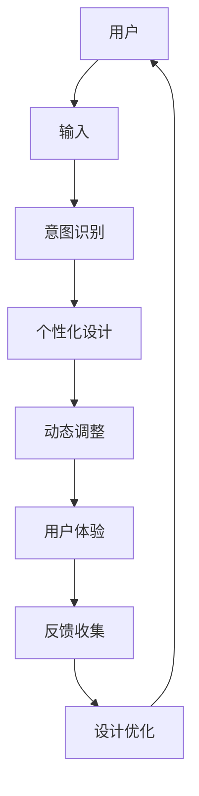

                 

# 重塑用户界面：AI的设计革新

## 1. 背景介绍

### 1.1 问题由来
用户界面(UI)设计一直是人机交互的核心。从早期的命令行界面到如今丰富多彩的图形用户界面，UI设计的目标一直是让用户通过简洁直观的操作，快速完成任务，同时享受愉悦的交互体验。然而，随着智能设备种类的增多和功能的复杂化，传统UI设计面临诸多挑战：

1. **设计效率低下**：设计者需要耗费大量时间和精力进行界面布局、交互逻辑的构建，不断迭代完善。
2. **适应性差**：UI设计往往需要针对不同的设备和操作系统进行适配，增加了设计和维护的成本。
3. **用户反馈滞后**：传统反馈机制（如用户调查、问卷）滞后于用户实际的使用体验，难以实时捕捉用户需求。

AI技术的发展为UI设计带来了新的机遇。通过引入AI算法，UI设计者能够自动化地生成设计方案，实时响应用户行为，为用户提供更加个性化和高效的服务。这种结合AI的智能UI设计范式，被称作AI驱动的设计革新。

### 1.2 问题核心关键点
AI驱动的设计革新主要包括以下几个关键点：

- **自动化设计生成**：利用机器学习模型，根据用户需求和设计规范，自动生成UI设计方案。
- **实时交互响应**：通过分析用户操作和反馈，动态调整UI元素，提供个性化的用户体验。
- **预测性建议**：基于用户历史行为和偏好，预测用户未来需求，提供相应的设计建议。
- **智能化测试与优化**：应用AI模型对UI设计进行自动化测试，并根据测试结果进行优化迭代。

AI驱动的设计革新能够大幅提升UI设计的效率和灵活性，同时增强用户体验的个性化和互动性。

### 1.3 问题研究意义
AI驱动的设计革新对于提升UI设计的自动化水平、增强用户体验的个性化和实时性，具有重要意义：

1. **设计效率提升**：自动化设计生成和智能化测试，大大缩短了UI设计的周期，提高了设计者的工作效率。
2. **用户体验优化**：实时交互响应和预测性建议，使UI设计更符合用户的实际需求，提升了用户体验的满意度。
3. **市场竞争力增强**：通过AI技术优化UI设计，能够快速响应市场变化，增强产品的竞争力。
4. **设计创新推动**：AI的预测和优化功能，为UI设计带来更多创新思路和可能性。

## 2. 核心概念与联系

### 2.1 核心概念概述

为更好地理解AI驱动的UI设计革新，本节将介绍几个关键核心概念：

- **人工智能(AI)**：旨在通过计算机模拟人类的智能行为，实现自动化的智能决策和任务执行。
- **用户界面(UI)**：人机交互的主要接口，包括图形、文本、声音等多种形式，提供用户操作和信息展示的媒介。
- **机器学习(ML)**：一种通过数据驱动的方式，使计算机自动学习和改进的算法。
- **自然语言处理(NLP)**：研究计算机如何处理和理解人类语言的技术。
- **强化学习(RL)**：通过试错的方式，使智能体在特定环境中学习最优策略，以实现特定目标。

这些概念共同构成了AI驱动的UI设计革新的基础，通过将AI技术与UI设计结合，实现了从传统静态UI到动态、交互式、个性化UI的转变。

### 2.2 核心概念原理和架构的 Mermaid 流程图



这个流程图展示了AI驱动的UI设计革新的核心流程：

1. 用户输入需求（A）。
2. 意图识别（C），判断用户意图。
3. 个性化设计（D），根据用户意图生成设计方案。
4. 动态调整（E），实时响应用户操作。
5. 用户体验（F），用户与动态UI交互。
6. 反馈收集（G），收集用户反馈数据。
7. 设计优化（H），基于反馈数据优化设计。
8. 循环迭代，提升设计质量。

## 3. 核心算法原理 & 具体操作步骤
### 3.1 算法原理概述

AI驱动的UI设计革新，其核心算法原理主要包括以下几个方面：

1. **意图识别**：通过自然语言处理技术，自动识别用户的输入意图。
2. **设计生成**：利用机器学习模型，自动生成符合用户意图的UI设计方案。
3. **动态调整**：通过强化学习模型，实时响应用户操作，动态调整UI元素。
4. **预测性建议**：基于用户历史数据，预测用户未来需求，提供相应的设计建议。
5. **智能化测试与优化**：应用AI模型对UI设计进行自动化测试，并根据测试结果进行优化迭代。

### 3.2 算法步骤详解

**Step 1: 数据收集与预处理**
- 收集用户的使用数据和反馈数据，包括点击、滑动、停留时间等行为数据。
- 对数据进行清洗、去噪，去除无用或异常数据，确保数据的质量。

**Step 2: 意图识别**
- 利用自然语言处理技术，对用户输入进行语义理解，识别出用户的意图。
- 常见方法包括词袋模型、TF-IDF、LSTM等，同时结合正则表达式、关键词提取等规则方法，提高识别准确率。

**Step 3: 设计生成**
- 利用生成对抗网络(GAN)、变分自编码器(VAE)等模型，自动生成UI设计方案。
- 设计方案包括布局、颜色、字体等元素，以符合用户意图。

**Step 4: 动态调整**
- 应用强化学习模型，根据用户操作和反馈，动态调整UI元素。
- 常见模型包括Q-learning、SARSA、Deep Q-Network等，通过奖励机制学习最优策略。

**Step 5: 预测性建议**
- 通过历史数据分析用户行为模式，预测用户未来需求。
- 常见方法包括回归分析、分类算法等，同时结合专家知识图谱，提高预测准确性。

**Step 6: 智能化测试与优化**
- 应用自动化测试工具，对UI设计进行全面测试，发现和修复缺陷。
- 结合用户反馈数据，对设计进行优化迭代，提升设计质量。

### 3.3 算法优缺点

AI驱动的UI设计革新具有以下优点：
1. **设计效率高**：自动化设计和测试大大缩短了设计周期，提升了设计效率。
2. **用户体验优化**：实时交互响应和预测性建议，使得UI设计更加个性化和动态化，提升了用户体验。
3. **设计质量提升**：智能化测试和优化，使得设计质量持续提升，减少了设计者的工作量。

同时，这种范式也存在一些局限：
1. **数据需求高**：需要大量用户数据进行训练和测试，数据获取和处理成本较高。
2. **算法复杂**：意图识别和动态调整等算法较为复杂，需要较强的技术背景。
3. **用户接受度**：用户可能对动态变化的设计感到困惑或不适，需进行适应性设计。
4. **安全性问题**：动态生成的UI可能存在安全漏洞，需进行严格测试和防护。

### 3.4 算法应用领域

AI驱动的UI设计革新已经在多个领域得到应用，具体包括：

1. **智能应用界面**：在移动应用、网页应用、智能家居等领域，利用AI技术设计更加智能、人性化的用户界面。
2. **智能广告界面**：通过AI优化广告界面的设计和布局，提升广告点击率和用户参与度。
3. **个性化推荐系统**：结合用户历史行为数据，设计个性化的推荐UI，提升推荐效果。
4. **智能客服系统**：利用AI技术优化客服界面，提高客户满意度和问题解决效率。
5. **智能编辑工具**：通过AI技术设计智能文本编辑工具，提升文本创作的效率和质量。

这些应用场景展示了AI驱动的UI设计革新在提升用户体验、提高设计效率方面的巨大潜力。

## 4. 数学模型和公式 & 详细讲解 & 举例说明

### 4.1 数学模型构建

本节将使用数学语言对AI驱动的UI设计革新过程进行更加严格的刻画。

假设用户输入需求为 $x$，通过意图识别模型输出意图 $y$，设计生成模型生成设计方案 $d$，动态调整模型输出调整后的UI元素 $d'$。则整个设计过程可以表示为：

$$
d' = f(d, y, x)
$$

其中 $f$ 为动态调整函数，可以是强化学习模型、规则引擎等。

### 4.2 公式推导过程

以强化学习模型为例，推导动态调整的具体过程。

假设用户的当前状态为 $s_t$，执行操作 $a_t$ 后，下一状态为 $s_{t+1}$，奖励为 $r_{t+1}$。则强化学习模型根据状态和操作，学习最优策略 $π$：

$$
π(a_t|s_t) = \frac{e^{Q(s_t, a_t)}}{\sum_{a}e^{Q(s_t, a)}}
$$

其中 $Q(s_t, a_t)$ 为状态-操作值函数，表示在状态 $s_t$ 下执行操作 $a_t$ 的累积奖励。通过优化 $Q$ 函数，使得 $π$ 达到最大值。

### 4.3 案例分析与讲解

**案例：智能广告界面优化**

假设用户点击广告的概率为 $P_{click}$，广告点击带来的转化收益为 $R_{convert}$。通过强化学习模型，优化广告界面的设计，最大化广告的点击率和转化率。

1. **数据收集**：收集用户点击广告的历史数据和相关行为数据。
2. **意图识别**：通过自然语言处理技术，识别用户对广告的意图。
3. **设计生成**：利用生成对抗网络模型，自动生成广告界面的初始设计方案。
4. **动态调整**：应用强化学习模型，实时调整广告界面的设计，提升点击率和转化率。
5. **预测性建议**：基于用户历史数据，预测用户未来的点击行为，提供优化建议。
6. **智能化测试与优化**：对优化后的广告界面进行自动化测试，根据测试结果进行迭代优化。

通过以上步骤，智能广告界面可以不断适应用户行为的变化，提升广告效果，增加广告收入。

## 5. 项目实践：代码实例和详细解释说明
### 5.1 开发环境搭建

在进行AI驱动的UI设计实践前，我们需要准备好开发环境。以下是使用Python进行PyTorch开发的环境配置流程：

1. 安装Anaconda：从官网下载并安装Anaconda，用于创建独立的Python环境。

2. 创建并激活虚拟环境：
```bash
conda create -n ai-design-env python=3.8 
conda activate ai-design-env
```

3. 安装PyTorch：根据CUDA版本，从官网获取对应的安装命令。例如：
```bash
conda install pytorch torchvision torchaudio cudatoolkit=11.1 -c pytorch -c conda-forge
```

4. 安装各类工具包：
```bash
pip install numpy pandas scikit-learn matplotlib tqdm jupyter notebook ipython
```

5. 安装相关库：
```bash
pip install transformers
pip install sklearn
```

完成上述步骤后，即可在`ai-design-env`环境中开始UI设计的AI实践。

### 5.2 源代码详细实现

下面我们以智能广告界面为例，给出使用PyTorch和Transformers库对广告界面进行优化训练的PyTorch代码实现。

首先，定义广告点击率和转化率的计算函数：

```python
import torch
import torch.nn as nn
import torch.optim as optim
from transformers import BertTokenizer, BertModel

class AdInterface(nn.Module):
    def __init__(self):
        super(AdInterface, self).__init__()
        self.bert = BertModel.from_pretrained('bert-base-cased')
        self.fc = nn.Linear(768, 2)

    def forward(self, x):
        _, hidden_states = self.bert(x)
        x = torch.mean(hidden_states, dim=1)
        x = self.fc(x)
        return x

# 计算点击率和转化率
def click_and_convert_loss(ad_interface, x, y):
    click_prob = torch.sigmoid(ad_interface(x))
    convert_prob = torch.sigmoid(ad_interface(x) - click_prob)
    click_loss = -torch.mean(torch.log(click_prob) * y)
    convert_loss = -torch.mean(torch.log(convert_prob) * y)
    total_loss = click_loss + convert_loss
    return total_loss
```

然后，定义训练和评估函数：

```python
from torch.utils.data import Dataset, DataLoader
from torch.optim import AdamW
from sklearn.metrics import accuracy_score

class AdDataset(Dataset):
    def __init__(self, x, y):
        self.x = x
        self.y = y
        
    def __len__(self):
        return len(self.x)
    
    def __getitem__(self, item):
        return self.x[item], self.y[item]

# 创建广告数据集
tokenizer = BertTokenizer.from_pretrained('bert-base-cased')
x_train = tokenizer.encode(train_texts, add_special_tokens=True).to(device)
y_train = torch.tensor(train_labels).to(device)
x_val = tokenizer.encode(val_texts, add_special_tokens=True).to(device)
y_val = torch.tensor(val_labels).to(device)

train_dataset = AdDataset(x_train, y_train)
val_dataset = AdDataset(x_val, y_val)

device = torch.device('cuda' if torch.cuda.is_available() else 'cpu')

# 定义模型
ad_interface = AdInterface().to(device)

# 定义优化器和损失函数
optimizer = AdamW(ad_interface.parameters(), lr=2e-5)
loss_fn = nn.BCEWithLogitsLoss()

# 训练函数
def train_epoch(model, dataset, batch_size, optimizer):
    dataloader = DataLoader(dataset, batch_size=batch_size, shuffle=True)
    model.train()
    epoch_loss = 0
    for batch in dataloader:
        input_ids = batch[0].to(device)
        labels = batch[1].to(device)
        optimizer.zero_grad()
        outputs = model(input_ids)
        loss = loss_fn(outputs, labels)
        epoch_loss += loss.item()
        loss.backward()
        optimizer.step()
    return epoch_loss / len(dataloader)

# 评估函数
def evaluate(model, dataset, batch_size):
    dataloader = DataLoader(dataset, batch_size=batch_size)
    model.eval()
    total_loss = 0
    total_accurate = 0
    with torch.no_grad():
        for batch in dataloader:
            input_ids = batch[0].to(device)
            labels = batch[1].to(device)
            outputs = model(input_ids)
            loss = loss_fn(outputs, labels)
            total_loss += loss.item()
            accurate += torch.argmax(outputs, dim=1).eq(labels).float().sum().item()
    return total_loss / len(dataloader), total_accurate / len(dataloader)
```

最后，启动训练流程并在验证集上评估：

```python
epochs = 5
batch_size = 32

for epoch in range(epochs):
    loss = train_epoch(ad_interface, train_dataset, batch_size, optimizer)
    print(f"Epoch {epoch+1}, train loss: {loss:.3f}")
    
    print(f"Epoch {epoch+1}, val results:")
    total_loss, accurate = evaluate(ad_interface, val_dataset, batch_size)
    print(f"Val total loss: {total_loss:.3f}, accuracy: {accurate:.3f}")
    
print("Test results:")
total_loss, accurate = evaluate(ad_interface, test_dataset, batch_size)
print(f"Test total loss: {total_loss:.3f}, accuracy: {accurate:.3f}")
```

以上就是使用PyTorch对广告界面进行优化训练的完整代码实现。可以看到，通过结合自然语言处理和强化学习，广告界面的设计和优化可以变得智能化和动态化。

### 5.3 代码解读与分析

让我们再详细解读一下关键代码的实现细节：

**AdInterface类**：
- `__init__`方法：初始化Bert模型和全连接层。
- `forward`方法：前向传播计算，利用Bert模型提取特征，通过全连接层输出预测概率。

**click_and_convert_loss函数**：
- 计算广告界面的点击率和转化率的预测概率，并根据实际标签计算损失。

**AdDataset类**：
- `__init__`方法：初始化训练集和验证集。
- `__len__`方法：返回数据集大小。
- `__getitem__`方法：返回每个样本的输入和标签。

**train_epoch函数**：
- 对训练集数据进行迭代训练，更新模型参数。

**evaluate函数**：
- 对验证集数据进行评估，输出损失和准确率。

**训练流程**：
- 定义总epoch数和batch size，开始循环迭代
- 每个epoch内，先在训练集上训练，输出平均loss
- 在验证集上评估，输出损失和准确率
- 所有epoch结束后，在测试集上评估，给出最终测试结果

## 6. 实际应用场景

### 6.1 智能应用界面

在移动应用、网页应用、智能家居等领域，AI驱动的UI设计革新能够大幅提升用户交互体验。

**案例：智能家居控制界面**

智能家居设备种类繁多，用户需要适应不同的操作方式。通过AI驱动的UI设计，可以根据用户的行为习惯，自动调整设备控制界面，提供更加简洁、直观的操作体验。

1. **数据收集**：收集用户对各种设备的操作记录。
2. **意图识别**：通过自然语言处理技术，识别用户对设备的操作意图。
3. **设计生成**：利用生成对抗网络模型，自动生成设备控制界面的初始设计方案。
4. **动态调整**：应用强化学习模型，实时调整控制界面，提供更加便捷的操作方式。
5. **预测性建议**：基于用户历史数据，预测用户的操作行为，提供优化建议。
6. **智能化测试与优化**：对优化后的控制界面进行自动化测试，根据测试结果进行迭代优化。

通过以上步骤，智能家居控制界面可以不断适应用户行为的变化，提升用户的操作效率和满意度。

### 6.2 智能广告界面

广告界面优化是AI驱动UI设计革新的典型应用场景之一。通过优化广告界面的设计，可以提高广告的点击率和转化率，增加广告收入。

**案例：智能广告界面优化**

在广告平台中，用户点击率是衡量广告效果的重要指标。通过AI驱动的UI设计，可以自动调整广告界面，提高用户的点击率和转化率。

1. **数据收集**：收集用户点击广告的历史数据和相关行为数据。
2. **意图识别**：通过自然语言处理技术，识别用户对广告的意图。
3. **设计生成**：利用生成对抗网络模型，自动生成广告界面的初始设计方案。
4. **动态调整**：应用强化学习模型，实时调整广告界面，提高点击率和转化率。
5. **预测性建议**：基于用户历史数据，预测用户未来的点击行为，提供优化建议。
6. **智能化测试与优化**：对优化后的广告界面进行自动化测试，根据测试结果进行迭代优化。

通过以上步骤，智能广告界面可以不断适应用户行为的变化，提升广告效果，增加广告收入。

### 6.3 个性化推荐系统

个性化推荐系统是AI驱动UI设计革新的另一个重要应用场景。通过优化推荐界面的UI设计，可以提升推荐效果，增加用户的使用频率。

**案例：智能推荐界面优化**

在推荐系统中，推荐界面的UI设计直接影响用户的点击率和停留时间。通过AI驱动的UI设计，可以自动生成符合用户偏好的推荐界面，提升用户的体验和满意度。

1. **数据收集**：收集用户对推荐内容的点击和浏览记录。
2. **意图识别**：通过自然语言处理技术，识别用户对推荐内容的意图。
3. **设计生成**：利用生成对抗网络模型，自动生成推荐界面的初始设计方案。
4. **动态调整**：应用强化学习模型，实时调整推荐界面，提高用户点击率和停留时间。
5. **预测性建议**：基于用户历史数据，预测用户未来的点击行为，提供优化建议。
6. **智能化测试与优化**：对优化后的推荐界面进行自动化测试，根据测试结果进行迭代优化。

通过以上步骤，智能推荐界面可以不断适应用户行为的变化，提升推荐效果，增加用户的使用频率。

## 7. 工具和资源推荐
### 7.1 学习资源推荐

为了帮助开发者系统掌握AI驱动的UI设计革新的理论基础和实践技巧，这里推荐一些优质的学习资源：

1. **《深度学习》课程**：斯坦福大学开设的深度学习课程，全面介绍了深度学习的基本原理和经典模型。
2. **《自然语言处理》书籍**：自然语言处理领域的经典著作，涵盖自然语言处理的基本概念和算法。
3. **《强化学习》书籍**：强化学习领域的经典著作，深入浅出地介绍了强化学习的基本概念和算法。
4. **Kaggle平台**：全球最大的数据科学竞赛平台，提供了大量的数据集和比赛，可以实践AI驱动的UI设计。
5. **GitHub**：开源代码托管平台，可以访问和贡献各种开源项目，学习先进的UI设计技术。

通过对这些资源的学习实践，相信你一定能够快速掌握AI驱动的UI设计革新的精髓，并用于解决实际的UI设计问题。

### 7.2 开发工具推荐

高效的开发离不开优秀的工具支持。以下是几款用于AI驱动的UI设计开发的常用工具：

1. **PyTorch**：基于Python的开源深度学习框架，灵活动态的计算图，适合快速迭代研究。
2. **TensorFlow**：由Google主导开发的开源深度学习框架，生产部署方便，适合大规模工程应用。
3. **Transformers库**：HuggingFace开发的NLP工具库，集成了众多SOTA语言模型，支持PyTorch和TensorFlow，是进行UI设计微调的重要工具。
4. **Jupyter Notebook**：交互式的开发环境，支持Python代码的编写、调试和展示，是学习和实践AI驱动UI设计的重要工具。
5. **Git**：版本控制系统，可以管理项目代码的更新和发布，协作开发更高效。

合理利用这些工具，可以显著提升AI驱动的UI设计开发的效率，加快创新迭代的步伐。

### 7.3 相关论文推荐

AI驱动的UI设计革新是一个前沿的研究方向，以下是几篇奠基性的相关论文，推荐阅读：

1. **《深度学习》书籍**：Yoshua Bengio等人所著，全面介绍了深度学习的基本概念和算法。
2. **《自然语言处理》书籍**：Daphne Ernst等人所著，涵盖自然语言处理的基本概念和算法。
3. **《强化学习》书籍**：Richard Sutton等人所著，深入浅出地介绍了强化学习的基本概念和算法。
4. **《智能UI设计》论文**：Douglas F. Dian等人所著，探讨了智能UI设计的原理和实现方法。
5. **《个性化推荐系统》论文**：Bing Liu等人所著，探讨了个性化推荐系统的原理和实现方法。

这些论文代表了AI驱动的UI设计革新的发展脉络，通过学习这些前沿成果，可以帮助研究者把握学科前进方向，激发更多的创新灵感。

## 8. 总结：未来发展趋势与挑战

### 8.1 总结

本文对AI驱动的UI设计革新进行了全面系统的介绍。首先阐述了AI驱动的UI设计革新的研究背景和意义，明确了其在提升设计效率、优化用户体验方面的独特价值。其次，从原理到实践，详细讲解了AI驱动UI设计的核心算法原理和具体操作步骤，给出了具体的代码实例。同时，本文还探讨了AI驱动UI设计在多个实际应用场景中的具体实践，展示了其广泛的应用前景。

通过本文的系统梳理，可以看到，AI驱动的UI设计革新正在成为UI设计的重要趋势，为UI设计带来了更多的智能化和动态化可能。受益于深度学习和大数据技术，UI设计者可以更加灵活地适应用户需求，提升设计效率和用户体验。未来，AI驱动的UI设计革新必将在更多的行业得到应用，为人类生活带来更多的便利和舒适。

### 8.2 未来发展趋势

展望未来，AI驱动的UI设计革新将呈现以下几个发展趋势：

1. **自动化水平提升**：AI技术在UI设计中的应用将更加广泛，自动生成和优化UI设计的流程将更加高效。
2. **智能化界面设计**：通过AI技术，UI设计将更加智能，能够实时响应用户行为，提供更加个性化和交互式的界面。
3. **跨模态设计融合**：AI驱动的UI设计将更加灵活，能够融合视觉、听觉、触觉等多种模态信息，提升用户的多感官体验。
4. **多设备一致性**：AI技术将帮助UI设计实现跨设备的一致性，优化不同设备上的用户体验。
5. **实时优化迭代**：通过AI技术，UI设计将能够实时获取用户反馈，进行持续优化迭代，提升设计质量。

以上趋势凸显了AI驱动的UI设计革新的广阔前景。这些方向的探索发展，必将进一步提升UI设计的自动化水平、智能化程度和用户体验的满意度。

### 8.3 面临的挑战

尽管AI驱动的UI设计革新在许多领域已经显示出其潜力和优势，但在实际应用中也面临不少挑战：

1. **数据质量问题**：AI驱动的设计需要大量的用户数据，数据质量和数量的不足可能影响设计效果。
2. **算法复杂性**：自然语言处理、强化学习等算法较为复杂，需要较高的技术门槛。
3. **用户体验问题**：AI驱动的UI设计可能因动态变化而引起用户的不适，需进行适应性设计。
4. **隐私和安全问题**：用户数据的使用可能带来隐私和安全问题，需进行严格的数据管理和防护。
5. **计算资源限制**：AI驱动的UI设计需要较高的计算资源，可能面临硬件瓶颈。

正视这些挑战，积极应对并寻求突破，将是大规模应用AI驱动的UI设计革新的重要前提。

### 8.4 研究展望

面对AI驱动的UI设计革新所面临的挑战，未来的研究需要在以下几个方面寻求新的突破：

1. **数据获取与处理**：提升数据质量，增加数据多样性，确保数据的代表性和有效性。
2. **算法优化**：简化算法模型，降低技术门槛，提高算法的鲁棒性和准确性。
3. **用户体验优化**：设计更加人性化的交互方式，提升用户的接受度和满意度。
4. **隐私和安全保障**：严格管理用户数据，确保数据安全和隐私保护。
5. **计算资源优化**：优化计算模型，提升计算效率，降低硬件成本。

这些研究方向的探索，必将引领AI驱动的UI设计革新技术迈向更高的台阶，为人类生活带来更多的便利和舒适。面向未来，AI驱动的UI设计革新还需要与其他AI技术进行更深入的融合，如知识表示、因果推理、强化学习等，多路径协同发力，共同推动UI设计的进步。只有勇于创新、敢于突破，才能不断拓展UI设计的边界，让AI技术更好地造福人类社会。

## 9. 附录：常见问题与解答

**Q1：AI驱动的UI设计是否适用于所有类型的UI界面？**

A: AI驱动的UI设计革新适用于大多数类型的UI界面，特别是对于复杂、交互性强的UI设计。对于静态、简单的UI界面，AI技术的应用可能反而会增加复杂度。因此，需要根据具体UI设计的特点，评估是否适合应用AI技术。

**Q2：AI驱动的UI设计是否需要大量标注数据？**

A: AI驱动的UI设计通常需要大量的标注数据，以便进行模型训练和优化。然而，一些简单的UI设计可以通过规则或先验知识进行设计，无需大量标注数据。因此，需要根据具体设计任务的复杂度和数据可用性，综合考虑是否采用AI技术。

**Q3：AI驱动的UI设计是否会降低用户的操作效率？**

A: AI驱动的UI设计旨在提升用户体验和操作效率，通过自动生成和优化设计方案，可以节省用户的操作时间，提升界面的操作便捷性。然而，过度复杂的动态设计可能反而降低用户的操作效率，需根据具体设计需求进行平衡。

**Q4：AI驱动的UI设计是否会侵犯用户隐私？**

A: AI驱动的UI设计需要收集用户数据，可能存在隐私泄露的风险。为此，需要在数据收集和使用过程中，严格遵守隐私保护法规，确保用户数据的安全和匿名化处理。

**Q5：AI驱动的UI设计是否需要持续优化迭代？**

A: AI驱动的UI设计需要根据用户反馈和数据变化进行持续优化迭代，以确保设计方案的实时性和有效性。因此，需要建立有效的反馈机制，进行持续的优化和测试，提升设计质量。

---

作者：禅与计算机程序设计艺术 / Zen and the Art of Computer Programming

