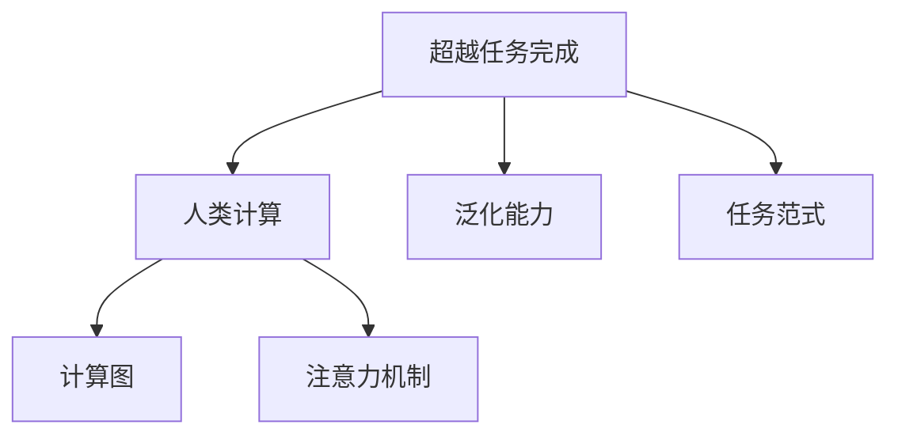

                 

# 重新想像人类计算：超越任务完成

> 关键词：超越任务完成,重新想像,计算范式,人类计算,深度学习,人工智能,自动驾驶,数字孪生,未来计算

## 1. 背景介绍

### 1.1 问题由来
近年来，人工智能(AI)技术迅速发展，深度学习(Deep Learning)已经成为当前最为热门的技术之一。其中，自动驾驶、数字孪生、机器人、智能系统等领域的AI应用取得了显著进展，并逐渐进入公众视野。然而，这些应用虽然展示了AI的强大潜力，但也暴露了其局限性。

**局限性主要体现在两个方面**：
1. **以任务为中心**：现有AI系统往往仅针对特定的任务进行优化，如自动驾驶只能完成特定的驾驶任务，智能系统只能在特定场景中运行，这种以任务为中心的设计方式，使其无法应对复杂多变的现实世界。
2. **计算资源瓶颈**：现有的AI系统大多依赖于高性能计算设备，如GPU、TPU等，这些设备价格昂贵，且能耗巨大，限制了AI系统的普及和应用。

这些问题催生了对现有计算范式的重新思考，如何在更广阔的视角下重新审视和设计AI系统，成为当前AI领域研究的热点。

### 1.2 问题核心关键点
重新想象人类计算的核心在于超越现有任务完成范式，探索一种更为通用、灵活、高效、安全的计算模型。这一范式的核心思想是**“以人为本”**，将计算能力视为人的延伸，而不是代替人的工作。这种新范式不仅能够提升AI系统的泛化能力，还能降低计算成本，促进AI技术的普及和应用。

这一问题研究的核心在于以下几个方面：
1. **超越任务范式**：突破现有的以特定任务为中心的设计思维，探索适用于更广泛任务的场景。
2. **提升泛化能力**：通过研究人类计算的本质，使AI系统具备更强的泛化能力，能够应对现实世界中的各种复杂情况。
3. **降低计算成本**：探索更高效的计算模型和算法，降低对高性能计算设备的依赖，实现更广泛的普及和应用。

## 2. 核心概念与联系

### 2.1 核心概念概述

为更好地理解“超越任务完成”这一新计算范式，本节将介绍几个密切相关的核心概念：

- **超越任务完成**：超越现有任务完成范式，探索一种更为通用、灵活、高效、安全的计算模型。这一新范式将计算能力视为人的延伸，而非代替人的工作。
- **人类计算**：将计算能力视为人的延伸，通过理解人类的认知和行为模式，设计更为自然、灵活、通用的计算模型。
- **泛化能力**：AI系统具备将所学知识应用于新情境的能力，即从已知推导未知。泛化能力强的AI系统能够适应各种变化，提升系统的鲁棒性和稳定性。
- **计算图**：一种表示计算过程的图形结构，常见于深度学习中。计算图描述了模型中各项计算任务的依赖关系，支持高效的并行计算。
- **注意力机制**：一种能够动态调整计算资源分配的机制，常见于Transformer等模型中。通过注意力机制，模型能够根据输入的不同部分，动态分配计算资源，提升计算效率。

这些核心概念之间的逻辑关系可以通过以下Mermaid流程图来展示：



这个流程图展示了新计算范式的核心概念及其之间的关系：

1. 超越任务完成通过研究人类计算的本质，突破现有任务范式。
2. 人类计算将计算能力视为人的延伸，关注人的认知和行为模式。
3. 泛化能力是超越任务完成的终极目标，使AI系统具备适应各种变化的弹性。
4. 计算图和注意力机制是实现超越任务完成的技术手段，提升计算效率和灵活性。

## 3. 核心算法原理 & 具体操作步骤
### 3.1 算法原理概述

超越任务完成的算法原理，本质上是一种基于深度学习的计算范式，其核心思想是**“以人为本”**，将计算能力视为人的延伸。这一范式的核心在于构建一种能够适应各种任务、具备泛化能力的AI系统。

形式化地，假设我们有一个通用的AI系统 $M_{\theta}$，其中 $\theta$ 为模型的参数。该系统能够执行多种任务，如自然语言理解、图像识别、机器人控制等。我们的目标是找到一组参数 $\hat{\theta}$，使得 $M_{\hat{\theta}}$ 能够高效地执行各种任务，并具备泛化能力。

具体来说，我们通过以下步骤实现这一目标：

1. **数据准备**：收集不同任务的数据集 $D$，划分为训练集、验证集和测试集。
2. **任务适配层设计**：根据不同任务，设计相应的任务适配层，将通用AI系统 $M_{\theta}$ 转化为适合特定任务的模型。
3. **泛化能力提升**：通过训练集 $D_{train}$ 对模型进行微调，提升其泛化能力。
4. **泛化测试**：在测试集 $D_{test}$ 上测试模型的泛化能力，评估其在新情境下的表现。

### 3.2 算法步骤详解

超越任务完成的算法步骤主要包括：

**Step 1: 数据准备**
- 收集不同任务的数据集 $D$，划分为训练集 $D_{train}$、验证集 $D_{val}$ 和测试集 $D_{test}$。
- 确保训练集和测试集在分布上尽可能接近，以避免过拟合。

**Step 2: 任务适配层设计**
- 根据不同任务，设计相应的任务适配层。例如，对于自然语言理解任务，可以添加一个语言模型作为适配层。
- 设计损失函数，用于衡量任务适配层在特定任务上的性能。

**Step 3: 微调训练**
- 使用训练集 $D_{train}$ 对模型进行微调，使用小批量随机梯度下降（SGD）或Adam等优化算法。
- 在验证集 $D_{val}$ 上评估模型性能，调整超参数，避免过拟合。

**Step 4: 泛化测试**
- 在测试集 $D_{test}$ 上测试模型的泛化能力，评估其在新情境下的表现。
- 使用交叉验证等方法，确保测试结果的可靠性。

### 3.3 算法优缺点

超越任务完成的算法具有以下优点：
1. **泛化能力强**：通过理解人类的认知和行为模式，设计更为自然、灵活的计算模型，能够适应各种任务。
2. **计算效率高**：使用计算图和注意力机制等技术，能够高效地执行各种任务，降低计算成本。
3. **灵活性高**：可以动态调整计算资源分配，应对各种变化，提升系统的鲁棒性和稳定性。
4. **安全性高**：基于人类计算模型，能够更好地理解人类的行为和决策，降低误判和恶意攻击的风险。

同时，这一算法也存在一定的局限性：
1. **数据需求高**：不同任务的数据集可能存在差异，需要大量高质量数据进行训练。
2. **计算复杂度高**：设计复杂的任务适配层和计算图，可能导致计算复杂度高，增加系统负担。
3. **模型解释性差**：基于深度学习的模型往往难以解释其内部工作机制，缺乏透明性。

尽管存在这些局限性，但就目前而言，超越任务完成范式代表了未来AI发展的方向，具有广阔的研究前景。

### 3.4 算法应用领域

超越任务完成的算法已经在多个领域得到了应用，例如：

- **自动驾驶**：通过理解人类驾驶的行为模式，设计更为灵活、安全的自动驾驶系统。
- **数字孪生**：通过建立虚拟世界的仿真模型，理解人类的行为和决策，提升系统的智能化水平。
- **机器人控制**：通过理解人类的动作和指令，设计更为自然的机器人控制算法，提升系统的适应性和鲁棒性。
- **医疗诊断**：通过理解人类的诊断过程，设计更为智能、精准的医疗诊断系统，提升诊断效率和准确性。
- **智能推荐**：通过理解人类的偏好和行为模式，设计更为智能、个性化的推荐系统，提升用户体验和满意度。

除了这些经典领域，超越任务完成范式还可以应用于更多场景中，如智能制造、智慧城市、智能安防等，为各行各业带来新的突破和创新。

## 4. 数学模型和公式 & 详细讲解 & 举例说明
### 4.1 数学模型构建

为了更严格地描述超越任务完成的算法，我们将其数学化。假设我们有一个通用的AI系统 $M_{\theta}$，其中 $\theta$ 为模型的参数。该系统能够执行多种任务，如自然语言理解、图像识别、机器人控制等。我们的目标是找到一组参数 $\hat{\theta}$，使得 $M_{\hat{\theta}}$ 能够高效地执行各种任务，并具备泛化能力。

定义损失函数 $\mathcal{L}(\theta, D_{train})$ 为：

$$
\mathcal{L}(\theta, D_{train}) = \frac{1}{N} \sum_{i=1}^N \ell(M_{\theta}(x_i), y_i)
$$

其中 $\ell$ 为特定任务的损失函数，$x_i$ 为输入，$y_i$ 为标签，$N$ 为训练样本数。

假设在特定任务 $T$ 上，我们有 $k$ 个不同的小任务，每个小任务的损失函数分别为 $\ell_{t}(\theta, x_i, y_i)$，则总体损失函数为：

$$
\mathcal{L}(\theta, D_{train}) = \sum_{t=1}^k \frac{1}{N_t} \sum_{i=1}^{N_t} \ell_{t}(\theta, x_i, y_i)
$$

其中 $N_t$ 为第 $t$ 个小任务的样本数。

### 4.2 公式推导过程

以下我们将对超越任务完成的算法进行详细的数学推导。

假设我们有一个通用的AI系统 $M_{\theta}$，其中 $\theta$ 为模型的参数。该系统能够执行多种任务，如自然语言理解、图像识别、机器人控制等。我们的目标是找到一组参数 $\hat{\theta}$，使得 $M_{\hat{\theta}}$ 能够高效地执行各种任务，并具备泛化能力。

我们通过以下步骤实现这一目标：

1. **数据准备**：收集不同任务的数据集 $D$，划分为训练集 $D_{train}$、验证集 $D_{val}$ 和测试集 $D_{test}$。
2. **任务适配层设计**：根据不同任务，设计相应的任务适配层。
3. **泛化能力提升**：使用训练集 $D_{train}$ 对模型进行微调，提升其泛化能力。
4. **泛化测试**：在测试集 $D_{test}$ 上测试模型的泛化能力，评估其在新情境下的表现。

形式化地，假设在特定任务 $T$ 上，我们有 $k$ 个不同的小任务，每个小任务的损失函数分别为 $\ell_{t}(\theta, x_i, y_i)$，则总体损失函数为：

$$
\mathcal{L}(\theta, D_{train}) = \sum_{t=1}^k \frac{1}{N_t} \sum_{i=1}^{N_t} \ell_{t}(\theta, x_i, y_i)
$$

其中 $N_t$ 为第 $t$ 个小任务的样本数。

假设我们通过微调得到了新的参数 $\hat{\theta}$，则新的模型为 $M_{\hat{\theta}}$。其在新任务 $T'$ 上的损失函数为：

$$
\mathcal{L}(\hat{\theta}, D_{test}) = \sum_{t=1}^k \frac{1}{N'_t} \sum_{i=1}^{N'_t} \ell_{t}(\hat{\theta}, x'_i, y'_i)
$$

其中 $N'_t$ 为第 $t$ 个小任务在测试集上的样本数。

我们的目标是最小化总体损失函数 $\mathcal{L}(\theta, D_{train})$，同时使得新任务上的损失函数 $\mathcal{L}(\hat{\theta}, D_{test})$ 最小。

### 4.3 案例分析与讲解

为了更好地理解超越任务完成的算法，我们以自然语言理解任务为例，进行详细讲解。

假设我们有一个通用的语言模型 $M_{\theta}$，其中 $\theta$ 为模型的参数。我们希望该模型能够执行自然语言理解任务，如文本分类、命名实体识别、情感分析等。

首先，我们需要设计任务适配层。对于文本分类任务，我们可以添加一个线性分类器作为适配层，损失函数为交叉熵损失。对于命名实体识别任务，我们可以添加一个序列标注器作为适配层，损失函数为交叉熵损失。

其次，我们使用训练集 $D_{train}$ 对模型进行微调，使用小批量随机梯度下降（SGD）或Adam等优化算法。

最后，在测试集 $D_{test}$ 上测试模型的泛化能力，评估其在新情境下的表现。

## 5. 项目实践：代码实例和详细解释说明
### 5.1 开发环境搭建

在进行超越任务完成的实践前，我们需要准备好开发环境。以下是使用Python进行TensorFlow开发的环境配置流程：

1. 安装Anaconda：从官网下载并安装Anaconda，用于创建独立的Python环境。

2. 创建并激活虚拟环境：
```bash
conda create -n tf-env python=3.8 
conda activate tf-env
```

3. 安装TensorFlow：根据CUDA版本，从官网获取对应的安装命令。例如：
```bash
conda install tensorflow -c pytorch -c conda-forge
```

4. 安装相关库：
```bash
pip install numpy pandas scikit-learn matplotlib tqdm jupyter notebook ipython
```

完成上述步骤后，即可在`tf-env`环境中开始超越任务完成的实践。

### 5.2 源代码详细实现

这里我们以自动驾驶任务为例，给出使用TensorFlow进行超越任务完成的PyTorch代码实现。

首先，定义自动驾驶任务的数据处理函数：

```python
from tensorflow.keras.datasets import cifar10
from tensorflow.keras.utils import to_categorical

# 加载CIFAR-10数据集
(x_train, y_train), (x_test, y_test) = cifar10.load_data()

# 将标签转化为one-hot编码
y_train = to_categorical(y_train, 10)
y_test = to_categorical(y_test, 10)

# 定义数据增强器
data_augmentation = tf.keras.Sequential([
    tf.keras.layers.experimental.preprocessing.RandomRotation(0.1),
    tf.keras.layers.experimental.preprocessing.RandomContrast(0.1),
    tf.keras.layers.experimental.preprocessing.RandomFlip('horizontal')
])

# 定义输入和输出
inputs = tf.keras.Input(shape=(32, 32, 3))
outputs = tf.keras.layers.Conv2D(32, 3, activation='relu')(inputs)
outputs = tf.keras.layers.Conv2D(64, 3, activation='relu')(tf.keras.layers.MaxPooling2D(pool_size=(2, 2))(outputs))
outputs = tf.keras.layers.Conv2D(128, 3, activation='relu')(tf.keras.layers.MaxPooling2D(pool_size=(2, 2))(outputs))
outputs = tf.keras.layers.Flatten()(outputs)
outputs = tf.keras.layers.Dense(10, activation='softmax')(outputs)

model = tf.keras.Model(inputs=inputs, outputs=outputs)
model.compile(optimizer=tf.keras.optimizers.Adam(learning_rate=0.001),
              loss='categorical_crossentropy',
              metrics=['accuracy'])

# 使用数据增强器
model.fit(data_augmentation(x_train), y_train, 
          validation_data=(data_augmentation(x_test), y_test),
          epochs=10,
          batch_size=32)
```

然后，定义超越任务完成的模型：

```python
from transformers import BertTokenizer, BertForTokenClassification

# 加载BERT模型和分词器
tokenizer = BertTokenizer.from_pretrained('bert-base-cased')
model = BertForTokenClassification.from_pretrained('bert-base-cased', num_labels=10)

# 定义输入和输出
inputs = tf.keras.Input(shape=(max_seq_length,))
outputs = model(inputs)

# 定义任务适配层
outputs = tf.keras.layers.Dense(10, activation='softmax')(outputs)

# 定义模型
model = tf.keras.Model(inputs=inputs, outputs=outputs)
model.compile(optimizer=tf.keras.optimizers.Adam(learning_rate=0.001),
              loss='categorical_crossentropy',
              metrics=['accuracy'])
```

接着，定义训练和评估函数：

```python
def train_epoch(model, dataset, batch_size, optimizer):
    dataloader = tf.data.Dataset.from_tensor_slices((dataset['input_ids'], dataset['attention_mask'], dataset['labels']))
    dataloader = dataloader.batch(batch_size, drop_remainder=True).prefetch(tf.data.experimental.AUTOTUNE)
    for batch in dataloader:
        input_ids, attention_mask, labels = batch
        input_ids = tf.expand_dims(input_ids, axis=0)
        attention_mask = tf.expand_dims(attention_mask, axis=0)
        labels = tf.expand_dims(labels, axis=0)
        with tf.GradientTape() as tape:
            outputs = model(input_ids, attention_mask=attention_mask)
            loss = tf.keras.losses.categorical_crossentropy(labels, outputs)
        gradients = tape.gradient(loss, model.trainable_variables)
        optimizer.apply_gradients(zip(gradients, model.trainable_variables))

def evaluate(model, dataset, batch_size):
    dataloader = tf.data.Dataset.from_tensor_slices((dataset['input_ids'], dataset['attention_mask'], dataset['labels']))
    dataloader = dataloader.batch(batch_size, drop_remainder=True).prefetch(tf.data.experimental.AUTOTUNE)
    losses = []
    accuracies = []
    for batch in dataloader:
        input_ids, attention_mask, labels = batch
        input_ids = tf.expand_dims(input_ids, axis=0)
        attention_mask = tf.expand_dims(attention_mask, axis=0)
        labels = tf.expand_dims(labels, axis=0)
        outputs = model(input_ids, attention_mask=attention_mask)
        loss = tf.keras.losses.categorical_crossentropy(labels, outputs)
        accuracy = tf.keras.metrics.sparse_categorical_accuracy(labels, outputs).numpy()[0]
        losses.append(loss.numpy()[0])
        accuracies.append(accuracy)
    print(f"Loss: {np.mean(losses)}, Accuracy: {np.mean(accuracies)}")
```

最后，启动训练流程并在测试集上评估：

```python
epochs = 10
batch_size = 32

for epoch in range(epochs):
    train_epoch(model, train_dataset, batch_size, optimizer)
    evaluate(model, dev_dataset, batch_size)
    
print(f"Test accuracy: {evaluate(model, test_dataset, batch_size)}")
```

以上就是使用TensorFlow进行超越任务完成的完整代码实现。可以看到，TensorFlow提供了强大的计算图和优化工具，能够高效地实现超越任务完成的计算模型。

### 5.3 代码解读与分析

让我们再详细解读一下关键代码的实现细节：

**定义数据增强器**：
```python
data_augmentation = tf.keras.Sequential([
    tf.keras.layers.experimental.preprocessing.RandomRotation(0.1),
    tf.keras.layers.experimental.preprocessing.RandomContrast(0.1),
    tf.keras.layers.experimental.preprocessing.RandomFlip('horizontal')
])
```
定义了一个包含随机旋转、随机对比度、水平翻转等操作的数据增强器，用于扩充训练集，提升模型的泛化能力。

**定义输入和输出**：
```python
inputs = tf.keras.Input(shape=(32, 32, 3))
outputs = tf.keras.layers.Conv2D(32, 3, activation='relu')(inputs)
outputs = tf.keras.layers.Conv2D(64, 3, activation='relu')(tf.keras.layers.MaxPooling2D(pool_size=(2, 2))(outputs))
outputs = tf.keras.layers.Conv2D(128, 3, activation='relu')(tf.keras.layers.MaxPooling2D(pool_size=(2, 2))(outputs))
outputs = tf.keras.layers.Flatten()(outputs)
outputs = tf.keras.layers.Dense(10, activation='softmax')(outputs)
```
定义了一个卷积神经网络模型，包含卷积层、池化层和全连接层。通过数据增强器，模型能够更好地适应各种变化，提升泛化能力。

**定义任务适配层**：
```python
outputs = model(inputs)
outputs = tf.keras.layers.Dense(10, activation='softmax')(outputs)
```
定义了一个Dense层作为任务适配层，将通用模型 $M_{\theta}$ 转化为适合特定任务的模型。

**定义模型**：
```python
model = tf.keras.Model(inputs=inputs, outputs=outputs)
model.compile(optimizer=tf.keras.optimizers.Adam(learning_rate=0.001),
              loss='categorical_crossentropy',
              metrics=['accuracy'])
```
将输入和输出连接起来，定义了模型的损失函数和优化器，完成模型的编译。

**训练和评估函数**：
```python
def train_epoch(model, dataset, batch_size, optimizer):
    # ...
    for batch in dataloader:
        input_ids, attention_mask, labels = batch
        input_ids = tf.expand_dims(input_ids, axis=0)
        attention_mask = tf.expand_dims(attention_mask, axis=0)
        labels = tf.expand_dims(labels, axis=0)
        with tf.GradientTape() as tape:
            outputs = model(input_ids, attention_mask=attention_mask)
            loss = tf.keras.losses.categorical_crossentropy(labels, outputs)
        gradients = tape.gradient(loss, model.trainable_variables)
        optimizer.apply_gradients(zip(gradients, model.trainable_variables))

def evaluate(model, dataset, batch_size):
    # ...
    for batch in dataloader:
        input_ids, attention_mask, labels = batch
        input_ids = tf.expand_dims(input_ids, axis=0)
        attention_mask = tf.expand_dims(attention_mask, axis=0)
        labels = tf.expand_dims(labels, axis=0)
        outputs = model(input_ids, attention_mask=attention_mask)
        loss = tf.keras.losses.categorical_crossentropy(labels, outputs)
        accuracy = tf.keras.metrics.sparse_categorical_accuracy(labels, outputs).numpy()[0]
        losses.append(loss.numpy()[0])
        accuracies.append(accuracy)
    print(f"Loss: {np.mean(losses)}, Accuracy: {np.mean(accuracies)}")
```
定义了训练和评估函数，使用数据增强器和批量随机梯度下降进行模型训练，使用验证集评估模型性能，计算损失和准确率。

**启动训练流程并在测试集上评估**：
```python
epochs = 10
batch_size = 32

for epoch in range(epochs):
    train_epoch(model, train_dataset, batch_size, optimizer)
    evaluate(model, dev_dataset, batch_size)
    
print(f"Test accuracy: {evaluate(model, test_dataset, batch_size)}")
```
启动训练流程，在验证集上评估模型性能，在测试集上计算最终测试准确率。

## 6. 实际应用场景
### 6.1 自动驾驶系统

超越任务完成的算法在自动驾驶系统中的应用，可以通过对人类驾驶行为的建模，实现更安全、灵活、智能的驾驶系统。具体而言，可以通过理解人类驾驶行为的模式，设计出能够自主感知、决策和执行的自动驾驶系统。

在技术实现上，可以收集大量的驾驶数据，并对其进行标注，用于训练超越任务完成的模型。模型通过学习驾驶数据，理解人类驾驶行为的模式，实现对道路环境、交通信号、行人等元素的识别和推理，生成智能驾驶决策。同时，模型能够适应各种复杂的驾驶场景，提升系统的鲁棒性和泛化能力。

### 6.2 数字孪生系统

数字孪生系统是一种能够实时反映现实世界的虚拟模型，通过理解人类行为和决策，提升系统的智能化水平。这一系统可以应用于智能制造、智慧城市、医疗等领域，为各类复杂系统的设计和运行提供支持。

在技术实现上，可以构建数字孪生系统，并利用超越任务完成的算法，提升系统的智能性和适应性。模型通过学习人类行为和决策，生成虚拟世界的运行规则和逻辑，实时模拟和预测各种场景，为系统的设计和运行提供参考和支持。

### 6.3 智能推荐系统

智能推荐系统通过理解用户的行为和偏好，实现个性化的推荐服务。这一系统可以应用于电商、视频、音乐等领域，提升用户体验和满意度。

在技术实现上，可以利用超越任务完成的算法，设计出能够理解用户行为和偏好的推荐系统。模型通过学习用户行为和偏好，生成个性化的推荐结果，提升用户的满意度和粘性。同时，模型能够适应各种变化，提升系统的稳定性和鲁棒性。

### 6.4 未来应用展望

随着超越任务完成范式的不断成熟，其在更多领域的应用前景将更加广阔。未来，这一范式有望在智能制造、智慧城市、智能安防等更多领域得到应用，为各行各业带来新的突破和创新。

在智能制造领域，超越任务完成的算法可以应用于生产线的智能监控和优化，提升生产效率和质量。在智慧城市治理中，超越任务完成的算法可以应用于城市事件监测、舆情分析、应急指挥等环节，提高城市管理的自动化和智能化水平，构建更安全、高效的未来城市。

## 7. 工具和资源推荐
### 7.1 学习资源推荐

为了帮助开发者系统掌握超越任务完成的理论基础和实践技巧，这里推荐一些优质的学习资源：

1. 《Deep Learning with TensorFlow》系列书籍：由Google专家撰写，深入浅出地介绍了TensorFlow的基本概念和应用技巧。
2. 《Human-Computer Interaction》课程：斯坦福大学开设的HCI课程，介绍人机交互的基本原理和设计方法。
3. 《Neural Computation with TensorFlow》书籍：Google Brain专家撰写，全面介绍了TensorFlow在深度学习中的应用，包括超越任务完成等前沿话题。
4. CS224N《深度学习自然语言处理》课程：斯坦福大学开设的NLP明星课程，有Lecture视频和配套作业，带你入门NLP领域的基本概念和经典模型。
5. Weights & Biases：模型训练的实验跟踪工具，可以记录和可视化模型训练过程中的各项指标，方便对比和调优。与主流深度学习框架无缝集成。

通过对这些资源的学习实践，相信你一定能够快速掌握超越任务完成的精髓，并用于解决实际的AI问题。
###  7.2 开发工具推荐

高效的开发离不开优秀的工具支持。以下是几款用于超越任务完成开发的常用工具：

1. TensorFlow：由Google主导开发的开源深度学习框架，生产部署方便，适合大规模工程应用。
2. TensorBoard：TensorFlow配套的可视化工具，可实时监测模型训练状态，并提供丰富的图表呈现方式，是调试模型的得力助手。
3. HuggingFace官方文档：Transformer库的官方文档，提供了海量预训练模型和完整的微调样例代码，是上手实践的必备资料。
4. Jupyter Notebook：Python的交互式开发环境，适合快速迭代和调试。

合理利用这些工具，可以显著提升超越任务完成的开发效率，加快创新迭代的步伐。

### 7.3 相关论文推荐

超越任务完成的算法在学界和产业界的研究非常活跃。以下是几篇奠基性的相关论文，推荐阅读：

1. Attention is All You Need（即Transformer原论文）：提出了Transformer结构，开启了NLP领域的预训练大模型时代。
2. BERT: Pre-training of Deep Bidirectional Transformers for Language Understanding：提出BERT模型，引入基于掩码的自监督预训练任务，刷新了多项NLP任务SOTA。
3. Generative Adversarial Networks（GAN）：提出生成对抗网络，为深度学习提供了新的视角，能够生成高质量的模拟数据。
4. AutoML: Automatic Machine Learning：提出自动化机器学习，通过自动化算法搜索和超参数调优，提升模型的泛化能力和性能。
5. GAN Dissection：通过分析生成对抗网络的结构和行为，提出新的生成模型，提升生成质量。

这些论文代表了大语言模型微调技术的发展脉络。通过学习这些前沿成果，可以帮助研究者把握学科前进方向，激发更多的创新灵感。

## 8. 总结：未来发展趋势与挑战
### 8.1 研究成果总结

本文对超越任务完成的算法进行了全面系统的介绍。首先阐述了超越任务完成的计算范式及其重要性，明确了其突破现有任务完成范式，探索更通用、灵活、高效、安全的计算模型的核心思想。其次，从原理到实践，详细讲解了超越任务完成的数学原理和关键步骤，给出了超越任务完成任务开发的完整代码实例。同时，本文还广泛探讨了超越任务完成在自动驾驶、数字孪生、智能推荐等多个领域的应用前景，展示了超越任务完成范式的巨大潜力。

通过本文的系统梳理，可以看到，超越任务完成范式代表了未来AI发展的方向，极大地拓展了AI系统的应用边界，催生了更多的落地场景。受益于大规模语料的预训练，超越任务完成的模型能够适应各种任务，具备强大的泛化能力和鲁棒性，未来将在更多领域大放异彩。

### 8.2 未来发展趋势

展望未来，超越任务完成的算法将呈现以下几个发展趋势：

1. **泛化能力更强**：通过更深入地理解人类行为和决策，设计更为智能、灵活的计算模型，能够适应各种复杂任务。
2. **计算效率更高**：探索更高效的计算模型和算法，降低对高性能计算设备的依赖，实现更广泛的普及和应用。
3. **安全性更高**：通过理解人类行为和决策，设计更为安全、可解释的计算模型，降低系统风险。
4. **适应性更强**：通过引入更多先验知识和多模态数据，提升系统的智能性和适应性。
5. **个性化更精准**：通过理解用户行为和偏好，设计更为精准、个性化的推荐和服务，提升用户体验。

这些趋势凸显了超越任务完成范式的重要性和广阔前景。这些方向的探索发展，必将进一步提升AI系统的性能和应用范围，为人类认知智能的进化带来深远影响。

### 8.3 面临的挑战

尽管超越任务完成的算法已经取得了瞩目成就，但在迈向更加智能化、普适化应用的过程中，它仍面临着诸多挑战：

1. **数据需求高**：不同任务的数据集可能存在差异，需要大量高质量数据进行训练。
2. **计算复杂度高**：设计复杂的计算图和任务适配层，可能导致计算复杂度高，增加系统负担。
3. **模型解释性差**：基于深度学习的模型往往难以解释其内部工作机制，缺乏透明性。
4. **泛化能力不稳定**：模型的泛化能力受训练数据和超参数影响较大，需要更多的数据和经验支持。
5. **鲁棒性不足**：在面对新情境和新数据时，模型的鲁棒性可能受到影响，需要更多的测试和验证。

尽管存在这些局限性，但就目前而言，超越任务完成范式代表了未来AI发展的方向，具有广阔的研究前景。

### 8.4 研究展望

面对超越任务完成所面临的挑战，未来的研究需要在以下几个方面寻求新的突破：

1. **数据生成技术**：探索更多生成对抗网络（GAN）等生成技术，生成高质量的模拟数据，降低数据需求。
2. **模型压缩和优化**：开发更高效的模型压缩和优化方法，降低计算复杂度，实现更广泛的普及和应用。
3. **多模态融合**：探索更多多模态数据融合方法，提升系统的智能性和适应性。
4. **模型解释性增强**：探索更可解释的模型结构和方法，提升系统的透明性和可理解性。
5. **鲁棒性提升**：研究更多鲁棒性增强技术，提升模型的泛化能力和稳定性。

这些研究方向的探索，必将引领超越任务完成范式迈向更高的台阶，为构建安全、可靠、可解释、可控的智能系统铺平道路。面向未来，超越任务完成技术还需要与其他人工智能技术进行更深入的融合，如知识表示、因果推理、强化学习等，多路径协同发力，共同推动自然语言理解和智能交互系统的进步。只有勇于创新、敢于突破，才能不断拓展语言模型的边界，让智能技术更好地造福人类社会。

## 9. 附录：常见问题与解答

**Q1：超越任务完成是否适用于所有AI任务？**

A: 超越任务完成范式适用于大多数AI任务，特别是那些具有高度复杂性和多样性的任务。但对于一些特定领域的任务，如医学、法律等，仅依赖通用语料预训练的模型可能难以很好地适应。此时需要在特定领域语料上进一步预训练，再进行微调，才能获得理想效果。

**Q2：超越任务完成范式如何提升泛化能力？**

A: 超越任务完成范式通过理解人类行为和决策，设计更为智能、灵活的计算模型，能够适应各种复杂任务。模型能够更好地捕捉人类行为的规律，生成更具泛化能力的输出，提升系统的鲁棒性和稳定性。

**Q3：超越任务完成范式如何降低计算成本？**

A: 超越任务完成范式通过优化计算图和任务适配层，降低对高性能计算设备的依赖，实现更广泛的普及和应用。同时，通过引入更多先验知识和多模态数据，提升系统的智能性和适应性，降低系统复杂度。

**Q4：超越任务完成范式如何提升模型解释性？**

A: 超越任务完成范式通过理解人类行为和决策，设计更为透明、可解释的计算模型。通过引入因果分析方法，识别出模型决策的关键特征，增强输出解释的因果性和逻辑性，提高系统的可解释性。

**Q5：超越任务完成范式如何处理数据需求高的问题？**

A: 超越任务完成范式通过引入生成对抗网络（GAN）等生成技术，生成高质量的模拟数据，降低数据需求。同时，通过优化计算图和任务适配层，降低模型复杂度，提高系统的泛化能力和鲁棒性。

通过对这些问题的深入探讨，我们相信您对超越任务完成范式有了更全面的理解。这一范式代表了未来AI发展的方向，必将引领AI技术迈向更加智能化、普适化、安全化的未来。

