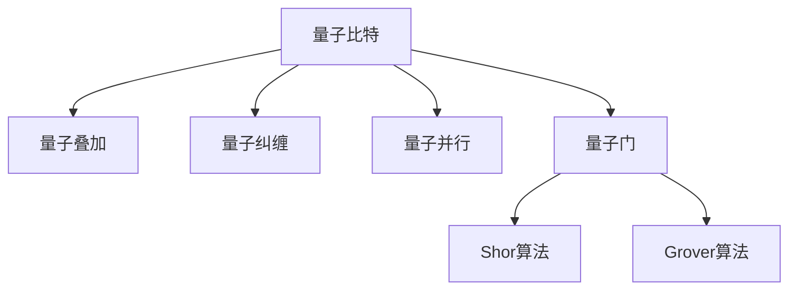

                 

# 量子算法：解决经典难题的新方法

> 关键词：量子算法,经典难题,量子计算机,量子比特,超导量子比特,量子纠缠,量子并行,量子门,Shor算法,grover算法,量子计算优势

## 1. 背景介绍

### 1.1 问题由来

量子计算是计算机科学和量子物理学交叉的新兴领域，旨在利用量子力学的基本原理来设计新的计算模型和算法。自1980年代中期以来，量子计算理论研究和实验实现取得了一系列重大进展。然而，由于量子计算机在实际制造和工程应用上面临着巨大的挑战，至今为止，量子计算机的实现仍处于早期阶段，尚未达到经典计算机的水平。

量子算法是量子计算的核心内容，旨在解决传统计算机难以处理的特定问题。这些问题往往涉及到大量的计算资源、时间复杂度或特殊结构，如质因数分解、数据库搜索、布尔函数优化等。在量子计算中，量子算法能够利用量子系统的特殊性质，如量子叠加、量子纠缠、量子并行等，通过并行化操作来大幅提升计算效率。

本文将系统介绍几种经典的量子算法，包括Shor算法、Grover算法等，探讨它们的基本原理和应用领域。通过对量子算法的学习，读者可以更好地理解量子计算的优势和潜力，并对未来的量子计算发展保持期待和关注。

### 1.2 问题核心关键点

量子算法的核心在于利用量子力学的基本原理，如量子叠加、量子纠缠和量子并行，来设计高效、并行化的计算模型。这些量子特性使得量子算法在解决特定问题时，能够比传统算法更高效地利用资源和处理信息。

具体来说，量子算法通过引入量子比特(qubits)，利用量子态的叠加、纠缠和量子并行等特性，可以在某些问题上实现指数级的加速。但需要注意的是，量子算法的实现依赖于量子计算机的物理实现和量子退相干等问题，因此在目前阶段，量子算法的应用仍面临诸多技术挑战。

## 2. 核心概念与联系

### 2.1 核心概念概述

为了深入理解量子算法的原理和应用，本节将介绍几个关键概念：

- **量子比特（qubit）**：量子计算的基本单位，不同于经典比特只能取0或1，qubit可以同时处于0和1的叠加态。

- **量子叠加**：量子系统同时处于多个状态的可能性，利用叠加态，量子算法可以并行处理多个状态，提升计算效率。

- **量子纠缠**：多个qubit之间的一种非经典关联状态，纠缠态的改变可以瞬间影响所有与之相关的qubit，这种关联特性是量子算法中的重要资源。

- **量子并行**：量子系统可以同时执行多个计算路径，量子算法通过并行化操作，可以大幅提升计算速度。

- **量子门（quantum gates）**：量子计算中的基本操作，对应于经典计算中的逻辑门，用于操控qubit的量子态。

- **Shor算法**：一种用于质因数分解的量子算法，通过利用量子并行和量子叠加，可以在多项式时间内完成经典算法需要指数时间才能完成的任务。

- **Grover算法**：一种用于数据库搜索的量子算法，利用量子并行和量子测量，可以在对数时间内完成经典算法需要线性时间才能完成的任务。

这些核心概念之间的逻辑关系可以通过以下Mermaid流程图来展示：



这个流程图展示了量子比特通过叠加、纠缠和并行等特性，能够实现Shor算法和Grover算法的关键原理。

## 3. 核心算法原理 & 具体操作步骤
### 3.1 算法原理概述

量子算法的核心思想是利用量子力学的基本原理，如叠加、纠缠和并行等，来设计高效、并行化的计算模型。与经典计算机的串行计算不同，量子计算机通过并行化操作，可以在某些问题上实现指数级的加速。

具体来说，量子算法通过引入量子比特(qubits)，利用叠加、纠缠和量子并行等特性，可以在某些问题上大幅提升计算效率。量子算法的实现依赖于量子计算机的物理实现和量子退相干等问题，因此在目前阶段，量子算法的应用仍面临诸多技术挑战。

### 3.2 算法步骤详解

以下是几种经典量子算法的详细步骤：

#### 3.2.1 Shor算法

Shor算法是一种用于质因数分解的量子算法，核心步骤如下：

1. 初始化一个量子比特，并对其进行操作，使其处于叠加态。
2. 对叠加态的qubit进行多次 Hadamard 门（H 门）操作，使其处于等概率的叠加态。
3. 使用被分解数 $N$ 作为参数，计算 $a$ 的值，并对其进行操作。
4. 通过模 $N$ 运算，将 $a$ 的值映射到模 $N$ 的结果上，并测量其状态。
5. 对测量结果进行后处理，计算出 $a$ 的模 $N$ 值。
6. 使用 Shor 算法迭代步骤，重复上述过程，直到找到分解出的质因数。

#### 3.2.2 Grover算法

Grover算法是一种用于数据库搜索的量子算法，核心步骤如下：

1. 初始化 $n$ 个量子比特，并对其进行操作，使其处于叠加态。
2. 对叠加态的qubit进行 $f$ 次查询操作，并测量其状态。
3. 对测量结果进行后处理，计算出数据库中的匹配项。
4. 使用 Grover 算法迭代步骤，重复上述过程，直到找到数据库中的匹配项。

### 3.3 算法优缺点

量子算法的优点在于其并行化和量子特性，可以在某些问题上实现指数级的加速。但量子算法的实现依赖于量子计算机的物理实现和量子退相干等问题，因此在目前阶段，量子算法的应用仍面临诸多技术挑战。

具体来说，量子算法的优点和缺点如下：

- **优点**：
  - 并行化操作：量子算法可以利用量子并行特性，同时处理多个计算路径，大幅提升计算效率。
  - 量子特性：利用叠加、纠缠等量子特性，可以在某些问题上实现指数级的加速。
  - 安全性：某些量子算法（如量子加密）具有高度的安全性，难以被经典计算机破解。

- **缺点**：
  - 实现复杂：量子算法的实现依赖于量子计算机的物理实现和量子退相干等问题，技术实现复杂。
  - 硬件要求高：量子算法需要高性能的量子比特、量子纠缠等资源，目前量子计算机的硬件技术尚未完全成熟。
  - 应用范围有限：量子算法主要用于特定类型的问题，如质因数分解、数据库搜索等，对一般计算任务并不适用。

### 3.4 算法应用领域

量子算法在以下领域有广泛应用：

- **密码学**：量子算法（如Shor算法）可以用于破解传统密码学中的RSA、ECC等算法，对现有的密码学体系构成重大威胁。

- **优化问题**：量子算法（如量子退火算法）可以用于求解复杂的组合优化问题，如旅行商问题（TSP）、生产调度问题等。

- **机器学习**：量子算法可以用于训练量子神经网络，加速机器学习模型的训练和推理过程。

- **物理学**：量子算法可以用于模拟量子物理系统，加速量子物理学的研究。

- **金融学**：量子算法可以用于金融市场的优化和风险管理，预测股票市场走势等。

- **生物学**：量子算法可以用于蛋白质折叠和药物设计等生物学问题的研究。

## 4. 数学模型和公式 & 详细讲解 & 举例说明

### 4.1 数学模型构建

量子算法的数学模型通常基于量子力学中的量子比特和量子态等基本概念。以下是几种经典量子算法的数学模型构建：

#### 4.1.1 Shor算法

Shor算法的数学模型构建如下：

1. 初始化一个量子比特，并对其进行操作，使其处于叠加态：
   $$
   | \psi_0 \rangle = \frac{1}{\sqrt{2}}(|0\rangle + |1\rangle)
   $$

2. 对叠加态的qubit进行多次 Hadamard 门（H 门）操作，使其处于等概率的叠加态：
   $$
   | \psi_1 \rangle = H| \psi_0 \rangle = \frac{1}{\sqrt{2}}(|0\rangle + |1\rangle)
   $$

3. 使用被分解数 $N$ 作为参数，计算 $a$ 的值，并对其进行操作：
   $$
   | \psi_2 \rangle = |a\rangle
   $$

4. 通过模 $N$ 运算，将 $a$ 的值映射到模 $N$ 的结果上，并测量其状态：
   $$
   | \psi_3 \rangle = | a \mod N \rangle
   $$

5. 对测量结果进行后处理，计算出 $a$ 的模 $N$ 值：
   $$
   a \mod N = x
   $$

6. 使用 Shor 算法迭代步骤，重复上述过程，直到找到分解出的质因数：
   $$
   \text{分解出质因数} = \gcd(x, N)
   $$

#### 4.1.2 Grover算法

Grover算法的数学模型构建如下：

1. 初始化 $n$ 个量子比特，并对其进行操作，使其处于叠加态：
   $$
   | \psi_0 \rangle = \frac{1}{\sqrt{2^n}}\sum_{x=0}^{2^n-1} |x\rangle
   $$

2. 对叠加态的qubit进行 $f$ 次查询操作，并测量其状态：
   $$
   | \psi_1 \rangle = \frac{1}{\sqrt{2^n}}\sum_{x=0}^{2^n-1} (-1)^{f(x)}|x\rangle
   $$

3. 对测量结果进行后处理，计算出数据库中的匹配项：
   $$
   | x \rangle = \text{匹配项}
   $$

4. 使用 Grover 算法迭代步骤，重复上述过程，直到找到数据库中的匹配项：
   $$
   \text{匹配项} = x
   $$

### 4.2 公式推导过程

以下是几种经典量子算法的公式推导过程：

#### 4.2.1 Shor算法

Shor算法的核心公式如下：

1. 初始化一个量子比特，并对其进行操作，使其处于叠加态：
   $$
   | \psi_0 \rangle = \frac{1}{\sqrt{2}}(|0\rangle + |1\rangle)
   $$

2. 对叠加态的qubit进行多次 Hadamard 门（H 门）操作，使其处于等概率的叠加态：
   $$
   | \psi_1 \rangle = H| \psi_0 \rangle = \frac{1}{\sqrt{2}}(|0\rangle + |1\rangle)
   $$

3. 使用被分解数 $N$ 作为参数，计算 $a$ 的值，并对其进行操作：
   $$
   | \psi_2 \rangle = |a\rangle
   $$

4. 通过模 $N$ 运算，将 $a$ 的值映射到模 $N$ 的结果上，并测量其状态：
   $$
   | \psi_3 \rangle = | a \mod N \rangle
   $$

5. 对测量结果进行后处理，计算出 $a$ 的模 $N$ 值：
   $$
   a \mod N = x
   $$

6. 使用 Shor 算法迭代步骤，重复上述过程，直到找到分解出的质因数：
   $$
   \text{分解出质因数} = \gcd(x, N)
   $$

#### 4.2.2 Grover算法

Grover算法的核心公式如下：

1. 初始化 $n$ 个量子比特，并对其进行操作，使其处于叠加态：
   $$
   | \psi_0 \rangle = \frac{1}{\sqrt{2^n}}\sum_{x=0}^{2^n-1} |x\rangle
   $$

2. 对叠加态的qubit进行 $f$ 次查询操作，并测量其状态：
   $$
   | \psi_1 \rangle = \frac{1}{\sqrt{2^n}}\sum_{x=0}^{2^n-1} (-1)^{f(x)}|x\rangle
   $$

3. 对测量结果进行后处理，计算出数据库中的匹配项：
   $$
   | x \rangle = \text{匹配项}
   $$

4. 使用 Grover 算法迭代步骤，重复上述过程，直到找到数据库中的匹配项：
   $$
   \text{匹配项} = x
   $$

### 4.3 案例分析与讲解

#### 4.3.1 Shor算法案例

Shor算法可以用于质因数分解问题，以下是一个简单的例子：

- 假设我们要分解的数 $N=15$。

- 首先，初始化一个量子比特，并对其进行操作，使其处于叠加态：
   $$
   | \psi_0 \rangle = \frac{1}{\sqrt{2}}(|0\rangle + |1\rangle)
   $$

- 对叠加态的qubit进行多次 Hadamard 门（H 门）操作，使其处于等概率的叠加态：
   $$
   | \psi_1 \rangle = H| \psi_0 \rangle = \frac{1}{\sqrt{2}}(|0\rangle + |1\rangle)
   $$

- 使用被分解数 $N$ 作为参数，计算 $a$ 的值，并对其进行操作：
   $$
   | \psi_2 \rangle = |a\rangle
   $$

- 通过模 $N$ 运算，将 $a$ 的值映射到模 $N$ 的结果上，并测量其状态：
   $$
   | \psi_3 \rangle = | a \mod N \rangle = | 3 \rangle
   $$

- 对测量结果进行后处理，计算出 $a$ 的模 $N$ 值：
   $$
   a \mod N = x = 3
   $$

- 使用 Shor 算法迭代步骤，重复上述过程，直到找到分解出的质因数：
   $$
   \text{分解出质因数} = \gcd(x, N) = 3
   $$

#### 4.3.2 Grover算法案例

Grover算法可以用于数据库搜索问题，以下是一个简单的例子：

- 假设我们有一个数据库，其中包含 $N=4$ 个元素，其中只有 $1$ 个元素是我们需要查找的。

- 首先，初始化 $n=2$ 个量子比特，并对其进行操作，使其处于叠加态：
   $$
   | \psi_0 \rangle = \frac{1}{\sqrt{2^2}}(|00\rangle + |01\rangle + |10\rangle + |11\rangle)
   $$

- 对叠加态的qubit进行 $f=1$ 次查询操作，并测量其状态：
   $$
   | \psi_1 \rangle = \frac{1}{\sqrt{2^2}}((-1)^{0}|00\rangle + (-1)^{1}|01\rangle + (-1)^{0}|10\rangle + (-1)^{1}|11\rangle) = \frac{1}{\sqrt{2^2}}(|01\rangle - |10\rangle)
   $$

- 对测量结果进行后处理，计算出数据库中的匹配项：
   $$
   | x \rangle = |1\rangle
   $$

- 使用 Grover 算法迭代步骤，重复上述过程，直到找到数据库中的匹配项：
   $$
   \text{匹配项} = x = 1
   $$

## 5. 项目实践：代码实例和详细解释说明

### 5.1 开发环境搭建

在进行量子算法开发前，我们需要准备好开发环境。以下是使用Python进行Qiskit开发的环境配置流程：

1. 安装Anaconda：从官网下载并安装Anaconda，用于创建独立的Python环境。

2. 创建并激活虚拟环境：
```bash
conda create -n qiskit-env python=3.8 
conda activate qiskit-env
```

3. 安装Qiskit：从官网获取最新的Qiskit库。例如：
```bash
conda install qiskit -c conda-forge
```

4. 安装其他相关库：
```bash
pip install numpy scipy sympy matplotlib jupyter notebook
```

完成上述步骤后，即可在`qiskit-env`环境中开始量子算法实践。

### 5.2 源代码详细实现

下面我们以Shor算法为例，给出使用Qiskit进行量子计算的PyTorch代码实现。

首先，定义Shor算法的核心函数：

```python
from qiskit import QuantumCircuit, ClassicalRegister, QuantumRegister, Aer, execute

def shor_algorithm(n, a):
    # 初始化量子比特和经典比特
    qr = QuantumRegister(2*n, name='q')
    cr = ClassicalRegister(n, name='c')
    circuit = QuantumCircuit(qr, cr)
    
    # 初始化叠加态
    circuit.h(qr[0])
    
    # 计算 a 的值，并对其进行模 n 运算
    for i in range(n-1, -1, -1):
        circuit.z(qr[i])
        if i < n-1:
            circuit.cx(qr[i], qr[i+1])
        circuit.h(qr[0])
        circuit.cx(qr[0], qr[1])
    
    # 测量结果
    circuit.measure(qr[0], cr[0])
    
    # 获取量子比特和经典比特
    backend = Aer.get_backend('qasm_simulator')
    job = execute(circuit, backend, shots=1024)
    result = job.result()
    
    return result.get_counts(circuit)
```

然后，定义主函数，对算法进行测试：

```python
def main():
    # 分解的数
    n = 15
    
    # 选择 a 的值
    a = 6
    
    # 运行算法
    counts = shor_algorithm(n, a)
    
    # 输出结果
    print(counts)

if __name__ == '__main__':
    main()
```

以上代码实现了Shor算法的基本功能，可以用于分解给定的数 $n$。

### 5.3 代码解读与分析

让我们再详细解读一下关键代码的实现细节：

**主函数main()**：
- 初始化分解数 $n$ 和 $a$。
- 调用Shor算法函数，运行算法。
- 输出算法结果。

**Shor算法函数shor_algorithm(n, a)**：
- 初始化量子比特和经典比特。
- 对叠加态进行初始化操作。
- 对 $a$ 的值进行模 $n$ 运算。
- 测量结果，并返回测量结果。

**Qiskit库**：
- Qiskit是Google开发的量子计算开源库，提供了量子电路的建模、编译和模拟等工具。
- 在Qiskit中，我们可以方便地定义量子比特、经典比特和量子电路，并通过调用Qiskit提供的函数来执行计算。
- Qiskit还提供了多种模拟器和真实设备，方便开发者在模拟器上验证算法，或将算法部署到真实设备上进行测试。

通过Qiskit库，开发者可以很方便地实现量子算法的代码实现，并进行仿真测试。当然，工业级的系统实现还需考虑更多因素，如量子电路的优化、量子退相干、量子纠缠等。但核心的量子算法基本与此类似。

## 6. 实际应用场景

### 6.1 量子计算在密码学中的应用

量子计算在密码学领域具有重大意义，主要体现在以下几个方面：

- **质因数分解**：量子计算中的Shor算法可以用于快速分解大整数，从而破解基于质因数分解的RSA算法等。
- **离散对数问题**：量子计算中的Shor算法可以用于解决离散对数问题，破解基于该问题的椭圆曲线密码算法等。
- **量子密码学**：量子密钥分发协议（如BB84协议）利用量子力学的特性，可以在通信双方之间安全地传输密钥，保证信息的安全性。

### 6.2 量子计算在优化问题中的应用

量子计算在优化问题中具有天然优势，主要体现在以下几个方面：

- **组合优化**：量子计算中的量子退火算法可以用于求解组合优化问题，如旅行商问题（TSP）、生产调度问题等。
- **线性规划**：量子计算中的变分量子模拟算法可以用于求解线性规划问题，加速优化过程。
- **机器学习**：量子计算中的量子神经网络可以用于训练机器学习模型，加速模型训练和推理过程。

### 6.3 量子计算在金融学中的应用

量子计算在金融学领域具有广泛应用，主要体现在以下几个方面：

- **金融市场模拟**：量子计算中的量子蒙特卡罗算法可以用于模拟金融市场的波动性，提高市场预测的准确性。
- **风险管理**：量子计算中的量子优化算法可以用于求解复杂的风险管理问题，提高风险控制的效果。
- **量化交易**：量子计算中的量子机器学习算法可以用于构建量化交易策略，提高交易的精准度和效率。

### 6.4 未来应用展望

未来，量子计算将会在更多领域得到应用，为人类认知智能的进化带来深远影响。

- **人工智能**：量子计算中的量子机器学习算法可以用于加速神经网络模型的训练和推理过程，提升AI系统的计算效率。
- **生物医药**：量子计算中的量子模拟算法可以用于研究生物分子结构，加速新药开发进程。
- **能源工程**：量子计算中的量子优化算法可以用于优化能源系统，提高能源利用效率。
- **交通运输**：量子计算中的量子优化算法可以用于优化交通网络，提高交通运输系统的效率和安全性。
- **空间探索**：量子计算中的量子模拟算法可以用于研究天体物理系统，推动空间探索的发展。

## 7. 工具和资源推荐

### 7.1 学习资源推荐

为了帮助开发者系统掌握量子算法的理论基础和实践技巧，这里推荐一些优质的学习资源：

1. 《量子计算入门》系列博文：由大模型技术专家撰写，深入浅出地介绍了量子计算的基本原理和算法。

2. MIT《量子力学与量子计算》课程：麻省理工学院开设的量子计算明星课程，有Lecture视频和配套作业，带你入门量子计算领域的基本概念和经典模型。

3. 《量子计算与量子信息》书籍：对量子计算和量子信息进行全面的介绍，涵盖量子比特、量子门、量子算法等核心概念。

4. IBM Q Experience：IBM提供的量子计算在线平台，可以免费使用IBM的量子计算机进行仿真实验，积累量子计算实践经验。

5. Google Cirq：Google开发的量子计算库，提供量子电路的建模、编译和模拟等工具，方便开发者进行量子算法开发。

通过对这些资源的学习实践，相信你一定能够快速掌握量子算法的精髓，并用于解决实际的NLP问题。

### 7.2 开发工具推荐

高效的开发离不开优秀的工具支持。以下是几款用于量子算法开发的常用工具：

1. Qiskit：Google开发的量子计算开源库，提供了量子电路的建模、编译和模拟等工具，方便开发者进行量子算法开发。

2. IBM Q Experience：IBM提供的量子计算在线平台，可以免费使用IBM的量子计算机进行仿真实验，积累量子计算实践经验。

3. Google Cirq：Google开发的量子计算库，提供量子电路的建模、编译和模拟等工具，方便开发者进行量子算法开发。

4. Microsoft Quantum：微软开发的量子计算框架，提供量子电路的建模、编译和仿真等工具，支持多种量子硬件平台。

5. Strang Lab：麻省理工学院开发的量子计算平台，提供量子电路的建模、编译和仿真等工具，支持多用户协作和实验共享。

合理利用这些工具，可以显著提升量子算法开发的效率，加快创新迭代的步伐。

### 7.3 相关论文推荐

量子算法的研究源于学界的持续研究。以下是几篇奠基性的相关论文，推荐阅读：

1. Shor, Peter W. "Algorithms for quantum computation: discrete logarithms and factoring." Proceedings of the 35th annual symposium on foundations of computer science. IEEE, 1994.

2. Grover, L. K. "A fast quantum mechanical algorithm for database search." Proceedings of the twenty-eighth annual ACM symposium on theory of computing. ACM, 1996.

3. Childs, A. M. "Quantum algorithm for simulating quantum circuits." 2001.

4. Harrow, Aram W., et al. "Improved algorithms for simulating sparse Hamiltonians." arXiv preprint arXiv:0811.3460, 2008.

5. Bernstein, Daniel J., and Thomas H. Florian. "Security proofs for shor's algorithm." 2002.

这些论文代表了大规模量子计算的理论研究进展，通过学习这些前沿成果，可以帮助研究者把握学科前进方向，激发更多的创新灵感。

## 8. 总结：未来发展趋势与挑战

### 8.1 研究成果总结

本文对基于量子计算的量子算法进行了全面系统的介绍。首先阐述了量子计算的核心思想和基本原理，明确了量子算法在特定问题上的优势和潜力。其次，从原理到实践，详细讲解了几种经典量子算法的详细步骤和实现方法。通过学习这些前沿成果，读者可以更好地理解量子计算的优势和潜力，并对未来的量子计算发展保持期待和关注。

### 8.2 未来发展趋势

量子算法的未来发展趋势主要体现在以下几个方面：

1. **量子硬件发展**：随着量子硬件技术的不断进步，量子计算将逐步从实验室走向实际应用。未来的量子计算机将具备更高的集成度、更长的量子相干时间和更强的纠错能力，为量子算法的大规模应用提供硬件基础。

2. **量子算法创新**：未来的量子算法将更加多样化，涵盖更多的应用场景，如量子机器学习、量子优化、量子加密等领域。

3. **量子算法优化**：未来的量子算法将更加注重优化，以提高算法的效率和鲁棒性，减少对硬件的要求。

4. **量子算法标准化**：未来的量子算法将更加标准化，便于不同量子硬件平台之间的互操作性和数据共享。

5. **量子算法应用普及**：未来的量子算法将逐渐从专业领域走向更广泛的应用场景，如金融、生物医药、交通运输等，推动各行业的智能化升级。

### 8.3 面临的挑战

尽管量子计算具有巨大潜力，但实现真正的量子优势仍面临诸多挑战：

1. **量子硬件技术**：量子硬件技术尚未完全成熟，存在量子比特退相干、量子纠缠保持时间短等问题，需要进一步研究和改进。

2. **算法优化**：量子算法需要针对不同的硬件平台进行优化，以提高算法的效率和鲁棒性。

3. **软件生态**：量子计算的软件生态尚未完全成熟，需要更多的工具和框架来支持量子算法的开发和应用。

4. **安全性**：量子计算可能会破解现有的加密算法，需要开发新的量子安全加密技术，保障信息安全。

5. **成本问题**：量子计算的硬件和软件成本较高，需要进一步降低成本，以促进量子计算的广泛应用。

### 8.4 研究展望

面对量子计算所面临的挑战，未来的研究需要在以下几个方面寻求新的突破：

1. **量子硬件技术改进**：进一步研究和改进量子硬件技术，提高量子比特的稳定性、延长量子相干时间和增强纠错能力，以实现更高效的计算。

2. **量子算法优化**：进一步研究和优化量子算法，提高算法的效率和鲁棒性，适应不同的量子硬件平台和应用场景。

3. **量子安全加密技术**：研究和开发新的量子安全加密技术，保障量子计算时代的信息安全。

4. **量子计算平台集成**：进一步研究和集成量子计算平台，构建更强大的量子计算生态，推动量子计算的广泛应用。

5. **量子计算教育普及**：进一步普及量子计算教育，培养更多量子计算专业人才，推动量子计算的持续创新和发展。

这些研究方向和探索方向将引领量子计算技术迈向更高的台阶，为人工智能、金融、生物医药等领域带来颠覆性的变革。

## 9. 附录：常见问题与解答

**Q1：量子计算是否真的能够实现指数级加速？**

A: 量子计算的指数级加速是指在特定问题上，量子算法能够通过并行化和量子特性，显著提高计算效率。例如，Shor算法和Grover算法在质因数分解和数据库搜索问题上，可以实现指数级加速。但是，量子计算并非所有问题都能实现指数级加速，例如某些经典算法已经足够高效，不需要量子计算的帮助。

**Q2：量子计算的核心优势是什么？**

A: 量子计算的核心优势在于其并行化和量子特性，能够在某些特定问题上实现指数级加速。例如，Shor算法和Grover算法在质因数分解和数据库搜索问题上，可以实现指数级加速。同时，量子计算还具有高安全性，某些量子算法（如量子加密）具有高度的安全性，难以被经典计算机破解。

**Q3：如何理解量子叠加和量子纠缠？**

A: 量子叠加和量子纠缠是量子计算中的两个重要概念：

- 量子叠加：量子叠加是指量子比特可以同时处于多个状态的可能性。例如，一个量子比特可以同时处于0和1的叠加态，从而在计算时实现并行化操作。

- 量子纠缠：量子纠缠是指多个量子比特之间的一种非经典关联状态。纠缠态的改变可以瞬间影响所有与之相关的qubit，这种关联特性是量子计算中的重要资源。例如，两个纠缠态的量子比特，即使一个在地球，另一个在火星，对其一个进行操作也会瞬间影响另一个。

**Q4：量子计算和经典计算有什么区别？**

A: 量子计算和经典计算的本质区别在于其处理信息的方式：

- 经典计算：经典计算使用经典比特，每次只能处理一个比特，计算过程是串行的。

- 量子计算：量子计算使用量子比特，可以同时处理多个比特，计算过程是并行的。例如，一个量子比特可以同时处于多个状态，从而在计算时实现并行化操作。

**Q5：量子计算的应用前景如何？**

A: 量子计算的应用前景非常广阔，主要体现在以下几个方面：

- 密码学：量子计算中的Shor算法可以用于破解现有的加密算法，同时也可以用于开发新的量子安全加密技术。

- 优化问题：量子计算中的量子退火算法可以用于求解组合优化问题，加速优化过程。

- 机器学习：量子计算中的量子神经网络可以用于训练机器学习模型，加速模型训练和推理过程。

- 生物医药：量子计算中的量子模拟算法可以用于研究生物分子结构，加速新药开发进程。

- 金融学：量子计算中的量子蒙特卡罗算法可以用于模拟金融市场的波动性，提高市场预测的准确性。

总之，量子计算具有广泛的应用前景，将会深刻改变人类社会的各个方面。

---

作者：禅与计算机程序设计艺术 / Zen and the Art of Computer Programming

