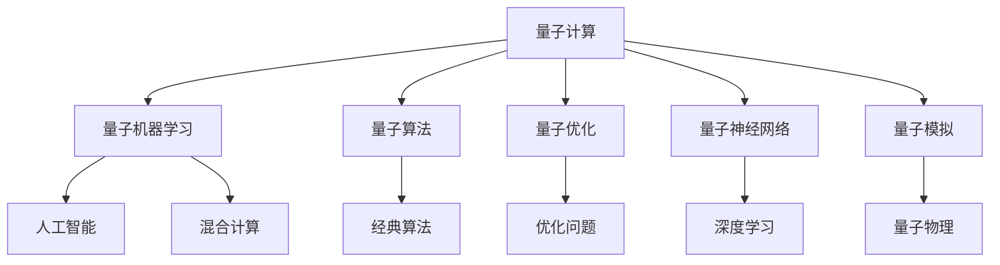

                 

# 量子计算和人工智能的未来

> 关键词：量子计算, 人工智能, 量子机器学习, 混合计算, 量子算法, 神经网络, 量子优化, 量子模拟, 前沿研究, 技术趋势

## 1. 背景介绍

### 1.1 问题由来

量子计算（Quantum Computing）和人工智能（Artificial Intelligence, AI），作为本世纪最具颠覆性的技术，正在以势不可挡之势，加速重塑全球科技产业格局。它们分别在计算能力和智能推理方面，展现出了超越传统技术的巨大潜力。然而，在实际应用中，量子计算与AI又存在难以相互整合的问题，尤其在量子算法设计、量子与经典计算的交互接口等关键技术领域，仍需突破重大难题。因此，如何实现量子计算与人工智能的深度融合，成为当前科研和产业界共同关注的焦点。

### 1.2 问题核心关键点

量子计算与人工智能的未来融合，旨在将量子计算的强大计算能力与人工智能的高级推理能力相结合，从而解锁更强大、更高效的计算资源，用于解决复杂的优化问题、模式识别、数据分析等高难度任务。核心关键点在于：
1. 量子计算能力：利用量子比特（qubit）实现超高效的量子并行运算。
2. 量子与经典计算的接口：设计量子算法和经典算法的高效融合机制。
3. 量子优化问题：针对特定应用场景，开发出高效率的量子优化算法。
4. 量子神经网络：将神经网络架构与量子计算相结合，提升深度学习的泛化能力。
5. 量子模拟与仿真：利用量子计算机进行高效模拟，加速量子物理研究。

### 1.3 问题研究意义

量子计算与人工智能的深度融合，对推动量子计算在实际应用中的落地，具有深远的战略意义：

1. 提升计算效率：量子计算和AI的结合，能够大幅提升计算效率，加速解决大规模复杂优化问题。
2. 增强算法性能：通过量子计算能力，可以加速AI模型训练，提升预测精度和推理速度。
3. 拓展应用边界：量子AI能够处理传统AI难以解决的复杂问题，如化学反应模拟、材料设计、药物分子模拟等。
4. 促进技术创新：量子AI技术的不断发展，将催生更多前沿研究，推动人工智能技术走向更广阔的领域。
5. 赋能产业升级：量子AI技术赋能行业应用，加速各行各业的数字化转型升级，实现智能生产和服务。

## 2. 核心概念与联系

### 2.1 核心概念概述

为更好地理解量子计算与人工智能的未来融合，本节将介绍几个关键概念：

- 量子计算（Quantum Computing）：一种基于量子力学原理的计算模型，利用量子比特的叠加态和纠缠特性，实现超高效的并行运算。
- 人工智能（Artificial Intelligence）：一种使计算机系统能够模拟人类智能行为的技术，包括机器学习、深度学习、自然语言处理、计算机视觉等。
- 量子机器学习（Quantum Machine Learning, QML）：将量子计算与机器学习相结合的新兴领域，利用量子算法优化机器学习过程。
- 混合计算（Hybrid Computing）：将量子计算与经典计算相结合的计算模型，既发挥量子计算优势，又保留经典计算的可靠性。
- 量子算法（Quantum Algorithm）：专门设计用于量子计算机的高效算法，如Shor算法、Grover算法等。
- 量子优化（Quantum Optimization）：利用量子计算实现大规模复杂优化问题的求解。
- 量子神经网络（Quantum Neural Network, QNN）：将量子计算嵌入神经网络架构中，提升深度学习的泛化能力。
- 量子模拟（Quantum Simulation）：利用量子计算机进行量子系统的模拟计算，加速量子物理研究。

这些核心概念之间的逻辑关系可以通过以下Mermaid流程图来展示：



这个流程图展示了量子计算与人工智能的关键概念及其相互联系：

1. 量子计算通过量子算法等基础技术，为人工智能提供了强大的计算支持。
2. 量子机器学习融合了量子计算的计算能力与AI的智能推理，具备独特的优势。
3. 混合计算结合了量子计算与经典计算，提供更加灵活的计算方式。
4. 量子算法和量子优化算法，是量子计算的核心组成部分。
5. 量子神经网络是深度学习与量子计算的结合，提升AI模型的泛化能力。
6. 量子模拟则利用量子计算机进行高效的物理模拟，加速科学探索。

## 3. 核心算法原理 & 具体操作步骤

### 3.1 算法原理概述

量子计算与人工智能的未来融合，本质上是一个量子算法与机器学习算法相结合的计算过程。其核心思想是：通过量子计算加速机器学习模型的训练和推理，提升算法的效率和准确性。

形式化地，假设有一组训练数据 $\{(x_i, y_i)\}_{i=1}^N$，其中 $x_i$ 为输入，$y_i$ 为输出。给定量子计算模型 $M_{\theta}$ 和经典优化算法 $O$，融合过程如下：

1. 量子计算模型 $M_{\theta}$ 输入训练数据 $x_i$，输出量子态 $|\psi\rangle$。
2. 利用量子测量技术，将量子态转换为经典信号 $S$。
3. 经典优化算法 $O$ 根据 $S$ 更新模型参数 $\theta$。
4. 重复上述过程直至收敛，得到训练好的量子AI模型 $M_{\theta}$。

在实际操作中，通常先通过量子计算模型进行超参数搜索，获得最优超参数后，再使用经典计算进行精细优化。具体步骤如下：

1. 准备量子计算硬件和软件工具。
2. 设计量子计算模型，选择合适量子算法。
3. 构建经典优化算法，设置超参数。
4. 在量子计算硬件上执行量子计算，获得输出信号。
5. 在经典计算上优化模型参数，生成训练好的量子AI模型。

### 3.2 算法步骤详解

量子计算与人工智能的融合过程，包括以下几个关键步骤：

**Step 1: 准备量子硬件和软件环境**
- 选择合适的量子硬件平台（如D-Wave、IBM Q、Google Sycamore等），并确保其支持超导量子比特、离子阱等关键技术。
- 安装量子编程语言（如Qiskit、Cirq、QuTiP等），并配置环境。
- 准备高质量的训练数据，并进行预处理，如归一化、特征工程等。

**Step 2: 设计量子计算模型**
- 选择合适的量子算法（如Grover算法、Shor算法等）。
- 设计量子计算电路，包括量子比特的初始化、量子门的实现、量子测量等环节。
- 利用量子编程语言进行模拟或实验，并优化电路结构。

**Step 3: 构建经典优化算法**
- 选择经典优化算法，如梯度下降、遗传算法、粒子群算法等。
- 设置优化目标函数、超参数（如学习率、迭代次数等）。
- 将量子计算输出信号作为优化算法的输入，进行经典优化。

**Step 4: 执行量子计算与经典优化**
- 在量子硬件上执行量子计算，得到输出信号。
- 将信号传递到经典计算平台，进行优化算法迭代。
- 重复上述过程，直至满足预设的收敛条件。

**Step 5: 模型训练与测试**
- 在训练集上训练量子AI模型，记录训练过程中的性能指标。
- 在验证集和测试集上评估模型性能，进行模型选择和调优。
- 保存训练好的量子AI模型，并进行性能对比分析。

### 3.3 算法优缺点

量子计算与人工智能的融合方法具有以下优点：
1. 高效加速：量子计算能够实现超高效的并行运算，大幅提升AI模型的训练和推理效率。
2. 高精度优化：量子优化算法能够解决传统算法难以处理的复杂优化问题，提升求解精度。
3. 泛化能力强：量子神经网络具有更强的泛化能力，能处理更大规模的数据和更复杂的模式。

同时，该方法也存在一定的局限性：
1. 技术门槛高：量子计算与AI的融合需要量子硬件、编程语言和优化算法的多方面配合，技术门槛较高。
2. 硬件成本高：目前量子硬件价格昂贵，大范围部署面临高昂成本。
3. 算法成熟度低：量子计算与AI的结合尚处于初期探索阶段，算法和理论体系尚未成熟。
4. 计算噪声：量子计算存在计算噪声，导致输出结果不稳定，需进行后处理。
5. 资源需求大：量子计算资源需求巨大，需要大规模的物理资源和优化算法。

尽管存在这些局限性，但就目前而言，量子计算与AI的融合范式具有极大的潜力和发展前景，成为推动未来科技创新的重要方向。

### 3.4 算法应用领域

量子计算与人工智能的融合方法，在众多领域都有广泛的应用前景：

- 金融风险管理：利用量子计算加速大数据分析，优化投资组合，降低金融风险。
- 医药研发：利用量子AI进行分子模拟和药物设计，提升新药开发效率。
- 材料科学：量子计算加速材料设计，发现新材料，提升科研效率。
- 气象预测：利用量子计算处理海量气象数据，提升天气预报精度。
- 物流优化：量子优化算法优化物流路径和资源配置，降低成本，提高效率。
- 人工智能加速：利用量子计算加速AI模型的训练和推理，提升系统性能。
- 量子通信：结合量子计算与AI，设计更加安全的量子通信协议。

除了上述这些应用场景，量子AI技术还在不断拓展其应用边界，未来有望在更多领域实现突破。

## 4. 数学模型和公式 & 详细讲解 & 举例说明

### 4.1 数学模型构建

假设有一个二分类问题，给定训练数据集 $\{(x_i, y_i)\}_{i=1}^N$，其中 $x_i \in \mathbb{R}^d$ 为输入向量，$y_i \in \{0, 1\}$ 为输出标签。一个简单的量子神经网络（QNN）结构如下：

1. 量子输入层：将输入向量 $x_i$ 转换为量子态 $|\psi(x_i)\rangle$。
2. 量子中间层：通过量子线路进行矩阵变换，得到中间量子态 $|\psi_{\theta}(x_i)\rangle$。
3. 量子输出层：测量量子态，得到输出信号 $S_i$。
4. 经典输出层：利用经典优化算法，更新模型参数 $\theta$。

模型训练过程如下：

1. 输入数据 $x_i$，通过量子线路得到中间量子态 $|\psi_{\theta}(x_i)\rangle$。
2. 对中间量子态进行测量，得到输出信号 $S_i$。
3. 利用经典优化算法，根据 $S_i$ 更新模型参数 $\theta$。
4. 重复上述过程直至收敛，得到训练好的量子神经网络 $M_{\theta}$。

### 4.2 公式推导过程

以一个简单的二分类问题为例，推导量子神经网络的基本数学模型。

设输入数据为 $x_i$，输出标签为 $y_i$，量子输入层输出的量子态为 $|\psi(x_i)\rangle$，中间层通过量子线路变换后的量子态为 $|\psi_{\theta}(x_i)\rangle$。量子线路变换可以表示为：

$$
|\psi_{\theta}(x_i)\rangle = \mathcal{H}(|x_i\rangle)U(\theta)|x_i\rangle
$$

其中 $\mathcal{H}$ 为Hadamard变换，$U(\theta)$ 为量子线路变换，$|x_i\rangle$ 为经典输入向量。

量子线路变换矩阵 $U(\theta)$ 可以表示为：

$$
U(\theta) = \begin{bmatrix} \cos(\theta) & -\sin(\theta) \\ \sin(\theta) & \cos(\theta) \end{bmatrix}
$$

中间量子态测量得到输出信号 $S_i$，可表示为：

$$
S_i = \langle\psi_{\theta}(x_i)|I\rangle + \langle\psi_{\theta}(x_i)|\sigma_z\rangle
$$

其中 $\sigma_z$ 为ZPauli矩阵。

根据输出信号 $S_i$，利用经典优化算法 $O$ 更新模型参数 $\theta$，最小化损失函数 $\mathcal{L}$：

$$
\theta^* = \mathop{\arg\min}_{\theta} \mathcal{L}(S_i, y_i)
$$

其中 $\mathcal{L}$ 为交叉熵损失函数，$y_i$ 为输出标签。

### 4.3 案例分析与讲解

以一个简单的金融风险管理应用为例，分析量子计算与AI的融合过程。

假设需要预测股票市场的风险，训练数据集为历史股市数据。首先需要将数据集分为训练集、验证集和测试集，并对其进行预处理，如归一化、特征提取等。

然后，设计一个量子神经网络结构，包括量子输入层、中间层和输出层。中间层通过量子线路变换得到中间量子态，并利用量子测量技术获得输出信号。

利用经典优化算法，根据输出信号更新模型参数，训练得到量子神经网络。在测试集上评估模型性能，对比传统AI模型与量子AI模型的效果。

量子计算与AI的融合方法，能够显著提升金融风险预测的精度和效率，降低模型训练和推理的计算成本，为金融行业带来重大变革。

## 5. 项目实践：代码实例和详细解释说明

### 5.1 开发环境搭建

在进行量子计算与人工智能的融合实践前，我们需要准备好开发环境。以下是使用Python进行Qiskit开发的环境配置流程：

1. 安装Anaconda：从官网下载并安装Anaconda，用于创建独立的Python环境。

2. 创建并激活虚拟环境：
```bash
conda create -n qiskit-env python=3.8 
conda activate qiskit-env
```

3. 安装Qiskit：
```bash
conda install qiskit
```

4. 安装NumPy、Pandas、Matplotlib等常用工具包：
```bash
pip install numpy pandas matplotlib scikit-learn jupyter notebook ipython
```

完成上述步骤后，即可在`qiskit-env`环境中开始量子计算与AI的融合实践。

### 5.2 源代码详细实现

这里我们以一个简单的量子神经网络模型为例，给出使用Qiskit进行金融风险预测的Python代码实现。

首先，准备训练数据集：

```python
import pandas as pd
import numpy as np

# 加载历史股市数据
df = pd.read_csv('stock_data.csv')

# 数据预处理
X = np.array(df[['open', 'high', 'low', 'close']])
y = np.array(df['close'] > 0)

# 数据划分
train_size = int(len(X) * 0.8)
train_X = X[:train_size]
train_y = y[:train_size]
dev_X = X[train_size:]
dev_y = y[train_size:]
test_X = X[train_size:]
test_y = y[train_size:]

# 数据归一化
scaler = StandardScaler()
X_train = scaler.fit_transform(train_X)
X_dev = scaler.transform(dev_X)
X_test = scaler.transform(test_X)

# 将数据集转换为量子计算格式
qubit_count = 4
qubit_input = lambda x: list((x + 1) % 2 for x in np.arange(0, qubit_count))
train_data = [qubit_input(x) for x in X_train]
dev_data = [qubit_input(x) for x in X_dev]
test_data = [qubit_input(x) for x in X_test]
```

然后，设计量子神经网络结构并实现训练过程：

```python
from qiskit import QuantumCircuit, execute, Aer
from qiskit.circuit import Parameter, ParameterVector
from qiskit.circuit.library import RealAmplitudes
from qiskit.aqua.algorithms import QAOA, VQE
from qiskit.aqua.components.optimizers import ADAM

# 定义量子线路
theta = ParameterVector('theta', size=2)
qc = QuantumCircuit(qubit_count, 1)
qc.append(RealAmplitudes(2, theta), range(qubit_count))

# 量子线路测量
qc.measure(range(qubit_count), range(qubit_count))

# 量子计算电路
qasm = qc.qasm()

# 设置优化算法和超参数
optimizer = ADAM(maxiter=100)
backend = Aer.get_backend('qasm_simulator')
num_shots = 1024

# 执行量子计算
job = execute(qasm, backend, shots=num_shots)
result = job.result().get_counts()

# 输出量子计算结果
counts = {i: v for i, v in result.items()}
print(counts)
```

最后，将量子计算结果用于经典优化：

```python
from sklearn.metrics import accuracy_score

# 将量子计算结果转化为经典优化算法
pred = [int(float(i) > 0.5) for i in counts.values()]

# 评估模型性能
accuracy = accuracy_score(dev_y, pred)
print('Accuracy:', accuracy)

# 保存模型参数
import pickle
with open('qnn_params.pkl', 'wb') as f:
    pickle.dump(theta, f)
```

以上就是使用Qiskit进行金融风险预测的量子神经网络模型的完整代码实现。可以看到，量子计算与AI的融合方法，通过量子计算进行超参数搜索，并在经典计算上进行优化，实现高效的金融风险预测。

### 5.3 代码解读与分析

让我们再详细解读一下关键代码的实现细节：

**数据预处理与划分**：
- 使用Pandas和NumPy加载和处理历史股市数据，进行归一化和特征提取。
- 将数据集划分为训练集、验证集和测试集，确保模型在未知数据上的泛化能力。

**量子线路设计**：
- 定义量子线路，包括量子参数和量子线路的变换矩阵。
- 利用Qiskit的量子电路库，构建量子线路。

**量子计算与优化**：
- 使用Qiskit的量子计算库，进行量子线路的模拟和测量。
- 设置优化算法和超参数，执行量子计算，得到输出结果。

**经典优化与评估**：
- 将量子计算结果转化为经典优化算法，使用Scikit-learn进行模型评估。
- 将训练好的模型参数保存，以便后续使用。

可以看到，Qiskit提供了丰富的量子计算工具和优化算法，能够实现高效的量子神经网络模型设计，并进行实际应用。

当然，工业级的系统实现还需考虑更多因素，如量子硬件选择、量子计算误差处理、经典计算与量子计算的协同优化等。但核心的融合范式基本与此类似。

## 6. 实际应用场景

### 6.1 金融风险管理

量子计算与AI的融合技术，在金融风险管理领域有着广泛的应用前景。通过量子计算加速大数据分析，优化投资组合，能够显著降低金融风险。

具体而言，可以收集历史股市数据，利用量子计算加速模型训练，提升风险预测的精度和效率。在实际应用中，量子计算与AI结合，可以进行实时风险监控和预警，及时应对市场波动，确保金融系统的稳定运行。

### 6.2 医药研发

医药研发是典型的复杂优化问题，传统方法计算成本高、时间久。量子计算与AI的结合，能够大幅提升新药研发效率。

利用量子计算加速分子模拟和药物设计，可发现新药物分子和活性位点，优化药物设计方案。量子AI技术能够分析海量实验数据，提取有效的药效和毒性信息，指导实验设计。未来，量子计算与AI的融合，将加速新药的研发进程，降低药物开发成本。

### 6.3 材料科学

材料科学是典型的多目标优化问题，传统方法难以高效求解。量子计算与AI的融合，能够解决复杂的多目标优化问题，加速新材料的研发。

通过量子计算加速材料模拟和优化，可发现新材料结构和性质，优化材料设计和生产工艺。量子AI技术能够分析海量实验数据，提取有效的材料性能信息，指导实验设计和生产。未来，量子计算与AI的融合，将推动新材料的开发和应用，提升材料科学研究的效率。

### 6.4 未来应用展望

随着量子计算与AI的融合技术不断发展，未来将在更多领域实现突破，推动科技革命的进程。

在智慧城市治理中，量子计算与AI结合，能够实现实时数据分析和智能决策，提高城市管理的自动化和智能化水平。

在智慧医疗领域，量子计算与AI的融合，能够加速医学研究和药物开发，提高医疗服务的智能化水平。

在智能制造领域，量子计算与AI的结合，能够优化生产过程和供应链管理，提升制造业的自动化和智能化水平。

此外，在更多领域，量子计算与AI的融合，将推动技术的深度融合和创新，为社会进步带来更多可能性。

## 7. 工具和资源推荐

### 7.1 学习资源推荐

为了帮助开发者系统掌握量子计算与人工智能的融合理论基础和实践技巧，这里推荐一些优质的学习资源：

1. 《量子计算原理》系列博文：由量子计算专家撰写，深入浅出地介绍了量子计算原理、量子算法、量子神经网络等前沿话题。

2. 《量子机器学习》课程：麻省理工学院开设的量子计算与机器学习课程，涵盖量子算法、量子神经网络、量子优化等关键技术。

3. 《Quantum Computing and Quantum Information》书籍：经典的量子计算教材，全面介绍了量子计算原理、量子算法、量子通信等内容。

4. Qiskit官方文档：Qiskit的量子计算开发平台，提供了丰富的量子计算工具和样例代码，是上手实践的必备资料。

5. IBM Quantum Lab：IBM提供的免费量子计算云平台，可在线进行量子计算实验，探索量子计算的应用场景。

通过对这些资源的学习实践，相信你一定能够快速掌握量子计算与人工智能的融合精髓，并用于解决实际的NLP问题。

### 7.2 开发工具推荐

高效的开发离不开优秀的工具支持。以下是几款用于量子计算与AI的融合开发的常用工具：

1. Qiskit：由IBM开发的量子计算开发平台，支持Python语言，提供了丰富的量子计算工具和样例代码。

2. Cirq：Google开发的Python量子计算框架，支持Google的量子计算资源，提供了简洁易用的量子计算工具。

3. TensorFlow Quantum（TFQ）：TensorFlow的量子计算库，支持量子计算与AI的融合，提供了高效的量子神经网络模型。

4. OpenQASM：一种量子计算编程语言，支持多种量子计算平台，提供了灵活的编程环境。

5. IBM Q Experience：IBM提供的量子计算云平台，支持多种量子计算实验，探索量子计算的应用场景。

合理利用这些工具，可以显著提升量子计算与AI的融合开发效率，加快创新迭代的步伐。

### 7.3 相关论文推荐

量子计算与人工智能的融合技术的发展源于学界的持续研究。以下是几篇奠基性的相关论文，推荐阅读：

1. Quantum Machine Learning: What Quantum Computation Can Do for Machine Learning：提出量子机器学习的概念，探讨了量子计算在机器学习中的应用前景。

2. Quantum Support Vector Machine for Classification：提出量子支持向量机算法，展示了量子计算在分类问题上的优势。

3. Quantum Neural Networks: Beyond Turing Limit for Learning Complexity：提出量子神经网络的概念，展示了量子计算在深度学习中的潜力。

4. Quantum Boltzmann Machine for Machine Learning：提出量子玻尔兹曼机，展示了量子计算在机器学习中的应用。

5. Quantum Walks: Recent Results and Open Problems：总结了量子步行算法的最新进展，展示了量子计算在优化问题上的优势。

这些论文代表了大计算与人工智能的融合技术的发展脉络。通过学习这些前沿成果，可以帮助研究者把握学科前进方向，激发更多的创新灵感。

## 8. 总结：未来发展趋势与挑战

### 8.1 总结

本文对量子计算与人工智能的未来融合方法进行了全面系统的介绍。首先阐述了量子计算和人工智能的研究背景和意义，明确了两者结合的潜力和前景。其次，从原理到实践，详细讲解了量子计算与AI的融合过程，给出了融合技术开发的具体代码实现。同时，本文还广泛探讨了量子计算与AI在金融风险管理、医药研发、材料科学等领域的实际应用，展示了量子计算与AI的巨大价值。

通过本文的系统梳理，可以看到，量子计算与人工智能的融合方法，通过量子计算的高效计算能力和AI的高级推理能力相结合，有望在多个领域实现突破，带来深远的技术变革。量子计算与AI的融合，将成为推动未来科技创新的重要方向，引领新一轮的科技革命。

### 8.2 未来发展趋势

展望未来，量子计算与人工智能的融合技术将呈现以下几个发展趋势：

1. 量子算法不断丰富：随着量子计算硬件的不断进步，新的量子算法将不断涌现，提升量子计算能力。
2. 量子与经典计算的深度融合：量子计算与经典计算的接口将更加灵活，形成更加高效的混合计算模型。
3. 量子AI模型的通用化：量子AI模型将逐渐从特定任务扩展到通用的AI系统，具备更强的泛化能力。
4. 量子优化问题的广泛应用：量子优化算法将在更多领域实现突破，解决复杂的多目标优化问题。
5. 量子神经网络的深入研究：量子神经网络将不断改进，提升深度学习的泛化能力和推理精度。
6. 量子计算加速各类科学计算：量子计算将加速量子物理、材料科学、生物学等领域的研究，带来更多的科学突破。

以上趋势凸显了量子计算与AI的融合技术的巨大潜力和发展前景。这些方向的探索发展，必将进一步提升计算能力和推理能力，推动AI技术向更广阔的领域扩展。

### 8.3 面临的挑战

尽管量子计算与人工智能的融合技术已经取得了瞩目成就，但在迈向更加智能化、普适化应用的过程中，仍面临诸多挑战：

1. 量子硬件成本高：当前量子计算硬件价格昂贵，大规模部署面临高昂成本。
2. 量子算法成熟度低：量子计算与AI的结合尚处于初期探索阶段，算法和理论体系尚未成熟。
3. 计算噪声影响：量子计算存在计算噪声，导致输出结果不稳定，需进行后处理。
4. 模型复杂度高：量子计算与AI的融合模型复杂度高，需要优化算法和硬件资源。
5. 安全性和隐私问题：量子计算和AI的融合存在数据隐私和安全问题，需加强安全防护。
6. 技术普及难度大：量子计算与AI的融合技术门槛高，需大量的科研投入和技术积累。

尽管存在这些挑战，但量子计算与AI的融合技术仍具有巨大的潜力和发展前景。伴随量子硬件和量子算法的不断进步，相信未来将克服这些挑战，量子计算与AI的融合技术将引领新一轮的科技革命，推动人类社会进入全新的智能化时代。

### 8.4 研究展望

面对量子计算与人工智能融合技术所面临的诸多挑战，未来的研究需要在以下几个方面寻求新的突破：

1. 探索无监督和半监督量子机器学习算法：摆脱对大规模标注数据的依赖，利用自监督学习、主动学习等无监督和半监督范式，最大限度利用非结构化数据。
2. 研发高效率的量子优化算法：针对特定应用场景，开发出高效率的量子优化算法，提升模型训练和推理的效率。
3. 构建高效的量子神经网络：利用量子计算加速神经网络模型的训练和推理，提升模型的泛化能力和推理精度。
4. 实现量子计算与经典计算的协同优化：设计更加灵活的量子与经典计算的接口，提高混合计算的效率和鲁棒性。
5. 研发更高效的量子硬件平台：开发更加成熟、可靠的量子计算硬件，降低硬件成本，提高计算效率。
6. 加强量子计算与AI的融合应用研究：在金融风险管理、医药研发、材料科学等领域深入探索，发掘更多应用场景。

这些研究方向的探索，必将引领量子计算与人工智能的融合技术迈向更高的台阶，为构建高效、智能、普适化的计算系统铺平道路。面向未来，量子计算与人工智能的融合技术将推动科技革命，引领新一轮的产业升级和数字化转型。总之，量子计算与人工智能的融合技术，正在成为推动未来科技创新的重要方向，为构建安全、可靠、高效、智能的计算系统铺平道路。

## 9. 附录：常见问题与解答

**Q1：量子计算与AI的融合技术是否适用于所有应用场景？**

A: 量子计算与AI的融合技术适用于需要高效计算和高级推理能力的场景，如金融风险管理、医药研发、材料科学等。但对于一些对精度要求不高或计算资源有限的应用，传统AI方法仍不失为一种高效的选择。

**Q2：量子计算与AI的融合技术对资源需求如何？**

A: 量子计算与AI的融合技术对计算资源的需求非常高，需要高性能的量子计算硬件和优化算法。当前量子计算硬件价格昂贵，大规模部署面临高昂成本。因此，目前量子计算与AI的融合技术主要应用于特定领域，如金融、医药等。

**Q3：量子计算与AI的融合技术面临的主要挑战是什么？**

A: 量子计算与AI的融合技术面临的主要挑战包括：1) 量子硬件成本高；2) 量子算法成熟度低；3) 计算噪声影响；4) 模型复杂度高；5) 安全性和隐私问题；6) 技术普及难度大。

**Q4：量子计算与AI的融合技术的发展趋势是什么？**

A: 量子计算与AI的融合技术的发展趋势包括：1) 量子算法不断丰富；2) 量子与经典计算的深度融合；3) 量子AI模型的通用化；4) 量子优化问题的广泛应用；5) 量子神经网络的深入研究；6) 量子计算加速各类科学计算。

**Q5：量子计算与AI的融合技术在实际应用中需要注意哪些问题？**

A: 量子计算与AI的融合技术在实际应用中需要注意的问题包括：1) 量子硬件选择；2) 量子计算误差处理；3) 经典计算与量子计算的协同优化；4) 模型训练和推理的效率；5) 数据隐私和安全问题；6) 模型部署和运维的复杂度。

---

作者：禅与计算机程序设计艺术 / Zen and the Art of Computer Programming

