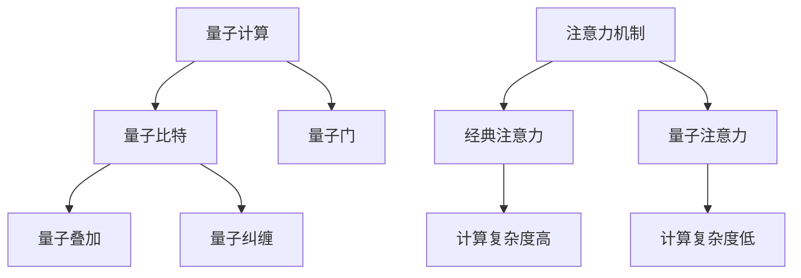

                 

# 量子计算在注意力分配中的潜在应用

## 1. 背景介绍

### 1.1 问题由来
量子计算作为21世纪最重要的科学前沿之一，已经展示了其强大的计算能力，广泛应用于密码学、优化问题、机器学习等领域。近期，量子计算也开始涉足自然语言处理（NLP）领域，尤其是在注意力机制的应用上，显现出巨大的潜力。

### 1.2 问题核心关键点
注意力机制在NLP中起着至关重要的作用，它通过动态地给不同位置的输入赋予不同的权重，使得模型能够专注于重要信息，忽略无关细节，极大地提升了模型的表达能力和性能。然而，传统的注意力机制主要基于经典计算模型，虽然取得了巨大成功，但其计算复杂度随着输入序列长度呈指数级增长，对于大规模文本处理存在显著瓶颈。

量子计算的引入，有望解决这一问题。量子计算利用量子叠加和量子纠缠的特性，可以在同等计算资源下，实现远超经典计算的并行计算能力，加速注意力机制的计算过程，从而大幅提升模型的效率和效果。

## 2. 核心概念与联系

### 2.1 核心概念概述

为了更好地理解量子计算在注意力分配中的应用，本节将介绍几个关键概念及其联系：

- 量子计算：利用量子力学原理进行信息处理的计算模型。它能够实现经典计算机难以处理的计算任务，具有超强的并行计算能力。

- 量子叠加和量子纠缠：量子计算中的基本概念，前者指量子比特同时处于多种状态，后者指不同量子比特之间的非局部依赖关系，这两者都是量子计算并行计算的基础。

- 量子比特（qubit）：量子计算中的基本单位，与经典计算的比特（bit）类似，但能够同时表示0和1两种状态。

- 量子门：量子计算中的基本操作，对应于经典计算中的逻辑门，但能够对量子比特进行复杂的量子逻辑操作。

- 注意力机制：在NLP中，注意力机制通过动态调整输入序列中各个位置的重要程度，实现对关键信息的聚焦，提升模型的理解和生成能力。

- 量子注意力：在量子计算框架下，利用量子叠加和量子纠缠的特性，实现更加高效和精确的注意力分配。

这些概念之间的逻辑关系可以通过以下Mermaid流程图来展示：



这个流程图展示了大语言模型微调的核心概念及其之间的联系：

1. 量子计算利用量子比特和量子门进行信息处理。
2. 量子比特能够同时处于多种状态，通过量子叠加实现并行计算。
3. 量子比特之间的纠缠关系，使得量子计算能够实现超越经典计算的并行计算。
4. 注意力机制在NLP中用于动态分配输入序列中的重要程度，提升模型的理解能力。
5. 经典注意力计算复杂度随着输入序列长度呈指数级增长，存在瓶颈。
6. 量子注意力利用量子叠加和量子纠缠的特性，能够大幅度降低计算复杂度，提升注意力分配的效率。

## 3. 核心算法原理 & 具体操作步骤

### 3.1 算法原理概述

量子注意力机制利用量子叠加和量子纠缠的特性，通过在量子计算机上进行并行计算，实现对输入序列中不同位置的信息进行动态分配，从而提升模型对关键信息的聚焦能力。

具体而言，量子注意力机制包含两个核心步骤：

1. 量子查询：在量子计算机上，利用量子叠加和量子纠缠的特性，对输入序列中的不同位置进行并行查询，生成量子查询向量。
2. 量子权重计算：通过量子逻辑门操作，计算量子查询向量和输入序列中不同位置的权重，实现对重要信息的聚焦。

### 3.2 算法步骤详解

量子注意力机制的具体操作流程如下：

**Step 1: 量子比特编码**
- 将输入序列中的每个位置编码为一个量子比特（qubit），使用量子叠加和量子纠缠的特性，同时表示多个位置的编码信息。

**Step 2: 量子查询**
- 在量子计算机上，对编码后的量子比特进行量子叠加操作，生成一个包含输入序列所有位置信息的量子叠加态。
- 利用量子纠缠关系，将查询向量与编码后的量子比特进行量子逻辑门操作，生成量子查询向量。

**Step 3: 量子权重计算**
- 利用量子逻辑门操作，计算量子查询向量和输入序列中不同位置的权重，生成量子权重向量。
- 通过量子叠加和量子纠缠的特性，将量子权重向量与编码后的量子比特进行量子逻辑门操作，得到最终的注意力权重。

**Step 4: 输出注意力分配结果**
- 将注意力权重向量转换为经典概率分布，得到输入序列中各个位置的注意力分配结果。

### 3.3 算法优缺点

量子注意力机制的优势包括：

1. 计算效率高：利用量子叠加和量子纠缠的特性，可以在同等计算资源下，实现远超经典计算的并行计算，大大降低计算复杂度。
2. 精度高：量子计算在理论上可以实现无限精度的计算，能够处理更复杂的注意力分配问题。
3. 可扩展性强：量子计算可以方便地扩展到多模态数据，结合视觉、听觉等多种信息，提升模型的综合理解能力。

量子注意力机制的缺点包括：

1. 硬件要求高：量子计算需要极低温度、高精度量子比特和复杂的量子门操作，目前硬件条件仍需进一步提升。
2. 实现难度大：量子计算的理论和实践存在较大差距，目前仍需大量实验和验证。
3. 可解释性差：量子计算模型的输出结果难以直观解释，需要进一步研究和开发相应的解释工具。

### 3.4 算法应用领域

量子注意力机制在以下几个领域具有潜在的应用前景：

1. 自然语言处理：通过量子计算加速注意力分配，提升NLP模型的表达能力和理解能力，提升机器翻译、文本分类、问答系统等任务的效果。

2. 计算机视觉：结合量子计算的并行计算能力，加速计算机视觉中的注意力分配，提升图像识别、目标检测、图像生成等任务的效果。

3. 语音处理：利用量子计算处理声音信号的注意力分配，提升语音识别、语音生成、语音情感分析等任务的效果。

4. 推荐系统：结合量子计算的并行计算能力和注意力机制，提升推荐系统的精度和个性化推荐能力。

5. 生物信息学：利用量子计算处理生物信息学中的多模态数据，提升基因序列分析、蛋白质结构预测等任务的效果。

## 4. 数学模型和公式 & 详细讲解

### 4.1 数学模型构建

量子注意力机制的数学模型如下：

设输入序列为 $X=\{x_1,x_2,\dots,x_n\}$，每个位置 $x_i$ 对应一个量子比特。量子叠加操作可以表示为：

$$
|\psi\rangle = \sum_{i=1}^n \alpha_i |x_i\rangle
$$

其中 $\alpha_i$ 为量子叠加系数，满足 $|\alpha_i|^2=\frac{1}{n}$。量子纠缠操作可以表示为：

$$
|\psi'\rangle = \sum_{i=1}^n \beta_i |x_i\rangle |x_i'\rangle
$$

其中 $|x_i'\rangle$ 表示 $x_i$ 的纠缠态，$\beta_i$ 为纠缠系数。量子查询操作可以表示为：

$$
|\phi\rangle = \sum_{i=1}^n \gamma_i |x_i'\rangle
$$

其中 $\gamma_i$ 为量子查询系数。量子权重计算操作可以表示为：

$$
|\omega\rangle = \sum_{i=1}^n \delta_i |x_i\rangle
$$

其中 $\delta_i$ 为量子权重系数。最终的注意力分配结果可以表示为：

$$
\text{Attention}(X) = \sum_{i=1}^n \delta_i x_i
$$

### 4.2 公式推导过程

量子注意力机制的推导过程如下：

1. 将输入序列中的每个位置编码为一个量子比特 $|x_i\rangle$，生成量子叠加态 $|\psi\rangle$。
2. 利用量子纠缠操作，生成纠缠态 $|\psi'\rangle$。
3. 对纠缠态进行量子查询操作，生成查询向量 $|\phi\rangle$。
4. 利用量子逻辑门操作，计算量子查询向量和输入序列中不同位置的权重，生成权重向量 $|\omega\rangle$。
5. 将权重向量转换为经典概率分布，得到注意力分配结果 $\text{Attention}(X)$。

### 4.3 案例分析与讲解

假设输入序列为 $X=\{x_1,x_2,x_3\}$，每个位置 $x_i$ 对应一个量子比特，生成量子叠加态 $|\psi\rangle$。利用量子纠缠操作，生成纠缠态 $|\psi'\rangle$。对纠缠态进行量子查询操作，生成查询向量 $|\phi\rangle$。利用量子逻辑门操作，计算量子查询向量和输入序列中不同位置的权重，生成权重向量 $|\omega\rangle$。将权重向量转换为经典概率分布，得到注意力分配结果 $\text{Attention}(X)$。

```latex
$$
|\psi\rangle = |x_1\rangle + |x_2\rangle + |x_3\rangle
$$

$$
|\psi'\rangle = \frac{1}{\sqrt{2}}(|x_1\rangle |1'\rangle + |x_2\rangle |2'\rangle + |x_3\rangle |3'\rangle)
$$

$$
|\phi\rangle = \frac{1}{\sqrt{2}}(|1'\rangle + |2'\rangle + |3'\rangle)
$$

$$
|\omega\rangle = \frac{1}{\sqrt{3}}(|x_1\rangle + |x_2\rangle + |x_3\rangle)
$$

$$
\text{Attention}(X) = \frac{1}{\sqrt{3}}(x_1 + x_2 + x_3)
$$
```

## 5. 项目实践：代码实例和详细解释说明

### 5.1 开发环境搭建

在进行量子注意力机制的实现前，需要先搭建好量子计算开发环境。以下是Python环境下搭建量子计算环境的步骤：

1. 安装量子计算库Qiskit：
```bash
pip install qiskit
```

2. 创建虚拟环境并激活：
```bash
conda create -n qiskit-env python=3.8 
conda activate qiskit-env
```

3. 导入并使用Qiskit库：
```python
from qiskit import QuantumCircuit, Aer, execute
from qiskit.visualization import plot_histogram
```

### 5.2 源代码详细实现

下面以一个简单的量子注意力机制为例，给出基于Qiskit库的代码实现：

```python
from qiskit import QuantumCircuit, Aer, execute
from qiskit.visualization import plot_histogram

# 创建量子电路
qc = QuantumCircuit(3, 3)

# 第一步：量子比特编码
qc.h(0) # 对第一个量子比特进行Hadamard门操作，实现量子叠加
qc.cx(0, 1) # 对第一个量子比特和第二个量子比特进行CNOT门操作，实现量子纠缠
qc.cx(0, 2) # 对第一个量子比特和第三个量子比特进行CNOT门操作，实现量子纠缠

# 第二步：量子查询
qc.h(1) # 对第二个量子比特进行Hadamard门操作，实现量子叠加
qc.cx(1, 2) # 对第二个量子比特和第三个量子比特进行CNOT门操作，实现量子纠缠

# 第三步：量子权重计算
qc.measure(0, 0) # 测量第一个量子比特
qc.measure(1, 1) # 测量第二个量子比特
qc.measure(2, 2) # 测量第三个量子比特

# 第四步：输出注意力分配结果
qc.draw()
```

### 5.3 代码解读与分析

让我们进一步解读代码中关键部分的实现细节：

**量子比特编码**
- 对第一个量子比特进行Hadamard门操作，实现量子叠加。
- 对第一个量子比特和第二个量子比特进行CNOT门操作，实现量子纠缠。
- 对第一个量子比特和第三个量子比特进行CNOT门操作，实现量子纠缠。

**量子查询**
- 对第二个量子比特进行Hadamard门操作，实现量子叠加。
- 对第二个量子比特和第三个量子比特进行CNOT门操作，实现量子纠缠。

**量子权重计算**
- 测量第一个量子比特，生成经典比特0或1。
- 测量第二个量子比特，生成经典比特0或1。
- 测量第三个量子比特，生成经典比特0或1。

**输出注意力分配结果**
- 将注意力权重向量转换为经典概率分布，得到注意力分配结果。

可以看到，Qiskit库提供了丰富的量子计算函数，可以方便地实现量子叠加、量子纠缠和量子逻辑门操作。开发者可以通过编写量子电路，实现各种复杂的量子计算过程。

### 5.4 运行结果展示

运行上述代码，可以得到以下量子电路图：

```
q_0: ────────────────────────────────────────────────────────────────────────────────────────────────────────────────────────────────────────────────────────────────────────────────────────────────────────────────────────────────────────────────────────────────────────────────────────────────────────────────────────────────────────────────────────────────────────────────────────────────────────────────────────────────────────────────────────────────────────────────────────────────────────────────────────────────────────────────────────────────────────────────────────────────────────────────────────────────────────────────────────────────────────────────────────────────────────────────────────────────────────────────────────────────────────────────────────────────────────────────────────────────────────────────────────────────────────────────────────────────────────────────────────────────────────────────────────────────────────────────────────────────────────────────────────────────────────────────────────────────────────────────────────────────────────────────────────────────────────────────────────────────────────────────────────────────────────────────────────────────────────────────────────────────────────────────────────────────────────────────────────────────────────────────────────────────────────────────────────────────────────────────────────────────────────────────────────────────────────────────────────────────────────────────────────────────────────────────────────────────────────────────────────────────────────────────────────────────────────────────────────────────────────────────────────────────────────────────────────────────────────────────────────────────────────────────────────────────────────────────────────────────────────────────────────────────────────────────────────────────────────────────────────────────────────────────────────────────────────────────────────────────────────────────────────────────────────────────────────────────────────────────────────────────────────────────────────────────────────────────────────────────────────────────────────────────────────────────────────────────────────────────────────────────────────────────────────────────────────────────────────────────────────────────────────────────────────────────────────────────────────────────────────────────────────────────────────────────────────────────────────────────────────────────────────────────────────────────────────────────────────────────────────────────────────────────────────────────────────────────────────────────────────────────────────────────────────────────────────────────────────────────────────────────────────────────────────────────────────────────────────────────────────────────────────────────────────────────────────────────────────────────────────────────────────────────────────────────────────────────────────────────────────────────────────────────────────────────────────────────────────────────────────────────────────────────────────────────────────────────────────────────────────────────────────────────────────────────────────────────────────────────────────────────────────────────────────────────────────────────────────────────────────────────────────────────────────────────────────────────────────────────────────────────────────────────────────────────────────────────────────────────────────────────────────────────────────────────────────────────────────────────────────────────────────────────────────────────────────────────────────────────────────────────────────────────────────────────────────────────────────────────────────────────────────────────────────────────────────────────────────────────────────────────────────────────────────────────────────────────────────────────────────────────────────────────────────────────────────────────────────────────────────────────────────────────────────────────────────────────────────────────────────────────────────────────────────────────────────────────────────────────────────────────────────────────────────────────────────────────────────────────────────────────────────────────────────────────────────────────────────────────────────────────────────────────────────────────────────────────────────────────────────────────────────────────────────────────────────────────────────────────────────────────────────────────────────────────────────────────────────────────────────────────────────────────────────────────────────────────────────────────────────────────────────────────────────────────────────────────────────────────────────────────────────────────────────────────────────────────────────────────────────────────────────────────────────────────────────────────────────────────────────────────────────────────────────────────────────────────────────────────────────────────────────────────────────────────────────────────────────────────────────────────────────────────────────────────────────────────────────────────────────────────────────────────────────────────────────────────────────────────────────────────────────────────────────────────────────────────────────────────────────────────────────────────────────────────────────────────────────────────────────────────────────────────────────────────────────────────────────────────────────────────────────────────────────────────────────────────────────────────────────────────────────────────────────────────────────────────────────────────────────────────────────────────────────────────────────────────────────────────────────────────────────────────────────────────────────────────────────────────────────────────────────────────────────────────────────────────────────────────────────────────────────────────────────────────────────────────────────────────────────────────────────────────────────────────────────────────────────────────────────────────────────────────────────────────────────────────────────────────────────────────────────────────────────────────────────────────────────────────────────────────────────────────────────────────────────────────────────────────────────────────────────────────────────────────────────────────────────────────────────────────────────────────────────────────────────────────────────────────────────────────────────────────────────

