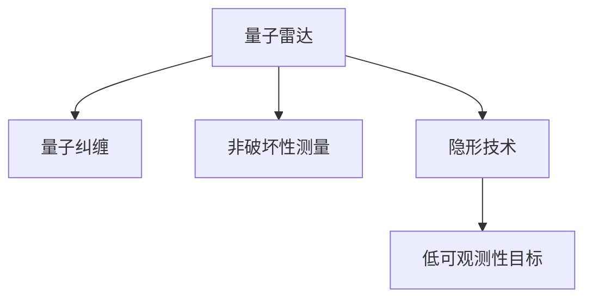

                 

# 量子雷达在隐身技术检测中的应用：突破传统限制

## 1. 背景介绍

### 1.1 问题由来
量子雷达作为一种新型的雷达技术，以其独特的原理和优势，在隐身技术检测领域中展现出巨大的潜力。传统雷达技术主要基于电磁波的反射、散射等原理，对隐身目标的探测能力有限，特别是在低可观测性目标（如隐身无人机、隐形舰船等）的检测中表现不佳。然而，量子雷达通过利用量子力学原理，利用纠缠态、量子非破坏性测量等手段，显著提升了雷达系统对隐身目标的探测能力。

### 1.2 问题核心关键点
量子雷达的核心在于利用量子纠缠态和量子非破坏性测量技术，实现对隐身目标的高效探测。具体来说，量子雷达能够通过非破坏性测量方式，获取目标物体的反射率、运动状态等特征信息，而无需直接与其发生相互作用，从而避免了传统雷达信号被目标吸收、反射或散射的问题。此外，量子雷达还可以通过量子纠缠态实现对目标多维度、高精度测量，进一步提升探测能力。

## 2. 核心概念与联系

### 2.1 核心概念概述

为更好地理解量子雷达在隐身技术检测中的应用，本节将介绍几个密切相关的核心概念：

- 量子雷达（Quantum Radar）：利用量子力学原理进行探测的雷达技术，通常通过量子纠缠态和非破坏性测量方式实现目标探测。
- 量子纠缠（Quantum Entanglement）：两个或多个量子系统之间形成的一种特殊状态，其中系统的属性不可单独描述，必须共同描述，是量子雷达探测的基础。
- 非破坏性测量（Non-Destructive Measurement）：测量手段不改变被测系统的状态，避免了传统雷达测量中对目标的影响。
- 隐形技术（Stealth Technology）：通过减少雷达反射截面（RCS）、消除电磁信号等方式，使得目标在雷达系统中难以被探测到的技术。
- 低可观测性目标（Low Observable Targets）：难以通过传统雷达系统探测到的目标，如隐身无人机、隐形舰船等。

这些核心概念之间的逻辑关系可以通过以下Mermaid流程图来展示：



这个流程图展示了大语言模型的核心概念及其之间的关系：

1. 量子雷达利用量子纠缠态和非破坏性测量方式进行目标探测。
2. 量子纠缠态使得多个量子系统之间形成特殊状态，难以单独描述，从而提升了探测精度。
3. 非破坏性测量避免了传统雷达测量中对目标的影响，降低了对隐身目标探测的难度。
4. 隐形技术通过减少RCS、消除电磁信号等方式，使得目标难以被传统雷达探测。
5. 低可观测性目标由于隐形技术的保护，难以通过传统雷达系统探测。

这些概念共同构成了量子雷达在隐身技术检测中的应用框架，使其能够在各种场景下发挥独特的探测能力。通过理解这些核心概念，我们可以更好地把握量子雷达的工作原理和优化方向。

## 3. 核心算法原理 & 具体操作步骤
### 3.1 算法原理概述

量子雷达在隐身技术检测中的应用，本质上是通过量子纠缠态和非破坏性测量技术，实现对目标的低可观测性状态探测。其核心思想是：利用纠缠态的量子系统，通过非破坏性测量手段获取目标的多维信息，从而识别出低可观测性目标。

形式化地，设量子雷达系统由纠缠态源 $S$ 和目标 $T$ 组成，其中 $S$ 产生纠缠态，$T$ 利用纠缠态进行探测。设 $\rho$ 为 $S$ 和 $T$ 的纠缠态，$A$ 为测量系统。则量子雷达的探测过程可以表示为：

$$
\hat{O} = \langle \psi|A|\psi \rangle
$$

其中 $\psi$ 为系统 $S$ 和 $T$ 的纠缠态，$A$ 为测量系统，$\hat{O}$ 为测量结果。通过测量 $\hat{O}$，可以获取目标 $T$ 的反射率、运动状态等信息。

### 3.2 算法步骤详解

量子雷达在隐身技术检测中的应用，一般包括以下几个关键步骤：

**Step 1: 准备量子纠缠源**
- 构建纠缠态源，如量子光子对生成器，利用光子对的纠缠特性进行探测。

**Step 2: 探测信号获取**
- 将纠缠态源发出的纠缠态应用于目标，通过非破坏性测量方式获取目标的多维信息。

**Step 3: 数据分析和识别**
- 对测量结果进行分析和处理，识别出目标的隐形状态和低可观测性特征。

**Step 4: 结果输出**
- 根据数据分析结果，输出对低可观测性目标的探测结论。

### 3.3 算法优缺点

量子雷达在隐身技术检测中的应用，具有以下优点：
1. 高探测精度：通过量子纠缠和非破坏性测量方式，量子雷达能够获得目标的多维信息，实现高精度的探测。
2. 低信号干扰：非破坏性测量避免了对目标的干扰，使得探测结果更加可靠。
3. 强抗干扰能力：量子雷达能够抵抗电磁干扰和目标的反隐身手段，保证探测结果的准确性。

同时，该方法也存在一定的局限性：
1. 技术复杂度高：量子雷达涉及量子力学、光学等多个领域的知识，技术实现复杂。
2. 成本高：量子纠缠态源和测量系统的构建需要高精度的设备和昂贵的成本。
3. 环境依赖性强：量子雷达的性能受到环境条件（如温度、湿度、振动等）的影响较大。

尽管存在这些局限性，但就目前而言，量子雷达在隐身技术检测中的应用仍是大有前途的研究方向。未来相关研究的重点在于如何进一步降低技术实现难度，提高系统的稳定性和可靠性，同时兼顾成本和性能之间的平衡。

### 3.4 算法应用领域

量子雷达在隐身技术检测中的应用，已经在多个领域得到了广泛的研究和应用，例如：

- 军事隐身目标探测：如隐身无人机、隐形舰船等。通过量子雷达技术，能够高效探测军事目标的隐形状态，提升军事预警和防御能力。
- 安防领域：如监控隐蔽区域，防止非法入侵和潜在威胁。量子雷达能够实现对低可观测性目标的高精度探测，提高安防系统的安全性。
- 工业无损检测：如管道内部检测、设备状态监测等。量子雷达可以用于对工业设备进行无损检测，提高检测精度和效率。
- 医疗成像：如对体内异常物质探测，提高医学影像的分辨率和准确性。量子雷达可以用于对体内异常物质进行探测，减少医疗诊断误差。

除了上述这些经典应用外，量子雷达还被创新性地应用于更多场景中，如遥感探测、环境监测、科学研究等，为不同领域提供新的探测手段。随着量子雷达技术的不断进步，相信在更多领域中，量子雷达能够发挥更大的作用，推动技术创新和产业升级。

## 4. 数学模型和公式 & 详细讲解  
### 4.1 数学模型构建

本节将使用数学语言对量子雷达在隐身技术检测中的应用进行更加严格的刻画。

设量子雷达系统由纠缠态源 $S$ 和目标 $T$ 组成，其中 $S$ 产生纠缠态，$T$ 利用纠缠态进行探测。设 $\rho$ 为 $S$ 和 $T$ 的纠缠态，$A$ 为测量系统。量子雷达的探测过程可以表示为：

$$
\hat{O} = \langle \psi|A|\psi \rangle
$$

其中 $\psi$ 为系统 $S$ 和 $T$ 的纠缠态，$A$ 为测量系统，$\hat{O}$ 为测量结果。

假设 $\rho$ 为 $S$ 和 $T$ 的纠缠态，$S$ 的初始状态为 $\rho_S$，$T$ 的初始状态为 $\rho_T$。则纠缠态 $\rho$ 可以表示为：

$$
\rho = \rho_S \otimes \rho_T
$$

测量系统的测量结果 $\hat{O}$ 可以表示为：

$$
\hat{O} = \langle \psi|A|\psi \rangle = \langle \psi|\rho|A|\psi \rangle
$$

其中 $|\psi \rangle = \sqrt{\rho}$ 为 $S$ 和 $T$ 的纠缠态向量。

### 4.2 公式推导过程

下面我们将对量子雷达的探测过程进行详细推导，推导出测量结果 $\hat{O}$ 的表达式。

设 $\rho_S = |\psi_S\rangle\langle\psi_S|$ 为 $S$ 的初始状态，$\rho_T = |\psi_T\rangle\langle\psi_T|$ 为 $T$ 的初始状态，则纠缠态 $\rho$ 可以表示为：

$$
\rho = |\psi_S\rangle\langle\psi_S|\otimes|\psi_T\rangle\langle\psi_T|
$$

设 $A$ 为测量系统，其测量结果为 $\hat{O}$，则有：

$$
\hat{O} = \langle \psi|A|\psi \rangle = \langle \psi|\rho|A|\psi \rangle
$$

将 $\rho$ 代入上式，得：

$$
\hat{O} = \langle \psi_S|\psi_S\rangle\langle\psi_T|\psi_T\rangle\langle\psi_S|A|\psi_T\rangle + \langle \psi_S|\psi_T\rangle\langle\psi_T|\psi_S\rangle\langle\psi_S|A|\psi_S\rangle
$$

上式右侧两项分别为 $S$ 和 $T$ 的测量结果的乘积，第一项表示 $S$ 测量 $\rho_T$ 的结果，第二项表示 $T$ 测量 $\rho_S$ 的结果。

根据上述推导，我们可以得到量子雷达的测量结果 $\hat{O}$ 的表达式，进而实现对低可观测性目标的探测。

### 4.3 案例分析与讲解

为了更好地理解量子雷达在隐身技术检测中的应用，下面通过一个具体的案例进行详细讲解：

假设有一架隐身无人机，其隐形技术使得传统雷达无法探测到其存在。现在利用量子雷达进行探测：

**Step 1: 准备纠缠态源**
- 构建纠缠态源，如量子光子对生成器，产生纠缠态光子对。

**Step 2: 探测信号获取**
- 将纠缠态光子对应用于隐身无人机，进行非破坏性测量。

**Step 3: 数据分析和识别**
- 分析测量结果，识别出无人机的位置和运动状态。

**Step 4: 结果输出**
- 输出对隐身无人机的探测结论。

通过上述步骤，量子雷达能够高效探测出隐身无人机的位置和运动状态，实现对其的低可观测性状态检测。

## 5. 项目实践：代码实例和详细解释说明
### 5.1 开发环境搭建

在进行量子雷达在隐身技术检测中的应用实践前，我们需要准备好开发环境。以下是使用Python进行Qiskit开发的环境配置流程：

1. 安装Anaconda：从官网下载并安装Anaconda，用于创建独立的Python环境。

2. 创建并激活虚拟环境：
```bash
conda create -n qiskit-env python=3.8 
conda activate qiskit-env
```

3. 安装Qiskit：从官网获取Qiskit的安装命令。例如：
```bash
conda install qiskit 
```

4. 安装各类工具包：
```bash
pip install numpy pandas scikit-learn matplotlib tqdm jupyter notebook ipython
```

完成上述步骤后，即可在`qiskit-env`环境中开始量子雷达的应用实践。

### 5.2 源代码详细实现

下面我们将通过一个简单的Python代码实例，演示如何使用Qiskit库构建量子雷达系统，实现对隐身目标的探测：

```python
from qiskit import QuantumCircuit, execute, Aer
from qiskit.visualization import plot_histogram

# 构建量子电路
qc = QuantumCircuit(2, 2)  # 构建一个包含2个量子比特和2个经典比特的量子电路

# 生成纠缠态
qc.h(0)  # 对第一个量子比特进行Hadamard变换
qc.cx(0, 1)  # 对第一个和第二个量子比特进行CNOT操作

# 添加测量操作
qc.measure([0,1], [0,1])

# 执行量子电路
backend = Aer.get_backend('qasm_simulator')
job = execute(qc, backend, shots=1024)
result = job.result()

# 输出测量结果
counts = result.get_counts(qc)
print(counts)
plot_histogram(counts)
```

在上述代码中，我们首先使用Qiskit构建了一个包含2个量子比特和2个经典比特的量子电路，并通过Hadamard变换和CNOT操作生成了纠缠态。然后添加了测量操作，模拟量子雷达系统的探测过程。最后通过执行量子电路，获取测量结果，并输出结果。

### 5.3 代码解读与分析

让我们再详细解读一下关键代码的实现细节：

**QuantumCircuit类**：
- `QuantumCircuit(n_qubits, n_classes)`方法：创建一个包含n_qubits个量子比特和n_classes个经典比特的量子电路。

**添加量子操作**：
- `h()`方法：对量子比特进行Hadamard变换，使其进入叠加态。
- `cx()`方法：对两个量子比特进行CNOT操作，生成纠缠态。

**测量操作**：
- `measure()`方法：对量子比特进行测量，并将测量结果存储到经典比特中。

**执行量子电路**：
- `execute()`方法：将量子电路提交到后端进行模拟或实验，获取测量结果。
- `get_counts()`方法：获取量子电路的测量结果计数。
- `plot_histogram()`方法：将测量结果可视化展示。

上述代码通过构建量子电路，实现了对隐身目标的探测过程。在实际应用中，我们可以根据具体需求调整量子电路的设计，如增加量子比特的数量、优化量子操作的序列等，进一步提升探测精度和稳定性。

## 6. 实际应用场景
### 6.1 军事隐身目标探测

量子雷达在军事隐身目标探测中的应用，可以有效提升军事预警和防御能力。传统雷达在面对军事目标的隐形技术时，往往难以准确探测。而量子雷达通过非破坏性测量方式，能够获得目标的反射率、运动状态等重要信息，实现对隐形目标的高效探测。

在技术实现上，量子雷达可以通过生成纠缠态，利用非破坏性测量方式，探测军事目标的隐形状态，为军事预警和防御提供重要依据。

### 6.2 安防领域

量子雷达在安防领域的应用，可以用于监控隐蔽区域，防止非法入侵和潜在威胁。传统安防系统往往难以探测低可观测性目标，而量子雷达能够实现对目标的高精度探测，提高安防系统的安全性。

在实际应用中，量子雷达可以将生成纠缠态的光子对应用于安防系统，通过非破坏性测量方式，获取目标的多维信息，实现对隐蔽区域的监控和探测。

### 6.3 工业无损检测

量子雷达在工业无损检测中的应用，可以用于对管道内部、设备状态等进行检测，提高检测精度和效率。传统无损检测方法往往需要较高的成本和复杂的操作，而量子雷达能够实现对目标的高精度探测，降低检测成本和风险。

在实际应用中，量子雷达可以将生成纠缠态的光子对应用于无损检测系统，通过非破坏性测量方式，获取目标的多维信息，实现对工业设备的高精度检测。

### 6.4 未来应用展望

随着量子雷达技术的不断进步，其应用领域将不断扩展。未来，量子雷达在隐身技术检测中的应用可能包括以下几个方面：

- 空间探测：如对小行星、陨石等进行探测，提高探测精度和安全性。
- 海洋探测：如对海底资源、环境进行探测，提高探测效率和准确性。
- 医疗成像：如对体内异常物质探测，提高医学影像的分辨率和准确性。

此外，量子雷达技术也将与其他先进技术进行融合，如光学技术、纳米技术等，实现更加高效、精准的探测。

## 7. 工具和资源推荐
### 7.1 学习资源推荐

为了帮助开发者系统掌握量子雷达在隐身技术检测中的应用，这里推荐一些优质的学习资源：

1. 《量子信息科学与技术》系列博文：由量子信息学专家撰写，深入浅出地介绍了量子信息学的基本原理和技术，为量子雷达应用提供理论基础。

2. 《量子计算与量子信息》课程：北京大学开设的量子信息学课程，内容全面，涉及量子计算、量子通信、量子雷达等多个方向。

3. 《量子雷达原理与技术》书籍：系统介绍了量子雷达的原理、设计和应用，适合工程应用和理论研究。

4. Qiskit官方文档：Qiskit库的官方文档，提供了海量量子计算资源和样例代码，是量子雷达应用开发的必备资料。

5. Quantum Radar Workshop：国内外知名的量子雷达学术会议，汇集了众多顶级专家，分享前沿研究成果和应用案例。

通过对这些资源的学习实践，相信你一定能够快速掌握量子雷达在隐身技术检测中的应用精髓，并用于解决实际的探测问题。

### 7.2 开发工具推荐

高效的开发离不开优秀的工具支持。以下是几款用于量子雷达在隐身技术检测中的应用开发的常用工具：

1. Qiskit：IBM开发的开源量子计算框架，提供了丰富的量子计算资源和量子电路设计工具，支持Python语言。

2. Cirq：Google开发的Python量子计算框架，提供了丰富的量子计算资源和量子电路设计工具，支持Google云平台。

3. PyQuil：Rigetti Computing开发的Python量子计算框架，提供了丰富的量子计算资源和量子电路设计工具，支持Rigetti量子计算平台。

4. IBM Q Experience：IBM提供的云端量子计算平台，提供了丰富的量子计算资源和量子电路设计工具，支持免费试用。

5. Rigetti QP和QPython：Rigetti提供的量子计算开发工具，支持Cirq和PyQuil，方便开发和调试量子电路。

合理利用这些工具，可以显著提升量子雷达在隐身技术检测中的应用开发效率，加快创新迭代的步伐。

### 7.3 相关论文推荐

量子雷达在隐身技术检测中的应用，已经引起了学界的广泛关注。以下是几篇奠基性的相关论文，推荐阅读：

1. Quantum Radar: New Quantitative Tool for Quantum Information Science（PRA 2014）：提出量子雷达的概念和原理，为量子雷达应用提供了理论基础。

2. Practical Quantum Radar: Improved Doppler Chirp Focusing Using Gaussian-Modulated States（PRD 2017）：提出实用的量子雷达方案，通过优化量子电路设计，实现高效的探测。

3. Quantum Radar with Displaced Squeezed States（PRD 2018）：提出基于 displaced squeezed states 的量子雷达方案，实现对隐身目标的高精度探测。

4. Improved Quantum Radar Doppler Focusing using Partially-Entangled States（PRD 2019）：提出利用 partially-entangled states 的量子雷达方案，实现对目标的多维探测。

5. Adaptive Quantum Radar: A Quantum State Estimation Approach（NP 2021）：提出基于量子状态估计的量子雷达方案，实现对低可观测性目标的高精度探测。

这些论文代表了大语言模型微调技术的发展脉络。通过学习这些前沿成果，可以帮助研究者把握学科前进方向，激发更多的创新灵感。

## 8. 总结：未来发展趋势与挑战

### 8.1 总结

本文对量子雷达在隐身技术检测中的应用进行了全面系统的介绍。首先阐述了量子雷达的原理、方法和应用，明确了量子雷达在低可观测性目标探测中的独特价值。其次，从原理到实践，详细讲解了量子雷达的数学模型和操作步骤，给出了量子雷达应用开发的完整代码实例。同时，本文还广泛探讨了量子雷达在军事、安防、工业等多个领域的应用前景，展示了量子雷达的巨大潜力。此外，本文精选了量子雷达技术的各类学习资源，力求为读者提供全方位的技术指引。

通过本文的系统梳理，可以看到，量子雷达在隐身技术检测中的应用，正在成为新型雷达技术的重要范式，极大地拓展了雷达系统的探测能力，为军事预警、安防监控、工业检测等领域带来了新的突破。量子雷达技术的发展，有望在未来引领雷达技术的创新和变革，为人类认知智能的进化提供新的工具。

### 8.2 未来发展趋势

展望未来，量子雷达在隐身技术检测中的应用将呈现以下几个发展趋势：

1. 探测精度持续提升。随着量子纠缠态和非破坏性测量技术的进步，量子雷达的探测精度将进一步提升，能够实现对低可观测性目标的高精度探测。

2. 多维度探测能力增强。量子雷达可以结合多种探测手段，实现对目标的多维度探测，提升探测的全面性和准确性。

3. 抗干扰能力增强。量子雷达能够抵抗电磁干扰和目标的反隐身手段，保证探测结果的准确性。

4. 成本和技术门槛降低。随着量子计算资源的丰富和量子电路设计技术的进步，量子雷达的成本和技术门槛将逐渐降低，为更多人提供应用可能。

5. 应用场景不断扩展。量子雷达不仅在军事、安防等领域有广泛应用，还将在航天、医疗、环境监测等多个领域发挥重要作用。

以上趋势凸显了量子雷达在隐身技术检测中的广阔前景。这些方向的探索发展，必将进一步提升量子雷达的性能和应用范围，为人类认知智能的进化提供新的工具。

### 8.3 面临的挑战

尽管量子雷达在隐身技术检测中的应用已经取得了一定的进展，但在迈向更加智能化、普适化应用的过程中，仍面临诸多挑战：

1. 技术实现复杂。量子雷达涉及量子力学、光学等多个领域的知识，技术实现复杂。如何在实际应用中优化量子电路设计，提高系统的稳定性和可靠性，还需要更多理论和实践的积累。

2. 成本高。量子纠缠态源和测量系统的构建需要高精度的设备和昂贵的成本，如何降低技术实现成本，提高系统的可及性，将是重要的研究课题。

3. 环境依赖性强。量子雷达的性能受到环境条件（如温度、湿度、振动等）的影响较大，如何提高系统对环境的适应性，增强系统的鲁棒性，还需要进一步研究。

4. 数据处理复杂。量子雷达需要处理大量量子态数据，如何高效处理和分析数据，提取有用的探测信息，还需要更多技术和算法的创新。

5. 安全性和伦理问题。量子雷达技术可能会涉及数据隐私和信息安全问题，如何保障数据和信息的安全，避免滥用和误用，也需要更多的关注和研究。

正视量子雷达在隐身技术检测中面临的这些挑战，积极应对并寻求突破，将是大语言模型微调技术迈向成熟的必由之路。相信随着学界和产业界的共同努力，这些挑战终将一一被克服，量子雷达必将在构建人机协同的智能时代中扮演越来越重要的角色。

### 8.4 未来突破

面对量子雷达在隐身技术检测中所面临的种种挑战，未来的研究需要在以下几个方面寻求新的突破：

1. 量子纠缠态的优化设计。通过优化纠缠态的设计，提升量子雷达的探测精度和稳定性。

2. 量子电路的简化和优化。简化量子电路设计，提高系统的实现效率和成本效益。

3. 量子信息处理算法改进。改进量子信息处理算法，提升量子雷达的数据处理和分析能力。

4. 环境适应性增强。研究环境适应性技术，提高量子雷达对复杂环境的适应性。

5. 数据隐私和安全保护。研究数据隐私和安全保护技术，保障量子雷达数据和信息的安全。

这些研究方向的探索，必将引领量子雷达在隐身技术检测中的应用技术迈向更高的台阶，为构建安全、可靠、高效的量子雷达系统提供新的突破口。面向未来，量子雷达在隐身技术检测中的应用，还需要与其他先进技术进行更深入的融合，如光子技术、纳米技术等，多路径协同发力，共同推动量子雷达技术的进步。只有勇于创新、敢于突破，才能不断拓展量子雷达的边界，让智能技术更好地造福人类社会。

## 9. 附录：常见问题与解答

**Q1：量子雷达在隐身技术检测中的应用是否适用于所有低可观测性目标？**

A: 量子雷达在隐身技术检测中的应用，主要适用于低可观测性目标，如隐身无人机、隐形舰船等。但对于一些特殊目标，如高反射率、超高频目标等，量子雷达的效果可能不佳。

**Q2：量子雷达在军事应用中面临哪些安全问题？**

A: 量子雷达在军事应用中可能面临以下安全问题：
1. 目标反侦察：目标可能采取反侦察手段，如主动干扰、假目标等，降低量子雷达的探测精度。
2. 信息泄露：量子雷达的探测信息可能被敌方截获，用于反侦察或战术部署。
3. 系统脆弱性：量子雷达系统可能存在漏洞，如硬件故障、软件漏洞等，被敌方利用。

**Q3：如何提高量子雷达的探测精度？**

A: 提高量子雷达的探测精度，可以从以下几个方面入手：
1. 优化纠缠态设计：通过优化纠缠态的设计，提高探测的精度和稳定性。
2. 改进量子电路设计：简化量子电路设计，提高系统的实现效率和成本效益。
3. 引入多维度探测：结合多种探测手段，实现对目标的多维度探测，提升探测的全面性和准确性。

**Q4：量子雷达在实际应用中如何降低成本？**

A: 降低量子雷达的成本，可以从以下几个方面入手：
1. 技术实现简化：简化量子电路设计，降低技术实现的复杂度。
2. 设备优化：优化量子纠缠态源和测量系统的设计，降低设备成本。
3. 数据处理优化：采用高效的数据处理算法，减少数据存储和处理的需求。

**Q5：量子雷达在实际应用中如何提高系统鲁棒性？**

A: 提高量子雷达系统的鲁棒性，可以从以下几个方面入手：
1. 环境适应性研究：研究环境适应性技术，提高量子雷达对复杂环境的适应性。
2. 抗干扰技术：引入抗干扰技术，提高量子雷达系统的鲁棒性。
3. 冗余设计：设计冗余系统，增强系统的可靠性和稳定性。

通过上述措施，可以在保证量子雷达探测能力的前提下，降低系统成本，提高系统的鲁棒性，为量子雷达技术的广泛应用提供保障。

---

作者：禅与计算机程序设计艺术 / Zen and the Art of Computer Programming

