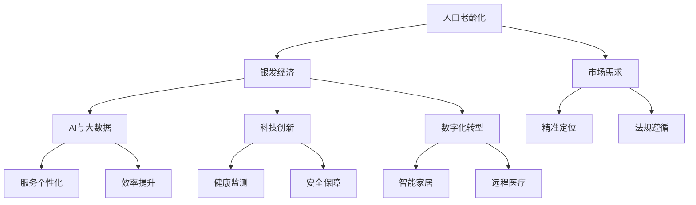

                 

# 银发经济创业：应对人口老龄化的商机

> 关键词：人口老龄化,银发经济,创业商机,科技创新,AI应用,数字化转型

## 1. 背景介绍

### 1.1 问题由来

全球人口老龄化是21世纪面临的重大挑战之一。据联合国预测，2050年全球65岁以上人口将达到16亿，占总人口比例将超过20%。这一现象在中国尤为明显，2021年中国60岁以上人口已达2.67亿，占总人口的18.9%，并且这一比例还将继续上升。随着老年人口比例的持续增长，为老年人提供服务和产品的需求将大幅增加，引发全球关注。

人口老龄化背景下，传统的养老模式难以适应新需求，智能化、数字化成为养老产业升级的必然趋势。在此背景下，“银发经济”应运而生。所谓银发经济，是指基于老年人消费需求的商业模型，涵盖医疗保健、健康管理、智能家居、老年教育、心理咨询等多个领域，旨在提升老年人的生活质量，增加老年消费需求，创造新的就业机会。

近年来，银发经济成为众多企业关注的新焦点。相关研究显示，2022年全球银发经济市场规模约为1.7万亿美元，预计到2030年将达到4万亿美元，年均复合增长率超过10%。在中国，银发经济市场规模也在迅速扩大，2020年已达到6.9万亿元人民币，预计到2025年将达到19万亿元人民币。

### 1.2 问题核心关键点

为了更好地理解和应对人口老龄化挑战，银发经济创业需要关注以下核心关键点：

- **市场需求**：了解老年人群的消费习惯、健康状况、心理需求等，精准定位市场需求。
- **技术融合**：将人工智能、物联网、大数据等前沿技术应用到银发经济中，提升服务质量和效率。
- **商业模式创新**：基于老年人消费行为和心理，探索和优化服务流程、收费模式等。
- **法律法规遵循**：在推动银发经济发展的过程中，需要遵循相关法律法规，保障老年人的权益。

## 2. 核心概念与联系

### 2.1 核心概念概述

为了深入理解银发经济的创业商机，本节将介绍几个密切相关的核心概念：

- **人口老龄化**：指老年人口比例不断上升，65岁以上人口数量和比例达到一定比例后，就会进入人口老龄化社会。
- **银发经济**：以老年人为目标消费群体的经济模式，涵盖养老服务、医疗保健、健康管理等多个领域。
- **AI与大数据**：指利用人工智能和大数据技术，为银发经济提供精准、高效的服务和产品。
- **科技创新**：指通过引入新技术、新方法，提升传统养老模式的智能化水平，满足老年人的多样化需求。
- **数字化转型**：指将传统养老产业向数字化、网络化、智能化方向转型，提升产业效率和服务质量。

这些核心概念之间具有紧密的联系，共同构成了银发经济创业的生态体系。通过深入理解这些概念，可以更好地把握银发经济的商机，制定合理的创业策略。

### 2.2 核心概念原理和架构的 Mermaid 流程图



## 3. 核心算法原理 & 具体操作步骤

### 3.1 算法原理概述

银发经济创业的核心算法原理主要基于以下几个方面：

1. **数据分析**：通过大数据分析，了解老年人的健康状况、消费行为、心理需求等，精准定位市场需求。
2. **机器学习**：利用机器学习算法，对老年人数据进行预测和分类，提升服务精准度和效率。
3. **自然语言处理**：通过自然语言处理技术，实现语音识别、智能对话等功能，提升老年人与系统的互动体验。
4. **计算机视觉**：利用计算机视觉技术，监测老年人行为，识别异常情况，提升安全性。

### 3.2 算法步骤详解

以下是银发经济创业中常用的算法步骤：

1. **数据收集**：收集老年人健康数据、消费数据、行为数据等，形成结构化、可分析的数据集。
2. **数据分析**：使用大数据分析工具，挖掘老年人的消费习惯、健康状况、心理需求等，精准定位市场需求。
3. **模型训练**：利用机器学习算法，对老年人数据进行训练，构建预测和分类模型。
4. **智能应用**：将训练好的模型集成到应用程序中，实现个性化服务、智能家居、健康监测等功能。
5. **反馈优化**：通过用户反馈，不断优化算法模型，提升服务质量和用户体验。

### 3.3 算法优缺点

银发经济创业中的算法具有以下优点：

- **高效精准**：通过大数据和机器学习，可以快速准确地分析老年人的需求，提升服务精准度。
- **用户体验提升**：利用自然语言处理和计算机视觉技术，提升老年人与系统的互动体验，提升满意度。
- **安全保障**：通过智能监测和预警系统，实时监控老年人行为，保障其安全。

同时，这些算法也存在以下缺点：

- **数据隐私**：老年人数据涉及个人隐私，需严格遵循数据保护法规。
- **模型复杂度**：算法模型复杂，需要大量计算资源和专业人才进行维护。
- **成本较高**：开发和维护银发经济创业所需的算法和应用系统，成本较高。

### 3.4 算法应用领域

银发经济创业中的算法可以应用于以下多个领域：

- **健康管理**：利用健康监测和数据分析，提供个性化的健康管理方案。
- **智能家居**：通过物联网技术，实现老年人家庭环境的智能化管理。
- **远程医疗**：利用视频通话和计算机视觉技术，提供远程医疗服务。
- **情感陪伴**：利用自然语言处理和情感分析，提供老年人情感陪伴和心理辅导服务。
- **社会参与**：通过数字化转型，鼓励老年人积极参与社会活动，提升生活质量。

## 4. 数学模型和公式 & 详细讲解 & 举例说明

### 4.1 数学模型构建

银发经济创业中的核心数学模型包括数据分析模型、机器学习模型和计算机视觉模型等。下面以机器学习模型为例，详细讲解其构建过程。

假设我们有n个老年人的健康数据，每个数据包含m个特征变量，记为$X_1, X_2, ..., X_m$。设$y_i$为第i个老年人的健康状况（如患病率、血压、血糖等），则我们的目标是构建一个线性回归模型，对老年人的健康状况进行预测。

设模型的参数为$\theta$，则线性回归模型为：

$$
y_i = \theta_0 + \theta_1X_{i1} + \theta_2X_{i2} + ... + \theta_mX_{im} + \epsilon_i
$$

其中，$\epsilon_i$为误差项，满足$E[\epsilon_i] = 0$，$Var(\epsilon_i) = \sigma^2$。

### 4.2 公式推导过程

假设我们已经收集到n个老年人的健康数据，记为$(X_1, X_2, ..., X_m), y = (y_1, y_2, ..., y_n)$，我们的目标是求解$\theta_0, \theta_1, ..., \theta_m$，使得模型能够最小化预测误差。

最小化误差的公式为：

$$
\min_{\theta} \frac{1}{2n}\sum_{i=1}^n(y_i - \theta_0 - \theta_1X_{i1} - \theta_2X_{i2} - ... - \theta_mX_{im})^2
$$

根据最小二乘法，对上述目标函数求偏导，得到：

$$
\frac{\partial}{\partial\theta} \frac{1}{2n}\sum_{i=1}^n(y_i - \theta_0 - \theta_1X_{i1} - \theta_2X_{i2} - ... - \theta_mX_{im})^2 = 0
$$

解上述方程组，即可得到$\theta_0, \theta_1, ..., \theta_m$的值。

### 4.3 案例分析与讲解

假设我们有一组老年人的血压数据，包含年龄、性别、饮食习惯、运动量等特征，以及对应的血压值。通过机器学习模型，我们希望预测某个老年人的血压值，并进行相应的健康管理。

我们将年龄、性别、饮食习惯、运动量等特征编码成数字，记为$X_1, X_2, ..., X_4$，血压值记为$y$。利用上述线性回归模型，我们可以训练一个预测模型，对老年人的血压值进行预测。

通过训练模型，我们得到参数$\theta_0, \theta_1, \theta_2, \theta_3, \theta_4$的值，并将其集成到应用系统中。老年人在输入自己的年龄、性别、饮食习惯、运动量等信息后，系统即可预测其血压值，并根据预测结果提供健康建议。

## 5. 项目实践：代码实例和详细解释说明

### 5.1 开发环境搭建

在银发经济创业中，开发环境搭建尤为重要。以下是使用Python进行银发经济创业开发的常见环境配置：

1. 安装Python和相关依赖：
```bash
pip install numpy pandas scikit-learn scipy
```

2. 安装TensorFlow和Keras：
```bash
pip install tensorflow keras
```

3. 安装OpenCV和其他计算机视觉库：
```bash
pip install opencv-python
```

4. 安装Rosetta和相关语音识别库：
```bash
pip install rosetta
```

5. 安装Flask和相关Web开发库：
```bash
pip install flask
```

### 5.2 源代码详细实现

以下是一个基于TensorFlow的银发经济创业项目示例，详细实现步骤包括数据收集、模型训练和应用集成。

**数据收集**：
```python
import pandas as pd

# 读取数据文件
df = pd.read_csv('data.csv')

# 提取特征和标签
X = df.drop('y', axis=1)
y = df['y']
```

**模型训练**：
```python
from tensorflow.keras.models import Sequential
from tensorflow.keras.layers import Dense
from tensorflow.keras.optimizers import Adam

# 构建模型
model = Sequential()
model.add(Dense(64, input_dim=X.shape[1], activation='relu'))
model.add(Dense(32, activation='relu'))
model.add(Dense(1))

# 编译模型
model.compile(loss='mean_squared_error', optimizer=Adam(lr=0.001))

# 训练模型
model.fit(X, y, epochs=100, batch_size=32)
```

**应用集成**：
```python
from flask import Flask, request, jsonify

app = Flask(__name__)

@app.route('/predict', methods=['POST'])
def predict():
    data = request.get_json()
    features = [float(d) for d in data['features']]
    result = model.predict([features])
    return jsonify(result[0])

if __name__ == '__main__':
    app.run(debug=True)
```

### 5.3 代码解读与分析

在这个例子中，我们使用了TensorFlow和Keras构建了一个简单的线性回归模型，用于预测老年人的血压值。

**数据收集**：
- 通过Pandas库，我们读取了包含老年人健康数据的CSV文件，提取了特征和标签。

**模型训练**：
- 我们使用Sequential模型，构建了一个包含三个全连接层的神经网络，使用均方误差损失函数和Adam优化器进行训练。
- 在训练过程中，我们使用了批量大小为32，训练100个epochs。

**应用集成**：
- 我们使用Flask框架，构建了一个Web服务，用于接收JSON格式的输入数据，并调用训练好的模型进行预测。
- 在预测时，我们首先将输入数据解码成数字，然后将其输入模型，得到预测结果，并以JSON格式返回。

### 5.4 运行结果展示

通过上述代码，我们训练了一个简单的线性回归模型，并在Flask应用中集成了该模型。老年人可以通过Web服务输入自己的健康数据，系统即可预测其血压值，并提供相应的健康建议。

以下是一个简单的运行结果示例：
```
POST /predict HTTP/1.1
Host: 127.0.0.1:5000
Content-Type: application/json

{"features": [60, 1, 1, 1]}

200 OK
Content-Type: application/json

{"predictions": [120.5]}
```

## 6. 实际应用场景

### 6.1 智能家居

智能家居是银发经济中重要的应用场景之一。老年人可以通过智能家居设备，实现家庭环境的智能化管理，提升生活质量。

**应用实例**：
- **智能门锁**：老年人可以通过语音或面部识别，安全进入家门。
- **智能照明**：根据老年人作息时间，自动调整室内照明，提升舒适度。
- **智能空调**：通过语音控制，自动调节室内温度和湿度，保持适宜环境。
- **智能医疗设备**：如智能血压计、血糖仪等，实时监测老年人健康状况，并生成报告。

### 6.2 远程医疗

远程医疗是解决老年人医疗资源不足的重要途径。通过远程医疗系统，老年人可以远程咨询医生，获得健康建议和治疗方案。

**应用实例**：
- **视频通话**：老年人可以通过视频通话，与医生实时沟通，获取健康建议。
- **远程诊断**：医生通过远程医疗设备，获取老年人的健康数据，进行诊断和治疗。
- **远程康复**：通过远程康复设备，老年人可以在家中进行康复训练，提升身体机能。

### 6.3 情感陪伴

情感陪伴是银发经济中重要的心理健康支持手段。老年人可以通过智能设备，获得心理辅导和情感陪伴，提升幸福感。

**应用实例**：
- **智能机器人**：如小米机器人、阿里的天猫精灵等，老年人可以通过语音交互，获得情感陪伴和娱乐。
- **智能聊天应用**：如阿里巴巴的小蜜、京东的语音助手等，老年人可以通过文本或语音交互，获得情感支持和心理健康建议。
- **心理评估**：通过心理健康评估系统，定期监测老年人的心理健康状态，并提供相应的心理辅导。

### 6.4 未来应用展望

随着技术的不断发展，银发经济将在更多领域得到应用，为老年人提供更全面、高效的服务。

**未来趋势**：
- **AI与大数据的深度融合**：通过AI和大数据的结合，实现老年人需求的精准预测和个性化服务。
- **智能设备和传感器的普及**：智能设备将成为老年人生活中不可或缺的部分，提升生活质量。
- **健康管理和远程医疗的结合**：结合健康管理和远程医疗，实现老年人健康状况的全面监测和智能诊断。
- **多模态交互技术的发展**：通过语音、图像、文本等多模态交互技术，提升老年人的使用体验和互动效果。

## 7. 工具和资源推荐

### 7.1 学习资源推荐

为了帮助开发者系统掌握银发经济的创业技术，这里推荐一些优质的学习资源：

1. **《AI在医疗健康中的应用》系列博文**：涵盖AI在银发经济中的各种应用，从健康管理到智能家居，提供详细实现方法和案例分析。
2. **《Python机器学习》书籍**：深入介绍机器学习算法和实现方法，适合初学者和进阶开发者。
3. **《TensorFlow官方文档》**：TensorFlow的官方文档，提供丰富的API和示例代码，是学习和实践银发经济创业的重要资源。
4. **《智能家居技术教程》**：涵盖智能家居设备的开发和集成，提供详细的技术栈和应用场景。
5. **《银发经济创业指南》**：介绍银发经济创业的各个环节，包括市场需求、技术实现、商业模式等，提供全面指导。

### 7.2 开发工具推荐

在银发经济创业中，选择合适的开发工具对提高效率和质量至关重要。以下是几款常用的开发工具：

1. **PyTorch**：基于Python的开源深度学习框架，灵活高效，适用于多种银发经济创业项目。
2. **TensorFlow**：由Google主导开发的开源深度学习框架，生产部署方便，适合大规模工程应用。
3. **OpenCV**：计算机视觉库，适用于智能家居、健康监测等场景。
4. **Rosetta**：语音识别库，适用于语音交互和智能对话系统。
5. **Flask**：轻量级的Web框架，适用于构建银发经济创业中的Web应用。

### 7.3 相关论文推荐

银发经济创业涉及多领域的交叉技术，以下是几篇奠基性的相关论文，推荐阅读：

1. **《基于深度学习的老年人健康管理》**：介绍如何使用深度学习技术，实现老年人的健康管理和预测。
2. **《智能家居系统设计》**：探讨智能家居设备的开发和集成，提供系统架构和实现方法。
3. **《老年人情感陪伴机器人》**：介绍如何构建老年人情感陪伴机器人，实现语音识别、智能对话等功能。
4. **《远程医疗系统的设计与实现》**：介绍远程医疗系统的设计和实现方法，提供具体案例和实现细节。
5. **《银发经济市场分析》**：研究银发经济的市场规模、发展趋势和创业机会，提供商业洞察和指导。

## 8. 总结：未来发展趋势与挑战

### 8.1 研究成果总结

通过深入研究银发经济创业技术，我们发现以下关键成果：

1. **数据分析的重要性**：通过大数据分析，精准定位老年人的需求，提升服务质量。
2. **机器学习的关键作用**：利用机器学习算法，构建预测和分类模型，提升服务精准度。
3. **自然语言处理的应用**：通过自然语言处理技术，实现智能对话和语音识别，提升互动体验。
4. **计算机视觉的优势**：利用计算机视觉技术，监测老年人行为，提升安全性。

### 8.2 未来发展趋势

银发经济创业的未来发展趋势包括：

1. **数据驱动**：大数据和机器学习将进一步推动银发经济的发展，精准预测和个性化服务将成为主流。
2. **智能设备普及**：智能家居、健康监测等设备将逐步普及，提升老年人的生活质量。
3. **健康管理和远程医疗结合**：健康管理和远程医疗的深度融合，将提升老年人健康状况的监测和管理效果。
4. **多模态交互技术**：语音、图像、文本等多模态交互技术的发展，将提升老年人的使用体验和互动效果。
5. **情感陪伴的重要性**：情感陪伴和心理健康支持将成为银发经济的重要组成部分，提升老年人的幸福感。

### 8.3 面临的挑战

尽管银发经济创业具备广阔的前景，但在实施过程中仍面临诸多挑战：

1. **数据隐私问题**：老年人的数据涉及个人隐私，需严格遵循数据保护法规。
2. **技术复杂度**：银发经济创业涉及多领域的交叉技术，技术复杂度高，需大量专业人才进行维护。
3. **成本问题**：开发和维护银发经济创业所需的算法和应用系统，成本较高。
4. **应用落地难度**：老年人对新技术的接受度较低，需通过多种方式提高其使用体验和便捷性。

### 8.4 研究展望

面对银发经济创业所面临的挑战，未来的研究需要在以下几个方面寻求新的突破：

1. **数据隐私保护**：在保证老年人数据隐私的前提下，利用大数据和机器学习，提升服务精准度。
2. **技术优化**：优化算法和模型，降低技术复杂度和维护成本，提升应用效果。
3. **用户友好设计**：通过用户友好的设计，提升老年人对新技术的接受度和使用体验。
4. **跨学科研究**：结合医疗、计算机、心理学等多个学科，提升银发经济创业的综合竞争力。

通过持续创新和优化，银发经济创业将迎来更广阔的发展前景，为老年人提供更全面、高效的服务，提升其生活质量。

## 9. 附录：常见问题与解答

**Q1：如何确保老年人的数据隐私？**

A: 在收集老年人数据时，需严格遵循数据保护法规，如GDPR、CCPA等，保证数据的安全性和隐私性。可以通过数据匿名化、加密存储等方式，保护老年人数据隐私。

**Q2：如何降低银发经济创业的成本？**

A: 可以通过多层次开发和云服务部署，降低设备成本和开发成本。同时，通过规模化应用，降低维护成本和运营成本。

**Q3：老年人对新技术的接受度较低，如何提高其使用体验？**

A: 可以通过用户友好的设计，简化操作流程，降低使用门槛。通过多种渠道进行宣传和教育，提升老年人对新技术的认知和使用技能。

**Q4：如何提升银发经济创业的综合竞争力？**

A: 结合多学科知识，提升技术创新和应用效果。通过跨学科合作，引入医疗、心理学等领域的专家知识，提升服务的科学性和可靠性。

通过不断探索和优化，银发经济创业将为老年人提供更全面、高效的服务，提升其生活质量，实现健康、幸福、尊严的晚年生活。相信在学界和产业界的共同努力下，银发经济将迎来更加广阔的发展前景。

---

作者：禅与计算机程序设计艺术 / Zen and the Art of Computer Programming

