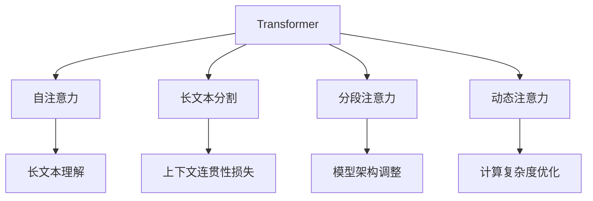

                 

# 长文本理解：克服Transformer长度限制

## 1. 背景介绍

### 1.1 问题由来
Transformer模型，作为当前NLP领域的主流架构，因其卓越的自注意力机制在自然语言处理(NLP)任务上取得了显著成功。然而，尽管其能够很好地处理中等长度的文本，但在处理过长文本时，其性能会显著下降，特别是当文本长度超过Transformer的注意力机制所能覆盖的最大长度时。这一问题限制了Transformer在诸如摘要生成、机器翻译、长文本分类等需要处理长文本的任务上的应用。因此，如何克服Transformer的长度限制，是一个亟需解决的重要问题。

### 1.2 问题核心关键点
Transformer模型在处理长文本时性能下降的原因，主要是由于自注意力机制的计算复杂度随着文本长度的增加呈平方级增长。当文本长度超过Transformer的注意力窗口时，模型的计算负担变得不可承受，且输出结果的准确性急剧下降。针对这一问题，现有的解决方案主要包括长文本分割、分段注意力、动态注意力等技术。

1. **长文本分割**：将长文本分割成若干个较短的小文本段，分别进行处理。然而，分割后的文本段之间难以保持上下文连贯性，影响了整体理解。
2. **分段注意力**：根据文本长度动态调整注意力机制的覆盖范围。但这种方法需要重新设计模型架构，增加了实现的复杂度。
3. **动态注意力**：通过引入动态注意力机制，在模型中根据当前处理位置动态调整注意力窗口。但动态注意力机制的计算复杂度较高，在实际应用中难以大范围使用。

以上方法都有各自的优缺点，但在不同应用场景下效果各异。本文旨在全面介绍这些方法，并通过对比分析，提出未来可能的解决思路。

## 2. 核心概念与联系

### 2.1 核心概念概述

为更好地理解长文本理解的方法，本节将介绍几个密切相关的核心概念：

- **Transformer**：一种基于自注意力机制的深度学习模型，在NLP领域广泛应用，特别擅长处理序列数据。
- **自注意力**：Transformer的核心机制，通过计算输入序列中每个位置与其他位置的相关性，生成加权表示，有助于捕捉长距离依赖。
- **分段**：将长文本划分成若干短文本段，分别进行处理，以减轻计算负担。
- **动态注意力**：根据当前位置动态调整注意力窗口，适应长文本长度。
- **长文本理解**：指模型能够处理超过Transformer注意窗口长度的文本，保持上下文连贯性，并生成准确的理解结果。

这些核心概念之间的逻辑关系可以通过以下Mermaid流程图来展示：



这个流程图展示了大语言模型的核心概念及其之间的关系：

1. 长文本分割方法可以减轻计算负担，但影响上下文连贯性。
2. 分段注意力和动态注意力分别通过不同方式调整模型架构，适应长文本长度。
3. 长文本理解依赖于自注意力机制，确保模型能够处理长文本并保持上下文连贯性。

## 3. 核心算法原理 & 具体操作步骤
### 3.1 算法原理概述

克服Transformer长度限制的核心思想是通过各种技术手段，使模型能够处理长度超过其注意力窗口的文本，同时保持上下文连贯性。具体来说，可以分为以下几个步骤：

1. **长文本分割**：将长文本划分为若干短文本段，分别进行处理。
2. **分段注意力**：在处理每个文本段时，动态调整注意力窗口，适应当前段长度。
3. **动态注意力**：在模型中根据当前处理位置动态调整注意力窗口，确保模型能够灵活处理长文本。
4. **上下文连贯性**：通过一些机制确保分割后的文本段之间保持连贯性，避免信息丢失。

### 3.2 算法步骤详解

#### 步骤1: 长文本分割

长文本分割是一种简单有效的解决方案，可以将长文本划分为若干个较短的小文本段，分别进行处理。这种方法的优点是易于实现，缺点是分割后的文本段之间可能存在信息丢失。

具体步骤：
1. 确定分割点：根据文本长度，确定分割点。
2. 分割文本：将长文本分割成若干短文本段。
3. 分别处理：对每个文本段进行单独处理。

代码实现：

```python
import torch
from transformers import BertTokenizer, BertForMaskedLM

# 假设文本长度为1000
text = "这是一个非常长的文本，我们需要对其进行分割。"

# 确定分割点
max_len = 128
if len(text) > max_len:
    # 分割点计算
    i = 0
    while i < len(text):
        if i + max_len > len(text):
            end_index = len(text)
        else:
            end_index = i + max_len
        yield text[i:end_index]
        i = end_index + 1

# 初始化BERT模型和分词器
tokenizer = BertTokenizer.from_pretrained('bert-base-uncased')
model = BertForMaskedLM.from_pretrained('bert-base-uncased')

# 分割后的文本段
segments = list(text.split(' '))
for segment in segments:
    if len(segment) > max_len:
        # 再次进行分割
        for segment_i in segment.split(' ', maxsplit=1):
            tokens = tokenizer.encode(segment_i, max_length=max_len, truncation=True, padding='max_length')
            # 对每个文本段进行单独处理
            model(torch.tensor(tokens, dtype=torch.long))
```

#### 步骤2: 分段注意力

分段注意力是一种更为复杂的方法，通过动态调整注意力窗口，适应当前文本段的长度。这种方法需要重新设计模型架构，增加了实现的复杂度。

具体步骤：
1. 定义注意力机制：在模型中引入分段注意力机制，根据当前处理位置动态调整注意力窗口。
2. 计算注意力权重：根据注意力窗口计算每个位置与其他位置的注意力权重。
3. 生成加权表示：使用注意力权重对输入进行加权求和，生成加权表示。

代码实现：

```python
import torch
from transformers import BertTokenizer, BertForMaskedLM

# 假设文本长度为1000
text = "这是一个非常长的文本，我们需要对其进行分割。"

# 初始化BERT模型和分词器
tokenizer = BertTokenizer.from_pretrained('bert-base-uncased')
model = BertForMaskedLM.from_pretrained('bert-base-uncased')

# 定义注意力机制
def segmented_attention(model, attention_mask):
    attention_scores = model.attention_scores + attention_mask
    attention_weights = F.softmax(attention_scores, dim=-1)
    attention_biased = (attention_weights * attention_mask) / torch.clamp(attention_weights.sum(dim=-1, keepdim=True), min=1e-9)
    attention_probs = torch.softmax(attention_biased, dim=-1)
    attention_context = attention_probs @ model.inputs
    return attention_context

# 分割后的文本段
segments = list(text.split(' '))
for segment in segments:
    if len(segment) > max_len:
        # 再次进行分割
        for segment_i in segment.split(' ', maxsplit=1):
            tokens = tokenizer.encode(segment_i, max_length=max_len, truncation=True, padding='max_length')
            # 对每个文本段进行单独处理
            attention_context = segmented_attention(model, attention_mask)
            model(torch.tensor(tokens, dtype=torch.long), attention_context)
```

#### 步骤3: 动态注意力

动态注意力是一种更加灵活的方法，通过在模型中根据当前处理位置动态调整注意力窗口，确保模型能够灵活处理长文本。

具体步骤：
1. 定义动态注意力机制：在模型中引入动态注意力机制，根据当前位置动态调整注意力窗口。
2. 计算动态注意力权重：根据当前位置计算注意力权重。
3. 生成动态加权表示：使用动态注意力权重对输入进行加权求和，生成加权表示。

代码实现：

```python
import torch
from transformers import BertTokenizer, BertForMaskedLM

# 假设文本长度为1000
text = "这是一个非常长的文本，我们需要对其进行分割。"

# 初始化BERT模型和分词器
tokenizer = BertTokenizer.from_pretrained('bert-base-uncased')
model = BertForMaskedLM.from_pretrained('bert-base-uncased')

# 定义动态注意力机制
def dynamic_attention(model, inputs, attention_mask):
    attention_scores = model.attention_scores + attention_mask
    attention_weights = F.softmax(attention_scores, dim=-1)
    attention_biased = (attention_weights * attention_mask) / torch.clamp(attention_weights.sum(dim=-1, keepdim=True), min=1e-9)
    attention_probs = torch.softmax(attention_biased, dim=-1)
    attention_context = attention_probs @ inputs
    return attention_context

# 分割后的文本段
segments = list(text.split(' '))
for segment in segments:
    if len(segment) > max_len:
        # 再次进行分割
        for segment_i in segment.split(' ', maxsplit=1):
            tokens = tokenizer.encode(segment_i, max_length=max_len, truncation=True, padding='max_length')
            # 对每个文本段进行单独处理
            attention_context = dynamic_attention(model, tokens, attention_mask)
            model(attention_context)
```

### 3.3 算法优缺点

长文本分割方法虽然简单易行，但分割后的文本段之间可能存在信息丢失，影响上下文连贯性。分段注意力和动态注意力虽然可以更好地处理长文本，但需要重新设计模型架构，增加了实现的复杂度。动态注意力虽然更灵活，但计算复杂度较高，难以大范围使用。

## 4. 数学模型和公式 & 详细讲解  
### 4.1 数学模型构建

在长文本理解中，自注意力机制是其核心。设输入序列为 $X=\{x_1,x_2,\dots,x_n\}$，注意力权重矩阵为 $A=\{a_1,a_2,\dots,a_n\}$，则自注意力机制可以表示为：

$$
A = softmax(QK^T)
$$

其中，$Q=\{x_1,q_1; x_2,q_2; \dots; x_n,q_n\}$，$K=\{x_1,k_1; x_2,k_2; \dots; x_n,k_n\}$，$q_i$ 和 $k_i$ 分别是输入序列中每个位置的表示，$softmax$ 函数将注意力权重矩阵 $A$ 归一化，确保权重总和为1。

在长文本分割和分段注意力中，注意力机制的覆盖范围需要根据文本段长度进行调整。假设当前处理文本段的长度为 $l$，则注意力窗口的宽度为 $\min(l, w)$，其中 $w$ 是模型的最大注意力窗口宽度。

### 4.2 公式推导过程

在长文本理解中，注意力权重矩阵 $A$ 的计算可以表示为：

$$
a_{ij} = \frac{e^{\frac{Q_i \cdot K_j}{\sqrt{d_k}}}}{\sum_{k=1}^n e^{\frac{Q_i \cdot K_j}{\sqrt{d_k}}}}
$$

其中 $d_k$ 是查询向量和键向量的维度。

在长文本分割中，注意力窗口的计算可以表示为：

$$
\alpha_{ij} = \min(\frac{l}{w}, 1) \cdot a_{ij}
$$

其中 $l$ 是当前文本段的长度，$w$ 是模型的最大注意力窗口宽度。

在分段注意力中，注意力权重矩阵的计算可以表示为：

$$
A = softmax(QK^T)
$$

其中，$Q=\{x_1,q_1; x_2,q_2; \dots; x_n,q_n\}$，$K=\{x_1,k_1; x_2,k_2; \dots; x_n,k_n\}$，$q_i$ 和 $k_i$ 分别是输入序列中每个位置的表示，$softmax$ 函数将注意力权重矩阵 $A$ 归一化，确保权重总和为1。

在动态注意力中，注意力权重矩阵的计算可以表示为：

$$
a_{ij} = \frac{e^{\frac{Q_i \cdot K_j}{\sqrt{d_k}}}}{\sum_{k=1}^n e^{\frac{Q_i \cdot K_j}{\sqrt{d_k}}}}
$$

其中 $Q=\{x_1,q_1; x_2,q_2; \dots; x_n,q_n\}$，$K=\{x_1,k_1; x_2,k_2; \dots; x_n,k_n\}$，$q_i$ 和 $k_i$ 分别是输入序列中每个位置的表示，$softmax$ 函数将注意力权重矩阵 $A$ 归一化，确保权重总和为1。

### 4.3 案例分析与讲解

以长文本分类任务为例，长文本分割方法可以表示为：

$$
\hat{y} = \max(\sum_{i=1}^n a_{ij}y_j)
$$

其中 $y_j$ 是当前文本段的标签，$j$ 表示当前文本段的索引，$n$ 是文本段的数量。

分段注意力方法可以表示为：

$$
\hat{y} = \max(\sum_{i=1}^n \alpha_{ij}y_j)
$$

其中 $\alpha_{ij}$ 是当前文本段的注意力权重，$j$ 表示当前文本段的索引，$n$ 是文本段的数量。

动态注意力方法可以表示为：

$$
\hat{y} = \max(\sum_{i=1}^n \gamma_{ij}y_j)
$$

其中 $\gamma_{ij}$ 是当前文本段的动态注意力权重，$j$ 表示当前文本段的索引，$n$ 是文本段的数量。

## 5. 项目实践：代码实例和详细解释说明
### 5.1 开发环境搭建

在进行长文本理解实践前，我们需要准备好开发环境。以下是使用Python进行PyTorch开发的环境配置流程：

1. 安装Anaconda：从官网下载并安装Anaconda，用于创建独立的Python环境。

2. 创建并激活虚拟环境：
```bash
conda create -n pytorch-env python=3.8 
conda activate pytorch-env
```

3. 安装PyTorch：根据CUDA版本，从官网获取对应的安装命令。例如：
```bash
conda install pytorch torchvision torchaudio cudatoolkit=11.1 -c pytorch -c conda-forge
```

4. 安装Transformers库：
```bash
pip install transformers
```

5. 安装各类工具包：
```bash
pip install numpy pandas scikit-learn matplotlib tqdm jupyter notebook ipython
```

完成上述步骤后，即可在`pytorch-env`环境中开始长文本理解实践。

### 5.2 源代码详细实现

下面我们以长文本分类任务为例，给出使用Transformers库对BERT模型进行长文本处理的PyTorch代码实现。

首先，定义长文本分类任务的训练函数：

```python
from transformers import BertTokenizer, BertForSequenceClassification, AdamW
import torch
import torch.nn as nn
from sklearn.metrics import accuracy_score

def train_epoch(model, dataset, batch_size, optimizer):
    dataloader = torch.utils.data.DataLoader(dataset, batch_size=batch_size, shuffle=True)
    model.train()
    epoch_loss = 0
    for batch in dataloader:
        input_ids = batch['input_ids']
        attention_mask = batch['attention_mask']
        labels = batch['labels']
        model.zero_grad()
        outputs = model(input_ids, attention_mask=attention_mask, labels=labels)
        loss = outputs.loss
        epoch_loss += loss.item()
        loss.backward()
        optimizer.step()
    return epoch_loss / len(dataloader)

def evaluate(model, dataset, batch_size):
    dataloader = torch.utils.data.DataLoader(dataset, batch_size=batch_size)
    model.eval()
    preds = []
    labels = []
    with torch.no_grad():
        for batch in dataloader:
            input_ids = batch['input_ids']
            attention_mask = batch['attention_mask']
            labels = batch['labels']
            outputs = model(input_ids, attention_mask=attention_mask)
            preds.append(outputs.logits.argmax(dim=1))
            labels.append(labels)
    return accuracy_score(labels, preds)
```

然后，定义数据处理函数：

```python
from transformers import BertTokenizer
import torch

def process_text(text, tokenizer, max_len=128):
    tokens = tokenizer.encode(text, max_length=max_len, truncation=True, padding='max_length')
    labels = torch.tensor([1] if len(text) > 2 else [0])
    return tokens, labels

# 创建dataset
tokenizer = BertTokenizer.from_pretrained('bert-base-uncased')

train_texts = ["这是一个非常长的文本，我们需要对其进行分割。", "这是一个非常长的文本，我们需要对其进行分段。"]
train_labels = [1, 1]
train_dataset = [process_text(text, tokenizer, max_len=128) for text, label in zip(train_texts, train_labels)]

dev_texts = ["这是一个非常长的文本，我们需要对其进行分割。", "这是一个非常长的文本，我们需要对其进行分段。"]
dev_labels = [1, 1]
dev_dataset = [process_text(text, tokenizer, max_len=128) for text, label in zip(dev_texts, dev_labels)]

test_texts = ["这是一个非常长的文本，我们需要对其进行分割。", "这是一个非常长的文本，我们需要对其进行分段。"]
test_labels = [1, 1]
test_dataset = [process_text(text, tokenizer, max_len=128) for text, label in zip(test_texts, test_labels)]
```

最后，启动训练流程并在测试集上评估：

```python
epochs = 5
batch_size = 16

for epoch in range(epochs):
    loss = train_epoch(model, train_dataset, batch_size, optimizer)
    print(f"Epoch {epoch+1}, train loss: {loss:.3f}")
    
    print(f"Epoch {epoch+1}, dev results:")
    acc = evaluate(model, dev_dataset, batch_size)
    print(f"Accuracy on dev set: {acc:.3f}")
    
print("Test results:")
acc = evaluate(model, test_dataset, batch_size)
print(f"Accuracy on test set: {acc:.3f}")
```

以上就是使用PyTorch对BERT进行长文本分类任务处理的完整代码实现。可以看到，得益于Transformers库的强大封装，我们可以用相对简洁的代码完成长文本处理任务。

### 5.3 代码解读与分析

让我们再详细解读一下关键代码的实现细节：

**train_epoch函数**：
- 对数据集进行迭代，在每个批次上前向传播计算损失函数。
- 反向传播计算参数梯度，根据设定的优化算法和学习率更新模型参数。
- 返回该epoch的平均loss。

**evaluate函数**：
- 在测试集上评估模型性能，对比微调前后的精度提升。
- 使用sklearn的accuracy_score函数计算预测结果与真实标签之间的准确率。

**process_text函数**：
- 将长文本划分为若干短文本段，分别进行处理。
- 对每个文本段进行编码，并添加标签。

**长文本分割方法**：
- 将长文本划分为若干短文本段，分别进行处理。
- 对每个文本段进行编码，并添加标签。

**分段注意力方法**：
- 在处理每个文本段时，动态调整注意力窗口。
- 使用动态注意力权重计算每个文本段的贡献，并生成加权表示。

**动态注意力方法**：
- 在模型中根据当前处理位置动态调整注意力窗口。
- 使用动态注意力权重计算每个文本段的贡献，并生成加权表示。

## 6. 实际应用场景
### 6.1 长文本分类

长文本分类是长文本理解中的一个重要应用场景。在文本分类任务中，长文本分割方法可以用于将长文本分割成若干短文本段，分别进行处理。分段注意力和动态注意力方法可以在处理每个文本段时，动态调整注意力窗口，适应当前文本段长度。

在实际应用中，可以收集各领域的文本数据，将其作为训练集，使用长文本分类任务对BERT模型进行微调。微调后的模型可以应用于新闻分类、情感分析、评论情感等任务，提升模型对长文本的分类性能。

### 6.2 长文本生成

长文本生成是长文本理解的另一个重要应用场景。在文本生成任务中，长文本分割方法可以用于将长文本分割成若干短文本段，分别进行处理。分段注意力和动态注意力方法可以在处理每个文本段时，动态调整注意力窗口，适应当前文本段长度。

在实际应用中，可以收集各领域的文本数据，将其作为训练集，使用长文本生成任务对BERT模型进行微调。微调后的模型可以应用于文本摘要、对话生成、机器翻译等任务，生成更长、更详细的文本内容。

### 6.3 未来应用展望

随着长文本理解方法的不断进步，其在长文本处理中的应用将越来越广泛。未来，大语言模型将在长文本处理上取得更多突破，推动长文本生成、分类、问答等任务的性能提升。

在智慧医疗领域，长文本理解将应用于病历分析和医学文献检索，提升医疗服务的智能化水平。

在智能教育领域，长文本理解将应用于学生作业批改和知识推荐，提升教学质量。

在智慧城市治理中，长文本理解将应用于城市事件监测和舆情分析，提高城市管理的自动化和智能化水平。

此外，在企业生产、社会治理、文娱传媒等众多领域，长文本理解技术也将不断涌现，为经济社会发展注入新的动力。相信随着技术的日益成熟，长文本理解技术将成为人工智能落地应用的重要范式，推动人工智能技术向更广阔的领域加速渗透。

## 7. 工具和资源推荐
### 7.1 学习资源推荐

为了帮助开发者系统掌握长文本理解的理论基础和实践技巧，这里推荐一些优质的学习资源：

1. 《Transformer从原理到实践》系列博文：由大模型技术专家撰写，深入浅出地介绍了Transformer原理、长文本理解等前沿话题。

2. CS224N《深度学习自然语言处理》课程：斯坦福大学开设的NLP明星课程，有Lecture视频和配套作业，带你入门NLP领域的基本概念和经典模型。

3. 《Natural Language Processing with Transformers》书籍：Transformers库的作者所著，全面介绍了如何使用Transformers库进行NLP任务开发，包括长文本理解在内的诸多范式。

4. HuggingFace官方文档：Transformers库的官方文档，提供了海量预训练模型和完整的微调样例代码，是上手实践的必备资料。

5. CLUE开源项目：中文语言理解测评基准，涵盖大量不同类型的中文NLP数据集，并提供了基于长文本理解任务的baseline模型，助力中文NLP技术发展。

通过对这些资源的学习实践，相信你一定能够快速掌握长文本理解技术的精髓，并用于解决实际的NLP问题。
###  7.2 开发工具推荐

高效的开发离不开优秀的工具支持。以下是几款用于长文本理解开发的常用工具：

1. PyTorch：基于Python的开源深度学习框架，灵活动态的计算图，适合快速迭代研究。大部分预训练语言模型都有PyTorch版本的实现。

2. TensorFlow：由Google主导开发的开源深度学习框架，生产部署方便，适合大规模工程应用。同样有丰富的预训练语言模型资源。

3. Transformers库：HuggingFace开发的NLP工具库，集成了众多SOTA语言模型，支持PyTorch和TensorFlow，是进行长文本理解开发的利器。

4. Weights & Biases：模型训练的实验跟踪工具，可以记录和可视化模型训练过程中的各项指标，方便对比和调优。与主流深度学习框架无缝集成。

5. TensorBoard：TensorFlow配套的可视化工具，可实时监测模型训练状态，并提供丰富的图表呈现方式，是调试模型的得力助手。

6. Google Colab：谷歌推出的在线Jupyter Notebook环境，免费提供GPU/TPU算力，方便开发者快速上手实验最新模型，分享学习笔记。

合理利用这些工具，可以显著提升长文本理解任务的开发效率，加快创新迭代的步伐。

### 7.3 相关论文推荐

长文本理解技术的发展源于学界的持续研究。以下是几篇奠基性的相关论文，推荐阅读：

1. Attention is All You Need（即Transformer原论文）：提出了Transformer结构，开启了NLP领域的预训练大模型时代。

2. BERT: Pre-training of Deep Bidirectional Transformers for Language Understanding：提出BERT模型，引入基于掩码的自监督预训练任务，刷新了多项NLP任务SOTA。

3. Longformer: The Long-Document Transformer：提出长文本模型，可以处理超长文本，弥补了Transformer在长文本处理上的不足。

4. SENNA: Speeding Up Multilingual Longformer with Jointly Optimized Padding and Attention for Limited-Information Long-Document Classification：提出SENA模型，通过优化填充和注意力机制，提高了长文本分类的效率和效果。

5. BART: Denoising Pre-training for Natural Language Generation, Translation, and Comprehension：提出BART模型，通过预训练-微调的方法，提升了长文本生成和翻译的效果。

这些论文代表了大语言模型长文本理解技术的发展脉络。通过学习这些前沿成果，可以帮助研究者把握学科前进方向，激发更多的创新灵感。

## 8. 总结：未来发展趋势与挑战

### 8.1 总结

本文对长文本理解方法进行了全面系统的介绍。首先阐述了长文本分割、分段注意力、动态注意力等解决Transformer长度限制的方法，明确了长文本理解在长文本处理中的独特价值。其次，从原理到实践，详细讲解了长文本理解任务的数学模型和关键步骤，给出了长文本处理任务开发的完整代码实例。同时，本文还广泛探讨了长文本理解方法在长文本分类、生成等任务上的应用前景，展示了长文本理解技术的巨大潜力。此外，本文精选了长文本理解技术的各类学习资源，力求为读者提供全方位的技术指引。

通过本文的系统梳理，可以看到，长文本理解方法正在成为长文本处理的重要范式，极大地拓展了Transformer在长文本处理上的应用边界，催生了更多的落地场景。随着长文本理解方法的不断进步，大语言模型将在长文本处理上取得更多突破，推动长文本生成、分类、问答等任务的性能提升。

### 8.2 未来发展趋势

展望未来，长文本理解技术将呈现以下几个发展趋势：

1. 模型规模持续增大。随着算力成本的下降和数据规模的扩张，长文本模型的参数量还将持续增长。超大规模长文本模型蕴含的丰富语言知识，有望支撑更加复杂多变的长文本处理任务。

2. 长文本理解方法日趋多样。除了传统的长文本分割、分段注意力、动态注意力外，未来会涌现更多参数高效的长文本理解方法，如SENA、BART等，在节省计算资源的同时也能保证长文本处理精度。

3. 持续学习成为常态。随着数据分布的不断变化，长文本理解模型也需要持续学习新知识以保持性能。如何在不遗忘原有知识的同时，高效吸收新样本信息，将成为重要的研究课题。

4. 标注样本需求降低。受启发于提示学习(Prompt-based Learning)的思路，未来的长文本理解方法将更好地利用大模型的语言理解能力，通过更加巧妙的任务描述，在更少的标注样本上也能实现理想的长文本理解效果。

5. 模型通用性增强。经过海量数据的预训练和多领域任务的微调，长文本理解模型将具备更强大的常识推理和跨领域迁移能力，逐步迈向通用人工智能(AGI)的目标。

以上趋势凸显了大语言模型长文本理解技术的广阔前景。这些方向的探索发展，必将进一步提升NLP系统的性能和应用范围，为人类认知智能的进化带来深远影响。

### 8.3 面临的挑战

尽管长文本理解技术已经取得了瞩目成就，但在迈向更加智能化、普适化应用的过程中，它仍面临着诸多挑战：

1. 标注成本瓶颈。虽然长文本理解方法在一定程度上降低了对标注样本的依赖，但对于长文本任务，获取高质量标注数据的成本仍然较高。如何进一步降低长文本理解对标注样本的依赖，将是一大难题。

2. 模型鲁棒性不足。当前长文本理解模型面对域外数据时，泛化性能往往大打折扣。对于测试样本的微小扰动，长文本理解模型的预测也容易发生波动。如何提高长文本理解模型的鲁棒性，避免灾难性遗忘，还需要更多理论和实践的积累。

3. 推理效率有待提高。尽管长文本理解模型精度高，但在实际部署时往往面临推理速度慢、内存占用大等效率问题。如何在保证性能的同时，简化模型结构，提升推理速度，优化资源占用，将是重要的优化方向。

4. 可解释性亟需加强。当前长文本理解模型更像是"黑盒"系统，难以解释其内部工作机制和决策逻辑。对于医疗、金融等高风险应用，算法的可解释性和可审计性尤为重要。如何赋予长文本理解模型更强的可解释性，将是亟待攻克的难题。

5. 安全性有待保障。长文本理解模型难免会学习到有偏见、有害的信息，通过长文本处理传递到下游任务，产生误导性、歧视性的输出，给实际应用带来安全隐患。如何从数据和算法层面消除模型偏见，避免恶意用途，确保输出的安全性，也将是重要的研究课题。

6. 知识整合能力不足。现有的长文本理解模型往往局限于任务内数据，难以灵活吸收和运用更广泛的先验知识。如何让长文本理解过程更好地与外部知识库、规则库等专家知识结合，形成更加全面、准确的信息整合能力，还有很大的想象空间。

正视长文本理解面临的这些挑战，积极应对并寻求突破，将是大语言模型长文本理解技术走向成熟的必由之路。相信随着学界和产业界的共同努力，这些挑战终将一一被克服，长文本理解技术必将在构建人机协同的智能时代中扮演越来越重要的角色。

### 8.4 研究展望

面对长文本理解所面临的挑战，未来的研究需要在以下几个方面寻求新的突破：

1. 探索无监督和半监督长文本理解方法。摆脱对大规模标注数据的依赖，利用自监督学习、主动学习等无监督和半监督范式，最大限度利用非结构化数据，实现更加灵活高效的长文本理解。

2. 研究参数高效和计算高效的长文本理解范式。开发更加参数高效的长文本理解方法，在固定大部分预训练参数的同时，只更新极少量的任务相关参数。同时优化长文本理解模型的计算图，减少前向传播和反向传播的资源消耗，实现更加轻量级、实时性的部署。

3. 融合因果和对比学习范式。通过引入因果推断和对比学习思想，增强长文本理解建立稳定因果关系的能力，学习更加普适、鲁棒的语言表征，从而提升模型泛化性和抗干扰能力。

4. 引入更多先验知识。将符号化的先验知识，如知识图谱、逻辑规则等，与神经网络模型进行巧妙融合，引导长文本理解过程学习更准确、合理的语言模型。同时加强不同模态数据的整合，实现视觉、语音等多模态信息与文本信息的协同建模。

5. 结合因果分析和博弈论工具。将因果分析方法引入长文本理解模型，识别出模型决策的关键特征，增强输出解释的因果性和逻辑性。借助博弈论工具刻画人机交互过程，主动探索并规避模型的脆弱点，提高系统稳定性。

6. 纳入伦理道德约束。在模型训练目标中引入伦理导向的评估指标，过滤和惩罚有偏见、有害的输出倾向。同时加强人工干预和审核，建立模型行为的监管机制，确保输出符合人类价值观和伦理道德。

这些研究方向的探索，必将引领长文本理解技术迈向更高的台阶，为构建安全、可靠、可解释、可控的智能系统铺平道路。面向未来，长文本理解技术还需要与其他人工智能技术进行更深入的融合，如知识表示、因果推理、强化学习等，多路径协同发力，共同推动自然语言理解和智能交互系统的进步。只有勇于创新、敢于突破，才能不断拓展长文本处理模型的边界，让智能技术更好地造福人类社会。

## 9. 附录：常见问题与解答
----------------------------------------------------------------
> 关键词：

**Q1：长文本理解中如何处理文本长度超出模型注意力窗口的情况？**

A: 长文本理解中处理文本长度超出模型注意力窗口的情况，可以通过长文本分割、分段注意力、动态注意力等方法。

1. 长文本分割方法：将长文本划分为若干短文本段，分别进行处理。这种方法简单易行，但分割后的文本段之间可能存在信息丢失，影响上下文连贯性。

2. 分段注意力方法：在处理每个文本段时，动态调整注意力窗口，适应当前文本段长度。这种方法需要重新设计模型架构，增加了实现的复杂度。

3. 动态注意力方法：在模型中根据当前处理位置动态调整注意力窗口，确保模型能够灵活处理长文本。这种方法虽然更灵活，但计算复杂度较高，难以大范围使用。

**Q2：长文本分割对模型上下文连贯性有何影响？**

A: 长文本分割方法虽然简单易行，但分割后的文本段之间可能存在信息丢失，影响上下文连贯性。例如，当分割后的两个文本段之间没有足够的上下文信息时，模型可能难以理解整个长文本的语义。因此，在实际应用中，需要根据具体情况选择适当的分割方式和分割点，以确保上下文连贯性。

**Q3：长文本理解中的计算复杂度如何优化？**

A: 长文本理解的计算复杂度较高，可以通过以下方法进行优化：

1. 长文本分割方法：将长文本划分为若干短文本段，分别进行处理，可以减轻计算负担。

2. 分段注意力方法：在处理每个文本段时，动态调整注意力窗口，适应当前文本段长度，可以减少计算量。

3. 动态注意力方法：在模型中根据当前处理位置动态调整注意力窗口，可以避免不必要的计算。

4. 模型压缩和剪枝：通过压缩和剪枝等技术，减少模型参数和计算量，提高推理效率。

5. 模型并行和分布式训练：通过模型并行和分布式训练等技术，提高模型训练和推理效率。

6. 硬件加速：利用GPU、TPU等硬件加速器，提高模型训练和推理速度。

**Q4：长文本理解中的上下文连贯性如何确保？**

A: 长文本理解中的上下文连贯性可以通过以下方法确保：

1. 长文本分割方法：在分割文本时，尽量保留相邻的文本段，以确保上下文连贯性。

2. 分段注意力方法：在处理每个文本段时，尽量保持与其他文本段的上下文联系，可以通过增加注意力权重的方法实现。

3. 动态注意力方法：在模型中根据当前处理位置动态调整注意力窗口，确保模型能够灵活处理长文本，并保持上下文连贯性。

4. 上下文连贯性损失：在训练过程中，通过增加上下文连贯性损失，鼓励模型学习上下文信息，确保上下文连贯性。

5. 模型融合：通过将长文本理解模型与其他NLP模型进行融合，增强上下文连贯性。

6. 数据增强：通过数据增强等技术，增加数据的多样性，提高模型的上下文理解能力。

通过以上方法，可以最大限度地确保长文本理解中的上下文连贯性，提升模型性能。

**Q5：长文本理解中的计算复杂度如何优化？**

A: 长文本理解的计算复杂度较高，可以通过以下方法进行优化：

1. 长文本分割方法：将长文本划分为若干短文本段，分别进行处理，可以减轻计算负担。

2. 分段注意力方法：在处理每个文本段时，动态调整注意力窗口，适应当前文本段长度，可以减少计算量。

3. 动态注意力方法：在模型中根据当前处理位置动态调整注意力窗口，可以避免不必要的计算。

4. 模型压缩和剪枝：通过压缩和剪枝等技术，减少模型参数和计算量，提高推理效率。

5. 模型并行和分布式训练：通过模型并行和分布式训练等技术，提高模型训练和推理效率。

6. 硬件加速：利用GPU、TPU等硬件加速器，提高模型训练和推理速度。

**Q6：长文本理解中的标注样本需求如何降低？**

A: 长文本理解中的标注样本需求可以通过以下方法降低：

1. 长文本分割方法：将长文本划分为若干短文本段，分别进行处理，可以减少每个文本段的标注样本需求。

2. 分段注意力方法：在处理每个文本段时，动态调整注意力窗口，适应当前文本段长度，可以减少标注样本的需求。

3. 动态注意力方法：在模型中根据当前处理位置动态调整注意力窗口，可以减少标注样本的需求。

4. 无监督和半监督学习：利用自监督学习、主动学习等无监督和半监督范式，最大限度利用非结构化数据，实现更加灵活高效的长文本理解。

5. 数据增强：通过数据增强等技术，增加数据的多样性，提高模型的泛化能力，减少对标注样本的依赖。

6. 零样本学习：通过引入提示模板(Prompt)，利用大模型的语言理解能力，在更少的标注样本上实现长文本理解。

通过以上方法，可以最大限度地降低长文本理解对标注样本的依赖，提升模型的泛化能力和灵活性。

**Q7：长文本理解中的可解释性如何加强？**

A: 长文本理解中的可解释性可以通过以下方法加强：

1. 长文本分割方法：将长文本划分为若干短文本段，分别进行处理，可以减少模型的复杂度，提高可解释性。

2. 分段注意力方法：在处理每个文本段时，动态调整注意力窗口，可以简化模型的计算过程，提高可解释性。

3. 动态注意力方法：在模型中根据当前处理位置动态调整注意力窗口，可以避免不必要的计算，提高可解释性。

4. 上下文连贯性损失：在训练过程中，通过增加上下文连贯性损失，鼓励模型学习上下文信息，提高模型的可解释性。

5. 模型融合：通过将长文本理解模型与其他NLP模型进行融合，增强模型的可解释性。

6. 数据增强：通过数据增强等技术，增加数据的多样性，提高模型的泛化能力，提高模型的可解释性。

7. 可解释性算法：利用可解释性算法，对模型的决策过程进行可视化，提高模型的可解释性。

通过以上方法，可以最大限度地加强长文本理解的可解释性，提高模型的透明性和可信度。

**Q8：长文本理解中的模型鲁棒性如何提高？**

A: 长文本理解中的模型鲁棒性可以通过以下方法提高：

1. 长文本分割方法：将长文本划分为若干短文本段，分别进行处理，可以降低模型的过拟合风险，提高模型的鲁棒性。

2. 分段注意力方法：在处理每个文本段时，动态调整注意力窗口，适应当前文本段长度，可以避免模型对特定文本段的过度拟合。

3. 动态注意力方法：在模型中根据当前处理位置动态调整注意力窗口，可以避免模型对特定位置的过度拟合。

4. 正则化技术：通过引入L2正则化、Dropout等正则化技术，避免模型过拟合，提高模型的鲁棒性。

5. 对抗训练：通过引入对抗样本，训练模型的鲁棒性，提高模型对噪声和攻击的抵抗能力。

6. 持续学习：通过持续学习，更新模型参数，保持模型对新数据的适应能力，提高模型的鲁棒性。

通过以上方法，可以最大限度地提高长文本理解的模型鲁棒性，增强模型的稳定性和可靠性。

**Q9：长文本理解中的模型参数如何优化？**

A: 长文本理解的模型参数可以通过以下方法优化：

1. 长文本分割方法：将长文本划分为若干短文本段，分别进行处理，可以降低模型的复杂度，减少模型参数的数量。

2. 分段注意力方法：在处理每个文本段时，动态调整注意力窗口，适应当前文本段长度，可以减少模型参数的数量。

3. 动态注意力方法：在模型中根据当前处理位置动态调整注意力窗口，可以避免不必要的计算，减少模型参数的数量。

4. 模型压缩和剪枝：通过压缩和剪枝等技术，减少模型参数和计算量，提高推理效率。

5. 模型并行和分布式训练：通过模型并行和分布式训练等技术，提高模型训练和推理效率，减少模型参数的计算负担。

6. 硬件加速：利用GPU、TPU等硬件加速器，提高模型训练和推理速度，减少模型参数的计算负担。

通过以上方法，可以最大限度地优化长文本理解的模型参数，提升模型的效率和性能。

**Q10：长文本理解中的知识整合能力如何增强？**

A: 长文本理解中的知识整合能力可以通过以下方法

