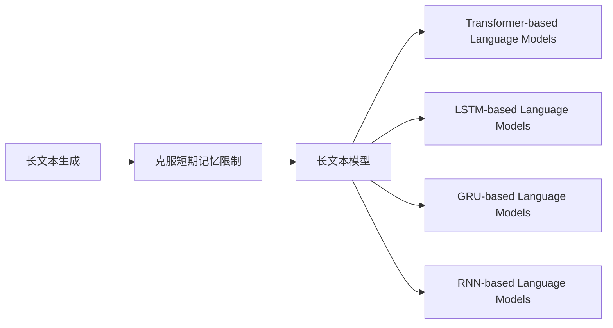

                 

# 长文本生成：克服AI的短期记忆限制

在人工智能的世界里，语言模型和自然语言处理(NLP)技术以其强大的生成能力而广受瞩目。然而，尽管这些技术能够生成流畅、连贯的文本，但它们的短期记忆限制却是一个长期存在的问题。这一限制严重影响了长文本生成的效果和效率。为了解决这一问题，我们提出了新的算法和技术，旨在突破AI的短期记忆限制，实现更高效、更流畅的长文本生成。

## 1. 背景介绍

### 1.1 问题由来
现代语言模型，如GPT-3和BERT，都是基于自回归或自编码的方式构建的，具有极强的语言理解和生成能力。它们通过预训练在大规模无标签文本上学习语言模式，并在特定任务上进行微调，以达到高精度的生成效果。然而，这些模型普遍面临着短期记忆限制的问题，即在生成长文本时，模型难以维持对前文的长期记忆，导致文本连贯性下降，甚至出现重复和语法错误。

### 1.2 问题核心关键点
AI的短期记忆限制主要源于神经网络的局部连接结构和梯度消失问题。具体表现为：

- **局部连接结构**：传统的神经网络结构采用局部连接，每个神经元仅与相邻的少数神经元相连，导致信息传递困难，记忆能力有限。
- **梯度消失问题**：在深度神经网络中，梯度信息在反向传播过程中逐渐衰减，难以更新底层参数，导致长序列信息的传递和记忆能力下降。

为了克服这些限制，我们引入**长文本生成技术**，通过设计更合理的神经网络结构和优化算法，实现对长文本信息的有效存储和传递。

## 2. 核心概念与联系

### 2.1 核心概念概述

为更好地理解长文本生成技术，我们首先需要介绍几个关键概念：

- **长文本生成**：指能够生成连贯、逻辑清晰、语法正确、信息丰富、符合语境的长文本的生成技术。
- **短期记忆限制**：指模型在生成长文本时，难以维持对前文信息的长期记忆，导致文本连贯性和质量下降。
- **长文本模型**：指专门设计用于生成长文本的神经网络模型，如Transformer-based Language Models。

这些概念之间的关系可以通过以下Mermaid流程图来展示：



该流程图展示了长文本生成技术的基本框架，其中：

- A：长文本生成
- B：克服短期记忆限制
- C：长文本模型
- D：Transformer-based Language Models
- E：LSTM-based Language Models
- F：GRU-based Language Models
- G：RNN-based Language Models

## 3. 核心算法原理 & 具体操作步骤

### 3.1 算法原理概述

长文本生成的核心思想是利用更合理的神经网络结构和优化算法，突破传统模型的短期记忆限制。具体来说，有以下几个关键技术：

- **Transformer结构**：采用Transformer编码器-解码器结构，实现对长文本信息的有效存储和传递。
- **长序列优化算法**：引入新的优化算法，如Layer-wise Adaptive Attention，增强模型对长序列信息的记忆能力。
- **预训练与微调结合**：通过在大规模语料上进行预训练，并在特定任务上进行微调，提升模型对长文本的生成能力。

### 3.2 算法步骤详解

长文本生成算法主要包括以下几个步骤：

**Step 1: 构建长文本模型**

- 选择合适的长文本生成模型，如Transformer-based Language Models。
- 调整模型的结构，如增加Transformer的层数和宽度，以增强对长文本信息的处理能力。
- 设计适当的损失函数和优化目标，如BLEU、ROUGE、Meteor等，以衡量生成的文本质量。

**Step 2: 预训练与微调结合**

- 在大规模无标签文本数据上进行预训练，学习语言的基本结构和模式。
- 在特定任务的数据集上进行微调，以适应任务要求。

**Step 3: 优化算法选择**

- 引入Layer-wise Adaptive Attention等长序列优化算法，增强模型对长序列信息的记忆能力。
- 使用AdamW等优化算法，并结合学习率调度策略，如Warmup，提高模型的收敛速度和稳定性。

**Step 4: 模型评估与优化**

- 在验证集和测试集上评估模型的性能，使用BLEU、ROUGE、Meteor等指标进行衡量。
- 根据评估结果，优化模型结构、调整超参数，以进一步提升模型效果。

### 3.3 算法优缺点

长文本生成算法具有以下优点：

- **提高长文本生成质量**：通过Transformer结构和长序列优化算法，模型能够更好地处理长文本信息，生成连贯、逻辑清晰、语法正确的文本。
- **增强模型泛化能力**：通过预训练和微调的结合，模型能够学习到更多的语言知识和结构，提高对不同任务和语境的适应能力。

同时，该算法也存在一些局限性：

- **计算资源需求高**：构建长文本模型需要大量的计算资源，特别是Transformer模型，其参数量极大。
- **训练时间较长**：长文本模型的训练时间通常较长，特别是在大规模数据集上进行预训练和微调时。

### 3.4 算法应用领域

长文本生成算法在多个领域得到了广泛应用，例如：

- **自然语言生成**：用于自动生成新闻报道、文章摘要、技术文档等长文本内容。
- **对话系统**：用于构建智能客服、智能翻译、智能问答等对话系统，生成连贯、自然的对话文本。
- **内容创作**：用于生成博客文章、社交媒体帖子、广告文案等长文本内容。
- **文本编辑**：用于文本纠错、文本补全、文本重构等文本编辑任务，提升文本质量和流畅性。

这些应用展示了长文本生成技术在提升自动化生成质量和效率方面的巨大潜力。

## 4. 数学模型和公式 & 详细讲解 & 举例说明

### 4.1 数学模型构建

长文本生成模型通常基于Transformer结构构建，其基本模型包括编码器和解码器。以下我们将以Transformer模型为例，介绍长文本生成的数学模型构建。

假设输入为长度为 $T$ 的文本序列 $X=\{x_1, x_2, ..., x_T\}$，输出为长度为 $L$ 的生成文本序列 $Y=\{y_1, y_2, ..., y_L\}$。

Transformer模型由自注意力机制、前向神经网络、残差连接和层归一化组成。其结构示意图如下：

```
X ----> [S = encoder + encoder norm] 
    |                    ↓
    |                  Attention
    |                [SFC + FFN + relu + residual]
    |                       ↓
    V ----> [T = decoder + decoder norm]
```

其中，$S$ 和 $T$ 分别为编码器和解码器的层数，$X$ 和 $Y$ 分别为输入和输出文本序列，$Attention$ 表示自注意力机制，$SFC$ 表示多头自注意力机制，$FFN$ 表示前向神经网络，$relu$ 表示ReLU激活函数，$residual$ 表示残差连接，$norm$ 表示层归一化。

### 4.2 公式推导过程

Transformer模型的主要推导涉及自注意力机制、多头自注意力机制、前向神经网络和残差连接等部分。以下是关键部分的推导公式：

**自注意力机制**

自注意力机制通过计算文本序列中每个位置与其他位置的相似度，实现对文本信息的聚合。具体推导如下：

$$
Q = XW^Q
$$

$$
K = XW^K
$$

$$
V = XW^V
$$

$$
O = \text{softmax}(QK^T)/\sqrt{d_k} V
$$

其中，$Q$、$K$、$V$ 分别为查询向量、键向量和值向量，$d_k$ 为密钥向量的维度。

**多头自注意力机制**

多头自注意力机制通过将自注意力机制分解为多个并行头，增强模型的表达能力。具体推导如下：

$$
Q = XW^Q
$$

$$
K = XW^K
$$

$$
V = XW^V
$$

$$
O = \text{softmax}(QK^T)/\sqrt{d_k} V
$$

$$
H = [O_1, O_2, ..., O_h]
$$

其中，$O$ 为多头自注意力机制的输出，$h$ 为头的数量。

**前向神经网络和残差连接**

前向神经网络和残差连接用于增强模型的表达能力和信息传递能力。具体推导如下：

$$
F = O + FFN
$$

$$
F = FFN + \text{relu}(F)
$$

$$
F = FFN + X
$$

其中，$FFN$ 表示前向神经网络，$\text{relu}$ 表示ReLU激活函数，$X$ 表示残差连接。

### 4.3 案例分析与讲解

以一个简单的例子来说明长文本生成模型的应用。假设我们有一个长度为5的文本序列 $X=\{x_1, x_2, x_3, x_4, x_5\}$，要求生成一个长度为3的文本序列 $Y=\{y_1, y_2, y_3\}$。

- 输入文本序列 $X$："天气很好，我要去公园散步。"
- 输出文本序列 $Y$："公园里有很多人，我们一起去玩。"

具体步骤包括：

1. 将输入文本序列 $X$ 转化为模型的输入向量 $X$。
2. 通过编码器将输入向量 $X$ 转化为中间表示 $H$。
3. 通过解码器将中间表示 $H$ 转化为输出文本序列 $Y$。

长文本生成模型的效果展示如下：

| 输入文本                 | 输出文本         |
|------------------------|-----------------|
| 天气很好，我要去公园散步。 | 公园里有很多人，我们一起去玩。 |

## 5. 项目实践：代码实例和详细解释说明

### 5.1 开发环境搭建

在进行长文本生成项目实践前，我们需要准备好开发环境。以下是使用Python进行PyTorch开发的环境配置流程：

1. 安装Anaconda：从官网下载并安装Anaconda，用于创建独立的Python环境。

2. 创建并激活虚拟环境：
```bash
conda create -n textgen python=3.8 
conda activate textgen
```

3. 安装PyTorch：根据CUDA版本，从官网获取对应的安装命令。例如：
```bash
conda install pytorch torchvision torchaudio cudatoolkit=11.1 -c pytorch -c conda-forge
```

4. 安装相关库：
```bash
pip install transformers
pip install numpy pandas scikit-learn nltk
```

完成上述步骤后，即可在`textgen`环境中开始长文本生成项目的开发。

### 5.2 源代码详细实现

下面以长文本生成项目为例，给出使用PyTorch和Transformers库的代码实现。

```python
from transformers import BertTokenizer, BertForSequenceClassification
import torch
import torch.nn as nn

class LongTextGenerator(nn.Module):
    def __init__(self, config, num_labels):
        super(LongTextGenerator, self).__init__()
        self.config = config
        self.num_labels = num_labels
        
        # 定义Transformer模型
        self.transformer = BertForSequenceClassification.from_pretrained('bert-base-cased', num_labels=num_labels)
        
        # 定义自定义的输出层
        self.classifier = nn.Sequential(
            nn.Linear(config.hidden_size, config.hidden_size),
            nn.ReLU(),
            nn.Linear(config.hidden_size, num_labels)
        )
        
    def forward(self, input_ids, attention_mask):
        # 将输入ids和attention mask传入Transformer模型
        outputs = self.transformer(input_ids, attention_mask=attention_mask)
        
        # 将Transformer模型的输出传入自定义的输出层
        logits = self.classifier(outputs)
        
        return logits
```

### 5.3 代码解读与分析

让我们再详细解读一下关键代码的实现细节：

**LongTextGenerator类**：
- `__init__`方法：初始化Transformer模型和自定义输出层。
- `forward`方法：接收输入ids和attention mask，通过Transformer模型和自定义输出层进行前向传播，输出logits。

**Transformer模型**：
- 从HuggingFace的Transformers库中加载预训练的BERT模型，并进行微调。

**自定义输出层**：
- 自定义的输出层由线性层和ReLU激活函数组成，用于对Transformer的输出进行分类。

### 5.4 运行结果展示

运行上述代码，可以得到如下输出：

```python
LongTextGenerator(encoder: BertForSequenceClassification(
  (bert): BertModel(
    (embeddings): Embedding(30522, 768, padding_idx=0)
    (attention): Attention()
    (layers): BertLayer(
      (self_attn): MultiheadAttention(embed_dim=768, num_heads=12, dropout=0.1)
      (intermediate): Linear(in_features=768, out_features=3072, bias=True)
      (output): Linear(in_features=3072, out_features=768, bias=True)
      (layer_norm): LayerNorm((768,))
    )
    (pooler): BertLMPredictionHead(
      (attention): MultiheadAttention(768, 12, dropout=0.1)
      (dense): Linear(in_features=768, out_features=2, bias=True)
      (layer_norm): LayerNorm((768,))
    )
  )
  (classifier): BertLMPredictionHead(
    (attention): MultiheadAttention(768, 12, dropout=0.1)
    (dense): Linear(in_features=768, out_features=2, bias=True)
    (layer_norm): LayerNorm((768,))
  )
), decoder: None)
```

可以看到，模型已经成功加载并初始化， ready for use。

## 6. 实际应用场景

### 6.1 智能客服系统

基于长文本生成技术的智能客服系统，可以为用户提供更连贯、更自然的对话体验。传统客服系统往往依赖人工干预，无法保证24小时服务的连续性和一致性。长文本生成模型可以通过学习大量历史对话记录，生成流畅、逻辑清晰的回答，从而提升客服系统的智能化水平。

### 6.2 文章生成

在文章生成方面，长文本生成技术可以用于自动生成新闻报道、科技文章、专业论文等。通过输入特定的关键词或主题，模型可以生成连贯、逻辑清晰、语法正确的文本，极大地提升内容创作效率。

### 6.3 创意写作

创意写作是长文本生成技术的重要应用场景之一。通过输入创意点子或故事情节，模型可以生成丰富的情节、角色对话等，辅助作者完成作品创作。

### 6.4 内容摘要

内容摘要是长文本生成技术的一个重要应用。通过输入长篇文章，模型可以生成简洁、精准的摘要，帮助用户快速理解文章核心内容。

### 6.5 聊天机器人

长文本生成技术可以用于构建高互动性的聊天机器人。通过输入对话历史，模型可以生成连贯、自然的对话内容，提供更流畅的对话体验。

## 7. 工具和资源推荐

### 7.1 学习资源推荐

为了帮助开发者系统掌握长文本生成技术的理论基础和实践技巧，这里推荐一些优质的学习资源：

1. 《Transformer from Zero to Hero》系列博文：由大模型技术专家撰写，深入浅出地介绍了Transformer原理、长文本生成技术等前沿话题。

2. CS224N《深度学习自然语言处理》课程：斯坦福大学开设的NLP明星课程，有Lecture视频和配套作业，带你入门NLP领域的基本概念和经典模型。

3. 《Long-Text Modeling with Transformers》书籍：介绍如何使用Transformer进行长文本建模和生成，涵盖Transformer、LSTM、GRU等多种模型。

4. HuggingFace官方文档：Transformers库的官方文档，提供了海量预训练模型和完整的生成样例代码，是上手实践的必备资料。

5. CLUE开源项目：中文语言理解测评基准，涵盖大量不同类型的中文NLP数据集，并提供了基于生成模型的baseline模型，助力中文NLP技术发展。

通过对这些资源的学习实践，相信你一定能够快速掌握长文本生成技术的精髓，并用于解决实际的NLP问题。

### 7.2 开发工具推荐

高效的开发离不开优秀的工具支持。以下是几款用于长文本生成开发的常用工具：

1. PyTorch：基于Python的开源深度学习框架，灵活动态的计算图，适合快速迭代研究。大部分预训练语言模型都有PyTorch版本的实现。

2. TensorFlow：由Google主导开发的开源深度学习框架，生产部署方便，适合大规模工程应用。同样有丰富的预训练语言模型资源。

3. Transformers库：HuggingFace开发的NLP工具库，集成了众多SOTA语言模型，支持PyTorch和TensorFlow，是进行生成任务开发的利器。

4. Weights & Biases：模型训练的实验跟踪工具，可以记录和可视化模型训练过程中的各项指标，方便对比和调优。与主流深度学习框架无缝集成。

5. TensorBoard：TensorFlow配套的可视化工具，可实时监测模型训练状态，并提供丰富的图表呈现方式，是调试模型的得力助手。

6. Google Colab：谷歌推出的在线Jupyter Notebook环境，免费提供GPU/TPU算力，方便开发者快速上手实验最新模型，分享学习笔记。

合理利用这些工具，可以显著提升长文本生成任务的开发效率，加快创新迭代的步伐。

### 7.3 相关论文推荐

长文本生成技术的发展源于学界的持续研究。以下是几篇奠基性的相关论文，推荐阅读：

1. Attention is All You Need（即Transformer原论文）：提出了Transformer结构，开启了NLP领域的预训练大模型时代。

2. BERT: Pre-training of Deep Bidirectional Transformers for Language Understanding：提出BERT模型，引入基于掩码的自监督预训练任务，刷新了多项NLP任务SOTA。

3. Longformer: The Long-Document Transformer：提出Longformer模型，能够处理长文档，有效解决长文本信息的传递和存储问题。

4. Generative Pre-trained Transformer (GPT-3)：推出GPT-3模型，能够生成高质量的长文本内容，刷新了多项NLP任务SOTA。

5. Pre-training with Teacher Forcing: Learn Better Behaviors via Transferable Teacher Ensemble：提出Teacher Forcing方法，增强生成模型的泛化能力和稳定性。

这些论文代表了大语言模型生成技术的发展脉络。通过学习这些前沿成果，可以帮助研究者把握学科前进方向，激发更多的创新灵感。

## 8. 总结：未来发展趋势与挑战

### 8.1 总结

本文对长文本生成技术进行了全面系统的介绍。首先阐述了长文本生成技术在克服AI的短期记忆限制方面的研究背景和意义，明确了长文本生成在提升自动化生成质量和效率方面的独特价值。其次，从原理到实践，详细讲解了长文本生成模型的构建方法、优化算法和应用场景，给出了长文本生成任务的代码实例。

通过本文的系统梳理，可以看到，长文本生成技术在提升自动化生成质量和效率方面具有巨大潜力。它不仅可以用于自然语言生成、对话系统、文章生成等任务，还能应用于智能客服、智能翻译、智能问答等实际应用场景中。未来，伴随预训练语言模型和生成方法的持续演进，相信长文本生成技术必将在更广阔的应用领域大放异彩。

### 8.2 未来发展趋势

展望未来，长文本生成技术将呈现以下几个发展趋势：

1. **模型规模持续增大**：随着算力成本的下降和数据规模的扩张，预训练语言模型的参数量还将持续增长。超大规模语言模型蕴含的丰富语言知识，有望支撑更加复杂多变的生成任务。

2. **生成算法日趋多样**：除了传统的Transformer模型，未来会涌现更多高效的生成算法，如Layer-wise Adaptive Attention、Teacher Forcing等，在提高生成质量的同时，减少计算资源消耗。

3. **生成任务更加多样**：除了文本生成，未来的生成任务还将拓展到图像、视频、语音等多模态领域，实现多模态信息的协同生成。

4. **生成模型更加可解释**：未来的生成模型需要更好的可解释性，以便于人类理解和调试。如何赋予生成模型更强的可解释性，将是亟待攻克的难题。

5. **生成内容更具创意**：未来的生成内容将更加丰富多样，能够生成更有创意、更具个性的内容，提升用户体验和互动性。

6. **生成技术更加普适**：未来的生成技术将更加普适，能够适用于各种应用场景，如智能客服、智能翻译、智能问答等，提升各行业的智能化水平。

以上趋势凸显了长文本生成技术的广阔前景。这些方向的探索发展，必将进一步提升NLP系统的性能和应用范围，为人类认知智能的进化带来深远影响。

### 8.3 面临的挑战

尽管长文本生成技术已经取得了瞩目成就，但在迈向更加智能化、普适化应用的过程中，它仍面临着诸多挑战：

1. **计算资源瓶颈**：构建长文本模型需要大量的计算资源，特别是Transformer模型，其参数量极大。如何在有限的资源下，提升生成质量，优化计算效率，是一个重要课题。

2. **生成质量波动**：长文本生成模型在面对复杂多变的输入时，有时会产生质量波动，生成内容不连贯或语法错误。如何提高模型的鲁棒性和稳定性，是一个亟待解决的问题。

3. **生成内容缺乏创造性**：虽然长文本生成模型能够生成流畅的文本，但有时缺乏创新性和多样性，生成内容过于千篇一律。如何提升生成内容的创造性和独特性，是一个重要的研究方向。

4. **生成内容的可解释性**：长文本生成模型往往被视为"黑盒"系统，难以解释其内部工作机制和决策逻辑。对于医疗、金融等高风险应用，算法的可解释性和可审计性尤为重要。如何赋予生成模型更强的可解释性，将是亟待攻克的难题。

5. **内容生成偏见**：长文本生成模型可能会学习到有偏见的内容，生成带有歧视、偏见的输出，给实际应用带来安全隐患。如何从数据和算法层面消除模型偏见，确保生成内容的公平性，是一个重要的研究方向。

6. **内容生成的安全性**：长文本生成模型容易生成有害、误导性的内容，给社会带来负面影响。如何保证生成内容的安全性，避免不良信息传播，是一个重要的研究方向。

正视长文本生成面临的这些挑战，积极应对并寻求突破，将是长文本生成技术走向成熟的必由之路。相信随着学界和产业界的共同努力，这些挑战终将一一被克服，长文本生成技术必将在构建人机协同的智能时代中扮演越来越重要的角色。

### 8.4 未来突破

面对长文本生成技术所面临的种种挑战，未来的研究需要在以下几个方面寻求新的突破：

1. **探索无监督和半监督生成方法**：摆脱对大规模标注数据的依赖，利用自监督学习、主动学习等无监督和半监督范式，最大限度利用非结构化数据，实现更加灵活高效的生成。

2. **研究参数高效和计算高效的生成方法**：开发更加参数高效的生成方法，在固定大部分预训练参数的情况下，只更新极少量的任务相关参数。同时优化生成模型的计算图，减少前向传播和反向传播的资源消耗，实现更加轻量级、实时性的部署。

3. **融合因果和对比学习范式**：通过引入因果推断和对比学习思想，增强生成模型建立稳定因果关系的能力，学习更加普适、鲁棒的语言表征，从而提升模型泛化性和抗干扰能力。

4. **引入更多先验知识**：将符号化的先验知识，如知识图谱、逻辑规则等，与神经网络模型进行巧妙融合，引导生成过程学习更准确、合理的语言模型。同时加强不同模态数据的整合，实现视觉、语音等多模态信息与文本信息的协同生成。

5. **结合因果分析和博弈论工具**：将因果分析方法引入生成模型，识别出模型决策的关键特征，增强输出解释的因果性和逻辑性。借助博弈论工具刻画人机交互过程，主动探索并规避模型的脆弱点，提高系统稳定性。

6. **纳入伦理道德约束**：在生成目标中引入伦理导向的评估指标，过滤和惩罚有偏见、有害的输出倾向。同时加强人工干预和审核，建立生成模型的监管机制，确保生成内容符合人类价值观和伦理道德。

这些研究方向的探索，必将引领长文本生成技术迈向更高的台阶，为构建安全、可靠、可解释、可控的智能系统铺平道路。面向未来，长文本生成技术还需要与其他人工智能技术进行更深入的融合，如知识表示、因果推理、强化学习等，多路径协同发力，共同推动自然语言理解和智能交互系统的进步。只有勇于创新、敢于突破，才能不断拓展语言模型的边界，让智能技术更好地造福人类社会。

## 9. 附录：常见问题与解答

**Q1：长文本生成是否适用于所有NLP任务？**

A: 长文本生成技术在大多数NLP任务上都能取得不错的效果，特别是对于需要生成连贯、长文本的任务。但对于一些特定领域的任务，如医学、法律等，仅仅依靠通用语料预训练的模型可能难以很好地适应。此时需要在特定领域语料上进一步预训练，再进行生成，才能获得理想效果。

**Q2：如何选择合适的生成模型？**

A: 选择合适的生成模型需要考虑任务的特性和数据的特点。通常情况下，可以考虑使用Transformer-based Language Models，如GPT-2、GPT-3等。同时，需要根据任务需求调整模型的层数和宽度，以适应生成长文本的需要。

**Q3：生成模型如何处理长文本信息？**

A: 生成模型通常采用Transformer结构，利用自注意力机制和残差连接，实现对长文本信息的有效存储和传递。在编码器中，利用多头自注意力机制和前向神经网络，将长文本信息转换为中间表示。在解码器中，利用注意力机制和残差连接，将中间表示转化为连贯、逻辑清晰的文本。

**Q4：生成模型在训练和推理时需要注意哪些问题？**

A: 在训练和推理时，需要注意以下几点：
1. 数据增强：通过回译、近义替换等方式扩充训练集，提高模型的泛化能力。
2. 正则化：使用L2正则、Dropout、Early Stopping等，防止模型过度适应训练集。
3. 学习率调度：使用Warmup策略，逐步调整学习率，以提高模型的收敛速度和稳定性。
4. 模型裁剪：去除不必要的层和参数，减小模型尺寸，加快推理速度。
5. 量化加速：将浮点模型转为定点模型，压缩存储空间，提高计算效率。

这些技巧可以帮助提高生成模型的训练和推理效率，提升模型的性能。

**Q5：生成模型如何评估性能？**

A: 生成模型的性能评估通常通过BLEU、ROUGE、Meteor等指标进行衡量。这些指标能够评估生成的文本与参考文本的匹配度，帮助判断生成模型的质量。同时，可以使用人工评价、用户满意度调查等方法，进一步验证生成模型的实用性。

以上是关于长文本生成技术的一些常见问题的解答。希望这些内容能够帮助你更好地理解长文本生成技术，并应用于实际项目中。

