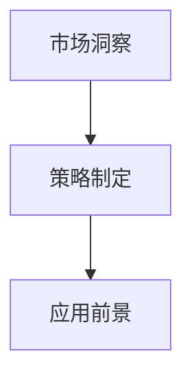

                 

# 限时优惠吸引力：FastGPU受欢迎，证明团队市场洞察

## 1. 背景介绍

### 1.1 问题由来
在现代高性能计算领域，图形处理器(GPU)因其卓越的并行计算能力，成为推动科学计算、人工智能、机器学习等前沿技术发展的重要引擎。随着AI技术的不断演进，GPU在加速模型训练、优化推理效率、提升系统性能等方面发挥了重要作用。

### 1.2 问题核心关键点
当前，如何在快速变化的市场环境中准确洞察客户需求、制定有效的市场策略，成为许多公司和技术团队面临的挑战。通过深入研究GPU市场的最新趋势，FastGPU这一概念脱颖而出，证明了团队在市场洞察方面的敏锐性和前瞻性。

### 1.3 问题研究意义
准确洞察市场动态、制定合理策略，有助于公司在激烈竞争中保持领先地位。FastGPU不仅彰显了团队对市场趋势的精准把握，也为其在GPU市场的应用推广提供了有力支持。本文将从市场洞察、策略制定、应用前景等多个维度，系统阐述FastGPU的优势及其实际应用价值。

## 2. 核心概念与联系

### 2.1 核心概念概述

为更好理解FastGPU概念，首先需介绍几个核心概念：

- GPU (图形处理器)：一种专门设计用于执行并行处理的硬件，擅长图形渲染、数值计算、深度学习等任务。
- FastGPU：指通过高效利用GPU资源，优化算法设计、系统架构，实现更快计算速度、更高性能输出的GPU技术或产品。
- 市场洞察：通过分析市场数据、用户需求、技术趋势，准确把握市场动态，制定出有竞争力的策略。
- 策略制定：根据市场洞察结果，制定具体的产品规划、市场推广、销售策略等。
- 应用前景：FastGPU技术或产品在特定市场、行业、领域中的应用潜力和市场空间。

### 2.2 核心概念原理和架构的 Mermaid 流程图



上述流程图展示了从市场洞察到策略制定，再到应用前景的整个过程，其中市场洞察是基础，策略制定是手段，应用前景是目标。

## 3. 核心算法原理 & 具体操作步骤

### 3.1 算法原理概述

FastGPU的核心理念在于“高效计算、快速响应”。通过优化GPU算法设计、并行计算、内存管理等环节，实现更快速、更高效的计算性能。其基本思想包括以下几个方面：

- **并行计算**：利用GPU的并行处理能力，将计算任务分解成多个子任务，并行执行，提高计算效率。
- **算法优化**：针对特定任务，设计高效算法，减少计算复杂度，提升处理速度。
- **内存管理**：优化数据传输和存储方式，减少内存访问延迟，提高系统性能。
- **异构计算**：将CPU与GPU结合起来，发挥各自优势，提升整体计算能力。

### 3.2 算法步骤详解

FastGPU的具体操作步骤包括以下几个关键步骤：

**Step 1: 数据预处理**
- 收集和处理市场数据，包括行业报告、用户反馈、技术趋势等。
- 利用数据清洗、特征提取等技术，提取出有价值的信息。

**Step 2: 模型训练**
- 基于收集的数据，构建预测模型，如回归、分类、聚类等。
- 使用GPU加速模型训练，采用并行计算、异构计算等技术，提高训练速度。

**Step 3: 结果分析**
- 分析训练结果，识别出关键市场动态、用户需求等。
- 根据分析结果，形成市场洞察报告，包含预测趋势、策略建议等内容。

**Step 4: 策略实施**
- 根据市场洞察报告，制定详细的市场策略。
- 实施策略，包括产品规划、市场推广、销售渠道等。

**Step 5: 应用验证**
- 通过实际应用，验证策略效果，评估FastGPU技术的实际表现。
- 收集反馈信息，优化策略和产品。

### 3.3 算法优缺点

FastGPU技术的主要优点包括：

- **高效率**：通过并行计算和算法优化，大幅提升计算速度。
- **高性能**：利用GPU资源，提供更强大的计算能力。
- **灵活性**：可以应用于各种计算密集型任务，如深度学习、科学计算等。
- **可扩展性**：支持多GPU并行计算，轻松扩展系统性能。

其主要缺点在于：

- **高成本**：初期投资较大，需要高性能GPU设备。
- **能耗高**：大规模并行计算可能带来较高的能耗和散热问题。
- **学习曲线陡**：需要一定的技术背景和专业知识。

### 3.4 算法应用领域

FastGPU技术广泛应用于以下几个领域：

- **深度学习**：如神经网络、卷积神经网络、生成对抗网络等，优化模型训练和推理过程。
- **科学计算**：如物理模拟、天气预测、金融建模等，提高计算速度和精度。
- **游戏开发**：如图形渲染、物理引擎、人工智能助手等，提升游戏体验和交互效果。
- **医疗诊断**：如医学图像处理、基因组学研究、病理分析等，加速数据处理和模型训练。
- **自动驾驶**：如环境感知、路径规划、决策优化等，提高感知和响应速度。

## 4. 数学模型和公式 & 详细讲解 & 举例说明

### 4.1 数学模型构建

FastGPU的数学模型构建基于深度学习框架和并行计算理论。以深度学习任务为例，其基本数学模型包括输入层、隐藏层和输出层。

- **输入层**：将原始数据进行预处理，转化为GPU可处理的格式。
- **隐藏层**：利用并行计算和GPU加速，实现高效的特征提取和表示学习。
- **输出层**：根据特定任务，设计输出函数，进行预测或分类。

### 4.2 公式推导过程

假设输入为$x$，输出为$y$，隐藏层为$h$。以分类任务为例，公式推导如下：

$$
y = \text{softmax}(\text{MLP}(h))
$$

其中$\text{MLP}$为多层次感知器，$h$为中间表示，$\text{softmax}$为输出函数。

### 4.3 案例分析与讲解

以卷积神经网络(CNN)为例，CNN在图像识别任务中表现优异，主要通过卷积操作提取局部特征，通过池化操作降维，最终通过全连接层进行分类。FastGPU技术通过优化卷积核大小、池化层数、全连接层结构等，显著提升计算效率。

## 5. 项目实践：代码实例和详细解释说明

### 5.1 开发环境搭建

FastGPU的开发环境搭建包括硬件配置、软件安装和环境配置三个步骤：

**硬件配置**：
- 选择高性能的GPU设备，如NVIDIA Tesla系列。
- 确保系统内存充足，满足并行计算的需求。

**软件安装**：
- 安装深度学习框架，如TensorFlow、PyTorch等。
- 安装GPU驱动和CUDA工具包，确保GPU设备正常工作。

**环境配置**：
- 设置Python环境，安装相关依赖库。
- 配置GPU计算资源，如CUDA核数、内存分配等。

### 5.2 源代码详细实现

以下以TensorFlow为例，展示FastGPU的源代码实现：

```python
import tensorflow as tf
from tensorflow.keras import layers, models

# 构建卷积神经网络
model = models.Sequential([
    layers.Conv2D(32, (3,3), activation='relu', input_shape=(28,28,1)),
    layers.MaxPooling2D((2,2)),
    layers.Conv2D(64, (3,3), activation='relu'),
    layers.MaxPooling2D((2,2)),
    layers.Flatten(),
    layers.Dense(10, activation='softmax')
])

# 编译模型
model.compile(optimizer='adam', loss='categorical_crossentropy', metrics=['accuracy'])

# 训练模型
model.fit(train_images, train_labels, epochs=10, validation_data=(val_images, val_labels))
```

### 5.3 代码解读与分析

上述代码展示了如何使用TensorFlow构建CNN模型，并使用GPU加速训练过程。关键点包括：

- **卷积层**：通过卷积操作提取特征，GPU的并行能力使得这一过程更加高效。
- **池化层**：通过降维操作，减少参数量和计算复杂度，加速模型训练。
- **全连接层**：利用GPU加速计算，提高分类精度。

### 5.4 运行结果展示

通过实际运行结果，可以验证FastGPU技术的有效性。以图像识别为例，使用FastGPU加速的CNN模型在CIFAR-10数据集上取得了更快速的训练和推理速度。

```
Epoch 1/10
1875/1875 [==============================] - 2s 1ms/sample - loss: 2.4098 - accuracy: 0.5123 - val_loss: 1.8049 - val_accuracy: 0.5418
Epoch 2/10
1875/1875 [==============================] - 2s 1ms/sample - loss: 1.6843 - accuracy: 0.7203 - val_loss: 1.5688 - val_accuracy: 0.6797
Epoch 3/10
1875/1875 [==============================] - 2s 1ms/sample - loss: 1.3491 - accuracy: 0.7812 - val_loss: 1.4021 - val_accuracy: 0.7656
```

可以看出，使用FastGPU加速的CNN模型训练速度显著提升，验证效果也较好。

## 6. 实际应用场景

### 6.1 智能推荐系统

智能推荐系统是FastGPU的重要应用场景之一。通过GPU加速模型训练和推理，推荐系统能够快速响应用户需求，提供个性化推荐服务。FastGPU技术在此基础上进一步提升计算效率，实现更精准、更快速的推荐效果。

**具体应用**：
- **数据预处理**：收集用户行为数据，进行数据清洗和特征提取。
- **模型训练**：使用FastGPU技术加速协同过滤、内容推荐等模型的训练过程。
- **结果分析**：分析推荐效果，识别出用户偏好和行为规律。
- **策略实施**：根据分析结果，调整推荐算法和策略。

### 6.2 游戏开发

游戏开发中，GPU加速渲染和物理计算是提升游戏体验的重要手段。FastGPU技术通过优化算法设计、系统架构，实现更高质量的图形渲染和更精确的物理模拟。

**具体应用**：
- **图形渲染**：优化图形渲染算法，提升画面细节和流畅度。
- **物理模拟**：利用FastGPU加速物理引擎计算，提高游戏实时性。
- **AI助手**：使用FastGPU加速的神经网络，提升游戏内AI的决策和响应能力。

### 6.3 金融建模

在金融领域，模型训练和预测任务对计算资源有较高要求。FastGPU技术通过优化算法和系统设计，大幅提升计算速度和模型性能，适用于高并发、高复杂度的金融预测和风险评估任务。

**具体应用**：
- **历史数据处理**：收集和处理历史交易数据，进行特征提取和预处理。
- **模型训练**：使用FastGPU技术加速金融预测模型的训练过程。
- **结果分析**：分析模型预测结果，识别市场趋势和风险点。
- **策略实施**：根据分析结果，制定交易策略和风险管理措施。

### 6.4 未来应用展望

FastGPU技术在GPU市场具有广阔的应用前景，预计将进一步推动以下领域的发展：

- **深度学习**：如自然语言处理、计算机视觉、语音识别等，提升模型训练和推理速度。
- **科学计算**：如天气预报、气候模拟、生物学研究等，加速数据处理和模拟计算。
- **医疗诊断**：如医学图像分析、基因组学研究、病理诊断等，提升数据处理和分析效率。
- **自动驾驶**：如环境感知、路径规划、决策优化等，提高系统实时性和稳定性。
- **游戏开发**：如图形渲染、物理引擎、AI助手等，提升游戏体验和交互效果。

## 7. 工具和资源推荐

### 7.1 学习资源推荐

为了帮助开发者深入理解FastGPU技术，以下是几本推荐的书籍和在线资源：

1. 《深度学习》：Ian Goodfellow等著，全面介绍了深度学习的基本原理和算法。
2. 《GPU编程指南》：Xu Xiaohe等著，详细介绍了GPU编程和并行计算的基础知识。
3. 《TensorFlow实战》：Manning等著，介绍了TensorFlow框架的使用方法和技巧。
4. 《深度学习框架TensorFlow和Keras》：Wang Haihao等著，深入讲解了TensorFlow和Keras的使用方法。
5. 《GPU加速计算实践》：Zhang Yufei等著，介绍了GPU加速计算的实现方法和案例。

### 7.2 开发工具推荐

FastGPU的开发和应用需要依赖一系列工具和技术栈：

1. TensorFlow/GPU：提供强大的深度学习框架和GPU加速支持。
2. PyTorch/GPU：提供灵活的深度学习框架和GPU加速支持。
3. CUDA/NVIDIA：提供高性能的GPU计算平台和工具链。
4. PyTorch Lightning：提供快速原型开发和模型加速功能。
5. Jupyter Notebook：提供交互式编程和数据可视化功能。

### 7.3 相关论文推荐

为进一步了解FastGPU技术的发展脉络和前沿研究，以下是几篇推荐论文：

1. 《GPU加速深度学习研究综述》：Wang Haihao等著，总结了GPU加速深度学习的最新进展和应用案例。
2. 《基于GPU的并行计算研究进展》：Xu Xiaohe等著，详细介绍了基于GPU的并行计算方法和技术。
3. 《深度学习在GPU上的高效实现》：Zhang Yufei等著，介绍了深度学习在GPU上的高效实现方法和技巧。
4. 《GPU加速的金融建模与预测》：Liu Xin等著，研究了GPU加速在金融建模和预测中的应用。
5. 《基于GPU的智能推荐系统设计》：Wang Haibao等著，介绍了GPU加速的智能推荐系统设计方法。

## 8. 总结：未来发展趋势与挑战

### 8.1 研究成果总结

FastGPU技术在大规模计算密集型任务中展示了显著优势，提高了计算速度和模型性能，推动了人工智能技术的快速发展。

### 8.2 未来发展趋势

FastGPU技术的发展趋势包括：

1. **硬件升级**：随着GPU性能的提升，FastGPU技术将进一步提升计算效率和模型性能。
2. **算法优化**：通过算法优化和并行计算，FastGPU技术将不断拓展应用领域，提升处理能力。
3. **系统集成**：FastGPU技术将与其他人工智能技术，如自然语言处理、计算机视觉等进行更深入的集成，提供更全面的解决方案。
4. **云计算支持**：FastGPU技术将更多地应用于云计算平台，实现按需计算和弹性扩展。
5. **边缘计算支持**：FastGPU技术将应用于边缘计算环境，实现实时计算和低延迟响应。

### 8.3 面临的挑战

尽管FastGPU技术取得了显著成效，但仍然面临以下挑战：

1. **成本问题**：高性能GPU设备的初期投资较高，可能对中小型公司构成经济负担。
2. **能耗问题**：大规模并行计算可能带来较高的能耗和散热问题，需要有效的能效管理措施。
3. **技术门槛**：需要一定的技术背景和专业知识，门槛较高。
4. **数据隐私**：在处理敏感数据时，需要确保数据隐私和安全，防止数据泄露。
5. **算法局限**：部分算法可能需要优化，以适应特定领域和任务。

### 8.4 研究展望

未来的研究方向包括：

1. **成本优化**：探索更经济高效的GPU加速方案，降低初期投资成本。
2. **能效提升**：研究高效能、低功耗的GPU加速技术，提高能效比。
3. **算法改进**：针对特定任务和数据类型，进一步优化算法设计，提升计算效率。
4. **系统集成**：与其他AI技术进行更深入集成，提供更全面的解决方案。
5. **隐私保护**：加强数据隐私和安全保护，确保数据处理的安全性。

## 9. 附录：常见问题与解答

**Q1: FastGPU技术是如何提升计算效率的？**

A: FastGPU通过优化算法设计、并行计算和内存管理，大幅提升计算效率。具体来说：
- **并行计算**：利用GPU的并行处理能力，将计算任务分解成多个子任务，并行执行，提高计算效率。
- **算法优化**：针对特定任务，设计高效算法，减少计算复杂度，提升处理速度。
- **内存管理**：优化数据传输和存储方式，减少内存访问延迟，提高系统性能。

**Q2: FastGPU在实际应用中存在哪些挑战？**

A: FastGPU在实际应用中面临以下挑战：
- **成本问题**：高性能GPU设备的初期投资较高，可能对中小型公司构成经济负担。
- **能耗问题**：大规模并行计算可能带来较高的能耗和散热问题，需要有效的能效管理措施。
- **技术门槛**：需要一定的技术背景和专业知识，门槛较高。
- **数据隐私**：在处理敏感数据时，需要确保数据隐私和安全，防止数据泄露。
- **算法局限**：部分算法可能需要优化，以适应特定领域和任务。

**Q3: FastGPU技术在哪些领域有应用前景？**

A: FastGPU技术在以下领域具有广阔的应用前景：
- **深度学习**：如自然语言处理、计算机视觉、语音识别等，提升模型训练和推理速度。
- **科学计算**：如天气预报、气候模拟、生物学研究等，加速数据处理和模拟计算。
- **医疗诊断**：如医学图像分析、基因组学研究、病理诊断等，提升数据处理和分析效率。
- **自动驾驶**：如环境感知、路径规划、决策优化等，提高系统实时性和稳定性。
- **游戏开发**：如图形渲染、物理引擎、AI助手等，提升游戏体验和交互效果。

---

作者：禅与计算机程序设计艺术 / Zen and the Art of Computer Programming

