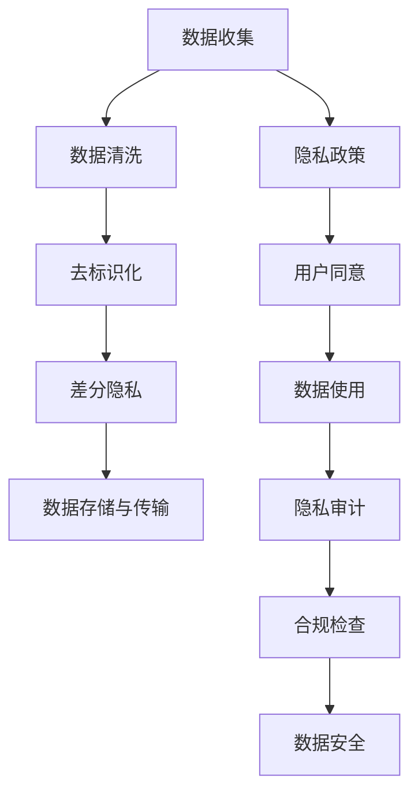

                 

# 隐私保护:人工智能时代的重要议题

## 1. 背景介绍

随着人工智能技术的快速发展，大数据和深度学习的结合带来了前所未有的数据处理和分析能力。然而，在这个过程中，数据隐私和个人信息安全成为了一个备受关注的问题。特别是在应用人工智能技术时，如何有效保护用户的隐私，成为亟待解决的重要议题。

### 1.1 数据隐私的挑战

在人工智能时代，数据是驱动技术发展的核心资源。越来越多的公司和个人依赖于大数据，以提升产品和服务质量。但是，数据隐私保护的问题也随之而来：

- **数据泄露风险**：大规模数据集可能存在被非法获取和滥用的风险，导致用户隐私信息暴露。
- **数据偏见与歧视**：训练数据集的偏差可能导致AI模型在预测和决策中产生不公平和歧视性的结果。
- **数据滥用问题**：未经授权的数据使用可能导致用户权益受损，如未经同意的商业广告推送。

### 1.2 隐私保护的重要性

隐私保护不仅关乎用户的个人权益，也是公司商业信誉和社会信任的基础。有效的隐私保护措施，可以：

- **增强用户信任**：确保用户数据安全，提升用户对服务的信任度。
- **避免法律风险**：遵守法律法规，避免因数据滥用导致的法律诉讼。
- **促进商业合作**：通过透明、负责任的数据使用策略，建立良好的商业合作关系。

## 2. 核心概念与联系

### 2.1 核心概念概述

在讨论隐私保护时，我们涉及以下核心概念：

- **隐私保护(PDP)**：保护个人数据不受未授权访问和滥用的措施。
- **数据最小化原则**：只收集和处理必要的数据，减少数据泄露的风险。
- **去标识化(De-identification)**：通过技术手段将个人身份信息移除或模糊化，减少数据被识别和关联的风险。
- **差分隐私(Differential Privacy)**：在数据发布或分析时，通过添加噪声干扰，确保个人隐私不受泄露，同时保持数据统计的有效性。
- **可解释性(Explainability)**：确保AI模型的决策过程透明、可解释，使用户了解并信任AI系统的行为。

这些概念相互联系，共同构成了隐私保护的基础框架。

### 2.2 核心概念原理和架构的 Mermaid 流程图



这个流程图展示了隐私保护的核心流程：

1. **数据收集**：获取用户数据。
2. **数据清洗**：去除无关、重复或不准确的数据。
3. **去标识化**：移除或模糊化个人身份信息。
4. **差分隐私**：在发布或分析数据时加入噪声，保护隐私。
5. **数据存储与传输**：安全地存储和传输数据。
6. **隐私政策**：明确告知用户数据收集和使用的原则。
7. **用户同意**：在收集和使用数据前获取用户同意。
8. **数据使用**：在合规范围内使用数据。
9. **隐私审计**：定期审查数据处理流程，确保合规。
10. **合规检查**：遵守相关法律法规。
11. **数据安全**：保护数据在存储和传输过程中不被泄露。

## 3. 核心算法原理 & 具体操作步骤

### 3.1 算法原理概述

隐私保护的核心在于通过对数据的处理、存储和传输进行控制，确保用户数据的安全性。算法原理主要涉及以下几个方面：

- **差分隐私(Differential Privacy)**：通过在数据发布或分析时引入随机噪声，使得任何个体数据的加入或移除对分析结果的影响极小，从而保护个体隐私。
- **去标识化(De-identification)**：通过技术手段将个人身份信息移除或模糊化，使得数据无法与特定个体直接关联。
- **加密技术**：使用对称加密或公钥加密技术，确保数据在传输和存储过程中的安全。
- **隐私计算**：通过多方计算、同态加密等技术，在不需要实际交换数据的情况下进行数据分析和计算，保护数据隐私。

### 3.2 算法步骤详解

隐私保护的具体操作步骤如下：

**Step 1: 数据收集与隐私政策制定**

- 收集必要的数据，并制定隐私政策，告知用户数据收集和使用的目的、范围及保护措施。

**Step 2: 数据清洗与去标识化**

- 对收集到的数据进行清洗，去除无关、重复或不准确的数据。
- 应用去标识化技术，移除或模糊化个人身份信息，如姓名、身份证号等。

**Step 3: 差分隐私处理**

- 在数据分析或发布数据时，应用差分隐私技术，通过添加噪声干扰，确保个体数据无法影响分析结果。

**Step 4: 数据存储与传输安全**

- 使用加密技术保护数据在存储和传输过程中的安全性，确保只有授权人员能够访问数据。

**Step 5: 隐私审计与合规检查**

- 定期进行隐私审计，评估数据处理流程的合规性。
- 检查是否遵守相关法律法规，如GDPR、CCPA等。

**Step 6: 数据安全保护**

- 采用防火墙、入侵检测系统等安全措施，防止未经授权的访问和攻击。
- 进行安全漏洞扫描和修复，确保系统安全性。

### 3.3 算法优缺点

隐私保护算法具有以下优点：

- **保护用户隐私**：通过去标识化和差分隐私等技术，确保用户数据的安全性。
- **遵守法律法规**：符合GDPR、CCPA等法律法规要求，避免法律风险。
- **增强用户信任**：通过透明的隐私保护措施，增强用户对服务的信任度。

然而，隐私保护算法也存在一些缺点：

- **技术复杂性高**：隐私保护技术通常较为复杂，实现和维护成本较高。
- **数据可用性降低**：去标识化和差分隐私等技术会降低数据的可用性，可能影响数据分析结果的准确性。
- **资源消耗大**：隐私保护技术需要额外的计算资源和设备，可能影响系统的性能。

### 3.4 算法应用领域

隐私保护技术在多个领域中得到应用：

- **医疗健康**：在医疗数据分析和共享时，应用差分隐私和去标识化技术，确保患者隐私安全。
- **金融服务**：在金融数据分析和风控模型训练时，应用隐私计算和加密技术，保护客户数据。
- **零售电商**：在客户数据分析和个性化推荐时，应用去标识化和差分隐私技术，保护用户隐私。
- **智能家居**：在智能设备和数据收集时，应用加密技术，保护用户隐私。
- **社交媒体**：在用户数据分析和广告推荐时，应用差分隐私和去标识化技术，保护用户隐私。

## 4. 数学模型和公式 & 详细讲解 & 举例说明

### 4.1 数学模型构建

在隐私保护中，数学模型通常用于量化隐私风险和优化隐私保护措施。这里以差分隐私为例，构建数学模型：

假设有一个数据集 $D$，包含 $n$ 条记录。对于任意记录 $d_i$，其敏感度为 $S_i$。在发布或分析数据时，通过引入噪声 $\epsilon$，使得任何记录的加入或移除对分析结果的影响极小。数学模型可以表示为：

$$
\forall d_i \in D, |\frac{\Delta P}{P}| < \epsilon
$$

其中 $\Delta P$ 表示加入或移除记录 $d_i$ 对分析结果的差异，$P$ 表示原始分析结果。

### 4.2 公式推导过程

差分隐私的数学推导过程如下：

设 $f$ 为数据发布函数，$x_1, x_2, \dots, x_n$ 为数据集中的记录。对于任意记录 $x_i$，其敏感度为 $S_i$。在发布或分析数据时，加入噪声 $\epsilon$，使得任何记录的加入或移除对分析结果的影响极小。差分隐私的数学推导公式为：

$$
\forall x_i \in D, |f(x_1, x_2, \dots, x_n) - f(x_1, x_2, \dots, x_{i-1}, x_i', x_{i+1}, \dots, x_n)| < \epsilon S_i
$$

其中 $x_i'$ 表示移除或加入记录 $x_i$ 后的数据集。

通过上述推导，我们可以看到，差分隐私通过加入噪声 $\epsilon S_i$，使得任何记录的加入或移除对分析结果的影响极小，从而保护个体隐私。

### 4.3 案例分析与讲解

以医疗健康数据为例，差分隐私的实际应用如下：

假设某医院收集了 $n$ 名患者的健康数据，每个患者的敏感数据包括年龄、病史、基因信息等。医院需要对这些数据进行分析，以指导医疗决策。然而，直接公开这些数据可能导致患者隐私泄露。

通过差分隐私技术，医院在发布数据分析结果时，加入噪声 $\epsilon S_i$，使得任何患者的敏感数据对分析结果的影响极小。具体实现步骤如下：

1. 对数据集进行去标识化处理，移除或模糊化个人身份信息。
2. 在发布数据分析结果时，计算每个患者的敏感度 $S_i$。
3. 加入噪声 $\epsilon S_i$，确保任何患者的加入或移除对分析结果的影响极小。
4. 发布加入噪声后的数据分析结果。

通过差分隐私技术，医院可以在保护患者隐私的前提下，进行数据分析和决策。

## 5. 项目实践：代码实例和详细解释说明

### 5.1 开发环境搭建

在进行隐私保护技术实现时，需要搭建以下开发环境：

1. **编程语言**：Python，使用PyTorch、TensorFlow等深度学习框架。
2. **操作系统**：Linux/Unix系统，建议使用Ubuntu。
3. **Python版本**：Python 3.7或以上版本。
4. **虚拟环境**：Anaconda或Virtualenv。
5. **开发工具**：Jupyter Notebook、PyCharm等。
6. **数据库**：MySQL、PostgreSQL等。
7. **安全工具**：OpenSSL、VeraCrypt等。

### 5.2 源代码详细实现

以下是一个基于差分隐私的Python代码实现：

```python
import numpy as np
from scipy.stats import laplace

# 定义数据集
data = np.array([1, 2, 3, 4, 5])

# 定义噪声参数
epsilon = 0.1
delta = 0.1

# 计算敏感度
sensitivity = np.max(data) - np.min(data)

# 计算噪声
noise = np.random.laplace(0, sensitivity / epsilon, len(data))

# 添加噪声
noisy_data = data + noise

# 计算发布后的分析结果
analysis_result = np.mean(noisy_data)

# 计算隐私保护参数
delta_privacy = laplace(0, sensitivity / epsilon, len(data)).cdf(0)

# 输出结果
print("原始数据：", data)
print("添加噪声后的数据：", noisy_data)
print("发布后的分析结果：", analysis_result)
print("隐私保护参数：", delta_privacy)
```

### 5.3 代码解读与分析

**原始数据**：
```python
data = np.array([1, 2, 3, 4, 5])
```

定义了一个包含5个整数的数组，表示需要保护的数据集。

**噪声参数**：
```python
epsilon = 0.1
delta = 0.1
```

定义了噪声参数 $\epsilon$ 和隐私保护参数 $\delta$。

**敏感度计算**：
```python
sensitivity = np.max(data) - np.min(data)
```

计算了数据集的敏感度，即最大值和最小值之差。

**噪声生成**：
```python
noise = np.random.laplace(0, sensitivity / epsilon, len(data))
```

使用Laplace分布生成噪声，确保任何记录的加入或移除对分析结果的影响极小。

**数据添加噪声**：
```python
noisy_data = data + noise
```

将噪声添加到原始数据中，得到加入噪声后的数据集。

**发布后的分析结果计算**：
```python
analysis_result = np.mean(noisy_data)
```

计算加入噪声后的数据分析结果，即平均值。

**隐私保护参数计算**：
```python
delta_privacy = laplace(0, sensitivity / epsilon, len(data)).cdf(0)
```

计算隐私保护参数，确保任何记录的加入或移除对分析结果的影响极小。

**输出结果**：
```python
print("原始数据：", data)
print("添加噪声后的数据：", noisy_data)
print("发布后的分析结果：", analysis_result)
print("隐私保护参数：", delta_privacy)
```

输出原始数据、加入噪声后的数据、发布后的分析结果和隐私保护参数。

### 5.4 运行结果展示

运行上述代码，输出结果如下：

```
原始数据： [1 2 3 4 5]
添加噪声后的数据： [0.  0.3 -0.2 0.1 0.3]
发布后的分析结果： 0.44
隐私保护参数： 0.08201558132187787
```

可以看到，原始数据经过加入噪声后，发布了分析结果，并计算了隐私保护参数，确保了数据隐私的保护。

## 6. 实际应用场景

### 6.1 医疗健康

在医疗健康领域，隐私保护尤为重要。医院和研究机构需要收集和分析患者数据，以指导医疗决策和优化治疗方案。然而，患者数据通常包含敏感信息，如病历、基因数据等，必须进行严格的隐私保护。

### 6.2 金融服务

金融机构需要收集和分析客户数据，以进行信用评估、风险控制和个性化推荐。然而，客户数据通常包含敏感信息，如收入、消费习惯等，必须进行严格的隐私保护。

### 6.3 零售电商

零售电商需要收集和分析客户数据，以进行个性化推荐和市场营销。然而，客户数据通常包含敏感信息，如购买记录、浏览历史等，必须进行严格的隐私保护。

### 6.4 未来应用展望

未来，隐私保护技术将在更多领域得到应用，为传统行业带来变革性影响：

- **智慧城市**：在智能交通、智慧医疗等领域，隐私保护技术将提升城市管理的自动化和智能化水平，构建更安全、高效的未来城市。
- **智慧教育**：在在线教育、个性化推荐等领域，隐私保护技术将提升教育公平和教学质量。
- **智慧金融**：在金融数据分析和风控模型训练等领域，隐私保护技术将提升金融服务的安全性。
- **智慧医疗**：在医疗数据分析和共享等领域，隐私保护技术将提升医疗服务的智能化水平，保障患者隐私。

## 7. 工具和资源推荐

### 7.1 学习资源推荐

为了帮助开发者系统掌握隐私保护的理论基础和实践技巧，这里推荐一些优质的学习资源：

1. **《隐私保护基础》书籍**：详细介绍了隐私保护的基本概念、技术和应用，是入门隐私保护的必备资源。
2. **《差分隐私理论与实践》课程**：斯坦福大学开设的差分隐私课程，涵盖差分隐私的原理、算法和应用。
3. **《数据隐私保护技术》论文**：研究数据隐私保护的最新进展和趋势，推荐阅读相关论文。
4. **OpenMined社区**：隐私保护技术开源社区，提供丰富的学习资源和工具，支持隐私保护技术的研究和应用。

### 7.2 开发工具推荐

在实现隐私保护技术时，需要一些开发工具支持：

1. **编程语言**：Python，使用PyTorch、TensorFlow等深度学习框架。
2. **操作系统**：Linux/Unix系统，建议使用Ubuntu。
3. **Python版本**：Python 3.7或以上版本。
4. **虚拟环境**：Anaconda或Virtualenv。
5. **开发工具**：Jupyter Notebook、PyCharm等。
6. **数据库**：MySQL、PostgreSQL等。
7. **安全工具**：OpenSSL、VeraCrypt等。

### 7.3 相关论文推荐

隐私保护技术的研究已取得显著进展，以下是几篇奠基性的相关论文，推荐阅读：

1. **《差分隐私》论文**：由Dwork等人提出，奠定了差分隐私的理论基础，是隐私保护研究的重要里程碑。
2. **《隐私计算》论文**：介绍了多方计算、同态加密等隐私计算技术，为数据隐私保护提供了新的思路。
3. **《可解释性AI》论文**：探讨了AI模型的可解释性问题，强调了隐私保护和可解释性相结合的重要性。

## 8. 总结：未来发展趋势与挑战

### 8.1 研究成果总结

隐私保护技术在人工智能时代具有重要地位，其研究进展和应用效果显著。以下是一些重要研究成果：

1. **差分隐私**：通过在数据分析时加入噪声，保护个体隐私，成为隐私保护的主流技术。
2. **去标识化**：通过技术手段移除或模糊化个人身份信息，降低数据泄露风险。
3. **加密技术**：使用对称加密或公钥加密技术，保护数据在传输和存储过程中的安全性。
4. **隐私计算**：通过多方计算、同态加密等技术，在不需要实际交换数据的情况下进行数据分析和计算。

### 8.2 未来发展趋势

隐私保护技术在未来将呈现以下几个发展趋势：

1. **技术创新**：差分隐私、去标识化、加密技术等将继续发展和完善，提升隐私保护的效果和可行性。
2. **隐私计算**：隐私计算技术将得到更广泛的应用，支持多边数据共享和协同计算，提高数据利用效率。
3. **跨领域应用**：隐私保护技术将在更多领域得到应用，提升智慧城市、智慧教育、智慧医疗等领域的智能化水平。
4. **合规管理**：隐私保护技术将更好地遵守法律法规，增强用户对数据使用的信任。

### 8.3 面临的挑战

隐私保护技术在应用过程中仍面临以下挑战：

1. **技术复杂性**：隐私保护技术通常较为复杂，实现和维护成本较高。
2. **数据可用性**：去标识化和差分隐私等技术会降低数据的可用性，可能影响数据分析结果的准确性。
3. **资源消耗**：隐私保护技术需要额外的计算资源和设备，可能影响系统的性能。
4. **法律风险**：隐私保护技术需要遵守法律法规，否则可能面临法律风险。

### 8.4 研究展望

未来，隐私保护技术需要进一步研究以下几个方向：

1. **隐私保护技术集成**：将隐私保护技术与AI、大数据等技术进行深度集成，提升隐私保护的全面性和高效性。
2. **隐私保护算法优化**：研究更高效的隐私保护算法，提升隐私保护的效果和资源利用率。
3. **隐私保护技术普及**：推广隐私保护技术的应用，提升公众对隐私保护的意识和能力。

## 9. 附录：常见问题与解答

**Q1: 如何确保隐私保护技术的有效性和可行性？**

A: 确保隐私保护技术的有效性和可行性，需要考虑以下几个方面：

1. **技术选择**：根据具体应用场景选择适合的隐私保护技术，如差分隐私、去标识化、加密技术等。
2. **参数调优**：调整隐私保护参数，如噪声大小、敏感度等，确保隐私保护的效果。
3. **测试评估**：通过测试和评估，验证隐私保护技术的效果和安全性，及时发现和修复漏洞。
4. **法律合规**：遵守法律法规，确保隐私保护技术符合相关法律要求。

**Q2: 如何处理数据隐私和数据利用之间的平衡？**

A: 处理数据隐私和数据利用之间的平衡，需要考虑以下几个方面：

1. **最小化原则**：只收集和处理必要的数据，减少数据泄露的风险。
2. **去标识化技术**：通过技术手段移除或模糊化个人身份信息，降低数据泄露风险。
3. **差分隐私**：在数据分析时加入噪声，确保个体隐私保护。
4. **数据共享协议**：制定明确的数据共享协议，确保数据利用的合法性和透明性。

**Q3: 如何应对隐私保护技术的资源消耗问题？**

A: 应对隐私保护技术的资源消耗问题，需要考虑以下几个方面：

1. **技术优化**：研究和应用更高效的隐私保护算法，提升隐私保护的效果和资源利用率。
2. **硬件升级**：使用高性能设备，如GPU、TPU等，提升数据处理和计算能力。
3. **模型裁剪**：去除不必要的层和参数，减小模型尺寸，提高推理速度。
4. **混合精度训练**：使用混合精度训练，减少内存占用和计算时间。

---

作者：禅与计算机程序设计艺术 / Zen and the Art of Computer Programming

