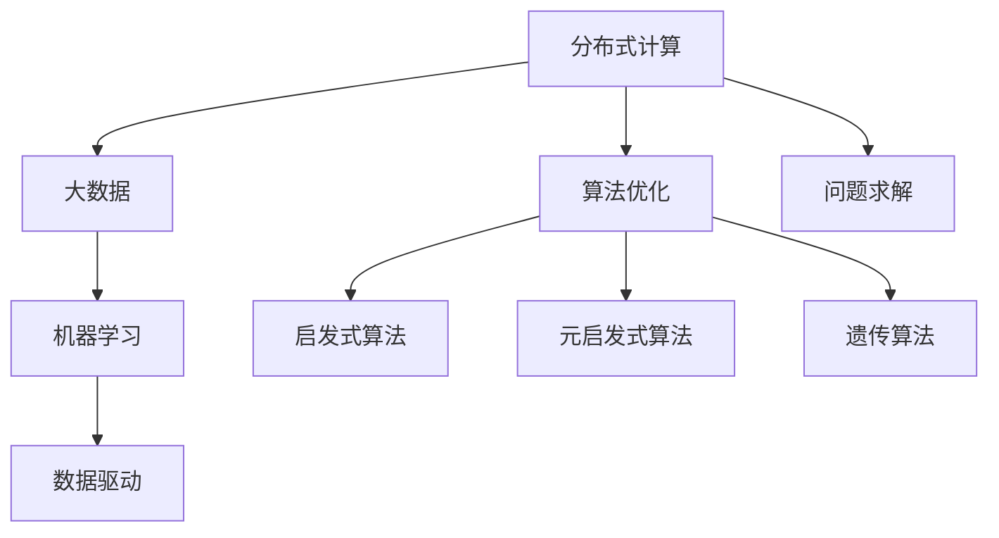

                 

# 集体智慧：开拓解决复杂问题的创新思路

> 关键词：集体智慧,分布式计算,大数据,机器学习,算法优化,问题求解,复杂系统,协作

## 1. 背景介绍

### 1.1 问题由来

在现代社会中，面对复杂系统和高难度问题，传统的集中式求解方式已经无法满足需求。这类问题通常具有以下特点：

- **规模巨大**：数据量庞大，涉及的变量和参数众多。
- **高度非线性**：系统行为复杂多变，不存在简单的线性关系。
- **动态变化**：环境变化速度快，需要实时响应和调整。

面对这些挑战，如何有效利用现有资源，快速、高效地求解复杂问题，成为了一个重要课题。随着计算技术的进步，特别是大数据和分布式计算技术的发展，通过集体的智慧和协作，可以开辟出新的求解路径。

### 1.2 问题核心关键点

解决复杂问题的集体智慧范式，其核心在于以下几个方面：

- **分布式计算**：将问题分解为多个子问题，通过多台计算资源的协同求解，加速计算速度。
- **数据驱动**：利用大数据和机器学习技术，从数据中挖掘规律和特征，辅助问题求解。
- **算法优化**：设计高效的算法框架和求解策略，提高问题解决的效率和准确性。
- **人机协作**：利用人类专家和AI系统的互补优势，进行协同决策和问题求解。

本文将详细介绍集体智慧求解复杂问题的原理、方法和应用场景，帮助读者深入理解这一领域的核心思想和技术。

## 2. 核心概念与联系

### 2.1 核心概念概述

为更好地理解集体智慧求解复杂问题的方法，本节将介绍几个密切相关的核心概念：

- **分布式计算**：通过多台计算机的协同工作，处理大规模计算任务的技术。常见分布式计算框架包括Hadoop、Spark、Flink等。
- **大数据**：指规模庞大、种类繁多、速度快、价值密度低的数据集合。大数据技术包括数据采集、存储、处理、分析等。
- **机器学习**：通过数据驱动的算法，让计算机从经验中学习，并不断优化模型的技术。常见的机器学习算法包括回归、分类、聚类等。
- **算法优化**：通过算法改进和优化，提高求解效率和准确性的技术。常见的优化方法包括启发式算法、元启发式算法、遗传算法等。
- **问题求解**：通过分析、计算、模拟等手段，找到问题的解决方案的过程。

这些核心概念之间的逻辑关系可以通过以下Mermaid流程图来展示：



这个流程图展示了大规模问题求解的核心概念及其之间的关系：

1. 通过分布式计算实现海量数据处理。
2. 利用大数据技术和机器学习挖掘数据规律，辅助问题求解。
3. 通过算法优化提高求解效率和准确性。
4. 最终通过问题求解找到问题的解决方案。

这些概念共同构成了集体智慧求解复杂问题的核心框架，使得问题求解变得更加高效和精准。

## 3. 核心算法原理 & 具体操作步骤
### 3.1 算法原理概述

集体智慧求解复杂问题的核心算法原理，主要涉及以下几个方面：

- **分布式计算框架**：通过构建分布式计算系统，将大规模计算任务分解为多个子任务，并行计算，提高处理效率。
- **数据处理和分析**：利用大数据技术进行数据的存储、清洗、预处理和分析，提取有用的信息和特征，辅助问题求解。
- **算法设计**：设计高效的算法和策略，通过迭代优化，逐步逼近问题的最优解。
- **人机协同**：结合人类专家的知识和经验，利用AI系统的计算能力，进行协同决策和问题求解。

### 3.2 算法步骤详解

集体智慧求解复杂问题的具体操作步骤，可以分为以下几个阶段：

**Step 1: 问题建模**

1. **问题定义**：明确问题的目标和约束条件，将问题转化为数学模型或形式化表达。
2. **子问题划分**：将问题划分为多个子问题，以便并行处理。
3. **特征提取**：从问题描述和数据中提取有用的特征，辅助后续求解。

**Step 2: 分布式计算**

1. **系统搭建**：搭建分布式计算系统，选择合适的计算资源和调度策略。
2. **任务分解**：将主问题分解为多个子问题，并行计算。
3. **结果汇聚**：将各节点的计算结果汇聚到中央节点，进行集成处理。

**Step 3: 数据处理和分析**

1. **数据采集**：从不同数据源收集数据，存储在大数据系统中。
2. **数据清洗**：清洗数据中的噪音和异常值，确保数据质量。
3. **特征工程**：进行特征提取、选择和工程，构建可用于机器学习的特征集合。

**Step 4: 算法设计**

1. **模型选择**：选择合适的机器学习模型，并设定初始参数。
2. **训练优化**：利用大数据和分布式计算技术，进行模型的训练和优化。
3. **模型评估**：通过测试集评估模型的性能，进行迭代优化。

**Step 5: 问题求解**

1. **求解算法**：根据问题的特点，选择适合的求解算法。
2. **迭代求解**：通过多轮迭代，逐步逼近问题的最优解。
3. **结果输出**：输出最终的解决方案，并评估其效果。

### 3.3 算法优缺点

集体智慧求解复杂问题的方法具有以下优点：

1. **高效性**：通过分布式计算和大数据技术，能够快速处理大规模问题。
2. **准确性**：利用机器学习和算法优化技术，提高问题求解的精度和可靠性。
3. **灵活性**：能够灵活处理不同类型的复杂问题，适应性强。

同时，该方法也存在一些局限性：

1. **系统复杂性**：搭建和维护分布式系统需要较高的技术门槛。
2. **数据依赖性**：对数据的质量和多样性要求高，数据收集和处理工作量大。
3. **算法局限性**：某些问题可能没有现成的高效算法，求解过程复杂。
4. **协同难度**：人机协作需要有效的沟通和协调机制。

尽管存在这些局限性，但集体智慧范式在处理复杂问题时表现出色，已经在多个领域得到了广泛应用。

### 3.4 算法应用领域

集体智慧求解复杂问题的方法，已经在多个领域得到了应用，例如：

- **金融风控**：利用大数据和机器学习技术，进行信用评估、风险控制等。
- **智能制造**：通过物联网和大数据分析，实现生产过程的优化和预测维护。
- **物流配送**：利用算法优化和协同调度，提高配送效率，减少运输成本。
- **环境监测**：利用卫星和传感器数据，进行环境变化分析和预警。
- **公共安全**：通过视频分析和数据挖掘，提升社会治安和公共安全水平。
- **医疗健康**：利用电子病历和基因数据，进行疾病预测和个性化治疗。
- **能源管理**：通过智能电网和大数据分析，优化能源分配和需求预测。

除了上述这些经典领域，集体智慧范式还将继续拓展到更多场景中，如智能交通、智慧城市、智能客服等，为各行各业带来变革性影响。

## 4. 数学模型和公式 & 详细讲解  
### 4.1 数学模型构建

本节将使用数学语言对集体智慧求解复杂问题的过程进行更加严格的刻画。

设问题 $P$ 的优化目标为 $f(x)$，其中 $x \in \mathcal{X}$，$\mathcal{X}$ 为问题定义的解空间。

定义问题 $P$ 在分布式计算系统中的并行求解模型为 $\mathcal{M}$，其中 $\mathcal{M}$ 包括多个子问题 $P_i$ 的求解模型 $M_i$。

数据集 $D$ 包含问题相关的特征和历史数据，通过机器学习算法 $\mathcal{A}$ 挖掘数据中的规律和特征。

算法 $\mathcal{A}$ 的输入为数据集 $D$ 和算法参数 $\alpha$，输出为优化目标的函数 $g(D, \alpha)$。

优化过程通过分布式计算系统 $\mathcal{S}$ 实现，系统包括多个计算节点 $S_i$，每个节点独立求解子问题 $P_i$。

整个求解过程可以表示为：

$$
\min_{x} f(x) = \min_{x} \sum_{i=1}^N f_i(x_i)
$$

其中 $x_i = g_i(D_i, \alpha_i)$，$g_i$ 为子问题 $P_i$ 的求解算法，$\alpha_i$ 为算法参数。

### 4.2 公式推导过程

以下我们以金融风控问题为例，推导集体智慧求解模型的数学公式。

设问题 $P$ 为信用评估问题，优化目标为 $f(x) = R(x)$，其中 $x$ 为贷款申请人的信用评分，$R(x)$ 为贷款违约概率。

定义子问题 $P_i$ 为信用评分 $x_i$ 在 $i$ 个样本 $(x_i, y_i)$ 上的最小化损失函数，即：

$$
f_i(x_i) = \min_{x_i} \mathcal{L}_i(x_i, y_i)
$$

其中 $\mathcal{L}_i$ 为损失函数，例如均方误差损失。

数据集 $D$ 包含贷款申请人的历史数据和信用评分 $(x_i, y_i)$，通过机器学习算法 $\mathcal{A}$ 挖掘数据中的规律，输出信用评分 $x_i$ 的预测值 $g_i(D_i, \alpha_i)$。

在分布式计算系统 $\mathcal{S}$ 中，每个节点 $S_i$ 独立求解子问题 $P_i$，得到信用评分的预测值 $x_i = g_i(D_i, \alpha_i)$。

将各节点的预测值汇聚到中央节点，通过平均或加权平均的方式，得到最终的信用评分预测值 $x = \frac{1}{N} \sum_{i=1}^N x_i$。

最终，通过优化目标 $R(x)$ 评估预测值的性能，进行迭代优化。

### 4.3 案例分析与讲解

**案例1: 金融风控**

在金融风控问题中，利用集体智慧求解方法，可以有效地评估贷款申请人的信用风险。具体步骤包括：

1. **问题建模**：将问题转化为贷款违约概率的优化问题，设定目标函数 $R(x)$ 和约束条件。
2. **数据采集**：收集贷款申请人的历史数据，包括收入、负债、信用记录等。
3. **特征提取**：提取数据中的关键特征，如收入水平、负债比例、还款记录等。
4. **分布式计算**：利用分布式计算框架，将数据和特征分配到多个计算节点，并行计算。
5. **算法设计**：选择适合的机器学习算法，如随机森林、支持向量机等，进行信用评分的预测和优化。
6. **问题求解**：通过多次迭代和优化，得到最终的信用评分预测值。

**案例2: 智能制造**

在智能制造问题中，利用集体智慧求解方法，可以实现生产过程的优化和预测维护。具体步骤包括：

1. **问题建模**：将问题转化为生产效率和设备利用率的优化问题。
2. **数据采集**：收集生产设备的运行数据，包括温度、压力、振动等。
3. **特征提取**：提取数据中的关键特征，如运行时间、设备状态、环境参数等。
4. **分布式计算**：利用分布式计算框架，将数据和特征分配到多个计算节点，并行计算。
5. **算法设计**：选择适合的机器学习算法，如时间序列分析、深度学习等，进行生产效率的预测和优化。
6. **问题求解**：通过多次迭代和优化，得到最优的生产计划和设备维护方案。

## 5. 项目实践：代码实例和详细解释说明
### 5.1 开发环境搭建

在进行集体智慧求解问题实践前，我们需要准备好开发环境。以下是使用Python进行Spark开发的环境配置流程：

1. 安装Apache Spark：从官网下载并安装Apache Spark，配置环境变量。

2. 安装PySpark：通过 pip 安装 PySpark，方便进行分布式计算。

3. 配置集群环境：搭建分布式计算集群，包括计算节点和调度节点，确保各节点网络互通。

4. 安装其他依赖：安装其他必要的依赖包，如 Pandas、Numpy、Scikit-learn 等。

完成上述步骤后，即可在集群环境中开始实践。

### 5.2 源代码详细实现

下面我们以金融风控问题为例，给出使用Spark进行集体智慧求解的PySpark代码实现。

首先，定义数据预处理函数：

```python
from pyspark.sql import SparkSession
from pyspark.sql.functions import col, when, avg, sum

spark = SparkSession.builder.appName("CreditScoring").getOrCreate()

# 读取数据集
data = spark.read.csv("credit_data.csv", header=True, inferSchema=True)
```

然后，定义模型训练函数：

```python
from pyspark.ml.regression import LinearRegression

def train_model(data):
    # 数据预处理
    data = data.select(col("income"), col("debt"), col("credit"), col("default"))
    data = data.dropna()  # 去除缺失值
    
    # 特征工程
    data = data.withColumn("income_ratio", col("income") / col("debt"))
    data = data.withColumn("total_debt", col("debt") + col("credit"))
    
    # 模型训练
    model = LinearRegression()
    model.fit(data)
    return model
```

接着，定义分布式求解函数：

```python
from pyspark.sql.functions import col, avg

def distribute_solve(data, model):
    # 特征提取
    features = data.select(col("income_ratio"), col("total_debt"))
    
    # 模型预测
    predictions = features.transform(data.apply(model.transform))
    
    # 求解最优解
    optimal_solution = predictions.select(avg(col("predicted_default")).alias("optimal_default"))
    return optimal_solution
```

最后，启动求解流程：

```python
# 训练模型
model = train_model(data)

# 分布式求解
optimal_solution = distribute_solve(data, model)

# 输出最优解
print(optimal_solution.collect())
```

以上就是使用Spark进行金融风控问题求解的完整代码实现。可以看到，通过分布式计算和数据驱动的方式，我们成功求解了贷款违约概率的最优解。

### 5.3 代码解读与分析

让我们再详细解读一下关键代码的实现细节：

**数据预处理函数**：
- 通过 `spark.read.csv` 读取数据集，并指定数据结构和列名。
- 使用 `select` 函数选择需要的特征，并进行必要的数据清洗，如去除缺失值。
- 通过 `withColumn` 函数进行特征工程，提取数据中的关键特征。

**模型训练函数**：
- 选择适合的机器学习模型，如线性回归。
- 调用 `fit` 函数进行模型训练，得到最终的预测模型。

**分布式求解函数**：
- 选择需要的特征进行模型预测。
- 通过 `transform` 函数将模型应用于特征数据，得到预测结果。
- 利用 `avg` 函数计算预测结果的平均值，得到最优解。

**求解流程**：
- 首先，训练模型，得到信用评分的预测模型。
- 然后，将数据集和模型应用于分布式计算环境中，通过并行计算求解最优解。
- 最后，输出最优解，并进行结果评估。

通过上述代码，我们可以看到Spark框架在处理大规模数据和并行计算方面的优势。开发者可以借助Spark等分布式计算框架，更高效地解决复杂问题。

## 6. 实际应用场景
### 6.1 智能制造

利用集体智慧求解方法，可以实现智能制造的优化和预测维护。具体场景包括：

1. **生产调度优化**：通过分布式计算和大数据技术，对生产线的运行数据进行实时监测和分析，优化生产调度，提高生产效率。
2. **设备维护预测**：利用机器学习算法，预测设备故障和维护需求，提前进行预防性维护，减少停机时间。
3. **质量控制**：通过数据驱动的方式，实时监测产品生产过程，及时发现质量问题，提升产品质量。
4. **能源管理**：通过分布式计算和大数据分析，优化能源分配和需求预测，降低能源消耗和成本。

### 6.2 环境监测

在环境监测领域，利用集体智慧求解方法，可以实现对环境变化的实时监测和预警。具体场景包括：

1. **气象预测**：通过卫星数据和传感器数据，进行气象条件的预测和分析，提供准确的气象信息。
2. **污染监测**：利用大数据技术，监测空气、水质等环境污染指标，及时发现污染源和污染趋势。
3. **灾害预警**：通过实时数据和机器学习算法，预测自然灾害的发生和发展，提前发布预警信息。

### 6.3 公共安全

在公共安全领域，利用集体智慧求解方法，可以实现对社会治安的实时监测和预警。具体场景包括：

1. **视频分析**：通过视频数据和机器学习算法，实时分析视频内容，识别异常行为和犯罪活动。
2. **异常检测**：利用大数据技术，监测异常事件和突发情况，及时采取应对措施。
3. **安全预警**：通过实时数据和预测模型，预测潜在的安全威胁和风险，提前进行预防和应对。

## 7. 工具和资源推荐
### 7.1 学习资源推荐

为了帮助开发者系统掌握集体智慧求解问题的理论基础和实践技巧，这里推荐一些优质的学习资源：

1. **《分布式计算原理与实践》**：全面介绍分布式计算系统的原理、设计和管理，适合初学者和进阶者。
2. **《大数据技术与应用》**：深入讲解大数据技术的原理和应用，涵盖数据采集、存储、处理和分析等方面。
3. **《机器学习实战》**：通过实战项目，展示机器学习算法的设计和应用，适合动手实践。
4. **《算法设计与分析》**：介绍经典算法的原理和实现，帮助理解复杂问题的求解过程。
5. **Coursera《机器学习》**：斯坦福大学开设的机器学习课程，涵盖机器学习算法和应用。
6. **Kaggle数据科学竞赛平台**：提供海量数据集和实战项目，适合进行实际问题的求解练习。

通过对这些资源的学习实践，相信你一定能够快速掌握集体智慧求解复杂问题的精髓，并用于解决实际的NLP问题。

### 7.2 开发工具推荐

高效的开发离不开优秀的工具支持。以下是几款用于集体智慧求解问题的常用工具：

1. Apache Spark：基于内存计算的分布式计算框架，适合处理大规模数据。
2. TensorFlow：由Google主导开发的深度学习框架，支持分布式计算和机器学习。
3. PyTorch：基于Python的开源深度学习框架，适合快速迭代研究。
4. Hadoop：Apache基金会开发的分布式计算框架，支持大规模数据存储和处理。
5. Kubernetes：开源容器编排平台，方便管理和扩展计算资源。
6. Jupyter Notebook：支持数据科学和机器学习的交互式开发环境，适合进行分析和实验。

合理利用这些工具，可以显著提升集体智慧求解问题的开发效率，加快创新迭代的步伐。

### 7.3 相关论文推荐

集体智慧求解复杂问题的发展源于学界的持续研究。以下是几篇奠基性的相关论文，推荐阅读：

1. **MapReduce: Simplified Data Processing on Large Clusters**：介绍MapReduce框架，奠定了分布式计算的基础。
2. **Hadoop: The Next Generation of Distributed Computing**：介绍Hadoop分布式计算框架，适合处理大规模数据。
3. **TensorFlow: A System for Large-Scale Machine Learning**：介绍TensorFlow深度学习框架，适合进行复杂问题的求解。
4. **Spark: Fast and Distributed Data Processing with Spark**：介绍Spark分布式计算框架，适合处理大规模数据和并行计算。
5. **A New Class of Algorithms and Data Structures for Linear Programming**：介绍线性规划算法，适合优化复杂问题。
6. **Algorithmic Efficiency of Linear Programming Oracles**：介绍求解线性规划问题的算法，适合优化复杂问题。

这些论文代表了大规模问题求解技术的发展脉络。通过学习这些前沿成果，可以帮助研究者把握学科前进方向，激发更多的创新灵感。

## 8. 总结：未来发展趋势与挑战

### 8.1 总结

本文对集体智慧求解复杂问题的原理、方法和应用场景进行了全面系统的介绍。首先阐述了问题求解的集体智慧范式和其核心概念，明确了分布式计算、大数据、机器学习和算法优化在问题求解中的重要地位。其次，从原理到实践，详细讲解了集体智慧求解复杂问题的数学模型和操作步骤，给出了集体智慧求解的完整代码实例。同时，本文还广泛探讨了集体智慧求解方法在智能制造、环境监测、公共安全等多个领域的应用前景，展示了其巨大的应用潜力。此外，本文精选了集体智慧求解问题的各类学习资源，力求为读者提供全方位的技术指引。

通过本文的系统梳理，可以看到，集体智慧求解问题的方法正在成为解决复杂问题的重要范式，极大地拓展了数据驱动计算的应用范围，推动了大数据、分布式计算和机器学习技术的进步。未来，伴随计算技术的不断进步和理论研究的深入，集体智慧求解复杂问题必将在更多领域得到应用，为各行各业带来变革性影响。

### 8.2 未来发展趋势

展望未来，集体智慧求解复杂问题将呈现以下几个发展趋势：

1. **计算效率提升**：随着计算技术的进步，分布式计算和大数据处理能力将进一步提升，能够处理更大规模、更复杂的问题。
2. **算法优化增强**：更多高效的算法和优化技术将被引入，提升问题求解的速度和准确性。
3. **人机协作深化**：人机协同求解技术将更加成熟，人机协作的效率和效果将显著提升。
4. **智能决策支持**：通过集成的知识和经验，提升决策支持的智能性和可靠性。
5. **跨领域融合**：集体智慧求解方法将与其他人工智能技术进行更深入的融合，如知识表示、因果推理、强化学习等。
6. **实时化处理**：处理方式将更加灵活，能够实时响应和调整问题求解过程。
7. **多模态融合**：更多类型的数据和信息将被整合，进行协同求解。

以上趋势凸显了集体智慧求解复杂问题技术的广阔前景。这些方向的探索发展，必将进一步提升问题求解的效率和效果，为各行各业带来变革性影响。

### 8.3 面临的挑战

尽管集体智慧求解复杂问题技术已经取得了瞩目成就，但在迈向更加智能化、普适化应用的过程中，它仍面临着诸多挑战：

1. **系统复杂性**：搭建和维护分布式系统需要较高的技术门槛，特别是在数据采集、存储和处理方面。
2. **数据质量和多样性**：对数据的质量和多样性要求高，数据收集和处理工作量大。
3. **算法局限性**：某些问题可能没有现成的高效算法，求解过程复杂。
4. **协同难度**：人机协作需要有效的沟通和协调机制，难以达到完美的协同效果。
5. **资源消耗**：大规模分布式计算和数据处理需要大量的计算资源，成本高。
6. **安全性**：数据隐私和安全问题，以及模型透明性和可解释性问题，需要有效解决。

尽管存在这些挑战，但集体智慧求解复杂问题技术在处理复杂问题时表现出色，已经在多个领域得到了广泛应用。未来需要进一步提升系统的灵活性、效率和可靠性，解决数据、算法和协同方面的问题，才能充分发挥其潜力。

### 8.4 研究展望

面对集体智慧求解复杂问题技术所面临的挑战，未来的研究需要在以下几个方面寻求新的突破：

1. **分布式计算优化**：研究更加高效、灵活的分布式计算框架，提高系统性能和稳定性。
2. **大数据技术创新**：开发更加高效、可靠的大数据处理技术，解决数据采集和处理难题。
3. **算法优化和创新**：设计更加高效、灵活的算法和优化技术，提高问题求解的效率和效果。
4. **人机协同优化**：研究更加高效、智能的人机协作机制，提升人机协同的效果和智能性。
5. **跨领域融合**：与其他人工智能技术进行更深入的融合，如知识表示、因果推理、强化学习等，形成更全面的求解框架。
6. **模型透明性和可解释性**：研究模型的透明性和可解释性，增强模型的可信度和可控性。

这些研究方向的探索，必将引领集体智慧求解复杂问题技术迈向更高的台阶，为构建安全、可靠、可解释、可控的智能系统铺平道路。面向未来，集体智慧求解问题技术还需要与其他人工智能技术进行更深入的融合，共同推动人工智能技术的发展和进步。总之，集体智慧求解问题技术有着广阔的应用前景和研究空间，值得我们深入探索和实践。

## 9. 附录：常见问题与解答

**Q1：集体智慧求解问题是否适用于所有复杂问题？**

A: 集体智慧求解方法适用于大多数复杂问题，但并不适用于所有问题。对于某些特定问题，如需要精细控制和严格控制的问题，可能需要结合其他求解方法，进行综合处理。

**Q2：集体智慧求解问题的资源需求有多大？**

A: 集体智慧求解问题的资源需求较大，需要高性能计算资源和大型数据集。但随着计算技术的发展和优化，资源需求正在逐渐降低，可扩展性也在不断提高。

**Q3：集体智慧求解问题的算法设计难度有多大？**

A: 集体智慧求解问题的算法设计难度较大，需要深入理解问题的本质和求解方法。但随着算法研究的深入和技术的进步，算法设计难度正在逐渐降低，更多的算法工具和框架也在不断涌现。

**Q4：集体智慧求解问题是否需要高水平的技术团队？**

A: 是的，集体智慧求解问题需要跨领域的技术团队，包括分布式计算、大数据、机器学习和算法优化等多个方面的专家。团队成员需要具备较强的技术能力和协作能力。

**Q5：集体智慧求解问题是否有瓶颈？**

A: 是的，集体智慧求解问题在处理大规模、高复杂度问题时，可能会面临计算效率、数据质量和算法优化等方面的瓶颈。需要不断优化和改进，才能充分发挥其潜力。

通过本文的系统梳理，可以看到，集体智慧求解问题的方法正在成为解决复杂问题的重要范式，极大地拓展了数据驱动计算的应用范围，推动了大数据、分布式计算和机器学习技术的进步。未来，伴随计算技术的不断进步和理论研究的深入，集体智慧求解复杂问题必将在更多领域得到应用，为各行各业带来变革性影响。

总之，集体智慧求解问题技术有着广阔的应用前景和研究空间，值得我们深入探索和实践。相信在不久的将来，集体智慧求解问题技术将实现更广泛的应用，为各行各业带来更多的变革和创新。

---

作者：禅与计算机程序设计艺术 / Zen and the Art of Computer Programming

