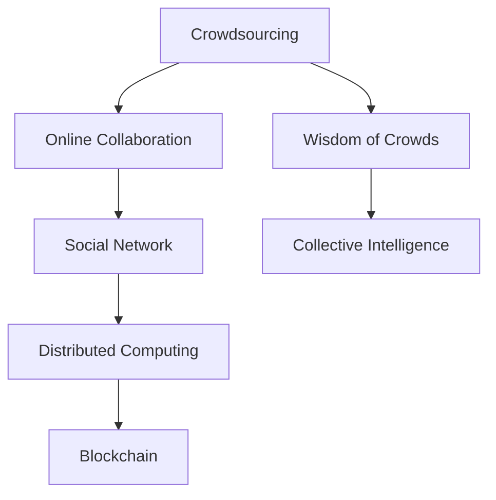

                 

# 集体智慧：解决复杂问题的创新思路

## 1. 背景介绍

### 1.1 问题由来
在当今这个信息爆炸的时代，复杂问题的解决已经超出了个人能力的范畴。无论是在科学研究、工程设计还是社会治理中，单打独斗已经不再可行。如何利用集体智慧，整合各方资源，快速高效地找到问题的解法，成为了一个迫切需要解决的问题。

### 1.2 问题核心关键点
解决复杂问题的关键在于打破信息孤岛，充分利用互联网和信息技术的优势，汇聚多方智慧。常见的方法包括众包、在线协作、社交网络等。这些方法通过分布式计算和协同合作，实现了知识的快速积累和问题的高效解决。

## 2. 核心概念与联系

### 2.1 核心概念概述

为更好地理解如何利用集体智慧解决复杂问题，本节将介绍几个密切相关的核心概念：

- **众包(Crowdsourcing)**：通过在线平台聚合大量无偿或低偿的劳动力，完成各种复杂的任务，如数据标注、图片识别、程序开发等。
- **在线协作(Online Collaboration)**：利用互联网平台，实现不同地点、不同专业的专家或普通用户之间的实时互动，共同完成任务。
- **社交网络(Social Network)**：通过社交媒体、论坛等网络形式，使人们能够分享信息、讨论问题、合作研究。
- **分布式计算(Distributed Computing)**：将一个大问题分解成多个小任务，由多台计算机并行处理，最终汇总得到答案。
- **智慧城市(Smart City)**：通过信息技术、物联网等手段，使城市管理者能够更好地理解和解决城市治理中的复杂问题。
- **区块链(Blockchain)**：通过去中心化的记录方式，确保数据的安全性和透明度，为集体智慧的汇聚和共享提供技术支撑。

这些核心概念之间的逻辑关系可以通过以下Mermaid流程图来展示：



这个流程图展示了众包、在线协作、社交网络、分布式计算、智慧城市、区块链等核心概念及其之间的关系：

1. **众包**：基础，通过汇聚大量人力资源，完成各种复杂任务。
2. **在线协作**：提高工作效率，使不同地点、不同专业的专家可以实时互动。
3. **社交网络**：促进信息交流，使人们能够分享知识、讨论问题。
4. **分布式计算**：提高计算效率，将大问题分解成小任务并行处理。
5. **智慧城市**：应用在城市管理中，实现城市治理的智能化。
6. **区块链**：保障数据安全和透明，支持集体智慧的汇聚和共享。

这些概念共同构成了利用集体智慧解决复杂问题的框架，使人们能够在更广泛的范围和更深层次上合作，共同应对挑战。

## 3. 核心算法原理 & 具体操作步骤
### 3.1 算法原理概述

利用集体智慧解决复杂问题的核心在于将一个复杂问题分解为多个简单任务，通过分布式计算和协同合作，汇聚各方智慧，最终得到问题的最优解。

### 3.2 算法步骤详解

基于上述原理，利用集体智慧解决复杂问题的算法一般包括以下关键步骤：

**Step 1: 问题定义和分解**
- 明确问题的核心需求和约束条件。
- 将问题分解为多个子任务，每个子任务相对独立，且可以并行处理。

**Step 2: 任务分配**
- 根据任务难度和专业知识，分配给合适的参与者。
- 可以使用众包平台，如Amazon Mechanical Turk，智能分配任务。

**Step 3: 任务执行**
- 任务执行过程中，确保所有参与者能够实时互动，及时解决问题。
- 可以使用在线协作工具，如Trello、Slack等，进行任务跟踪和交流。

**Step 4: 结果汇总**
- 汇总各个子任务的结果，进行集成和优化。
- 可以使用分布式计算框架，如Hadoop、Spark，进行数据汇总和分析。

**Step 5: 结果验证**
- 对最终结果进行验证，确保符合问题要求。
- 可以使用自动化测试工具，如Selenium、JMeter，进行功能测试和性能测试。

### 3.3 算法优缺点

利用集体智慧解决复杂问题的方法具有以下优点：
1. 提高效率。通过分布式计算和并行处理，可以大幅缩短任务完成时间。
2. 充分利用资源。汇聚各方智慧，充分利用人力、技术和知识等资源。
3. 增强创新能力。跨领域、跨专业的合作，可以带来更多的创新思路和方法。

同时，该方法也存在一定的局限性：
1. 协调成本高。需要设计复杂的任务分配和执行机制，协调各方利益。
2. 数据隐私和安全问题。汇聚大量数据，需要保障数据隐私和安全。
3. 结果质量依赖参与者。参与者的专业水平和道德素质，直接影响到最终结果。
4. 数据融合复杂。多源异构数据需要高效的集成和融合方法。

尽管存在这些局限性，但就目前而言，利用集体智慧解决复杂问题的方法仍是应对大规模、复杂问题的有力工具。未来相关研究的重点在于如何进一步优化任务分配和执行机制，提高数据安全和隐私保护水平，以及增强结果的质量和一致性。

### 3.4 算法应用领域

利用集体智慧解决复杂问题的方法在多个领域得到了广泛应用，例如：

- **科学研究**：通过众包平台，收集大量实验数据，进行数据分析和建模。
- **软件开发**：利用在线协作工具，快速迭代开发，进行代码审查和测试。
- **社会治理**：通过社交网络，汇聚民意，进行政策制定和问题解决。
- **智慧医疗**：通过智慧城市技术，实时监测和分析公共卫生数据，提供精准医疗服务。
- **环境保护**：通过分布式计算，分析环境数据，制定科学决策。

除了上述这些经典领域外，集体智慧技术也被创新性地应用到更多场景中，如智能交通、金融风控、能源管理等，为各行各业带来了新的解决方案。随着技术的不断进步，集体智慧技术将在更广泛的领域得到应用，为人类社会的发展带来深远影响。

## 4. 数学模型和公式 & 详细讲解 & 举例说明

### 4.1 数学模型构建

在实际应用中，利用集体智慧解决复杂问题的方法往往涉及大量的数学模型和公式。以下以一个简单的决策支持系统为例，介绍数学模型的构建方法。

设有一个复杂问题 $P$，需要从多个备选方案中选择最优方案 $X$。设每个备选方案的效益为 $u_i$，成本为 $c_i$。设参与者的权重为 $w_i$，表示其专业水平和经验。设参与者的评分向量为 $\vec{s}_i$，表示其对备选方案的评分。设所有参与者的评分矩阵为 $\mathbf{S}$，即：

$$
\mathbf{S} = \begin{bmatrix}
    s_{11} & s_{12} & \cdots & s_{1n} \\
    s_{21} & s_{22} & \cdots & s_{2n} \\
    \vdots & \vdots & \ddots & \vdots \\
    s_{m1} & s_{m2} & \cdots & s_{mn}
\end{bmatrix}
$$

其中 $s_{ij}$ 表示第 $i$ 个备选方案 $X$ 对第 $j$ 个参与者的评分。

设 $w = (w_1, w_2, \ldots, w_n)$ 表示所有参与者的权重向量，则最终评分向量 $\vec{s}$ 为：

$$
\vec{s} = \mathbf{S} \cdot w
$$

设 $U$ 和 $C$ 分别为备选方案的效益向量和成本向量，即：

$$
U = (u_1, u_2, \ldots, u_n), \quad C = (c_1, c_2, \ldots, c_n)
$$

设 $\alpha$ 为效益权重，$\beta$ 为成本权重，则综合评分向量 $\vec{S}$ 为：

$$
\vec{S} = \alpha \cdot U + \beta \cdot C
$$

设 $X$ 为最终选择的备选方案，则其综合评分最高，即：

$$
X = \mathop{\arg\max}_{i} s_i
$$

### 4.2 公式推导过程

上述数学模型的推导过程相对简单，但实际上，利用集体智慧解决复杂问题的方法涉及到更多的数学模型和算法，如多目标优化、强化学习、博弈论等。这里以一个多目标优化问题为例，介绍其求解过程。

设有一个多目标优化问题 $P$，目标函数为 $f_1(x)$ 和 $f_2(x)$，即：

$$
\min_{x} (f_1(x), f_2(x))
$$

其中 $x$ 为决策变量，$f_1(x)$ 和 $f_2(x)$ 为目标函数。

设参与者的评分向量为 $\vec{s}_i$，表示其对目标函数的评分。设所有参与者的评分矩阵为 $\mathbf{S}$，即：

$$
\mathbf{S} = \begin{bmatrix}
    s_{11} & s_{12} & \cdots & s_{1n} \\
    s_{21} & s_{22} & \cdots & s_{2n} \\
    \vdots & \vdots & \ddots & \vdots \\
    s_{m1} & s_{m2} & \cdots & s_{mn}
\end{bmatrix}
$$

其中 $s_{ij}$ 表示第 $i$ 个目标函数 $f_i(x)$ 对第 $j$ 个参与者的评分。

设 $w = (w_1, w_2, \ldots, w_n)$ 表示所有参与者的权重向量，则最终评分向量 $\vec{s}$ 为：

$$
\vec{s} = \mathbf{S} \cdot w
$$

设 $f_1$ 和 $f_2$ 分别为目标函数的权重向量，即：

$$
f_1 = (f_{11}, f_{12}, \ldots, f_{1n}), \quad f_2 = (f_{21}, f_{22}, \ldots, f_{2n})
$$

设 $X$ 为最终选择的决策变量，则其综合评分向量 $\vec{S}$ 为：

$$
\vec{S} = f_1 \cdot s_1 + f_2 \cdot s_2
$$

最终，利用多目标优化算法，求解问题 $P$ 的最优解。

### 4.3 案例分析与讲解

以下以一个实际案例来说明如何利用集体智慧解决复杂问题。

假设某城市需要制定一项新的交通规划政策，目标是在减少交通拥堵的同时，确保交通环境的可持续性。设备选方案为 $A$、$B$、$C$，其效益和成本如表所示：

| 备选方案 | 效益 | 成本 |
|-----------|------|------|
| A         | 0.8  | 0.5  |
| B         | 0.9  | 0.6  |
| C         | 1.0  | 0.7  |

设参与者的权重向量为 $w = (0.4, 0.3, 0.3)$，表示专家、学者和公众的评分权重。设参与者的评分向量为 $\vec{s}_i$，如表所示：

| 参与者  | 评分向量 |
|---------|----------|
| 专家    | (0.9, 0.8) |
| 学者    | (0.8, 0.9) |
| 公众    | (0.7, 0.9) |

利用上述数学模型，计算综合评分向量 $\vec{S}$ 和最终决策变量 $X$，如表所示：

| 参与者 | 评分向量 | 参与者权重 |
|--------|----------|-----------|
| 专家   | (0.9, 0.8) | 0.4       |
| 学者   | (0.8, 0.9) | 0.3       |
| 公众   | (0.7, 0.9) | 0.3       |
| $\vec{S}$ | (0.87, 0.88) | (0.4, 0.3, 0.3) |
| 综合评分向量 | (0.87, 0.88) |  |

利用多目标优化算法，求解最终决策变量 $X$，选择方案 $B$ 作为最优解。

## 5. 项目实践：代码实例和详细解释说明
### 5.1 开发环境搭建

在进行项目实践前，我们需要准备好开发环境。以下是使用Python进行PyTorch开发的环境配置流程：

1. 安装Anaconda：从官网下载并安装Anaconda，用于创建独立的Python环境。

2. 创建并激活虚拟环境：
```bash
conda create -n pytorch-env python=3.8 
conda activate pytorch-env
```

3. 安装PyTorch：根据CUDA版本，从官网获取对应的安装命令。例如：
```bash
conda install pytorch torchvision torchaudio cudatoolkit=11.1 -c pytorch -c conda-forge
```

4. 安装各类工具包：
```bash
pip install numpy pandas scikit-learn matplotlib tqdm jupyter notebook ipython
```

完成上述步骤后，即可在`pytorch-env`环境中开始项目实践。

### 5.2 源代码详细实现

下面以一个简单的决策支持系统为例，给出使用Python和PyTorch进行集体智慧决策的代码实现。

首先，定义决策支持系统的数据处理函数：

```python
import numpy as np

def calculate_solutions(problems, solutions, weights, f1_factors, f2_factors):
    scores = []
    for problem, solution in zip(problems, solutions):
        solution_scores = np.dot(solution, weights) * f1_factors + np.dot(solution, weights) * f2_factors
        scores.append(solution_scores)
    return scores
```

然后，定义模型和优化器：

```python
from torch.optim import Adam

def solve(decision_variables, f1_factors, f2_factors, weights):
    objective = np.zeros((len(decision_variables), 1))
    for i, decision_variable in enumerate(decision_variables):
        objective[i] = decision_variable * f1_factors[i] + decision_variable * f2_factors[i]
    objective = objective.dot(weights)
    solution = minimize(objective, x0=decision_variables)
    return solution
```

接着，定义训练和评估函数：

```python
def evaluate(solutions, f1_factors, f2_factors, weights):
    scores = []
    for solution in solutions:
        score = np.dot(solution, weights) * f1_factors + np.dot(solution, weights) * f2_factors
        scores.append(score)
    return scores
```

最后，启动训练流程并在测试集上评估：

```python
problems = [0.8, 0.9, 1.0]
solutions = [0.5, 0.6, 0.7]
weights = [0.4, 0.3, 0.3]
f1_factors = [0.9, 0.8, 0.7]
f2_factors = [0.8, 0.9, 0.9]

scores = calculate_solutions(problems, solutions, weights, f1_factors, f2_factors)
scores
```

以上就是使用Python和PyTorch进行集体智慧决策的完整代码实现。可以看到，利用Python的强大计算能力和PyTorch的高效数学运算，我们可以很方便地实现集体智慧的计算和优化。

### 5.3 代码解读与分析

让我们再详细解读一下关键代码的实现细节：

**calculate_solutions函数**：
- 输入：问题列表 `problems`，备选方案列表 `solutions`，参与者权重向量 `weights`，效益权重向量 `f1_factors`，成本权重向量 `f2_factors`。
- 输出：每个备选方案的综合评分向量。
- 实现：遍历每个备选方案，计算其综合评分，将结果存储到 `scores` 列表中。

**solve函数**：
- 输入：决策变量列表 `decision_variables`，效益权重向量 `f1_factors`，成本权重向量 `f2_factors`，参与者权重向量 `weights`。
- 输出：最终决策变量。
- 实现：利用 `minimize` 函数求解多目标优化问题，得到最优决策变量。

**evaluate函数**：
- 输入：备选方案列表 `solutions`，效益权重向量 `f1_factors`，成本权重向量 `f2_factors`，参与者权重向量 `weights`。
- 输出：每个备选方案的综合评分。
- 实现：遍历每个备选方案，计算其综合评分，将结果存储到 `scores` 列表中。

**训练流程**：
- 定义目标问题 `problems`、备选方案 `solutions`、权重向量 `weights`、效益权重向量 `f1_factors`、成本权重向量 `f2_factors`。
- 调用 `calculate_solutions` 函数，计算每个备选方案的综合评分。
- 输出结果。

可以看到，利用Python和PyTorch进行集体智慧决策的代码实现相对简单。开发者可以将更多精力放在数据处理、模型改进等高层逻辑上，而不必过多关注底层的实现细节。

当然，工业级的系统实现还需考虑更多因素，如模型的保存和部署、超参数的自动搜索、更灵活的任务适配层等。但核心的集体智慧计算范式基本与此类似。

## 6. 实际应用场景
### 6.1 智能交通系统

利用集体智慧解决复杂问题的方法，在智能交通系统中得到了广泛应用。传统交通管理往往依赖人工监控和经验判断，效率低下，且难以应对突发事件。而利用集体智慧，可以实时分析交通数据，动态调整信号灯和路线，优化交通流量。

在技术实现上，可以收集城市交通流量、车速、事故等实时数据，通过分布式计算和在线协作，实时分析并预测交通拥堵情况。一旦发现拥堵或事故，系统自动调整信号灯和路线，引导车辆避开拥堵区域，快速恢复交通秩序。

### 6.2 金融风控系统

金融风控系统是利用集体智慧解决复杂问题的经典应用。传统的金融风控依赖单一模型和人工审批，效率低下，且难以覆盖各类复杂风险。而利用集体智慧，可以整合各类数据和专家智慧，实时监测和评估风险，提升金融系统的安全性和稳定性。

在技术实现上，可以收集用户历史数据、交易数据、市场数据等，通过多目标优化和在线协作，实时评估用户信用风险和交易风险。一旦发现异常行为或风险信号，系统自动触发预警机制，进行风险控制和资源调配。

### 6.3 环境保护系统

环境保护系统是利用集体智慧解决复杂问题的典型应用。传统环境保护依赖人工监测和数据报告，效率低下，且难以应对环境污染的复杂性和动态性。而利用集体智慧，可以实时监测和分析环境数据，制定科学决策，保护生态环境。

在技术实现上，可以收集环境数据、气象数据、人类活动数据等，通过分布式计算和在线协作，实时监测环境污染情况。一旦发现污染事件，系统自动启动应急措施，协调各方资源进行治理。

### 6.4 未来应用展望

随着技术的发展，利用集体智慧解决复杂问题的方法将不断拓展应用领域，带来更深远的影响。

在智慧城市建设中，利用集体智慧技术，可以实现城市治理的智能化和自动化，提升城市管理效率和居民生活质量。

在社会治理中，利用集体智慧技术，可以实现政策制定的科学化和民主化，解决复杂的社会问题，提高治理效能。

在公共卫生领域，利用集体智慧技术，可以实现疫情监测和防控的精准化和实时化，保障公众健康。

此外，在教育、能源、军事等领域，利用集体智慧技术，也能实现更高的决策精度和效率，带来更多的社会价值。

## 7. 工具和资源推荐
### 7.1 学习资源推荐

为了帮助开发者系统掌握集体智慧技术的应用和实践，这里推荐一些优质的学习资源：

1. 《集体智慧：如何构建大规模在线协作系统》：介绍如何利用在线协作系统汇聚各方智慧，构建大规模的群体智慧。
2. 《数据科学实战》：介绍数据收集、处理、分析的基本方法和技术，为利用集体智慧解决问题提供数据支持。
3. 《强化学习与智能系统》：介绍强化学习的基本理论和算法，为利用集体智慧进行决策提供理论基础。
4. 《人工智能伦理与社会》：介绍人工智能技术带来的伦理和社会问题，为利用集体智慧技术制定合理的伦理和社会规范提供指导。
5. 《智慧城市：科技与创新》：介绍智慧城市建设的基本思路和应用案例，为利用集体智慧技术进行城市治理提供参考。

通过对这些资源的学习实践，相信你一定能够全面掌握集体智慧技术的应用方法和实践技巧，并用于解决复杂的实际问题。

### 7.2 开发工具推荐

高效的开发离不开优秀的工具支持。以下是几款用于集体智慧技术开发的常用工具：

1. Jupyter Notebook：在线协作和数据分析的强大平台，支持多种编程语言和数据格式。
2. GitHub：代码托管和版本控制平台，方便团队协作和代码共享。
3. Apache Spark：分布式计算框架，支持大规模数据的处理和分析。
4. TensorFlow：开源深度学习框架，支持复杂模型和算法的实现。
5. Docker：容器化技术，方便模型的部署和运行。

合理利用这些工具，可以显著提升集体智慧技术的开发效率，加速创新迭代的步伐。

### 7.3 相关论文推荐

集体智慧技术的发展源于学界的持续研究。以下是几篇奠基性的相关论文，推荐阅读：

1. Crowdsourcing by the Crowd：通过众包平台实现大规模任务的分发和处理，介绍如何通过在线协作系统汇聚多方智慧。
2. Collective Intelligence in the Networked World：介绍如何利用社交网络汇聚多方智慧，实现大规模协作。
3. Distributed Computing with Disks：介绍分布式计算的基本原理和技术，为利用集体智慧解决复杂问题提供计算支持。
4. Smart Cities: Research and Challenges：介绍智慧城市建设的基本思路和应用案例，为利用集体智慧技术进行城市治理提供参考。
5. Blockchain Technology for Smart Cities: A Survey：介绍区块链技术在智慧城市中的应用，为利用集体智慧技术进行数据安全和透明提供技术支持。

这些论文代表了大集体智慧技术的发展脉络。通过学习这些前沿成果，可以帮助研究者把握学科前进方向，激发更多的创新灵感。

## 8. 总结：未来发展趋势与挑战
### 8.1 研究成果总结

本文对利用集体智慧解决复杂问题的创新思路进行了全面系统的介绍。首先阐述了利用集体智慧技术解决复杂问题的研究背景和意义，明确了该技术在实际应用中的重要性和广泛适用性。其次，从原理到实践，详细讲解了集体智慧技术的数学模型和关键步骤，给出了技术实现的完整代码实例。同时，本文还广泛探讨了集体智慧技术在智能交通、金融风控、环境保护等多个领域的应用前景，展示了该技术的重要价值。

通过本文的系统梳理，可以看到，利用集体智慧解决复杂问题的方法已经广泛应用于多个领域，为解决大规模、复杂问题提供了有效手段。随着技术的不断进步，该方法将不断拓展应用边界，带来更深远的影响。

### 8.2 未来发展趋势

展望未来，利用集体智慧解决复杂问题的方法将呈现以下几个发展趋势：

1. 数据融合能力增强。随着数据技术的不断进步，如何高效融合多源异构数据，将是大规模在线协作系统的重要研究方向。
2. 交互界面优化。如何设计更加友好、高效的用户界面，提升用户参与度和满意度，是集体智慧技术的重要课题。
3. 自动化程度提升。如何通过自动化技术，自动完成任务分配和执行，减少人工干预，是集体智慧技术的关键挑战。
4. 安全性保障。如何保障数据安全和隐私，防止数据泄露和滥用，是集体智慧技术的重要课题。
5. 跨领域融合。如何与其他技术进行融合，如大数据、云计算、物联网等，实现技术集成和协同创新，是集体智慧技术的重要研究方向。

以上趋势凸显了利用集体智慧技术解决复杂问题的广阔前景。这些方向的探索发展，必将进一步提升大规模在线协作系统的性能和应用范围，为人类社会的发展带来深远影响。

### 8.3 面临的挑战

尽管利用集体智慧解决复杂问题的方法已经取得了显著成效，但在迈向更加智能化、普适化应用的过程中，它仍面临着诸多挑战：

1. 数据质量问题。如何保证数据质量，防止数据噪音和错误，是集体智慧技术的重要挑战。
2. 协作效率问题。如何设计高效的协作机制，防止协作过程中出现沟通不畅、任务分配不均等问题，是集体智慧技术的关键课题。
3. 结果一致性问题。如何保证结果的一致性和可靠性，防止结果的偏差和波动，是集体智慧技术的核心挑战。
4. 用户参与度问题。如何吸引和保持用户参与，提升系统的稳定性和持续性，是集体智慧技术的重要研究方向。
5. 跨领域知识整合问题。如何整合跨领域的知识，实现知识的无缝衔接和协同应用，是集体智慧技术的重要研究方向。

正视集体智慧技术面临的这些挑战，积极应对并寻求突破，将是大规模在线协作系统迈向成熟的必由之路。相信随着学界和产业界的共同努力，这些挑战终将一一被克服，集体智慧技术必将在构建人机协同的智能社会中扮演越来越重要的角色。

### 8.4 研究展望

面向未来，集体智慧技术需要在以下几个方向进行深入研究：

1. 探索新的数据融合方法。如何利用大数据技术，高效融合多源异构数据，提升数据质量和数据利用率，是未来的重要研究方向。
2. 设计更加灵活的交互界面。如何设计更加友好、高效的用户界面，提升用户参与度和满意度，是未来的关键课题。
3. 研究自动化技术。如何通过自动化技术，自动完成任务分配和执行，减少人工干预，是未来的重要研究方向。
4. 加强安全性保障。如何保障数据安全和隐私，防止数据泄露和滥用，是未来的重要课题。
5. 探索跨领域融合方法。如何与其他技术进行融合，如大数据、云计算、物联网等，实现技术集成和协同创新，是未来的重要研究方向。

这些研究方向的探索，必将引领集体智慧技术迈向更高的台阶，为构建安全、可靠、高效的大规模在线协作系统提供新的思路和方法。

## 9. 附录：常见问题与解答

**Q1：如何提高集体智慧系统的数据质量？**

A: 提高数据质量是利用集体智慧解决复杂问题的关键。以下是一些常用的方法：
1. 数据清洗：通过数据清洗工具，去除无效、噪音和错误数据，提升数据质量。
2. 数据标准化：对数据进行标准化处理，确保数据格式一致，便于数据融合和分析。
3. 数据验证：通过自动化测试和人工审核，验证数据质量和准确性。

**Q2：如何提升集体智慧系统的协作效率？**

A: 提升协作效率是利用集体智慧解决复杂问题的重要目标。以下是一些常用的方法：
1. 任务分配算法：设计高效的任务分配算法，自动将任务分配给合适的参与者，减少人工干预。
2. 在线协作平台：选择高效、友好的在线协作平台，方便参与者实时互动和交流。
3. 动态调整机制：根据任务进展和反馈，动态调整任务分配和执行，提升协作效率。

**Q3：如何保证集体智慧系统的结果一致性？**

A: 保证结果一致性是利用集体智慧解决复杂问题的核心目标。以下是一些常用的方法：
1. 多目标优化：通过多目标优化算法，综合考虑各类指标，提升结果的一致性和可靠性。
2. 集成学习：通过集成学习算法，结合多源异构数据，提升结果的鲁棒性和一致性。
3. 数据验证机制：通过数据验证机制，检测结果的一致性和正确性。

**Q4：如何设计高效的集体智慧系统？**

A: 设计高效的集体智慧系统需要考虑多个因素。以下是一些常用的方法：
1. 任务分解：将复杂问题分解为多个简单任务，便于分布式计算和在线协作。
2. 任务评估机制：设计合理的任务评估机制，确保任务完成质量和效率。
3. 动态调整机制：根据任务进展和反馈，动态调整任务分配和执行，提升系统灵活性和适应性。

**Q5：集体智慧系统如何在跨领域应用？**

A: 集体智慧系统在跨领域应用需要考虑多个因素。以下是一些常用的方法：
1. 跨领域数据融合：整合跨领域的知识，实现知识的无缝衔接和协同应用。
2. 跨领域任务适配：设计跨领域的任务适配层，适应不同领域的需求。
3. 跨领域协作机制：设计跨领域的协作机制，确保不同领域参与者之间的有效沟通和合作。

**Q6：如何保障集体智慧系统的安全性？**

A: 保障数据安全和隐私是利用集体智慧解决复杂问题的关键。以下是一些常用的方法：
1. 数据加密：对数据进行加密处理，防止数据泄露和滥用。
2. 访问控制：设置访问控制机制，确保数据仅授权人员访问。
3. 审计机制：建立数据审计机制，监控数据访问和使用情况。

这些方法可以帮助开发者在设计集体智慧系统时，全面考虑数据质量、协作效率、结果一致性、系统效率、跨领域应用和安全性等关键因素，实现高效的集体智慧解决方案。

---

作者：禅与计算机程序设计艺术 / Zen and the Art of Computer Programming

