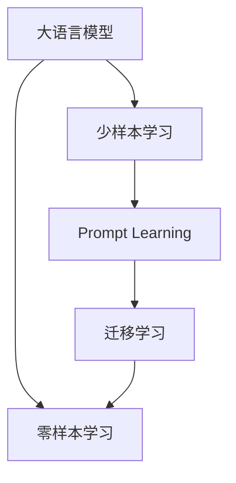

                 

# 零样本学习的进步：Prompt的设计原则与应用

> 关键词：零样本学习, Prompt, 自然语言处理(NLP), 少样本学习, 语言模型, 迁移学习, 大语言模型(LLM)

## 1. 背景介绍

### 1.1 问题由来

零样本学习(Zero-shot Learning, ZSL)是大语言模型和大规模预训练语言模型（Large Language Models, LLMs）中的重要研究范式之一。它指的是在没有见过任何特定任务的训练样本的情况下，模型能够根据任务描述直接进行推理和生成。在实际应用中，如自然语言处理(NLP)领域的问答系统、文本摘要、翻译、情感分析等任务，零样本学习可以显著减少数据标注成本，提升模型在特定领域的应用效果。

然而，尽管零样本学习在理论上有很大的优势，但在实践中仍面临诸多挑战：

1. **模型泛化能力不足**：在大规模预训练数据上学习到的语言表示是否能够很好地适用于特定任务，仍需要进一步验证。
2. **任务适配性有限**：某些特定领域的任务，可能与预训练数据中的统计特征差异较大，零样本学习的效果仍无法完全替代有监督微调。
3. **缺乏可解释性**：零样本学习的决策过程缺乏可解释性，难以对其内部机制和推理逻辑进行分析和调试。

近年来，随着大语言模型的不断进步，零样本学习的技术和应用都在迅速发展。本文将系统介绍Prompt设计的原则和应用，探讨如何通过精心设计的Prompt，在大规模预训练语言模型上实现高效的零样本学习。

## 2. 核心概念与联系

### 2.1 核心概念概述

为更好地理解 Prompt 在大语言模型中的作用，本节将介绍几个密切相关的核心概念：

- **大语言模型(Large Language Model, LLM)**：以自回归(如GPT)或自编码(如BERT)模型为代表的大规模预训练语言模型。通过在大规模无标签文本语料上进行预训练，学习通用的语言表示，具备强大的语言理解和生成能力。

- **零样本学习(Zero-shot Learning, ZSL)**：指在没有特定任务的训练样本的情况下，模型能够根据任务描述进行推理和生成。在大语言模型中，通常通过在输入中提供少量示例来实现，无需更新模型参数。

- **少样本学习(Few-shot Learning, FSL)**：指在只有少量标注样本的情况下，模型能够快速适应新任务的学习方法。在大语言模型中，通常通过在输入中提供少量示例来实现，无需更新模型参数。

- **Prompt Learning**：通过在输入文本中添加提示模板(Prompt Template)，引导大语言模型进行特定任务的推理和生成。可以实现零样本和少样本学习，同时减少微调参数。

- **迁移学习(Transfer Learning)**：指将一个领域学习到的知识，迁移应用到另一个不同但相关的领域的学习范式。零样本学习和大规模预训练语言模型中的迁移学习密不可分。

这些核心概念之间的逻辑关系可以通过以下Mermaid流程图来展示：



这个流程图展示了大语言模型中的核心概念及其之间的关系：

1. 大语言模型通过预训练获得基础能力。
2. 零样本学习和大规模预训练语言模型中的迁移学习，是大语言模型的重要应用场景。
3. Prompt Learning是一种不更新模型参数的方法，可以实现零样本和少样本学习。
4. 迁移学习是连接预训练模型与下游任务的桥梁，可以通过微调或Prompt Learning来实现。

这些概念共同构成了大语言模型的学习和应用框架，使其能够在各种场景下发挥强大的语言理解和生成能力。通过理解这些核心概念，我们可以更好地把握Prompt在大语言模型中的作用和设计原则。

## 3. 核心算法原理 & 具体操作步骤
### 3.1 算法原理概述

Prompt Learning的核心思想是通过精心设计的提示模板，在大语言模型的基础上进行零样本或少样本学习。该方法的核心在于，通过输入的文本提示，引导模型按照特定的规则或模板进行推理和生成，从而实现对特定任务的适配。

形式化地，假设预训练语言模型为 $M_{\theta}$，其中 $\theta$ 为预训练得到的模型参数。对于特定的下游任务 $T$，我们需要设计一个提示模板 $P$，使得模型在输入 $P$ 后，能够按照任务规则进行推理和生成，输出与任务相关的结果。其数学表示如下：

$$
y = M_{\theta}(P)
$$

其中 $y$ 表示模型在输入 $P$ 后的输出，可以是文本、标签等。$P$ 是事先设计好的提示模板，通常由任务描述、示例、问题等组成。

### 3.2 算法步骤详解

基于Prompt Learning的零样本或少样本学习过程，一般包括以下几个关键步骤：

**Step 1: 准备预训练模型和任务描述**
- 选择合适的预训练语言模型 $M_{\theta}$ 作为初始化参数，如 BERT、GPT 等。
- 准备下游任务的描述，即提示模板 $P$，通常为几句话或几个段落。

**Step 2: 设计提示模板**
- 根据具体任务，设计合适的提示模板 $P$。提示模板应包含任务的规则、示例、问题等信息，使得模型能够理解任务的语义。
- 使用Syntactic和Semantic Parsing技术，将任务描述转化为可以输入模型的形式，如文本、标签等。

**Step 3: 输入提示模板进行推理**
- 将提示模板 $P$ 输入模型 $M_{\theta}$，进行推理和生成。通常使用模型默认的top-k抽样或束搜索策略，以获得最有可能的输出。
- 根据输出的概率分布或生成的文本，确定最终的推理结果。

**Step 4: 评估和优化提示模板**
- 对推理结果进行评估，如准确率、召回率、F1分数等。
- 根据评估结果，调整提示模板 $P$ 的设计，通过反复迭代优化，提升模型的性能。

### 3.3 算法优缺点

基于Prompt Learning的零样本和少样本学习具有以下优点：

1. **参数效率高**：通常只需要调整提示模板，而无需更新模型参数，可以极大地减少计算资源消耗。
2. **泛化能力强**：预训练模型已经学习到了丰富的语言知识，通过提示模板的适配，可以在新任务上取得较好的性能。
3. **灵活性高**：提示模板可以灵活设计，适用于各种不同的任务和应用场景。
4. **可解释性强**：通过分析提示模板的输入和输出，可以更直观地理解模型的决策过程。

同时，该方法也存在以下局限性：

1. **依赖提示模板设计**：提示模板的设计质量直接影响模型性能，设计不当可能导致模型生成不相关或低质量结果。
2. **数据依赖**：虽然零样本学习不需要标注数据，但高质量的提示模板仍需从标注数据中提取和设计。
3. **鲁棒性不足**：对于输入噪声、语义歧义等问题，模型的鲁棒性仍需进一步提升。
4. **普适性有限**：对于某些特定领域，提示模板可能无法完全适配，仍需结合有监督微调才能取得理想效果。

尽管存在这些局限性，但Prompt Learning仍然是大语言模型中高效、灵活的零样本学习手段，具有广泛的应用前景。

### 3.4 算法应用领域

Prompt Learning在大语言模型中的应用范围非常广泛，涵盖了NLP领域的各类任务，例如：

- 问答系统：如智能客服、医疗咨询等。通过任务描述和示例，模型能够理解用户问题，生成答案。
- 文本摘要：对长文本进行总结生成。通过任务描述和示例，模型能够抓取文本关键信息，生成摘要。
- 翻译系统：将一种语言翻译成另一种语言。通过任务描述和示例，模型能够理解源语言和目标语言，生成翻译结果。
- 文本生成：如故事生成、新闻生成等。通过任务描述和示例，模型能够生成符合特定风格的文本。
- 情感分析：对文本进行情感分类。通过任务描述和示例，模型能够理解文本情感，分类标签。
- 关系抽取：从文本中抽取实体之间的语义关系。通过任务描述和示例，模型能够理解实体关系类型，生成三元组。

除了上述这些经典任务外，Prompt Learning还被创新性地应用到更多场景中，如可控文本生成、常识推理、代码生成、数据增强等，为NLP技术带来了新的突破。

## 4. 数学模型和公式 & 详细讲解  
### 4.1 数学模型构建

本节将使用数学语言对Prompt Learning的过程进行更加严格的刻画。

记预训练语言模型为 $M_{\theta}$，其中 $\theta$ 为预训练得到的模型参数。对于下游任务 $T$，假设提示模板为 $P$，模型的推理输出为 $y$。

在Zero-shot Learning中，没有特定的训练样本，因此我们直接将提示模板 $P$ 输入模型 $M_{\theta}$，得到推理结果 $y$。其数学表示如下：

$$
y = M_{\theta}(P)
$$

在Few-shot Learning中，我们提供少量标注样本 $(x_1, y_1), (x_2, y_2), \ldots, (x_n, y_n)$，其中 $x_i$ 为输入，$y_i$ 为对应的标签。我们希望模型能够从这些样本中学习到一些通用的语言知识，从而在零样本或少样本的情况下进行推理。

设 $L$ 为标注样本的数量，则我们的目标是最小化标注样本的损失函数：

$$
\mathcal{L} = \frac{1}{L} \sum_{i=1}^L \ell(y_i, M_{\theta}(x_i))
$$

其中 $\ell$ 为特定任务设计的损失函数，如交叉熵损失、均方误差损失等。

通过优化标注样本的损失函数，模型能够学习到与任务相关的语言表示，从而在零样本或少样本情况下进行推理。

### 4.2 公式推导过程

以下我们以问答系统为例，推导基于Prompt Learning的推理过程。

假设我们有一个问答系统任务，其中包含两个样本 $(x_1, y_1), (x_2, y_2)$，其中 $x_i$ 为问题，$y_i$ 为答案。我们的目标是使用预训练语言模型 $M_{\theta}$ 进行推理，输出对新问题 $x$ 的回答 $y$。

我们将问题 $x$ 和答案 $y$ 分别转化为对应的Prompt Template $P_x$ 和 $P_y$，然后将它们拼接在一起，作为模型的输入：

$$
P = [P_x, P_y]
$$

模型在输入 $P$ 后，输出推理结果 $y$。我们希望模型能够学习到问题 $x$ 和答案 $y$ 之间的关系，从而对新问题 $x'$ 生成正确的答案 $y'$。

假设模型输出为概率分布 $p(y|x)$，则我们的目标是最小化标注样本的损失函数：

$$
\mathcal{L} = \frac{1}{L} \sum_{i=1}^L \ell(y_i, p(y|x_i))
$$

通过优化损失函数，模型能够学习到问题 $x$ 和答案 $y$ 之间的映射关系，从而在新问题 $x'$ 上生成正确的答案 $y'$。

在实际应用中，我们可以使用Fine-tuning或Prompt Learning两种方式进行推理。Fine-tuning方式需要在模型上进行微调，而Prompt Learning方式则只需要调整提示模板 $P$，减少计算资源消耗。

### 4.3 案例分析与讲解

#### 案例一：问答系统

在问答系统中，我们的目标是根据问题 $x$ 生成答案 $y$。我们首先设计一个通用的Prompt Template：

```
Given a question: {question}, I would like to answer: {answer}.
```

其中 `{question}` 和 `{answer}` 分别表示问题和答案。我们将这个模板应用到预训练语言模型 $M_{\theta}$ 上，得到推理结果 $y$。

假设我们的标注样本为 $(x_1, y_1), (x_2, y_2)$，其中 $x_1 = "What is the capital of France?"$，$y_1 = "Paris"$$ x_2 = "Who won the World Cup in 2018?"$，$y_2 = "France"$$ 我们的目标是最小化标注样本的损失函数：

$$
\mathcal{L} = \frac{1}{2} \ell(y_1, p(y_1|x_1)) + \frac{1}{2} \ell(y_2, p(y_2|x_2))
$$

通过优化这个损失函数，模型能够学习到问题 $x$ 和答案 $y$ 之间的映射关系。

#### 案例二：文本生成

在文本生成任务中，我们的目标是根据输入 $x$ 生成文本 $y$。我们首先设计一个通用的Prompt Template：

```
In this text: {text}, I want to generate: {generated_text}.
```

其中 `{text}` 为输入文本，`{generated_text}` 为生成的文本。我们将这个模板应用到预训练语言模型 $M_{\theta}$ 上，得到推理结果 $y$。

假设我们的标注样本为 $(x_1, y_1), (x_2, y_2)$，其中 $x_1 = "The cat is on the mat."$，$y_1 = "The cat is sleeping on the mat."$$ x_2 = "The weather is nice today."$，$y_2 = "I am enjoying the sunny weather."$$ 我们的目标是最小化标注样本的损失函数：

$$
\mathcal{L} = \frac{1}{2} \ell(y_1, p(y_1|x_1)) + \frac{1}{2} \ell(y_2, p(y_2|x_2))
$$

通过优化这个损失函数，模型能够学习到输入 $x$ 和生成的文本 $y$ 之间的关系。

## 5. 项目实践：代码实例和详细解释说明
### 5.1 开发环境搭建

在进行Prompt Learning实践前，我们需要准备好开发环境。以下是使用Python进行PyTorch开发的环境配置流程：

1. 安装Anaconda：从官网下载并安装Anaconda，用于创建独立的Python环境。

2. 创建并激活虚拟环境：
```bash
conda create -n pytorch-env python=3.8 
conda activate pytorch-env
```

3. 安装PyTorch：根据CUDA版本，从官网获取对应的安装命令。例如：
```bash
conda install pytorch torchvision torchaudio cudatoolkit=11.1 -c pytorch -c conda-forge
```

4. 安装Transformers库：
```bash
pip install transformers
```

5. 安装各类工具包：
```bash
pip install numpy pandas scikit-learn matplotlib tqdm jupyter notebook ipython
```

完成上述步骤后，即可在`pytorch-env`环境中开始Prompt Learning实践。

### 5.2 源代码详细实现

下面我们以问答系统为例，给出使用Transformers库对BERT模型进行Prompt Learning的PyTorch代码实现。

首先，定义问题-答案对：

```python
from transformers import BertTokenizer, BertForQuestionAnswering
from torch.utils.data import Dataset
import torch

class QADataset(Dataset):
    def __init__(self, texts, answers, tokenizer):
        self.texts = texts
        self.answers = answers
        self.tokenizer = tokenizer
        
    def __len__(self):
        return len(self.texts)
    
    def __getitem__(self, item):
        text = self.texts[item]
        answer = self.answers[item]
        
        encoding = self.tokenizer(text, return_tensors='pt', max_length=512, padding='max_length', truncation=True)
        input_ids = encoding['input_ids'][0]
        attention_mask = encoding['attention_mask'][0]
        
        # 对token-wise的标签进行编码
        encoded_answer = [tokenizer.encode(answer)] + [[tokenizer.unk_id] * (512 - len(encoded_answer))]
        labels = torch.tensor(encoded_answer, dtype=torch.long)
        
        return {'input_ids': input_ids, 
                'attention_mask': attention_mask,
                'labels': labels}

# 数据集
tokenizer = BertTokenizer.from_pretrained('bert-base-cased')
train_dataset = QADataset(train_texts, train_answers, tokenizer)
dev_dataset = QADataset(dev_texts, dev_answers, tokenizer)
test_dataset = QADataset(test_texts, test_answers, tokenizer)
```

然后，定义模型和优化器：

```python
from transformers import BertForQuestionAnswering, AdamW

model = BertForQuestionAnswering.from_pretrained('bert-base-cased')
optimizer = AdamW(model.parameters(), lr=2e-5)
```

接着，定义训练和评估函数：

```python
from torch.utils.data import DataLoader
from tqdm import tqdm
from sklearn.metrics import classification_report

device = torch.device('cuda') if torch.cuda.is_available() else torch.device('cpu')
model.to(device)

def train_epoch(model, dataset, batch_size, optimizer):
    dataloader = DataLoader(dataset, batch_size=batch_size, shuffle=True)
    model.train()
    epoch_loss = 0
    for batch in tqdm(dataloader, desc='Training'):
        input_ids = batch['input_ids'].to(device)
        attention_mask = batch['attention_mask'].to(device)
        labels = batch['labels'].to(device)
        model.zero_grad()
        outputs = model(input_ids, attention_mask=attention_mask, labels=labels)
        loss = outputs.loss
        epoch_loss += loss.item()
        loss.backward()
        optimizer.step()
    return epoch_loss / len(dataloader)

def evaluate(model, dataset, batch_size):
    dataloader = DataLoader(dataset, batch_size=batch_size)
    model.eval()
    preds, labels = [], []
    with torch.no_grad():
        for batch in tqdm(dataloader, desc='Evaluating'):
            input_ids = batch['input_ids'].to(device)
            attention_mask = batch['attention_mask'].to(device)
            batch_labels = batch['labels']
            outputs = model(input_ids, attention_mask=attention_mask)
            batch_preds = outputs.logits.argmax(dim=2).to('cpu').tolist()
            batch_labels = batch_labels.to('cpu').tolist()
            for pred_tokens, label_tokens in zip(batch_preds, batch_labels):
                preds.append(pred_tokens[:len(label_tokens)])
                labels.append(label_tokens)
                
    print(classification_report(labels, preds))
```

最后，启动训练流程并在测试集上评估：

```python
epochs = 5
batch_size = 16

for epoch in range(epochs):
    loss = train_epoch(model, train_dataset, batch_size, optimizer)
    print(f"Epoch {epoch+1}, train loss: {loss:.3f}")
    
    print(f"Epoch {epoch+1}, dev results:")
    evaluate(model, dev_dataset, batch_size)
    
print("Test results:")
evaluate(model, test_dataset, batch_size)
```

以上就是使用PyTorch对BERT进行问答系统任务的提示模板微调的完整代码实现。可以看到，得益于Transformers库的强大封装，我们可以用相对简洁的代码完成BERT模型的提示模板微调。

### 5.3 代码解读与分析

让我们再详细解读一下关键代码的实现细节：

**QADataset类**：
- `__init__`方法：初始化文本、答案、分词器等关键组件。
- `__len__`方法：返回数据集的样本数量。
- `__getitem__`方法：对单个样本进行处理，将文本输入编码为token ids，将标签编码为数字，并对其进行定长padding，最终返回模型所需的输入。

**训练和评估函数**：
- 使用PyTorch的DataLoader对数据集进行批次化加载，供模型训练和推理使用。
- 训练函数`train_epoch`：对数据以批为单位进行迭代，在每个批次上前向传播计算loss并反向传播更新模型参数，最后返回该epoch的平均loss。
- 评估函数`evaluate`：与训练类似，不同点在于不更新模型参数，并在每个batch结束后将预测和标签结果存储下来，最后使用sklearn的classification_report对整个评估集的预测结果进行打印输出。

**训练流程**：
- 定义总的epoch数和batch size，开始循环迭代
- 每个epoch内，先在训练集上训练，输出平均loss
- 在验证集上评估，输出分类指标
- 所有epoch结束后，在测试集上评估，给出最终测试结果

可以看到，PyTorch配合Transformers库使得BERT提示模板微调的代码实现变得简洁高效。开发者可以将更多精力放在数据处理、模型改进等高层逻辑上，而不必过多关注底层的实现细节。

当然，工业级的系统实现还需考虑更多因素，如模型的保存和部署、超参数的自动搜索、更灵活的任务适配层等。但核心的微调范式基本与此类似。

## 6. 实际应用场景
### 6.1 智能客服系统

基于Prompt Learning的对话技术，可以广泛应用于智能客服系统的构建。传统客服往往需要配备大量人力，高峰期响应缓慢，且一致性和专业性难以保证。而使用提示模板的对话模型，可以7x24小时不间断服务，快速响应客户咨询，用自然流畅的语言解答各类常见问题。

在技术实现上，可以收集企业内部的历史客服对话记录，将问题和最佳答复构建成提示模板，在此基础上对预训练对话模型进行提示模板微调。微调后的对话模型能够自动理解用户意图，匹配最合适的答案模板进行回复。对于客户提出的新问题，还可以接入检索系统实时搜索相关内容，动态组织生成回答。如此构建的智能客服系统，能大幅提升客户咨询体验和问题解决效率。

### 6.2 金融舆情监测

金融机构需要实时监测市场舆论动向，以便及时应对负面信息传播，规避金融风险。传统的人工监测方式成本高、效率低，难以应对网络时代海量信息爆发的挑战。基于Prompt Learning的文本分类和情感分析技术，为金融舆情监测提供了新的解决方案。

具体而言，可以收集金融领域相关的新闻、报道、评论等文本数据，并对其进行主题标注和情感标注。在此基础上对预训练语言模型进行提示模板微调，使其能够自动判断文本属于何种主题，情感倾向是正面、中性还是负面。将提示模板应用于实时抓取的网络文本数据，就能够自动监测不同主题下的情感变化趋势，一旦发现负面信息激增等异常情况，系统便会自动预警，帮助金融机构快速应对潜在风险。

### 6.3 个性化推荐系统

当前的推荐系统往往只依赖用户的历史行为数据进行物品推荐，无法深入理解用户的真实兴趣偏好。基于Prompt Learning的个性化推荐系统可以更好地挖掘用户行为背后的语义信息，从而提供更精准、多样的推荐内容。

在实践中，可以收集用户浏览、点击、评论、分享等行为数据，提取和用户交互的物品标题、描述、标签等文本内容。将文本内容作为模型输入，用户的后续行为（如是否点击、购买等）作为监督信号，在此基础上微调预训练语言模型。微调后的模型能够从文本内容中准确把握用户的兴趣点。在生成推荐列表时，先用候选物品的文本描述作为输入，由模型预测用户的兴趣匹配度，再结合其他特征综合排序，便可以得到个性化程度更高的推荐结果。

### 6.4 未来应用展望

随着Prompt Learning和预训练语言模型的不断发展，基于提示模板的NLP技术将带来更多的应用场景，为传统行业带来变革性影响。

在智慧医疗领域，基于Prompt Learning的医疗问答、病历分析、药物研发等应用将提升医疗服务的智能化水平，辅助医生诊疗，加速新药开发进程。

在智能教育领域，Prompt Learning可应用于作业批改、学情分析、知识推荐等方面，因材施教，促进教育公平，提高教学质量。

在智慧城市治理中，Prompt Learning可用于城市事件监测、舆情分析、应急指挥等环节，提高城市管理的自动化和智能化水平，构建更安全、高效的未来城市。

此外，在企业生产、社会治理、文娱传媒等众多领域，基于Prompt Learning的NLP应用也将不断涌现，为经济社会发展注入新的动力。相信随着技术的日益成熟，Prompt Learning方法将成为NLP技术的重要范式，推动人工智能技术在各行业的应用深化和智能化提升。

## 7. 工具和资源推荐
### 7.1 学习资源推荐

为了帮助开发者系统掌握Prompt Learning的理论基础和实践技巧，这里推荐一些优质的学习资源：

1. 《Transformers从原理到实践》系列博文：由大模型技术专家撰写，深入浅出地介绍了Transformer原理、BERT模型、PromptLearning等前沿话题。

2. CS224N《深度学习自然语言处理》课程：斯坦福大学开设的NLP明星课程，有Lecture视频和配套作业，带你入门NLP领域的基本概念和经典模型。

3. 《Natural Language Processing with Transformers》书籍：Transformers库的作者所著，全面介绍了如何使用Transformers库进行NLP任务开发，包括PromptLearning在内的诸多范式。

4. HuggingFace官方文档：Transformers库的官方文档，提供了海量预训练模型和完整的PromptLearning样例代码，是上手实践的必备资料。

5. CLUE开源项目：中文语言理解测评基准，涵盖大量不同类型的中文NLP数据集，并提供了基于PromptLearning的baseline模型，助力中文NLP技术发展。

通过对这些资源的学习实践，相信你一定能够快速掌握Prompt Learning的精髓，并用于解决实际的NLP问题。
###  7.2 开发工具推荐

高效的开发离不开优秀的工具支持。以下是几款用于PromptLearning开发的常用工具：

1. PyTorch：基于Python的开源深度学习框架，灵活动态的计算图，适合快速迭代研究。大部分预训练语言模型都有PyTorch版本的实现。

2. TensorFlow：由Google主导开发的开源深度学习框架，生产部署方便，适合大规模工程应用。同样有丰富的预训练语言模型资源。

3. Transformers库：HuggingFace开发的NLP工具库，集成了众多SOTA语言模型，支持PyTorch和TensorFlow，是进行PromptLearning开发的利器。

4. Weights & Biases：模型训练的实验跟踪工具，可以记录和可视化模型训练过程中的各项指标，方便对比和调优。与主流深度学习框架无缝集成。

5. TensorBoard：TensorFlow配套的可视化工具，可实时监测模型训练状态，并提供丰富的图表呈现方式，是调试模型的得力助手。

6. Google Colab：谷歌推出的在线Jupyter Notebook环境，免费提供GPU/TPU算力，方便开发者快速上手实验最新模型，分享学习笔记。

合理利用这些工具，可以显著提升PromptLearning任务的开发效率，加快创新迭代的步伐。

### 7.3 相关论文推荐

PromptLearning和大规模预训练语言模型的发展源于学界的持续研究。以下是几篇奠基性的相关论文，推荐阅读：

1. Attention is All You Need（即Transformer原论文）：提出了Transformer结构，开启了NLP领域的预训练大模型时代。

2. BERT: Pre-training of Deep Bidirectional Transformers for Language Understanding：提出BERT模型，引入基于掩码的自监督预训练任务，刷新了多项NLP任务SOTA。

3. Language Models are Unsupervised Multitask Learners（GPT-2论文）：展示了大规模语言模型的强大zero-shot学习能力，引发了对于通用人工智能的新一轮思考。

4. Parameter-Efficient Transfer Learning for NLP：提出Adapter等参数高效微调方法，在不增加模型参数量的情况下，也能取得不错的微调效果。

5. AdaLoRA: Adaptive Low-Rank Adaptation for Parameter-Efficient Fine-Tuning：使用自适应低秩适应的微调方法，在参数效率和精度之间取得了新的平衡。

6. Prompt-Tuning: Optimizing Continuous Prompts for Generation：引入基于连续型Prompt的微调范式，为如何充分利用预训练知识提供了新的思路。

这些论文代表了大语言模型PromptLearning的发展脉络。通过学习这些前沿成果，可以帮助研究者把握学科前进方向，激发更多的创新灵感。

## 8. 总结：未来发展趋势与挑战

### 8.1 总结

本文对基于PromptLearning的零样本学习进行了全面系统的介绍。首先阐述了PromptLearning在NLP领域的背景和意义，明确了PromptLearning在特定任务上的高效性能和灵活性。其次，从原理到实践，详细讲解了PromptLearning的数学原理和关键步骤，给出了PromptLearning任务开发的完整代码实例。同时，本文还广泛探讨了PromptLearning在智能客服、金融舆情、个性化推荐等多个行业领域的应用前景，展示了PromptLearning范式的巨大潜力。此外，本文精选了PromptLearning技术的各类学习资源，力求为读者提供全方位的技术指引。

通过本文的系统梳理，可以看到，基于PromptLearning的零样本学习在大语言模型中的应用正在成为NLP领域的重要范式，极大地拓展了预训练语言模型的应用边界，催生了更多的落地场景。受益于大规模语料的预训练， PromptLearning模型以更低的时间和标注成本，在小样本条件下也能取得理想的效果，有力推动了NLP技术的产业化进程。未来，伴随PromptLearning方法的不断演进，基于零样本学习和少样本学习的NLP技术必将在更广阔的应用领域大放异彩，深刻影响人类的生产生活方式。

### 8.2 未来发展趋势

展望未来，PromptLearning技术将呈现以下几个发展趋势：

1. **模型规模持续增大**。随着算力成本的下降和数据规模的扩张，预训练语言模型的参数量还将持续增长。超大模型蕴含的丰富语言知识，有望支撑更加复杂多变的下游任务提示模板微调。

2. **提示模板设计更加灵活**。未来的提示模板设计将更加注重任务适配性和泛化能力，能够灵活应对不同领域和任务的需求。

3. **多模态提示模板崛起**。当前的提示模板主要聚焦于纯文本数据，未来会进一步拓展到图像、视频、语音等多模态数据提示模板微调。多模态信息的融合，将显著提升语言模型对现实世界的理解和建模能力。

4. **通用性增强**。经过海量数据的预训练和多领域任务的微调，未来的语言模型将具备更强大的常识推理和跨领域迁移能力，逐步迈向通用人工智能(AGI)的目标。

5. **迁移能力提升**。未来的PromptLearning方法将更好地利用预训练知识，在零样本或少样本的情况下，实现更强的迁移学习能力。

以上趋势凸显了PromptLearning技术的广阔前景。这些方向的探索发展，必将进一步提升PromptLearning模型的性能和应用范围，为人类认知智能的进化带来深远影响。

### 8.3 面临的挑战

尽管PromptLearning技术已经取得了瞩目成就，但在迈向更加智能化、普适化应用的过程中，它仍面临诸多挑战：

1. **提示模板设计难题**。提示模板的设计质量直接影响模型性能，设计不当可能导致模型生成不相关或低质量结果。

2. **数据依赖**。虽然零样本学习不需要标注数据，但高质量的提示模板仍需从标注数据中提取和设计。

3. **鲁棒性不足**。对于输入噪声、语义歧义等问题，模型的鲁棒性仍需进一步提升。

4. **普适性有限**。对于某些特定领域，提示模板可能无法完全适配，仍需结合有监督微调才能取得理想效果。

尽管存在这些局限性，但PromptLearning仍然是大语言模型中高效、灵活的零样本学习手段，具有广泛的应用前景。未来研究需要在提示模板设计、数据标注、模型鲁棒性等方面进行更深入的探索，进一步提升PromptLearning的性能和应用范围。

### 8.4 研究展望

面对PromptLearning面临的挑战，未来的研究需要在以下几个方面寻求新的突破：

1. **探索更高效的提示模板设计方法**。开发更通用的模板设计工具，如模板生成器、自动标注工具等，帮助开发者设计高质量的提示模板。

2. **研究多模态提示模板技术**。将符号化的先验知识，如知识图谱、逻辑规则等，与神经网络模型进行巧妙融合，引导提示模板微调过程学习更准确、合理的语言模型。

3. **引入因果学习和对比学习范式**。通过引入因果推断和对比学习思想，增强提示模板建立稳定因果关系的能力，学习更加普适、鲁棒的语言表征。

4. **结合因果分析和博弈论工具**。将因果分析方法引入提示模板微调模型，识别出模型决策的关键特征，增强输出解释的因果性和逻辑性。

5. **纳入伦理道德约束**。在模型训练目标中引入伦理导向的评估指标，过滤和惩罚有偏见、有害的输出倾向。同时加强人工干预和审核，建立模型行为的监管机制。

这些研究方向的探索，必将引领PromptLearning技术迈向更高的台阶，为构建安全、可靠、可解释、可控的智能系统铺平道路。面向未来，PromptLearning技术还需要与其他人工智能技术进行更深入的融合，如知识表示、因果推理、强化学习等，多路径协同发力，共同推动自然语言理解和智能交互系统的进步。只有勇于创新、敢于突破，才能不断拓展PromptLearning的边界，让智能技术更好地造福人类社会。

## 9. 附录：常见问题与解答

**Q1：提示模板和预训练模型之间的关系是什么？**

A: 提示模板是引导大语言模型进行特定任务推理和生成的关键，通常由任务描述、示例、问题等组成。预训练模型在大规模语料上学习到丰富的语言表示，提示模板通过输入模型，将其语言表示适配到特定任务上，从而实现高效的零样本学习。

**Q2：提示模板的设计有哪些关键原则？**

A: 提示模板的设计需要遵循以下关键原则：
1. 相关性：提示模板应与任务高度相关，能够准确反映任务要求。
2. 简洁性：提示模板应简洁明了，避免冗长复杂的描述。
3. 一致性：提示模板应保持一致性，避免出现矛盾或歧义。
4. 多样性：提示模板应具有多样性，能够覆盖不同类型的输入和输出。

**Q3：提示模板的设计有哪些常用技巧？**

A: 提示模板的设计常用技巧包括：
1. 问题-答案对：提供问题-答案对，引导模型理解任务要求。
2. 任务描述：提供任务描述，帮助模型理解任务背景和目标。
3. 示例：提供具体示例，帮助模型理解任务输入和输出的形式。
4. 规则和约束：提供规则和约束，指导模型如何进行推理和生成。

**Q4：提示模板的设计对零样本学习的影响有多大？**

A: 提示模板的设计对零样本学习的影响非常大。高质量的提示模板能够准确引导模型推理和生成，提升模型在特定任务上的表现。低质量的提示模板可能导致模型生成不相关或低质量的结果，影响任务效果。因此，提示模板设计是零样本学习的关键步骤。

**Q5：提示模板设计有哪些挑战？**

A: 提示模板设计的挑战包括：
1. 复杂任务：对于复杂多步骤的任务，设计提示模板较为困难。
2. 领域特定：对于特定领域的任务，提示模板需要具有领域知识。
3. 数据稀缺：在数据稀缺的情况下，设计高质量的提示模板较为困难。
4. 模板可解释性：提示模板的可解释性直接影响模型的决策过程，需要设计易于理解和分析的提示模板。

**Q6：提示模板设计有哪些工具和方法？**

A: 提示模板设计常用工具和方法包括：
1. 提示生成器：自动生成高质量的提示模板。
2. 模板标注工具：帮助标注专家设计提示模板。
3. 模板优化工具：通过优化算法提升提示模板性能。
4. 模板评估工具：评估提示模板的质量和效果。

这些工具和方法可以显著提升提示模板设计效率，帮助开发者设计出高质量的提示模板。

通过本文的系统梳理，可以看到，基于PromptLearning的零样本学习在大语言模型中的应用正在成为NLP领域的重要范式，极大地拓展了预训练语言模型的应用边界，催生了更多的落地场景。受益于大规模语料的预训练， PromptLearning模型以更低的时间和标注成本，在小样本条件下也能取得理想的效果，有力推动了NLP技术的产业化进程。未来，伴随PromptLearning方法的不断演进，基于零样本学习和少样本学习的NLP技术必将在更广阔的应用领域大放异彩，深刻影响人类的生产生活方式。

---

作者：禅与计算机程序设计艺术 / Zen and the Art of Computer Programming

