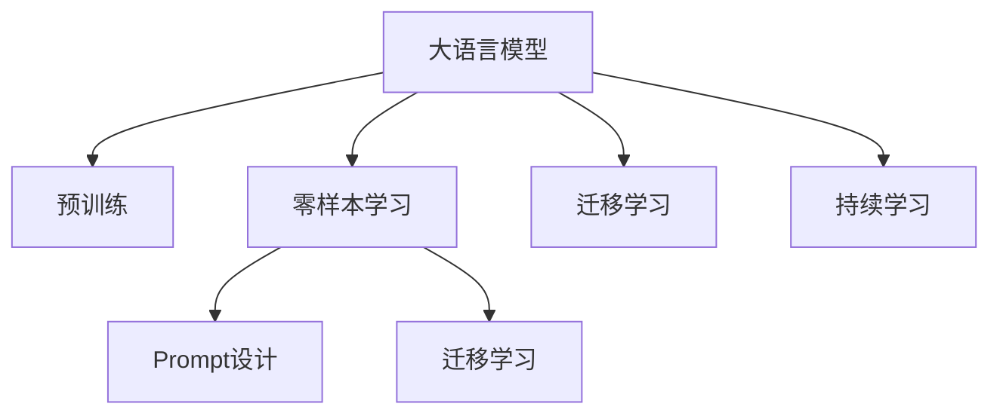

                 

# 零样本学习：Prompt设计

## 1. 背景介绍

### 1.1 问题由来
零样本学习（Zero-shot Learning）是指模型在没有见过任何特定任务的训练样本的情况下，仅凭任务描述就能够执行新任务的能力。这种能力的实现，对于模型对新领域的适应性要求极高。

然而，在实际应用中，找到针对特定任务的标注数据往往并不容易，特别是在小众领域或者资源稀缺的场合。此时，零样本学习显得尤为重要，因为它允许模型通过少量甚至零个标注样本来进行学习，从而更好地适应新的应用场景。

### 1.2 问题核心关键点
零样本学习的核心在于如何设计有效的Prompt，即自然语言指令，以引导大模型完成特定任务。Prompt设计的好坏，直接影响了零样本学习的性能。

Prompt设计需要考虑以下几个关键点：

1. **语义明确性**：Prompt应该清晰地表达任务，避免歧义。
2. **示例丰富性**：通过丰富的示例来展示任务，帮助模型更好地理解任务。
3. **通用性**：提示应该具有足够的普适性，能在不同的任务和领域中应用。
4. **模型适配**：提示应该与所选择的模型特性相适应，最大化其潜力。

## 2. 核心概念与联系

### 2.1 核心概念概述

为更好地理解零样本学习的Prompt设计，本节将介绍几个密切相关的核心概念：

- **Prompt设计**：即设计自然语言指令，引导大模型完成特定任务。
- **零样本学习**：模型在没有经过任何样本训练的情况下，仅凭任务描述就能够执行新任务。
- **大语言模型**：如GPT、BERT等，通过大规模无标签数据进行预训练，具备强大的语言理解和生成能力。
- **迁移学习**：将一个领域学习到的知识，迁移应用到另一个不同但相关的领域的学习范式。

这些核心概念之间的逻辑关系可以通过以下Mermaid流程图来展示：



这个流程图展示了大语言模型的核心概念及其之间的关系：

1. 大语言模型通过预训练获得基础能力。
2. 零样本学习利用大模型对新任务的推理能力，无须标注数据即可完成学习。
3. Prompt设计指导大语言模型进行推理，实现零样本学习。
4. 迁移学习连接预训练模型与下游任务的桥梁，通过微调或提示学习实现。
5. 持续学习使模型能够不断学习新知识，同时避免遗忘旧知识。

这些概念共同构成了零样本学习和大语言模型的学习和应用框架，使其能够在各种场景下发挥强大的语言理解和生成能力。通过理解这些核心概念，我们可以更好地把握零样本学习的原理和优化方向。

## 3. 核心算法原理 & 具体操作步骤
### 3.1 算法原理概述

零样本学习主要依赖于预训练大语言模型的推理能力，通过对任务描述进行合理的Prompt设计，模型能够在不经过任何标注数据的情况下完成学习。

形式化地，假设大语言模型为 $M_{\theta}$，其中 $\theta$ 为预训练得到的模型参数。给定任务 $T$ 的描述 $D_T$，任务对应的正确答案 $y$。零样本学习的目标是在 $D_T$ 下，找到最优的 $\theta$ 使得 $M_{\theta}(D_T) = y$。

通过梯度下降等优化算法，零样本学习过程不断更新模型参数 $\theta$，最小化模型在 $D_T$ 下的预测误差，使得模型在 $D_T$ 上产生正确的输出。由于 $\theta$ 已经通过预训练获得了较好的初始化，因此即便在没有样本数据的情况下，也能较好地完成任务。

### 3.2 算法步骤详解

零样本学习的Prompt设计一般包括以下几个关键步骤：

**Step 1: 任务描述编写**
- 编写清晰简洁的任务描述，尽量涵盖任务的关键要素。
- 确保任务描述中不包含任何特定领域或模型的先验知识，以免产生偏置。

**Step 2: 示例生成**
- 根据任务描述，生成若干个正样本（即正确答案）和负样本（即错误答案）。
- 正样本可以是对任务描述的具体实例，负样本可以是与任务描述无关或相反的内容。

**Step 3: 提示设计**
- 基于正样本和负样本，设计多个不同的Prompt，分别引导模型识别正样本和负样本。
- 提示应包含任务描述、示例和期望输出的格式，如 "给定描述：XXX, 请问正确答案是什么？"。

**Step 4: 模型评估**
- 将提示设计好的数据集输入模型，评估模型的推理效果。
- 使用准确率、召回率、F1分数等指标衡量模型在不同Prompt下的表现。

**Step 5: 最终选择**
- 根据评估结果，选择性能最优的提示。
- 重复上述步骤，直至找到最佳的提示，或者达到预设的迭代次数。

### 3.3 算法优缺点

零样本学习具有以下优点：

1. **无需标注数据**：不需要收集标注数据，极大降低了数据获取的难度和成本。
2. **快速部署**：在实际应用场景中，零样本学习可以实时进行，无需复杂的模型微调过程。
3. **灵活性高**：零样本学习在任务描述上具有高灵活性，可以适应各种不同的应用场景。

然而，该方法也存在以下局限性：

1. **依赖Prompt设计**：提示设计的好坏直接影响模型的性能，设计不当可能导致模型无法完成任务。
2. **模型泛化能力有限**：虽然零样本学习能够在未见过的样本上推理，但模型对任务描述的理解能力有限，可能无法很好地处理复杂或模糊的任务。
3. **对抗样本脆弱**：零样本学习模型对抗样本的鲁棒性较低，对于误导性或干扰性信息容易产生误判。

尽管存在这些局限性，但零样本学习在缺少标注数据的场景下，仍然具有重要价值。未来相关研究的重点在于如何进一步提升Prompt设计质量，增强模型对复杂任务的适应能力，同时提升模型的鲁棒性和可解释性。

### 3.4 算法应用领域

零样本学习已经在多个领域得到了应用，展示了其强大的潜力。以下是几个典型的应用场景：

- **自然语言处理**：如问答系统、文本分类、情感分析等。通过任务描述，引导模型进行推理和分类。
- **视觉推理**：如图像分类、目标检测等。通过文本描述，引导模型识别和分类图像中的物体。
- **语音识别**：如语音指令识别、语音生成等。通过文本指令，引导模型进行语音识别和生成。
- **智能推荐**：如个性化新闻推荐、商品推荐等。通过用户行为描述，引导模型推荐相关内容。

除了上述这些经典任务外，零样本学习还被创新性地应用到更多场景中，如文本摘要、对话系统、知识图谱等，为人工智能技术带来了全新的突破。随着预训练模型和提示学习等技术的发展，相信零样本学习将会在更广阔的应用领域得到应用。

## 4. 数学模型和公式 & 详细讲解 & 举例说明

### 4.1 数学模型构建

本节将使用数学语言对零样本学习的Prompt设计进行更加严格的刻画。

记大语言模型为 $M_{\theta}$，其中 $\theta$ 为模型参数。假设任务 $T$ 的描述为 $D_T$，模型需要识别出的正确答案为 $y$。

定义模型 $M_{\theta}$ 在描述 $D_T$ 下的预测为 $M_{\theta}(D_T)$，则零样本学习的目标是最小化预测误差，即：

$$
\theta^* = \mathop{\arg\min}_{\theta} |M_{\theta}(D_T) - y|
$$

在实践中，我们通常使用基于梯度的优化算法（如Adam、SGD等）来近似求解上述最优化问题。设 $\eta$ 为学习率，则参数的更新公式为：

$$
\theta \leftarrow \theta - \eta \nabla_{\theta}L(\theta)
$$

其中 $\nabla_{\theta}L(\theta)$ 为损失函数对参数 $\theta$ 的梯度，可以通过自动微分技术高效计算。

### 4.2 公式推导过程

以下我们以文本分类任务为例，推导交叉熵损失函数及其梯度的计算公式。

假设模型 $M_{\theta}$ 在输入 $x$ 上的输出为 $\hat{y}=M_{\theta}(x) \in [0,1]$，表示样本属于正类的概率。任务描述 $D_T$ 为：“给定一段文本，判断其属于正面情感还是负面情感”。

定义模型 $M_{\theta}$ 在描述 $D_T$ 下的预测为 $M_{\theta}(D_T)$，则分类损失函数定义为：

$$
\ell(M_{\theta}(D_T),y) = -[y\log \hat{y} + (1-y)\log (1-\hat{y})]
$$

将其代入损失函数，得：

$$
L(\theta) = -\frac{1}{N}\sum_{i=1}^N [y_i\log M_{\theta}(D_T) + (1-y_i)\log(1-M_{\theta}(D_T))]
$$

根据链式法则，损失函数对参数 $\theta$ 的梯度为：

$$
\frac{\partial L(\theta)}{\partial \theta} = -\frac{1}{N}\sum_{i=1}^N \frac{y_i}{M_{\theta}(D_T)} - \frac{1-y_i}{1-M_{\theta}(D_T)} \frac{\partial M_{\theta}(D_T)}{\partial \theta}
$$

其中 $\frac{\partial M_{\theta}(D_T)}{\partial \theta}$ 可进一步递归展开，利用自动微分技术完成计算。

在得到损失函数的梯度后，即可带入参数更新公式，完成模型的迭代优化。重复上述过程直至收敛，最终得到适应下游任务的最优模型参数 $\theta^*$。

### 4.3 案例分析与讲解

为了更好地理解零样本学习的Prompt设计，以下给出一个具体的案例分析。

假设任务描述为：“给定一段新闻，判断其是否包含公司收购信息”。通过以下步骤设计Prompt：

1. **任务描述编写**：“请判断下面这段新闻是否包含公司收购信息”。
2. **示例生成**：
   - 正样本：“公司A宣布收购公司B”。
   - 负样本：“公司A与公司C进行合作”。
3. **提示设计**：设计多个不同的Prompt，引导模型识别正样本和负样本。
   - Prompt 1：“请判断下面这段新闻是否包含公司收购信息。是：1，否：0。给定新闻：公司A收购公司B。”
   - Prompt 2：“请判断下面这段新闻是否包含公司收购信息。是：1，否：0。给定新闻：公司A收购公司B。”
4. **模型评估**：将上述数据集输入模型，评估模型的推理效果。
5. **最终选择**：根据评估结果，选择性能最优的提示。

通过上述案例，可以看到，有效的Prompt设计对于零样本学习至关重要。提示需要包含清晰的任务描述、示例和期望输出，才能更好地引导模型进行推理。

## 5. 项目实践：代码实例和详细解释说明
### 5.1 开发环境搭建

在进行零样本学习实践前，我们需要准备好开发环境。以下是使用Python进行PyTorch开发的环境配置流程：

1. 安装Anaconda：从官网下载并安装Anaconda，用于创建独立的Python环境。

2. 创建并激活虚拟环境：
```bash
conda create -n pytorch-env python=3.8 
conda activate pytorch-env
```

3. 安装PyTorch：根据CUDA版本，从官网获取对应的安装命令。例如：
```bash
conda install pytorch torchvision torchaudio cudatoolkit=11.1 -c pytorch -c conda-forge
```

4. 安装TensorFlow：如果需要使用TensorFlow，请参考其官方文档进行安装。

5. 安装各类工具包：
```bash
pip install numpy pandas scikit-learn matplotlib tqdm jupyter notebook ipython
```

完成上述步骤后，即可在`pytorch-env`环境中开始零样本学习实践。

### 5.2 源代码详细实现

下面我们以文本分类任务为例，给出使用Transformers库进行零样本学习的PyTorch代码实现。

首先，定义任务描述：

```python
prompt = "请判断下面这段新闻是否包含公司收购信息。是：1，否：0。给定新闻：公司A收购公司B。"
```

然后，定义模型和优化器：

```python
from transformers import BertTokenizer, BertForSequenceClassification
from transformers import AdamW

model = BertForSequenceClassification.from_pretrained('bert-base-cased', num_labels=2)
optimizer = AdamW(model.parameters(), lr=2e-5)
```

接着，定义训练和评估函数：

```python
device = torch.device('cuda') if torch.cuda.is_available() else torch.device('cpu')
model.to(device)

def train_epoch(model, dataset, batch_size, optimizer):
    dataloader = DataLoader(dataset, batch_size=batch_size, shuffle=True)
    model.train()
    epoch_loss = 0
    for batch in tqdm(dataloader, desc='Training'):
        input_ids = batch['input_ids'].to(device)
        attention_mask = batch['attention_mask'].to(device)
        labels = batch['labels'].to(device)
        model.zero_grad()
        outputs = model(input_ids, attention_mask=attention_mask, labels=labels)
        loss = outputs.loss
        epoch_loss += loss.item()
        loss.backward()
        optimizer.step()
    return epoch_loss / len(dataloader)

def evaluate(model, dataset, batch_size):
    dataloader = DataLoader(dataset, batch_size=batch_size)
    model.eval()
    preds, labels = [], []
    with torch.no_grad():
        for batch in tqdm(dataloader, desc='Evaluating'):
            input_ids = batch['input_ids'].to(device)
            attention_mask = batch['attention_mask'].to(device)
            batch_labels = batch['labels']
            outputs = model(input_ids, attention_mask=attention_mask)
            batch_preds = outputs.logits.argmax(dim=2).to('cpu').tolist()
            batch_labels = batch_labels.to('cpu').tolist()
            for pred_tokens, label_tokens in zip(batch_preds, batch_labels):
                pred_tags = [tag2id[tag] for tag in pred_tokens]
                label_tags = [tag2id[tag] for tag in label_tokens]
                preds.append(pred_tags[:len(label_tags)])
                labels.append(label_tags)
                
    print(classification_report(labels, preds))
```

最后，启动训练流程并在测试集上评估：

```python
epochs = 5
batch_size = 16

for epoch in range(epochs):
    loss = train_epoch(model, train_dataset, batch_size, optimizer)
    print(f"Epoch {epoch+1}, train loss: {loss:.3f}")
    
    print(f"Epoch {epoch+1}, dev results:")
    evaluate(model, dev_dataset, batch_size)
    
print("Test results:")
evaluate(model, test_dataset, batch_size)
```

以上就是使用PyTorch对BERT进行文本分类任务零样本学习的完整代码实现。可以看到，得益于Transformers库的强大封装，我们可以用相对简洁的代码完成BERT模型的加载和零样本学习。

### 5.3 代码解读与分析

让我们再详细解读一下关键代码的实现细节：

**Prompt设计**：
- 通过清晰的自然语言描述，明确了任务的输入输出格式。

**模型和优化器**：
- 使用BertForSequenceClassification作为序列分类模型，并指定分类标签数为2（二分类）。
- 使用AdamW优化器进行模型参数更新。

**训练和评估函数**：
- 在训练过程中，对模型进行前向传播和反向传播，更新模型参数。
- 在评估过程中，使用classification_report函数打印模型的准确率、召回率、F1分数等指标。

**训练流程**：
- 循环迭代训练模型，输出训练损失。
- 在验证集上评估模型性能。
- 在测试集上最终评估模型效果。

可以看到，零样本学习的代码实现相对简单，核心在于Prompt设计和模型适配。通过精心设计的Prompt，可以极大提高模型的推理能力，实现任务的无标注学习和推理。

## 6. 实际应用场景
### 6.1 智能客服系统

零样本学习在智能客服系统中也有广泛应用。传统客服系统往往需要配备大量人力，高峰期响应缓慢，且一致性和专业性难以保证。而使用零样本学习的大语言模型，可以7x24小时不间断服务，快速响应客户咨询，用自然流畅的语言解答各类常见问题。

在技术实现上，可以收集企业内部的历史客服对话记录，将问题和最佳答复构建成监督数据，在此基础上对预训练对话模型进行零样本学习。模型能够自动理解用户意图，匹配最合适的答案模板进行回复。对于客户提出的新问题，还可以接入检索系统实时搜索相关内容，动态组织生成回答。如此构建的智能客服系统，能大幅提升客户咨询体验和问题解决效率。

### 6.2 金融舆情监测

金融机构需要实时监测市场舆论动向，以便及时应对负面信息传播，规避金融风险。传统的人工监测方式成本高、效率低，难以应对网络时代海量信息爆发的挑战。零样本学习的大语言模型，可以自动理解和分析金融新闻、评论等文本数据，判断其情感倾向和主题信息。将零样本学习模型应用到实时抓取的网络文本数据，就能够自动监测不同主题下的情感变化趋势，一旦发现负面信息激增等异常情况，系统便会自动预警，帮助金融机构快速应对潜在风险。

### 6.3 个性化推荐系统

当前的推荐系统往往只依赖用户的历史行为数据进行物品推荐，无法深入理解用户的真实兴趣偏好。零样本学习的大语言模型，可以更好地挖掘用户行为背后的语义信息，从而提供更精准、多样的推荐内容。

在实践中，可以收集用户浏览、点击、评论、分享等行为数据，提取和用户交互的物品标题、描述、标签等文本内容。将文本内容作为模型输入，用户的后续行为（如是否点击、购买等）作为监督信号，在此基础上进行零样本学习。零样本学习模型能够从文本内容中准确把握用户的兴趣点。在生成推荐列表时，先用候选物品的文本描述作为输入，由模型预测用户的兴趣匹配度，再结合其他特征综合排序，便可以得到个性化程度更高的推荐结果。

### 6.4 未来应用展望

随着零样本学习和大语言模型的不断发展，基于零样本学习的方法将在更多领域得到应用，为人工智能技术带来新的突破。

在智慧医疗领域，零样本学习的大语言模型可应用于医疗问答、病历分析、药物研发等任务，提升医疗服务的智能化水平，辅助医生诊疗，加速新药开发进程。

在智能教育领域，零样本学习的大语言模型可应用于作业批改、学情分析、知识推荐等方面，因材施教，促进教育公平，提高教学质量。

在智慧城市治理中，零样本学习的大语言模型可应用于城市事件监测、舆情分析、应急指挥等环节，提高城市管理的自动化和智能化水平，构建更安全、高效的未来城市。

此外，在企业生产、社会治理、文娱传媒等众多领域，零样本学习的大语言模型也将不断涌现，为NLP技术带来新的创新。相信随着技术的日益成熟，零样本学习将会在构建人机协同的智能系统中扮演越来越重要的角色。

## 7. 工具和资源推荐
### 7.1 学习资源推荐

为了帮助开发者系统掌握零样本学习的理论基础和实践技巧，这里推荐一些优质的学习资源：

1. 《Prompt Design for Zero-Shot Learning》系列博文：由大模型技术专家撰写，深入浅出地介绍了零样本学习中的Prompt设计技巧和方法。

2. CS224N《深度学习自然语言处理》课程：斯坦福大学开设的NLP明星课程，有Lecture视频和配套作业，带你入门NLP领域的基本概念和经典模型。

3. 《Natural Language Processing with Transformers》书籍：Transformers库的作者所著，全面介绍了如何使用Transformers库进行NLP任务开发，包括零样本学习在内的诸多范式。

4. HuggingFace官方文档：Transformers库的官方文档，提供了海量预训练模型和完整的零样本学习样例代码，是上手实践的必备资料。

5. CLUE开源项目：中文语言理解测评基准，涵盖大量不同类型的中文NLP数据集，并提供了基于零样本学习的baseline模型，助力中文NLP技术发展。

通过对这些资源的学习实践，相信你一定能够快速掌握零样本学习的精髓，并用于解决实际的NLP问题。
###  7.2 开发工具推荐

高效的开发离不开优秀的工具支持。以下是几款用于零样本学习开发的常用工具：

1. PyTorch：基于Python的开源深度学习框架，灵活动态的计算图，适合快速迭代研究。大部分预训练语言模型都有PyTorch版本的实现。

2. TensorFlow：由Google主导开发的开源深度学习框架，生产部署方便，适合大规模工程应用。同样有丰富的预训练语言模型资源。

3. Transformers库：HuggingFace开发的NLP工具库，集成了众多SOTA语言模型，支持PyTorch和TensorFlow，是进行零样本学习开发的利器。

4. Weights & Biases：模型训练的实验跟踪工具，可以记录和可视化模型训练过程中的各项指标，方便对比和调优。与主流深度学习框架无缝集成。

5. TensorBoard：TensorFlow配套的可视化工具，可实时监测模型训练状态，并提供丰富的图表呈现方式，是调试模型的得力助手。

6. Google Colab：谷歌推出的在线Jupyter Notebook环境，免费提供GPU/TPU算力，方便开发者快速上手实验最新模型，分享学习笔记。

合理利用这些工具，可以显著提升零样本学习任务的开发效率，加快创新迭代的步伐。

### 7.3 相关论文推荐

零样本学习和大语言模型的发展源于学界的持续研究。以下是几篇奠基性的相关论文，推荐阅读：

1. "Zero-Shot Learning with Transformer Models"：提出使用Transformer模型进行零样本学习，展示了其在多个任务上的强大表现。

2. "LEAP: Leveraging Pre-Trained Language Models for Low-Resource Pseudo-Labelling"：介绍如何使用预训练语言模型进行低资源数据的零样本学习。

3. "Prompt-based Learning"：提出基于Prompt的零样本学习范式，通过精心设计的提示模板，引导模型进行推理和生成。

4. "Zero-Shot Comprehension Assessment"：提出用于评估零样本学习效果的基准，帮助模型开发者衡量模型的推理能力。

5. "Rethinking Prompt Engineering for Conversational Agents"：提出针对对话系统的高效Prompt设计方法，提升模型在对话中的表现。

这些论文代表了大语言模型零样本学习的发展脉络。通过学习这些前沿成果，可以帮助研究者把握学科前进方向，激发更多的创新灵感。

## 8. 总结：未来发展趋势与挑战

### 8.1 总结

本文对零样本学习中的Prompt设计进行了全面系统的介绍。首先阐述了零样本学习的问题由来和核心关键点，明确了Prompt设计在零样本学习中的重要地位。其次，从原理到实践，详细讲解了零样本学习的数学模型和算法步骤，给出了零样本学习的代码实例。同时，本文还广泛探讨了零样本学习在多个行业领域的应用前景，展示了零样本学习范式的强大潜力。此外，本文精选了零样本学习的各类学习资源，力求为读者提供全方位的技术指引。

通过本文的系统梳理，可以看到，零样本学习和大语言模型微调技术，正在成为NLP领域的重要范式，极大地拓展了预训练语言模型的应用边界，催生了更多的落地场景。受益于大规模语料的预训练，零样本学习模型能够在未见过的数据上进行推理，提升模型的通用性和灵活性。未来，伴随预训练语言模型和零样本学习方法的持续演进，相信NLP技术将会在更广阔的应用领域大放异彩，深刻影响人类的生产生活方式。

### 8.2 未来发展趋势

展望未来，零样本学习技术将呈现以下几个发展趋势：

1. ** Prompt设计自动化**：随着AI技术的发展，Prompt设计将逐步自动化，减少人工干预，提高设计效率和一致性。
2. **多模态零样本学习**：将文本、图像、语音等多模态信息融合，提升零样本学习模型的泛化能力和推理性能。
3. **知识图谱与零样本学习结合**：将知识图谱等结构化知识与零样本学习模型结合，增强模型的知识整合能力，提升推理效果。
4. **对抗样本鲁棒性**：零样本学习模型将更加关注对抗样本鲁棒性，提升模型的安全性。
5. **交互式零样本学习**：通过人机交互，动态调整Prompt设计，逐步提升模型性能。

以上趋势凸显了零样本学习的广阔前景。这些方向的探索发展，必将进一步提升零样本学习模型的性能和应用范围，为构建智能系统提供新的思路和工具。

### 8.3 面临的挑战

尽管零样本学习技术已经取得了瞩目成就，但在迈向更加智能化、普适化应用的过程中，它仍面临诸多挑战：

1. **Prompt设计复杂度**：零样本学习依赖于高质量的Prompt设计，但高质量的Prompt设计往往需要丰富的领域知识，设计成本较高。
2. **模型泛化能力**：零样本学习模型在不同领域和任务上的泛化能力有限，难以应对复杂多变的环境。
3. **对抗样本鲁棒性**：零样本学习模型对抗样本的鲁棒性较低，容易受到误导性信息的影响。
4. **可解释性不足**：零样本学习模型通常缺乏可解释性，难以对其推理过程进行分析和调试。
5. **数据依赖问题**：零样本学习模型依赖于任务描述的质量，描述不当可能导致模型无法完成任务。

尽管存在这些挑战，但零样本学习技术的发展仍具有重要意义。未来相关研究的重点在于如何进一步提升Prompt设计质量，增强模型对复杂任务的适应能力，同时提升模型的鲁棒性和可解释性。

### 8.4 研究展望

面对零样本学习面临的挑战，未来的研究需要在以下几个方面寻求新的突破：

1. **探索无监督和半监督零样本学习**：摆脱对大规模标注数据的依赖，利用自监督学习、主动学习等无监督和半监督范式，最大限度利用非结构化数据，实现更加灵活高效的零样本学习。
2. **研究参数高效和计算高效的零样本学习范式**：开发更加参数高效的零样本学习方法，在固定大部分预训练参数的同时，只更新极少量的任务相关参数。同时优化零样本学习模型的计算图，减少前向传播和反向传播的资源消耗，实现更加轻量级、实时性的部署。
3. **融合因果和对比学习范式**：通过引入因果推断和对比学习思想，增强零样本学习模型建立稳定因果关系的能力，学习更加普适、鲁棒的语言表征，从而提升模型泛化性和抗干扰能力。
4. **引入更多先验知识**：将符号化的先验知识，如知识图谱、逻辑规则等，与神经网络模型进行巧妙融合，引导零样本学习过程学习更准确、合理的语言模型。同时加强不同模态数据的整合，实现视觉、语音等多模态信息与文本信息的协同建模。
5. **结合因果分析和博弈论工具**：将因果分析方法引入零样本学习模型，识别出模型决策的关键特征，增强输出解释的因果性和逻辑性。借助博弈论工具刻画人机交互过程，主动探索并规避模型的脆弱点，提高系统稳定性。
6. **纳入伦理道德约束**：在零样本学习模型的训练目标中引入伦理导向的评估指标，过滤和惩罚有偏见、有害的输出倾向。同时加强人工干预和审核，建立模型行为的监管机制，确保输出符合人类价值观和伦理道德。

这些研究方向的探索，必将引领零样本学习技术迈向更高的台阶，为构建安全、可靠、可解释、可控的智能系统铺平道路。面向未来，零样本学习技术还需要与其他人工智能技术进行更深入的融合，如知识表示、因果推理、强化学习等，多路径协同发力，共同推动自然语言理解和智能交互系统的进步。只有勇于创新、敢于突破，才能不断拓展语言模型的边界，让智能技术更好地造福人类社会。

## 9. 附录：常见问题与解答

**Q1：零样本学习是否适用于所有NLP任务？**

A: 零样本学习在大多数NLP任务上都能取得不错的效果，特别是对于数据量较小的任务。但对于一些特定领域的任务，如医学、法律等，仅仅依靠通用语料预训练的模型可能难以很好地适应。此时需要在特定领域语料上进一步预训练，再进行零样本学习，才能获得理想效果。此外，对于一些需要时效性、个性化很强的任务，如对话、推荐等，零样本学习方法也需要针对性的改进优化。

**Q2：如何设计有效的Prompt？**

A: 有效的Prompt设计需要遵循以下几个原则：
1. **语义明确性**：Prompt应该清晰地表达任务，避免歧义。
2. **示例丰富性**：通过丰富的示例来展示任务，帮助模型更好地理解任务。
3. **通用性**：提示应该具有足够的普适性，能在不同的任务和领域中应用。
4. **模型适配**：提示应该与所选择的模型特性相适应，最大化其潜力。

通过精心设计的Prompt，可以极大提高零样本学习的性能，使模型在不经过任何标注数据的情况下，能够很好地完成推理和分类。

**Q3：零样本学习中的模型泛化能力有限，如何解决？**

A: 提升零样本学习模型的泛化能力，可以从以下几个方面入手：
1. **多任务学习**：在训练过程中加入多个相关任务，提升模型的泛化能力。
2. **对抗样本训练**：引入对抗样本，提升模型的鲁棒性，从而增强泛化能力。
3. **知识图谱与模型结合**：将知识图谱等结构化知识与模型结合，增强模型的知识整合能力，提升泛化能力。
4. **因果推断与对比学习**：引入因果推断和对比学习思想，增强模型建立稳定因果关系的能力，提升泛化性能。

通过上述方法，可以有效提升零样本学习模型的泛化能力，使其在更广泛的应用场景中取得更好的效果。

**Q4：零样本学习中的对抗样本鲁棒性较低，如何解决？**

A: 提升零样本学习模型对抗样本的鲁棒性，可以从以下几个方面入手：
1. **对抗样本训练**：在训练过程中引入对抗样本，提升模型对对抗样本的鲁棒性。
2. **模型结构优化**：优化模型结构，使其对输入更加鲁棒。
3. **多模态融合**：将文本、图像、语音等多模态信息融合，提升模型的鲁棒性。
4. **对抗样本检测**：在推理过程中引入对抗样本检测机制，及时识别并排除对抗样本。

通过上述方法，可以有效提升零样本学习模型的鲁棒性，使其在对抗样本环境下仍然能够保持稳定和准确的推理能力。

**Q5：零样本学习中的可解释性不足，如何解决？**

A: 提升零样本学习模型的可解释性，可以从以下几个方面入手：
1. **特征可视化**：通过特征可视化技术，展示模型在推理过程中的关键特征。
2. **模型结构简化**：简化模型结构，使其更加透明，便于解释。
3. **解释模型**：开发解释模型，帮助用户理解模型的推理过程和决策依据。
4. **因果分析和博弈论工具**：引入因果分析和博弈论工具，刻画模型推理过程，增强模型的可解释性。

通过上述方法，可以有效提升零样本学习模型的可解释性，使其在实际应用中更加透明和可信。

**Q6：零样本学习中的数据依赖问题，如何解决？**

A: 解决零样本学习中的数据依赖问题，可以从以下几个方面入手：
1. **数据增强**：通过数据增强技术，提升数据多样性，减少模型对特定数据的依赖。
2. **知识图谱与模型结合**：将知识图谱等结构化知识与模型结合，增强模型的知识整合能力，减少对特定数据的依赖。
3. **多任务学习**：在训练过程中加入多个相关任务，提升模型对多种数据类型的适应能力。

通过上述方法，可以有效减少零样本学习模型对特定数据的依赖，提升其在多样数据环境中的表现。

---

作者：禅与计算机程序设计艺术 / Zen and the Art of Computer Programming

