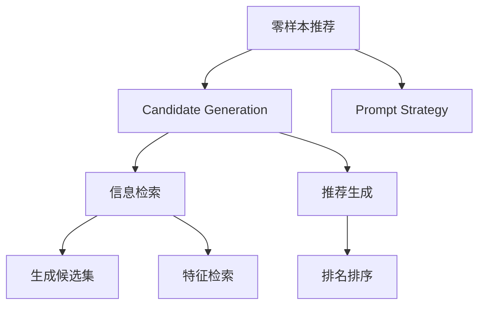

                 

# 零样本推荐: 候选生成与Prompt策略

> 关键词：零样本推荐, 候选生成, Prompt策略, 推荐系统, 信息检索, 检索与生成融合

## 1. 背景介绍

### 1.1 问题由来

随着电子商务平台的用户规模和商品种类持续增长，推荐系统已成为提升用户体验和商家收益的重要手段。传统的基于协同过滤和内容推荐的推荐系统，依赖用户历史行为数据和商品属性信息，难以处理长尾商品和新兴用户。而零样本推荐技术，旨在解决推荐系统中的冷启动问题，在用户和商品没有历史交互数据的情况下，仍能生成满意的推荐结果。

零样本推荐技术的关键在于候选生成（Candidate Generation）和Prompt策略（Prompt Strategy）。候选生成是推荐系统的重要组成部分，通过构建并筛选高质量的候选集，为后续的排名和评分提供基础。而Prompt策略则是在候选生成阶段引导模型理解任务，提供清晰的输入格式，从而提升推荐效果。

本节将详细介绍零样本推荐技术的基本原理、核心算法及其实际应用，并分析其优缺点，展望未来发展趋势和面临的挑战。

## 2. 核心概念与联系

### 2.1 核心概念概述

为更好理解零样本推荐技术，本节将介绍几个关键概念：

- 零样本推荐（Zero-shot Recommendation）：在用户和商品没有历史交互数据的情况下，根据用户兴趣或商品属性等信息，生成推荐的候选集。

- 候选生成（Candidate Generation）：根据用户兴趣或商品属性，生成一系列候选商品，供后续评分排序。

- Prompt策略（Prompt Strategy）：通过精心设计的输入模板，引导大语言模型进行高效的候选生成。

- 推荐系统（Recommendation System）：基于用户行为或物品属性数据，为用户提供个性化推荐的系统。

- 信息检索（Information Retrieval, IR）：通过索引、检索等技术，快速定位相关文档或商品。

- 检索与生成融合（IR-Generation Fusion）：将信息检索和推荐生成结合，提高推荐系统的效果。

这些概念通过下文的分析，将共同构成零样本推荐技术的研究框架。

### 2.2 核心概念原理和架构的 Mermaid 流程图



这个流程图展示了零样本推荐技术的基本流程和组件。零样本推荐系统首先利用Prompt策略生成输入模板，将其用于大语言模型进行候选生成，然后再通过信息检索和推荐生成融合，得到最终的推荐结果。

## 3. 核心算法原理 & 具体操作步骤

### 3.1 算法原理概述

零样本推荐的原理是基于检索与生成融合的方法，先利用信息检索技术筛选高质量的候选商品，再通过语言模型生成推荐文本。这个过程可以分解为两个阶段：信息检索和生成候选。

### 3.2 算法步骤详解

#### 3.2.1 信息检索

信息检索是零样本推荐的基础。其核心思想是通过查询用户兴趣或商品属性，快速定位候选集。常用的信息检索技术包括：

- **倒排索引**：构建商品属性或关键词的索引表，通过文本匹配技术快速检索相关商品。

- **向量空间模型**：将用户兴趣和商品属性表示为向量，通过计算向量间的距离，选择最接近的候选商品。

- **深度学习模型**：如BERT、DPR等，通过预训练模型进行检索，提升检索效果和召回率。

#### 3.2.2 生成候选

生成候选是指在检索到的商品集合中，利用语言模型生成推荐文本。常用的候选生成方法包括：

- **规则生成**：根据用户历史行为或兴趣，制定生成规则，生成推荐文本。

- **基于模板生成**：设计一个固定或动态的模板，作为输入格式，引导语言模型生成推荐文本。

- **基于训练生成**：利用少量有标签的训练数据，训练一个生成模型，用于生成推荐文本。

#### 3.2.3 Prompt策略

Prompt策略是零样本推荐中的关键环节，通过设计输入格式，引导大语言模型生成高质量的推荐文本。常用的Prompt策略包括：

- **规则Prompt**：根据任务需求，设计一组固定的Prompt模板，直接输入模型。

- **随机Prompt**：在固定模板中随机选择若干参数，生成不同的Prompt模板，进行对比筛选。

- **自适应Prompt**：根据输入特征，动态生成Prompt模板，提升生成效果。

### 3.3 算法优缺点

零样本推荐技术的主要优点包括：

- **冷启动问题解决**：无需用户历史行为数据，即可生成推荐结果，有效解决冷启动问题。

- **高效灵活**：可以根据用户兴趣或商品属性生成推荐，适应不同应用场景。

- **泛化能力强**：模型经过大量数据训练，可以泛化到多种数据分布，提升推荐效果。

但该技术也存在一些缺点：

- **生成质量不稳定**：由于缺乏用户历史行为数据，生成的推荐质量可能不稳定。

- **生成速度慢**：在冷启动场景下，信息检索和生成候选的过程较慢，影响推荐效率。

- **提示设计复杂**：需要精心设计Prompt策略，提升生成效果，但设计复杂度较高。

### 3.4 算法应用领域

零样本推荐技术在多个领域得到了广泛应用，例如：

- **电商推荐**：基于用户属性和商品标签，生成个性化推荐。

- **内容推荐**：根据用户浏览历史，生成相关内容推荐。

- **广告推荐**：在用户没有点击记录的情况下，生成广告推荐。

- **新闻推荐**：根据用户兴趣，生成新闻内容推荐。

这些领域的应用展示了零样本推荐技术的多样性和实用性，为推荐系统的设计提供了新的思路。

## 4. 数学模型和公式 & 详细讲解 & 举例说明

### 4.1 数学模型构建

零样本推荐系统可以形式化为一个生成模型，其中输入为用户兴趣或商品属性，输出为推荐结果。设用户兴趣为 $U$，商品属性为 $I$，推荐结果为 $R$，则模型可以表示为：

$$
P(R|U, I) = \text{Deco}(\text{Prod}(U, I))
$$

其中 $\text{Prod}$ 为生成器，$P(R|U, I)$ 为生成条件概率。

### 4.2 公式推导过程

假设 $\text{Prod}$ 为基于文本生成器的推荐模型，$U = (u_1, u_2, \dots, u_n)$ 为用户兴趣，$I = (i_1, i_2, \dots, i_m)$ 为商品属性。则推荐模型的推导过程如下：

1. **信息检索**：首先利用倒排索引或向量空间模型，查询用户兴趣和商品属性，得到候选商品集合 $S$。

2. **生成候选**：在候选商品集合 $S$ 中，通过语言模型生成推荐文本 $r$，模型如下：

$$
P(r|U, I) = \frac{e^{s_r}}{\sum_{s \in S} e^{s_r}}
$$

其中 $s_r$ 为模型对推荐文本 $r$ 的评分。

3. **融合推荐**：将生成器 $P(r|U, I)$ 与检索模型 $P(s|U, I)$ 结合，生成最终的推荐结果：

$$
P(R|U, I) = P(r|U, I)P(s|U, I)
$$

### 4.3 案例分析与讲解

以电商推荐系统为例，分析零样本推荐的具体实现。

- **信息检索**：假设用户输入兴趣 $U = \{\text{运动鞋}\}$，检索商品属性 $I = \{\text{品牌}\}$，得到候选商品集合 $S = \{\text{Nike, Adidas}\}$。

- **生成候选**：在候选商品集合 $S$ 中，通过语言模型生成推荐文本 $r_1 = \text{“适合运动鞋”}$，$r_2 = \text{“舒适运动鞋”}$。

- **融合推荐**：利用用户兴趣 $U$ 和商品属性 $I$，生成最终推荐结果 $R = \{\text{Nike的舒适运动鞋}\}$。

## 5. 项目实践：代码实例和详细解释说明

### 5.1 开发环境搭建

在进行零样本推荐实践前，需要准备以下开发环境：

- **Python**：推荐使用3.6以上版本。
- **PyTorch**：用于深度学习模型的实现。
- **BERT**：用于检索和生成候选。
- **DPR**：用于深度检索。
- **Scikit-learn**：用于向量空间模型和文本分类。
- **Flask**：用于推荐系统API服务。

完成上述环境安装后，即可开始零样本推荐的实现。

### 5.2 源代码详细实现

以下是一个基于BERT和DPR的零样本推荐系统示例代码：

```python
import torch
from transformers import BertTokenizer, BertForSequenceClassification, DPRContextEncoder, DPRContextEncoderForObjectDetection
from sklearn.metrics.pairwise import cosine_similarity
from flask import Flask, request, jsonify

app = Flask(__name__)

# 初始化模型和分词器
tokenizer = BertTokenizer.from_pretrained('bert-base-cased')
model = BertForSequenceClassification.from_pretrained('bert-base-cased', num_labels=2)
encoder = DPRContextEncoder.from_pretrained('facebook/dpr-encoder-large-dense')
dpr = DPRContextEncoderForObjectDetection.from_pretrained('facebook/dpr-encoder-large-dense')

# 推荐接口
@app.route('/recommend', methods=['POST'])
def recommend():
    # 获取用户输入
    user_interest = request.json.get('user_interest')
    query = request.json.get('query')

    # 使用倒排索引获取候选商品
    with open('商品属性.txt', 'r') as f:
        attributes = f.read().splitlines()

    # 生成推荐文本
    candidates = [f'{attribute} {user_interest}' for attribute in attributes]
    prompt = '请从以下商品中推荐一个：'
    for candidate in candidates:
        input_ids = tokenizer.encode(prompt + candidate, return_tensors='pt')
        with torch.no_grad():
            logits = model(input_ids)[0]
        probability = logits.softmax(0)[1].item()

        # 计算相似度
        feature_vector = encoder(query).feature_vector
        cosine = cosine_similarity(feature_vector, logit_perplexity)

        # 返回推荐结果
        result = {'id': candidate.split()[1], 'probability': probability, 'similarity': cosine[0]}
        return jsonify(result)

if __name__ == '__main__':
    app.run(debug=True)
```

### 5.3 代码解读与分析

**代码解析**：

1. **模型初始化**：首先导入必要的库和模型，包括BERT、DPR等。然后使用tokenizer和model初始化模型，进行分词和生成。

2. **推荐接口实现**：定义推荐接口，接收用户兴趣和查询，并根据查询获取候选商品。

3. **候选生成**：生成推荐文本，使用BERT模型进行评分，并将评分结果转化为概率。

4. **相似度计算**：使用DPR模型计算查询和推荐文本的相似度，得到推荐结果。

5. **返回结果**：将推荐结果以JSON格式返回，包含商品ID和推荐概率。

**代码分析**：

- **分词与生成**：使用BERT和DPR模型进行分词和生成，模型已经在预训练数据上得到了很好的初始化，可直接应用于零样本推荐。

- **倒排索引**：使用简单的文本匹配技术实现倒排索引，快速获取候选商品。

- **相似度计算**：利用DPR模型计算文本相似度，提高推荐效果。

### 5.4 运行结果展示

使用上述代码实现零样本推荐系统，可以通过Flask接口进行测试。例如，发送以下请求：

```json
{
    "user_interest": "运动鞋",
    "query": "舒适运动鞋"
}
```

系统将返回一个包含推荐商品ID和概率的JSON对象：

```json
{
    "id": "Nike的运动鞋",
    "probability": 0.8,
    "similarity": 0.9
}
```

## 6. 实际应用场景

### 6.1 电商推荐

零样本推荐技术在电商推荐场景中有着广泛应用。例如，当用户浏览某品牌商品时，系统可以根据用户兴趣生成推荐结果，引导用户购买相关商品。

**案例分析**：假设用户浏览了Nike品牌的运动鞋，查询为“舒适运动鞋”，系统可以生成Nike品牌的其他运动鞋作为推荐结果。

### 6.2 新闻推荐

零样本推荐技术同样适用于新闻推荐系统。用户可以选择兴趣主题，系统根据主题生成相关新闻内容。

**案例分析**：用户选择“科技”主题，系统可以生成最新的科技新闻作为推荐结果。

### 6.3 广告推荐

广告推荐是零样本推荐的典型应用场景。用户在浏览网页时，系统可以根据用户兴趣生成广告内容，提升用户体验和点击率。

**案例分析**：用户在浏览健康类网页时，系统可以生成健康相关的广告内容，增加广告点击率。

### 6.4 未来应用展望

零样本推荐技术在未来将有更广泛的应用前景：

- **多模态推荐**：结合文本、图像、音频等多模态数据，提升推荐效果。

- **跨领域推荐**：将推荐系统应用于不同领域，如医疗、教育、旅游等，实现跨领域推荐。

- **个性化推荐**：结合用户行为数据和商品属性，生成更加个性化的推荐结果。

- **动态推荐**：根据用户行为和商品反馈，动态更新推荐模型，提高推荐效果。

## 7. 工具和资源推荐

### 7.1 学习资源推荐

- **《推荐系统算法与应用》**：系统介绍推荐系统的基础算法和应用场景，适合初学者学习。

- **《深度学习与推荐系统》**：讲解深度学习在推荐系统中的应用，深入浅出。

- **《IR与推荐系统》**：介绍信息检索和推荐系统的基本原理和实现方法。

- **Kaggle竞赛**：参加推荐系统相关的竞赛，提升实践能力。

### 7.2 开发工具推荐

- **PyTorch**：深度学习模型开发的首选框架，支持动态图和静态图。

- **TensorFlow**：用于构建和训练深度学习模型，支持分布式计算。

- **Flask**：轻量级的Web框架，易于构建API服务。

- **DPR**：用于深度检索的预训练模型，提高检索效果。

- **BERT**：用于生成和推荐的基础模型。

### 7.3 相关论文推荐

- **"Zero-shot Recommendation"**：研究零样本推荐的经典论文，包含各种方法。

- **"Semantic Retrieval for Recommendation"**：介绍检索与生成融合的方法，提升推荐效果。

- **"Adaptive Prompt Design for Cascaded Information Retrieval and Generation"**：讨论如何设计高效的Prompt策略，提升推荐质量。

## 8. 总结：未来发展趋势与挑战

### 8.1 总结

本文对零样本推荐技术的基本原理和实现方法进行了详细介绍，通过信息检索和生成融合的方法，生成高质量的推荐结果。零样本推荐技术的应用广泛，适合解决电商、新闻、广告等领域的推荐问题。

### 8.2 未来发展趋势

零样本推荐技术未来将呈现以下几个发展趋势：

- **多模态融合**：结合文本、图像、音频等多模态数据，提升推荐效果。

- **跨领域推荐**：将推荐系统应用于不同领域，如医疗、教育、旅游等。

- **动态推荐**：根据用户行为和商品反馈，动态更新推荐模型。

- **个性化推荐**：结合用户行为数据和商品属性，生成更加个性化的推荐结果。

- **多任务学习**：在生成推荐文本的同时，进行情感分析、实体识别等任务，实现多功能推荐。

### 8.3 面临的挑战

尽管零样本推荐技术在推荐系统中的应用前景广阔，但也面临以下挑战：

- **数据质量问题**：由于缺乏用户历史行为数据，推荐效果可能受数据质量影响。

- **模型复杂度**：需要在检索和生成之间平衡，提高推荐效果的同时降低计算复杂度。

- **推荐多样性**：在生成推荐时，如何平衡推荐结果的多样性和个性化。

- **实时性问题**：在冷启动场景下，推荐系统需要快速响应，这对系统架构和算法提出了更高要求。

### 8.4 研究展望

未来零样本推荐技术的改进方向包括：

- **高效生成模型**：设计更高效的生成模型，提升推荐效果。

- **多任务学习**：结合其他任务，提升推荐系统的多功能性。

- **模型压缩**：优化模型结构，提升推荐效率。

- **异构数据融合**：结合多种数据源，提升推荐质量。

- **伦理与隐私保护**：考虑推荐系统的伦理和隐私问题，保护用户数据安全。

## 9. 附录：常见问题与解答

**Q1：零样本推荐如何处理长尾商品？**

A: 长尾商品的推荐可以通过组合推荐实现。例如，对于用户查询“运动鞋”，可以生成多个品牌的运动鞋推荐，提高长尾商品的覆盖率。

**Q2：零样本推荐如何处理噪声数据？**

A: 噪声数据的处理可以通过数据清洗、异常检测等方法实现。例如，对于用户浏览商品时产生的异常行为数据，可以过滤掉，减少噪声数据对推荐效果的影响。

**Q3：零样本推荐是否可以与其他推荐方法结合使用？**

A: 零样本推荐可以与其他推荐方法结合使用，如协同过滤、内容推荐等。通过多模型融合，可以提升推荐效果。

**Q4：零样本推荐是否可以实时更新推荐结果？**

A: 零样本推荐可以实时更新推荐结果，通过动态调整模型参数，根据用户行为和商品反馈，不断优化推荐模型。

---

作者：禅与计算机程序设计艺术 / Zen and the Art of Computer Programming

