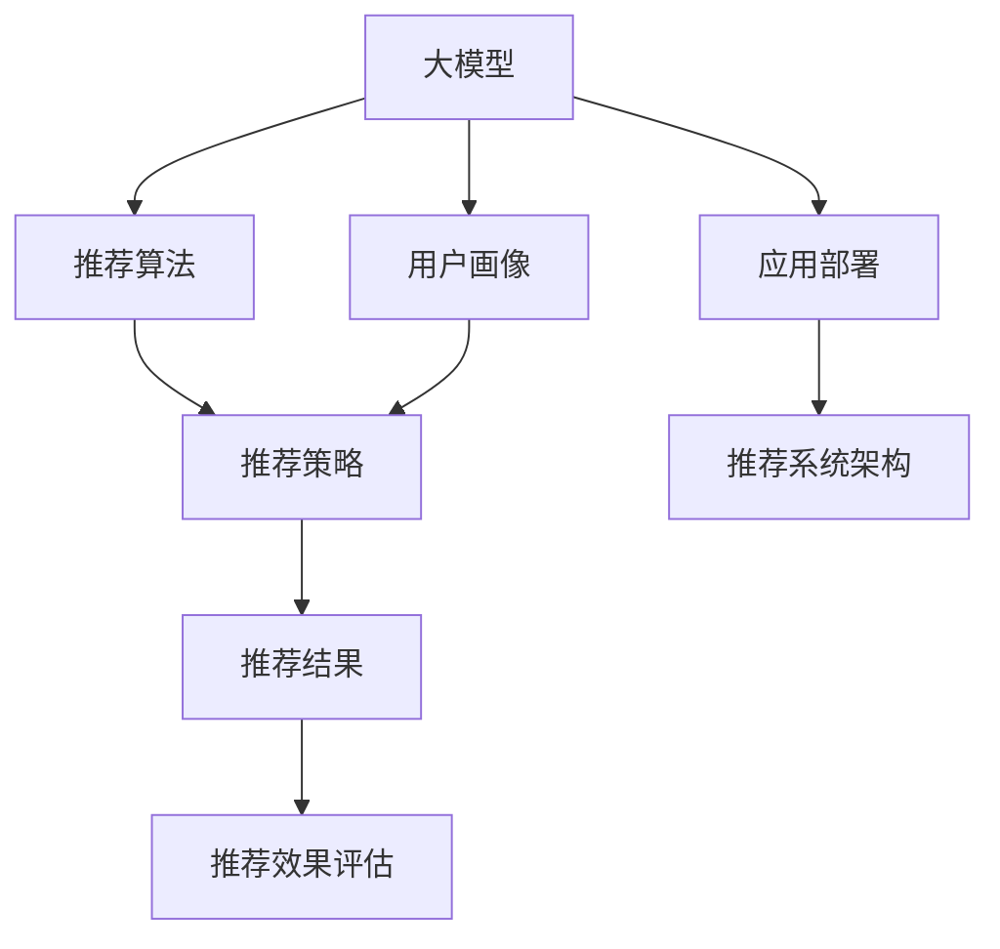

                 

# 面向不同推荐场景的大模型应用部署拆解

> 关键词：大模型,推荐系统,应用部署,推荐算法,用户画像,推荐策略,推荐效果评估,推荐系统架构

## 1. 背景介绍

在现代互联网时代，推荐系统已经成为了数字平台的核心竞争力。无论是电商平台、内容平台、社交网络，甚至是物联网设备，都依赖于推荐系统为用户提供个性化的信息和服务。为了提升推荐效果，各大平台纷纷引入大模型技术，利用预训练语言模型的强大表征能力，进行推荐算法的研究与优化。

本文聚焦于大模型在推荐系统中的应用部署，系统讲解不同推荐场景下的技术实现，帮助开发者更好地理解大模型的潜力与挑战，指导实际的推荐系统开发与优化。

## 2. 核心概念与联系

### 2.1 核心概念概述

推荐系统：利用用户的历史行为数据、兴趣标签、社交关系等，预测用户可能感兴趣的内容或商品，并将结果呈现给用户，实现精准推荐。

大模型：以Transformer为代表的预训练语言模型，经过大规模无标签数据的自监督学习，具备强大的语言表示能力和理解能力。

应用部署：将训练好的大模型嵌入推荐系统，通过算法和策略实现推荐结果的输出。

推荐算法：基于用户画像、兴趣模型等数据，设计算法计算推荐结果。

用户画像：通过用户的历史行为、社交关系、人口统计信息等构建的复合特征表示。

推荐策略：根据特定业务需求和算法特性，设计的推荐逻辑规则。

推荐效果评估：通过预设指标衡量推荐系统的性能，评估模型的实际效果。

推荐系统架构：推荐系统的网络结构设计，包括数据流向、特征处理、模型集成、评价反馈等环节。

这些核心概念之间的逻辑关系可以通过以下Mermaid流程图来展示：



该流程图展示了从大模型到推荐结果的整个流程：

1. 大模型通过预训练获得强大的语言表示能力。
2. 结合用户画像信息，推荐算法计算推荐结果。
3. 根据推荐策略，对推荐结果进行优化和排序。
4. 评估推荐效果，反馈至模型训练或策略调整。
5. 最终部署到推荐系统，实现个性化推荐。

## 3. 核心算法原理 & 具体操作步骤

### 3.1 算法原理概述

推荐系统的核心原理包括：

1. 用户画像：通过分析用户的历史行为、兴趣等，构建用户画像向量。
2. 物品特征：利用大模型提取物品的语义特征，如商品描述、标签等。
3. 相似度计算：通过计算用户画像与物品特征之间的相似度，寻找匹配项。
4. 推荐排序：利用推荐算法对相似度进行排序，输出推荐结果。

在推荐系统中，大模型的应用主要体现在用户画像和物品特征的构建上。具体流程如下：

1. 使用大模型对用户行为文本进行编码，得到用户画像向量。
2. 使用大模型对物品描述文本进行编码，得到物品特征向量。
3. 利用相似度算法（如余弦相似度）计算用户画像与物品特征的相似度。
4. 通过排序算法对相似度进行排序，得到推荐列表。

### 3.2 算法步骤详解

#### 步骤1：用户画像构建

用户画像的构建通常涉及以下几步：

1. 数据预处理：清洗、分词、去停用词等文本处理。
2. 特征提取：利用大模型（如BERT）对用户行为文本进行编码，得到用户画像向量。
3. 用户画像存储：将用户画像向量存储在数据库中，便于后续调用。

#### 步骤2：物品特征提取

物品特征提取流程如下：

1. 数据收集：从电商、社交、媒体等平台收集商品、文章、视频等描述文本。
2. 数据预处理：同样需要进行文本清洗、分词、去停用词等处理。
3. 特征提取：使用大模型（如BERT）对物品文本进行编码，得到物品特征向量。
4. 物品特征存储：将物品特征向量存储在数据库中，便于后续调用。

#### 步骤3：相似度计算

相似度计算主要包括以下几步：

1. 用户画像加载：从数据库中加载用户画像向量。
2. 物品特征加载：从数据库中加载物品特征向量。
3. 相似度计算：使用相似度算法（如余弦相似度）计算用户画像与物品特征的相似度。
4. 相似度排序：将相似度排序，得到推荐列表。

#### 步骤4：推荐结果排序

推荐结果排序流程如下：

1. 推荐结果计算：根据相似度排序，得到初步推荐列表。
2. 添加额外特征：加入物品评分、用户评分、时间戳等特征，进一步排序。
3. 最终输出：对排序后的推荐结果进行去重、排序、分页等处理，输出推荐列表。

### 3.3 算法优缺点

大模型在推荐系统中的应用具有以下优点：

1. 丰富的语义表示：大模型能够理解复杂的语言结构，提供更丰富的用户画像和物品特征。
2. 泛化能力强：大模型经过大规模数据预训练，具备较强的泛化能力，适用于各种推荐场景。
3. 可解释性好：大模型的推理过程可以可视化，便于理解推荐机制。
4. 推荐效果提升：利用大模型进行特征提取和相似度计算，能够显著提升推荐精度。

但同时，大模型也存在一些缺点：

1. 计算资源消耗大：大模型的计算量较大，训练和推理速度较慢，需要高性能计算资源。
2. 训练数据需求高：大模型需要大量的预训练数据，对标注数据的需求也较高。
3. 模型复杂度高：大模型结构复杂，需要精心设计超参数和优化策略。
4. 容易过拟合：大模型容易过拟合，特别是在标注样本不足的情况下。

### 3.4 算法应用领域

大模型在推荐系统中的应用领域非常广泛，覆盖了从电商、社交、媒体到智能家居等多个领域。以下是几个典型的应用场景：

1. 电商推荐：利用大模型对用户浏览、点击、购买等行为文本进行编码，得到用户画像，结合商品描述、标签等物品特征，进行商品推荐。
2. 内容推荐：通过分析用户评论、点赞、分享等行为文本，构建用户画像，利用大模型提取文章、视频等内容的语义特征，进行内容推荐。
3. 社交推荐：分析用户社交网络中的互动行为，利用大模型提取人物、事件的语义特征，进行好友、文章、活动等推荐。
4. 智能家居推荐：利用大模型对用户与设备的互动文本进行编码，得到用户画像，结合设备描述、功能等物品特征，进行智能家居设备推荐。
5. 金融推荐：分析用户交易记录、投资偏好等行为文本，利用大模型提取数据语义特征，进行金融产品推荐。

## 4. 数学模型和公式 & 详细讲解 & 举例说明

### 4.1 数学模型构建

在推荐系统中，大模型主要用于用户画像和物品特征的构建。以下以用户画像构建为例，说明大模型的数学模型构建过程。

假设用户的行为文本为 $x$，用户画像向量为 $v_x$，大模型为 $M$，预训练参数为 $\theta$，特征向量维度为 $d$。用户画像构建的数学模型为：

$$
v_x = M(x; \theta)
$$

其中 $M(x; \theta)$ 表示大模型对输入文本 $x$ 的编码，$\theta$ 为大模型的预训练参数。

### 4.2 公式推导过程

使用大模型进行用户画像构建的公式推导如下：

1. 对输入文本 $x$ 进行分词和处理，得到 token embedding。
2. 利用大模型的Transformer结构，对 token embedding 进行编码，得到上下文表示。
3. 通过堆叠多个Transformer层，得到最终的用户画像向量 $v_x$。

以BERT为例，用户画像构建的具体过程如下：

1. 对输入文本 $x$ 进行分词和处理，得到 token embedding。
2. 利用BERT的Transformer结构，对 token embedding 进行编码，得到上下文表示。
3. 通过堆叠多个Transformer层，得到最终的用户画像向量 $v_x$。

### 4.3 案例分析与讲解

以电商平台推荐为例，具体流程如下：

1. 用户行为文本：用户浏览商品时，记录商品ID、浏览时间、点击次数等文本信息。
2. 用户画像构建：使用大模型（如BERT）对行为文本进行编码，得到用户画像向量。
3. 物品特征提取：收集商品描述文本，使用大模型（如BERT）提取物品特征向量。
4. 相似度计算：利用余弦相似度计算用户画像与物品特征的相似度。
5. 推荐排序：根据相似度排序，得到推荐列表。
6. 推荐结果展示：将推荐结果展示给用户。

## 5. 项目实践：代码实例和详细解释说明

### 5.1 开发环境搭建

在推荐系统开发中，需要使用高性能计算资源。以下是常用的开发环境搭建步骤：

1. 安装Anaconda：从官网下载并安装Anaconda，用于创建独立的Python环境。
2. 创建并激活虚拟环境：
```bash
conda create -n recommendation-env python=3.8 
conda activate recommendation-env
```
3. 安装必要的Python库：
```bash
pip install transformers torch pandas numpy
```

### 5.2 源代码详细实现

以下是一个使用BERT进行电商推荐系统开发的Python代码实现：

```python
from transformers import BertTokenizer, BertModel
from torch.utils.data import Dataset
import torch

class BERTDataset(Dataset):
    def __init__(self, texts, labels):
        self.tokenizer = BertTokenizer.from_pretrained('bert-base-uncased')
        self.texts = texts
        self.labels = labels
        
    def __len__(self):
        return len(self.texts)
    
    def __getitem__(self, item):
        text = self.texts[item]
        label = self.labels[item]
        
        encoding = self.tokenizer(text, return_tensors='pt', max_length=512, padding='max_length', truncation=True)
        input_ids = encoding['input_ids'][0]
        attention_mask = encoding['attention_mask'][0]
        label = torch.tensor(label, dtype=torch.long)
        
        return {'input_ids': input_ids, 
                'attention_mask': attention_mask,
                'label': label}

# 构建数据集
train_dataset = BERTDataset(train_texts, train_labels)
dev_dataset = BERTDataset(dev_texts, dev_labels)
test_dataset = BERTDataset(test_texts, test_labels)

# 构建模型
model = BertModel.from_pretrained('bert-base-uncased')
tokenizer = BertTokenizer.from_pretrained('bert-base-uncased')

# 构建预测函数
def predict(model, tokenizer, dataset, batch_size=16):
    model.eval()
    predictions = []
    labels = []
    for batch in tqdm(dataloader, desc='Evaluating'):
        input_ids = batch['input_ids'].to(device)
        attention_mask = batch['attention_mask'].to(device)
        labels = batch['label'].to(device)
        with torch.no_grad():
            outputs = model(input_ids, attention_mask=attention_mask)
            logits = outputs.logits
            batch_predictions = logits.argmax(dim=2).to('cpu').tolist()
            batch_labels = labels.to('cpu').tolist()
            predictions.append(batch_predictions)
            labels.append(batch_labels)
    
    return torch.tensor(predictions), torch.tensor(labels)

# 训练模型
model.train()
optimizer = torch.optim.Adam(model.parameters(), lr=1e-5)
for epoch in range(epochs):
    for batch in dataloader:
        input_ids = batch['input_ids'].to(device)
        attention_mask = batch['attention_mask'].to(device)
        labels = batch['label'].to(device)
        optimizer.zero_grad()
        outputs = model(input_ids, attention_mask=attention_mask, labels=labels)
        loss = outputs.loss
        loss.backward()
        optimizer.step()
    print(f"Epoch {epoch+1}, train loss: {loss:.3f}")
```

### 5.3 代码解读与分析

1. `BERTDataset`类：用于构建数据集，将用户行为文本和标签进行编码，得到模型所需的输入。
2. `predict`函数：用于在验证集上评估模型性能，返回预测结果和真实标签。
3. 模型训练流程：在训练集上进行梯度下降，更新模型参数，并在验证集上评估模型效果。

## 6. 实际应用场景

### 6.1 电商推荐

电商推荐系统是推荐系统的一个典型应用场景。通过大模型对用户行为文本进行编码，得到用户画像，结合商品描述文本提取物品特征，计算相似度，进行商品推荐。

电商推荐系统的核心流程如下：

1. 用户行为文本：用户浏览商品时，记录商品ID、浏览时间、点击次数等文本信息。
2. 用户画像构建：使用大模型（如BERT）对行为文本进行编码，得到用户画像向量。
3. 物品特征提取：收集商品描述文本，使用大模型（如BERT）提取物品特征向量。
4. 相似度计算：利用余弦相似度计算用户画像与物品特征的相似度。
5. 推荐排序：根据相似度排序，得到推荐列表。
6. 推荐结果展示：将推荐结果展示给用户。

### 6.2 内容推荐

内容推荐系统通过分析用户评论、点赞、分享等行为文本，构建用户画像，利用大模型提取文章、视频等内容的语义特征，进行内容推荐。

内容推荐系统的核心流程如下：

1. 用户行为文本：用户评论、点赞、分享等行为文本。
2. 用户画像构建：使用大模型（如BERT）对行为文本进行编码，得到用户画像向量。
3. 物品特征提取：收集文章、视频等内容的描述文本，使用大模型（如BERT）提取物品特征向量。
4. 相似度计算：利用余弦相似度计算用户画像与物品特征的相似度。
5. 推荐排序：根据相似度排序，得到推荐列表。
6. 推荐结果展示：将推荐结果展示给用户。

### 6.3 社交推荐

社交推荐系统分析用户社交网络中的互动行为，利用大模型提取人物、事件的语义特征，进行好友、文章、活动等推荐。

社交推荐系统的核心流程如下：

1. 用户行为文本：用户互动文本。
2. 用户画像构建：使用大模型（如BERT）对行为文本进行编码，得到用户画像向量。
3. 物品特征提取：收集人物、事件的描述文本，使用大模型（如BERT）提取物品特征向量。
4. 相似度计算：利用余弦相似度计算用户画像与物品特征的相似度。
5. 推荐排序：根据相似度排序，得到推荐列表。
6. 推荐结果展示：将推荐结果展示给用户。

### 6.4 未来应用展望

随着大模型技术的不断演进，推荐系统也将迎来更多创新和突破。以下是一些未来的应用展望：

1. 多模态推荐：结合视觉、语音等多模态数据，提升推荐系统的精准度。
2. 实时推荐：通过在线学习和大模型快速推理，实现实时推荐。
3. 跨领域推荐：利用大模型的跨领域迁移能力，进行不同领域内容的推荐。
4. 隐私保护推荐：保护用户隐私，避免敏感信息泄露。
5. 可解释推荐：增强推荐系统的可解释性，让用户信任推荐结果。

## 7. 工具和资源推荐

### 7.1 学习资源推荐

为了帮助开发者掌握大模型在推荐系统中的应用，推荐以下学习资源：

1. 《深度学习推荐系统》一书：全面讲解了推荐系统的各种模型和算法，是推荐系统研究的经典教材。
2. CS294-114《深度学习在推荐系统中的应用》课程：由斯坦福大学开设，涵盖推荐系统的经典算法和前沿研究。
3. Arxiv论文《深度学习与推荐系统》：介绍了深度学习在推荐系统中的应用和优化方法。
4. 开源项目推荐系统资源：包括PyTorch、TensorFlow等深度学习框架的推荐系统应用示例，以及线上课程、文档、社区交流等学习资源。

### 7.2 开发工具推荐

推荐系统开发中，需要高性能计算资源和灵活的算法库。以下是一些推荐工具：

1. PyTorch：基于Python的开源深度学习框架，支持灵活的计算图和高效的模型训练。
2. TensorFlow：由Google主导的深度学习框架，具有强大的分布式计算能力和生产部署能力。
3. HuggingFace Transformers：提供了多种预训练语言模型，支持高效的模型推理和微调。
4. Amazon SageMaker：AWS提供的云端深度学习平台，支持模型训练、优化和部署。
5. TensorBoard：TensorFlow配套的可视化工具，用于实时监测模型训练状态。
6. Weights & Biases：模型训练的实验跟踪工具，记录和可视化训练过程中的各项指标。

### 7.3 相关论文推荐

大模型在推荐系统中的应用研究还处于起步阶段，以下是一些相关的经典论文：

1. Attention is All You Need：介绍Transformer结构，开启了预训练大模型的时代。
2. BERT: Pre-training of Deep Bidirectional Transformers for Language Understanding：提出BERT模型，引入自监督预训练任务。
3. Transformer-XL: Attentive Language Models are Better at Aspect-based Sentiment Analysis：提出Transformer-XL模型，提升文本语义表示能力。
4. A Simple and Massively Efficient Sequence Model with Three Blocks：提出PELT模型，提高模型的参数效率。
5. AdaLoRA: Adaptive Low-Rank Adaptation for Parameter-Efficient Fine-Tuning：提出AdaLoRA模型，提升微调的参数效率。
6. Deep Sparse Extraction for Recommendation Systems：提出SparseBERT模型，提高推荐系统的稀疏性。

## 8. 总结：未来发展趋势与挑战

### 8.1 总结

本文对大模型在推荐系统中的应用进行了全面系统地介绍，帮助开发者理解大模型的潜力与挑战。

大模型在推荐系统中展现了强大的语义表示能力，可以高效构建用户画像和物品特征，提升推荐系统的精度。但同时，大模型也面临计算资源消耗大、训练数据需求高等问题。

通过合理的算法设计和工具应用，可以解决这些挑战，提升推荐系统的效果。

### 8.2 未来发展趋势

未来大模型在推荐系统中将展现出更多创新和突破。以下是一些发展趋势：

1. 多模态推荐：结合视觉、语音等多模态数据，提升推荐系统的精准度。
2. 实时推荐：通过在线学习和大模型快速推理，实现实时推荐。
3. 跨领域推荐：利用大模型的跨领域迁移能力，进行不同领域内容的推荐。
4. 隐私保护推荐：保护用户隐私，避免敏感信息泄露。
5. 可解释推荐：增强推荐系统的可解释性，让用户信任推荐结果。

### 8.3 面临的挑战

尽管大模型在推荐系统中展现了巨大的潜力，但仍面临诸多挑战：

1. 计算资源消耗大：大模型的计算量较大，训练和推理速度较慢，需要高性能计算资源。
2. 训练数据需求高：大模型需要大量的预训练数据，对标注数据的需求也较高。
3. 模型复杂度高：大模型结构复杂，需要精心设计超参数和优化策略。
4. 容易过拟合：大模型容易过拟合，特别是在标注样本不足的情况下。

### 8.4 研究展望

未来大模型在推荐系统中的应用研究还需要在以下方面进行深入探索：

1. 参数高效微调：开发更多参数高效微调方法，在固定大部分预训练参数的情况下，只更新极少量的任务相关参数。
2. 跨领域迁移：利用大模型的跨领域迁移能力，进行不同领域内容的推荐。
3. 多模态融合：结合视觉、语音等多模态数据，提升推荐系统的精准度。
4. 实时推荐：通过在线学习和大模型快速推理，实现实时推荐。
5. 隐私保护：保护用户隐私，避免敏感信息泄露。
6. 可解释性：增强推荐系统的可解释性，让用户信任推荐结果。

这些研究方向将进一步提升推荐系统的性能和应用范围，推动人工智能技术在各行各业的发展。

## 9. 附录：常见问题与解答

**Q1：大模型在推荐系统中如何避免过拟合？**

A: 过拟合是推荐系统中的常见问题。可以通过以下几种方式避免：

1. 数据增强：通过回译、近义替换等方式扩充训练集。
2. 正则化：使用L2正则、Dropout等技术防止过拟合。
3. 早期停止：在验证集上评估模型性能，当性能不再提升时停止训练。
4. 模型压缩：通过剪枝、量化等技术减少模型规模，避免过拟合。

**Q2：如何优化大模型在推荐系统中的计算效率？**

A: 大模型的计算量较大，可以通过以下方式优化计算效率：

1. 模型裁剪：去除不必要的层和参数，减小模型尺寸。
2. 量化加速：将浮点模型转为定点模型，压缩存储空间，提高计算效率。
3. 模型并行：利用多卡并行计算，提升推理速度。

**Q3：如何提高推荐系统的实时性？**

A: 实时推荐需要高性能计算和低延迟推理。可以通过以下方式提高实时性：

1. 模型部署：将模型部署到云端服务器，利用分布式计算资源。
2. 推理优化：使用模型加速技术，如TensorRT、ONNX-Runtime等，优化推理速度。
3. 缓存策略：利用缓存技术，减少重复推理，提升响应速度。

**Q4：如何保护用户隐私？**

A: 推荐系统中的用户隐私保护尤为重要。可以通过以下方式保护用户隐私：

1. 数据脱敏：对用户数据进行脱敏处理，保护用户隐私。
2. 本地推荐：在用户设备上进行推荐，避免数据传输。
3. 差分隐私：通过加入噪声，保护用户隐私。

**Q5：如何提升推荐系统的可解释性？**

A: 推荐系统的可解释性关系到用户信任和系统稳定性。可以通过以下方式提升可解释性：

1. 可视化推理过程：使用可视化工具展示推荐模型的推理过程。
2. 解释性算法：选择具有可解释性的推荐算法，如基于规则的推荐。
3. 用户反馈：通过用户反馈调整推荐模型，增强可解释性。

这些常见问题与解答将帮助开发者更好地解决推荐系统中的实际问题，提升系统的性能和用户体验。

