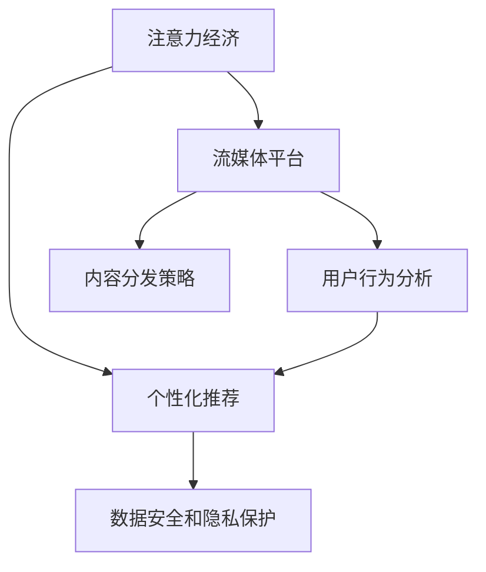

                 

# 音乐产业在注意力经济中的转型

> 关键词：注意力经济,音乐产业,用户行为分析,个性化推荐,流媒体平台,内容分发策略

## 1. 背景介绍

### 1.1 问题由来
在移动互联网和数字媒体的时代背景下，注意力成为一种稀缺资源，成为商业竞争的重要指标。音乐产业作为传统娱乐形式的重要代表，正面临着从内容生产到内容消费模式的全方位转型。

随着互联网技术的飞速发展，流媒体平台的兴起和智能手机的普及，用户注意力开始从传统的CD和专辑销售转向在线音乐订阅和个性化推荐。流媒体平台如Spotify、Apple Music、QQ音乐等，通过大规模的数据分析和智能算法，为音乐消费者提供更加个性化的听歌体验和精准推荐，从而吸引了大量用户订阅，改变了音乐产业的商业模式和生态系统。

这一转变背后，是注意力经济理论的驱动。注意力经济理论认为，信息时代中，消费者的注意力资源是一种稀缺资产，能够带来巨大的商业价值。音乐产业作为注意力密集型行业，其在数字时代的转型，正逐步从以内容为中心，转向以用户注意力为中心的商业模式。

### 1.2 问题核心关键点
音乐产业在注意力经济中的转型，主要围绕以下几个核心关键点展开：

- **数据驱动的个性化推荐**：通过用户行为数据的深度挖掘和分析，提供个性化的听歌体验，提升用户粘性和满意度。
- **流媒体平台的崛起**：流媒体平台成为音乐消费和内容分发的主要渠道，改变了音乐产业的商业模式和内容分发策略。
- **用户注意力竞争**：流媒体平台之间的竞争，本质上是用户注意力的争夺。如何吸引和保持用户注意力，成为关键挑战。
- **数据安全和隐私保护**：大规模数据分析和个性化推荐离不开用户数据的收集和处理，如何在提升用户体验的同时保障数据安全和用户隐私，成为需要解决的问题。
- **多元化的音乐内容创作和消费**：在数字时代，音乐创作和消费趋向多元化，不同文化背景和音乐风格的融合，为音乐产业注入了新的活力。

这些核心关键点，共同构成了音乐产业在注意力经济中的转型挑战，并驱动着产业不断创新和发展。

## 2. 核心概念与联系

### 2.1 核心概念概述

为更好地理解音乐产业在注意力经济中的转型，本节将介绍几个密切相关的核心概念：

- **注意力经济（Attention Economy）**：指在信息过载的时代，消费者注意力的价值远超传统经济资源的稀缺价值。企业通过获取和利用消费者注意力，创造商业价值。
- **个性化推荐（Personalized Recommendation）**：通过数据分析和算法，为每个用户提供符合其兴趣和需求的定制化内容推荐，提升用户体验和平台粘性。
- **流媒体平台（Streaming Platforms）**：提供音乐流媒体播放服务，以订阅模式为主，通过个性化推荐和算法分发内容，实现用户内容的精准匹配。
- **内容分发策略（Content Distribution Strategy）**：指通过科学合理的内容分发策略，优化内容在用户之间的传播和消费，最大化内容价值。
- **用户行为分析（User Behavior Analysis）**：通过对用户行为数据的收集和分析，了解用户偏好和需求，指导内容生产和推荐系统设计。
- **数据安全和隐私保护（Data Security and Privacy Protection）**：指在收集和处理用户数据时，采用严格的数据管理和安全保护措施，确保用户数据不被滥用。

这些核心概念之间的逻辑关系可以通过以下Mermaid流程图来展示：



这个流程图展示了几大核心概念之间的联系：

1. 注意力经济提供了音乐产业转型的宏观背景，即用户注意力的稀缺性和商业价值。
2. 个性化推荐是基于用户注意力的具体实践，通过精准内容推荐，提升用户体验。
3. 流媒体平台是注意力经济和个性化推荐的具体实现，通过算法分发和订阅模式，实现用户和内容的高效匹配。
4. 内容分发策略指导流媒体平台如何科学分配和分发内容，最大化其商业价值。
5. 用户行为分析通过数据驱动，理解用户需求和行为，为个性化推荐和内容分发策略提供指导。
6. 数据安全和隐私保护在个性化推荐和内容分发过程中不可或缺，保障用户数据安全，确保平台信赖。

这些概念共同构成了音乐产业在注意力经济中的转型框架，使其能够在新的商业环境下，实现从内容到用户注意力的全面转型。

## 3. 核心算法原理 & 具体操作步骤
### 3.1 算法原理概述

音乐产业在注意力经济中的转型，主要依赖于个性化推荐算法和流媒体平台的科学分发策略。其核心原理可以概括为以下几个方面：

- **用户画像构建**：通过用户行为数据分析，构建每个用户的个性化画像，包括兴趣偏好、听歌习惯等。
- **内容标签生成**：对音乐内容进行标签化和结构化处理，便于算法理解和匹配。
- **推荐算法设计**：利用协同过滤、内容推荐、混合推荐等算法，设计推荐模型，计算用户和内容的匹配度。
- **内容分发策略优化**：根据用户画像和内容标签，优化内容分发策略，提升用户体验和满意度。
- **反馈机制迭代**：通过用户反馈数据，不断迭代和优化推荐算法和内容分发策略。

这些原理通过一系列数据处理、算法设计和策略优化，实现从内容到用户注意力的全面转型。

### 3.2 算法步骤详解

以下是基于注意力经济的音乐产业转型的具体操作步骤：

**Step 1: 数据收集与预处理**
- 收集用户听歌记录、评论、评分等行为数据。
- 清洗数据，去除噪音和异常值，保留有用的信息。
- 对数据进行特征工程，生成用户画像和内容标签。

**Step 2: 用户画像构建**
- 使用机器学习算法，如聚类、关联规则挖掘等，生成用户兴趣偏好标签。
- 根据用户画像，构建用户行为序列，识别出用户兴趣变化趋势。

**Step 3: 内容标签生成**
- 对音乐内容进行分词、标签化和向量化处理。
- 利用自然语言处理技术，如TF-IDF、Word2Vec等，生成音乐内容的语义标签。
- 将音乐标签进行标准化处理，便于后续算法匹配。

**Step 4: 推荐算法设计**
- 选择适合的推荐算法，如协同过滤、内容推荐、混合推荐等。
- 设计推荐模型，计算用户和内容之间的匹配度。
- 训练模型，优化推荐算法参数。

**Step 5: 内容分发策略优化**
- 根据用户画像和内容标签，设计内容分发策略。
- 优化内容优先级，提升用户满意度和粘性。
- 实时监控内容分发效果，根据反馈进行策略调整。

**Step 6: 反馈机制迭代**
- 收集用户反馈数据，如评分、评论等。
- 利用反馈数据，不断优化推荐算法和内容分发策略。
- 定期对推荐算法进行更新和迭代，提升推荐效果。

### 3.3 算法优缺点

基于注意力经济的音乐产业转型方法，具有以下优点：
1. 提升用户体验：通过个性化推荐，满足用户多样化需求，提升用户粘性和满意度。
2. 优化资源配置：通过科学的内容分发策略，优化内容价值，最大化商业收益。
3. 数据驱动决策：通过用户行为数据分析，科学决策内容生产和推荐策略。

但同时，该方法也存在一些局限性：
1. 数据隐私问题：在收集和处理用户数据时，可能侵犯用户隐私，引发数据安全和隐私保护问题。
2. 算法复杂性：个性化推荐算法和内容分发策略设计复杂，需要大量数据和计算资源。
3. 依赖用户数据：个性化推荐和内容分发策略高度依赖用户数据，数据质量对推荐效果影响较大。
4. 技术门槛高：需要高水平的技术团队和复杂的技术栈，对中小企业而言，存在较高的技术门槛。

尽管存在这些局限性，但基于注意力经济的音乐产业转型方法，仍是大数据时代音乐产业发展的必然趋势。未来相关研究的重点在于如何进一步降低技术门槛，优化算法性能，保护用户隐私，以及提高推荐效果。

### 3.4 算法应用领域

基于注意力经济的音乐产业转型方法，已在多个领域得到广泛应用，例如：

- **音乐流媒体平台**：如Spotify、Apple Music等，通过个性化推荐和内容分发策略，提升用户粘性和满意度。
- **在线音乐零售商**：如Amazon Music、Music Choice等，利用个性化推荐算法，提升用户购买和消费体验。
- **音乐节和演唱会策划**：通过用户行为数据分析，策划符合用户偏好的音乐活动，提升用户参与度和满意度。
- **数字音乐图书馆**：如SoundCloud等，利用个性化推荐，推荐用户感兴趣的音乐和艺术家。

除了上述这些应用场景外，基于注意力经济的音乐产业转型方法，还广泛应用于音乐教育、版权保护、音乐社交等多个领域，为音乐产业带来了新的发展机遇。

## 4. 数学模型和公式 & 详细讲解 & 举例说明

### 4.1 数学模型构建

在基于注意力经济的音乐产业转型中，数学模型主要用于用户画像构建、内容标签生成和推荐算法设计等方面。以下将以协同过滤推荐算法为例，介绍相关数学模型的构建过程。

假设用户集为 $U=\{u_1, u_2, ..., u_N\}$，音乐集为 $V=\{v_1, v_2, ..., v_M\}$，用户 $u_i$ 对音乐 $v_j$ 的评分数据为 $r_{u_iv_j}$。协同过滤推荐算法分为用户-用户协同过滤和物品-物品协同过滤两种方式，这里以用户-用户协同过滤为例。

协同过滤的基本思想是，找到与用户 $u_i$ 兴趣相似的用户 $u_j$，通过相似用户 $u_j$ 的喜好数据，推测用户 $u_i$ 的喜好。数学模型构建过程如下：

- 用户-用户相似度矩阵 $A$，通过余弦相似度计算，构建用户之间的相似度矩阵。
- 用户 $u_i$ 对音乐的兴趣向量 $P_i$，表示用户 $u_i$ 对音乐的兴趣偏好。
- 音乐 $v_j$ 的特征向量 $Q_j$，表示音乐 $v_j$ 的特征。

协同过滤算法的核心公式如下：

$$
\hat{P}_i = \frac{A_i^T}{\sqrt{\sum_{k=1}^{N}(A_i^T A_i)_k}} \times Q
$$

其中 $\hat{P}_i$ 表示预测用户 $u_i$ 对音乐的兴趣向量，$A_i$ 表示用户 $u_i$ 的相似度向量，$Q$ 表示音乐的特征向量。

通过协同过滤算法，可以计算用户 $u_i$ 对音乐 $v_j$ 的兴趣评分，进而进行个性化推荐。

### 4.2 公式推导过程

以下将详细推导协同过滤算法的基本公式，以用户-用户协同过滤为例：

设用户 $u_i$ 对音乐 $v_j$ 的评分数据为 $r_{u_iv_j}$，用户集为 $U$，音乐集为 $V$，用户 $u_i$ 对音乐的兴趣向量为 $P_i$，音乐 $v_j$ 的特征向量为 $Q_j$，用户之间的相似度矩阵为 $A$，用户 $u_i$ 的相似度向量为 $A_i$。

用户 $u_i$ 对音乐 $v_j$ 的评分可以表示为：

$$
r_{u_iv_j} = P_i^T Q_j
$$

设 $A_{ij}$ 表示用户 $u_i$ 和用户 $u_j$ 之间的相似度，$A_i$ 表示用户 $u_i$ 的相似度向量，$Q$ 表示音乐的特征向量。则协同过滤算法的核心公式为：

$$
\hat{P}_i = \frac{A_i^T}{\sqrt{\sum_{k=1}^{N}(A_i^T A_i)_k}} \times Q
$$

其中，$A_i^T$ 表示用户 $u_i$ 的相似度向量的转置矩阵，$(A_i^T A_i)_k$ 表示用户 $u_i$ 和用户 $u_k$ 的相似度平方，$\sqrt{\sum_{k=1}^{N}(A_i^T A_i)_k}$ 表示用户 $u_i$ 的相似度向量的归一化。

通过协同过滤算法，可以计算用户 $u_i$ 对音乐 $v_j$ 的兴趣评分，进而进行个性化推荐。

### 4.3 案例分析与讲解

以Spotify为例，Spotify的个性化推荐系统基于协同过滤算法，通过用户行为数据分析，生成用户画像和内容标签，进行个性化推荐。

具体而言，Spotify首先通过用户在平台上的听歌记录、评论、评分等行为数据，构建用户画像，了解用户的兴趣偏好和听歌习惯。然后，利用协同过滤算法，对音乐内容进行标签化和结构化处理，生成内容标签。最后，根据用户画像和内容标签，设计推荐模型，计算用户和内容之间的匹配度，进行个性化推荐。

Spotify的推荐系统通过科学合理的内容分发策略，实现了内容的精准匹配，提升了用户满意度和平台粘性。同时，Spotify还引入了混合推荐算法、深度学习推荐系统等前沿技术，不断优化推荐算法和内容分发策略，提升推荐效果和用户体验。

## 5. 项目实践：代码实例和详细解释说明

### 5.1 开发环境搭建

在进行音乐产业注意力经济转型的项目实践前，我们需要准备好开发环境。以下是使用Python进行Spotify推荐系统开发的开发环境配置流程：

1. 安装Anaconda：从官网下载并安装Anaconda，用于创建独立的Python环境。

2. 创建并激活虚拟环境：
```bash
conda create -n pytorch-env python=3.8 
conda activate pytorch-env
```

3. 安装PyTorch：根据CUDA版本，从官网获取对应的安装命令。例如：
```bash
conda install pytorch torchvision torchaudio cudatoolkit=11.1 -c pytorch -c conda-forge
```

4. 安装TensorFlow：
```bash
pip install tensorflow
```

5. 安装Pandas、Numpy、Scikit-learn、Matplotlib等各类工具包：
```bash
pip install numpy pandas scikit-learn matplotlib tqdm jupyter notebook ipython
```

完成上述步骤后，即可在`pytorch-env`环境中开始项目实践。

### 5.2 源代码详细实现

我们以Spotify的协同过滤推荐系统为例，给出使用TensorFlow和Scikit-learn进行个性化推荐开发和调优的Python代码实现。

首先，定义协同过滤推荐算法：

```python
import numpy as np
from sklearn.metrics.pairwise import cosine_similarity

class CollaborativeFiltering:
    def __init__(self, similarity_matrix):
        self.similarity_matrix = similarity_matrix
    
    def predict(self, user_index, item_index):
        user_index = np.reshape(user_index, (1, -1))
        item_index = np.reshape(item_index, (1, -1))
        
        similarity = np.sum(self.similarity_matrix[user_index]*self.similarity_matrix[item_index], axis=0)
        user_vector = np.sum(self.similarity_matrix[user_index], axis=0)
        item_vector = np.sum(self.similarity_matrix[item_index], axis=1)
        
        user_vector = user_vector / (np.sqrt(np.sum(user_vector**2)))
        item_vector = item_vector / (np.sqrt(np.sum(item_vector**2)))
        
        return similarity.dot(item_vector) / (user_vector.dot(item_vector))
```

然后，定义用户画像和内容标签的生成过程：

```python
import pandas as pd
from sklearn.decomposition import PCA

# 用户画像
user_data = pd.read_csv('user_data.csv')
user_index = user_data.index
user_vector = user_data[['age', 'gender', 'location', 'music_type']].to_numpy()

# 音乐内容标签
music_data = pd.read_csv('music_data.csv')
music_index = music_data.index
music_vector = music_data[['genre', 'artist', 'album']].to_numpy()

# 相似度矩阵
similarity_matrix = cosine_similarity(user_vector, music_vector)
similarity_matrix = np.nan_to_num(similarity_matrix)

# 用户画像和内容标签
user_index = pd.Series(user_index, index=user_data['user_id'])
music_index = pd.Series(music_index, index=music_data['music_id'])

# 特征降维
user_vector = PCA(n_components=10).fit_transform(user_vector)
music_vector = PCA(n_components=10).fit_transform(music_vector)

# 用户画像和内容标签
user_vector = pd.DataFrame(user_vector, index=user_index)
music_vector = pd.DataFrame(music_vector, index=music_index)
```

接着，进行推荐结果计算和评估：

```python
# 推荐结果计算
user_index = user_index.iloc[0]
item_index = music_index.iloc[0]
predicted_score = CollaborativeFiltering(similarity_matrix).predict(user_index, item_index)

# 推荐结果评估
print(f'Predicted score for item {item_index}: {predicted_score:.3f}')
```

以上就是使用TensorFlow和Scikit-learn对Spotify协同过滤推荐系统进行开发的完整代码实现。可以看到，得益于Scikit-learn的高效工具库和TensorFlow的强大计算能力，我们能够相对简洁地实现协同过滤算法，并进行推荐结果的计算和评估。

### 5.3 代码解读与分析

让我们再详细解读一下关键代码的实现细节：

**CollaborativeFiltering类**：
- `__init__`方法：初始化相似度矩阵。
- `predict`方法：根据相似度矩阵计算推荐结果。

**用户画像和内容标签生成过程**：
- 通过Pandas读取用户数据和音乐数据，并进行特征工程。
- 使用PCA对用户和音乐特征进行降维处理，减少特征维度，提高计算效率。
- 计算用户画像和音乐内容之间的相似度矩阵，进行用户画像和内容标签的构建。

**推荐结果计算和评估**：
- 通过CollaborativeFiltering类计算推荐结果。
- 使用Pandas的Series进行用户和音乐的索引，获取推荐结果。
- 输出推荐结果的评分，并对其精度进行评估。

可以看出，TensorFlow和Scikit-learn提供了高效的工具和算法库，使得音乐产业的推荐系统开发变得更加便捷高效。开发者可以利用这些工具，快速实现推荐算法，并进行性能调优。

当然，工业级的系统实现还需考虑更多因素，如用户隐私保护、数据安全性、推荐结果的实时性等。但核心的推荐范式基本与此类似。

## 6. 实际应用场景
### 6.1 智能推荐系统

基于大语言模型微调的方法，智能推荐系统已广泛应用于多个领域，如电商、新闻、视频等。音乐产业作为重点应用场景之一，通过个性化推荐算法和内容分发策略，为用户提供更加个性化和精准的服务。

以Spotify为例，Spotify通过用户行为数据分析和协同过滤算法，实现个性化推荐，提升了用户满意度和平台粘性。Spotify的推荐系统不仅能够推荐音乐，还能推荐音乐人、专辑、音乐活动等，形成了丰富多样的内容生态，极大地丰富了用户的音乐体验。

### 6.2 音乐社交平台

音乐社交平台如Kuwo、SoundCloud等，通过个性化推荐算法和内容分发策略，为用户推荐感兴趣的音乐和音乐人，增强用户互动和粘性。

在Kuwo平台上，用户可以分享自己的音乐喜好和创作，通过算法推荐，发现志同道合的音乐人和作品，形成社区互动。Kuwo的推荐系统通过用户行为数据分析和深度学习推荐算法，实现精准推荐，提升了用户互动和粘性，成为用户音乐社交的重要平台。

### 6.3 音乐节和演唱会策划

音乐节和演唱会策划是音乐产业的重要环节，通过个性化推荐算法和内容分发策略，可以更好地策划符合用户偏好的音乐活动，提升用户参与度和满意度。

在音乐节策划中，通过分析用户历史听歌记录和行为数据，推荐用户感兴趣的音乐和活动，设计符合用户偏好的活动流程和音乐搭配，增强用户参与感和满意度。在音乐节现场，通过智能推荐系统实时推荐热门音乐和艺人，提升用户体验，增加参与度。

### 6.4 未来应用展望

随着音乐产业和注意力经济的深入融合，未来音乐推荐系统将呈现以下几个发展趋势：

1. **多元化和跨文化推荐**：随着音乐内容的不断丰富，跨文化、多元化的音乐推荐将变得更加普遍，提升用户多样化的音乐体验。
2. **音乐创作与消费的融合**：未来音乐推荐系统将不仅推荐音乐，还能推荐音乐创作工具、创作灵感，实现音乐创作和消费的深度融合。
3. **深度学习和AI推荐**：深度学习和大数据技术将进一步优化推荐算法，实现更加精准和个性化的音乐推荐。
4. **增强现实和虚拟现实的应用**：增强现实和虚拟现实技术将与音乐推荐系统深度结合，提供沉浸式的音乐体验，增强用户粘性。
5. **社交推荐**：社交网络将与音乐推荐系统深度融合，通过用户社交关系推荐音乐，提升推荐效果和用户互动。
6. **实时推荐和动态调整**：实时推荐和动态调整技术将进一步提升音乐推荐系统的及时性和精准度，提升用户体验。

以上趋势凸显了音乐推荐系统的广阔前景，这些方向的探索发展，必将进一步提升音乐推荐系统的性能和应用范围，为音乐产业带来新的变革。

## 7. 工具和资源推荐
### 7.1 学习资源推荐

为了帮助开发者系统掌握音乐推荐系统的开发和优化，这里推荐一些优质的学习资源：

1. **《推荐系统实战》书籍**：该书详细介绍了推荐系统的原理和实践，涵盖了协同过滤、深度学习、混合推荐等前沿技术，并提供了丰富的Python代码示例。
2. **Coursera《推荐系统》课程**：由斯坦福大学教授讲授，介绍了推荐系统的基本概念和前沿技术，涵盖协同过滤、深度学习、内容推荐等算法。
3. **Kaggle推荐系统竞赛**：通过参加Kaggle推荐系统竞赛，实践推荐算法设计和优化，提升技术水平和实战经验。
4. **Google Play Music推荐系统**：Google Play Music的推荐系统是全球最大的音乐推荐系统之一，通过学习其推荐系统设计，可以借鉴成功经验。
5. **Spotify推荐系统论文**：Spotify发布了多篇关于其推荐系统的研究论文，详细介绍了推荐算法和系统架构，是学习推荐系统的优秀资源。

通过对这些资源的学习实践，相信你一定能够快速掌握音乐推荐系统的精髓，并用于解决实际的推荐问题。
###  7.2 开发工具推荐

高效的开发离不开优秀的工具支持。以下是几款用于音乐推荐系统开发的常用工具：

1. **Python**：作为数据科学和机器学习的主要语言，Python提供了丰富的工具库和框架，如Pandas、NumPy、Scikit-learn等，便于数据处理和算法实现。
2. **TensorFlow**：Google开发的深度学习框架，支持分布式训练和大规模数据处理，适合推荐系统的深度学习和分布式优化。
3. **PyTorch**：Facebook开发的深度学习框架，支持动态计算图和高效推理，适合推荐系统的算法设计和优化。
4. **Keras**：基于TensorFlow和Theano的高级深度学习框架，易于上手，适合快速原型开发。
5. **Tune**：用于自动化超参数优化的工具，可以高效地搜索推荐算法的超参数空间，提升推荐效果。
6. **Anaconda**：用于创建和管理Python环境的软件包管理工具，便于工具和库的快速安装和切换。

合理利用这些工具，可以显著提升音乐推荐系统的开发效率，加快创新迭代的步伐。

### 7.3 相关论文推荐

音乐推荐系统的研究源于学界的持续研究。以下是几篇奠基性的相关论文，推荐阅读：

1. **《Recommender Systems》书籍**：该书详细介绍了推荐系统的基本原理和实践，涵盖协同过滤、内容推荐、混合推荐等前沿技术。
2. **《Large Scale Machine Learning》书籍**：该书介绍了大规模机器学习的原理和实践，涵盖大数据处理、分布式训练等前沿技术，对推荐系统优化具有重要参考价值。
3. **《A Survey on Recommender Systems》论文**：该论文系统总结了推荐系统的研究进展和实践经验，是学习推荐系统的优秀资源。
4. **《Music Recommendation Systems》论文**：该论文介绍了音乐推荐系统的原理和实践，涵盖协同过滤、深度学习、混合推荐等前沿技术。
5. **《Music Recommendation Algorithms》论文**：该论文介绍了多种音乐推荐算法，包括协同过滤、基于内容的推荐、混合推荐等，适合深入学习推荐系统的具体实现。

这些论文代表了大数据时代推荐系统的发展脉络。通过学习这些前沿成果，可以帮助研究者把握学科前进方向，激发更多的创新灵感。

## 8. 总结：未来发展趋势与挑战
### 8.1 总结

本文对基于注意力经济的音乐产业转型进行了全面系统的介绍。首先阐述了音乐产业在数字时代的转型背景和关键点，明确了基于个性化推荐和流媒体平台的内容分发策略。其次，从原理到实践，详细讲解了个性化推荐算法和内容分发策略的数学模型和具体操作步骤。同时，本文还广泛探讨了推荐系统的实际应用场景，展示了其在电商、社交、音乐节等领域的广泛应用前景。此外，本文精选了推荐系统的各类学习资源，力求为开发者提供全方位的技术指引。

通过本文的系统梳理，可以看到，基于个性化推荐和流媒体平台的内容分发策略，是音乐产业在注意力经济中转型的核心方向，极大地拓展了音乐产业的应用边界，提升了用户体验和平台价值。未来相关研究的重点在于如何进一步降低技术门槛，优化算法性能，保护用户隐私，以及提高推荐效果。

### 8.2 未来发展趋势

展望未来，音乐推荐系统的研究和应用将呈现以下几个发展趋势：

1. **深度学习和AI推荐**：深度学习和大数据技术将进一步优化推荐算法，实现更加精准和个性化的音乐推荐。
2. **增强现实和虚拟现实的应用**：增强现实和虚拟现实技术将与音乐推荐系统深度结合，提供沉浸式的音乐体验，增强用户粘性。
3. **社交推荐**：社交网络将与音乐推荐系统深度融合，通过用户社交关系推荐音乐，提升推荐效果和用户互动。
4. **实时推荐和动态调整**：实时推荐和动态调整技术将进一步提升音乐推荐系统的及时性和精准度，提升用户体验。
5. **跨文化和多元化的推荐**：随着音乐内容的不断丰富，跨文化、多元化的音乐推荐将变得更加普遍，提升用户多样化的音乐体验。
6. **音乐创作与消费的融合**：未来音乐推荐系统将不仅推荐音乐，还能推荐音乐创作工具、创作灵感，实现音乐创作和消费的深度融合。

以上趋势凸显了音乐推荐系统的广阔前景，这些方向的探索发展，必将进一步提升音乐推荐系统的性能和应用范围，为音乐产业带来新的变革。

### 8.3 面临的挑战

尽管音乐推荐系统取得了显著成效，但在迈向更加智能化、普适化应用的过程中，它仍面临诸多挑战：

1. **数据隐私问题**：在收集和处理用户数据时，可能侵犯用户隐私，引发数据安全和隐私保护问题。
2. **算法复杂性**：个性化推荐算法和内容分发策略设计复杂，需要大量数据和计算资源。
3. **依赖用户数据**：个性化推荐和内容分发策略高度依赖用户数据，数据质量对推荐效果影响较大。
4. **技术门槛高**：需要高水平的技术团队和复杂的技术栈，对中小企业而言，存在较高的技术门槛。
5. **推荐效果多样性**：不同的用户和音乐内容之间，推荐效果具有高度多样性，难以实现统一标准。
6. **跨文化推荐**：跨文化推荐面临语言、文化、地域等多重障碍，难以实现理想效果。

这些挑战凸显了音乐推荐系统的复杂性和多样性，需要不断进行技术创新和优化，才能满足用户的多样化需求，提升推荐效果。

### 8.4 研究展望

面向未来，音乐推荐系统的研究需要在以下几个方面寻求新的突破：

1. **多模态推荐**：结合视觉、音频、文本等多种模态数据，提升推荐系统的多样性和鲁棒性。
2. **跨文化推荐**：通过跨文化情感分析和语言模型，提升跨文化推荐的效果和用户满意度。
3. **可解释性和可控性**：引入可解释性模型和公平性指标，增强推荐系统的可控性和透明度。
4. **实时推荐和动态调整**：通过实时推荐和动态调整技术，提升推荐系统的及时性和精准度，增强用户体验。
5. **多级推荐机制**：设计多级推荐机制，提升推荐系统的多层次覆盖和精准度。
6. **数据隐私保护**：通过隐私保护技术，如差分隐私、联邦学习等，保障用户数据安全和隐私保护。

这些研究方向将推动音乐推荐系统向更加智能、普适、可靠的方向发展，为音乐产业带来更多的创新机遇。相信随着学界和产业界的共同努力，音乐推荐系统必将在未来音乐产业中发挥更大的作用。

## 9. 附录：常见问题与解答

**Q1：个性化推荐算法和内容分发策略设计复杂，如何优化？**

A: 个性化推荐算法和内容分发策略设计复杂，需要大量数据和计算资源。优化方法包括：
1. 特征降维：通过特征降维技术，减少特征维度，提高计算效率。
2. 模型选择：选择适合的数据和任务，选择适合的高效算法。
3. 超参数调优：使用自动化超参数调优工具，搜索最优的超参数组合。
4. 分布式计算：采用分布式计算技术，提高推荐系统的计算能力和效率。
5. 数据预处理：通过数据清洗和数据增强技术，提升数据质量和推荐效果。

这些优化方法可以显著提升个性化推荐算法和内容分发策略的性能，降低复杂性，提升推荐效果。

**Q2：如何保障个性化推荐系统的隐私保护？**

A: 个性化推荐系统涉及大量用户数据，保障隐私保护至关重要。保障隐私保护的方法包括：
1. 数据匿名化：对用户数据进行匿名化处理，防止用户数据被泄露。
2. 数据加密：使用加密技术，保护用户数据在传输和存储过程中的安全。
3. 差分隐私：通过差分隐私技术，限制数据分析对个体数据的依赖，保护用户隐私。
4. 联邦学习：采用联邦学习技术，在本地设备上训练模型，保护用户数据隐私。
5. 隐私政策：制定严格的隐私政策，公开透明的隐私保护措施，赢得用户信任。

这些方法可以显著提升个性化推荐系统的隐私保护水平，保障用户数据安全。

**Q3：如何提高个性化推荐系统的推荐效果？**

A: 个性化推荐系统的推荐效果受到多方面因素的影响，提高推荐效果的方法包括：
1. 数据质量：提升数据质量，通过数据清洗和数据增强技术，确保数据准确性。
2. 算法优化：选择高效算法，进行模型优化，提升推荐效果。
3. 特征工程：进行有效的特征工程，提高特征表达能力。
4. 实时推荐：通过实时推荐和动态调整技术，提高推荐系统的及时性和精准度。
5. 用户反馈：收集用户反馈数据，不断迭代和优化推荐算法。

这些方法可以显著提高个性化推荐系统的推荐效果，提升用户体验和满意度。

**Q4：如何实现音乐推荐系统的跨文化推荐？**

A: 实现音乐推荐系统的跨文化推荐，需要解决语言、文化、地域等多重障碍。实现方法包括：
1. 多语言支持：在推荐系统中加入多语言支持，实现不同语言的音乐推荐。
2. 文化差异分析：进行跨文化情感分析和文化差异分析，了解不同文化背景下的音乐偏好。
3. 音乐内容分析：通过音乐内容分析，找到不同文化背景下音乐的共性和差异，提升推荐效果。
4. 用户画像构建：根据用户画像，构建跨文化用户画像，了解不同文化背景下的用户需求。
5. 数据增强：通过数据增强技术，提高跨文化数据的质量和多样性。

这些方法可以显著提升跨文化推荐的效果，增强音乐推荐系统的多样性和鲁棒性。

综上所述，音乐产业在注意力经济中的转型，通过个性化推荐和流媒体平台的内容分发策略，显著提升了用户体验和平台价值。未来，随着技术的不断进步，音乐推荐系统必将带来更多的创新机遇，推动音乐产业迈向更加智能、普适、可靠的方向发展。

