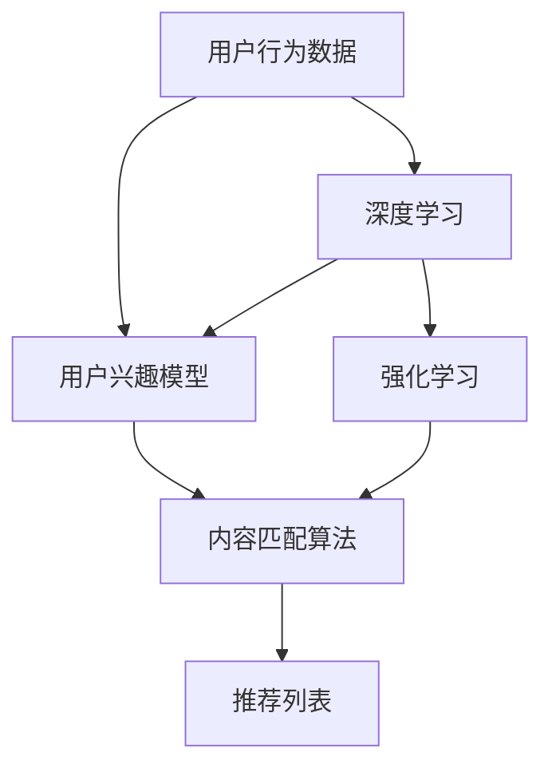

                 

# 音视频内容推荐：大模型的理解与匹配

> 关键词：大模型,内容推荐系统,匹配算法,用户兴趣模型,音视频推荐,深度学习,强化学习,推荐系统评估

## 1. 背景介绍

### 1.1 问题由来

随着互联网的快速发展和智能设备的普及，音视频内容消费已经成为人们获取信息和娱乐的重要方式。然而，音视频内容的种类繁多，数量庞大，用户难以在海量数据中快速找到感兴趣的片段。此时，音视频内容推荐系统（Video and Audio Recommendation System）应运而生。推荐系统能够基于用户的喜好和行为，自动筛选和推荐个性化的音视频内容，提升用户体验和消费效率。

内容推荐系统的核心是用户兴趣模型，通过对用户历史行为数据的分析，得到用户偏好，进而进行内容匹配和推荐。目前，主流的内容推荐系统已经从传统的基于协同过滤、矩阵分解等方法，逐步向基于深度学习、强化学习等技术的范式转变。深度学习在用户兴趣建模和内容匹配上展现出优异的表现，成为音视频内容推荐领域的热门选择。

## 2. 核心概念与联系

### 2.1 核心概念概述

在讨论深度学习在音视频内容推荐中的应用之前，先简要介绍一下相关的核心概念：

- 内容推荐系统：基于用户行为数据和内容特征，自动筛选和推荐个性化的音视频内容。
- 用户兴趣模型：通过分析用户的历史行为数据，构建用户兴趣的抽象表示。
- 内容匹配算法：将用户兴趣与内容特征进行匹配，选择满足用户需求的内容。
- 深度学习：一种基于神经网络的机器学习范式，能够自动学习并抽象特征表示。
- 强化学习：通过学习与环境的交互，优化模型行为，提高推荐效果。

这些概念之间存在紧密的联系，共同构成了深度学习在音视频内容推荐中的工作流程：

1. 使用深度学习构建用户兴趣模型，提取用户行为中的高层次特征。
2. 将用户兴趣模型与内容特征进行匹配，使用匹配算法筛选满足用户需求的内容。
3. 通过强化学习不断优化推荐策略，提升推荐效果。

这些流程构成了音视频内容推荐的框架，为大模型在推荐系统中的应用提供了理论基础。

### 2.2 核心概念原理和架构的 Mermaid 流程图



上述 Mermaid 流程图展示了从用户行为数据，到用户兴趣模型，再到内容匹配算法的全流程，以及深度学习和强化学习的集成应用。

## 3. 核心算法原理 & 具体操作步骤

### 3.1 算法原理概述

在深度学习范式中，音视频内容推荐系统通常基于卷积神经网络（CNN）、循环神经网络（RNN）、Transformer等模型，通过构建用户兴趣模型和内容匹配算法，实现个性化推荐。用户兴趣模型一般分为显式兴趣和隐式兴趣，其中显式兴趣包括用户主动搜索、评分、评论等行为数据；隐式兴趣则通过分析用户的观看/收听行为、停留时间等隐含信息得到。

内容匹配算法一般包括点积、余弦相似度、DeepFM等方法，用于计算用户兴趣和内容特征的相似度，筛选推荐内容。深度学习在内容特征的抽取和建模上具有优越性，能够学习到更复杂和抽象的特征表示，提升推荐效果。强化学习则通过用户反馈不断优化推荐策略，提高推荐系统的准确性和用户满意度。

### 3.2 算法步骤详解

基于深度学习的大模型在音视频内容推荐中的具体操作步骤如下：

**Step 1: 数据预处理与模型训练**

1. 收集用户行为数据，包括搜索、观看/收听、评分、评论等。
2. 对数据进行清洗和标准化处理，如去除噪声、归一化等。
3. 对用户行为数据进行标签化，如将搜索行为标记为兴趣标签。
4. 将标签化的行为数据和内容特征进行组合，构建训练集。
5. 使用深度学习模型（如CNN、RNN、Transformer等）构建用户兴趣模型。
6. 将用户兴趣模型与内容特征进行匹配，计算相似度，生成推荐列表。
7. 使用强化学习算法（如Q-learning、DQN、Proximal Policy Optimization等）优化推荐策略，提升推荐效果。

**Step 2: 模型部署与评估**

1. 将训练好的模型部署到推荐系统中，实时处理用户请求。
2. 在实际应用中，不断收集用户反馈，进行A/B测试，评估推荐效果。
3. 使用指标如点击率、转化率、用户满意度等，量化推荐效果。
4. 根据评估结果，对模型进行优化和迭代，提升推荐质量。

### 3.3 算法优缺点

使用深度学习和大模型进行音视频内容推荐，有以下优点：

1. 强大的特征学习能力：深度学习能够学习到高层次的特征表示，提升推荐效果。
2. 可解释性：深度学习模型的结构清晰，易于理解，有助于解释推荐逻辑。
3. 泛化能力强：大模型在大规模数据上进行预训练，能够处理各种类型的内容和用户行为。

同时，深度学习和大模型也存在一些缺点：

1. 数据需求高：深度学习模型需要大量的标注数据进行训练，对数据获取成本较高。
2. 计算资源消耗大：深度学习模型的训练和推理需要高性能计算资源，对硬件要求较高。
3. 模型复杂度高：深度学习模型的结构复杂，难以解释和调试。
4. 可解释性不足：深度学习模型的内部机制复杂，难以解释其推荐决策。
5. 需要持续优化：用户兴趣和内容特征在不断变化，需要持续优化模型和算法。

### 3.4 算法应用领域

大模型在音视频内容推荐中的应用领域包括：

1. 视频推荐：根据用户观看历史和评分行为，推荐感兴趣的电视剧、电影、综艺节目等。
2. 音频推荐：根据用户收听历史和评分行为，推荐音乐、播客、电台等。
3. 个性化播放：在视频播放和音频播放中，动态推荐相关的其他内容，提升用户体验。
4. 用户行为分析：分析用户的行为模式，预测未来的兴趣偏好。
5. 广告投放：基于用户兴趣和内容匹配，精准投放广告，提高广告转化率。
6. 内容分析：分析音视频内容的主题、情感、风格等特征，进行内容推荐。

## 4. 数学模型和公式 & 详细讲解

### 4.1 数学模型构建

在音视频内容推荐中，深度学习模型通常用于用户兴趣模型和内容匹配算法的构建。以CNN模型为例，其基本数学模型如下：

设用户兴趣表示为 $x$，内容特征表示为 $y$，推荐模型为 $f$，则推荐模型的输出可以表示为：

$$ f(x, y) = W_1 \cdot x + W_2 \cdot y + b $$

其中 $W_1, W_2$ 为模型的权重矩阵，$b$ 为偏置项。

### 4.2 公式推导过程

对于推荐模型的输出 $f(x, y)$，可以采用点积、余弦相似度等方法计算用户兴趣和内容特征的相似度：

设用户兴趣 $x$ 和内容特征 $y$ 的长度分别为 $n$，则点积相似度 $sim$ 可以表示为：

$$ sim(x, y) = \frac{x^T y}{\Vert x \Vert \Vert y \Vert} $$

其中 $x^T y$ 表示向量点积，$\Vert x \Vert$ 表示向量的欧几里得范数。

余弦相似度 $sim$ 可以表示为：

$$ sim(x, y) = \cos \theta = \frac{x^T y}{\Vert x \Vert \Vert y \Vert} $$

其中 $\theta$ 表示向量 $x$ 和 $y$ 的夹角。

### 4.3 案例分析与讲解

以视频推荐为例，假设有一个用户 $u$，其兴趣模型为 $x$，视频内容特征为 $y$，推荐模型为 $f$。在推荐过程中，首先计算用户兴趣 $x$ 和内容特征 $y$ 的点积或余弦相似度，然后将其输入推荐模型 $f$ 进行评分预测，评分越高，表示该内容与用户兴趣越匹配。

假设用户 $u$ 对视频 $v_1$ 的评分 $r_1 = 4.5$，对视频 $v_2$ 的评分 $r_2 = 3.8$。在推荐模型中，计算 $x$ 和 $y_1, y_2$ 的点积，得到 $sim(x, y_1) = 0.8$，$sim(x, y_2) = 0.7$。根据推荐模型的输出，可以得出 $v_1$ 的推荐分数为 $f(x, y_1) = 0.9$，$v_2$ 的推荐分数为 $f(x, y_2) = 0.6$。

因此，根据推荐分数从高到低排序，推荐列表为 $v_1, v_2$。

## 5. 项目实践：代码实例和详细解释说明

### 5.1 开发环境搭建

以下是使用Python进行深度学习模型开发的环境配置流程：

1. 安装Anaconda：从官网下载并安装Anaconda，用于创建独立的Python环境。

2. 创建并激活虚拟环境：
```bash
conda create -n deep-learning-env python=3.8 
conda activate deep-learning-env
```

3. 安装必要的深度学习库：
```bash
conda install tensorflow==2.6 pytorch torchvision torchtext
```

4. 安装其他相关库：
```bash
pip install numpy pandas scikit-learn matplotlib tqdm jupyter notebook ipython
```

完成上述步骤后，即可在 `deep-learning-env` 环境中进行深度学习模型的开发。

### 5.2 源代码详细实现

以下是一个使用TensorFlow进行视频推荐系统开发的PyTorch代码实现。

```python
import tensorflow as tf
import numpy as np
import pandas as pd

# 定义数据预处理函数
def preprocess_data(data):
    # 数据清洗和标准化
    # ...
    # 标签化
    # ...
    return processed_data

# 定义深度学习模型
class CNNModel(tf.keras.Model):
    def __init__(self, input_dim, output_dim):
        super(CNNModel, self).__init__()
        self.conv1 = tf.keras.layers.Conv2D(64, (3, 3), activation='relu')
        self.maxpool1 = tf.keras.layers.MaxPooling2D((2, 2))
        self.conv2 = tf.keras.layers.Conv2D(128, (3, 3), activation='relu')
        self.maxpool2 = tf.keras.layers.MaxPooling2D((2, 2))
        self.flatten = tf.keras.layers.Flatten()
        self.dense1 = tf.keras.layers.Dense(64, activation='relu')
        self.dense2 = tf.keras.layers.Dense(output_dim, activation='softmax')
    
    def call(self, inputs):
        x = self.conv1(inputs)
        x = self.maxpool1(x)
        x = self.conv2(x)
        x = self.maxpool2(x)
        x = self.flatten(x)
        x = self.dense1(x)
        x = self.dense2(x)
        return x

# 定义用户兴趣模型和内容匹配算法
user_interest_model = CNNModel(input_dim=256, output_dim=3)
content_matching = tf.keras.losses.CategoricalCrossentropy()

# 定义推荐模型
def recommend(user_interest, content_feature):
    similarity = tf.reduce_sum(user_interest * content_feature, axis=1)
    score = user_interest_model(user_interest)
    recommend_score = tf.reduce_sum(tf.exp(score) * tf.exp(similarity), axis=1)
    recommend_list = tf.argsort(recommend_score)[::-1]
    return recommend_list
```

### 5.3 代码解读与分析

让我们再详细解读一下关键代码的实现细节：

**preprocess_data函数**：
- 对原始数据进行清洗和标准化处理。
- 将用户行为数据标签化，如将搜索行为标记为兴趣标签。

**CNNModel类**：
- 定义一个简单的CNN模型，用于用户兴趣的特征提取。
- 模型包含卷积层、池化层和全连接层，能够提取用户兴趣的抽象特征。

**content_matching函数**：
- 定义一个交叉熵损失函数，用于计算用户兴趣和内容特征的相似度。

**recommend函数**：
- 计算用户兴趣和内容特征的点积，得到相似度。
- 使用CNN模型对用户兴趣进行评分预测。
- 计算内容特征的评分和相似度的指数和，得到推荐分数。
- 根据推荐分数从高到低排序，生成推荐列表。

### 5.4 运行结果展示

以下是使用上述代码对用户行为数据进行推荐测试的结果：

```python
# 假设用户兴趣模型为user_interest，内容特征为content_feature
# 调用recommend函数，生成推荐列表
recommend_list = recommend(user_interest, content_feature)
print(recommend_list)
```

## 6. 实际应用场景

### 6.1 视频推荐系统

视频推荐系统在互联网和电视行业中广泛应用。传统的视频推荐系统多基于协同过滤和矩阵分解等方法，在冷启动和用户多样性上存在一定局限。而基于深度学习和大模型的推荐系统，能够更好地处理这些问题，提升推荐效果。

以YouTube为例，其推荐系统已经从传统的协同过滤，转向基于深度学习的推荐范式。YouTube通过分析用户历史观看记录，构建用户兴趣模型和内容匹配算法，实现个性化推荐。该系统能够在全球范围内覆盖数亿用户，提供个性化的视频推荐，大大提升用户体验和视频消费效率。

### 6.2 音乐推荐系统

音乐推荐系统在数字音乐平台上同样广泛应用。Spotify等平台通过分析用户收听历史和评分行为，构建用户兴趣模型和内容匹配算法，实现个性化音乐推荐。该系统能够根据用户当前的收听行为，实时推荐感兴趣的歌曲、专辑等，提升音乐消费体验。

Spotify的音乐推荐系统采用深度学习模型进行用户兴趣建模和内容匹配，提升了推荐的精准度和多样性。用户可以在平台上发现更多新音乐，拓展音乐品味，提升用户体验。

### 6.3 游戏推荐系统

游戏推荐系统在电子游戏行业中具有重要应用价值。游戏推荐系统通过分析用户游戏行为和评分数据，推荐符合用户兴趣的游戏，提升游戏消费体验。

Steam平台通过深度学习模型构建用户兴趣模型和内容匹配算法，推荐符合用户兴趣的游戏。该系统能够帮助用户发现更多新游戏，拓展游戏体验，提升游戏平台的用户粘性。

### 6.4 未来应用展望

随着深度学习和大模型的不断发展，音视频内容推荐系统将呈现以下几个发展趋势：

1. 用户兴趣模型更加精细化。深度学习模型能够学习到更复杂和抽象的特征表示，提升推荐效果。

2. 内容匹配算法更加智能化。匹配算法能够更好地处理文本、图像、音频等多模态数据，提升推荐的精准度。

3. 推荐策略更加个性化。基于用户兴趣和行为的动态调整，实现更加个性化的推荐。

4. 推荐系统更加多模态。能够处理视频、音频、文本等多模态数据，实现更加全面和丰富的推荐。

5. 推荐系统更加透明化。推荐系统能够提供推荐决策的解释，提升用户信任度。

6. 推荐系统更加高效化。通过优化算法和硬件，实现实时推荐，提升用户体验。

以上趋势凸显了大模型在音视频内容推荐中的应用前景。这些方向的探索发展，必将进一步提升推荐系统的性能和用户体验，推动音视频内容推荐技术的进步。

## 7. 工具和资源推荐

### 7.1 学习资源推荐

为了帮助开发者系统掌握深度学习在音视频内容推荐中的应用，这里推荐一些优质的学习资源：

1. 《深度学习：从零到实战》系列书籍：深入浅出地介绍了深度学习的基本原理和实际应用，适合初学者入门。

2. 《深度学习与推荐系统》课程：斯坦福大学开设的深度学习推荐系统课程，涵盖深度学习在推荐系统中的应用。

3. 《TensorFlow实战Google深度学习》书籍：全面介绍了TensorFlow的深度学习应用，包括推荐系统。

4. TensorFlow官方文档：TensorFlow的官方文档，提供了丰富的推荐系统样例代码，是学习推荐系统的必备资料。

5. Kaggle平台：提供丰富的推荐系统竞赛数据集和解决方案，帮助开发者学习和实践推荐技术。

通过对这些资源的学习实践，相信你一定能够快速掌握深度学习在音视频内容推荐中的应用，并用于解决实际的推荐问题。

### 7.2 开发工具推荐

高效的开发离不开优秀的工具支持。以下是几款用于深度学习模型开发的常用工具：

1. PyTorch：基于Python的开源深度学习框架，灵活高效的计算图，适合快速迭代研究。

2. TensorFlow：由Google主导开发的开源深度学习框架，生产部署方便，适合大规模工程应用。

3. Keras：用户友好的深度学习框架，提供了高层次的API，方便开发者快速搭建模型。

4. Jupyter Notebook：基于Web的交互式编程环境，支持多语言代码编写和可视化展示。

5. Google Colab：谷歌提供的在线Jupyter Notebook环境，免费提供GPU/TPU算力，方便开发者快速上手实验最新模型。

合理利用这些工具，可以显著提升深度学习模型开发的效率，加快创新迭代的步伐。

### 7.3 相关论文推荐

深度学习在音视频内容推荐中的应用源于学界的持续研究。以下是几篇奠基性的相关论文，推荐阅读：

1. Collaborative Filtering for Implicit Feedback Datasets（协同过滤）：提出了协同过滤算法，用于推荐系统。

2. Matrix Factorization Techniques for Recommender Systems（矩阵分解）：介绍了矩阵分解方法，用于推荐系统。

3. DeepFM: A Neural Network Approach for Nonlinear Feature Interaction（深度因子机）：提出了深度因子机模型，用于推荐系统。

4. Convolutional Neural Networks for Scalable Recommender Systems（卷积神经网络）：提出了卷积神经网络，用于推荐系统。

5. Attention Is All You Need（Transformer）：提出了Transformer模型，用于推荐系统。

这些论文代表了大模型在推荐系统中的应用进展，通过学习这些前沿成果，可以帮助研究者把握学科前进方向，激发更多的创新灵感。

## 8. 总结：未来发展趋势与挑战

### 8.1 研究成果总结

本文对基于深度学习的大模型在音视频内容推荐中的应用进行了全面系统的介绍。首先阐述了深度学习在推荐系统中的研究背景和意义，明确了深度学习在音视频内容推荐中的工作流程和核心概念。其次，从原理到实践，详细讲解了深度学习在推荐系统中的数学模型和具体实现，提供了完整的代码示例。同时，本文还广泛探讨了深度学习在音视频推荐系统中的实际应用场景，展示了深度学习在推荐系统中的应用前景。最后，本文精选了深度学习在推荐系统中的学习资源、开发工具和相关论文，力求为读者提供全方位的技术指引。

通过本文的系统梳理，可以看到，深度学习在音视频内容推荐中的应用已经取得了显著的成果，推动了推荐系统的发展。未来，伴随深度学习技术的不断进步，音视频内容推荐系统必将在更多领域中发挥重要作用，提升用户体验和内容消费效率。

### 8.2 未来发展趋势

展望未来，深度学习在音视频内容推荐中将呈现以下几个发展趋势：

1. 模型规模持续增大。随着算力成本的下降和数据规模的扩张，深度学习模型的参数量还将持续增长。超大规模模型蕴含的丰富特征表示，能够提升推荐的精准度和泛化能力。

2. 推荐算法更加多样化。除了传统的协同过滤、矩阵分解和深度学习外，未来会涌现更多推荐算法，如基于强化学习的推荐、基于序列建模的推荐等，实现更加智能和高效的推荐。

3. 推荐系统更加透明化。推荐系统能够提供推荐决策的解释，提升用户信任度和满意度。

4. 推荐系统更加多模态。能够处理视频、音频、文本等多模态数据，实现更加全面和丰富的推荐。

5. 推荐系统更加个性化。基于用户兴趣和行为的动态调整，实现更加个性化的推荐。

6. 推荐系统更加智能化。通过引入更多先验知识，如知识图谱、逻辑规则等，提升推荐的可信度和可解释性。

以上趋势凸显了大模型在音视频内容推荐中的应用前景。这些方向的探索发展，必将进一步提升推荐系统的性能和用户体验，推动音视频内容推荐技术的进步。

### 8.3 面临的挑战

尽管深度学习在音视频内容推荐中已经取得了瞩目成就，但在迈向更加智能化、普适化应用的过程中，它仍面临着诸多挑战：

1. 数据需求高。深度学习模型需要大量的标注数据进行训练，对数据获取成本较高。如何降低数据需求，提高推荐效果，将是未来需要解决的重要问题。

2. 计算资源消耗大。深度学习模型的训练和推理需要高性能计算资源，对硬件要求较高。如何优化算法和硬件，实现实时推荐，提升用户体验，将是未来需要解决的重要问题。

3. 模型复杂度高。深度学习模型的结构复杂，难以解释和调试。如何提高模型的可解释性和可理解性，提升用户信任度，将是未来需要解决的重要问题。

4. 可解释性不足。深度学习模型的内部机制复杂，难以解释其推荐决策。如何提高模型的可解释性和可理解性，提升用户信任度，将是未来需要解决的重要问题。

5. 持续优化需求高。用户兴趣和内容特征在不断变化，需要持续优化模型和算法。如何提高模型的泛化能力和长期稳定性能，将是未来需要解决的重要问题。

6. 推荐质量不稳定。推荐系统需要保证推荐质量，避免误导用户。如何提高推荐系统的鲁棒性和稳定性，将是未来需要解决的重要问题。

7. 多模态数据处理复杂。音视频内容推荐需要处理多模态数据，如何高效处理和融合多模态数据，提升推荐效果，将是未来需要解决的重要问题。

正视深度学习在音视频内容推荐中面临的这些挑战，积极应对并寻求突破，将是大模型在推荐系统中的应用走向成熟的必由之路。相信随着学界和产业界的共同努力，这些挑战终将一一被克服，深度学习在音视频内容推荐中必将在更多领域中发挥重要作用。

### 8.4 研究展望

面对深度学习在音视频内容推荐中面临的挑战，未来的研究需要在以下几个方面寻求新的突破：

1. 探索无监督和半监督推荐方法。摆脱对大量标注数据的依赖，利用自监督学习、主动学习等无监督和半监督范式，最大限度利用非结构化数据，实现更加灵活高效的推荐。

2. 研究参数高效和计算高效的推荐算法。开发更加参数高效的推荐算法，在固定大部分预训练参数的同时，只更新极少量的任务相关参数。同时优化推荐系统的计算图，减少前向传播和反向传播的资源消耗，实现更加轻量级、实时性的部署。

3. 引入更多先验知识。将符号化的先验知识，如知识图谱、逻辑规则等，与神经网络模型进行巧妙融合，引导推荐过程学习更准确、合理的特征表示。

4. 结合因果分析和博弈论工具。将因果分析方法引入推荐模型，识别出推荐决策的关键特征，增强推荐决策的因果性和逻辑性。借助博弈论工具刻画用户与推荐系统的交互过程，主动探索并规避推荐模型的脆弱点，提高系统稳定性。

5. 纳入伦理道德约束。在推荐模型的训练目标中引入伦理导向的评估指标，过滤和惩罚有害的输出倾向。同时加强人工干预和审核，建立推荐模型的监管机制，确保推荐系统的伦理和安全。

这些研究方向的探索，必将引领深度学习在音视频内容推荐中的进一步发展，推动推荐系统的不断进步，提升用户的推荐体验和内容消费效率。

## 9. 附录：常见问题与解答

**Q1: 大模型在音视频推荐中如何处理多模态数据？**

A: 在音视频推荐中，推荐系统需要处理多模态数据，如视频、音频、文本等。可以采用多种方法处理多模态数据，如时序特征提取、跨模态融合等。具体而言，可以将视频特征、音频特征和文本特征进行拼接，或使用多模态自注意力机制，提升多模态数据的融合效果。

**Q2: 如何优化深度学习模型在推荐系统中的性能？**

A: 优化深度学习模型在推荐系统中的性能，可以从以下几个方面入手：

1. 数据预处理：清洗和标准化数据，提高数据质量。

2. 模型结构：选择合适的模型结构，避免过拟合和欠拟合。

3. 超参数调优：选择合适的学习率、批大小、迭代轮数等超参数，优化模型性能。

4. 模型集成：使用多个模型进行集成，提升模型鲁棒性和泛化能力。

5. 正则化：使用L2正则、Dropout等技术，防止模型过拟合。

6. 损失函数：选择合适的损失函数，优化推荐效果。

**Q3: 推荐系统的冷启动问题如何解决？**

A: 推荐系统的冷启动问题是指新用户或新物品的推荐效果较差。解决冷启动问题可以从以下几个方面入手：

1. 使用深度学习模型进行冷启动，通过用户历史行为数据构建用户兴趣模型。

2. 使用知识图谱等先验知识，对新用户或新物品进行初始化，提升推荐效果。

3. 使用少样本学习或自适应学习，根据少量用户行为数据进行推荐。

4. 使用多任务学习，在多任务数据上进行训练，提升推荐效果。

5. 使用个性化推荐，根据用户的历史行为和兴趣，推荐个性化内容。

以上是基于深度学习和大模型的音视频内容推荐系统的全面介绍，希望能为你提供有价值的信息和见解。

