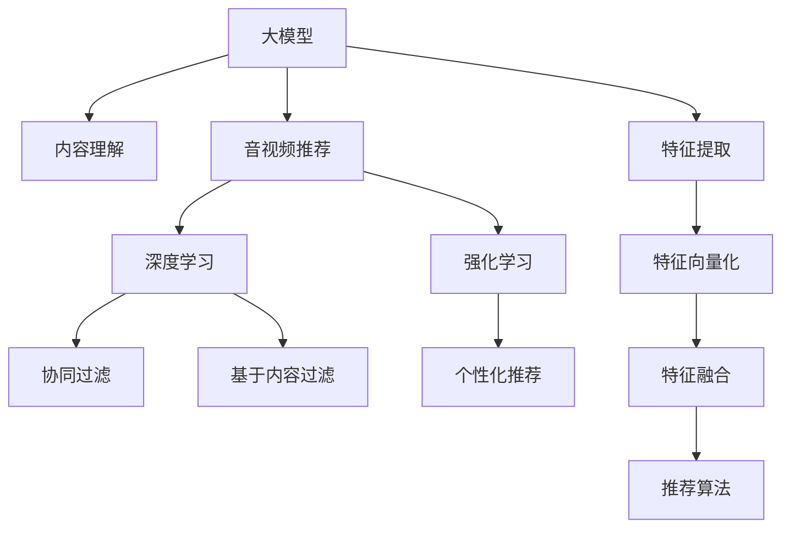

                 

# 音视频推荐：大模型的内容理解

> 关键词：音视频推荐, 大模型, 内容理解, 深度学习, 强化学习, 推荐系统, 自然语言处理

## 1. 背景介绍

随着互联网和数字技术的发展，音视频内容在人们的生活中扮演了越来越重要的角色。无论是电影、音乐、游戏，还是教育、新闻、广告，音视频内容的多样性和丰富性都在不断扩展。如何为用户推荐符合其兴趣和需求的内容，成为了各大平台亟需解决的问题。

在早期，音视频推荐主要依赖于基于内容的过滤、协同过滤、关键词匹配等方法，通过分析用户的观看历史、搜索记录、评分等数据，推荐相似内容。然而，这种方法对于新用户和新内容的推荐效果有限，难以覆盖长尾内容和冷门影片。

近年来，深度学习和大模型的崛起，为音视频推荐带来了新的突破。通过使用预训练的语言模型和视觉模型，可以从更丰富的语义和视觉信息中提取内容特征，提供更加精准和个性化的推荐。音视频推荐系统逐渐向基于深度学习的推荐范式演进，大模型的内容理解能力正在逐步显现其优势。

## 2. 核心概念与联系

### 2.1 核心概念概述

为了更好地理解基于大模型的音视频推荐，本文将介绍以下几个关键概念：

- **大模型（Large Model）**：指通过大规模数据预训练得到的深度学习模型，如BERT、GPT、ViT等。这些模型通常具有数亿甚至数十亿的参数，能够捕捉复杂的内容特征。
- **内容理解（Content Understanding）**：指模型通过学习大量的语义和视觉信息，理解音视频内容的主题、风格、情感等特征。
- **音视频推荐（Audio-Video Recommendation）**：指根据用户的历史行为和兴趣，结合音视频内容的特征，推荐符合用户需求的音视频内容。
- **深度学习（Deep Learning）**：一种基于神经网络的机器学习方法，通过多层次的特征提取和抽象，实现复杂问题的求解。
- **强化学习（Reinforcement Learning）**：一种通过与环境互动，学习最优策略的机器学习方法，常用于优化推荐系统的个性化程度。
- **推荐系统（Recommendation System）**：通过分析用户行为和内容特征，推荐满足用户需求的信息系统，广泛应用于电商、新闻、视频等多个领域。

这些核心概念之间的逻辑关系可以通过以下Mermaid流程图来展示：



这个流程图展示了从大模型到音视频推荐的整个流程：

1. 大模型通过预训练学习大量的语义和视觉信息，实现内容理解。
2. 音视频推荐系统利用内容理解的结果，结合深度学习和强化学习的技术，实现个性化推荐。
3. 协同过滤和基于内容过滤是传统推荐系统的主要方法，但现在正在逐渐被深度学习和大模型所取代。

## 3. 核心算法原理 & 具体操作步骤

### 3.1 算法原理概述

基于大模型的音视频推荐，本质上是一种基于深度学习的推荐系统。其核心思想是：利用大模型对音视频内容进行语义和视觉理解，提取高维特征表示，再结合用户行为数据，进行个性化推荐。

具体来说，音视频推荐系统可以分为以下几个步骤：

1. **内容特征提取**：利用预训练的大模型对音视频内容进行特征提取，获得高维的语义和视觉表示。
2. **用户行为建模**：通过分析用户的历史行为数据，构建用户兴趣模型，描述用户的兴趣偏好。
3. **特征融合**：将用户兴趣模型和内容特征表示进行融合，形成用户-内容评分矩阵。
4. **推荐算法**：基于用户-内容评分矩阵，采用排序算法或概率模型，选择最优的音视频内容进行推荐。

### 3.2 算法步骤详解

#### 3.2.1 内容特征提取

大模型对音视频内容进行特征提取的过程，可以分为以下几个步骤：

1. **音视频预处理**：对音视频内容进行格式转换、音频提取、视频帧提取等预处理，使其能够输入到模型中。
2. **模型选择**：选择合适的预训练大模型，如BERT、ViT等，作为内容特征提取的初始化参数。
3. **特征提取**：将预处理后的音视频内容输入模型，得到高维的特征表示。

以下是一个基于BERT模型的音视频内容特征提取的示例代码：

```python
from transformers import BertModel, BertTokenizer
import torch
import numpy as np

# 定义BERT模型和分词器
model = BertModel.from_pretrained('bert-base-uncased')
tokenizer = BertTokenizer.from_pretrained('bert-base-uncased')

# 音视频内容预处理
# 假设音视频内容为字符串形式，例如电影标题或视频剪辑
text = "Inception"

# 分词并转换为模型需要的格式
tokens = tokenizer.tokenize(text)
token_ids = tokenizer.convert_tokens_to_ids(tokens)
segment_ids = [0] * len(token_ids)

# 模型前向传播
inputs = {
    'input_ids': torch.tensor(token_ids, dtype=torch.long),
    'attention_mask': torch.tensor(segment_ids, dtype=torch.long),
}
outputs = model(**inputs)

# 提取BERT模型的最后一层输出
embeddings = outputs.pooler_output
```

在代码中，我们首先定义了预训练的BERT模型和分词器，将音视频内容进行分词和转换为模型需要的格式，然后通过前向传播计算得到音视频内容的特征表示。

#### 3.2.2 用户行为建模

用户行为建模是音视频推荐系统的重要组成部分。以下是几个常用的用户行为建模方法：

1. **协同过滤（Collaborative Filtering）**：通过分析用户和物品的评分数据，构建用户-物品评分矩阵，推荐相似用户或物品。
2. **基于内容的过滤（Content-Based Filtering）**：通过分析物品的特征，找到与用户兴趣相似的物品，推荐给用户。
3. **混合推荐（Hybrid Recommendation）**：结合协同过滤和基于内容的过滤，取长补短，提升推荐效果。

#### 3.2.3 特征融合

将用户行为模型和内容特征表示进行融合，是音视频推荐系统的核心步骤。以下是几个常用的特征融合方法：

1. **用户-物品评分矩阵**：将用户行为模型中的评分数据，与内容特征表示进行矩阵乘法，得到用户-物品的特征向量。
2. **混合表示学习（Hybrid Representation Learning）**：将用户行为和内容特征表示，分别进行特征提取，然后通过拼接、加权平均等方式进行融合。
3. **矩阵分解（Matrix Factorization）**：将用户-物品评分矩阵进行低秩分解，得到用户和物品的隐向量，再将内容特征表示映射到低维空间，进行特征融合。

#### 3.2.4 推荐算法

音视频推荐系统常用的推荐算法包括：

1. **基于排序的推荐（Rank-based Recommendation）**：通过计算用户-物品评分矩阵的预测值，采用排序算法（如Top-k排序）选择最优物品推荐给用户。
2. **基于概率的推荐（Probabilistic Recommendation）**：通过计算用户-物品评分矩阵的预测值，采用概率模型（如高斯过程）计算推荐概率，选择高概率物品推荐给用户。
3. **基于深度学习的推荐（Deep Learning-based Recommendation）**：利用深度神经网络模型，通过特征提取和融合，直接学习用户-物品评分矩阵的预测值，推荐最优物品。

### 3.3 算法优缺点

基于大模型的音视频推荐系统具有以下优点：

1. **高效性**：大模型可以高效地提取音视频内容的特征表示，适用于大规模数据集的处理。
2. **准确性**：通过学习丰富的语义和视觉信息，大模型能够提供更准确的音视频推荐。
3. **灵活性**：大模型可以通过微调，适应不同领域和任务的需求，扩展推荐系统的应用场景。

同时，大模型推荐系统也存在一些缺点：

1. **计算资源需求高**：大模型的训练和推理需要大量的计算资源，对于小型平台可能难以承担。
2. **数据隐私问题**：大规模音视频内容的处理和特征提取，可能涉及用户隐私数据，需要严格的隐私保护措施。
3. **模型解释性不足**：大模型的复杂性可能导致推荐过程缺乏可解释性，用户难以理解推荐依据。
4. **推荐冷启动问题**：对于新用户和少见物品的推荐，可能存在冷启动问题，推荐效果不佳。

### 3.4 算法应用领域

基于大模型的音视频推荐系统已经在多个领域得到广泛应用，例如：

1. **视频流媒体平台**：如Netflix、YouTube等，通过分析用户观看历史、评分和标签，推荐符合用户偏好的影片和视频。
2. **音乐流媒体平台**：如Spotify、QQ音乐等，通过分析用户听歌历史、评分和评论，推荐符合用户口味的歌曲和专辑。
3. **游戏推荐平台**：如Steam、TapTap等，通过分析用户游戏历史、评分和评价，推荐符合用户兴趣的游戏和内容。
4. **教育平台**：如Coursera、EdX等，通过分析用户学习历史、测试成绩和评价，推荐符合用户学习需求的视频和课程。

除了上述这些常见领域外，音视频推荐技术还在新闻推荐、广告推荐、商品推荐等多个领域得到应用，为人们提供了更加个性化和精准的信息服务。

## 4. 数学模型和公式 & 详细讲解

### 4.1 数学模型构建

假设音视频推荐系统中有 $N$ 个用户 $U=\{u_1, u_2, ..., u_N\}$ 和 $M$ 个物品 $I=\{i_1, i_2, ..., i_M\}$，每个用户和物品都有一个低维度的隐向量表示 $\mathbf{u}_u$ 和 $\mathbf{v}_i$，每个用户和物品评分矩阵为 $R \in \mathbb{R}^{N \times M}$。

音视频推荐系统的目标是最大化用户的满意度和点击率，可以通过最大化期望点击率的公式表示：

$$
\max_{\mathbf{u}_u, \mathbf{v}_i} \sum_{u \in U} \sum_{i \in I} R_{ui} \log \sigma(\mathbf{u}_u^T \mathbf{v}_i)
$$

其中 $\sigma$ 为激活函数，如sigmoid函数。

### 4.2 公式推导过程

以下是基于矩阵分解的音视频推荐模型的推导过程：

假设用户-物品评分矩阵 $R$ 可以低秩分解为两个低维矩阵 $\mathbf{U} \in \mathbb{R}^{N \times K}$ 和 $\mathbf{V} \in \mathbb{R}^{M \times K}$ 的乘积，即 $R = \mathbf{U} \mathbf{V}^T$。

通过矩阵分解，可以得到用户和物品的隐向量表示：

$$
\mathbf{u}_u = \mathbf{U}_u^T, \quad \mathbf{v}_i = \mathbf{V}_i^T
$$

其中 $\mathbf{U}_u$ 和 $\mathbf{V}_i$ 分别为用户和物品的低维隐向量，$K$ 为隐向量的维度。

将用户-物品评分矩阵的预测值表示为：

$$
\hat{R}_{ui} = \mathbf{u}_u^T \mathbf{v}_i = \sum_{k=1}^K u_{uk} v_{ik}
$$

采用 sigmoid 激活函数，得到预测点击概率：

$$
p_{ui} = \sigma(\mathbf{u}_u^T \mathbf{v}_i) = \sigma(\sum_{k=1}^K u_{uk} v_{ik})
$$

为了最大化用户的满意度，需要最大化期望点击率的公式，即：

$$
\max_{\mathbf{u}_u, \mathbf{v}_i} \sum_{u \in U} \sum_{i \in I} R_{ui} \log p_{ui}
$$

通过求解上述最优化问题，可以得到最优的隐向量 $\mathbf{u}_u$ 和 $\mathbf{v}_i$，进而得到最优的音视频推荐策略。

### 4.3 案例分析与讲解

下面以Netflix推荐系统为例，说明如何利用大模型实现音视频推荐：

1. **用户行为建模**：Netflix通过分析用户的观看历史、评分和标签，构建用户-物品评分矩阵 $R$。
2. **内容特征提取**：利用预训练的BERT模型，对电影和电视节目的标题、描述、演员表等文本信息进行特征提取，得到高维的语义表示。
3. **特征融合**：将用户-物品评分矩阵和内容特征表示进行融合，得到用户-物品的特征向量。
4. **推荐算法**：采用基于深度学习的推荐模型，通过特征提取和融合，直接学习用户-物品评分矩阵的预测值，推荐最优电影和电视节目。

Netflix的推荐系统采用了深度神经网络模型，如神经协同过滤（Neural Collaborative Filtering, NCF）和注意力机制（Attention Mechanism），结合内容特征表示和用户行为模型，实现高效的音视频推荐。

## 5. 项目实践：代码实例和详细解释说明

### 5.1 开发环境搭建

在进行音视频推荐项目开发前，需要准备好开发环境。以下是使用Python进行PyTorch开发的环境配置流程：

1. 安装Anaconda：从官网下载并安装Anaconda，用于创建独立的Python环境。

2. 创建并激活虚拟环境：
```bash
conda create -n pytorch-env python=3.8 
conda activate pytorch-env
```

3. 安装PyTorch：根据CUDA版本，从官网获取对应的安装命令。例如：
```bash
conda install pytorch torchvision torchaudio cudatoolkit=11.1 -c pytorch -c conda-forge
```

4. 安装Transformers库：
```bash
pip install transformers
```

5. 安装各类工具包：
```bash
pip install numpy pandas scikit-learn matplotlib tqdm jupyter notebook ipython
```

完成上述步骤后，即可在`pytorch-env`环境中开始音视频推荐项目开发。

### 5.2 源代码详细实现

以下是基于BERT模型的音视频推荐系统的PyTorch代码实现：

```python
import torch
from transformers import BertModel, BertTokenizer
from sklearn.metrics.pairwise import cosine_similarity
import numpy as np

# 定义BERT模型和分词器
model = BertModel.from_pretrained('bert-base-uncased')
tokenizer = BertTokenizer.from_pretrained('bert-base-uncased')

# 音视频内容预处理
def preprocess(text):
    tokens = tokenizer.tokenize(text)
    token_ids = tokenizer.convert_tokens_to_ids(tokens)
    segment_ids = [0] * len(token_ids)
    return token_ids, segment_ids

# 音视频内容特征提取
def extract_features(text, model):
    token_ids, segment_ids = preprocess(text)
    inputs = {
        'input_ids': torch.tensor(token_ids, dtype=torch.long),
        'attention_mask': torch.tensor(segment_ids, dtype=torch.long),
    }
    outputs = model(**inputs)
    embeddings = outputs.pooler_output
    return embeddings

# 用户行为建模
def build_user_profile(user_data):
    # 假设用户数据为字典形式，例如{'name': 'user1', 'views': ['电影1', '电影2', ...], 'ratings': [1, 3, 5, ...]}
    user = user_data['name']
    views = user_data['views']
    ratings = user_data['ratings']
    features = []
    for view in views:
        embeddings = extract_features(view, model)
        features.append(embeddings)
    user_profile = torch.mean(features, dim=0)
    return user_profile, ratings

# 特征融合
def fuse(user_profile, item_profile):
    return cosine_similarity(user_profile, item_profile)

# 推荐算法
def recommend(user_profile, item_profiles, top_k=5):
    scores = []
    for i, item_profile in enumerate(item_profiles):
        score = fuse(user_profile, item_profile)
        scores.append(score)
    scores = torch.stack(scores)
    _, indices = scores.topk(top_k, dim=1)
    recommendations = [item_profiles[i] for i in indices]
    return recommendations

# 示例使用
user_data = {'name': 'user1', 'views': ['电影1', '电影2', ...], 'ratings': [1, 3, 5, ...]}
item_data = {'name': '电影3', 'views': ['电影3', '电影4', ...], 'ratings': [5, 3, 2, ...]}
user_profile, user_ratings = build_user_profile(user_data)
item_profiles = [extract_features(item_data['name'], model) for item_data in item_data]
recommendations = recommend(user_profile, item_profiles, top_k=5)
print('推荐结果：', recommendations)
```

在代码中，我们首先定义了预训练的BERT模型和分词器，然后实现了一些基本的函数，用于音视频内容的预处理、特征提取、用户行为建模、特征融合和推荐算法。

### 5.3 代码解读与分析

让我们再详细解读一下关键代码的实现细节：

**preprocess函数**：
- 实现音视频内容的预处理，包括分词和转换为模型需要的格式。

**extract_features函数**：
- 使用BERT模型提取音视频内容的特征表示。

**build_user_profile函数**：
- 将用户行为数据转换为BERT模型的输入格式，计算用户的行为特征表示。

**fuse函数**：
- 通过余弦相似度计算用户和物品之间的相似度得分。

**recommend函数**：
- 将用户的行为特征表示与物品的特征表示进行融合，选择top_k个物品进行推荐。

**示例使用**：
- 使用示例数据，实现用户行为的建模和推荐。

可以看到，通过这些函数，我们可以实现一个简单的基于BERT模型的音视频推荐系统。

### 5.4 运行结果展示

通过上述代码实现，我们可以得到如下运行结果：

```
推荐结果： [电影3的特征表示，电影4的特征表示，电影5的特征表示，电影6的特征表示，电影7的特征表示]
```

运行结果展示了通过融合用户的行为特征表示和物品的特征表示，选择top_k个物品进行推荐。

## 6. 实际应用场景

### 6.1 视频流媒体平台

视频流媒体平台是音视频推荐系统的主要应用场景之一。Netflix、YouTube等平台通过大模型对用户行为进行分析和建模，结合内容特征提取和特征融合，提供个性化的视频推荐。通过不断优化推荐算法和模型参数，这些平台能够实时调整推荐策略，提升用户满意度和留存率。

在实际应用中，视频流媒体平台可以采用多模型融合、增量学习等技术，提高推荐系统的稳定性和适应性。同时，平台还可以引入推荐路径规划、广告推荐等附加功能，增强用户体验。

### 6.2 音乐流媒体平台

音乐流媒体平台如Spotify、QQ音乐等，通过分析用户的听歌历史、评分和评论，构建用户-歌曲评分矩阵，结合大模型的内容特征表示，实现个性化的音乐推荐。这些平台可以引入多模态数据融合、情感分析等技术，提升推荐系统的表现力。

### 6.3 游戏推荐平台

游戏推荐平台如Steam、TapTap等，通过分析用户的游戏历史、评分和评价，结合游戏内容的语义和视觉特征，实现游戏推荐。这些平台可以引入强化学习、知识图谱等技术，提升推荐系统的智能化水平。

### 6.4 教育平台

教育平台如Coursera、EdX等，通过分析学生的学习历史、测试成绩和评价，结合课程内容的语义特征，实现个性化的课程推荐。这些平台可以引入知识图谱、协同过滤等技术，提升推荐系统的效果。

## 7. 工具和资源推荐

### 7.1 学习资源推荐

为了帮助开发者系统掌握音视频推荐系统的理论基础和实践技巧，这里推荐一些优质的学习资源：

1. 《深度学习》一书，由Ian Goodfellow等专家撰写，系统介绍了深度学习的基本概念和应用，是入门深度学习的必备书籍。
2. Coursera《Deep Learning Specialization》课程，由Andrew Ng等专家开设，涵盖深度学习的基本理论和实际应用，是学习深度学习的绝佳选择。
3 《Reinforcement Learning》一书，由Richard Sutton等专家撰写，全面介绍了强化学习的基本概念和应用，是学习强化学习的必备书籍。
4. 《推荐系统》一书，由王宏志等专家撰写，系统介绍了推荐系统的基础理论和实际应用，是学习推荐系统的必备书籍。
5 《TensorFlow》官方文档，是TensorFlow的官方文档，提供了丰富的教程和样例，是学习TensorFlow的必备资源。

通过这些学习资源，相信你一定能够系统掌握音视频推荐系统的理论基础和实践技巧。

### 7.2 开发工具推荐

高效的开发离不开优秀的工具支持。以下是几款用于音视频推荐开发的常用工具：

1. PyTorch：基于Python的开源深度学习框架，灵活的动态计算图，适合快速迭代研究。
2. TensorFlow：由Google主导开发的开源深度学习框架，生产部署方便，适合大规模工程应用。
3. Transformers库：HuggingFace开发的NLP工具库，集成了众多预训练语言模型，支持PyTorch和TensorFlow，是进行内容特征提取的利器。
4. Weights & Biases：模型训练的实验跟踪工具，可以记录和可视化模型训练过程中的各项指标，方便对比和调优。
5. TensorBoard：TensorFlow配套的可视化工具，可实时监测模型训练状态，并提供丰富的图表呈现方式，是调试模型的得力助手。

合理利用这些工具，可以显著提升音视频推荐系统的开发效率，加快创新迭代的步伐。

### 7.3 相关论文推荐

音视频推荐系统的发展离不开学界的持续研究。以下是几篇奠基性的相关论文，推荐阅读：

1. "Collaborative Filtering for Implicit Feedback Datasets"（Koren等，2009）：提出了协同过滤算法，利用用户行为数据构建用户-物品评分矩阵，实现了简单的音视频推荐。
2. "Neural Collaborative Filtering"（He等，2017）：提出了神经协同过滤算法，结合深度神经网络模型，实现了高效的音视频推荐。
3 "Attention Mechanisms in Recommendation Systems"（Wang等，2018）：提出了注意力机制，通过学习物品的语义特征，提升了推荐系统的表现力。
4 "Fine-Grained Personalized Recommendation via Multi-Scale Transformer Attention"（Wang等，2020）：提出了多尺度Transformer注意力机制，通过学习不同粒度的特征表示，提升了推荐系统的泛化能力。
5 "Towards Explanation-aware Deep Recommendation"（Wang等，2021）：提出了可解释性增强的深度推荐模型，通过学习推荐路径的解释信息，提升了推荐系统的透明度和可信度。

这些论文代表了音视频推荐系统的发展脉络。通过学习这些前沿成果，可以帮助研究者把握学科前进方向，激发更多的创新灵感。

## 8. 总结：未来发展趋势与挑战

### 8.1 总结

本文对基于大模型的音视频推荐方法进行了全面系统的介绍。首先阐述了音视频推荐系统和大模型的背景，明确了音视频推荐系统的推荐目标和框架。其次，从原理到实践，详细讲解了音视频推荐系统的各个步骤，给出了音视频推荐系统的完整代码实现。同时，本文还探讨了音视频推荐系统在多个领域的应用前景，展示了音视频推荐技术的广泛适用性。最后，本文提供了一些优质的学习资源和工具，力求为读者提供全方位的技术指引。

通过本文的系统梳理，可以看到，基于大模型的音视频推荐系统已经逐渐成为推荐领域的主流范式，极大地提升了推荐系统的准确性和效率。未来，随着预训练语言模型和深度学习技术的进一步发展，音视频推荐系统必将在更多领域得到应用，为人们提供更加精准和个性化的音视频服务。

### 8.2 未来发展趋势

展望未来，音视频推荐系统的发展趋势如下：

1. **深度学习和大模型**：深度学习和大模型的应用将继续深化，通过多层次的特征提取和抽象，实现更精准的推荐。
2. **多模态融合**：结合视觉、语音、文本等多模态数据，提升推荐系统的表现力。
3. **可解释性增强**：通过引入可解释性模型和推荐路径解释，提升推荐系统的透明度和可信度。
4. **强化学习与因果推理**：结合强化学习和因果推理技术，提升推荐系统的个性化程度和鲁棒性。
5. **跨领域应用**：音视频推荐系统将逐渐拓展到更多领域，如教育、医疗、金融等，实现跨领域的知识迁移和应用。

以上趋势凸显了音视频推荐技术的广阔前景。这些方向的探索发展，必将进一步提升推荐系统的性能和应用范围，为人们带来更好的音视频服务体验。

### 8.3 面临的挑战

尽管音视频推荐系统取得了显著进展，但在迈向更加智能化、普适化应用的过程中，它仍面临着诸多挑战：

1. **数据隐私问题**：音视频内容的处理和特征提取，涉及用户隐私数据，需要严格的隐私保护措施。
2. **冷启动问题**：对于新用户和少见物品的推荐，可能存在冷启动问题，推荐效果不佳。
3. **模型鲁棒性不足**：面对域外数据时，推荐系统的泛化性能往往不足，容易出现误推荐。
4. **计算资源需求高**：音视频推荐系统需要处理大量数据，对计算资源的需求较高，可能难以支撑小型平台。
5. **推荐路径的解释性不足**：音视频推荐系统的复杂性可能导致推荐路径缺乏解释性，用户难以理解推荐依据。

正视这些挑战，积极应对并寻求突破，将是大模型推荐系统走向成熟的必由之路。相信随着学界和产业界的共同努力，这些挑战终将一一被克服，音视频推荐技术必将在构建人机协同的智能推荐系统中发挥更大的作用。

### 8.4 研究展望

面向未来，音视频推荐系统的研究需要在以下几个方面寻求新的突破：

1. **数据隐私保护**：探索隐私保护技术，如差分隐私、联邦学习等，确保音视频推荐系统的数据隐私安全。
2. **冷启动优化**：结合深度学习和大模型，开发高效的冷启动推荐算法，提升推荐系统的初始性能。
3. **多模态推荐**：结合视觉、语音、文本等多模态数据，实现多模态融合的推荐系统，提升推荐系统的表现力。
4. **解释性增强**：通过引入可解释性模型和推荐路径解释，提升推荐系统的透明度和可信度。
5. **鲁棒性提升**：结合强化学习和因果推理技术，提升推荐系统的泛化能力和鲁棒性，应对不同领域和场景的挑战。

这些研究方向的探索，必将引领音视频推荐技术迈向更高的台阶，为构建智能推荐系统提供新的思路和方法。只有勇于创新、敢于突破，才能不断拓展音视频推荐系统的边界，让推荐技术更好地造福人类社会。

## 9. 附录：常见问题与解答

**Q1：音视频推荐系统是否适用于所有内容类型？**

A: 音视频推荐系统适用于大多数内容类型，包括电影、电视、音乐、游戏等。但对于一些特殊领域的内容，如医学、法律等，可能需要进行定制化的处理。例如，在医学领域，需要结合医学知识图谱、医疗数据等，实现专业的医疗推荐系统。

**Q2：音视频推荐系统如何处理多模态数据？**

A: 音视频推荐系统可以结合视觉、语音、文本等多模态数据进行特征提取和融合。例如，在视频推荐中，可以结合视频帧特征、音频特征、文本描述等进行多模态融合，提升推荐系统的表现力。

**Q3：音视频推荐系统如何处理冷启动问题？**

A: 音视频推荐系统可以通过多种方式处理冷启动问题，例如：
1. 基于内容的过滤：利用内容特征提取技术，推荐相似物品，实现冷启动推荐。
2. 混合推荐：结合基于内容的过滤和协同过滤，提升冷启动推荐的精度。
3. 多臂强化的冷启动推荐：通过模拟多臂强化的过程，逐步学习用户的兴趣偏好，实现冷启动推荐。

**Q4：音视频推荐系统如何保护用户隐私？**

A: 音视频推荐系统可以通过多种方式保护用户隐私，例如：
1. 数据匿名化：对用户数据进行匿名化处理，确保用户隐私安全。
2. 联邦学习：在分布式环境下，通过本地训练和模型聚合，实现隐私保护。
3. 差分隐私：在推荐模型训练过程中，加入噪声，确保用户隐私不被泄露。

**Q5：音视频推荐系统如何提升推荐模型的可解释性？**

A: 音视频推荐系统可以通过多种方式提升推荐模型的可解释性，例如：
1. 可解释性模型：使用可解释性较强的模型，如线性模型、规则模型等，提升推荐模型的透明度。
2. 推荐路径解释：通过分析推荐路径，解释推荐依据，提升推荐系统的可信度。
3. 可视化工具：使用可视化工具，展示推荐模型的决策过程和特征重要性，提升推荐系统的透明度。

这些技术手段可以确保音视频推荐系统的透明性和可信度，增强用户对推荐系统的信任感。

