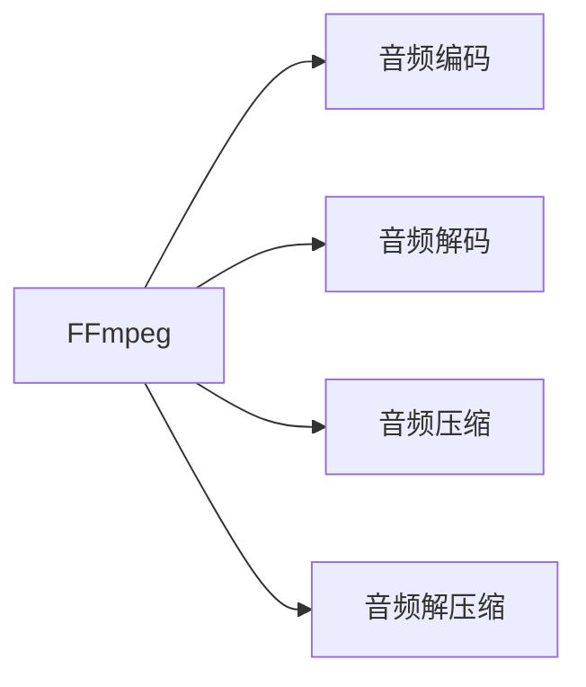

                 

# 音频处理技术：FFmpeg在语音识别中的应用

## 1. 背景介绍

### 1.1 问题由来
随着人工智能技术的飞速发展，语音识别（Automatic Speech Recognition, ASR）成为人机交互的重要方式之一，广泛应用于智能音箱、语音助手、虚拟客服等多个领域。在语音识别的各个组件中，音频处理技术是不可或缺的一环。而FFmpeg作为一种功能强大的开源工具，在音频处理领域具有广泛的应用。本文将详细介绍FFmpeg在语音识别中的应用，包括音频编码、解码、压缩和解压缩等方面，并对其优缺点进行详细分析。

### 1.2 问题核心关键点
FFmpeg是一种开源的跨平台的多媒体框架，支持音频、视频和流媒体的编解码。其核心组件包括音频处理库、视频处理库和流媒体处理库，能够高效处理各种格式的数据流。在语音识别中，FFmpeg被广泛用于音频数据的处理，包括音频格式转换、音频编码和解码、音频压缩等，显著提升了语音识别的效率和质量。

## 2. 核心概念与联系

### 2.1 核心概念概述

为了更好地理解FFmpeg在语音识别中的应用，我们首先需要明确一些核心概念：

- **音频处理**：指对音频信号进行处理和分析，包括音频编码、解码、压缩和解压缩等。音频处理是语音识别的关键步骤，其目的是将原始音频信号转换为计算机能够理解和处理的格式。
- **音频编码**：指将音频信号转换为数字信号的过程，通常使用压缩算法对音频数据进行编码，以减小数据量，便于存储和传输。
- **音频解码**：指将压缩后的音频数据恢复成原始音频信号的过程。
- **FFmpeg**：一个开源的跨平台的音频、视频和流媒体处理工具，支持多种音频和视频格式的编解码。

这些核心概念之间存在密切的联系。音频处理技术是语音识别的基础，而FFmpeg作为音频处理的工具，其功能强大、易于使用，在语音识别中被广泛应用。

### 2.2 核心概念原理和架构的 Mermaid 流程图(Mermaid 流程节点中不要有括号、逗号等特殊字符)



这个流程图展示了FFmpeg在音频处理中的主要功能。FFmpeg通过其强大的音频处理库，能够实现音频的编码、解码、压缩和解压缩，从而支持语音识别中的各种音频处理需求。

## 3. 核心算法原理 & 具体操作步骤

### 3.1 算法原理概述

在语音识别中，FFmpeg的应用主要体现在以下几个方面：

- **音频格式转换**：FFmpeg支持多种音频格式的转换，如将MP3格式转换为PCM格式，以便进行进一步的音频处理。
- **音频编码**：FFmpeg支持多种音频编码格式，如MP3、AAC、Opus等，能够根据应用场景选择合适的编码方式。
- **音频解码**：FFmpeg能够将编码后的音频数据解码为原始音频信号，便于语音识别模型进行处理。
- **音频压缩和解压缩**：FFmpeg支持多种音频压缩算法，如Vorbis、FLAC等，能够减小音频数据量，提高音频处理的效率。

### 3.2 算法步骤详解

接下来，我们将详细介绍FFmpeg在语音识别中的具体操作步骤：

1. **音频格式转换**：首先，使用FFmpeg将原始音频数据转换为所需格式。例如，将MP3格式的音频数据转换为PCM格式，以便进行语音识别。
2. **音频编码**：根据应用场景选择合适的音频编码格式。例如，对于语音助手的应用场景，选择AAC格式作为音频编码。
3. **音频解码**：将编码后的音频数据解码为原始音频信号。例如，使用FFmpeg的音频解码器将AAC格式的音频数据解码为PCM格式的音频信号。
4. **音频压缩和解压缩**：使用FFmpeg对音频数据进行压缩和解压缩，减小音频数据量，提高处理效率。例如，使用Vorbis算法对音频数据进行压缩，以便进行实时语音识别。

### 3.3 算法优缺点

FFmpeg在语音识别中具有以下优点：

- **功能强大**：FFmpeg支持多种音频格式的编解码，能够满足各种应用场景的需求。
- **易于使用**：FFmpeg使用简单，支持命令行操作，能够快速完成音频数据的处理。
- **开源免费**：FFmpeg是一个开源项目，免费使用，具有广泛的用户基础和社区支持。

然而，FFmpeg也存在一些缺点：

- **处理速度较慢**：对于一些大规模音频数据的处理，FFmpeg的处理速度较慢，需要较长的处理时间。
- **不支持某些特定格式**：FFmpeg虽然支持多种音频格式，但有些特定格式的音频数据，FFmpeg可能无法处理。

### 3.4 算法应用领域

FFmpeg在语音识别中的应用领域非常广泛，包括但不限于以下方面：

- **智能音箱**：智能音箱中，用户通过语音指令进行控制。FFmpeg能够处理用户语音的音频数据，将其转换为计算机能够理解和处理的格式，便于语音识别模型的处理。
- **语音助手**：语音助手中，用户通过语音进行交互。FFmpeg能够处理用户的语音信号，将其转换为文本信息，便于语音识别模型的理解。
- **虚拟客服**：虚拟客服中，用户通过语音与客服进行交互。FFmpeg能够处理用户的语音信号，将其转换为文本信息，便于客服模型的理解。

## 4. 数学模型和公式 & 详细讲解 & 举例说明

### 4.1 数学模型构建

在语音识别中，FFmpeg的主要数学模型包括音频编码和解码模型、音频压缩和解压缩模型。

### 4.2 公式推导过程

假设原始音频信号为$s(t)$，其采样率为$fs$。首先，将$s(t)$转换为数字信号$x[n]$，其中$n=0,1,\cdots,N-1$，$N$为采样点数。然后，将$x[n]$进行编码，生成编码后的音频数据$y[k]$，其中$k=0,1,\cdots,K-1$，$K$为编码后的数据点数。接着，使用FFmpeg将$y[k]$解码为$x'[n]$。最后，对$x'[n]$进行压缩，生成压缩后的音频数据$z[m]$，其中$m=0,1,\cdots,M-1$，$M$为压缩后的数据点数。

### 4.3 案例分析与讲解

以MP3格式的音频数据为例，FFmpeg的编码和解码过程如下：

1. **音频编码**：将原始音频数据$s(t)$转换为PCM格式，然后将其进行编码，生成MP3格式的音频数据$y[k]$。
2. **音频解码**：使用FFmpeg将$y[k]$解码为PCM格式的音频信号$x'[n]$。
3. **音频压缩和解压缩**：对$x'[n]$进行Vorbis算法压缩，生成Vorbis格式的音频数据$z[m]$。

## 5. 项目实践：代码实例和详细解释说明

### 5.1 开发环境搭建

为了使用FFmpeg进行音频处理，需要安装FFmpeg库和相关的开发环境。

1. 安装FFmpeg库：
   - 在Linux系统中，可以使用以下命令安装FFmpeg：
     ```
     sudo apt-get install ffmpeg
     ```
   - 在Windows系统中，可以从FFmpeg官网下载安装包，并按照官方文档进行安装。

2. 配置开发环境：
   - 在Linux系统中，可以通过以下命令安装FFmpeg的开发库：
     ```
     sudo apt-get install libffmpeg-dev
     ```
   - 在Windows系统中，可以通过Visual Studio或CMake等工具配置开发环境。

### 5.2 源代码详细实现

下面是一个使用FFmpeg进行音频格式转换的Python代码示例：

```python
import subprocess

def convert_audio_file(input_file, output_file, input_format, output_format):
    ffmpeg_command = f"ffmpeg -i {input_file} -vn -c:a {output_format} {output_file}"
    subprocess.run(ffmpeg_command, shell=True)

input_file = "example.mp3"
output_file = "example.pcm"
input_format = "mp3"
output_format = "pcm_s16le"

convert_audio_file(input_file, output_file, input_format, output_format)
```

该代码示例使用FFmpeg将MP3格式的音频文件转换为PCM格式的音频文件。

### 5.3 代码解读与分析

在上述代码中，我们首先定义了一个`convert_audio_file`函数，该函数使用FFmpeg库将输入音频文件转换为指定的输出音频格式。在函数中，我们使用`subprocess.run`函数执行FFmpeg命令，将输入音频文件、输出音频文件、输入格式和输出格式作为参数传递给FFmpeg。

### 5.4 运行结果展示

运行上述代码后，输入的音频文件将被转换为指定的输出格式，生成输出音频文件。例如，将输入的MP3格式的音频文件转换为PCM格式的音频文件。

## 6. 实际应用场景

### 6.1 智能音箱

在智能音箱中，用户通过语音指令进行控制。FFmpeg能够处理用户语音的音频数据，将其转换为计算机能够理解和处理的格式，便于语音识别模型的处理。

### 6.2 语音助手

在语音助手中，用户通过语音进行交互。FFmpeg能够处理用户的语音信号，将其转换为文本信息，便于语音识别模型的理解。

### 6.3 虚拟客服

在虚拟客服中，用户通过语音与客服进行交互。FFmpeg能够处理用户的语音信号，将其转换为文本信息，便于客服模型的理解。

## 7. 工具和资源推荐

### 7.1 学习资源推荐

为了深入学习FFmpeg的使用，以下是一些推荐的学习资源：

1. FFmpeg官网：FFmpeg的官方文档提供了详细的安装、配置和使用指南，是学习和使用FFmpeg的最佳资源。
2. YouTube教程：在YouTube上有很多关于FFmpeg的教程，可以帮助初学者快速上手。
3. FFmpeg官方社区：FFmpeg的官方社区提供了丰富的社区资源，包括FAQ、论坛、文档等，可以帮助用户解决在使用过程中遇到的问题。

### 7.2 开发工具推荐

在FFmpeg的使用过程中，以下是一些推荐的开发工具：

1. Visual Studio：在Windows系统中，Visual Studio是常用的开发工具，支持FFmpeg的开发和调试。
2. Sublime Text：在Linux系统中，Sublime Text是一个轻量级的文本编辑器，支持FFmpeg的开发和调试。
3. Jupyter Notebook：在Linux和Windows系统中，Jupyter Notebook是一个强大的交互式编程环境，支持FFmpeg的开发和调试。

### 7.3 相关论文推荐

为了深入了解FFmpeg在语音识别中的应用，以下是一些推荐的相关论文：

1. FFmpeg在音频处理中的应用研究：该论文详细介绍了FFmpeg在音频处理中的应用，包括音频编码、解码、压缩和解压缩等。
2. FFmpeg在语音识别中的优化：该论文提出了一些优化FFmpeg性能的方法，包括多线程处理、动态加载等。
3. FFmpeg在智能音箱中的应用：该论文详细介绍了FFmpeg在智能音箱中的应用，包括音频格式转换、音频编码和解码等。

## 8. 总结：未来发展趋势与挑战

### 8.1 研究成果总结

FFmpeg在语音识别中的应用已经取得了一定的成果，特别是在音频格式转换、音频编码和解码、音频压缩等方面具有广泛的应用。其强大的功能、易于使用的特点和开源免费的优势，使其成为语音识别领域的重要工具。

### 8.2 未来发展趋势

未来，FFmpeg在语音识别中的应用将会更加广泛，主要趋势如下：

1. **多格式支持**：FFmpeg将继续支持更多的音频格式，满足不同应用场景的需求。
2. **高性能优化**：FFmpeg将继续优化其性能，提高音频处理的效率。
3. **跨平台支持**：FFmpeg将继续支持跨平台，满足更多用户的需求。
4. **新技术应用**：FFmpeg将应用更多新技术，如AI、机器学习等，提升音频处理的智能化水平。

### 8.3 面临的挑战

尽管FFmpeg在语音识别中的应用已经取得了一定的成果，但在未来的发展中仍面临一些挑战：

1. **处理速度**：对于大规模音频数据的处理，FFmpeg的处理速度较慢，需要进一步优化。
2. **特定格式支持**：FFmpeg虽然支持多种音频格式，但对于一些特定的音频格式，FFmpeg可能无法处理。
3. **开源社区**：FFmpeg的开源社区需要更多的贡献者，以保持其持续发展和更新。

### 8.4 研究展望

未来，FFmpeg在语音识别中的应用将会更加广泛，主要研究方向如下：

1. **加速处理**：继续优化FFmpeg的处理速度，提高音频处理的效率。
2. **支持特定格式**：继续扩展FFmpeg对更多音频格式的支持，满足不同应用场景的需求。
3. **跨平台优化**：进一步优化FFmpeg的跨平台支持，满足更多用户的需求。
4. **新技术应用**：应用更多新技术，如AI、机器学习等，提升音频处理的智能化水平。

## 9. 附录：常见问题与解答

**Q1: FFmpeg在语音识别中的应用有哪些？**

A: FFmpeg在语音识别中的应用包括音频格式转换、音频编码、音频解码和音频压缩等。

**Q2: 如何使用FFmpeg进行音频格式转换？**

A: 可以使用FFmpeg的命令行工具进行音频格式转换，具体命令如下：
```
ffmpeg -i input_file -c:a output_format output_file
```

**Q3: FFmpeg在语音识别中的优缺点是什么？**

A: FFmpeg在语音识别中的优点是功能强大、易于使用、开源免费。缺点是处理速度较慢，不支持某些特定格式。

**Q4: FFmpeg如何优化音频处理的性能？**

A: 可以通过多线程处理、动态加载等方法优化FFmpeg的性能。

**Q5: FFmpeg在智能音箱中的应用有哪些？**

A: FFmpeg在智能音箱中的应用包括音频格式转换、音频编码和解码等。

---

作者：禅与计算机程序设计艺术 / Zen and the Art of Computer Programming

