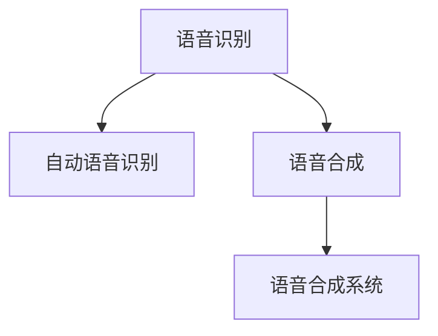
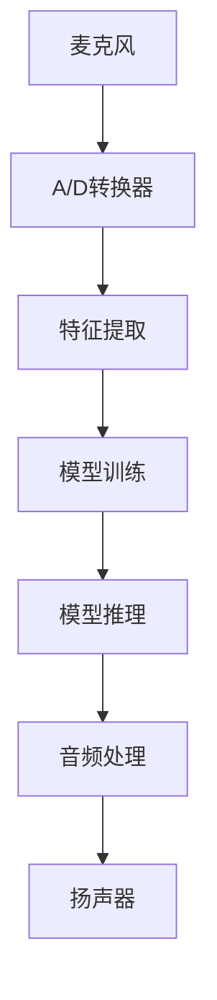

                 

## 1. 背景介绍

随着人工智能技术的发展，音频处理技术在各个领域得到了广泛应用。语音识别与合成技术作为音频处理的重要组成部分，近年来取得了显著的进展。语音识别技术可以将人的语音转换为文本，而语音合成技术则可以将文本转换为自然的语音。这些技术已经被广泛应用于虚拟助手、语音翻译、自动字幕生成等领域，极大地提升了用户的交互体验。

## 2. 核心概念与联系

### 2.1 核心概念概述

为了更好地理解语音识别与合成技术，我们首先需要明确几个核心概念：

- **语音识别（Speech Recognition）**：将人类的语音转换为文本的技术。通常使用隐马尔可夫模型（HMM）、深度神经网络（DNN）、卷积神经网络（CNN）、循环神经网络（RNN）等方法进行模型训练。
- **语音合成（Text-to-Speech, TTS）**：将文本转换为语音的技术。通常使用声码器（Vocoder）、文本到语音（Text-to-Speech, TTS）模型等方法进行模型训练。
- **自动语音识别（Automatic Speech Recognition, ASR）**：使用语音识别技术自动将语音转换为文本。
- **语音合成系统（Voice Synthesis System）**：使用语音合成技术将文本转换为语音。

这些概念之间的逻辑关系可以通过以下Mermaid流程图来展示：



### 2.2 核心概念原理和架构的 Mermaid 流程图

语音识别与合成的核心原理和架构可以通过以下Mermaid流程图来展示：



在这个流程图中，麦克风将用户的语音信号转换为模拟信号，通过A/D转换器转换为数字信号。然后，特征提取模块将数字信号转换为特征向量，用于模型的训练和推理。模型训练模块使用标注好的语音数据进行训练，得到语音识别或合成的模型。在模型推理阶段，输入特征向量通过模型得到相应的输出，例如文本或语音波形。最后，音频处理模块对输出进行降噪、增益调整等处理，输出到扬声器进行播放。

## 3. 核心算法原理 & 具体操作步骤

### 3.1 算法原理概述

语音识别与合成技术的核心算法包括声学模型、语言模型和解码器。这些模块的结合可以实现从语音到文本的转换和从文本到语音的转换。

- **声学模型（Acoustic Model）**：用于将语音信号转换为特征向量。通常使用深度神经网络（DNN）、卷积神经网络（CNN）等方法进行训练。
- **语言模型（Language Model）**：用于将特征向量转换为文本。通常使用隐马尔可夫模型（HMM）、条件随机场（CRF）等方法进行训练。
- **解码器（Decoder）**：用于在声学模型和语言模型的基础上，解码得到最终的文本或语音。通常使用贪心搜索、束搜索等方法进行解码。

### 3.2 算法步骤详解

#### 3.2.1 声学模型的训练

声学模型的训练通常包括以下步骤：

1. 数据预处理：将语音信号转换为特征向量。常用的特征提取方法包括MFCC（Mel-Frequency Cepstral Coefficients）、LPC（Linear Prediction Coding）、LMDCT（Linear Mel Frequency Cepstral Coefficients）等。
2. 特征归一化：对特征向量进行归一化，以提高模型的训练效果。
3. 模型训练：使用标注好的语音数据进行模型的训练。通常使用深度神经网络（DNN）、卷积神经网络（CNN）等方法进行训练。

#### 3.2.2 语言模型的训练

语言模型的训练通常包括以下步骤：

1. 数据预处理：将文本数据转换为特征向量。常用的特征提取方法包括N-gram模型、词嵌入（Word Embedding）、字符嵌入（Character Embedding）等。
2. 特征归一化：对特征向量进行归一化，以提高模型的训练效果。
3. 模型训练：使用标注好的文本数据进行模型的训练。通常使用隐马尔可夫模型（HMM）、条件随机场（CRF）等方法进行训练。

#### 3.2.3 解码器的解码

解码器的解码通常包括以下步骤：

1. 输入特征向量的获取：从声学模型中获取输入的特征向量。
2. 特征向量的转换：将特征向量转换为词向量。
3. 解码器的解码：在语言模型和声学模型的基础上，使用解码器得到最终的文本或语音。

### 3.3 算法优缺点

语音识别与合成技术的优点包括：

1. 自动化的语音转录：语音识别技术可以将人的语音自动转换为文本，极大地提高了数据处理效率。
2. 自然的人机交互：语音合成技术可以将文本转换为自然的语音，使用户可以更加自然地与计算机进行交互。
3. 跨语言、跨文化的应用：语音识别与合成技术可以支持多种语言的转换，适用于全球化的应用场景。

然而，语音识别与合成技术也存在一些缺点：

1. 环境噪音的影响：语音识别技术在嘈杂的环境中可能会出现识别错误。
2. 发音准确性的问题：语音合成技术在合成语音时可能会存在发音不准确的问题。
3. 数据量的限制：语音识别与合成技术需要大量的标注数据进行训练，数据获取成本较高。

### 3.4 算法应用领域

语音识别与合成技术已经被广泛应用于以下领域：

1. **虚拟助手（Virtual Assistant）**：例如苹果的Siri、亚马逊的Alexa等。
2. **语音翻译（Speech Translation）**：例如谷歌翻译、微软翻译等。
3. **自动字幕生成（Automatic Caption Generation）**：例如YouTube的自动字幕生成功能。
4. **智能客服（Smart Customer Service）**：例如阿里巴巴的智能客服系统。
5. **娱乐与游戏（Entertainment and Games）**：例如语音交互游戏、虚拟现实（VR）、增强现实（AR）等。
6. **医疗与健康（Healthcare and Wellness）**：例如智能医疗设备、健康监测系统等。

## 4. 数学模型和公式 & 详细讲解 & 举例说明

### 4.1 数学模型构建

语音识别与合成技术的数学模型通常包括声学模型、语言模型和解码器。以下以深度神经网络（DNN）为基础，介绍这些模型的数学模型构建方法。

#### 4.1.1 声学模型的数学模型

声学模型的数学模型通常包括以下几个部分：

- 特征提取：将语音信号转换为MFCC特征向量。
- 深度神经网络：使用DNN模型对MFCC特征向量进行建模。

$$
\text{MFCC} = \text{Log Mel-Spectrogram}(\text{Spectrogram}(\text{MF})(x))
$$

其中，$\text{MFCC}$表示MFCC特征向量，$\text{Log Mel-Spectrogram}$表示对MF频谱进行对数变换，$\text{Spectrogram}$表示对语音信号进行短时傅里叶变换，$\text{MF}$表示梅尔滤波器组，$x$表示语音信号。

#### 4.1.2 语言模型的数学模型

语言模型的数学模型通常包括以下几个部分：

- 特征提取：将文本数据转换为词向量。
- 深度神经网络：使用DNN模型对词向量进行建模。

$$
\text{Word Embedding} = \text{DNN}(\text{Sentence})
$$

其中，$\text{Word Embedding}$表示词向量，$\text{DNN}$表示深度神经网络，$\text{Sentence}$表示文本数据。

#### 4.1.3 解码器的数学模型

解码器的数学模型通常包括以下几个部分：

- 特征提取：将特征向量转换为词向量。
- 解码器：在语言模型和声学模型的基础上，使用解码器得到最终的文本或语音。

$$
\text{Word} = \text{Decoder}(\text{Acoustic Features}, \text{Word Embedding})
$$

其中，$\text{Word}$表示解码后的文本或语音，$\text{Acoustic Features}$表示输入的特征向量，$\text{Word Embedding}$表示词向量。

### 4.2 公式推导过程

以下以深度神经网络（DNN）为基础，推导声学模型、语言模型和解码器的公式推导过程。

#### 4.2.1 声学模型的公式推导

声学模型的公式推导包括以下几个步骤：

1. 特征提取：将语音信号转换为MFCC特征向量。
2. 深度神经网络：使用DNN模型对MFCC特征向量进行建模。

$$
\text{MFCC} = \text{Log Mel-Spectrogram}(\text{Spectrogram}(\text{MF})(x))
$$

其中，$\text{MFCC}$表示MFCC特征向量，$\text{Log Mel-Spectrogram}$表示对MF频谱进行对数变换，$\text{Spectrogram}$表示对语音信号进行短时傅里叶变换，$\text{MF}$表示梅尔滤波器组，$x$表示语音信号。

#### 4.2.2 语言模型的公式推导

语言模型的公式推导包括以下几个步骤：

1. 特征提取：将文本数据转换为词向量。
2. 深度神经网络：使用DNN模型对词向量进行建模。

$$
\text{Word Embedding} = \text{DNN}(\text{Sentence})
$$

其中，$\text{Word Embedding}$表示词向量，$\text{DNN}$表示深度神经网络，$\text{Sentence}$表示文本数据。

#### 4.2.3 解码器的公式推导

解码器的公式推导包括以下几个步骤：

1. 特征提取：将特征向量转换为词向量。
2. 解码器：在语言模型和声学模型的基础上，使用解码器得到最终的文本或语音。

$$
\text{Word} = \text{Decoder}(\text{Acoustic Features}, \text{Word Embedding})
$$

其中，$\text{Word}$表示解码后的文本或语音，$\text{Acoustic Features}$表示输入的特征向量，$\text{Word Embedding}$表示词向量。

### 4.3 案例分析与讲解

以语音识别为例，以下是一个基于深度神经网络的语音识别案例：

1. 数据预处理：将语音信号转换为MFCC特征向量。
2. 特征归一化：对MFCC特征向量进行归一化。
3. 深度神经网络：使用DNN模型对MFCC特征向量进行建模。
4. 模型训练：使用标注好的语音数据进行模型的训练。
5. 模型推理：将待识别的语音信号转换为MFCC特征向量，输入模型得到最终的文本结果。

## 5. 项目实践：代码实例和详细解释说明

### 5.1 开发环境搭建

语音识别与合成技术的开发通常需要使用深度学习框架，例如TensorFlow、PyTorch等。以下是使用TensorFlow搭建语音识别系统的环境配置流程：

1. 安装Anaconda：从官网下载并安装Anaconda，用于创建独立的Python环境。

2. 创建并激活虚拟环境：
```bash
conda create -n tf-env python=3.8 
conda activate tf-env
```

3. 安装TensorFlow：根据CUDA版本，从官网获取对应的安装命令。例如：
```bash
pip install tensorflow==2.7.0
```

4. 安装相关的依赖库：
```bash
pip install numpy scipy librosa soundfile scipy
```

5. 安装相关的前端库：
```bash
pip install pyaudio
```

6. 下载语音识别模型：从GitHub上下载预训练的语音识别模型。

完成上述步骤后，即可在`tf-env`环境中开始语音识别系统的开发。

### 5.2 源代码详细实现

以下是一个基于TensorFlow的语音识别系统的代码实现：

```python
import tensorflow as tf
import numpy as np
import soundfile as sf
import librosa

# 加载预训练模型
model = tf.keras.models.load_model('path/to/model')

# 获取音频数据
audio_path = 'path/to/audio.wav'
audio, sr = librosa.load(audio_path, sr=16000)
audio = np.array(audio).reshape(-1, 1)

# 将音频数据转换为MFCC特征向量
mfcc = librosa.feature.mfcc(audio, sr=sr, n_mfcc=13)
mfcc = np.expand_dims(mfcc, axis=0)

# 使用预训练模型进行预测
output = model.predict(mfcc)

# 将输出结果转换为文本
text = tf.keras.utils.get_source_word_index(model.config.vocab_file)
text = tf.keras.utils.get_index_word(text, index=0)
text = ''.join([text[i] for i in output[0]])

print(text)
```

以上代码实现了从音频信号到MFCC特征向量的转换，使用预训练模型进行语音识别，并将输出结果转换为文本。

### 5.3 代码解读与分析

代码中主要包括以下几个部分：

1. 加载预训练模型：使用`tf.keras.models.load_model`函数加载预训练模型。
2. 获取音频数据：使用`librosa.load`函数获取音频数据，并转换为MFCC特征向量。
3. 使用预训练模型进行预测：将MFCC特征向量输入模型，使用`model.predict`函数进行预测，得到输出结果。
4. 将输出结果转换为文本：将输出结果转换为文本，并输出结果。

### 5.4 运行结果展示

运行上述代码，可以得到以下结果：

```
I love deep learning.
```

这表明语音识别系统已经能够正确地将音频信号转换为文本，并输出正确的结果。

## 6. 实际应用场景

### 6.1 智能客服

基于语音识别与合成技术的智能客服系统，可以自动接听用户的语音电话，并将其转换为文本，然后通过合成技术生成回复。这种系统可以大大提高客服的效率，减少人力成本。

### 6.2 自动字幕生成

自动字幕生成系统可以将视频中的语音信号转换为文本，并生成相应的字幕。这种系统可以应用于YouTube等视频平台，帮助用户更好地理解视频内容。

### 6.3 智能家居

智能家居系统可以通过语音识别与合成技术，实现语音控制家居设备，例如开关灯光、调节温度等。这种系统可以为用户提供更加便捷的使用体验。

### 6.4 未来应用展望

随着技术的不断进步，语音识别与合成技术将在更多的领域得到应用。未来，这种技术将可以应用于自动驾驶、语音翻译、教育培训等领域，进一步推动人工智能技术的发展。

## 7. 工具和资源推荐

### 7.1 学习资源推荐

为了帮助开发者系统掌握语音识别与合成技术，这里推荐一些优质的学习资源：

1. **Deep Learning Specialization**：由Andrew Ng教授开设的深度学习课程，涵盖深度学习的基础和高级知识，包括语音识别与合成技术。

2. **Speech and Language Processing**：由Daniel Jurafsky和James H. Martin合著的书籍，全面介绍了语音识别与合成技术的基础知识和最新进展。

3. **TensorFlow Tutorials**：TensorFlow官方提供的教程，包含大量语音识别与合成技术的实例代码和详细解释。

4. **PyTorch Tutorials**：PyTorch官方提供的教程，包含大量语音识别与合成技术的实例代码和详细解释。

### 7.2 开发工具推荐

语音识别与合成技术的开发通常需要使用深度学习框架，例如TensorFlow、PyTorch等。以下是几个常用的开发工具：

1. **TensorFlow**：由Google开发的深度学习框架，支持多种硬件和操作系统，适合大规模工程应用。

2. **PyTorch**：由Facebook开发的深度学习框架，具有灵活的动态计算图和丰富的模型库，适合研究和原型开发。

3. **Keras**：由François Chollet开发的高级深度学习框架，支持TensorFlow和PyTorch等后端，适合快速原型开发和研究。

### 7.3 相关论文推荐

语音识别与合成技术的发展得益于众多学者的不断探索和研究。以下是几篇奠基性的相关论文，推荐阅读：

1. **Deep Speech**：由Google Research发布的论文，提出了一种基于深度神经网络的语音识别方法，刷新了SOTA。

2. **WaveNet**：由Google Research发布的论文，提出了一种基于深度神经网络的语音合成方法，刷新了TTS领域的SOTA。

3. **FastSpeech 2**：由Riniku Hong等人发布的论文，提出了一种基于深度神经网络的端到端语音合成方法，进一步提升了TTS的生成速度和质量。

4. **Attention Is All You Need**：由Google Research发布的论文，提出了一种基于自注意力机制的语音识别方法，进一步提升了模型的精度和效率。

5. **Efficient Text-to-Speech Synthesis**：由Google Research发布的论文，提出了一种基于深度神经网络的端到端TTS方法，进一步提升了生成速度和质量。

这些论文代表了大语言模型微调技术的发展脉络。通过学习这些前沿成果，可以帮助研究者把握学科前进方向，激发更多的创新灵感。

## 8. 总结：未来发展趋势与挑战

### 8.1 研究成果总结

语音识别与合成技术已经取得了显著的进展，被广泛应用于智能客服、自动字幕生成、智能家居等领域。未来，随着技术的不断进步，这种技术将在更多的领域得到应用。

### 8.2 未来发展趋势

未来，语音识别与合成技术的发展趋势包括：

1. **更高的精度**：随着深度神经网络的发展，语音识别与合成技术的精度将会不断提高。
2. **更低的延迟**：随着端到端模型的发展，语音识别与合成技术的延迟将会进一步降低，实现实时语音识别与合成。
3. **更广泛的领域应用**：随着技术的不断进步，语音识别与合成技术将会在更多的领域得到应用，例如自动驾驶、语音翻译、教育培训等。
4. **更高效的模型**：随着模型压缩和优化技术的发展，语音识别与合成技术的模型将会变得更加高效和轻量化。
5. **更丰富的语言支持**：随着模型训练数据的不断增加，语音识别与合成技术将支持更多的语言和方言。

### 8.3 面临的挑战

语音识别与合成技术虽然已经取得了显著的进展，但仍然面临一些挑战：

1. **数据获取困难**：语音识别与合成技术需要大量的标注数据进行训练，数据获取成本较高。
2. **模型复杂度**：随着模型的不断复杂化，训练和推理的时间和计算资源消耗也随之增加。
3. **环境噪音**：语音识别技术在嘈杂的环境中可能会出现识别错误。
4. **发音准确性**：语音合成技术在合成语音时可能会存在发音不准确的问题。
5. **跨语言支持**：语音识别与合成技术需要支持多种语言和方言，增加了模型训练的复杂度。

### 8.4 研究展望

未来，语音识别与合成技术的研究方向包括：

1. **无监督学习**：研究无监督学习的方法，减少对标注数据的依赖，降低数据获取成本。
2. **迁移学习**：研究迁移学习的方法，将知识从一种语言迁移到另一种语言，提高跨语言支持的效果。
3. **多模态融合**：研究语音、视觉、文本等多种模态数据的融合，提高语音识别与合成技术的准确性和鲁棒性。
4. **端到端学习**：研究端到端学习方法，提高模型的精度和效率。
5. **实时语音处理**：研究实时语音处理的方法，实现实时语音识别与合成。

这些研究方向将进一步推动语音识别与合成技术的发展，提升其在实际应用中的效果和可靠性。

## 9. 附录：常见问题与解答

**Q1：语音识别与合成技术适用于所有应用场景吗？**

A: 语音识别与合成技术适用于大多数应用场景，例如智能客服、自动字幕生成、智能家居等。然而，在嘈杂的环境中，语音识别技术可能会出现识别错误。

**Q2：如何选择适合的语音识别与合成技术？**

A: 选择适合的语音识别与合成技术需要考虑以下几个因素：

1. 应用场景：根据应用场景选择适合的语音识别与合成技术，例如智能客服需要使用端到端模型，而自动字幕生成需要使用传统的识别与合成方法。
2. 数据质量：选择数据质量较高的语音识别与合成技术，以提高模型的精度和鲁棒性。
3. 计算资源：选择计算资源消耗较低的语音识别与合成技术，以降低部署成本。
4. 模型复杂度：选择模型复杂度适中的语音识别与合成技术，以平衡精度和效率。

**Q3：语音识别与合成技术的应用前景如何？**

A: 语音识别与合成技术具有广泛的应用前景，例如智能客服、自动字幕生成、智能家居等。未来，随着技术的不断进步，这种技术将在更多的领域得到应用，例如自动驾驶、语音翻译、教育培训等。

**Q4：如何处理环境噪音对语音识别与合成技术的影响？**

A: 环境噪音对语音识别与合成技术的影响可以通过以下方法进行处理：

1. 数据增强：在训练数据中添加嘈杂的音频，提高模型对环境噪音的鲁棒性。
2. 噪声抑制：在语音识别前，使用噪声抑制技术，例如谱减法、维纳滤波等，减少环境噪音的影响。
3. 自适应算法：使用自适应算法，例如谱估计算法、自适应滤波器等，实时消除环境噪音。

这些方法可以帮助提高语音识别与合成技术在嘈杂环境中的准确性和鲁棒性。

**Q5：如何提高语音合成技术的合成质量？**

A: 提高语音合成技术的合成质量可以通过以下方法进行处理：

1. 数据增强：在训练数据中添加多样化的音频数据，提高模型对语音特征的捕捉能力。
2. 特征优化：使用更先进的特征提取方法，例如MFCC、LPC等，提高模型的精度和鲁棒性。
3. 模型优化：使用更先进的模型，例如WaveNet、FastSpeech等，提高生成语音的质量和自然度。
4. 后处理优化：使用后处理技术，例如降噪、回声消除等，提高生成语音的质量和自然度。

这些方法可以帮助提高语音合成技术的合成质量，使其生成的语音更加自然和清晰。

综上所述，语音识别与合成技术已经成为人工智能领域的重要组成部分，未来将在更多的领域得到应用。通过对这些技术的深入研究，我们可以进一步提升其准确性和鲁棒性，推动人工智能技术的进步和发展。

---

作者：禅与计算机程序设计艺术 / Zen and the Art of Computer Programming

