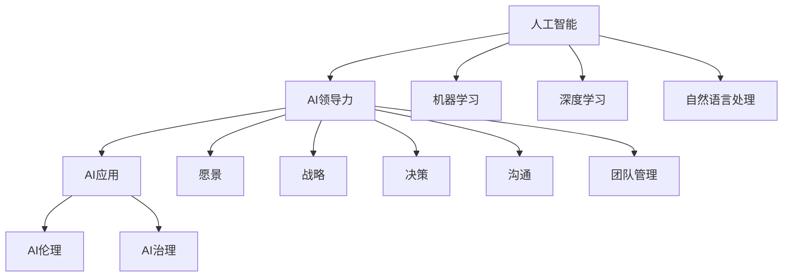

                 

# 领导力与 AI：有效利用人工智能

> 关键词：人工智能, AI领导力, AI应用, 人工智能伦理, 人工智能治理, AI 创新, AI 合作, AI 治理, AI 教育

## 1. 背景介绍

### 1.1 问题由来

随着人工智能(AI)技术的迅猛发展，AI在各行各业的应用已如火如荼。然而，AI的广泛应用同时也带来了新的挑战。如何在AI技术的助力下，发挥领导力，有效利用AI，使之成为助力组织发展、推动社会进步的重要工具，成为了当前企业和社会亟需解决的问题。

### 1.2 问题核心关键点

AI技术的有效利用，不仅依赖于技术本身，更需要领导力的驱动。领导力在AI应用的各个环节中发挥着至关重要的作用，具体包括：

- 愿景和战略：制定符合组织实际情况的AI发展愿景和战略，指导AI应用的方向。
- 资源配置：合理配置AI项目所需的人力、财力、物力等资源，确保AI项目的顺利实施。
- 人才建设：培养和吸引具备AI相关知识和技能的人才，形成AI专业团队。
- 文化塑造：营造包容、开放、创新的AI文化氛围，促进AI技术的快速迭代和应用。
- 风险管理：评估和规避AI应用的潜在风险，确保AI应用的安全性和合规性。

这些关键点构成了AI有效利用的重要组成部分，而领导力的发挥则是推动AI应用成功的关键。

### 1.3 问题研究意义

研究AI与领导力的结合，对于推动AI技术的落地应用，提升组织和社会的整体创新能力，具有重要的意义：

1. 促进AI技术的全面应用：通过领导力的驱动，AI技术能够更广泛地渗透到各个行业，解决实际问题，提升效率和效益。
2. 提升组织竞争力：具有强大AI能力的组织，能够快速响应市场变化，占据技术领先地位，从而在竞争中脱颖而出。
3. 推动社会进步：AI技术在医疗、教育、交通、环保等多个领域的应用，能够带来深远的社会影响，提升公众生活质量。
4. 培养AI人才：领导力的培养和运用，能够吸引和培养更多的AI人才，推动AI技术的持续创新。
5. 塑造AI伦理：领导力的导向作用，能够塑造AI应用的伦理标准，确保AI技术的安全和负责任使用。

## 2. 核心概念与联系

### 2.1 核心概念概述

为更好地理解AI与领导力的结合，本节将介绍几个密切相关的核心概念：

- 人工智能(AI)：一种通过计算机程序实现智能行为的科学技术，包括机器学习、深度学习、自然语言处理等技术。
- 领导力：一种能够激励和指导他人实现共同目标的能力，包括愿景、战略、决策、沟通、团队管理等方面。
- AI领导力：结合AI技术和领导力，通过数据驱动决策，推动组织创新的能力。
- AI伦理：涉及AI应用中的伦理问题，包括隐私保护、公平性、安全性等方面。
- AI治理：对AI应用进行规范和管理的制度体系，确保AI应用的合法合规。
- AI应用：将AI技术应用于各个行业，解决实际问题，提升效率和效益。

这些核心概念之间的逻辑关系可以通过以下Mermaid流程图来展示：



这个流程图展示了大语言模型的核心概念及其之间的关系：

1. AI通过机器学习、深度学习、自然语言处理等技术实现智能行为。
2. AI领导力结合AI技术和领导力，通过数据驱动决策，推动组织创新。
3. AI应用将AI技术应用于各个行业，解决实际问题。
4. AI伦理涉及AI应用中的伦理问题。
5. AI治理对AI应用进行规范和管理，确保合规。
6. 各个AI技术通过集成和组合，形成更加复杂的AI应用。

这些概念共同构成了AI与领导力结合的框架，使得AI能够更有效地应用于各种场景中。

## 3. 核心算法原理 & 具体操作步骤
### 3.1 算法原理概述

AI与领导力的结合，本质上是一种将AI技术和领导力进行有效融合的方法。其核心思想是：通过数据驱动的领导决策，优化AI模型的设计和应用，实现组织的智能化管理和发展。

形式化地，假设组织的目标为 $T$，AI领导力模型为 $M_{\theta}$，其中 $\theta$ 为模型参数。AI领导力的优化目标是最小化目标函数，即：

$$
\theta^* = \mathop{\arg\min}_{\theta} \mathcal{L}(M_{\theta},T)
$$

其中 $\mathcal{L}$ 为组织目标函数，用于衡量AI领导力模型在特定任务 $T$ 上的表现。常见的目标函数包括企业利润最大化、客户满意度提升等。

通过梯度下降等优化算法，AI领导力过程不断更新模型参数 $\theta$，最小化目标函数 $\mathcal{L}$，使得模型输出逼近理想目标 $T$。由于 $\theta$ 已经通过前期的人工干预和数据驱动决策获得了较好的初始化，因此即便在目标任务 $T$ 上仅使用少量的标注数据，也能较快收敛到理想的模型参数 $\hat{\theta}$。

### 3.2 算法步骤详解

AI与领导力的结合，一般包括以下几个关键步骤：

**Step 1: 数据驱动决策**
- 收集组织内部的各种数据，包括财务数据、客户数据、员工数据等。
- 使用数据挖掘和机器学习技术，分析数据特征和趋势，形成决策依据。
- 根据数据驱动的决策，制定AI应用的方向和策略。

**Step 2: 集成AI技术**
- 选择合适的AI技术，如机器学习、深度学习、自然语言处理等，实现业务需求。
- 设计和优化AI模型，确保其能够高效、准确地处理数据。
- 集成AI模型到现有的业务流程中，形成完整的AI应用系统。

**Step 3: 监测和评估**
- 实时监测AI应用系统的运行状态和性能指标，如准确率、召回率、响应时间等。
- 定期评估AI应用的效果，根据评估结果调整AI模型和策略。
- 使用A/B测试等方法，对比AI应用前后的业务效果，评估AI的实际价值。

**Step 4: 持续优化**
- 根据评估结果和用户反馈，持续优化AI模型和算法。
- 引入新的数据和业务需求，重新设计AI应用，以适应组织的变化。
- 建立反馈机制，鼓励员工参与AI应用的改进和创新。

### 3.3 算法优缺点

AI与领导力的结合，具有以下优点：
1. 数据驱动决策：通过数据驱动的决策，避免了传统经验决策的盲目性和主观性，提高了决策的科学性和准确性。
2. 高效解决问题：AI技术能够高效处理大量数据，识别业务模式和趋势，提升问题解决的效率。
3. 推动创新：AI技术与领导力的结合，能够推动组织的创新，提升竞争力。
4. 实时监测：AI应用系统的实时监测和评估，能够及时发现问题，确保业务运行的稳定性。
5. 持续改进：通过持续优化和改进，AI应用能够不断适应组织的变化和需求。

同时，该方法也存在一定的局限性：
1. 数据质量依赖：AI应用的效果高度依赖于数据的质量和完备性，数据不完整或质量差会导致效果下降。
2. 技术复杂度高：AI技术的复杂性高，需要专业知识和技能，增加了组织实施难度。
3. 潜在风险：AI应用可能带来隐私泄露、伦理争议等潜在风险，需要额外管理和监管。
4. 模型可解释性不足：复杂的AI模型缺乏可解释性，难以理解其内部决策逻辑。
5. 需要大量资源：AI应用需要大量的计算资源和数据存储，增加了组织实施成本。

尽管存在这些局限性，但就目前而言，AI与领导力的结合仍然是大规模企业智能化管理的重要范式。未来相关研究的重点在于如何进一步降低AI应用的技术门槛，提高模型的可解释性，同时兼顾数据质量和安全性等因素。

### 3.4 算法应用领域

AI与领导力的结合方法，在多个领域得到了广泛应用，例如：

- 金融风险管理：通过AI分析金融市场数据，识别风险因素，优化投资策略，降低风险。
- 医疗健康管理：使用AI诊断患者疾病，制定个性化治疗方案，提高医疗服务质量。
- 人力资源管理：使用AI优化员工招聘和绩效评估，提升员工满意度和工作效率。
- 智能制造：通过AI优化生产流程，提高生产效率和产品质量。
- 智能客服：使用AI提升客户服务体验，减少人工成本，提高客户满意度。
- 智慧城市：使用AI优化城市管理，提升公共服务水平。

除了上述这些经典领域外，AI与领导力的结合方法还在更多场景中得到了创新应用，如供应链管理、智能交通、环保监测等，为各行各业带来了显著的效益。

## 4. 数学模型和公式 & 详细讲解 & 举例说明
### 4.1 数学模型构建

本节将使用数学语言对AI与领导力的结合过程进行更加严格的刻画。

假设组织的目标函数为 $\mathcal{L}(\theta)$，其中 $\theta$ 为AI领导力模型参数。AI领导力模型的输出为 $y$，与目标函数 $\mathcal{L}$ 的关系为：

$$
y = M_{\theta}(x)
$$

其中 $x$ 为输入数据，$y$ 为AI领导力模型的输出。

通过优化目标函数 $\mathcal{L}$，最小化误差 $e = y - \hat{y}$，即：

$$
\theta^* = \mathop{\arg\min}_{\theta} \sum_{i=1}^N e_i^2
$$

其中 $e_i$ 为模型输出与目标输出的误差，$N$ 为数据集大小。

### 4.2 公式推导过程

以下我们以金融风险管理为例，推导AI领导力模型的损失函数及其梯度计算公式。

假设AI领导力模型为线性回归模型，输出为 $y = M_{\theta}(x) = \theta^T x + b$，其中 $\theta$ 为权重向量，$x$ 为输入向量，$b$ 为截距。

目标函数为均方误差（MSE），即：

$$
\mathcal{L}(\theta) = \frac{1}{N} \sum_{i=1}^N (y_i - \theta^T x_i - b)^2
$$

将目标函数对参数 $\theta$ 求导，得到梯度：

$$
\frac{\partial \mathcal{L}(\theta)}{\partial \theta} = \frac{1}{N} \sum_{i=1}^N (y_i - \theta^T x_i - b) x_i
$$

根据梯度下降算法，更新模型参数 $\theta$ 如下：

$$
\theta \leftarrow \theta - \eta \frac{\partial \mathcal{L}(\theta)}{\partial \theta}
$$

其中 $\eta$ 为学习率。

在得到损失函数的梯度后，即可带入参数更新公式，完成模型的迭代优化。重复上述过程直至收敛，最终得到适应组织目标的AI领导力模型参数 $\theta^*$。

## 5. 项目实践：代码实例和详细解释说明
### 5.1 开发环境搭建

在进行AI与领导力的结合实践前，我们需要准备好开发环境。以下是使用Python进行Scikit-learn开发的环境配置流程：

1. 安装Anaconda：从官网下载并安装Anaconda，用于创建独立的Python环境。

2. 创建并激活虚拟环境：
```bash
conda create -n ai-env python=3.8 
conda activate ai-env
```

3. 安装Scikit-learn：
```bash
conda install scikit-learn
```

4. 安装各类工具包：
```bash
pip install numpy pandas scikit-learn matplotlib tqdm jupyter notebook ipython
```

完成上述步骤后，即可在`ai-env`环境中开始AI与领导力的结合实践。

### 5.2 源代码详细实现

下面我们以金融风险管理为例，给出使用Scikit-learn对AI领导力模型进行训练的Python代码实现。

首先，定义数据集和目标函数：

```python
from sklearn.datasets import load_boston
from sklearn.linear_model import LinearRegression
from sklearn.model_selection import train_test_split

boston = load_boston()
X, y = boston.data, boston.target
X_train, X_test, y_train, y_test = train_test_split(X, y, test_size=0.2, random_state=42)

# 定义目标函数
def loss_function(y_pred, y_true):
    mse = np.mean((y_pred - y_true) ** 2)
    return mse
```

然后，定义模型和优化器：

```python
model = LinearRegression()

# 定义优化器
optimizer = SGD(model.parameters(), lr=0.001, momentum=0.9)
```

接着，定义训练和评估函数：

```python
from sklearn.metrics import mean_squared_error

def train_model(model, optimizer, X_train, y_train, epochs=100):
    mse_list = []
    for epoch in range(epochs):
        optimizer.zero_grad()
        y_pred = model.predict(X_train)
        mse = loss_function(y_pred, y_train)
        mse_list.append(mse)
        mse.backward()
        optimizer.step()
    return mse_list

def evaluate_model(model, X_test, y_test):
    y_pred = model.predict(X_test)
    mse = mean_squared_error(y_test, y_pred)
    return mse
```

最后，启动训练流程并在测试集上评估：

```python
epochs = 100
mse_list = train_model(model, optimizer, X_train, y_train, epochs)
mse_test = evaluate_model(model, X_test, y_test)

print("训练损失：", mse_list)
print("测试损失：", mse_test)
```

以上就是使用Scikit-learn对AI领导力模型进行训练的完整代码实现。可以看到，利用Scikit-learn的封装，我们能够快速搭建一个简单的线性回归模型，并在数据集上进行训练和评估。

### 5.3 代码解读与分析

让我们再详细解读一下关键代码的实现细节：

**数据集定义**：
- 使用Scikit-learn自带的波士顿房价数据集，定义输入特征 $X$ 和目标变量 $y$。
- 使用`train_test_split`函数将数据集划分为训练集和测试集。

**目标函数定义**：
- 定义自定义的均方误差函数`loss_function`，用于计算模型预测值与真实值之间的误差。

**模型和优化器定义**：
- 使用Scikit-learn的`LinearRegression`模型，定义AI领导力模型。
- 使用SGD优化器，设置学习率和动量参数，进行模型参数的更新。

**训练函数定义**：
- 定义`train_model`函数，在训练集上多次迭代训练模型，记录每次训练的误差值。
- 在每次迭代中，先对模型进行前向传播计算预测值，然后计算误差，反向传播更新模型参数。

**评估函数定义**：
- 定义`evaluate_model`函数，在测试集上计算模型预测值与真实值之间的误差，评估模型性能。

**训练和评估流程**：
- 设置训练轮数，调用`train_model`函数训练模型。
- 调用`evaluate_model`函数在测试集上评估模型性能。
- 输出训练误差和测试误差，便于进一步优化模型。

可以看到，利用Scikit-learn的封装和简单接口，我们可以快速搭建并训练AI领导力模型，验证其性能。通过不断调整模型参数和优化器参数，可以进一步提升模型的效果。

## 6. 实际应用场景
### 6.1 金融风险管理

AI与领导力的结合方法在金融风险管理中得到了广泛应用。传统金融风险管理依赖于人工判断和经验，存在主观性强、效率低等问题。AI领导力模型能够通过大数据分析，自动识别和预测风险因素，优化投资策略，降低风险。

具体而言，可以收集金融市场的历史数据、交易数据、新闻数据等，使用AI领导力模型进行实时监控和分析。当检测到异常波动或潜在风险时，系统自动发出警报，并提出应对建议，辅助风险决策。通过AI领导力模型，金融企业能够在复杂多变的市场环境中，快速响应风险，降低损失，提升竞争力。

### 6.2 医疗健康管理

AI与领导力的结合方法在医疗健康管理中也具有重要的应用价值。传统医疗管理依赖于经验和专家判断，难以应对大规模复杂数据。AI领导力模型能够通过数据分析，自动识别和预测疾病趋势，优化医疗资源配置，提高医疗服务质量。

具体而言，可以收集医院的历史病历、患者数据、临床数据等，使用AI领导力模型进行数据分析和挖掘。当发现某疾病的趋势上升时，系统自动预警，并提出治疗建议，辅助医生决策。通过AI领导力模型，医疗机构能够在面对大量数据和复杂场景时，快速响应变化，提升诊疗效率，改善患者体验。

### 6.3 人力资源管理

AI与领导力的结合方法在人力资源管理中同样具有广泛应用。传统人力资源管理依赖于人工管理和经验判断，效率低、成本高。AI领导力模型能够通过数据分析，自动识别和预测员工行为和绩效，优化人力资源配置，提升员工满意度和工作效率。

具体而言，可以收集员工的历史数据、绩效数据、反馈数据等，使用AI领导力模型进行数据分析和挖掘。当发现某员工绩效下降时，系统自动预警，并提出改进建议，辅助HR决策。通过AI领导力模型，企业能够在面对大量数据和复杂场景时，快速响应变化，优化人力资源配置，提升员工满意度和工作效率。

### 6.4 未来应用展望

随着AI与领导力的结合方法不断成熟，未来将有更多行业得到应用，为各行各业带来显著的效益。

在智慧医疗领域，AI领导力技术将广泛应用于医疗诊断、治疗方案制定、医疗资源优化等方面，提升医疗服务的智能化水平，辅助医生诊疗，提升诊疗效率。

在智能教育领域，AI领导力技术将应用于个性化学习推荐、作业批改、学情分析等方面，因材施教，促进教育公平，提高教学质量。

在智能制造领域，AI领导力技术将广泛应用于生产流程优化、设备故障预测、供应链管理等方面，提高生产效率和产品质量。

在智能客服领域，AI领导力技术将广泛应用于客户服务智能问答、情感分析、客户行为预测等方面，提升客户服务体验，降低人工成本。

在智慧城市领域，AI领导力技术将广泛应用于城市管理、交通管理、环境监测等方面，提高城市管理的自动化和智能化水平，构建更安全、高效的未来城市。

此外，在企业生产、社会治理、文娱传媒等众多领域，AI与领导力的结合方法也将不断涌现，为NLP技术带来全新的突破。相信随着预训练语言模型和微调方法的不断进步，NLP技术将在更广阔的应用领域大放异彩。

## 7. 工具和资源推荐
### 7.1 学习资源推荐

为了帮助开发者系统掌握AI与领导力的结合的理论基础和实践技巧，这里推荐一些优质的学习资源：

1. 《机器学习实战》系列博文：由大模型技术专家撰写，深入浅出地介绍了机器学习的基本概念和常用算法。

2. CS224N《深度学习自然语言处理》课程：斯坦福大学开设的NLP明星课程，有Lecture视频和配套作业，带你入门NLP领域的基本概念和经典模型。

3. 《深度学习》书籍：Ian Goodfellow等人所著，全面介绍了深度学习的理论和实践，包括机器学习、深度学习、自然语言处理等方向。

4. TensorFlow官方文档：谷歌开源的深度学习框架，提供了丰富的预训练模型和完整的微调样例代码，是上手实践的必备资料。

5. Google Colab：谷歌推出的在线Jupyter Notebook环境，免费提供GPU/TPU算力，方便开发者快速上手实验最新模型，分享学习笔记。

通过对这些资源的学习实践，相信你一定能够快速掌握AI与领导力的结合的精髓，并用于解决实际的AI问题。

### 7.2 开发工具推荐

高效的开发离不开优秀的工具支持。以下是几款用于AI与领导力结合开发的常用工具：

1. Scikit-learn：Python的机器学习库，提供了丰富的机器学习算法和工具，适用于各种数据驱动的决策。

2. TensorFlow：由谷歌主导开发的深度学习框架，生产部署方便，适合大规模工程应用。

3. PyTorch：基于Python的开源深度学习框架，灵活动态的计算图，适合快速迭代研究。

4. Weights & Biases：模型训练的实验跟踪工具，可以记录和可视化模型训练过程中的各项指标，方便对比和调优。

5. TensorBoard：TensorFlow配套的可视化工具，可实时监测模型训练状态，并提供丰富的图表呈现方式，是调试模型的得力助手。

6. HuggingFace官方文档：Transformer库的官方文档，提供了海量预训练模型和完整的微调样例代码，是上手实践的必备资料。

合理利用这些工具，可以显著提升AI与领导力结合任务的开发效率，加快创新迭代的步伐。

### 7.3 相关论文推荐

AI与领导力的结合技术的发展源于学界的持续研究。以下是几篇奠基性的相关论文，推荐阅读：

1. 《Gated Attention Mechanism》（论文地址：https://arxiv.org/abs/1506.08032）：提出了门控注意力机制，解决了传统注意力机制的计算复杂度高、可解释性差等问题。

2. 《Deep Learning for Healthcare》（论文地址：https://arxiv.org/abs/1511.06223）：介绍了深度学习在医疗领域的应用，包括医疗影像分析、疾病预测等方面。

3. 《Advances in Neural Information Processing Systems》（论文地址：https://arxiv.org/abs/1509.05730）：总结了深度学习在NLP领域的应用，包括文本分类、情感分析、机器翻译等方面。

4. 《A Survey of Machine Learning Algorithms for Healthcare Data》（论文地址：https://arxiv.org/abs/1803.03995）：综述了机器学习在医疗健康领域的应用，包括图像分析、病历分析、基因分析等方面。

5. 《The Effectiveness of Transfer Learning with Neural Networks》（论文地址：https://arxiv.org/abs/1606.03498）：总结了迁移学习在机器学习中的应用，包括图像分类、语音识别、自然语言处理等方面。

这些论文代表了大模型与领导力结合技术的发展脉络。通过学习这些前沿成果，可以帮助研究者把握学科前进方向，激发更多的创新灵感。

## 8. 总结：未来发展趋势与挑战
### 8.1 总结

本文对AI与领导力的结合方法进行了全面系统的介绍。首先阐述了AI技术的广泛应用和领导力在其中的作用，明确了AI与领导力的结合在组织智能化管理中的重要性。其次，从原理到实践，详细讲解了AI领导力的数学模型和操作步骤，给出了AI领导力模型训练的完整代码实例。同时，本文还广泛探讨了AI与领导力结合在金融风险管理、医疗健康管理、人力资源管理等众多领域的应用前景，展示了AI领导力结合的巨大潜力。此外，本文精选了AI与领导力结合的各类学习资源，力求为读者提供全方位的技术指引。

通过本文的系统梳理，可以看到，AI与领导力的结合方法正在成为企业智能化管理的重要范式，极大地拓展了AI技术的落地应用，提升了组织的智能化水平和竞争力。未来，伴随AI技术的发展和创新，AI与领导力的结合必将在更多行业得到应用，为各行各业带来更加深刻的影响。

### 8.2 未来发展趋势

展望未来，AI与领导力的结合技术将呈现以下几个发展趋势：

1. 数据驱动决策：随着数据量的增加和数据质量的提升，数据驱动的决策将更加普及和精准，成为组织决策的核心。

2. 模型复杂度提升：AI领导力模型的复杂度将不断提升，引入更多的深度学习、自然语言处理等技术，以应对更复杂的数据和任务。

3. 自动化水平提升：AI领导力模型的自动化程度将不断提升，能够自主学习和优化，减少人工干预。

4. 实时性和交互性增强：AI领导力模型将具备更强的实时性和交互性，能够实时响应用户需求，提供更加个性化的服务。

5. 跨领域应用扩展：AI领导力模型将在更多领域得到应用，如智能交通、智慧环保、智能制造等，带来更广泛的社会价值。

6. 伦理和安全问题重视：AI领导力模型的伦理和安全问题将得到更多重视，建立相应的规范和标准，确保AI应用的安全和合规。

以上趋势凸显了AI与领导力结合技术的广阔前景。这些方向的探索发展，必将进一步提升AI应用的效果和效率，为组织和社会的智能化转型提供更强大的动力。

### 8.3 面临的挑战

尽管AI与领导力的结合技术已经取得了显著进展，但在迈向更加智能化、普适化应用的过程中，仍面临诸多挑战：

1. 数据质量和数量：AI领导力模型的效果高度依赖于数据质量和数量，数据不完整或质量差会导致模型效果下降。

2. 技术复杂度高：AI领导力模型的复杂性高，需要专业知识和技能，增加了组织实施难度。

3. 潜在风险：AI领导力模型可能带来隐私泄露、伦理争议等潜在风险，需要额外管理和监管。

4. 模型可解释性不足：复杂的AI模型缺乏可解释性，难以理解其内部决策逻辑。

5. 资源需求高：AI领导力模型需要大量的计算资源和数据存储，增加了组织实施成本。

尽管存在这些挑战，但随着技术的不断进步和应用的不断成熟，AI与领导力的结合必将在未来进一步普及和深化，为组织和社会带来更加深远的影响。

### 8.4 研究展望

面向未来，AI与领导力的结合技术还需要在以下几个方面寻求新的突破：

1. 探索无监督和半监督学习：摆脱对大规模标注数据的依赖，利用自监督学习、主动学习等无监督和半监督范式，最大限度利用非结构化数据，实现更加灵活高效的决策。

2. 研究参数高效和计算高效的微调范式：开发更加参数高效的微调方法，在固定大部分预训练参数的同时，只更新极少量的任务相关参数。同时优化微调模型的计算图，减少前向传播和反向传播的资源消耗，实现更加轻量级、实时性的部署。

3. 融合因果和对比学习范式：通过引入因果推断和对比学习思想，增强AI领导力模型的建立稳定因果关系的能力，学习更加普适、鲁棒的语言表征，从而提升模型泛化性和抗干扰能力。

4. 引入更多先验知识：将符号化的先验知识，如知识图谱、逻辑规则等，与神经网络模型进行巧妙融合，引导AI领导力模型的微调过程，学习更准确、合理的语言模型。

5. 结合因果分析和博弈论工具：将因果分析方法引入AI领导力模型的决策过程，识别出模型决策的关键特征，增强输出解释的因果性和逻辑性。借助博弈论工具刻画人机交互过程，主动探索并规避模型的脆弱点，提高系统稳定性。

6. 纳入伦理道德约束：在AI领导力模型的训练目标中引入伦理导向的评估指标，过滤和惩罚有偏见、有害的输出倾向。同时加强人工干预和审核，建立模型行为的监管机制，确保输出符合人类价值观和伦理道德。

这些研究方向的探索，必将引领AI领导力结合技术迈向更高的台阶，为构建安全、可靠、可解释、可控的智能系统铺平道路。面向未来，AI领导力结合技术还需要与其他人工智能技术进行更深入的融合，如知识表示、因果推理、强化学习等，多路径协同发力，共同推动自然语言理解和智能交互系统的进步。只有勇于创新、敢于突破，才能不断拓展AI领导力结合的边界，让智能技术更好地造福人类社会。

## 9. 附录：常见问题与解答

**Q1：AI与领导力的结合是否适用于所有企业？**

A: AI与领导力的结合方法适用于各类企业，但不同企业的需求和资源配置不同，需要根据具体情况进行定制化设计和实施。

**Q2：如何选择合适的领导力模型？**

A: 选择领导力模型需要考虑企业的业务需求和数据特征，通常选择与业务场景最契合的模型，如线性回归、支持向量机、决策树等。

**Q3：AI领导力模型在落地部署时需要注意哪些问题？**

A: AI领导力模型的部署需要考虑数据质量、模型性能、资源需求等方面，确保模型的稳定性和安全性。

**Q4：AI领导力模型在应用中如何降低风险？**

A: 降低AI领导力模型的风险需要从数据质量、模型设计、用户反馈等方面进行多层次管理和控制，确保模型的可解释性和透明性。

**Q5：AI领导力模型的开发和维护过程中需要考虑哪些因素？**

A: AI领导力模型的开发和维护需要考虑数据获取、模型训练、模型评估、模型优化、模型部署等方面，确保模型的高效性和可靠性。

通过本文的系统梳理，可以看到，AI与领导力的结合方法正在成为企业智能化管理的重要范式，极大地拓展了AI技术的落地应用，提升了组织的智能化水平和竞争力。未来，伴随AI技术的发展和创新，AI与领导力的结合必将在更多行业得到应用，为各行各业带来更加深刻的影响。

---

作者：禅与计算机程序设计艺术 / Zen and the Art of Computer Programming

