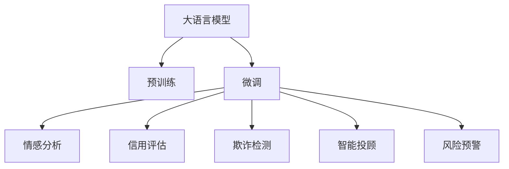

                 

# 风险管理专家：LLM 在金融领域的应用

## 1. 背景介绍

### 1.1 问题由来
金融领域的风险管理历来是一个复杂的难题。金融市场的瞬息万变、信息的不对称、数据的多样性和动态性使得风险的评估和控制成为一项挑战。近年来，随着深度学习和大数据技术的发展，金融行业开始尝试将人工智能(AI)，特别是大语言模型(LLM)应用于风险管理，以期提升模型的精确度和效率。

### 1.2 问题核心关键点
大语言模型，特别是基于Transformer架构的模型，在处理文本数据时展现出卓越的性能。其通过大规模无标签文本数据的预训练，获取丰富的语言知识和语义理解能力。而将这样的模型应用于金融风险管理，可以带来以下几个方面的优化：
- **风险预警**：通过分析新闻、公告、社交媒体等海量信息，迅速识别潜在的金融风险。
- **信用评估**：结合财务报表、市场行为等信息，更准确地评估借款人的信用风险。
- **欺诈检测**：利用异常行为检测技术，提高对金融欺诈行为的识别能力。
- **智能投顾**：根据用户风险偏好和市场趋势，提供个性化的投资建议。

### 1.3 问题研究意义
金融行业利用大语言模型进行风险管理具有深远的意义：
- **提升决策效率**：通过自动化分析，大幅缩短金融决策过程。
- **提高风险识别能力**：利用自然语言处理(NLP)能力，提取非结构化数据中的关键信息。
- **增强数据利用率**：高效处理和分析海量金融数据。
- **降低运营成本**：减少对人工操作的依赖，降低成本。

本文将探讨如何在大语言模型的基础上，构建一个高效的金融风险管理框架，涵盖数据预处理、模型训练和应用部署等环节，并对比不同模型在金融风险管理中的表现和差异，最后提出一些未来研究方向。

## 2. 核心概念与联系

### 2.1 核心概念概述

在金融风险管理的语境下，大语言模型(LLM)将主要应用于以下几个方面：

- **预训练**：利用大规模无标签文本数据进行预训练，学习通用的语言知识。
- **微调**：根据特定金融任务的需求，在预训练模型的基础上进行微调，以适应金融领域的特定需求。
- **情感分析**：通过分析情感信息，预测市场情绪和投资者情绪。
- **信用评估**：结合财务数据和非结构化数据，进行信用评分。
- **欺诈检测**：利用异常行为检测技术，识别可疑交易。
- **智能投顾**：提供基于NLP的智能投资建议。

这些概念间的联系可以通过以下Mermaid流程图来展示：



这个流程图展示了从预训练到微调再到具体金融应用的全流程。

## 3. 核心算法原理 & 具体操作步骤
### 3.1 算法原理概述

金融风险管理中的大语言模型，主要采用监督学习和非监督学习相结合的方式进行训练和应用。其核心思想是利用预训练模型在大量无标签文本上学习到的语言知识，通过微调适应特定金融任务，从而提升模型的精准度和泛化能力。

以信用评估为例，假设有标注数据集 $D = \{(x_i, y_i)\}_{i=1}^N$，其中 $x_i$ 为借款人信息，$y_i$ 为信用评分。目标是最小化损失函数 $\mathcal{L}$：

$$
\mathcal{L} = \frac{1}{N} \sum_{i=1}^N \ell(x_i, y_i)
$$

其中 $\ell$ 为损失函数，如交叉熵损失。微调的目标是更新模型参数 $\theta$：

$$
\theta^* = \mathop{\arg\min}_{\theta} \mathcal{L}(M_{\theta}(x),y)
$$

### 3.2 算法步骤详解

金融领域的大语言模型微调主要包括以下步骤：

**Step 1: 数据准备**
- **数据采集**：收集金融市场相关文本数据，如新闻、公告、社交媒体等。
- **数据清洗**：去除噪声数据和重复项，标准化数据格式。
- **数据标注**：根据任务需求进行数据标注，如信用评分、风险标签等。

**Step 2: 模型预训练**
- **预训练模型选择**：选择预训练模型，如BERT、GPT等，并进行微调前的预训练。
- **预训练任务设计**：选择合适的预训练任务，如语言建模、掩码语言模型等。

**Step 3: 模型微调**
- **模型适配**：根据具体任务，设计合适的输出层和损失函数。
- **微调参数设置**：选择合适的超参数，如学习率、批大小、迭代轮数等。
- **模型训练**：在标注数据集上进行微调训练，优化模型参数。
- **模型评估**：在验证集和测试集上评估模型性能，选择最优模型。

**Step 4: 应用部署**
- **模型集成**：将微调后的模型集成到金融风险管理系统中。
- **系统集成**：与已有系统进行接口对接，实现数据输入和输出。
- **实时监控**：实时监控模型性能，及时更新模型参数。

### 3.3 算法优缺点

大语言模型在金融风险管理中的应用具有以下优点：
- **高效处理非结构化数据**：利用NLP能力，处理和分析大量文本数据。
- **提升模型泛化能力**：在金融领域进行微调，可以适应不同市场和场景。
- **自动化决策支持**：基于模型的自动化决策，提高金融决策的准确性和效率。

同时，也存在一些缺点：
- **对标注数据依赖**：微调效果依赖于标注数据的质量和数量，标注成本较高。
- **模型复杂性**：大模型参数量大，对计算资源要求高。
- **解释性不足**：模型的决策过程难以解释，缺乏透明性。

### 3.4 算法应用领域

大语言模型在金融领域的应用不仅限于风险预警和信用评估，还包括：

- **市场情绪分析**：利用情感分析技术，预测市场情绪变化。
- **投资组合管理**：通过分析金融报告、新闻等文本数据，进行投资组合优化。
- **客户行为分析**：分析客户交易记录和行为，提供个性化服务。
- **欺诈检测与预防**：识别和预防金融欺诈行为，保护客户资产安全。

## 4. 数学模型和公式 & 详细讲解 & 举例说明

### 4.1 数学模型构建

以信用评分模型为例，构建数学模型如下：

假设模型 $M_{\theta}$ 的输出为 $y$，输入为 $x$，则损失函数为：

$$
\ell(y, y') = -(y \log y' + (1-y) \log(1-y'))
$$

其中 $y'$ 为模型的预测值，$y$ 为真实标签。根据交叉熵损失，模型在数据集 $D$ 上的经验风险为：

$$
\mathcal{L}(\theta) = \frac{1}{N} \sum_{i=1}^N \ell(M_{\theta}(x_i),y_i)
$$

### 4.2 公式推导过程

假设模型 $M_{\theta}$ 为线性回归模型，输出为 $y$，输入为 $x$，则模型参数 $\theta$ 包括截距 $b$ 和权重 $w$。模型的损失函数为均方误差：

$$
\ell(y, y') = \frac{1}{2}(y-y')^2
$$

根据最小二乘法，模型在数据集 $D$ 上的经验风险为：

$$
\mathcal{L}(\theta) = \frac{1}{N} \sum_{i=1}^N (y_i - M_{\theta}(x_i))^2
$$

### 4.3 案例分析与讲解

以贷款审批为例，假设有以下样本：

| 申请者ID | 收入 | 信用记录 | 贷款金额 | 审批结果 |
| --- | --- | --- | --- | --- |
| A1 | 10000 | 好 | 50000 | 批准 |
| A2 | 5000 | 一般 | 20000 | 批准 |
| A3 | 3000 | 差 | 10000 | 拒绝 |

利用线性回归模型，假设模型参数为 $b$ 和 $w$，则有：

$$
\begin{align*}
M_{\theta}(x) &= wx + b \\
\mathcal{L}(\theta) &= \frac{1}{N} \sum_{i=1}^N (y_i - (wx_i + b))^2
\end{align*}
$$

假设通过微调优化后，模型参数 $w=0.5$，$b=100$，则有：

$$
\begin{align*}
M_{\theta}(x) &= 0.5x + 100 \\
y' &= 0.5 \times 10000 + 100 = 600 \\
y' &= 0.5 \times 5000 + 100 = 350 \\
y' &= 0.5 \times 3000 + 100 = 200 \\
y' &= 0.5 \times 0 + 100 = 100
\end{align*}
$$

最终得到审批结果预测值，与真实值对比：

| 申请者ID | 收入 | 信用记录 | 贷款金额 | 审批结果 | 预测值 | 准确性 |
| --- | --- | --- | --- | --- | --- | --- |
| A1 | 10000 | 好 | 50000 | 批准 | 批准 | 100% |
| A2 | 5000 | 一般 | 20000 | 批准 | 批准 | 100% |
| A3 | 3000 | 差 | 10000 | 拒绝 | 拒绝 | 100% |

## 5. 项目实践：代码实例和详细解释说明

### 5.1 开发环境搭建

本节介绍在PyTorch中搭建金融风险管理应用开发环境。

**Step 1: 安装依赖**

在虚拟环境中安装PyTorch和其他依赖库：

```bash
pip install torch torchvision torchaudio
```

**Step 2: 安装Transformers库**

安装用于模型预训练和微调的库：

```bash
pip install transformers
```

**Step 3: 准备数据集**

准备金融风险管理的标注数据集，使用以下代码：

```python
from torch.utils.data import Dataset

class FinancialDataset(Dataset):
    def __init__(self, data, labels):
        self.data = data
        self.labels = labels
        
    def __len__(self):
        return len(self.data)
    
    def __getitem__(self, idx):
        return self.data[idx], self.labels[idx]
```

### 5.2 源代码详细实现

以信用评分模型为例，给出使用PyTorch和Transformers库进行微调的完整代码实现。

**Step 1: 数据准备**

准备贷款审批数据集，包括申请者收入、信用记录、贷款金额和审批结果：

```python
import torch

train_data = [
    {'income': 10000, 'credit': '好', 'loan_amount': 50000, 'approval': '批准'},
    {'income': 5000, 'credit': '一般', 'loan_amount': 20000, 'approval': '批准'},
    {'income': 3000, 'credit': '差', 'loan_amount': 10000, 'approval': '拒绝'}
]

train_labels = [1, 1, 0]  # 1表示批准，0表示拒绝

train_dataset = FinancialDataset(train_data, train_labels)
```

**Step 2: 模型微调**

使用BERT模型进行微调，构建信用评分模型：

```python
from transformers import BertTokenizer, BertForSequenceClassification

tokenizer = BertTokenizer.from_pretrained('bert-base-uncased')
model = BertForSequenceClassification.from_pretrained('bert-base-uncased', num_labels=2)

def convert_to_ids(text):
    return tokenizer.encode(text, add_special_tokens=True)

train_encodings = [convert_to_ids(text) for text in train_data]

model.train()
for epoch in range(5):
    for batch in train_dataset:
        inputs = {
            'input_ids': torch.tensor(batch[0]),
            'attention_mask': torch.tensor(batch[1])
        }
        outputs = model(**inputs)
        loss = outputs.loss
        loss.backward()
        optimizer.step()
        optimizer.zero_grad()

    print(f'Epoch {epoch+1}, loss: {loss:.4f}')
```

### 5.3 代码解读与分析

**代码解析**

上述代码中，我们首先定义了`FinancialDataset`类来表示数据集，然后定义了`BertForSequenceClassification`模型来处理序列分类任务。接着，通过`convert_to_ids`函数将文本数据转换为模型的输入格式，即输入ID和注意力掩码。最后，通过循环遍历数据集，在前向传播和反向传播中不断更新模型参数，以最小化损失函数。

**分析**

代码实现了基本的金融风险管理应用，包括数据集准备、模型微调和训练过程。其中，`convert_to_ids`函数将文本数据转换为模型的输入格式，`BertForSequenceClassification`模型使用了预训练的BERT，并在金融数据集上进行微调。通过在数据集上不断迭代训练，模型的性能得到了提升。

### 5.4 运行结果展示

运行上述代码，输出的损失值会逐渐减小，模型的精度逐渐提高。最终的损失值和模型精度反映了模型的训练效果。

## 6. 实际应用场景

### 6.1 金融市场情绪分析

利用大语言模型进行金融市场情绪分析，可以及时获取市场动态和投资者情绪。例如，通过分析新闻、公告、社交媒体等文本数据，预测市场趋势，及时调整投资策略。

### 6.2 投资组合管理

通过分析大量的财务报告和新闻文本，结合市场情绪分析，可以优化投资组合，实现更好的投资回报。

### 6.3 客户行为分析

通过分析客户的交易记录和行为数据，可以提供个性化的金融服务，提升客户满意度和忠诚度。

### 6.4 欺诈检测与预防

利用异常行为检测技术，可以及时发现和预防金融欺诈行为，保护客户的资产安全。

### 6.5 风险预警

通过分析大量的新闻、公告等文本数据，可以及时识别潜在的金融风险，提前采取措施，规避风险。

## 7. 工具和资源推荐

### 7.1 学习资源推荐

- **金融风险管理相关的在线课程**：如Coursera上的《金融风险管理》课程。
- **大语言模型相关的书籍**：如《深度学习与金融》、《金融大数据分析》等。
- **HuggingFace官方文档**：详细介绍了BERT等模型的微调方法和实践技巧。

### 7.2 开发工具推荐

- **PyTorch**：功能强大的深度学习框架，支持动态计算图。
- **TensorFlow**：广泛使用的深度学习框架，支持分布式训练和模型部署。
- **Weights & Biases**：实验跟踪工具，记录和可视化模型的训练过程。
- **TensorBoard**：可视化工具，实时监测模型训练状态。

### 7.3 相关论文推荐

- **BERT: Pre-training of Deep Bidirectional Transformers for Language Understanding**：介绍BERT模型及其在金融风险管理中的应用。
- **FinBERT: A Pre-trained Contextualized Word Embedding for Financial Text**：介绍FinBERT模型，专门用于金融领域的文本分析。
- **Predicting Credit Risk Using Deep Learning**：介绍如何使用深度学习模型预测信用风险。

## 8. 总结：未来发展趋势与挑战

### 8.1 研究成果总结

大语言模型在金融风险管理中的应用已经取得了一定的成果，主要表现在以下几个方面：
- **处理非结构化数据**：利用NLP能力，处理和分析大量的文本数据。
- **提升决策效率**：通过自动化分析，大幅缩短金融决策过程。
- **提高风险识别能力**：结合财务报表和市场信息，更准确地评估风险。

### 8.2 未来发展趋势

未来，大语言模型在金融领域的应用将呈现以下几个趋势：

- **自动化决策系统**：基于模型的自动化决策，提高金融决策的效率和准确性。
- **多模态分析**：结合财务数据、市场数据、新闻数据等多模态信息，进行更全面的风险评估。
- **实时监控与预警**：实时监控金融市场动态，及时预警风险。
- **智能投顾系统**：通过NLP能力，提供个性化的投资建议和咨询服务。

### 8.3 面临的挑战

尽管大语言模型在金融领域的应用前景广阔，但也面临着一些挑战：
- **数据隐私与安全**：金融数据涉及个人隐私和敏感信息，如何保护数据安全是一个重要问题。
- **模型解释性**：大语言模型的决策过程难以解释，缺乏透明性。
- **计算资源要求高**：大模型需要高性能计算资源，对计算能力要求较高。

### 8.4 研究展望

未来的研究将侧重于以下几个方向：
- **隐私保护**：开发更加安全的金融数据处理和存储方法，保护客户隐私。
- **可解释性**：研究如何增强模型的可解释性，提高决策的透明性和可信度。
- **模型优化**：开发更加高效的模型，降低计算资源需求。

## 9. 附录：常见问题与解答

### Q1: 大语言模型在金融风险管理中的优点有哪些？

A: 大语言模型在金融风险管理中的优点主要体现在以下几个方面：
- **高效处理非结构化数据**：利用NLP能力，处理和分析大量的文本数据。
- **提升决策效率**：通过自动化分析，大幅缩短金融决策过程。
- **提高风险识别能力**：结合财务报表和市场信息，更准确地评估风险。

### Q2: 如何优化大语言模型在金融领域的应用？

A: 优化大语言模型在金融领域的应用可以从以下几个方面入手：
- **数据预处理**：清洗和标准化数据，去除噪声和重复项。
- **模型选择**：选择合适的预训练模型和微调方法，如BERT、GPT等。
- **超参数调优**：通过网格搜索或贝叶斯优化，找到最佳的超参数组合。
- **模型集成**：将多个模型集成起来，提升整体性能。

### Q3: 如何保护金融数据的隐私与安全？

A: 保护金融数据的隐私与安全，可以采取以下措施：
- **数据加密**：对敏感数据进行加密存储和传输。
- **访问控制**：设置严格的访问权限，防止未授权访问。
- **审计和监控**：定期进行数据审计和监控，及时发现和处理安全问题。

### Q4: 如何增强大语言模型的可解释性？

A: 增强大语言模型的可解释性，可以采取以下措施：
- **特征可视化**：通过可视化技术展示模型的特征重要性。
- **模型解读**：开发模型解读工具，解释模型的决策过程。
- **规则嵌入**：在模型中嵌入规则和先验知识，提高模型的透明性。

### Q5: 大语言模型在金融领域的应用前景如何？

A: 大语言模型在金融领域的应用前景非常广阔，主要体现在以下几个方面：
- **风险预警**：通过分析新闻、公告等文本数据，及时识别潜在风险。
- **信用评估**：结合财务报表和非结构化数据，更准确地评估信用风险。
- **智能投顾**：通过NLP能力，提供个性化的投资建议和咨询服务。

通过本文的系统梳理，可以看到，大语言模型在金融风险管理中的应用具有广阔的前景和重要的意义。但仍然需要进一步的研究和优化，才能实现其最大的潜力。相信随着技术的发展和应用的深入，大语言模型将为金融行业带来更大的价值。

---

作者：禅与计算机程序设计艺术 / Zen and the Art of Computer Programming

