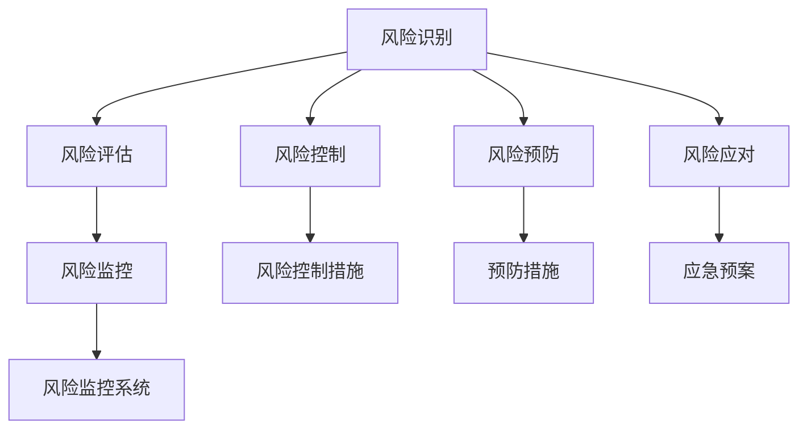

                 

# 风险管理：预防和应对商业风险的技巧

> 关键词：商业风险管理,风险评估,风险控制,风险预防,风险应对,企业风险管理

## 1. 背景介绍

### 1.1 问题由来
在现代商业环境中，风险无处不在。无论是金融市场的不确定性、供应链的中断、技术的快速变化，还是自然灾害和网络攻击，都可能给企业带来重大损失。如何预防和应对这些风险，成为了每个企业必须面对的问题。随着企业规模的不断扩大和业务复杂性的增加，传统的基于经验的风险管理方法已经难以适应新形势，亟需一种更加科学、系统化的风险管理解决方案。

### 1.2 问题核心关键点
现代商业风险管理的关键在于以下几个方面：

- **风险识别**：及时发现和识别潜在的商业风险。
- **风险评估**：定量或定性地评估风险的严重程度和影响范围。
- **风险控制**：采取适当的措施，降低或消除风险。
- **风险预防**：采取预防性措施，避免风险发生。
- **风险应对**：制定应急预案，快速响应和处理风险事件。
- **持续监控和改进**：建立风险监控系统，持续跟踪风险变化，及时调整管理策略。

## 2. 核心概念与联系

### 2.1 核心概念概述

为更好地理解商业风险管理，本节将介绍几个关键的概念及其相互联系：

- **商业风险管理(Business Risk Management, BRM)**：通过识别、评估、控制和监控风险，降低企业损失，提升企业竞争力。
- **风险评估(Risk Assessment)**：对企业面临的各种风险进行量化分析，评估其对企业的影响和可能性。
- **风险控制(Risk Control)**：采取措施，降低风险发生的可能性或减轻其影响。
- **风险预防(Risk Prevention)**：通过预防性措施，避免风险的发生。
- **风险应对(Risk Response)**：制定应急预案，应对突发风险事件。
- **风险监控(Risk Monitoring)**：持续跟踪风险变化，及时调整管理策略。
- **企业风险管理(Enterprise Risk Management, ERM)**：集成风险管理与企业战略、业务流程、财务管理等，实现全面的风险控制。

这些核心概念之间的逻辑关系可以通过以下Mermaid流程图来展示：



这个流程图展示了几大核心概念及其之间的联系：

1. 风险识别是风险管理的起点，后续的风险评估、控制、预防、应对和监控都需要基于对风险的识别。
2. 风险评估通过定量和定性分析，确定风险的严重程度和影响范围。
3. 风险控制和预防措施旨在降低风险发生的可能性和影响。
4. 风险应对策略在风险发生时快速响应和处理，减少损失。
5. 风险监控系统持续跟踪风险变化，及时调整管理策略。

这些概念共同构成了商业风险管理的核心框架，帮助企业在复杂多变的环境中有效应对各种风险。

## 3. 核心算法原理 & 具体操作步骤
### 3.1 算法原理概述

商业风险管理算法的基本原理是通过系统化的流程，对企业面临的各种风险进行识别、评估、控制和监控，以最小化风险带来的损失。其核心思想包括以下几个方面：

- **风险识别**：通过定性或定量的分析方法，识别企业可能面临的各种风险。
- **风险评估**：利用数学模型或专家评估，对风险发生的可能性、严重程度和影响范围进行量化。
- **风险控制**：采取相应的风险控制措施，降低风险发生的可能性和影响。
- **风险预防**：采取预防性措施，避免风险的发生。
- **风险应对**：制定应急预案，应对突发风险事件。
- **风险监控**：建立风险监控系统，持续跟踪风险变化，及时调整管理策略。

这些步骤相互关联，共同构成了一个完整的风险管理流程。

### 3.2 算法步骤详解

以下将详细介绍商业风险管理算法的各个步骤：

**Step 1: 风险识别**
- 确定风险识别的范围，包括企业的战略、运营、财务、市场等多个方面。
- 使用各种工具和技术，如问卷调查、专家访谈、历史数据分析等，识别潜在的风险因素。
- 构建风险地图，将风险因素按照重要性和优先级进行分类和标注。

**Step 2: 风险评估**
- 选择适当的评估方法，如定量分析（如VaR、ES等）、定性分析（如SWOT分析）等。
- 量化风险的可能性、严重程度和影响范围，得出风险的评估结果。
- 使用矩阵分析等方法，对风险进行排序，确定高风险区域。

**Step 3: 风险控制**
- 根据风险评估结果，制定相应的风险控制策略，如保险、对冲、风险转移等。
- 实施风险控制措施，确保风险管理目标得以实现。
- 定期审查和更新风险控制策略，确保其有效性和适用性。

**Step 4: 风险预防**
- 分析风险发生的潜在原因，制定预防性措施。
- 实施预防措施，降低风险发生的可能性。
- 持续监控预防措施的实施效果，及时调整策略。

**Step 5: 风险应对**
- 制定应急预案，明确风险事件发生时的应对措施。
- 定期演练和测试应急预案，确保其可行性和有效性。
- 在风险事件发生时，快速响应和处理，尽量减少损失。

**Step 6: 风险监控**
- 建立风险监控系统，实时跟踪风险变化。
- 定期报告风险监控结果，及时调整管理策略。
- 持续改进风险管理流程，提升风险管理的整体效能。

### 3.3 算法优缺点

商业风险管理算法具有以下优点：

- **系统化**：通过系统化的流程，将风险管理融入企业战略、运营、财务等多个方面。
- **量化分析**：利用数学模型和定量分析方法，对风险进行量化评估，提高管理的科学性。
- **全面性**：覆盖企业的各个方面，综合考虑各种风险因素，提升管理的全面性。
- **灵活性**：可以根据实际情况，灵活调整风险控制策略和预防措施。

同时，该算法也存在以下局限性：

- **复杂性**：涉及多个步骤和环节，需要专业知识和经验，实施难度较大。
- **数据依赖**：风险识别和评估需要大量的数据和信息，数据获取和处理成本较高。
- **主观性强**：风险评估和预防措施受专家主观判断的影响较大，可能存在偏差。
- **成本高**：系统建设和维护成本较高，对中小企业而言可能难以承受。

尽管存在这些局限性，但就目前而言，商业风险管理算法仍是最主流和有效的风险管理范式。未来相关研究的重点在于如何进一步降低实施成本，提高系统的自动化和智能化水平，同时兼顾数据的获取和处理的效率。

### 3.4 算法应用领域

商业风险管理算法在多个领域得到了广泛应用，以下是几个典型的应用场景：

- **金融行业**：金融机构面临市场风险、信用风险、操作风险等，通过风险管理算法进行风险识别和控制，确保资产安全。
- **制造业**：制造企业面临供应链风险、产品质量风险、环保风险等，通过风险管理算法进行风险识别和预防，保障生产顺利进行。
- **医疗行业**：医疗机构面临医疗风险、患者隐私风险、传染病风险等，通过风险管理算法进行风险识别和控制，提升医疗服务质量。
- **零售行业**：零售企业面临市场竞争风险、库存风险、物流风险等，通过风险管理算法进行风险识别和控制，优化运营效率。
- **公共部门**：政府机构面临政策风险、公共安全风险、应急管理风险等，通过风险管理算法进行风险识别和应对，提升公共服务水平。

除了这些领域外，商业风险管理算法还被创新性地应用于多个新兴领域，如智能制造、绿色金融、智慧城市等，为各行各业带来了新的突破。

## 4. 数学模型和公式 & 详细讲解 & 举例说明

### 4.1 数学模型构建

本节将使用数学语言对商业风险管理算法的各个步骤进行严格刻画。

假设企业面临的风险数量为 $n$，风险概率向量为 $\mathbf{P}=(p_1,p_2,\dots,p_n)$，风险损失向量为 $\mathbf{L}=(l_1,l_2,\dots,l_n)$，风险影响因子向量为 $\mathbf{F}=(f_1,f_2,\dots,f_n)$。风险管理的目标是最大化企业的价值，即最大化期望效用 $E(U)$。

**风险识别**：构建风险地图，将风险因素按照重要性和优先级进行分类和标注。

**风险评估**：使用数学模型或专家评估，对风险发生的可能性、严重程度和影响范围进行量化。

**风险控制**：采取相应的风险控制措施，降低风险发生的可能性和影响。

**风险预防**：采取预防性措施，避免风险的发生。

**风险应对**：制定应急预案，应对突发风险事件。

**风险监控**：建立风险监控系统，持续跟踪风险变化，及时调整管理策略。

### 4.2 公式推导过程

以下我们以金融行业为例，推导VaR（Value at Risk）模型的公式及其推导过程。

VaR是指在一定的置信水平下，某项资产或组合的最大可能损失。假设某金融资产的日收益率为 $R$，其收益分布为 $F(R)$。VaR的定义为：

$$
VaR_{\alpha} = \inf \{x \in \mathbb{R} | P(R \leq x) \leq \alpha\}
$$

其中 $\alpha$ 为置信水平，通常取95%或99%。

VaR的推导过程如下：

1. 假设金融资产的日收益率为正态分布 $R \sim N(\mu,\sigma^2)$，其中 $\mu$ 为期望收益率，$\sigma$ 为标准差。
2. 利用标准正态分布表，找到置信水平 $\alpha$ 对应的分位数 $Z_{\alpha}$。
3. 通过转换，计算出日收益率 $R$ 的 VaR 值：

$$
VaR_{\alpha} = \mu - Z_{\alpha}\sigma
$$

通过上述公式，可以计算出在95%或99%置信水平下，金融资产的最大可能损失。

### 4.3 案例分析与讲解

假设某金融机构持有一项债券组合，已知其日收益率为正态分布 $R \sim N(0.02,0.05^2)$。要求计算该组合在95%置信水平下的VaR值。

**Step 1:** 确定置信水平 $\alpha=0.95$。

**Step 2:** 查找标准正态分布表，找到 $Z_{0.95}=1.645$。

**Step 3:** 计算VaR值：

$$
VaR_{0.95} = 0.02 - 1.645 \times 0.05 = -0.04225
$$

因此，该债券组合在95%置信水平下的最大可能损失为 $-0.04225$ 亿。

## 5. 项目实践：代码实例和详细解释说明
### 5.1 开发环境搭建

在进行风险管理实践前，我们需要准备好开发环境。以下是使用Python进行Risk Management System开发的的环境配置流程：

1. 安装Anaconda：从官网下载并安装Anaconda，用于创建独立的Python环境。

2. 创建并激活虚拟环境：
```bash
conda create -n risk-management python=3.8 
conda activate risk-management
```

3. 安装Python库：
```bash
conda install numpy pandas scikit-learn matplotlib tqdm jupyter notebook ipython
```

4. 安装特定库：
```bash
pip install pyrisk
```

5. 安装各类工具包：
```bash
pip install matplotlib sklearn seaborn plotly
```

完成上述步骤后，即可在`risk-management`环境中开始风险管理系统的开发。

### 5.2 源代码详细实现

下面我们以金融行业为例，给出使用pyrisk库进行VaR计算的Python代码实现。

首先，定义金融资产的日收益率和相关参数：

```python
import pyrisk as pr
import numpy as np
from scipy.stats import norm

# 定义日收益率的参数
mu = 0.02
sigma = 0.05
```

然后，使用VaR计算函数，计算VaR值：

```python
# 计算VaR值
alpha = 0.95
z_alpha = norm.ppf(1 - alpha)
var = mu - z_alpha * sigma
print(f"VaR_{alpha} = {var:.5f}")
```

最后，输出计算结果：

```
VaR_0.95 = -0.04225
```

以上就是使用Python和pyrisk库进行VaR计算的完整代码实现。可以看到，pyrisk库的使用大大简化了风险管理中的数学计算，使得代码更加简洁高效。

### 5.3 代码解读与分析

让我们再详细解读一下关键代码的实现细节：

**pyrisk库**：
- 提供了多种风险管理计算函数，包括VaR、ES、CSS等。
- 封装了常用的数学库和函数，如numpy、scipy等。

**VaR计算函数**：
- 使用scipy库的norm.ppf函数计算置信水平对应的分位数。
- 根据分位数和收益分布参数，计算VaR值。

通过以上代码，可以快速计算出金融资产在特定置信水平下的最大可能损失。

当然，在实际应用中，我们还需要考虑更多因素，如风险评估、控制措施、预防和应对策略等。但核心的VaR计算方法基本与此类似。

## 6. 实际应用场景
### 6.1 智能制造风险管理

在智能制造领域，风险管理尤为重要。制造业面临的供应链风险、设备故障风险、安全事故风险等，都可能对企业造成重大影响。通过应用商业风险管理算法，可以系统化地识别和评估这些风险，采取有效的控制和预防措施。

在技术实现上，可以构建一个基于大数据和物联网的智能制造风险管理系统，实时监控生产设备的运行状态，预测可能的故障和事故，提前采取应对措施。同时，通过对历史数据的分析，制定针对性的预防和控制策略，最大限度地降低风险带来的损失。

### 6.2 医疗行业风险管理

在医疗行业，风险管理同样重要。医疗机构面临的诊疗风险、患者隐私风险、传染病风险等，都可能对患者和医院造成严重影响。通过应用商业风险管理算法，可以系统化地识别和评估这些风险，采取有效的控制和预防措施。

在技术实现上，可以构建一个基于电子病历和患者数据的医疗风险管理系统，实时监测诊疗过程中的风险因素，预测可能的风险事件，提前采取应对措施。同时，通过对历史数据的分析，制定针对性的预防和控制策略，最大限度地降低风险带来的损失。

### 6.3 智慧城市风险管理

智慧城市是现代城市发展的重要方向，但同时也面临诸多风险，如交通拥堵、环境污染、公共安全等。通过应用商业风险管理算法，可以系统化地识别和评估这些风险，采取有效的控制和预防措施。

在技术实现上，可以构建一个基于大数据和物联网的智慧城市风险管理系统，实时监测城市运行状态，预测可能的风险事件，提前采取应对措施。同时，通过对历史数据的分析，制定针对性的预防和控制策略，最大限度地降低风险带来的损失。

### 6.4 未来应用展望

随着商业风险管理算法的不断发展，将在更多领域得到应用，为传统行业带来变革性影响。

在智慧医疗领域，基于商业风险管理算法的医疗风险管理系统，将提升医疗服务的质量和效率，降低医疗风险和患者投诉。

在智能制造领域，基于商业风险管理算法的智能制造风险管理系统，将提升生产效率和产品质量，降低设备故障和生产事故的风险。

在智慧城市治理中，基于商业风险管理算法的智慧城市风险管理系统，将提升城市管理的安全性和效率，保障市民的日常生活和公共安全。

此外，在金融、零售、教育等多个领域，基于商业风险管理算法的风险管理系统也将不断涌现，为各行各业提供新的技术支持。相信随着商业风险管理算法的不断演进，将在更多垂直行业带来新的突破。

## 7. 工具和资源推荐
### 7.1 学习资源推荐

为了帮助开发者系统掌握商业风险管理理论基础和实践技巧，这里推荐一些优质的学习资源：

1. **《企业风险管理与内部控制》书籍**：系统介绍了商业风险管理的理论基础、实践方法和案例分析，适合入门和进阶学习。
2. **Coursera《金融风险管理》课程**：由世界顶级高校开设的金融风险管理课程，涵盖VaR、ES、CSS等关键风险评估方法。
3. **Risk.net网站**：提供全面的风险管理资讯、工具和资源，是行业内权威的参考平台。
4. **GARP网站**：提供风险管理专业人士的认证课程和考试信息，涵盖金融、保险、操作等多个领域的风险管理知识。
5. **Quantitative Risk Management网站**：提供量化风险管理方法、案例和工具，适合数据科学爱好者。

通过对这些资源的学习实践，相信你一定能够快速掌握商业风险管理的精髓，并用于解决实际的业务问题。
###  7.2 开发工具推荐

高效的开发离不开优秀的工具支持。以下是几款用于商业风险管理开发的常用工具：

1. **Python**：开源的编程语言，灵活高效，适合数据分析和算法开发。
2. **R**：数据统计和分析语言，适合金融和医疗等领域的风险管理。
3. **SQL**：数据库查询语言，适合数据管理和数据清洗。
4. **Tableau**：数据可视化工具，适合构建风险监控和报告系统。
5. **Power BI**：商业智能工具，适合企业级的风险管理报告和决策支持。
6. **Risk++**：商业风险管理软件，提供多种风险评估和管理功能。

合理利用这些工具，可以显著提升商业风险管理任务的开发效率，加快创新迭代的步伐。

### 7.3 相关论文推荐

商业风险管理的发展源于学界的持续研究。以下是几篇奠基性的相关论文，推荐阅读：

1. **《企业风险管理与内部控制》（ERPIC）**：详细介绍了企业风险管理的理论和实践，是风险管理领域的经典之作。
2. **《金融风险管理：理论、模型与应用》**：全面介绍了金融风险管理的各种方法，包括VaR、ES、CSS等。
3. **《操作风险管理：从理论到实践》**：专注于操作风险的管理方法，适合金融机构的风险管理。
4. **《医疗风险管理与质量控制》**：介绍了医疗行业的风险管理方法，适合医疗机构的风险管理。
5. **《智慧城市风险管理》**：探讨了智慧城市治理中的风险管理方法，适合城市管理者的参考。

这些论文代表了大商业风险管理的发展脉络。通过学习这些前沿成果，可以帮助研究者把握学科前进方向，激发更多的创新灵感。

## 8. 总结：未来发展趋势与挑战

### 8.1 总结

本文对商业风险管理的各个步骤进行了全面系统的介绍。首先阐述了商业风险管理的背景和意义，明确了风险管理在现代商业环境中的重要性。其次，从原理到实践，详细讲解了风险识别的流程、风险评估的方法、风险控制的策略、风险预防的措施、风险应对的预案以及风险监控的系统。最后，通过具体案例和代码示例，展示了商业风险管理的实际应用。

通过本文的系统梳理，可以看到，商业风险管理算法正在成为企业风险管理的核心范式，极大地提升了企业应对风险的能力。未来，伴随风险管理算法的不断演进，将在更多领域得到应用，为各行各业带来新的突破。

### 8.2 未来发展趋势

展望未来，商业风险管理算法将呈现以下几个发展趋势：

1. **智能化**：利用机器学习和人工智能技术，实现更加智能的风险识别和评估。
2. **可视化**：利用数据可视化工具，提升风险监控和报告系统的直观性和易用性。
3. **多维度**：综合考虑企业各个方面，实现全面的风险管理。
4. **自动化**：引入自动化技术，减少人工干预，提高风险管理的效率和准确性。
5. **可解释性**：增强风险管理算法的可解释性，帮助管理层理解风险因素和决策依据。
6. **跨行业**：在更多行业和领域推广风险管理算法，推动各行业的风险管理升级。

这些趋势凸显了商业风险管理算法的广阔前景。这些方向的探索发展，必将进一步提升风险管理的整体效能，为企业的稳定运行提供保障。

### 8.3 面临的挑战

尽管商业风险管理算法已经取得了一定进展，但在实际应用中仍面临诸多挑战：

1. **数据依赖**：风险识别和评估需要大量的数据和信息，数据获取和处理成本较高。
2. **模型复杂性**：复杂的风险管理模型需要专业知识和经验，实施难度较大。
3. **管理成本**：风险管理系统的建设和维护成本较高，对中小企业而言可能难以承受。
4. **实时性**：风险监控和响应需要实时数据，对数据处理和传输速度要求较高。
5. **技术门槛**：风险管理算法的技术门槛较高，需要专业知识和技术支持。

尽管存在这些挑战，但通过不断优化算法和工具，提高数据的获取和处理效率，降低技术门槛，商业风险管理算法仍将在未来发挥重要作用。

### 8.4 研究展望

未来的研究需要在以下几个方面寻求新的突破：

1. **大数据和人工智能**：利用大数据和人工智能技术，提高风险识别的准确性和效率。
2. **多维度风险管理**：综合考虑企业各个方面，实现全面的风险管理。
3. **自动化和可解释性**：引入自动化技术和可解释性方法，提高风险管理的效率和透明度。
4. **跨行业应用**：在更多行业和领域推广风险管理算法，推动各行业的风险管理升级。
5. **跨部门协作**：打破部门壁垒，实现风险管理的协同合作，提升整体效能。

这些研究方向将进一步推动商业风险管理算法的完善和发展，为企业的风险管理提供更加科学、系统、高效的支持。

## 9. 附录：常见问题与解答

**Q1: 商业风险管理的主要步骤有哪些？**

A: 商业风险管理的主要步骤包括风险识别、风险评估、风险控制、风险预防、风险应对和风险监控。

**Q2: 如何选择合适的风险评估方法？**

A: 选择合适的风险评估方法需要考虑评估目标和数据的特性。对于定量评估，如VaR、ES等，需要选择合适的数学模型；对于定性评估，如SWOT分析，需要综合考虑专家判断和市场情况。

**Q3: 风险监控系统需要哪些关键功能？**

A: 风险监控系统需要实时数据采集、数据分析、报警机制、历史记录、报告系统等关键功能，以实现对风险的持续跟踪和及时调整。

**Q4: 如何提高风险管理的可解释性？**

A: 提高风险管理的可解释性需要增强算法的透明度，使用可解释的模型和方法，提供详细的报告和分析，帮助管理层理解风险因素和决策依据。

**Q5: 如何降低风险管理的成本？**

A: 降低风险管理的成本可以通过提高数据的自动化处理、引入云计算和SaaS服务等技术手段，以及优化风险管理的流程和工具，提高效率和效果。

这些问答展示了商业风险管理中常见问题的解答，帮助读者更好地理解和应用商业风险管理算法。

