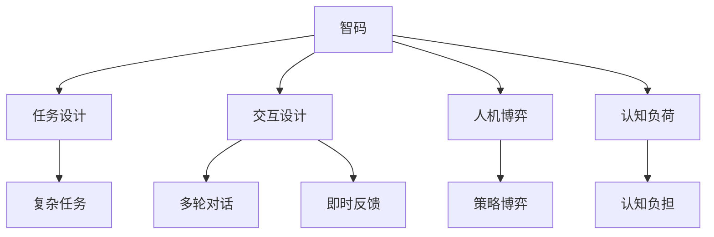

                 

# 验证码：人机交互中的智慧博弈

## 1. 背景介绍

### 1.1 问题由来
随着数字化进程的加速，网络互动日益频繁。为了保护系统安全，防止机器人恶意攻击，网站和服务提供商纷纷采取了验证码机制。验证码本质上是一种基于用户操作行为和先验知识的验证手段，旨在通过增加人机交互的复杂性，防止自动化脚本的滥用。然而，传统的验证码大多采用简单的图像识别或输入数字/字母的挑战，并不能真正衡量用户操作的智慧程度。为此，近年来在人工智能领域兴起了智慧验证码(智码)的研究，探索如何通过增强挑战和交互方式，实现更高水平的安全验证。

### 1.2 问题核心关键点
智码系统旨在通过提供更复杂、更具挑战性的验证问题，引导用户使用智慧和创造力来解决问题。这不仅提升了安全防护的难度，也挑战了计算机的自动化能力。智码系统可以从两个维度进行设计：
1. **任务设计**：创造性地设计复杂的任务，需要用户超越简单的文本识别或逻辑推理，而是结合多领域知识、问题解决能力进行综合分析。
2. **交互设计**：增加用户与系统的互动环节，通过多轮对话、即时反馈等手段，使验证过程更加动态、个性化，同时减少对用户的干扰和负担。

### 1.3 问题研究意义
研究智码系统的设计与实现，对于提升网络安全防御、促进人机交互设计、推动人工智能技术应用具有重要意义：

1. **提升网络安全**：通过设计更高难度的任务，可以有效防止自动化攻击，保障网络系统的安全稳定。
2. **优化人机交互**：智码系统需要精心设计，以减少对用户的干扰和负担，提升用户体验。
3. **推动AI应用**：智码系统为人工智能技术在实际场景中的应用提供了新的试验场，有助于挖掘和展示AI技术的潜力。
4. **促进跨学科融合**：智码设计涉及语言学、心理学、认知科学等多学科知识，促进了不同领域的交叉研究。

## 2. 核心概念与联系

### 2.1 核心概念概述

为了深入理解智码系统的设计与实现，本节将介绍几个关键概念及其相互联系：

- **智码(智慧验证码)**：一种结合了复杂任务设计和交互机制的验证码系统，旨在通过多轮对话和综合知识验证用户的智慧和创造力。
- **任务设计**：创造性地设计需要用户结合多领域知识解决问题的新颖任务，挑战计算机自动化能力。
- **交互设计**：通过多轮对话、即时反馈等手段，动态、个性化地引导用户解决问题，同时减轻用户负担。
- **人机博弈**：通过智码系统，人机之间在验证过程中的策略博弈，展示出智慧和创造力的比拼。
- **认知负荷**：用户在解决智码任务时面临的认知负担，需要合理设计任务难度，避免过载。

这些概念之间的逻辑关系可以通过以下Mermaid流程图来展示：



这个流程图展示了智码系统的核心概念及其之间的关系：

1. 智码系统通过任务设计来创造复杂的挑战，以检验用户的智慧。
2. 交互设计使验证过程更加动态、个性化，同时减轻用户负担。
3. 人机博弈展示了智码任务中的人机策略互动。
4. 认知负荷关系到任务难度和用户体验，需要在设计时进行合理控制。

## 3. 核心算法原理 & 具体操作步骤
### 3.1 算法原理概述

智码系统的设计基于两个关键原则：复杂任务的设计和交互机制的优化。其核心算法可以概括为以下几点：

1. **任务设计**：创造需要结合多领域知识解决的新颖任务。例如，需要用户从一组随机的命名实体中，选择符合特定条件的实体进行关联。
2. **交互设计**：通过多轮对话和即时反馈机制，引导用户逐步接近正确答案。
3. **认知负荷控制**：设计任务时，需注意控制任务的复杂度和认知负荷，以确保用户能够正确完成智码任务。

### 3.2 算法步骤详解

智码系统的设计和实施通常包括以下几个关键步骤：

**Step 1: 确定任务目标**
- 明确智码任务需要验证的智慧和创造力类型，如逻辑推理、多轮对话、主题关联等。
- 确定任务的具体形式，如问题描述、示例数据、答案格式等。

**Step 2: 创建任务库**
- 收集和筛选适合智码任务的多领域知识数据，如命名实体、关键词、主题、事件等。
- 对数据进行标注和编码，构建任务库。

**Step 3: 设计交互流程**
- 设计多轮对话流程，包括对话轮数、信息展示方式、用户输入格式等。
- 实现即时反馈机制，如在每轮对话后提供正确性反馈和提示信息。

**Step 4: 实施和测试**
- 将设计好的智码系统部署到生产环境，收集用户反馈和性能数据。
- 根据反馈进行迭代优化，确保系统的易用性和安全性。

**Step 5: 持续监控和更新**
- 持续监控智码系统的使用情况和安全性。
- 根据最新的攻击手段和技术，定期更新任务库和交互机制。

### 3.3 算法优缺点

智码系统相较于传统验证码，有以下优点：
1. 难度更高：智码任务设计复杂，难以被自动化脚本解决。
2. 更具挑战性：需要用户结合多领域知识解决问题，展示出真正的智慧和创造力。
3. 用户体验提升：通过优化交互设计，减轻用户负担，提升使用体验。
4. 动态安全防护：结合多轮对话和即时反馈，动态调整验证难度，适应不同用户。

同时，智码系统也存在以下局限：
1. 设计复杂：智码任务设计需要多学科知识，难度较高。
2. 用户适应性：部分用户可能对复杂任务不适应，影响使用体验。
3. 安全性挑战：需要不断更新任务库和交互机制，以应对新的攻击手段。
4. 实现难度：需要丰富的开发资源和工程实践，才能实现高效、安全的智码系统。

尽管存在这些局限性，智码系统在提升网络安全防御、优化人机交互设计方面展现了巨大潜力，值得进一步研究和推广。

### 3.4 算法应用领域

智码系统的设计理念和实现方法，已经在多个领域得到了应用：

- **在线广告**：广告平台通过智码系统，防止自动化广告点击和欺诈行为。
- **金融交易**：金融机构通过智码验证，防止机器人交易和身份冒充。
- **社交媒体**：社交平台通过智码系统，防止机器人滥用账户、恶意发言等。
- **游戏和娱乐**：游戏和娱乐应用通过智码任务，提升用户互动性和安全性。
- **智能客服**：客服系统通过智码验证，确认用户身份和意图，提升服务质量。

智码系统在上述领域的应用，展示了其在提升安全和优化用户体验方面的重要价值。未来，随着智码技术的进一步发展，其应用范围将更加广泛，涵盖更多场景和需求。

## 4. 数学模型和公式 & 详细讲解
### 4.1 数学模型构建

智码系统的设计依赖于多领域知识库和复杂的任务设计。以下是一个简化的数学模型，用于描述智码系统的任务设计和交互过程：

假设智码任务为 $T$，需要用户从 $N$ 个命名实体中选择符合特定条件的实体进行关联。设用户选择的实体为 $X$，任务所需的目标实体为 $Y$，用户每轮对话后选择实体的概率为 $p(x|y)$，实体的相关度为 $w(x,y)$，用户对话轮数为 $k$。任务的目标是最大化选择正确实体的概率，即：

$$
\max_{X} p(X|Y) = \max_{X} \prod_{k=1}^{K} p(X_k|X_{k-1},Y)
$$

其中 $X_k$ 表示用户在第 $k$ 轮对话后选择的实体。

### 4.2 公式推导过程

智码系统的交互过程可以通过马尔可夫链模型进行描述。设用户对话轮数为 $K$，用户每轮对话后选择实体的概率为 $p(x|y)$，实体的相关度为 $w(x,y)$，则用户选择正确实体的概率为：

$$
p(X|Y) = \prod_{k=1}^{K} p(x_k|x_{k-1},y) \cdot \exp(w(x_k,y))
$$

其中 $\exp$ 函数表示相关度权重，用于调整实体选择的影响。

### 4.3 案例分析与讲解

以一个简单的智码任务为例：用户需要从一组随机的动物和植物中，选择符合特定条件的生物进行关联。设动物为 $A = \{狮子, 大象, 长颈鹿\}$，植物为 $P = \{苹果树, 玫瑰, 向日葵\}$，需要用户选择符合 "植物属于动物的食物来源" 这一条件的生物进行关联。

**任务设计**：
- 目标实体 $Y = 狮子$。
- 目标实体 $Y$ 的相关实体为 $P = \{苹果树, 玫瑰\}$。
- 用户需要选择符合条件的 $X = 玫瑰$。

**交互设计**：
- 第1轮：系统展示动物列表 $A$，提示 "请从动物中选一个"。
- 第2轮：系统展示植物列表 $P$，提示 "请从植物中选一个"。
- 第3轮：系统展示动物列表 $A$，提示 "请从动物中选一个"。
- 用户需要连续选择正确的实体，才能完成智码任务。

在用户每次选择后，系统提供即时反馈，如 "正确" 或 "错误"。根据用户的选择，系统动态调整后续实体列表，引导用户逐步接近正确答案。

## 5. 项目实践：代码实例和详细解释说明
### 5.1 开发环境搭建

在进行智码系统的开发前，我们需要准备好开发环境。以下是使用Python进行Flask开发的快速启动流程：

1. 安装Flask：
```bash
pip install Flask
```

2. 创建Flask应用：
```python
from flask import Flask, request, jsonify

app = Flask(__name__)

@app.route('/')
def index():
    return 'Welcome to the Smart Verification System!'

@app.route('/task')
def get_task():
    # 返回智码任务描述
    return jsonify({
        'description': 'Please select the correct entity from the given list for each round of conversation. The task is to find the entity that is a food source of the target animal.',
        'options': ['Apple Tree', 'Rose', 'Sunflower']
    })
```

3. 启动应用：
```bash
python app.py
```

完成上述步骤后，即可在本地启动Flask应用，通过浏览器访问 `http://127.0.0.1:5000/` 查看智码任务描述。

### 5.2 源代码详细实现

下面我们以一个简单的智码任务为例，给出使用Flask框架实现智码任务的代码：

```python
from flask import Flask, request, jsonify
import random

app = Flask(__name__)

# 智码任务库
tasks = {
    'AnimalFood': {
        'description': 'Please select the correct entity from the given list for each round of conversation. The task is to find the entity that is a food source of the target animal.',
        'options': ['Apple Tree', 'Rose', 'Sunflower']
    },
    'CityCapital': {
        'description': 'Please select the correct capital of the given city. The task is to find the capital of the target city.',
        'options': ['London', 'Paris', 'Berlin']
    },
    # 更多任务库
}

# 初始化任务
def init_task(task_name):
    return tasks[task_name]

# 处理用户输入
def process_input(input_str):
    # 解析用户输入的实体
    if input_str in tasks[task_name]['options']:
        return True
    else:
        return False

# 获取任务描述
@app.route('/task')
def get_task():
    # 随机选择一个智码任务
    task_name = random.choice(list(tasks.keys()))
    return jsonify({
        'description': tasks[task_name]['description'],
        'options': tasks[task_name]['options']
    })

# 处理用户选择
@app.route('/response')
def process_response():
    # 获取用户选择
    selected_entity = request.args.get('entity')
    # 判断用户选择是否正确
    if process_input(selected_entity):
        # 返回正确反馈
        return jsonify({
            'response': 'Correct! You have passed the verification.'
        })
    else:
        # 返回错误反馈
        return jsonify({
            'response': 'Incorrect. Please try again.'
        })

if __name__ == '__main__':
    app.run(debug=True)
```

### 5.3 代码解读与分析

让我们再详细解读一下关键代码的实现细节：

**Flask应用**：
- `Flask` 模块：用于创建Web应用。
- `request` 模块：处理HTTP请求和响应。
- `jsonify` 函数：将Python数据结构转换为JSON格式响应。

**智码任务库**：
- `tasks` 字典：存储智码任务的描述和选项。
- `init_task` 函数：从任务库中随机选择一个智码任务。
- `process_input` 函数：解析用户输入的实体，判断是否符合任务要求。

**路由处理**：
- `get_task` 路由：返回随机选择的智码任务描述和选项。
- `process_response` 路由：处理用户选择的实体，返回正确或错误反馈。

### 5.4 运行结果展示

启动应用后，通过访问 `http://127.0.0.1:5000/task`，可以看到系统随机选择了一个智码任务描述。用户选择实体后，系统通过 `http://127.0.0.1:5000/response` 路由处理用户选择，并返回反馈信息。

## 6. 实际应用场景
### 6.1 在线广告

在线广告平台面临广告点击欺诈和自动化点击的挑战。传统的基于规则的验证方法难以适应复杂多变的攻击手段。智码系统通过提供多轮对话和复杂任务，可以显著提高广告点击的验证难度，防止自动化脚本的滥用。

在广告点击验证中，智码系统可以通过以下方式设计任务：
- **关联任务**：从一组产品中，选择与广告内容相关的产品进行关联。
- **分类任务**：根据用户行为数据，选择符合特定广告目标的用户行为特征。
- **时序任务**：基于用户浏览记录，选择符合广告展示时间的页面进行关联。

智码系统的应用，可以有效提升广告点击验证的复杂度和准确度，防止自动化脚本的干扰。

### 6.2 金融交易

金融机构需要实时监控交易行为，防止身份冒充和交易欺诈。智码系统通过提供多轮对话和复杂任务，可以提高交易验证的复杂度，防止恶意自动化攻击。

在金融交易验证中，智码系统可以通过以下方式设计任务：
- **身份验证**：根据用户信息，选择符合身份验证要求的证件信息进行关联。
- **行为验证**：根据用户历史交易记录，选择符合交易行为特征的交易记录进行关联。
- **异常检测**：基于实时交易数据，选择符合异常行为特征的交易进行验证。

智码系统的应用，可以显著提升金融交易的安全性，防止自动化攻击和欺诈行为。

### 6.3 社交媒体

社交媒体平台面临恶意发言、机器人发言的挑战。传统的基于规则的验证方法难以适应复杂多变的攻击手段。智码系统通过提供多轮对话和复杂任务，可以有效防止自动化脚本的滥用，提升平台的互动性和安全性。

在社交媒体验证中，智码系统可以通过以下方式设计任务：
- **内容验证**：根据用户发言内容，选择符合发言主题的内容进行关联。
- **身份验证**：根据用户账号信息，选择符合身份验证要求的账号信息进行关联。
- **行为验证**：根据用户行为数据，选择符合发言行为特征的用户行为进行关联。

智码系统的应用，可以有效提升社交媒体的安全性和互动性，防止恶意发言和机器人发言。

### 6.4 未来应用展望

随着智码技术的发展，其在多个领域的应用前景将更加广阔：

- **游戏和娱乐**：游戏和娱乐应用通过智码任务，提升用户互动性和安全性。
- **智能客服**：客服系统通过智码验证，确认用户身份和意图，提升服务质量。
- **在线教育**：在线教育平台通过智码任务，防止自动化考试和欺诈行为。
- **智能家居**：智能家居设备通过智码验证，防止自动化攻击和恶意操作。

智码系统在上述领域的应用，展示了其在提升安全和优化用户体验方面的巨大潜力。未来，随着智码技术的进一步发展，其应用范围将更加广泛，涵盖更多场景和需求。

## 7. 工具和资源推荐
### 7.1 学习资源推荐

为了帮助开发者系统掌握智码系统的设计与实现，这里推荐一些优质的学习资源：

1. **《智能人机交互》课程**：麻省理工学院开设的课程，涵盖人机交互、认知科学、人工智能等多个领域，深入探讨了智码系统的设计与实现。
2. **《人工智能安全》书籍**：探讨了人工智能技术在网络安全中的应用，特别是智码系统的设计与实现。
3. **《智码系统设计与实现》论文**：详细介绍了智码系统的设计理念、交互机制和任务库构建方法，是了解智码系统的重要资料。
4. **《智码系统实战》博客**：来自多个智码系统开发团队的实践分享，涵盖智码任务设计、交互流程优化等多个方面。

通过对这些资源的学习实践，相信你一定能够快速掌握智码系统的设计与实现，并用于解决实际的NLP问题。

### 7.2 开发工具推荐

高效的开发离不开优秀的工具支持。以下是几款用于智码系统开发的常用工具：

1. **Flask**：轻量级的Web应用框架，易于上手，适合快速迭代研究。
2. **TensorFlow**：谷歌主导的深度学习框架，支持复杂的多轮对话和即时反馈机制，适合大规模部署。
3. **PyTorch**：灵活的深度学习框架，支持动态计算图，适合研究和原型开发。
4. **Keras**：基于TensorFlow的高层API，适合快速构建和验证智码任务。

合理利用这些工具，可以显著提升智码系统的开发效率，加快创新迭代的步伐。

### 7.3 相关论文推荐

智码系统的设计与实现涉及多学科知识，以下几篇论文奠定了其基础，推荐阅读：

1. **《智码系统设计与实现》**：详细介绍了智码系统的设计理念、交互机制和任务库构建方法。
2. **《基于多轮对话的智码系统研究》**：探讨了多轮对话在智码系统中的应用，提高了任务的复杂度和用户互动性。
3. **《智能人机交互中的认知负荷研究》**：深入研究了用户在不同智码任务中的认知负荷，提供了任务设计的优化建议。

这些论文代表了大语言模型微调技术的发展脉络。通过学习这些前沿成果，可以帮助研究者把握学科前进方向，激发更多的创新灵感。

## 8. 总结：未来发展趋势与挑战
### 8.1 总结

本文对智码系统进行了全面系统的介绍。首先阐述了智码系统的研究背景和意义，明确了智码系统在提升网络安全、优化人机交互设计方面的独特价值。其次，从原理到实践，详细讲解了智码系统的设计过程和交互机制，给出了智码任务开发的完整代码实例。同时，本文还广泛探讨了智码系统在多个行业领域的应用前景，展示了智码系统的巨大潜力。

通过本文的系统梳理，可以看到，智码系统通过提供更复杂、更具挑战性的验证问题，引导用户使用智慧和创造力来解决问题，从而显著提升了网络安全防御和用户体验。智码系统的设计与实现，涉及多领域知识库和复杂的任务设计，展示了其作为人机交互新范式的巨大潜力。

### 8.2 未来发展趋势

展望未来，智码系统的设计与实现将呈现以下几个发展趋势：

1. **任务复杂度提升**：随着AI技术的发展，智码任务将更加复杂多样，涉及更多领域知识。
2. **多轮对话优化**：通过优化多轮对话流程和即时反馈机制，提升用户体验和任务完成率。
3. **认知负荷控制**：通过科学设计任务难度和交互方式，减少用户的认知负荷，提升任务完成率。
4. **跨平台应用**：智码系统将拓展到更多平台和场景，如移动应用、桌面应用等，提升应用的普适性和用户体验。
5. **自动化评估**：通过引入自动化评估机制，提高智码系统的效果评估效率，减少人工干预。

这些趋势凸显了智码系统的广阔前景。这些方向的探索发展，必将进一步提升网络安全防御和用户体验，为人工智能技术在实际场景中的应用提供新的试验场。

### 8.3 面临的挑战

尽管智码系统已经取得了瞩目成就，但在迈向更加智能化、普适化应用的过程中，仍面临诸多挑战：

1. **任务设计复杂**：智码任务设计需要多学科知识，难度较高。
2. **用户适应性**：部分用户可能对复杂任务不适应，影响使用体验。
3. **安全性挑战**：需要不断更新任务库和交互机制，以应对新的攻击手段。
4. **实现难度**：需要丰富的开发资源和工程实践，才能实现高效、安全的智码系统。

尽管存在这些挑战，智码系统的设计和实现仍具有广阔前景。未来，需要不断优化任务设计和交互机制，提升系统的易用性和安全性，推动智码技术在更多领域的应用。

### 8.4 研究展望

面向未来，智码技术的研究和应用将不断突破：

1. **跨领域知识整合**：通过引入跨领域知识库和专家知识，提升智码任务的设计质量和复杂度。
2. **多模态信息融合**：结合视觉、语音等多模态信息，提升智码任务的多样性和复杂性。
3. **动态任务生成**：通过动态生成和更新智码任务，提高系统的灵活性和适应性。
4. **自动化优化**：通过引入自动化优化算法，优化智码任务的难度和认知负荷，提升任务完成率。
5. **跨平台应用**：将智码系统拓展到更多平台和场景，提升应用的普适性和用户体验。

这些研究方向将推动智码技术向更高层次发展，为构建安全、可靠、可解释、可控的智能系统铺平道路。

## 9. 附录：常见问题与解答

**Q1：智码任务设计需要考虑哪些因素？**

A: 智码任务设计需要考虑以下几个因素：
1. **任务复杂度**：任务设计需要考虑任务的复杂度，避免过于简单或过于复杂，影响用户体验和任务完成率。
2. **认知负荷**：任务设计需要合理控制用户的认知负荷，避免过度消耗用户的认知资源。
3. **多样性**：任务设计需要涵盖多领域知识，避免任务过于单一，难以激发用户的智慧和创造力。
4. **交互性**：任务设计需要考虑多轮对话和即时反馈机制，提升任务的互动性和用户体验。

**Q2：智码系统如何提升网络安全防御？**

A: 智码系统通过提供更复杂、更具挑战性的验证问题，可以有效防止自动化脚本的滥用，提升网络安全防御能力。具体来说，智码系统：
1. **增加验证难度**：通过多轮对话和复杂任务，增加攻击者破解任务的难度。
2. **减少自动化攻击**：通过动态调整任务难度，防止自动化脚本的滥用。
3. **提高安全性**：通过不断更新任务库和交互机制，防范新的攻击手段。

**Q3：智码系统在开发过程中需要注意哪些问题？**

A: 智码系统的开发过程中需要注意以下几个问题：
1. **任务设计**：需要精心设计复杂且有趣的智码任务，避免过于简单或过于复杂。
2. **交互设计**：需要考虑多轮对话和即时反馈机制，提升用户体验和任务完成率。
3. **认知负荷控制**：需要合理控制用户的认知负荷，避免过度消耗用户的认知资源。
4. **安全性**：需要确保系统的安全性，防止用户泄露敏感信息。

这些因素将直接影响智码系统的用户体验和安全性，需要在开发过程中予以充分考虑。

**Q4：智码系统在实际应用中需要注意哪些问题？**

A: 智码系统在实际应用中需要注意以下几个问题：
1. **用户体验**：需要优化多轮对话和即时反馈机制，提升用户体验和任务完成率。
2. **安全性**：需要确保系统的安全性，防止用户泄露敏感信息。
3. **任务多样性**：需要涵盖多领域知识，避免任务过于单一，难以激发用户的智慧和创造力。
4. **任务生成**：需要考虑动态生成和更新智码任务，提高系统的灵活性和适应性。

这些因素将直接影响智码系统的用户体验和安全性，需要在应用过程中予以充分考虑。

**Q5：智码系统如何处理异常情况？**

A: 智码系统通过提供多轮对话和即时反馈机制，可以有效处理异常情况。具体来说：
1. **多轮对话**：通过多轮对话，可以逐步揭示用户真实意图，减少误判。
2. **即时反馈**：通过即时反馈，可以及时纠正用户的错误选择，避免过度干扰用户。
3. **认知负荷控制**：通过合理控制任务的难度和认知负荷，减轻用户负担，提升任务完成率。

这些措施可以提升智码系统的鲁棒性和适应性，应对各种异常情况。

---

作者：禅与计算机程序设计艺术 / Zen and the Art of Computer Programming

