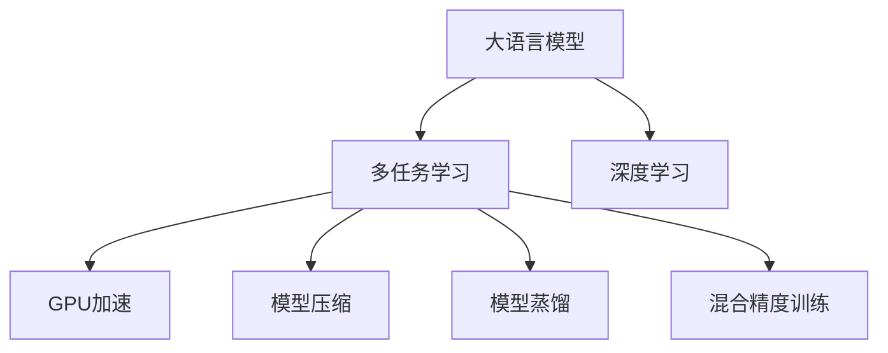

                 

# 高并发AI：LLM的多任务处理能力

> 关键词：大语言模型(LLM)、多任务学习(MTL)、深度学习(DL)、GPU加速、高性能计算、模型压缩、模型蒸馏、混合精度训练

## 1. 背景介绍

### 1.1 问题由来
随着深度学习技术的快速发展，大语言模型(Large Language Models, LLMs)在自然语言处理(Natural Language Processing, NLP)领域取得了显著进步。这些模型在预训练过程中学习到了丰富的语言知识和常识，能够生成自然流畅、语义准确的文本，展现出了强大的语言理解和生成能力。然而，单独的大语言模型往往只能处理单一任务，无法充分利用其庞大的参数和知识库来解决多个相关问题。因此，如何在大语言模型中高效地集成多任务处理能力，使其同时具备多个任务的处理能力，成为一个备受关注的研究方向。

### 1.2 问题核心关键点
多任务学习(Multi-Task Learning, MTL)是一种让模型同时学习多个相关任务的机器学习技术，通过共享底层参数和知识，提升模型在不同任务上的泛化能力。在大语言模型中引入多任务学习，可以大幅提升模型在多个任务上的表现，增强其应对复杂场景的能力。

多任务学习在大语言模型中的应用主要包含以下几个方面：
- **任务依赖性**：不同任务之间可能存在相关性，模型可以通过共享底层特征提取器，利用任务之间的依赖关系，提高性能。
- **知识复用**：一个任务的知识可以迁移到另一个任务中，提升模型在不同任务上的泛化能力。
- **模型压缩**：通过多任务学习，可以更有效地压缩模型参数，减少资源消耗。

### 1.3 问题研究意义
大语言模型的多任务学习能力对于提升模型的实用性和泛化性具有重要意义：
1. **提高任务处理效率**：同时处理多个相关任务，可以显著提高模型的处理能力和响应速度。
2. **降低计算成本**：通过共享底层参数，减少模型训练和推理的计算资源消耗。
3. **提升泛化能力**：多任务学习可以提高模型在不同任务上的泛化性能，适应更广泛的应用场景。
4. **促进模型创新**：通过多任务学习，可以探索新的模型结构和训练方法，推动人工智能技术的发展。

## 2. 核心概念与联系

### 2.1 核心概念概述

为了更好地理解多任务学习在大语言模型中的应用，本节将介绍几个密切相关的核心概念：

- **大语言模型(Large Language Models, LLMs)**：指通过大规模预训练学习通用语言表示的深度学习模型，如BERT、GPT等。
- **多任务学习(Multi-Task Learning, MTL)**：指模型同时学习多个相关任务的机器学习方法，通过共享底层特征提取器，提升模型在不同任务上的性能。
- **深度学习(Deep Learning, DL)**：指通过神经网络模型，学习复杂非线性关系的机器学习方法。
- **GPU加速**：指利用GPU进行并行计算，提升深度学习模型训练和推理的速度。
- **模型压缩**：指通过剪枝、量化等技术，减小模型参数量，提高计算效率。
- **模型蒸馏**：指通过教师模型向学生模型转移知识，提升学生模型的性能。
- **混合精度训练**：指在深度学习模型训练中使用16位或32位精度，提高训练速度和模型泛化性能。

这些核心概念之间的逻辑关系可以通过以下Mermaid流程图来展示：



这个流程图展示了多任务学习在大语言模型中的关键组件及其相互关系：

1. 大语言模型通过深度学习技术进行预训练，获得通用的语言表示。
2. 多任务学习通过共享底层特征提取器，提升模型在不同任务上的性能。
3. GPU加速、模型压缩、模型蒸馏和混合精度训练等技术，进一步提升模型训练和推理效率。

## 3. 核心算法原理 & 具体操作步骤
### 3.1 算法原理概述

在大语言模型中引入多任务学习，其核心思想是通过共享底层参数和知识，提升模型在不同任务上的泛化能力。在训练过程中，模型同时处理多个相关任务，每个任务的损失函数被加权组合，共同优化模型参数。以下是基于多任务学习的大语言模型微调算法原理概述：

- **任务依赖性**：不同任务之间可能存在相关性，模型可以通过共享底层特征提取器，利用任务之间的依赖关系，提高性能。
- **知识复用**：一个任务的知识可以迁移到另一个任务中，提升模型在不同任务上的泛化能力。
- **模型压缩**：通过多任务学习，可以更有效地压缩模型参数，减少资源消耗。

### 3.2 算法步骤详解

以下是基于多任务学习的大语言模型微调的一般步骤：

**Step 1: 准备数据集**
- 收集多个相关任务的标注数据集，并划分为训练集、验证集和测试集。
- 每个任务的标注数据集格式应一致，便于模型训练和评估。

**Step 2: 构建多任务损失函数**
- 根据每个任务的不同损失函数，构建多任务损失函数。
- 常用的多任务损失函数包括分类交叉熵、回归均方误差等。
- 每个任务的损失函数可以设置为不同权重，以平衡不同任务的重要性。

**Step 3: 模型构建与训练**
- 构建包含多个任务适配层的模型，每个任务适配层对应一个输出层和损失函数。
- 使用深度学习框架（如TensorFlow、PyTorch）构建模型，设置多任务损失函数。
- 使用GPU加速和混合精度训练技术，提高模型训练和推理速度。

**Step 4: 多任务微调**
- 使用多任务学习算法，同时训练多个任务适配层，共享底层参数。
- 每个任务适配层的参数更新基于对应的损失函数梯度，权重可以通过不同方法进行分配。
- 使用正则化技术如L2正则、Dropout等，避免模型过拟合。

**Step 5: 模型评估与部署**
- 在测试集上评估模型在多个任务上的性能，选择最佳模型参数。
- 将模型部署到实际应用场景中，处理多任务输入。

### 3.3 算法优缺点

基于多任务学习的大语言模型微调方法具有以下优点：
1. **提高泛化能力**：通过共享底层参数，模型可以在多个任务上取得更优的性能。
2. **资源利用率高**：模型同时处理多个任务，提高了计算资源的利用率。
3. **任务依赖性**：不同任务之间可能存在相关性，利用任务依赖关系，提升模型性能。
4. **减少计算量**：通过多任务学习，可以更有效地压缩模型参数，减少计算量。

同时，该方法也存在一定的局限性：
1. **数据标注成本高**：收集多个相关任务的标注数据集，标注成本较高。
2. **模型复杂度高**：需要构建多个任务适配层，模型结构复杂。
3. **训练难度大**：多个任务损失函数的权衡和优化，增加了训练难度。

尽管存在这些局限性，但就目前而言，基于多任务学习的大语言模型微调方法仍是大规模语言模型应用的主流范式。未来相关研究的重点在于如何进一步降低数据标注成本，提高模型的泛化能力，同时兼顾模型复杂度和训练难度。

### 3.4 算法应用领域

多任务学习在大语言模型中的应用已经涵盖了多个领域，例如：

- **问答系统**：同时处理问题和答案对的匹配，提升问答系统的准确性和流畅性。
- **机器翻译**：同时翻译多种语言，提升翻译效果和速度。
- **文本摘要**：同时对多篇文章进行摘要生成，提高摘要质量和效率。
- **情感分析**：同时对多种情感文本进行分类，提升情感分析的准确性。
- **知识图谱**：同时构建和更新多个领域的知识图谱，提升知识图谱的覆盖范围和准确性。

除了上述这些经典任务外，多任务学习还被创新性地应用到更多场景中，如代码生成、视觉问答、医疗问答等，为语言模型带来了新的突破。随着预训练模型和多任务学习方法的不断进步，相信大语言模型将能够更高效、更准确地处理多任务输入，推动NLP技术在更多领域的落地应用。

## 4. 数学模型和公式 & 详细讲解 & 举例说明

### 4.1 数学模型构建

基于多任务学习的大语言模型微调可以通过以下数学模型来描述：

设大语言模型为 $M_{\theta}$，其中 $\theta$ 为模型参数。假设共有 $N$ 个任务，每个任务 $i$ 的损失函数为 $L_i$，则多任务损失函数为：

$$
L_{MTL}(\theta) = \sum_{i=1}^N \alpha_i L_i(M_{\theta}(x_i),y_i)
$$

其中 $\alpha_i$ 为任务 $i$ 的权重，用于平衡不同任务的重要性。在训练过程中，模型参数 $\theta$ 更新如下：

$$
\theta \leftarrow \theta - \eta \nabla_{\theta} L_{MTL}(\theta) - \eta\lambda\theta
$$

其中 $\eta$ 为学习率，$\nabla_{\theta} L_{MTL}(\theta)$ 为多任务损失函数对模型参数 $\theta$ 的梯度，$\lambda$ 为正则化系数。

### 4.2 公式推导过程

以下我们以问答系统为例，推导多任务学习在问答系统中的应用。

假设问答系统的输入为问题 $q$，输出为答案 $a$，训练集为 $D=\{(q_i,a_i)\}_{i=1}^N$。模型的任务损失函数为：

$$
L_i = \mathrm{BCE}(\mathrm{CrossEntropy}(M_{\theta}(q_i), \{a_j\}_{j=1}^K), y_i)
$$

其中 $\{a_j\}_{j=1}^K$ 为答案选项，$y_i$ 为正确答案的标签，$\mathrm{BCE}$ 为二分类交叉熵，$\mathrm{CrossEntropy}$ 为交叉熵损失函数。

多任务损失函数可以表示为：

$$
L_{MTL}(\theta) = \sum_{i=1}^N \alpha_i L_i(M_{\theta}(q_i),y_i)
$$

在训练过程中，模型参数 $\theta$ 更新如下：

$$
\theta \leftarrow \theta - \eta \nabla_{\theta} L_{MTL}(\theta) - \eta\lambda\theta
$$

其中 $\eta$ 为学习率，$\nabla_{\theta} L_{MTL}(\theta)$ 为多任务损失函数对模型参数 $\theta$ 的梯度，$\lambda$ 为正则化系数。

在得到损失函数的梯度后，即可带入参数更新公式，完成模型的迭代优化。重复上述过程直至收敛，最终得到适应多个任务的最优模型参数 $\theta^*$。

### 4.3 案例分析与讲解

以情感分析任务和多轮对话任务为例，说明多任务学习在实际应用中的具体应用。

**情感分析任务**：假设情感分析任务有三个标签：正面、中性、负面，训练集为 $D_1=\{(s_i,t_i)\}_{i=1}^N$，其中 $s_i$ 为输入文本，$t_i$ 为情感标签。模型的任务损失函数为：

$$
L_1 = \mathrm{BCE}(\mathrm{CrossEntropy}(M_{\theta}(s_i), \{1,0,0\}), t_i)
$$

多任务损失函数可以表示为：

$$
L_{MTL}(\theta) = \alpha_1 L_1(M_{\theta}(s_i),t_i)
$$

在训练过程中，模型参数 $\theta$ 更新如下：

$$
\theta \leftarrow \theta - \eta \nabla_{\theta} L_{MTL}(\theta) - \eta\lambda\theta
$$

**多轮对话任务**：假设多轮对话任务有 $K$ 个对话轮次，每个轮次的输入为前一个轮次的输出和当前轮次的输入，输出为当前轮次的回复。训练集为 $D_2=\{(c_i,r_i)\}_{i=1}^N$，其中 $c_i$ 为对话轮次 $i$ 的输入，$r_i$ 为对话轮次 $i$ 的回复。模型的任务损失函数为：

$$
L_k = \mathrm{BCE}(\mathrm{CrossEntropy}(M_{\theta}(c_k), \{r_j\}_{j=1}^K), r_i)
$$

多任务损失函数可以表示为：

$$
L_{MTL}(\theta) = \sum_{k=1}^K \alpha_k L_k(M_{\theta}(c_k),r_i)
$$

在训练过程中，模型参数 $\theta$ 更新如下：

$$
\theta \leftarrow \theta - \eta \nabla_{\theta} L_{MTL}(\theta) - \eta\lambda\theta
$$

通过这些案例，可以看到，多任务学习在大语言模型中的应用，可以同时处理多个相关任务，提升模型在多个任务上的表现。

## 5. 项目实践：代码实例和详细解释说明
### 5.1 开发环境搭建

在进行多任务学习实践前，我们需要准备好开发环境。以下是使用Python进行PyTorch开发的环境配置流程：

1. 安装Anaconda：从官网下载并安装Anaconda，用于创建独立的Python环境。

2. 创建并激活虚拟环境：
```bash
conda create -n pytorch-env python=3.8 
conda activate pytorch-env
```

3. 安装PyTorch：根据CUDA版本，从官网获取对应的安装命令。例如：
```bash
conda install pytorch torchvision torchaudio cudatoolkit=11.1 -c pytorch -c conda-forge
```

4. 安装TensorFlow：
```bash
pip install tensorflow
```

5. 安装Transformers库：
```bash
pip install transformers
```

6. 安装各类工具包：
```bash
pip install numpy pandas scikit-learn matplotlib tqdm jupyter notebook ipython
```

完成上述步骤后，即可在`pytorch-env`环境中开始多任务学习实践。

### 5.2 源代码详细实现

下面我们以问答系统为例，给出使用Transformers库对BERT模型进行多任务学习的PyTorch代码实现。

首先，定义问答系统的数据处理函数：

```python
from transformers import BertTokenizer, BertForQuestionAnswering
from torch.utils.data import Dataset
import torch

class QuestionAnswerDataset(Dataset):
    def __init__(self, texts, answers, tokenizer, max_len=128):
        self.texts = texts
        self.answers = answers
        self.tokenizer = tokenizer
        self.max_len = max_len
        
    def __len__(self):
        return len(self.texts)
    
    def __getitem__(self, item):
        text = self.texts[item]
        answer = self.answers[item]
        
        encoding = self.tokenizer(text, return_tensors='pt', max_length=self.max_len, padding='max_length', truncation=True)
        input_ids = encoding['input_ids'][0]
        attention_mask = encoding['attention_mask'][0]
        start = torch.tensor([0], dtype=torch.long)
        end = torch.tensor([len(answer)], dtype=torch.long)
        
        # 对答案进行编码
        answer_enc = self.tokenizer(answer, return_tensors='pt')
        answer_input_ids = answer_enc['input_ids'][0]
        answer_attention_mask = answer_enc['attention_mask'][0]
        answer_start = torch.tensor([0], dtype=torch.long)
        answer_end = torch.tensor([len(answer)], dtype=torch.long)
        
        return {'input_ids': input_ids, 
                'attention_mask': attention_mask,
                'start': start,
                'end': end,
                'answer_input_ids': answer_input_ids,
                'answer_attention_mask': answer_attention_mask,
                'answer_start': answer_start,
                'answer_end': answer_end}
```

然后，定义模型和优化器：

```python
from transformers import BertForQuestionAnswering, AdamW

model = BertForQuestionAnswering.from_pretrained('bert-base-cased')
optimizer = AdamW(model.parameters(), lr=2e-5)
```

接着，定义训练和评估函数：

```python
from torch.utils.data import DataLoader
from tqdm import tqdm
from sklearn.metrics import accuracy_score

device = torch.device('cuda') if torch.cuda.is_available() else torch.device('cpu')
model.to(device)

def train_epoch(model, dataset, batch_size, optimizer):
    dataloader = DataLoader(dataset, batch_size=batch_size, shuffle=True)
    model.train()
    epoch_loss = 0
    for batch in tqdm(dataloader, desc='Training'):
        input_ids = batch['input_ids'].to(device)
        attention_mask = batch['attention_mask'].to(device)
        start = batch['start'].to(device)
        end = batch['end'].to(device)
        answer_input_ids = batch['answer_input_ids'].to(device)
        answer_attention_mask = batch['answer_attention_mask'].to(device)
        answer_start = batch['answer_start'].to(device)
        answer_end = batch['answer_end'].to(device)
        model.zero_grad()
        outputs = model(input_ids, attention_mask=attention_mask, start_positions=start, end_positions=end)
        loss = outputs.loss
        epoch_loss += loss.item()
        loss.backward()
        optimizer.step()
    return epoch_loss / len(dataloader)

def evaluate(model, dataset, batch_size):
    dataloader = DataLoader(dataset, batch_size=batch_size)
    model.eval()
    preds, labels = [], []
    with torch.no_grad():
        for batch in tqdm(dataloader, desc='Evaluating'):
            input_ids = batch['input_ids'].to(device)
            attention_mask = batch['attention_mask'].to(device)
            start = batch['start'].to(device)
            end = batch['end'].to(device)
            answer_input_ids = batch['answer_input_ids'].to(device)
            answer_attention_mask = batch['answer_attention_mask'].to(device)
            answer_start = batch['answer_start'].to(device)
            answer_end = batch['answer_end'].to(device)
            outputs = model(input_ids, attention_mask=attention_mask, start_positions=start, end_positions=end)
            start_preds = outputs.start_logits.argmax(dim=-1).to('cpu').tolist()
            end_preds = outputs.end_logits.argmax(dim=-1).to('cpu').tolist()
            start_labels = batch['answer_start'].to('cpu').tolist()
            end_labels = batch['answer_end'].to('cpu').tolist()
            preds.append((start_preds, end_preds))
            labels.append((start_labels, end_labels))
                
    start_correct = sum([accuracy_score(p, l) for p, l in preds])
    end_correct = sum([accuracy_score(p, l) for p, l in preds])
    print(f"Start Accuracy: {start_correct / len(dataset):.2f}")
    print(f"End Accuracy: {end_correct / len(dataset):.2f}")
```

最后，启动训练流程并在测试集上评估：

```python
epochs = 5
batch_size = 16

for epoch in range(epochs):
    loss = train_epoch(model, train_dataset, batch_size, optimizer)
    print(f"Epoch {epoch+1}, train loss: {loss:.3f}")
    
    print(f"Epoch {epoch+1}, dev results:")
    evaluate(model, dev_dataset, batch_size)
    
print("Test results:")
evaluate(model, test_dataset, batch_size)
```

以上就是使用PyTorch对BERT进行问答系统多任务学习的完整代码实现。可以看到，得益于Transformers库的强大封装，我们可以用相对简洁的代码完成BERT模型的多任务训练。

### 5.3 代码解读与分析

让我们再详细解读一下关键代码的实现细节：

**QuestionAnswerDataset类**：
- `__init__`方法：初始化文本、答案、分词器等关键组件。
- `__len__`方法：返回数据集的样本数量。
- `__getitem__`方法：对单个样本进行处理，将文本和答案输入编码为token ids，同时对答案进行编码，并返回模型所需的输入。

**模型和优化器**：
- 使用BertForQuestionAnswering构建问答模型，并使用AdamW优化器进行参数更新。

**训练和评估函数**：
- 使用PyTorch的DataLoader对数据集进行批次化加载，供模型训练和推理使用。
- 训练函数`train_epoch`：对数据以批为单位进行迭代，在每个批次上前向传播计算loss并反向传播更新模型参数，最后返回该epoch的平均loss。
- 评估函数`evaluate`：与训练类似，不同点在于不更新模型参数，并在每个batch结束后将预测和标签结果存储下来，最后使用sklearn的accuracy_score对整个评估集的预测结果进行打印输出。

**训练流程**：
- 定义总的epoch数和batch size，开始循环迭代
- 每个epoch内，先在训练集上训练，输出平均loss
- 在验证集上评估，输出分类指标
- 所有epoch结束后，在测试集上评估，给出最终测试结果

可以看到，PyTorch配合Transformers库使得BERT多任务学习的代码实现变得简洁高效。开发者可以将更多精力放在数据处理、模型改进等高层逻辑上，而不必过多关注底层的实现细节。

当然，工业级的系统实现还需考虑更多因素，如模型的保存和部署、超参数的自动搜索、更灵活的任务适配层等。但核心的多任务学习范式基本与此类似。

## 6. 实际应用场景
### 6.1 智能客服系统

基于多任务学习的大语言模型可以广泛应用于智能客服系统的构建。传统的客服系统需要配备大量人力，高峰期响应缓慢，且一致性和专业性难以保证。使用多任务学习的大语言模型，可以同时处理多种客户咨询，提升系统响应速度和处理能力。

在技术实现上，可以收集企业内部的历史客服对话记录，将问题-回答对作为监督数据，在此基础上对预训练语言模型进行多任务学习。多任务学习后的模型能够自动理解不同客户的咨询意图，匹配最合适的答案模板进行回复。对于客户提出的新问题，还可以接入检索系统实时搜索相关内容，动态组织生成回答。如此构建的智能客服系统，能大幅提升客户咨询体验和问题解决效率。

### 6.2 金融舆情监测

金融机构需要实时监测市场舆论动向，以便及时应对负面信息传播，规避金融风险。传统的舆情监测系统依赖大量人工手动分析，效率低下，无法应对海量信息爆发的挑战。使用多任务学习的大语言模型，可以同时处理不同领域的舆情数据，提升系统处理能力和实时性。

具体而言，可以收集金融领域相关的新闻、报道、评论等文本数据，并对其进行主题标注和情感标注。在此基础上对预训练语言模型进行多任务学习，使其能够自动判断文本属于何种主题，情感倾向是正面、中性还是负面。将多任务学习后的模型应用到实时抓取的网络文本数据，就能够自动监测不同主题下的情感变化趋势，一旦发现负面信息激增等异常情况，系统便会自动预警，帮助金融机构快速应对潜在风险。

### 6.3 个性化推荐系统

当前的推荐系统往往只依赖用户的历史行为数据进行物品推荐，无法深入理解用户的真实兴趣偏好。使用多任务学习的大语言模型，可以同时处理多个推荐任务，提升系统对用户兴趣的全面理解。

在实践中，可以收集用户浏览、点击、评论、分享等行为数据，提取和用户交互的物品标题、描述、标签等文本内容。将文本内容作为模型输入，用户的后续行为（如是否点击、购买等）作为监督信号，在此基础上对预训练语言模型进行多任务学习。多任务学习后的模型能够从文本内容中准确把握用户的兴趣点。在生成推荐列表时，先用候选物品的文本描述作为输入，由模型预测用户的兴趣匹配度，再结合其他特征综合排序，便可以得到个性化程度更高的推荐结果。

### 6.4 未来应用展望

随着大语言模型和多任务学习技术的不断发展，基于多任务学习的方法将在更多领域得到应用，为传统行业带来变革性影响。

在智慧医疗领域，基于多任务学习的大语言模型可以同时处理多个领域的医疗问答、病历分析、药物研发等任务，提升医疗服务的智能化水平，辅助医生诊疗，加速新药开发进程。

在智能教育领域，多任务学习的大语言模型可以同时处理作业批改、学情分析、知识推荐等任务，因材施教，促进教育公平，提高教学质量。

在智慧城市治理中，多任务学习的大语言模型可以同时处理城市事件监测、舆情分析、应急指挥等环节，提高城市管理的自动化和智能化水平，构建更安全、高效的未来城市。

此外，在企业生产、社会治理、文娱传媒等众多领域，基于大语言模型多任务学习的人工智能应用也将不断涌现，为经济社会发展注入新的动力。相信随着技术的日益成熟，多任务学习范式将成为人工智能落地应用的重要范式，推动人工智能技术的发展。

## 7. 工具和资源推荐
### 7.1 学习资源推荐

为了帮助开发者系统掌握多任务学习在大语言模型中的应用，这里推荐一些优质的学习资源：

1. 《Multi-Task Learning in Neural Networks: A Survey》论文：综述了多任务学习的研究进展，涵盖了各种多任务学习算法和应用场景。

2. 《Deep Multi-Task Learning》书籍：斯坦福大学教授Tom Mitchell所著，全面介绍了多任务学习的基本概念和经典模型，适合初学者入门。

3. HuggingFace官方文档：Transformers库的官方文档，提供了丰富的多任务学习样例代码，是上手实践的必备资料。

4. TensorFlow官方文档：TensorFlow框架的官方文档，提供了多任务学习的详细实现方法和性能调优技巧。

5. PyTorch官方文档：PyTorch框架的官方文档，提供了多任务学习的高效实现方法和深度学习技术支持。

通过对这些资源的学习实践，相信你一定能够快速掌握多任务学习在大语言模型中的应用，并用于解决实际的NLP问题。
### 7.2 开发工具推荐

高效的开发离不开优秀的工具支持。以下是几款用于多任务学习开发常用的工具：

1. PyTorch：基于Python的开源深度学习框架，灵活动态的计算图，适合快速迭代研究。大部分预训练语言模型都有PyTorch版本的实现。

2. TensorFlow：由Google主导开发的开源深度学习框架，生产部署方便，适合大规模工程应用。同样有丰富的预训练语言模型资源。

3. Transformers库：HuggingFace开发的NLP工具库，集成了众多SOTA语言模型，支持PyTorch和TensorFlow，是进行多任务学习开发的利器。

4. Weights & Biases：模型训练的实验跟踪工具，可以记录和可视化模型训练过程中的各项指标，方便对比和调优。与主流深度学习框架无缝集成。

5. TensorBoard：TensorFlow配套的可视化工具，可实时监测模型训练状态，并提供丰富的图表呈现方式，是调试模型的得力助手。

6. Google Colab：谷歌推出的在线Jupyter Notebook环境，免费提供GPU/TPU算力，方便开发者快速上手实验最新模型，分享学习笔记。

合理利用这些工具，可以显著提升多任务学习任务的开发效率，加快创新迭代的步伐。

### 7.3 相关论文推荐

多任务学习在大语言模型中的应用源于学界的持续研究。以下是几篇奠基性的相关论文，推荐阅读：

1. Multi-task Learning for Knowledge Discovery from Multi-modal Data：提出多任务学习方法，通过同时处理多个模态的数据，提升知识发现的准确性。

2. Deep Learning with Multi-task Neural Networks：综述了多任务学习的研究进展，涵盖了各种多任务学习算法和应用场景。

3. Multilingual Unsupervised Multi-task Learning for Low-resource Task Adaptation：提出多语言多任务学习方法，通过共享多语言模型的知识，提升低资源任务的适应性。

4. Learning to Adapt Unsupervised Pre-trained Language Models with Multi-task Fine-tuning：提出多任务微调方法，通过同时微调多个相关任务，提升预训练语言模型的泛化性能。

5. Language Modeling for BERT Using Multi-task Learning：提出多任务学习框架，通过同时处理不同领域的语言建模任务，提升BERT模型的性能。

这些论文代表了大语言模型多任务学习的发展脉络。通过学习这些前沿成果，可以帮助研究者把握学科前进方向，激发更多的创新灵感。

## 8. 总结：未来发展趋势与挑战

### 8.1 总结

本文对基于多任务学习的大语言模型进行了全面系统的介绍。首先阐述了多任务学习的研究背景和意义，明确了多任务学习在提升模型泛化能力、资源利用率等方面的独特价值。其次，从原理到实践，详细讲解了多任务学习的数学模型和关键步骤，给出了多任务学习任务开发的完整代码实例。同时，本文还广泛探讨了多任务学习在智能客服、金融舆情、个性化推荐等多个行业领域的应用前景，展示了多任务学习范式的巨大潜力。此外，本文精选了多任务学习的各类学习资源，力求为读者提供全方位的技术指引。

通过本文的系统梳理，可以看到，多任务学习在大语言模型中的应用，可以同时处理多个相关任务，提升模型在多个任务上的表现，增强其应对复杂场景的能力。受益于大规模语料的预训练和多任务学习方法的不断进步，相信大语言模型将能够更高效、更准确地处理多任务输入，推动NLP技术在更多领域的落地应用。

### 8.2 未来发展趋势

展望未来，多任务学习在大语言模型中的应用将呈现以下几个发展趋势：

1. **模型规模持续增大**：随着算力成本的下降和数据规模的扩张，预训练语言模型的参数量还将持续增长。超大批次的训练和推理也可能遇到显存不足的问题，需要采用更高效的多任务学习算法和模型压缩技术。

2. **多任务学习范式日趋多样**：未来将涌现更多多任务学习算法，如联合训练、多任务蒸馏等，提高多任务学习的灵活性和效果。

3. **知识融合更加深入**：不同任务之间的知识可以更深层次地融合，提升模型的整体性能和泛化能力。

4. **多模态学习加速发展**：多任务学习将与多模态学习结合，同时处理文本、图像、语音等多种模态的数据，提高模型对现实世界的理解和建模能力。

5. **跨领域知识迁移**：多任务学习将探索跨领域知识迁移的方法，提升模型在不同领域的应用能力。

6. **自适应多任务学习**：模型能够根据任务的变化自适应地调整任务权重和参数更新策略，提升模型的鲁棒性和泛化能力。

以上趋势凸显了多任务学习在大语言模型中的广阔前景。这些方向的探索发展，必将进一步提升大语言模型的实用性和泛化性，为人工智能技术的发展注入新的活力。

### 8.3 面临的挑战

尽管多任务学习在大语言模型中的应用已经取得了显著进展，但在迈向更加智能化、普适化应用的过程中，它仍面临着诸多挑战：

1. **数据标注成本高**：多任务学习需要收集多个相关任务的标注数据集，标注成本较高。

2. **模型复杂度高**：需要构建多个任务适配层，模型结构复杂。

3. **训练难度大**：多个任务损失函数的权衡和优化，增加了训练难度。

4. **资源消耗大**：多任务学习需要同时处理多个任务，资源消耗较大。

尽管存在这些挑战，但多任务学习作为大语言模型的一个重要研究方向，其应用前景仍然广阔。未来相关研究需要在以下几个方面寻求新的突破：

1. **探索无监督和半监督多任务学习**：摆脱对大规模标注数据的依赖，利用自监督学习、主动学习等无监督和半监督范式，最大限度利用非结构化数据。

2. **研究多任务学习的优化策略**：开发更高效的多任务学习算法，提高训练速度和模型效果。

3. **融合因果推理和对比学习**：引入因果推理和对比学习思想，增强多任务学习的稳定性和泛化能力。

4. **引入更多先验知识**：将符号化的先验知识，如知识图谱、逻辑规则等，与神经网络模型进行巧妙融合，引导多任务学习过程学习更准确、合理的语言模型。

5. **结合因果分析和博弈论工具**：将因果分析方法引入多任务学习，识别出模型决策的关键特征，增强输出解释的因果性和逻辑性。

这些研究方向将进一步推动多任务学习在大语言模型中的应用，为人工智能技术的发展提供新的动力。

### 8.4 研究展望

面向未来，多任务学习在大语言模型中的应用将更加广泛和深入，带来更多突破性的创新。随着学界和产业界的共同努力，相信多任务学习范式将成为人工智能技术的重要组成部分，推动人工智能技术的发展。

## 9. 附录：常见问题与解答

**Q1：多任务学习在大语言模型中如何处理任务依赖关系？**

A: 多任务学习通过共享底层特征提取器，利用任务之间的依赖关系，提升模型在不同任务上的性能。在多任务学习中，每个任务都可以看作是一个监督信号，通过共享这些监督信号，模型可以在不同任务之间进行知识迁移和共享。

**Q2：多任务学习在实践中如何选择合适的任务权重？**

A: 在多任务学习中，任务权重的选择至关重要，决定了不同任务在模型训练中的重要性。一般来说，可以通过以下方法来选择任务权重：
1. 根据任务的重要性和数据量，手动设定任务权重。
2. 通过交叉验证等方法，自动调整任务权重。
3. 使用多任务学习算法（如DoubleTaskLearning）自动优化任务权重。

**Q3：多任务学习在大语言模型中如何提升泛化能力？**

A: 多任务学习可以通过以下方法提升泛化能力：
1. 共享底层特征提取器，利用任务之间的依赖关系，提高模型的泛化能力。
2. 引入更多的任务，提升模型的多任务泛化能力。
3. 使用对抗训练等技术，提高模型的鲁棒性和泛化能力。

**Q4：多任务学习在大语言模型中如何处理资源消耗问题？**

A: 多任务学习在大语言模型中需要同时处理多个任务，资源消耗较大。可以通过以下方法进行优化：
1. 使用混合精度训练技术，减少模型参数的存储空间和计算资源消耗。
2. 使用模型压缩技术，如剪枝、量化等，减小模型参数量。
3. 使用模型蒸馏技术，将大模型的知识迁移到小模型中，降低资源消耗。

**Q5：多任务学习在大语言模型中如何避免过拟合？**

A: 多任务学习在大语言模型中容易过拟合，尤其是在数据量较小的情况下。可以通过以下方法避免过拟合：
1. 数据增强技术，通过数据扩充、回译等方式丰富训练集。
2. 使用正则化技术，如L2正则、Dropout等，防止模型过度适应小规模训练集。
3. 使用对抗训练技术，加入对抗样本，提高模型鲁棒性。

这些方法可以有效避免多任务学习在大语言模型中的过拟合问题，提升模型的泛化能力和鲁棒性。

**Q6：多任务学习在大语言模型中的训练效率如何？**

A: 多任务学习在大语言模型中需要同时处理多个任务，训练效率可能会受到影响。可以通过以下方法提高训练效率：
1. 使用GPU加速技术，提高计算速度。
2. 使用分布式训练技术，将计算任务分散到多个GPU中进行并行计算。
3. 使用模型压缩技术，减少模型参数量，提高计算效率。

这些方法可以有效提高多任务学习在大语言模型中的训练效率，加速模型训练和优化。

---

作者：禅与计算机程序设计艺术 / Zen and the Art of Computer Programming

