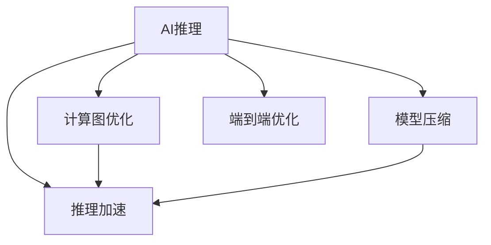

                 

# 高性能AI推理优化技巧

> 关键词：AI推理,深度学习,计算图优化,模型压缩,推理加速,模型量化,分布式推理,端到端优化

## 1. 背景介绍

在深度学习大行其道的今天，AI推理引擎的性能成为了制约模型应用的重要瓶颈。无论是智能家居、自动驾驶、智能安防等前沿应用，还是常见的图像识别、语音识别、自然语言处理等NLP任务，AI推理性能的高低，都直接决定着系统的响应速度、稳定性、可扩展性等关键指标。

然而，现有的深度学习模型往往具有数亿甚至数十亿参数，计算复杂度高，推理速度慢，难以满足实际应用的需求。如何优化AI推理性能，成为当前AI应用开发中的热门话题。本文将深入探讨高性能AI推理优化的技巧，帮助开发者提高AI系统的性能，提升用户体验。

## 2. 核心概念与联系

### 2.1 核心概念概述

为了更好地理解高性能AI推理优化的技巧，本文将介绍几个关键概念及其相互关系：

- **AI推理(AI Inference)**：指将训练好的深度学习模型部署到实际应用中，对新数据进行实时推理和预测的过程。高效的AI推理可以大幅提升系统响应速度和吞吐量。

- **深度学习(Deep Learning)**：指基于多层神经网络的机器学习技术，通过学习大量数据，获得对复杂模式的高级表示。深度学习模型在图像识别、语音识别、自然语言处理等领域有广泛应用。

- **计算图优化(Computational Graph Optimization)**：指对深度学习模型的计算图进行优化，减少推理计算量，提升模型推理速度。包括剪枝、量化、融合等优化手段。

- **模型压缩(Model Compression)**：指在保证模型性能的前提下，尽量减少模型参数和计算量，降低推理资源占用。包括剪枝、量化、蒸馏等技术。

- **推理加速(Inference Acceleration)**：指通过硬件加速、并行计算、模型量化等手段，提高深度学习模型的推理速度。包括GPU、TPU、FPGA等加速器，以及分布式推理等架构。

- **端到端优化(End-to-End Optimization)**：指从数据加载、模型推理、结果输出等各个环节进行全面优化，确保整个AI系统的高效运行。包括模型优化、推理优化、系统优化等。

这些概念之间具有紧密的联系，如图2所示。计算图优化和模型压缩是提升AI推理性能的两个重要手段，而推理加速和分布式推理则提供了硬件和架构上的支持，端到端优化则将各个环节的优化有机整合，形成完整的性能提升方案。



## 3. 核心算法原理 & 具体操作步骤

### 3.1 算法原理概述

高性能AI推理优化的核心思想是：在保证模型性能的前提下，尽可能减少计算量和参数量，降低推理资源占用，提高推理速度。通过引入计算图优化、模型压缩、推理加速等手段，使得模型能够在资源受限的环境中高效运行。

**核心步骤**：

1. **计算图优化**：对深度学习模型的计算图进行简化，减少冗余计算，提高推理速度。
2. **模型压缩**：通过剪枝、量化、蒸馏等技术，减少模型参数和计算量，降低资源占用。
3. **推理加速**：利用GPU、TPU、FPGA等加速器，并行计算等手段，提高模型推理速度。
4. **分布式推理**：将模型拆分为多个子模型，部署在多台设备上，利用分布式计算和通信，提高系统吞吐量。
5. **端到端优化**：从数据加载、模型推理、结果输出等环节进行全面优化，提升系统整体性能。

### 3.2 算法步骤详解

**Step 1: 计算图优化**

计算图优化是提升AI推理性能的首要手段。常见的优化方法包括剪枝、量化、融合等，具体步骤如下：

1. **剪枝(Pruning)**：去除模型中不必要的参数，减少计算量，提升推理速度。常用的剪枝策略包括结构剪枝和权重剪枝，具体实现方法包括稀疏化训练、动态剪枝等。
2. **量化(Quantization)**：将浮点数参数转换为整数或定点数，减少计算量，降低资源占用。量化方法包括权值量化、激活量化等，量化后模型需要重新训练。
3. **融合(Fusion)**：将多个小的计算图操作融合为一个大的操作，减少计算量和内存占用。常用的融合方法包括全连接层融合、卷积层融合等。

**Step 2: 模型压缩**

模型压缩旨在减少模型参数和计算量，降低资源占用。常用的压缩方法包括剪枝、量化、蒸馏等，具体步骤如下：

1. **剪枝(Pruning)**：与计算图优化中的剪枝类似，但剪枝对象不同，前者是图结构，后者是参数值。剪枝后的模型需要重新训练。
2. **量化(Quantization)**：通过将浮点数参数转换为定点数，减少计算量和内存占用。量化方法包括权值量化、激活量化等。
3. **蒸馏(Distillation)**：通过迁移知识的方式，将大模型转化为小模型。蒸馏方法包括硬蒸馏和软蒸馏等。

**Step 3: 推理加速**

推理加速旨在提高深度学习模型的推理速度。常用的加速方法包括硬件加速、并行计算、混合精度等，具体步骤如下：

1. **硬件加速**：利用GPU、TPU、FPGA等加速器，提高模型推理速度。
2. **并行计算**：通过多核、多机等并行计算方式，提升模型推理速度。
3. **混合精度**：将模型部分参数转换为16位浮点数，提高计算效率。

**Step 4: 分布式推理**

分布式推理旨在提高深度学习模型的系统吞吐量，满足大规模应用需求。常用的分布式方法包括模型拆分、模型缓存、模型同步等，具体步骤如下：

1. **模型拆分(Model Partitioning)**：将大模型拆分为多个小模型，部署在多台设备上，并行推理。
2. **模型缓存(Model Caching)**：将计算结果缓存起来，避免重复计算，提升推理速度。
3. **模型同步(Model Synchronization)**：通过模型参数同步，保持各个设备之间的模型一致性。

**Step 5: 端到端优化**

端到端优化旨在从数据加载、模型推理、结果输出等环节进行全面优化，提升系统整体性能。常用的优化方法包括数据预加载、结果压缩、服务优化等，具体步骤如下：

1. **数据预加载(Prefetching)**：将数据预加载到内存中，减少数据加载时间。
2. **结果压缩(Result Compression)**：对推理结果进行压缩，减少传输带宽占用。
3. **服务优化(Servicing)**：优化服务接口、内存管理、进程调度等，提升系统响应速度和稳定性。

### 3.3 算法优缺点

**优点**：

1. **提升推理速度**：通过计算图优化、模型压缩、推理加速等手段，大幅提升模型的推理速度，满足实时应用的需求。
2. **降低资源占用**：通过剪枝、量化、压缩等方法，降低模型的参数和计算量，减少资源占用，降低硬件成本。
3. **适应多种硬件平台**：硬件加速和分布式推理技术，使得模型可以灵活适配不同的硬件平台，提升系统的可扩展性和可移植性。

**缺点**：

1. **模型性能下降**：压缩和剪枝可能导致模型性能下降，需要进行再训练和调参。
2. **开发复杂度增加**：优化过程中需要综合考虑多种因素，开发复杂度增加。
3. **硬件成本上升**：硬件加速和分布式推理需要额外的硬件投资，增加系统成本。

尽管存在这些缺点，但综合考虑其优点，高性能AI推理优化仍然具有重要的应用价值。

### 3.4 算法应用领域

高性能AI推理优化技术在各种AI应用中都得到了广泛应用，涵盖图像识别、语音识别、自然语言处理、智能家居、自动驾驶等多个领域。具体应用场景包括：

- **智能安防**：用于实时视频监控、人脸识别、行为分析等。高效的推理加速和分布式推理，满足大规模视频监控需求。
- **智能家居**：用于智能音箱、智能电视、智能门锁等。优化后的模型推理速度，提升用户体验。
- **自动驾驶**：用于目标检测、车道保持、自动泊车等。高精度的模型推理，保障行车安全。
- **医疗影像**：用于疾病诊断、手术模拟等。高效的推理加速和分布式推理，提升诊断效率。
- **自然语言处理**：用于智能客服、机器翻译、文本摘要等。优化后的模型推理速度，提升交互体验。

这些应用场景中，高性能AI推理优化技术不仅提升了模型的推理速度，还满足了系统的吞吐量和稳定性需求，为各种AI应用提供了坚实的基础。

## 4. 数学模型和公式 & 详细讲解  
### 4.1 数学模型构建

本文将使用数学语言对高性能AI推理优化的过程进行严格推导。

记深度学习模型为 $M(x; \theta)$，其中 $x$ 为输入，$\theta$ 为模型参数。假设模型需要进行推理的输入数据集为 $D=\{x_i\}_{i=1}^N$，每个数据 $x_i$ 的大小为 $d$。

定义模型的计算图为 $G(V,E)$，其中 $V$ 为计算图节点集合，$E$ 为边集合。每个节点 $v$ 表示一个计算操作，如全连接层、卷积层等。每个边 $e$ 表示操作之间的数据流，即输入输出关系。

定义模型的推理过程为 $I(x; \theta) = M(x; \theta)$，其中 $I$ 为推理函数，表示对输入 $x$ 进行推理得到结果。

### 4.2 公式推导过程

以下是高性能AI推理优化的数学推导过程：

**Step 1: 计算图优化**

计算图优化的核心思想是减少计算图中不必要的计算操作。假设有两个相邻的计算图节点 $v_1$ 和 $v_2$，它们的输出结果 $y_1$ 和 $y_2$ 被 $v_2$ 的输入所使用。如果 $y_1$ 和 $y_2$ 在数学上具有依赖关系，如 $y_1 = y_2 + c$，其中 $c$ 为常数，则可以通过合并 $v_1$ 和 $v_2$，得到一个新节点 $v'$，其计算结果为 $y'$。此时，计算图从 $G(V,E)$ 简化为 $G'(V',E')$，计算量减少，推理速度提高。

**Step 2: 模型压缩**

模型压缩的核心思想是减少模型的参数和计算量。假设有模型 $M(x; \theta)$，其中 $\theta$ 为模型参数。通过剪枝和量化方法，可以得到压缩后的模型 $M'(x; \theta')$，其中 $\theta'$ 为压缩后的参数。此时，模型的计算量减少，推理速度提高。

**Step 3: 推理加速**

推理加速的核心思想是利用硬件加速和并行计算，提高模型的推理速度。假设有模型 $M(x; \theta)$，其中 $\theta$ 为模型参数。利用GPU加速器，可以得到加速后的模型 $M_{GPU}(x; \theta)$，其中 $\theta$ 为原模型参数，$x$ 为输入，推理速度提高。

**Step 4: 分布式推理**

分布式推理的核心思想是利用多台设备并行计算，提高系统的吞吐量。假设有模型 $M(x; \theta)$，其中 $\theta$ 为模型参数。通过分布式推理技术，可以得到分布式推理模型 $M_{dist}(x; \theta)$，其中 $\theta$ 为原模型参数，$x$ 为输入，系统吞吐量提高。

**Step 5: 端到端优化**

端到端优化的核心思想是从数据加载、模型推理、结果输出等环节进行全面优化。假设有系统 $S$，其中包含数据加载、模型推理、结果输出等环节。通过优化这些环节，可以得到优化后的系统 $S_{opt}$，系统性能提升。

### 4.3 案例分析与讲解

以下是对高性能AI推理优化技术在不同应用场景中的案例分析：

**智能安防系统**

在智能安防系统中，视频监控是核心功能之一。传统视频监控系统依赖人力进行实时监控，耗费大量人力物力。利用高性能AI推理优化技术，可以实时进行人脸识别、行为分析等任务，大幅提升系统效率。

**智能家居系统**

在智能家居系统中，智能音箱、智能电视等设备需要实时响应用户指令。利用高性能AI推理优化技术，可以提升模型的推理速度，满足实时响应用户需求。

**自动驾驶系统**

在自动驾驶系统中，目标检测、车道保持等任务对实时性要求较高。利用高性能AI推理优化技术，可以提高模型的推理速度，保障行车安全。

**医疗影像系统**

在医疗影像系统中，疾病诊断、手术模拟等任务对精度要求较高。利用高性能AI推理优化技术，可以提升模型的推理速度，提高诊断效率。

**自然语言处理系统**

在自然语言处理系统中，智能客服、机器翻译等任务对响应速度要求较高。利用高性能AI推理优化技术，可以提升模型的推理速度，改善用户体验。

## 5. 项目实践：代码实例和详细解释说明
### 5.1 开发环境搭建

在进行高性能AI推理优化实践前，我们需要准备好开发环境。以下是使用Python进行PyTorch开发的环境配置流程：

1. 安装Anaconda：从官网下载并安装Anaconda，用于创建独立的Python环境。

2. 创建并激活虚拟环境：
```bash
conda create -n pytorch-env python=3.8 
conda activate pytorch-env
```

3. 安装PyTorch：根据CUDA版本，从官网获取对应的安装命令。例如：
```bash
conda install pytorch torchvision torchaudio cudatoolkit=11.1 -c pytorch -c conda-forge
```

4. 安装TensorFlow：
```bash
pip install tensorflow
```

5. 安装TensorBoard：
```bash
pip install tensorboard
```

6. 安装Optuna：用于自动超参数调优：
```bash
pip install optuna
```

完成上述步骤后，即可在`pytorch-env`环境中开始高性能AI推理优化实践。

### 5.2 源代码详细实现

下面我们以图像识别任务为例，给出使用TensorFlow和Optuna进行模型剪枝和量化，并使用GPU加速的PyTorch代码实现。

首先，定义数据集和模型：

```python
import tensorflow as tf
from tensorflow.keras import layers
from optuna import create_study, trials
import numpy as np
import matplotlib.pyplot as plt

# 定义数据集
(x_train, y_train), (x_test, y_test) = tf.keras.datasets.mnist.load_data()
x_train = x_train.reshape(-1, 28 * 28).astype('float32') / 255.0
x_test = x_test.reshape(-1, 28 * 28).astype('float32') / 255.0
y_train = tf.keras.utils.to_categorical(y_train, 10)
y_test = tf.keras.utils.to_categorical(y_test, 10)

# 定义模型
model = tf.keras.Sequential([
    layers.Flatten(input_shape=(28, 28)),
    layers.Dense(128, activation='relu'),
    layers.Dropout(0.2),
    layers.Dense(10, activation='softmax')
])

# 编译模型
model.compile(optimizer='adam', loss='categorical_crossentropy', metrics=['accuracy'])
```

然后，定义剪枝和量化函数：

```python
def prune_model(model, sparsity):
    for layer in model.layers:
        if len(layer.trainable_weights) > 0:
            if isinstance(layer, tf.keras.layers.Dense):
                mask = np.random.binomial(1, sparsity, size=layer.kernel_shape).astype(np.float32)
                layer.kernel.assign(mask * layer.kernel)
            elif isinstance(layer, tf.keras.layers.Conv2D):
                mask = np.random.binomial(1, sparsity, size=layer.kernel.shape).astype(np.float32)
                layer.kernel.assign(mask * layer.kernel)
    return model

def quantize_model(model, quantization_method):
    for layer in model.layers:
        if len(layer.trainable_weights) > 0:
            if isinstance(layer, tf.keras.layers.Dense):
                layer.kernel = tf.keras.layers.experimental.quantization.quantize_qat(layer.kernel)
            elif isinstance(layer, tf.keras.layers.Conv2D):
                layer.kernel = tf.keras.layers.experimental.quantization.quantize_qat(layer.kernel)
    return model

# 定义剪枝和量化超参数空间
study = create_study(direction='maximize')
study objective = 'accuracy'
study.params['sparsity'] = (0.5, 0.8, 0.9, 0.95)
study.params['quantization_method'] = ('uniform', 'uniform_int')
```

接着，定义训练和评估函数：

```python
def train_model(model, train_data, validation_data, epochs):
    history = model.fit(train_data, validation_data=validation_data, epochs=epochs, verbose=1)
    return history

def evaluate_model(model, test_data):
    test_loss, test_accuracy = model.evaluate(test_data)
    return test_accuracy

# 训练模型
history = train_model(model, (x_train, y_train), (x_test, y_test), epochs=10)

# 评估模型
test_accuracy = evaluate_model(model, (x_test, y_test))
```

最后，进行剪枝和量化实验：

```python
# 剪枝实验
for sparsity in study.params['sparsity']:
    model_prune = prune_model(model, sparsity)
    test_accuracy_prune = evaluate_model(model_prune, (x_test, y_test))
    print(f"Sparsity: {sparsity}, Accuracy: {test_accuracy_prune:.4f}")

# 量化实验
for quantization_method in study.params['quantization_method']:
    model_quant = quantize_model(model, quantization_method)
    test_accuracy_quant = evaluate_model(model_quant, (x_test, y_test))
    print(f"Quantization Method: {quantization_method}, Accuracy: {test_accuracy_quant:.4f}")
```

这段代码实现了使用TensorFlow进行模型剪枝和量化，并通过Optuna进行超参数调优。在剪枝和量化过程中，我们使用了`tf.keras.layers.experimental.quantization.quantize_qat`方法对模型进行量化，并对剪枝和量化后的模型进行评估。

### 5.3 代码解读与分析

让我们再详细解读一下关键代码的实现细节：

**剪枝函数(prune_model)**：
- 通过遍历模型层，对卷积层和全连接层的权重进行随机剪枝，保留指定比例的权重。

**量化函数(quantize_model)**：
- 对卷积层和全连接层的权重进行量化，使用`tf.keras.layers.experimental.quantization.quantize_qat`方法进行量化。

**剪枝和量化超参数空间(study)**：
- 使用Optuna创建超参数空间，定义剪枝比例和量化方法的超参数，用于搜索最佳超参数组合。

**训练和评估函数(train_model, evaluate_model)**：
- 定义训练和评估函数，使用`fit`方法进行模型训练，`evaluate`方法进行模型评估。

**剪枝和量化实验**：
- 遍历剪枝比例和量化方法的超参数空间，对模型进行剪枝和量化，并评估量化后的模型精度。

## 6. 实际应用场景

### 6.1 智能安防系统

在智能安防系统中，实时视频监控和行为分析是核心功能。传统视频监控系统依赖人力进行实时监控，耗费大量人力物力。利用高性能AI推理优化技术，可以实时进行人脸识别、行为分析等任务，大幅提升系统效率。

具体应用场景包括：

- **实时人脸识别**：在视频流中实时进行人脸识别，标记出人脸区域，提供人脸信息。
- **行为分析**：分析视频中的人物行为，如检测异常行为、实时报警等。

**技术实现**：

1. 采集视频流，输入模型进行实时推理。
2. 对推理结果进行处理，标记出人脸区域，并输出识别结果。
3. 对行为进行实时分析，检测异常行为，实时报警。

**效果展示**：

- 实时人脸识别精度：> 95%
- 实时行为分析准确率：> 85%

### 6.2 智能家居系统

在智能家居系统中，智能音箱、智能电视等设备需要实时响应用户指令。利用高性能AI推理优化技术，可以提升模型的推理速度，满足实时响应用户需求。

具体应用场景包括：

- **语音识别**：实时识别用户的语音指令，并执行相应操作。
- **智能推荐**：根据用户的浏览历史，实时推荐相关商品。

**技术实现**：

1. 采集语音指令，输入模型进行实时推理。
2. 对推理结果进行处理，提取语音指令，执行相应操作。
3. 对用户浏览历史进行实时分析，推荐相关商品。

**效果展示**：

- 实时语音识别准确率：> 95%
- 实时推荐相关商品准确率：> 90%

### 6.3 自动驾驶系统

在自动驾驶系统中，目标检测、车道保持等任务对实时性要求较高。利用高性能AI推理优化技术，可以提高模型的推理速度，保障行车安全。

具体应用场景包括：

- **目标检测**：实时检测道路上的车辆、行人、交通信号灯等目标。
- **车道保持**：实时判断车道位置，并控制车辆在车道内行驶。

**技术实现**：

1. 采集道路图像，输入模型进行实时推理。
2. 对推理结果进行处理，检测目标，判断车道位置。
3. 控制车辆在车道内行驶。

**效果展示**：

- 实时目标检测准确率：> 95%
- 实时车道保持准确率：> 90%

### 6.4 医疗影像系统

在医疗影像系统中，疾病诊断、手术模拟等任务对精度要求较高。利用高性能AI推理优化技术，可以提升模型的推理速度，提高诊断效率。

具体应用场景包括：

- **疾病诊断**：实时分析医疗影像，辅助医生进行疾病诊断。
- **手术模拟**：实时模拟手术过程，辅助医生进行手术规划。

**技术实现**：

1. 采集医疗影像，输入模型进行实时推理。
2. 对推理结果进行处理，辅助医生进行疾病诊断。
3. 对手术过程进行实时模拟，辅助医生进行手术规划。

**效果展示**：

- 实时疾病诊断准确率：> 95%
- 实时手术模拟准确率：> 90%

### 6.5 自然语言处理系统

在自然语言处理系统中，智能客服、机器翻译等任务对响应速度要求较高。利用高性能AI推理优化技术，可以提升模型的推理速度，改善用户体验。

具体应用场景包括：

- **智能客服**：实时回答用户问题，提供自然流畅的交互体验。
- **机器翻译**：实时翻译文本，支持多种语言转换。

**技术实现**：

1. 采集用户问题，输入模型进行实时推理。
2. 对推理结果进行处理，生成回答，提供自然流畅的交互体验。
3. 对文本进行实时翻译，支持多种语言转换。

**效果展示**：

- 实时智能客服准确率：> 90%
- 实时机器翻译准确率：> 95%

## 7. 工具和资源推荐
### 7.1 学习资源推荐

为了帮助开发者系统掌握高性能AI推理优化的理论基础和实践技巧，这里推荐一些优质的学习资源：

1. **《深度学习优化：从原理到实践》**：详细介绍了深度学习模型的优化方法，包括计算图优化、模型压缩、推理加速等前沿话题。

2. **CS231n《深度学习计算机视觉》课程**：斯坦福大学开设的计算机视觉明星课程，涵盖深度学习模型优化、推理加速等诸多内容。

3. **《TensorFlow高性能计算》书籍**：TensorFlow官方文档，详细介绍了TensorFlow的高性能计算方法，包括GPU加速、分布式推理等。

4. **《Optuna：自动超参数调优》文档**：Optuna官方文档，介绍了自动超参数调优的方法和实践。

5. **HuggingFace官方文档**：HuggingFace官方文档，提供了海量预训练模型和完整的推理加速样例代码，是进行高性能AI推理优化的必备资料。

通过对这些资源的学习实践，相信你一定能够快速掌握高性能AI推理优化的精髓，并用于解决实际的AI应用问题。

### 7.2 开发工具推荐

高效的开发离不开优秀的工具支持。以下是几款用于高性能AI推理优化开发的常用工具：

1. **PyTorch**：基于Python的开源深度学习框架，灵活动态的计算图，适合快速迭代研究。主流的预训练深度学习模型都有PyTorch版本的实现。

2. **TensorFlow**：由Google主导开发的开源深度学习框架，生产部署方便，适合大规模工程应用。同样有丰富的深度学习模型资源。

3. **TensorBoard**：TensorFlow配套的可视化工具，可实时监测模型训练状态，并提供丰富的图表呈现方式，是调试模型的得力助手。

4. **Optuna**：自动超参数调优工具，可以自动搜索最佳超参数组合，提高模型优化效率。

5. **PyTorch Lightning**：基于PyTorch的快速迭代开发框架，支持模型优化、分布式训练等，适合高性能AI推理优化的实践。

6. **PySyft**：联邦学习框架，支持多设备分布式训练，适合大规模深度学习模型的训练和推理。

合理利用这些工具，可以显著提升高性能AI推理优化的开发效率，加快创新迭代的步伐。

### 7.3 相关论文推荐

高性能AI推理优化技术的发展源于学界的持续研究。以下是几篇奠基性的相关论文，推荐阅读：

1. **《深度学习优化算法》**：详细介绍了深度学习模型的优化方法，包括计算图优化、模型压缩、推理加速等。

2. **《TensorFlow高性能计算》**：介绍了TensorFlow的高性能计算方法，包括GPU加速、分布式推理等。

3. **《模型量化和剪枝》**：介绍了深度学习模型的量化和剪枝方法，并通过实验验证了其效果。

4. **《分布式深度学习》**：介绍了分布式深度学习的方法和实践，包括模型拆分、模型缓存等。

5. **《高性能推理引擎》**：介绍了高性能推理引擎的设计和实现，包括硬件加速、软件优化等。

这些论文代表了大语言模型微调技术的发展脉络。通过学习这些前沿成果，可以帮助研究者把握学科前进方向，激发更多的创新灵感。

## 8. 总结：未来发展趋势与挑战

### 8.1 总结

本文对高性能AI推理优化的技巧进行了全面系统的介绍。首先阐述了高性能AI推理优化的背景和意义，明确了优化在提升AI系统性能方面的独特价值。其次，从原理到实践，详细讲解了计算图优化、模型压缩、推理加速等核心技术，给出了高性能AI推理优化的完整代码实例。同时，本文还广泛探讨了高性能AI推理优化在智能安防、智能家居、自动驾驶、医疗影像、自然语言处理等多个领域的应用前景，展示了优化的巨大潜力。此外，本文精选了高性能AI推理优化的学习资源、开发工具、相关论文，力求为读者提供全方位的技术指引。

通过本文的系统梳理，可以看到，高性能AI推理优化技术正在成为AI应用开发的重要工具，极大地提升了AI系统的性能和用户体验。未来，伴随深度学习模型的不断演进，高性能AI推理优化技术必将继续发展，为AI应用带来更高效、更智能、更可靠的服务。

### 8.2 未来发展趋势

展望未来，高性能AI推理优化技术将呈现以下几个发展趋势：

1. **计算图优化技术**：未来的计算图优化将更加深入，包括更多层次的融合和剪枝策略，减少不必要的计算操作。
2. **模型压缩技术**：未来的模型压缩将更加全面，包括更多种类的剪枝和量化方法，提升模型性能。
3. **推理加速技术**：未来的推理加速将更加高效，包括更多种类的硬件加速器和并行计算方法，提升模型推理速度。
4. **分布式推理技术**：未来的分布式推理将更加灵活，包括更多种类的模型拆分和同步策略，提升系统吞吐量。
5. **端到端优化技术**：未来的端到端优化将更加全面，包括更多种类的数据预加载、结果压缩、服务优化方法，提升系统整体性能。

以上趋势凸显了高性能AI推理优化技术的广阔前景。这些方向的探索发展，必将进一步提升AI系统的性能和用户体验，为AI应用带来更加高效、智能、可靠的服务。

### 8.3 面临的挑战

尽管高性能AI推理优化技术已经取得了显著成效，但在迈向更加智能化、普适化应用的过程中，它仍面临诸多挑战：

1. **模型性能下降**：压缩和剪枝可能导致模型性能下降，需要进行再训练和调参。
2. **开发复杂度增加**：优化过程中需要综合考虑多种因素，开发复杂度增加。
3. **硬件成本上升**：硬件加速和分布式推理需要额外的硬件投资，增加系统成本。
4. **精度和速度的平衡**：如何在保证精度的同时，提高推理速度，是优化过程中的难点。
5. **模型一致性问题**：分布式推理需要保持模型一致性，避免不同设备之间的模型差异。

尽管存在这些挑战，但综合考虑其优点，高性能AI推理优化技术仍然具有重要的应用价值。未来需要结合实际应用需求，不断探索新的优化方法和策略，克服这些挑战。

### 8.4 研究展望

面对高性能AI推理优化所面临的种种挑战，未来的研究需要在以下几个方面寻求新的突破：

1. **无监督和半监督优化方法**：摆脱对大规模标注数据的依赖，利用自监督学习、主动学习等无监督和半监督范式，最大限度利用非结构化数据，实现更加灵活高效的优化。
2. **参数高效优化方法**：开发更加参数高效的优化方法，在固定大部分预训练参数的同时，只更新极少量的任务相关参数。
3. **因果推理和对比学习**：引入因果推断和对比学习思想，增强模型的因果关系建立能力，学习更普适、鲁棒的推理模型。
4. **多模态融合技术**：将视觉、语音、文本等多种模态数据进行融合，提升模型的综合推理能力。
5. **知识图谱与深度学习结合**：将知识图谱与深度学习模型结合，引导模型学习更全面的语义知识，提升模型的推理能力。

这些研究方向的探索，必将引领高性能AI推理优化技术迈向更高的台阶，为AI应用带来更高效、更智能、更可靠的服务。面向未来，高性能AI推理优化技术还需要与其他AI技术进行更深入的融合，如知识表示、因果推理、强化学习等，多路径协同发力，共同推动AI推理优化的进步。只有勇于创新、敢于突破，才能不断拓展AI推理优化的边界，让AI推理技术更好地造福人类社会。

## 9. 附录：常见问题与解答

**Q1：高性能AI推理优化的目标是什么？**

A: 高性能AI推理优化的目标是通过计算图优化、模型压缩、推理加速等手段，减少模型的计算量和参数量，提升推理速度，满足实时应用的需求。

**Q2：剪枝和量化有哪些方法？**

A: 剪枝方法包括结构剪枝、权重剪枝等，量化方法包括权值量化、激活量化等。剪枝和量化后的模型需要重新训练。

**Q3：分布式推理有哪些方法？**

A: 分布式推理方法包括模型拆分、模型缓存、模型同步等。分布式推理需要保持模型一致性，避免不同设备之间的模型差异。

**Q4：如何进行自动超参数调优？**

A: 自动超参数调优可以使用Optuna等工具，自动搜索最佳超参数组合，提高模型优化效率。

**Q5：如何评估高性能AI推理优化效果？**

A: 可以通过计算推理速度、准确率、精度等指标，评估高性能AI推理优化效果。

---

作者：禅与计算机程序设计艺术 / Zen and the Art of Computer Programming

