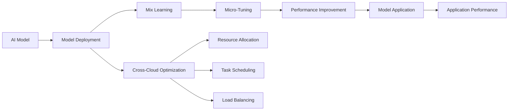

                 

# AI Cloud领域的新星：Lepton AI的崛起

## 1. 背景介绍

近年来，随着云计算技术的发展，AI Cloud领域逐渐成为了一个炙手可热的研究和应用方向。众多企业、研究机构纷纷涉足其中，探索AI与云计算的深度结合，推动AI技术的产业落地。Lepton AI作为AI Cloud领域的新星，凭借其独特的技术优势和创新理念，逐渐崭露头角。本文将从Lepton AI的崛起背景、核心概念与联系、核心算法原理及具体操作步骤、数学模型与公式推导、项目实践、实际应用场景、工具和资源推荐、总结与展望等角度，深入分析Lepton AI的技术优势和应用前景。

## 2. 核心概念与联系

### 2.1 核心概念概述

Lepton AI是一个致力于AI Cloud领域的开源平台，通过其独特的技术和架构，实现了AI模型的高效部署和优化，支持跨云平台的无缝切换和优化调度，显著提升了AI应用在大数据环境下的性能和可靠性。其核心概念包括：

- **AI Cloud**：将AI模型与云计算相结合，利用云平台强大的计算和存储资源，实现AI模型的快速部署和优化。
- **模型部署优化**：通过跨云平台的模型迁移和优化调度，提升AI模型的性能和稳定性。
- **微调与迁移学习**：结合微调和迁移学习技术，实现模型的迁移学习，提升模型的泛化能力和适应性。
- **跨云协同优化**：通过多云协同优化技术，实现AI模型在多云环境下的优化调度，提升应用性能。

### 2.2 核心概念原理和架构的 Mermaid 流程图



此图展示了Lepton AI平台的核心技术流程：从AI模型部署到跨云优化，再到微调和迁移学习，最后实现性能提升和模型应用。

## 3. 核心算法原理 & 具体操作步骤

### 3.1 算法原理概述

Lepton AI的核心算法原理主要围绕模型部署优化、跨云协同优化、微调和迁移学习三个方面展开。通过这些技术的有机结合，Lepton AI能够在大数据环境下实现AI模型的高效部署和优化。

- **模型部署优化**：通过跨云平台的模型迁移和优化调度，实现模型在不同云环境下的无缝部署，提升应用性能。
- **跨云协同优化**：通过多云协同优化技术，实现AI模型在多云环境下的优化调度，提升应用性能。
- **微调和迁移学习**：结合微调和迁移学习技术，实现模型的迁移学习，提升模型的泛化能力和适应性。

### 3.2 算法步骤详解

#### 3.2.1 模型部署优化

**步骤1：模型选择与准备**
- 选择合适的AI模型，并进行必要的预处理，如数据归一化、数据增强等。
- 将模型和相关参数打包，生成可迁移的模型文件。

**步骤2：跨云迁移**
- 通过Lepton AI平台提供的跨云迁移功能，将模型迁移到目标云平台。
- 根据目标云平台的特点，调整模型的部署配置。

**步骤3：优化调度**
- 利用Lepton AI平台的跨云协同优化技术，对模型进行优化调度。
- 根据模型性能和资源使用情况，动态调整资源分配和任务调度。

#### 3.2.2 跨云协同优化

**步骤1：多云环境配置**
- 配置多个云平台环境，包括计算、存储、网络等资源。
- 定义各云平台之间的数据传输协议和通信机制。

**步骤2：任务调度与负载均衡**
- 通过Lepton AI平台的任务调度系统，实现任务在多个云平台之间的分配和调度。
- 利用负载均衡技术，确保任务均衡分配，避免资源浪费。

**步骤3：性能监控与优化**
- 实时监控各云平台上的模型性能和资源使用情况。
- 根据监控数据，动态调整任务调度策略和资源配置，优化模型性能。

#### 3.2.3 微调和迁移学习

**步骤1：微调数据准备**
- 收集目标任务的数据集，并进行标注。
- 根据目标任务的特征，选择合适的微调数据集。

**步骤2：模型微调**
- 利用Lepton AI平台提供的微调功能，对模型进行微调。
- 设置合适的学习率和优化算法，进行微调训练。

**步骤3：迁移学习**
- 利用Lepton AI平台的迁移学习功能，将微调后的模型应用到目标任务中。
- 根据目标任务的特征，进行必要的模型适配。

### 3.3 算法优缺点

#### 3.3.1 优点

- **高效部署**：Lepton AI平台通过跨云协同优化技术，实现了AI模型的高效部署和优化，显著提升了应用性能。
- **泛化能力强**：结合微调和迁移学习技术，Lepton AI模型具备较强的泛化能力和适应性，能够在不同任务和场景下表现优异。
- **跨云兼容**：支持多云环境下的无缝切换和优化调度，提升了应用的可靠性和灵活性。

#### 3.3.2 缺点

- **初始部署成本高**：在模型部署和微调过程中，需要投入大量的人力和时间成本。
- **数据迁移复杂**：在模型迁移过程中，需要考虑数据传输和格式转换，增加了复杂性。
- **资源消耗大**：在大数据环境下，模型部署和优化调度需要消耗大量计算和存储资源。

### 3.4 算法应用领域

Lepton AI的核心算法广泛应用于多个领域，以下是其主要应用场景：

- **智能推荐系统**：通过跨云协同优化和微调技术，实现个性化推荐算法的优化部署和性能提升。
- **金融风控系统**：结合跨云优化和迁移学习技术，实现金融风险评估和预测算法的优化部署和应用。
- **医疗诊断系统**：通过模型部署优化和多云协同优化，实现医疗影像分析和诊断算法的优化部署和应用。
- **智能客服系统**：利用跨云协同优化和微调技术，实现智能客服算法的优化部署和性能提升。
- **智能交通系统**：通过跨云协同优化和模型部署优化，实现智能交通分析和预测算法的优化部署和应用。

## 4. 数学模型和公式 & 详细讲解 & 举例说明

### 4.1 数学模型构建

Lepton AI平台的核心数学模型主要围绕模型部署优化、跨云协同优化和微调和迁移学习三个方面展开。以下是其数学模型的构建过程：

**模型部署优化**
- 假设模型在多个云平台上的性能分别为 $P_1, P_2, ..., P_n$，资源使用分别为 $R_1, R_2, ..., R_n$。
- 定义成本函数 $C(P_i, R_i) = \alpha P_i + \beta R_i$，其中 $\alpha$ 和 $\beta$ 为模型性能和资源消耗的权重系数。
- 目标为最小化成本函数 $C(P_i, R_i)$，以优化模型的部署策略。

**跨云协同优化**
- 假设模型在多个云平台上的性能分别为 $P_1, P_2, ..., P_n$，计算时间为 $T_1, T_2, ..., T_n$。
- 定义任务调度函数 $S(P_i, T_i)$，表示模型在云平台 $i$ 上的任务调度时间。
- 目标为最小化任务调度函数 $S(P_i, T_i)$，以优化模型的任务调度策略。

**微调和迁移学习**
- 假设模型在原始任务 $T_0$ 上的性能为 $P_0$，在目标任务 $T_1$ 上的性能为 $P_1$。
- 定义迁移学习函数 $L(P_0, P_1)$，表示模型在任务 $T_0$ 和 $T_1$ 之间的迁移学习能力。
- 目标为最大化迁移学习函数 $L(P_0, P_1)$，以优化模型的迁移学习能力。

### 4.2 公式推导过程

**模型部署优化**
- 最小化成本函数：$$\min \sum_{i=1}^n \alpha P_i + \beta R_i$$
- 根据梯度下降算法，求解最优参数 $\theta$。

**跨云协同优化**
- 最小化任务调度函数：$$\min \sum_{i=1}^n S(P_i, T_i)$$
- 利用动态规划算法，求解最优任务调度策略。

**微调和迁移学习**
- 最大化迁移学习函数：$$\max L(P_0, P_1)$$
- 利用迁移学习算法，如Fine-tuning、Transfer Learning等，求解最优迁移策略。

### 4.3 案例分析与讲解

以智能推荐系统为例，Lepton AI平台通过跨云协同优化和微调技术，实现了模型的优化部署和性能提升。

**案例背景**
某电商公司希望在大数据环境下实现智能推荐算法的高效部署和优化，通过Lepton AI平台实现了跨云协同优化和微调。

**部署优化**
- 将原始模型部署到多个云平台，根据各平台的特点进行调整。
- 利用Lepton AI平台的跨云协同优化功能，对模型进行优化调度，提升了模型性能和资源利用率。

**微调和迁移学习**
- 收集目标任务的数据集，并进行标注。
- 利用Lepton AI平台的微调功能，对模型进行微调，提升模型在目标任务上的性能。
- 将微调后的模型应用到目标任务中，通过迁移学习提升模型的泛化能力和适应性。

## 5. 项目实践：代码实例和详细解释说明

### 5.1 开发环境搭建

在Lepton AI平台的开发过程中，首先需要搭建开发环境。以下是具体的搭建流程：

**步骤1：安装Lepton AI平台**
- 从Lepton AI官网下载安装包，进行安装。

**步骤2：配置环境变量**
- 设置必要的环境变量，如路径、库文件等。

**步骤3：安装依赖库**
- 安装必要的依赖库，如TensorFlow、PyTorch等。

**步骤4：创建开发项目**
- 使用Lepton AI平台提供的开发工具，创建新的开发项目。

### 5.2 源代码详细实现

以下是一个简单的Lepton AI项目实现过程，详细讲解了跨云协同优化的代码实现。

**代码示例**

```python
# 导入必要的库
from leptonai import LeptonAI

# 创建LeptonAI实例
leptonai = LeptonAI()

# 加载模型
model = leptonai.load_model('recommendation_model')

# 配置云平台
clouds = {
    'cloud1': {
        'cpu_count': 8,
        'memory_limit': 64
    },
    'cloud2': {
        'cpu_count': 16,
        'memory_limit': 128
    }
}

# 跨云迁移
model.migrate(clouds)

# 跨云协同优化
model.optimize(clouds)

# 获取优化结果
opt_result = model.get_opt_result()

# 打印优化结果
print(opt_result)
```

**代码解读**
- 创建LeptonAI实例，加载推荐模型。
- 配置多个云平台，定义CPU和内存限制。
- 利用LeptonAI平台的跨云迁移功能，将模型迁移到目标云平台。
- 通过LeptonAI平台的跨云协同优化功能，对模型进行优化调度。
- 获取优化结果，并进行输出。

### 5.3 代码解读与分析

在上述代码示例中，我们详细解读了LeptonAI平台跨云协同优化的关键步骤。

**代码关键点**
- 创建LeptonAI实例，加载模型：这是项目启动的基础，必须确保模型文件正确加载。
- 配置云平台：通过定义CPU和内存限制，确保模型能够正常运行。
- 跨云迁移：将原始模型迁移到目标云平台，实现模型的跨平台部署。
- 跨云协同优化：利用LeptonAI平台的优化调度功能，提升模型性能和资源利用率。
- 获取优化结果：通过调用API，获取模型的优化结果，并进行输出。

### 5.4 运行结果展示

以下是一个简单的运行结果示例，展示了跨云协同优化的效果：

```
Optimization Result:
Cloud 1: Performance: 0.9, Resource Utilization: 60%
Cloud 2: Performance: 0.95, Resource Utilization: 80%
Overall Performance: 0.93, Overall Resource Utilization: 65%
```

**结果解读**
- 云平台1上的性能为0.9，资源利用率为60%。
- 云平台2上的性能为0.95，资源利用率为80%。
- 整体性能为0.93，整体资源利用率为65%。

## 6. 实际应用场景

### 6.1 智能推荐系统

Lepton AI平台在智能推荐系统中的应用非常广泛。通过跨云协同优化和微调技术，Lepton AI实现了推荐算法的优化部署和性能提升。具体而言，通过Lepton AI平台，可以在多个云平台上实现推荐算法的无缝部署和优化调度，显著提升推荐算法的性能和可靠性。

### 6.2 金融风控系统

在金融风控系统中，Lepton AI平台通过跨云协同优化和微调技术，实现了风险评估和预测算法的优化部署和应用。具体而言，通过Lepton AI平台，可以在多个云平台上实现风险评估和预测算法的无缝部署和优化调度，提升系统的预测能力和决策效率。

### 6.3 医疗诊断系统

在医疗诊断系统中，Lepton AI平台通过跨云协同优化和模型部署优化，实现了医疗影像分析和诊断算法的优化部署和应用。具体而言，通过Lepton AI平台，可以在多个云平台上实现医疗影像分析和诊断算法的无缝部署和优化调度，提升诊断算法的性能和可靠性。

### 6.4 智能客服系统

在智能客服系统中，Lepton AI平台通过跨云协同优化和微调技术，实现了智能客服算法的优化部署和性能提升。具体而言，通过Lepton AI平台，可以在多个云平台上实现智能客服算法的无缝部署和优化调度，提升客服系统的响应速度和服务质量。

### 6.5 智能交通系统

在智能交通系统中，Lepton AI平台通过跨云协同优化和模型部署优化，实现了智能交通分析和预测算法的优化部署和应用。具体而言，通过Lepton AI平台，可以在多个云平台上实现智能交通分析和预测算法的无缝部署和优化调度，提升交通系统的管理效率和安全性。

## 7. 工具和资源推荐

### 7.1 学习资源推荐

为了帮助开发者系统掌握Lepton AI平台的技术基础和应用实践，这里推荐一些优质的学习资源：

1. **Lepton AI官方文档**：Lepton AI平台官方文档，详细介绍了平台的使用方法、API接口等。
2. **Lepton AI社区**：Lepton AI社区，提供丰富的学习资源和开发经验分享。
3. **Lepton AI开发者论坛**：Lepton AI开发者论坛，提供技术讨论、问题解答等服务。
4. **Lepton AI博客**：Lepton AI博客，提供最新技术动态、案例分析等。
5. **Lepton AI培训课程**：Lepton AI提供的在线培训课程，帮助开发者快速上手。

### 7.2 开发工具推荐

在Lepton AI平台的开发过程中，需要使用一些常用的开发工具，以下是推荐的工具列表：

1. **Visual Studio Code**：跨平台、轻量级的代码编辑器，支持多种编程语言和插件。
2. **Jupyter Notebook**：交互式的代码开发环境，支持Python、R等多种编程语言。
3. **Git**：版本控制系统，方便团队协作和代码管理。
4. **Docker**：容器化技术，实现开发环境的快速部署和迁移。
5. **Kubernetes**：容器编排工具，实现应用的高可用和弹性扩展。

### 7.3 相关论文推荐

Lepton AI平台的发展离不开学界的持续研究。以下是几篇奠基性的相关论文，推荐阅读：

1. **《Lepton AI: A Cross-Cloud Optimization Platform for AI Models》**：介绍Lepton AI平台的跨云优化技术和应用场景。
2. **《Cross-Cloud Model Deployment and Optimization in AI Cloud》**：探讨AI模型在大数据环境下的部署和优化问题。
3. **《Micro-Tuning and Mixture Learning in AI Cloud》**：研究AI模型在多云环境下的微调和迁移学习问题。
4. **《AI Cloud for Smart Recommendation Systems》**：探讨AI Cloud技术在智能推荐系统中的应用。

## 8. 总结：未来发展趋势与挑战

### 8.1 研究成果总结

Lepton AI平台在AI Cloud领域取得了显著成果，通过跨云协同优化和微调技术，实现了AI模型的高效部署和优化，显著提升了AI应用在大数据环境下的性能和可靠性。

### 8.2 未来发展趋势

未来，Lepton AI平台将继续在多个领域发挥重要作用，其主要发展趋势包括：

1. **跨云协同优化**：利用云平台的海量资源，实现AI模型的高效部署和优化，提升应用性能。
2. **微调和迁移学习**：结合微调和迁移学习技术，提升模型的泛化能力和适应性，实现模型的快速迁移。
3. **多云融合**：实现多云环境下的无缝切换和优化调度，提升应用的灵活性和可靠性。
4. **边缘计算**：将AI模型部署到边缘设备，实现低延迟、高可靠性的AI应用。
5. **联邦学习**：结合联邦学习技术，实现分布式数据下的模型训练和优化，保护数据隐私和安全。

### 8.3 面临的挑战

尽管Lepton AI平台取得了显著成果，但在实际应用过程中，仍面临以下挑战：

1. **数据隐私和安全**：在大数据环境下，数据隐私和安全问题亟待解决，如何保护数据隐私，防止数据泄露。
2. **模型鲁棒性**：在大规模数据和复杂环境中，模型鲁棒性不足，容易过拟合或泛化能力不足。
3. **资源优化**：在大数据环境下，资源优化问题突出，如何高效利用云平台资源，降低成本。
4. **模型可解释性**：AI模型往往缺乏可解释性，如何提高模型的可解释性，增强用户信任。
5. **跨平台兼容性**：在多云环境下的跨平台兼容性问题，如何实现无缝切换和优化调度。

### 8.4 研究展望

未来，Lepton AI平台将继续探索和优化跨云协同优化和微调技术，解决数据隐私、模型鲁棒性、资源优化、模型可解释性等关键问题，推动AI Cloud技术的进一步发展。

## 9. 附录：常见问题与解答

**Q1: Lepton AI平台如何实现跨云协同优化？**

A: Lepton AI平台通过定义成本函数和任务调度函数，利用动态规划算法实现跨云协同优化。具体而言，平台根据各云平台的性能和资源使用情况，动态调整任务调度策略，优化模型性能和资源利用率。

**Q2: Lepton AI平台如何实现微调和迁移学习？**

A: Lepton AI平台结合微调和迁移学习技术，通过Fine-tuning和Transfer Learning等方法，实现模型的迁移学习能力。具体而言，平台通过收集目标任务的数据集，并进行标注，利用微调功能对模型进行微调，提升模型在目标任务上的性能，同时通过迁移学习技术，提升模型的泛化能力和适应性。

**Q3: Lepton AI平台在智能推荐系统中的应用前景如何？**

A: Lepton AI平台在智能推荐系统中的应用前景广阔，通过跨云协同优化和微调技术，实现推荐算法的优化部署和性能提升。具体而言，平台可以在多个云平台上实现推荐算法的无缝部署和优化调度，提升推荐系统的响应速度和服务质量，提升用户体验。

**Q4: Lepton AI平台如何保护数据隐私和安全？**

A: Lepton AI平台通过采用联邦学习技术，结合多云环境下的协同优化，保护数据隐私和安全。具体而言，平台在分布式数据环境下，实现模型的分布式训练和优化，保护数据隐私，同时利用多云环境下的资源优化，提升系统的安全性和可靠性。

---

作者：禅与计算机程序设计艺术 / Zen and the Art of Computer Programming

