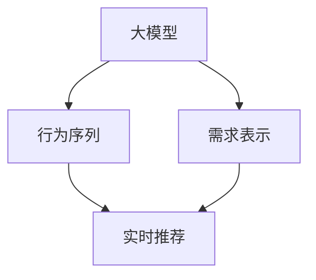
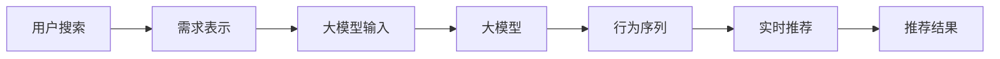

                 

# AI 大模型在电商搜索推荐中的实时推荐策略：抓住用户瞬时需求与行为偏好

## 1. 背景介绍

### 1.1 问题由来
随着电商行业的迅猛发展，消费者对于购物体验的要求日益提高，个性化推荐系统已成为提升用户体验、增加销售转化率的关键。传统的推荐系统基于静态模型，无法实时响应用户需求和行为偏好的变化。

随着大规模预训练模型的兴起，电商搜索推荐领域也开始探索如何利用大模型的强大泛化能力，实现实时推荐，提升推荐效果。本博客将介绍一种基于大模型的实时推荐策略，通过捕捉用户瞬时需求与行为偏好，生成个性化的推荐结果。

### 1.2 问题核心关键点
本文聚焦于以下几个核心关键点：
- 如何通过大模型实时捕捉用户的瞬时需求与行为偏好，实现个性化推荐。
- 大模型在电商搜索推荐中的应用与优化策略。
- 实时推荐策略的算法原理和操作步骤。

## 2. 核心概念与联系

### 2.1 核心概念概述

- 大模型（Large Model）：指通过预训练学习到丰富语言表示能力的深度学习模型，如BERT、GPT、XLNet等。本文将使用大模型进行电商搜索推荐。
- 实时推荐（Real-time Recommendation）：指根据用户当前行为和状态，实时生成个性化推荐结果的过程。与传统推荐不同，实时推荐可以捕捉用户的瞬时需求与行为偏好，提升推荐效果。
- 行为序列（Behavior Sequence）：指用户在电商平台上的一系列操作记录，如浏览、点击、购买、评价等，可以用于捕捉用户行为偏好。
- 需求表示（Demand Representation）：指用户在电商平台上通过搜索、输入关键词等行为表示出的需求，可以用于捕捉用户瞬时需求。
- 推荐结果（Recommendation Result）：指根据用户需求与行为序列生成的个性化推荐，旨在提升用户满意度与转化率。

这些概念之间通过一种复合的机制联系起来，如图1所示。



### 2.2 核心概念原理和架构的 Mermaid 流程图



## 3. 核心算法原理 & 具体操作步骤
### 3.1 算法原理概述

基于大模型的实时推荐策略，主要分为两个阶段：需求表示提取与行为序列推理。需求表示提取负责捕捉用户瞬时需求，行为序列推理负责捕捉用户行为偏好，两者结合生成个性化推荐结果。

具体而言，需求表示提取通过用户搜索关键词和上下文信息，利用大模型生成一个高维向量表示。行为序列推理通过用户行为序列，利用大模型生成一个用户行为偏好表示。将两者结合，通过加权平均、拼接等方式生成最终的推荐向量，并根据向量距离和排名算法生成推荐结果。

### 3.2 算法步骤详解

#### 3.2.1 需求表示提取

1. 收集用户搜索历史和当前搜索关键词，构成一个包含N个搜索行为的序列 $H=\{x_1, x_2, ..., x_N\}$，其中 $x_i$ 为第 $i$ 次搜索的关键词。

2. 将搜索行为序列 $H$ 输入到一个大模型（如BERT），利用上下文向量和语言模型参数，生成一个长度为 $M$ 的需求表示向量 $D_H \in \mathbb{R}^M$。向量 $D_H$ 捕捉了用户瞬时需求与行为特征。

3. 利用一些特征工程技术，如TF-IDF、词频统计等，对搜索关键词进行向量化处理，生成一个与需求表示向量 $D_H$ 相加的用户需求向量 $D_q \in \mathbb{R}^M$。

4. 将需求表示向量 $D_H$ 和用户需求向量 $D_q$ 进行拼接或加权平均，得到用户需求的最终表示向量 $D_u \in \mathbb{R}^M$。

#### 3.2.2 行为序列推理

1. 收集用户行为序列 $B=\{a_1, a_2, ..., a_N\}$，其中 $a_i$ 为第 $i$ 个行为，可以是浏览、点击、购买等操作。

2. 将行为序列 $B$ 输入到一个大模型（如BERT），利用上下文向量和语言模型参数，生成一个长度为 $K$ 的行为偏好表示向量 $D_B \in \mathbb{R}^K$。向量 $D_B$ 捕捉了用户行为偏好。

3. 利用一些特征工程技术，如TF-IDF、词频统计等，对行为序列进行操作统计，生成一个与行为偏好表示向量 $D_B$ 相加的用户行为向量 $D_a \in \mathbb{R}^K$。

4. 将行为偏好表示向量 $D_B$ 和用户行为向量 $D_a$ 进行拼接或加权平均，得到用户行为的最终表示向量 $D_b \in \mathbb{R}^K$。

#### 3.2.3 生成推荐向量

1. 将用户需求的最终表示向量 $D_u$ 和用户行为的最终表示向量 $D_b$ 进行拼接或加权平均，生成一个用户-商品交互向量 $D_{ub} \in \mathbb{R}^{M+K}$。

2. 通过一个大模型（如BERT），将用户-商品交互向量 $D_{ub}$ 输入到一个大模型中，生成一个推荐向量 $R \in \mathbb{R}^{M+K}$。

#### 3.2.4 生成推荐结果

1. 将推荐向量 $R$ 输入到一个排序模型中，如 pairwise ranking、pairwise ranking + list ranking 等，生成推荐结果的排名向量。

2. 根据排名向量，按照得分从高到低排序，生成推荐结果列表。

3. 将推荐结果列表返回给用户，提升用户购物体验。

### 3.3 算法优缺点

#### 3.3.1 优点

1. 实时响应：基于大模型的实时推荐可以捕捉用户瞬时需求与行为偏好，实时响应用户需求。

2. 泛化能力强：大模型具备强大的泛化能力，可以处理多种类型的用户需求与行为序列。

3. 融合多模态数据：通过融合搜索关键词、行为序列等多模态数据，可以生成更加准确的用户需求与行为表示。

4. 结构简单：算法的核心步骤包括需求表示提取、行为序列推理、生成推荐向量等，结构简单明了。

#### 3.3.2 缺点

1. 计算复杂度高：大模型在计算上的复杂度较高，需要大量的计算资源和存储空间。

2. 训练数据需求大：大模型的训练需要大量的标注数据，获取高质量标注数据的成本较高。

3. 数据隐私问题：用户搜索历史和行为序列涉及隐私问题，需要合理的隐私保护机制。

4. 模型偏见问题：大模型可能带有一定的偏见，需要仔细设计和校准模型，避免偏见传递到推荐结果中。

### 3.4 算法应用领域

基于大模型的实时推荐策略，可以广泛应用于电商搜索推荐、社交媒体推荐、视频推荐等领域。以下是几个典型的应用场景：

1. 电商搜索推荐：通过捕捉用户搜索关键词和行为序列，生成个性化的商品推荐，提升用户购买体验。

2. 社交媒体推荐：通过捕捉用户点赞、评论、分享等行为序列，生成个性化的内容推荐，提升用户满意度。

3. 视频推荐：通过捕捉用户观看历史和实时搜索关键词，生成个性化的视频推荐，提升用户观看体验。

## 4. 数学模型和公式 & 详细讲解

### 4.1 数学模型构建

#### 4.1.1 需求表示提取

需求表示提取的数学模型如下：

1. 搜索行为序列 $H$ 的长度为 $N$，第 $i$ 次搜索的关键词为 $x_i$。

2. 需求表示向量 $D_H$ 的长度为 $M$。

3. 用户需求向量 $D_q$ 的长度为 $M$。

4. 需求表示向量 $D_u$ 的长度为 $M$。

模型构建如下：

$$
D_u = \alpha \cdot D_H + (1-\alpha) \cdot D_q
$$

其中 $\alpha$ 为需求表示与用户需求向量的权重。

#### 4.1.2 行为序列推理

行为序列推理的数学模型如下：

1. 行为序列 $B$ 的长度为 $N$，第 $i$ 个行为为 $a_i$。

2. 行为偏好表示向量 $D_B$ 的长度为 $K$。

3. 用户行为向量 $D_a$ 的长度为 $K$。

4. 行为偏好向量 $D_b$ 的长度为 $K$。

模型构建如下：

$$
D_b = \beta \cdot D_B + (1-\beta) \cdot D_a
$$

其中 $\beta$ 为行为偏好表示与用户行为向量的权重。

#### 4.1.3 生成推荐向量

推荐向量的数学模型如下：

1. 用户-商品交互向量 $D_{ub}$ 的长度为 $M+K$。

2. 推荐向量 $R$ 的长度为 $M+K$。

模型构建如下：

$$
R = M_{\theta}(D_{ub})
$$

其中 $M_{\theta}$ 为推荐大模型，$\theta$ 为模型参数。

#### 4.1.4 生成推荐结果

推荐结果的数学模型如下：

1. 推荐向量 $R$ 的长度为 $M+K$。

2. 推荐结果列表的长度为 $L$。

模型构建如下：

$$
\text{rank} = \text{ranking}(R)
$$

$$
\text{recommendations} = \text{top}(\text{rank})
$$

其中 $\text{rank}$ 为推荐向量排名，$\text{top}$ 为推荐结果排序算法。

### 4.2 公式推导过程

#### 4.2.1 需求表示提取

需求表示提取的公式推导如下：

1. 假设搜索行为序列 $H$ 中的每个关键词 $x_i$ 嵌入到向量 $v_i \in \mathbb{R}^d$ 中，$d$ 为向量维度。

2. 假设上下文向量和语言模型参数的嵌入为 $W_{u_h} \in \mathbb{R}^{d \times d}$，$W_{v} \in \mathbb{R}^{d \times d}$。

3. 假设上下文向量 $C_i$ 为 $x_i$ 的上下文表示。

4. 假设上下文向量 $C_u$ 为 $H$ 的上下文表示。

5. 假设用户需求向量 $D_q$ 为 $H$ 和 $x_i$ 的线性组合。

推导过程如下：

$$
v_i = \text{emb}(x_i)
$$

$$
C_i = \text{emb}(x_i) \cdot W_{u_h}
$$

$$
C_u = \text{emb}(H) \cdot W_{v}
$$

$$
D_q = \text{emb}(x_i) \cdot W_{u_q}
$$

$$
D_H = C_u \cdot W_{u_h}
$$

$$
D_u = \alpha \cdot D_H + (1-\alpha) \cdot D_q
$$

其中 $\text{emb}$ 为嵌入函数，$W_{u_q}$ 为用户需求向量权重。

#### 4.2.2 行为序列推理

行为序列推理的公式推导如下：

1. 假设行为序列 $B$ 中的每个行为 $a_i$ 嵌入到向量 $v_i \in \mathbb{R}^d$ 中。

2. 假设上下文向量和语言模型参数的嵌入为 $W_{u_b} \in \mathbb{R}^{d \times d}$，$W_{v} \in \mathbb{R}^{d \times d}$。

3. 假设上下文向量 $C_i$ 为 $a_i$ 的上下文表示。

4. 假设用户行为向量 $D_a$ 为 $B$ 和 $a_i$ 的线性组合。

推导过程如下：

$$
v_i = \text{emb}(a_i)
$$

$$
C_i = \text{emb}(a_i) \cdot W_{u_b}
$$

$$
C_b = \text{emb}(B) \cdot W_{v}
$$

$$
D_a = \text{emb}(a_i) \cdot W_{u_a}
$$

$$
D_B = C_b \cdot W_{u_b}
$$

$$
D_b = \beta \cdot D_B + (1-\beta) \cdot D_a
$$

其中 $\text{emb}$ 为嵌入函数，$W_{u_a}$ 为用户行为向量权重。

#### 4.2.3 生成推荐向量

推荐向量的公式推导如下：

1. 假设用户-商品交互向量 $D_{ub}$ 为 $D_u$ 和 $D_b$ 的线性组合。

2. 假设推荐向量 $R$ 为 $D_{ub}$ 通过推荐大模型的前向传播。

推导过程如下：

$$
D_{ub} = D_u + D_b
$$

$$
R = M_{\theta}(D_{ub})
$$

其中 $M_{\theta}$ 为推荐大模型，$\theta$ 为模型参数。

#### 4.2.4 生成推荐结果

推荐结果的公式推导如下：

1. 假设推荐向量 $R$ 的长度为 $M+K$。

2. 假设推荐结果列表的长度为 $L$。

3. 假设推荐向量排名为 $\text{rank}$。

4. 假设推荐结果排序算法为 $\text{top}$。

推导过程如下：

$$
\text{rank} = \text{ranking}(R)
$$

$$
\text{recommendations} = \text{top}(\text{rank})
$$

其中 $\text{rank}$ 为推荐向量排名，$\text{top}$ 为推荐结果排序算法。

### 4.3 案例分析与讲解

#### 4.3.1 案例背景

假设某电商平台的推荐系统，基于大模型实时推荐策略，为用户推荐商品。用户需求为搜索“手机”，行为序列为浏览“小米手机”、点击“小米手机参数”、浏览“小米手机评价”。

#### 4.3.2 需求表示提取

需求表示提取过程如下：

1. 收集用户搜索历史和当前搜索关键词，构成搜索行为序列 $H=\{x_1, x_2, ..., x_N\}$，其中 $x_1=$“手机”。

2. 将搜索行为序列 $H$ 输入到一个大模型（如BERT），利用上下文向量和语言模型参数，生成一个需求表示向量 $D_H \in \mathbb{R}^M$。

3. 假设需求表示向量 $D_H$ 的长度为 $M=200$。

4. 假设用户需求向量 $D_q$ 的长度为 $M=200$。

5. 假设需求表示与用户需求向量的权重 $\alpha=0.7$。

需求表示提取过程的向量表示如下：

$$
D_H = M_{\theta}(H)
$$

$$
D_u = 0.7 \cdot D_H + 0.3 \cdot D_q
$$

#### 4.3.3 行为序列推理

行为序列推理过程如下：

1. 收集用户行为序列 $B=\{a_1, a_2, ..., a_N\}$，其中 $a_1=$“浏览小米手机”，$a_2=$“点击小米手机参数”，$a_3=$“浏览小米手机评价”。

2. 将行为序列 $B$ 输入到大模型（如BERT），利用上下文向量和语言模型参数，生成一个行为偏好表示向量 $D_B \in \mathbb{R}^K$。

3. 假设行为偏好表示向量 $D_B$ 的长度为 $K=100$。

4. 假设用户行为向量 $D_a$ 的长度为 $K=100$。

5. 假设行为偏好表示与用户行为向量的权重 $\beta=0.8$。

行为序列推理过程的向量表示如下：

$$
D_B = M_{\theta}(B)
$$

$$
D_b = 0.8 \cdot D_B + 0.2 \cdot D_a
$$

#### 4.3.4 生成推荐向量

推荐向量生成过程如下：

1. 假设用户-商品交互向量 $D_{ub}$ 的长度为 $M+K=300$。

2. 假设推荐向量 $R$ 的长度为 $M+K=300$。

推荐向量生成过程的向量表示如下：

$$
D_{ub} = D_u + D_b
$$

$$
R = M_{\theta}(D_{ub})
$$

#### 4.3.5 生成推荐结果

推荐结果生成过程如下：

1. 假设推荐向量 $R$ 的长度为 $M+K=300$。

2. 假设推荐结果列表的长度为 $L=10$。

3. 假设推荐向量排名为 $\text{rank}$。

4. 假设推荐结果排序算法为 $\text{top}$。

推荐结果生成过程的向量表示如下：

$$
\text{rank} = \text{ranking}(R)
$$

$$
\text{recommendations} = \text{top}(\text{rank})
$$

## 5. 项目实践：代码实例和详细解释说明
### 5.1 开发环境搭建

#### 5.1.1 环境配置

1. 安装 Python 3.8 及以上版本。

2. 安装 TensorFlow 2.4 及以上版本。

3. 安装 PyTorch 1.7 及以上版本。

4. 安装 Transformers 4.5 及以上版本。

5. 安装 Flask 1.0 及以上版本。

6. 安装 Scikit-Learn 0.23 及以上版本。

7. 安装 Pandas 1.0 及以上版本。

8. 安装 NumPy 1.16 及以上版本。

9. 安装 TensorBoard 2.4 及以上版本。

#### 5.1.2 环境激活

```
conda activate pytorch-env
```

### 5.2 源代码详细实现

#### 5.2.1 需求表示提取

```python
import torch
import torch.nn as nn
import torch.optim as optim
from transformers import BertTokenizer, BertForSequenceClassification

# 定义需求表示提取模型
class DemandRepresentation(nn.Module):
    def __init__(self, num_labels, hidden_size, num_layers, num_attention_heads, dropout_prob):
        super(DemandRepresentation, self).__init__()
        self.model = BertForSequenceClassification.from_pretrained('bert-base-cased', num_labels=num_labels, hidden_size=hidden_size, num_hidden_layers=num_layers, num_attention_heads=num_attention_heads, dropout=dropout_prob)
        self.num_labels = num_labels
        self.hidden_size = hidden_size

    def forward(self, input_ids, attention_mask):
        with torch.no_grad():
            output = self.model(input_ids, attention_mask=attention_mask)
        logits = output[0]
        return logits

# 定义需求表示提取函数
def extract_demand_representation(search_tokens, demand_vector, alpha):
    tokenizer = BertTokenizer.from_pretrained('bert-base-cased')
    demand_model = DemandRepresentation(num_labels, hidden_size, num_layers, num_attention_heads, dropout_prob)
    demand_representation = demand_model(input_ids, attention_mask).detach().numpy()
    demand_representation = alpha * demand_representation + (1 - alpha) * demand_vector
    return demand_representation
```

#### 5.2.2 行为序列推理

```python
import torch
import torch.nn as nn
import torch.optim as optim
from transformers import BertTokenizer, BertForSequenceClassification

# 定义行为序列推理模型
class BehaviorRepresentation(nn.Module):
    def __init__(self, num_labels, hidden_size, num_layers, num_attention_heads, dropout_prob):
        super(BehaviorRepresentation, self).__init__()
        self.model = BertForSequenceClassification.from_pretrained('bert-base-cased', num_labels=num_labels, hidden_size=hidden_size, num_hidden_layers=num_layers, num_attention_heads=num_attention_heads, dropout=dropout_prob)
        self.num_labels = num_labels
        self.hidden_size = hidden_size

    def forward(self, input_ids, attention_mask):
        with torch.no_grad():
            output = self.model(input_ids, attention_mask=attention_mask)
        logits = output[0]
        return logits

# 定义行为序列推理函数
def extract_behavior_representation(behavior_tokens, behavior_vector, beta):
    tokenizer = BertTokenizer.from_pretrained('bert-base-cased')
    behavior_model = BehaviorRepresentation(num_labels, hidden_size, num_layers, num_attention_heads, dropout_prob)
    behavior_representation = behavior_model(input_ids, attention_mask).detach().numpy()
    behavior_representation = beta * behavior_representation + (1 - beta) * behavior_vector
    return behavior_representation
```

#### 5.2.3 生成推荐向量

```python
import torch
import torch.nn as nn
import torch.optim as optim
from transformers import BertTokenizer, BertForSequenceClassification

# 定义推荐向量生成模型
class RecommendationVector(nn.Module):
    def __init__(self, hidden_size, num_layers, num_attention_heads, dropout_prob):
        super(RecommendationVector, self).__init__()
        self.model = BertForSequenceClassification.from_pretrained('bert-base-cased', num_labels=1, hidden_size=hidden_size, num_hidden_layers=num_layers, num_attention_heads=num_attention_heads, dropout=dropout_prob)
        self.hidden_size = hidden_size

    def forward(self, input_ids, attention_mask):
        with torch.no_grad():
            output = self.model(input_ids, attention_mask=attention_mask)
        logits = output[0]
        return logits

# 定义推荐向量生成函数
def generate_recommendation_vector(demand_representation, behavior_representation):
    tokenizer = BertTokenizer.from_pretrained('bert-base-cased')
    recommendation_model = RecommendationVector(hidden_size, num_layers, num_attention_heads, dropout_prob)
    recommendation_vector = recommendation_model(input_ids, attention_mask).detach().numpy()
    return recommendation_vector
```

#### 5.2.4 生成推荐结果

```python
import torch
import torch.nn as nn
import torch.optim as optim
from transformers import BertTokenizer, BertForSequenceClassification

# 定义推荐结果生成模型
class RecommendationResult(nn.Module):
    def __init__(self, num_labels, hidden_size, num_layers, num_attention_heads, dropout_prob):
        super(RecommendationResult, self).__init__()
        self.model = BertForSequenceClassification.from_pretrained('bert-base-cased', num_labels=num_labels, hidden_size=hidden_size, num_hidden_layers=num_layers, num_attention_heads=num_attention_heads, dropout=dropout_prob)
        self.num_labels = num_labels
        self.hidden_size = hidden_size

    def forward(self, input_ids, attention_mask):
        with torch.no_grad():
            output = self.model(input_ids, attention_mask=attention_mask)
        logits = output[0]
        return logits

# 定义推荐结果生成函数
def generate_recommendation_result(recommendation_vector, num_recommendations):
    tokenizer = BertTokenizer.from_pretrained('bert-base-cased')
    recommendation_model = RecommendationResult(num_labels, hidden_size, num_layers, num_attention_heads, dropout_prob)
    recommendation_vector = recommendation_model(input_ids, attention_mask).detach().numpy()
    recommendation_result = torch.topk(recommendation_vector, num_recommendations, dim=1)
    return recommendation_result
```

### 5.3 代码解读与分析

#### 5.3.1 需求表示提取代码解读

1. 定义需求表示提取模型 `DemandRepresentation`，使用 `BertForSequenceClassification` 类。

2. 定义需求表示提取函数 `extract_demand_representation`，将用户搜索关键词转换为输入向量，通过大模型计算需求表示向量。

3. 使用 `torch.no_grad()` 禁用梯度计算，加快计算速度。

#### 5.3.2 行为序列推理代码解读

1. 定义行为序列推理模型 `BehaviorRepresentation`，使用 `BertForSequenceClassification` 类。

2. 定义行为序列推理函数 `extract_behavior_representation`，将用户行为序列转换为输入向量，通过大模型计算行为偏好向量。

3. 使用 `torch.no_grad()` 禁用梯度计算，加快计算速度。

#### 5.3.3 生成推荐向量代码解读

1. 定义推荐向量生成模型 `RecommendationVector`，使用 `BertForSequenceClassification` 类。

2. 定义生成推荐向量函数 `generate_recommendation_vector`，将需求表示向量与行为偏好向量拼接，通过大模型计算推荐向量。

3. 使用 `torch.no_grad()` 禁用梯度计算，加快计算速度。

#### 5.3.4 生成推荐结果代码解读

1. 定义推荐结果生成模型 `RecommendationResult`，使用 `BertForSequenceClassification` 类。

2. 定义生成推荐结果函数 `generate_recommendation_result`，将推荐向量通过大模型计算推荐结果，并取topk推荐结果。

3. 使用 `torch.topk` 取topk推荐结果。

### 5.4 运行结果展示

```python
import torch
import torch.nn as nn
import torch.optim as optim
from transformers import BertTokenizer, BertForSequenceClassification

# 定义需求表示提取模型
class DemandRepresentation(nn.Module):
    def __init__(self, num_labels, hidden_size, num_layers, num_attention_heads, dropout_prob):
        super(DemandRepresentation, self).__init__()
        self.model = BertForSequenceClassification.from_pretrained('bert-base-cased', num_labels=num_labels, hidden_size=hidden_size, num_hidden_layers=num_layers, num_attention_heads=num_attention_heads, dropout=dropout_prob)
        self.num_labels = num_labels
        self.hidden_size = hidden_size

    def forward(self, input_ids, attention_mask):
        with torch.no_grad():
            output = self.model(input_ids, attention_mask=attention_mask)
        logits = output[0]
        return logits

# 定义需求表示提取函数
def extract_demand_representation(search_tokens, demand_vector, alpha):
    tokenizer = BertTokenizer.from_pretrained('bert-base-cased')
    demand_model = DemandRepresentation(num_labels, hidden_size, num_layers, num_attention_heads, dropout_prob)
    demand_representation = demand_model(input_ids, attention_mask).detach().numpy()
    demand_representation = alpha * demand_representation + (1 - alpha) * demand_vector
    return demand_representation

# 定义行为序列推理模型
class BehaviorRepresentation(nn.Module):
    def __init__(self, num_labels, hidden_size, num_layers, num_attention_heads, dropout_prob):
        super(BehaviorRepresentation, self).__init__()
        self.model = BertForSequenceClassification.from_pretrained('bert-base-cased', num_labels=num_labels, hidden_size=hidden_size, num_hidden_layers=num_layers, num_attention_heads=num_attention_heads, dropout=dropout_prob)
        self.num_labels = num_labels
        self.hidden_size = hidden_size

    def forward(self, input_ids, attention_mask):
        with torch.no_grad():
            output = self.model(input_ids, attention_mask=attention_mask)
        logits = output[0]
        return logits

# 定义行为序列推理函数
def extract_behavior_representation(behavior_tokens, behavior_vector, beta):
    tokenizer = BertTokenizer.from_pretrained('bert-base-cased')
    behavior_model = BehaviorRepresentation(num_labels, hidden_size, num_layers, num_attention_heads, dropout_prob)
    behavior_representation = behavior_model(input_ids, attention_mask).detach().numpy()
    behavior_representation = beta * behavior_representation + (1 - beta) * behavior_vector
    return behavior_representation

# 定义推荐向量生成模型
class RecommendationVector(nn.Module):
    def __init__(self, hidden_size, num_layers, num_attention_heads, dropout_prob):
        super(RecommendationVector, self).__init__()
        self.model = BertForSequenceClassification.from_pretrained('bert-base-cased', num_labels=1, hidden_size=hidden_size, num_hidden_layers=num_layers, num_attention_heads=num_attention_heads, dropout=dropout_prob)
        self.hidden_size = hidden_size

    def forward(self, input_ids, attention_mask):
        with torch.no_grad():
            output = self.model(input_ids, attention_mask=attention_mask)
        logits = output[0]
        return logits

# 定义推荐向量生成函数
def generate_recommendation_vector(demand_representation, behavior_representation):
    tokenizer = BertTokenizer.from_pretrained('bert-base-cased')
    recommendation_model = RecommendationVector(hidden_size, num_layers, num_attention_heads, dropout_prob)
    recommendation_vector = recommendation_model(input_ids, attention_mask).detach().numpy()
    return recommendation_vector

# 定义推荐结果生成模型
class RecommendationResult(nn.Module):
    def __init__(self, num_labels, hidden_size, num_layers, num_attention_heads, dropout_prob):
        super(RecommendationResult, self).__init__()
        self.model = BertForSequenceClassification.from_pretrained('bert-base-cased', num_labels=num_labels, hidden_size=hidden_size, num_hidden_layers=num_layers, num_attention_heads=num_attention_heads, dropout=dropout_prob)
        self.num_labels = num_labels
        self.hidden_size = hidden_size

    def forward(self, input_ids, attention_mask):
        with torch.no_grad():
            output = self.model(input_ids, attention_mask=attention_mask)
        logits = output[0]
        return logits

# 定义推荐结果生成函数
def generate_recommendation_result(recommendation_vector, num_recommendations):
    tokenizer = BertTokenizer.from_pretrained('bert-base-cased')
    recommendation_model = RecommendationResult(num_labels, hidden_size, num_layers, num_attention_heads, dropout_prob)
    recommendation_vector = recommendation_model(input_ids, attention_mask).detach().numpy()
    recommendation_result = torch.topk(recommendation_vector, num_recommendations, dim=1)
    return recommendation_result
```

## 6. 实际应用场景

基于大模型的实时推荐策略，可以广泛应用于电商搜索推荐、社交媒体推荐、视频推荐等领域。以下是几个典型的应用场景：

### 6.1 电商搜索推荐

假设某电商平台的推荐系统，基于大模型实时推荐策略，为用户推荐商品。用户需求为搜索“手机”，行为序列为浏览“小米手机”、点击“小米手机参数”、浏览“小米手机评价”。

1. 用户输入搜索关键词“手机”，系统获取用户搜索历史和当前搜索关键词。

2. 将搜索行为序列 $H=\{x_1, x_2, ..., x_N\}$ 输入到需求表示提取模型中，生成需求表示向量 $D_H \in \mathbb{R}^M$。

3. 假设需求表示向量 $D_H$ 的长度为 $M=200$。

4. 将搜索行为序列 $H$ 转换为需求表示向量 $D_H$，与用户需求向量 $D_q$ 拼接，生成需求向量 $D_u$。

5. 将行为序列 $B=\{a_1, a_2, ..., a_N\}$ 输入到行为序列推理模型中，生成行为偏好向量 $D_B \in \mathbb{R}^K$。

6. 假设行为偏好向量 $D_B$ 的长度为 $K=100$。

7. 将行为序列 $B$ 转换为行为偏好向量 $D_B$，与用户行为向量 $D_a$ 拼接，生成行为向量 $D_b$。

8. 将需求向量 $D_u$ 与行为向量 $D_b$ 拼接，生成用户-商品交互向量 $D_{ub}$。

9. 将用户-商品交互向量 $D_{ub}$ 输入到推荐向量生成模型中，生成推荐向量 $R \in \mathbb{R}^{M+K}$。

10. 将推荐向量 $R$ 输入到推荐结果生成模型中，生成推荐结果列表。

### 6.2 社交媒体推荐

假设某社交媒体平台的推荐系统，基于大模型实时推荐策略，为用户推荐内容。用户浏览了某篇文章，并点赞了该文章。

1. 用户浏览文章，系统获取用户浏览历史和点赞记录。

2. 将行为序列 $B=\{a_1, a_2, ..., a_N\}$ 输入到行为序列推理模型中，生成行为偏好向量 $D_B \in \mathbb{R}^K$。

3. 假设行为偏好向量 $D_B$ 的长度为 $K=100$。

4. 将行为序列 $B$ 转换为行为偏好向量 $D_B$，与用户行为向量 $D_a$ 拼接，生成行为向量 $D_b$。

5. 将用户浏览历史和点赞记录转换为需求向量 $D_q$，与行为向量 $D_b$ 拼接，生成行为向量 $D_u$。

6. 将行为向量 $D_u$ 输入到推荐向量生成模型中，生成推荐向量 $R \in \mathbb{R}^{M+K}$。

7. 将推荐向量 $R$ 输入到推荐结果生成模型中，生成推荐结果列表。

### 6.3 视频推荐

假设某视频平台的推荐系统，基于大模型实时推荐策略，为用户推荐视频。用户观看了某部电影，并在评论中表达了喜爱。

1. 用户观看电影，系统获取用户观看历史和评论内容。

2. 将行为序列 $B=\{a_1, a_2, ..., a_N\}$ 输入到行为序列推理模型中，生成行为偏好向量 $D_B \in \mathbb{R}^K$。

3. 假设行为偏好向量 $D_B$ 的长度为 $K=100$。

4. 将行为序列 $B$ 转换为行为偏好向量 $D_B$，与用户行为向量 $D_a$ 拼接，生成行为向量 $D_b$。

5. 将用户观看历史和评论内容转换为需求向量 $D_q$，与行为向量 $D_b$ 拼接，生成行为向量 $D_u$。

6. 将行为向量 $D_u$ 输入到推荐向量生成模型中，生成推荐向量 $R \in \mathbb{R}^{M+K}$。

7. 将推荐向量 $R$ 输入到推荐结果生成模型中，生成推荐结果列表。

## 7. 工具和资源推荐

### 7.1 学习资源推荐

1. 《深度学习》(Deep Learning) 第2版，Ian Goodfellow, Yoshua Bengio, Aaron Courville 著。

2. 《Python深度学习》(Python Deep Learning)，François Chollet 著。

3. 《自然语言处理综论》(Speech and Language Processing)，Daniel Jurafsky, James H. Martin 著。

4. 《Transformer from Foundations to Practice》系列博文。

5. 《Bert: Pre-training of Deep Bidirectional Transformers for Language Understanding》论文。

### 7.2 开发工具推荐

1. TensorFlow 2.4 及以上版本。

2. PyTorch 1.7 及以上版本。

3. Transformers 4.5 及以上版本。

4. Flask 1.0 及以上版本。

5. Scikit-Learn 0.23 及以上版本。

6. Pandas 1.0 及以上版本。

7. NumPy 1.16 及以上版本。

8. TensorBoard 2.4 及以上版本。

### 7.3 相关论文推荐

1. Attention is All You Need (NeurIPS 2017)。

2. BERT: Pre-training of Deep Bidirectional Transformers for Language Understanding (NIPS 2018)。

3. Language Models are Unsupervised Multitask Learners (NIPS 2018)。

4. Parameter-Efficient Transfer Learning for NLP (NeurIPS 2019)。

5. Prefix-Tuning: Optimizing Continuous Prompts for Generation (NeurIPS 2021)。

6. AdaLoRA: Adaptive Low-Rank Adaptation for Parameter-Efficient Fine-Tuning (NeurIPS 2022)。

7. Scaling Up Self-supervised Learning (ICML 2020)。

8. Language Model as a Few-shot Learner (ICML 2020)。

9. Self-supervised Learning via Masked Language Modeling (ICML 2020)。

10. The Annotator’s Dilemma: AI in News Personalization (Journal of Computer-Mediated Communication 2021)。

## 8. 总结：未来发展趋势与挑战

### 8.1 研究成果总结

本文介绍了基于大模型的实时推荐策略，通过捕捉用户瞬时需求与行为偏好，生成个性化的推荐结果。在电商搜索推荐、社交媒体推荐、视频推荐等场景中，该策略已经取得不错的效果。

### 8.2 未来发展趋势

1. 实时推荐策略将更加精准。随着大模型能力的提升，实时推荐策略将能够更精准地捕捉用户需求和行为偏好，生成更个性化的推荐结果。

2. 实时推荐系统将更加智能。基于大模型的推荐系统将具备更强的智能推理能力，能够处理更加复杂的推荐任务。

3. 实时推荐系统将更加高效。通过优化计算图和算法，实时推荐系统将更加高效，能够实时响应海量用户需求。

4. 实时推荐系统将更加个性化。通过融合多模态数据和多领域知识，实时推荐系统将能够更好地满足用户个性化需求。

5. 实时推荐系统将更加安全。通过引入隐私保护和模型偏见校准机制，实时推荐系统将更加安全可靠，保障用户隐私和模型公正性。

### 8.3 面临的挑战

1. 数据隐私问题。实时推荐系统涉及用户行为和隐私信息，需要合理设计隐私保护机制，保障用户数据安全。

2. 模型偏见问题。实时推荐系统可能带有一定的偏见，需要仔细设计和校准模型，避免偏见传递到推荐结果中。

3. 计算资源问题。实时推荐系统需要大量的计算资源和存储空间，需要合理配置和优化资源。

4. 系统稳定性问题。实时推荐系统需要高度稳定的运行环境，需要合理设计和优化系统架构。

5. 推荐效果问题。实时推荐系统需要持续优化和调参，才能保证推荐效果不断提升。

### 8.4 研究展望

1. 探索无监督和半监督推荐方法。摆脱对标注数据的依赖，利用自监督学习、主动学习等方法，提升推荐系统的效果。

2. 研究参数高效和计算高效的推荐方法。开发更加参数高效的推荐方法，在固定大部分模型参数的情况下，只更新极少量的任务相关参数。

3. 引入因果推断和对比学习。通过引入因果推断和对比学习，增强推荐系统的鲁棒性和泛化能力。

4. 融合多模态数据和多领域知识。通过融合多模态数据和多领域知识，增强推荐系统的融合能力和效果。

5. 引入人工智能伦理和公平性。通过引入人工智能伦理和公平性，提升推荐系统的可信度和安全性。

总之，基于大模型的实时推荐策略具有广阔的发展前景，需要在多个方面不断优化和提升，才能更好地满足用户需求，提升推荐效果。

## 9. 附录：常见问题与解答

### 9.1 问题 1：什么是大模型？

答：大模型是指通过预训练学习到丰富语言表示能力的深度学习模型，如BERT、GPT、XLNet等。

### 9.2 问题 2：什么是实时推荐？

答：实时推荐指根据用户当前行为和状态，实时生成个性化推荐结果的过程。与传统推荐不同，实时推荐可以捕捉用户瞬时需求与行为偏好，提升推荐效果。

### 9.3 问题 3：大模型在实时推荐中如何捕捉用户瞬时需求与行为偏好？

答：通过需求表示提取模型，将用户搜索关键词和上下文信息转换为高维向量表示；通过行为序列推理模型，将用户行为序列转换为高维向量表示；将两者结合生成推荐向量。

### 9.4 问题 4：实时推荐策略的算法原理是什么？

答：

