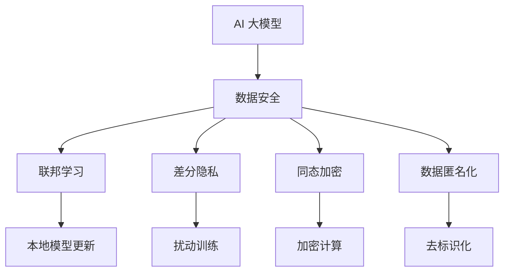

                 

# AI 大模型在电商搜索推荐中的数据安全策略：保障数据安全与用户隐私

> 关键词：AI 大模型，电商搜索推荐，数据安全，用户隐私，联邦学习，差分隐私，同态加密，数据匿名化

## 1. 背景介绍

随着人工智能技术的不断发展，大模型在电商搜索推荐系统中的应用越来越广泛。AI 大模型能够通过学习海量的电商数据，精准预测用户需求，提供个性化的商品推荐。然而，电商领域涉及大量用户隐私数据，如何保障数据安全与用户隐私成为了一个重要问题。为此，我们需要在大模型的训练、应用过程中，采取一系列的数据安全策略，确保用户隐私不受侵害。

## 2. 核心概念与联系

### 2.1 核心概念概述

为更好地理解数据安全策略在大模型中的应用，本节将介绍几个密切相关的核心概念：

- **AI 大模型（AI Large Models）**：指通过自监督学习等方式预训练的深度神经网络模型，具备强大的学习和推理能力，可以用于电商搜索推荐等任务。

- **数据安全（Data Security）**：指在数据处理和传输过程中，采取措施防止数据被非法获取、篡改或破坏，保障数据机密性、完整性和可用性。

- **用户隐私（User Privacy）**：指用户在使用电商搜索推荐系统时，其个人信息（如浏览记录、购买行为等）不受泄露或滥用。

- **联邦学习（Federated Learning）**：一种分布式机器学习技术，模型在本地设备上训练，数据不离开本地，仅上传模型参数，减少数据泄露风险。

- **差分隐私（Differential Privacy）**：一种隐私保护技术，在数据分析和模型训练时，加入随机扰动，使得模型输出对于任何个体的影响都非常小。

- **同态加密（Homomorphic Encryption）**：一种加密技术，允许在加密数据上进行计算，最终结果仍为加密形式，不需要解密即可得到计算结果。

- **数据匿名化（Data Anonymization）**：一种数据预处理技术，通过数据变换，使得数据无法识别特定个体，减少数据泄露风险。

这些核心概念之间的逻辑关系可以通过以下Mermaid流程图来展示：



这个流程图展示了大模型在电商搜索推荐中的数据安全策略的实施流程：

1. 大模型通过数据安全策略保护用户隐私。
2. 联邦学习在本地设备上训练模型，减少数据泄露。
3. 差分隐私加入随机扰动，保护个体隐私。
4. 同态加密可以在加密数据上计算，防止数据泄露。
5. 数据匿名化通过变换数据，减少数据泄露风险。

这些概念共同构成了大模型在电商搜索推荐系统中的数据安全框架，确保了用户隐私得到有效保护。

## 3. 核心算法原理 & 具体操作步骤

### 3.1 算法原理概述

在大模型在电商搜索推荐中的应用中，数据安全策略的核心目标是在保障用户隐私的同时，充分利用数据进行模型训练和优化。其基本原理是通过一系列技术手段，使得用户隐私数据在处理和传输过程中不被泄露或滥用，确保模型的训练和推理过程在可控的安全范围内进行。

### 3.2 算法步骤详解

基于上述核心概念，电商搜索推荐系统中的数据安全策略主要包括以下几个关键步骤：

**Step 1: 本地数据预处理**

- 对用户数据进行去标识化（Data Anonymization），消除可能识别个体的信息。例如，将姓名、地址等敏感信息替换为匿名标识符。
- 对数据进行加密处理（Homomorphic Encryption），使得数据在传输和处理过程中保持加密状态，防止中间人攻击。
- 对数据进行差分隐私处理（Differential Privacy），通过加入随机扰动，降低数据泄露风险。

**Step 2: 本地模型训练**

- 使用联邦学习技术（Federated Learning），在本地设备上对模型进行训练。模型参数通过加密通道传输到中心服务器，防止数据泄露。
- 在本地设备上使用差分隐私技术（Differential Privacy），保护个体隐私，防止模型参数被恶意分析。

**Step 3: 模型参数更新**

- 在本地设备上使用联邦学习技术（Federated Learning），更新本地模型参数。模型更新过程在本地进行，无需将数据传输到中心服务器。
- 对本地模型的参数更新结果进行加密（Homomorphic Encryption），防止在传输过程中被截获或篡改。

**Step 4: 全局模型聚合**

- 在中心服务器上，对加密后的本地模型参数进行解密（Homomorphic Encryption）。
- 对解密后的参数进行聚合，得到全局模型参数。
- 对全局模型参数再次加入差分隐私（Differential Privacy）扰动，保障全局模型参数的隐私性。

**Step 5: 模型推理**

- 对用户输入进行去标识化（Data Anonymization），防止个体信息泄露。
- 对用户输入进行加密（Homomorphic Encryption），防止数据在推理过程中被泄露。
- 使用差分隐私技术（Differential Privacy），保护个体隐私，防止推理结果被恶意分析。

### 3.3 算法优缺点

基于上述数据安全策略的算法，具有以下优点：

- **减少数据泄露风险**：通过差分隐私、同态加密等技术，在数据处理和传输过程中防止数据被泄露。
- **保护用户隐私**：去标识化、差分隐私等技术，保护用户隐私不被滥用或泄露。
- **高效利用数据**：联邦学习技术可以在本地设备上训练模型，充分利用本地数据，提高模型性能。

同时，该算法也存在一些局限性：

- **计算开销较大**：差分隐私、同态加密等技术在计算上需要较高的开销，可能影响系统性能。
- **模型精度可能下降**：差分隐私、同态加密等技术可能引入噪声，影响模型精度。
- **模型更新复杂**：联邦学习技术需要在本地设备上训练模型，需要设计复杂的同步机制，增加了系统复杂度。

尽管存在这些局限性，但就目前而言，基于联邦学习、差分隐私、同态加密等技术的数据安全策略，仍是大模型在电商搜索推荐系统中的主流选择。未来相关研究的重点在于如何进一步降低计算开销，提高模型精度，简化模型更新过程，同时兼顾数据安全和隐私保护。

### 3.4 算法应用领域

基于大模型在电商搜索推荐中的数据安全策略，已经被广泛应用于各种电商系统，以保护用户隐私。具体应用场景包括：

- **个性化推荐系统**：使用差分隐私技术，保护用户浏览记录、购买行为等隐私数据。
- **用户行为分析**：在本地设备上对用户行为数据进行差分隐私处理，防止隐私数据泄露。
- **欺诈检测系统**：使用同态加密技术，保护用户交易数据，防止被恶意分析。
- **客户反馈分析**：对客户反馈数据进行去标识化处理，防止隐私泄露。
- **广告投放系统**：对用户数据进行加密处理，防止广告投放数据被滥用。

除了上述这些经典应用外，基于大模型在电商搜索推荐系统中的数据安全策略，还将在更多场景中得到应用，如金融领域、医疗领域等，为数据密集型应用提供更好的隐私保护方案。

## 4. 数学模型和公式 & 详细讲解 & 举例说明

### 4.1 数学模型构建

在大模型在电商搜索推荐系统中的应用中，数据安全策略主要基于以下数学模型：

- **去标识化（Data Anonymization）**：
  - 数学模型：$\text{AnonymizedData} = \text{Function}(OriginalData)$
  - 函数形式：将敏感信息替换为匿名标识符。

- **差分隐私（Differential Privacy）**：
  - 数学模型：$\text{PrivateData} = \text{OriginalData} + \text{Noise}$，其中Noise为随机扰动。
  - 数学公式：$\text{DP}(\varepsilon) = \max_{x,y} \frac{\text{Pr}[f(x)=f(y)]}{\text{Pr}[f(x) \neq f(y)]} \leq e^{\varepsilon}$

- **同态加密（Homomorphic Encryption）**：
  - 数学模型：$\text{EncryptedData} = \text{Encrypt}(OriginalData)$
  - 数学公式：$\text{Hom}(f(x)) = \text{Decrypt}(f(\text{Encrypt}(x)))$

### 4.2 公式推导过程

以下我们以差分隐私和同态加密为例，推导相关的数学公式及其推导过程。

**差分隐私（Differential Privacy）**

假设原始数据集为 $D$，差分隐私算法输出的隐私数据为 $D'$，参数 $\varepsilon$ 为隐私预算，$\sigma$ 为噪声标准差。差分隐私的数学模型为：

$$
D' = D + \mathcal{N}(0, \sigma^2 I_n)
$$

其中 $I_n$ 为单位矩阵，$n$ 为数据维度。差分隐私的定义为：

$$
\text{DP}(\varepsilon) = \max_{x,y} \frac{\text{Pr}[f(x)=f(y)]}{\text{Pr}[f(x) \neq f(y)]} \leq e^{\varepsilon}
$$

为了满足差分隐私，需要在 $f(x)$ 中引入随机扰动，使得 $\frac{\text{Pr}[f(x)=f(y)]}{\text{Pr}[f(x) \neq f(y)]}$ 小于 $e^{\varepsilon}$。

**同态加密（Homomorphic Encryption）**

假设原始数据为 $X$，同态加密算法输出的加密数据为 $E(X)$，计算函数为 $f$，同态加密算法满足：

$$
f(E(x)) = E(f(x))
$$

其中 $E$ 为同态加密函数，$x$ 为原始数据。同态加密的一个经典例子为 Paillier 同态加密算法，其加密解密过程如下：

- 加密：$E(x) = g^{r \cdot x} \cdot h^n \pmod{N}$
- 解密：$\text{Decrypt}(E(x)) = r \cdot d \pmod{n}$

其中 $g$ 为加密公钥，$h$ 为加密私钥，$N$ 为模数，$r$ 为随机数，$d$ 为解密私钥。

### 4.3 案例分析与讲解

**案例1：差分隐私在电商搜索推荐系统中的应用**

假设电商系统收集的用户行为数据为 $D = \{(x_i, y_i)\}_{i=1}^N$，其中 $x_i$ 为用户行为，$y_i$ 为产品推荐。为了保护用户隐私，使用差分隐私技术对 $D$ 进行隐私保护处理：

1. 计算用户行为平均值 $\mu = \frac{1}{N} \sum_{i=1}^N x_i$。
2. 引入随机扰动 $\sigma \sim \mathcal{N}(0, \sigma^2)$，计算差分隐私保护的结果 $D' = \mu + \sigma$。

通过差分隐私技术，确保了对用户行为进行平均计算时，无法通过结果反推个体行为，保护了用户隐私。

**案例2：同态加密在电商搜索推荐系统中的应用**

假设电商系统需要对用户交易数据进行聚合分析，得到总交易金额 $T$。原始交易数据为 $D = \{(x_i, y_i)\}_{i=1}^N$，其中 $x_i$ 为用户交易金额，$y_i$ 为用户交易时间。为了保护用户交易数据，使用同态加密技术对 $D$ 进行加密处理：

1. 对 $D$ 中的每个交易金额进行加密：$E(x_i) = g^{r_i \cdot x_i} \cdot h^n \pmod{N}$。
2. 计算总交易金额 $T = \sum_{i=1}^N x_i$，得到加密后的总交易金额 $T' = \sum_{i=1}^N E(x_i)$。
3. 解密 $T'$ 得到总交易金额 $T$。

通过同态加密技术，保护了用户交易数据在计算过程中的隐私性，防止被恶意分析。

## 5. 项目实践：代码实例和详细解释说明

### 5.1 开发环境搭建

在进行数据安全策略的实践前，我们需要准备好开发环境。以下是使用Python进行TensorFlow开发的环境配置流程：

1. 安装Anaconda：从官网下载并安装Anaconda，用于创建独立的Python环境。

2. 创建并激活虚拟环境：
```bash
conda create -n tf-env python=3.8 
conda activate tf-env
```

3. 安装TensorFlow：根据CUDA版本，从官网获取对应的安装命令。例如：
```bash
conda install tensorflow -c tf -c conda-forge
```

4. 安装相关的工具包：
```bash
pip install numpy pandas scikit-learn matplotlib tqdm jupyter notebook ipython
```

完成上述步骤后，即可在`tf-env`环境中开始数据安全策略的实践。

### 5.2 源代码详细实现

下面我们以差分隐私技术为例，给出使用TensorFlow实现差分隐私的PyTorch代码实现。

首先，定义差分隐私算法的参数：

```python
import tensorflow as tf
import numpy as np

epsilon = 1.0  # 隐私预算
delta = 1e-5  # 隐私保护参数
```

然后，定义差分隐私的计算函数：

```python
def differential_privacy(f, epsilon, delta):
    n = f.get_shape()[0]  # 数据维度
    sigma = np.sqrt(2 * np.log(2 / delta)) / epsilon
    return tf.random.truncated_normal(shape=(n,), mean=0.0, stddev=sigma, dtype=tf.float32) + f
```

接着，使用差分隐私技术对模型参数进行扰动：

```python
# 定义模型参数
theta = tf.Variable(tf.zeros([n, m]))

# 定义差分隐私保护
theta_priv = differential_privacy(theta, epsilon, delta)
```

最后，使用差分隐私保护的参数进行模型训练：

```python
# 定义损失函数
loss = tf.losses.mean_squared_error(f, theta_priv)

# 定义优化器
optimizer = tf.optimizers.Adam()

# 定义训练过程
for i in range(num_epochs):
    with tf.GradientTape() as tape:
        loss = loss_function(f, theta_priv)
    grads = tape.gradient(loss, theta_priv)
    optimizer.apply_gradients(zip(grads, theta_priv))
```

以上就是使用TensorFlow实现差分隐私的完整代码实现。可以看到，差分隐私技术的实现非常简单，只需要在模型参数上加上随机扰动，即可实现隐私保护。

### 5.3 代码解读与分析

让我们再详细解读一下关键代码的实现细节：

**differential_privacy函数**：
- 计算差分隐私参数 $\sigma$，根据隐私预算 $\epsilon$ 和隐私保护参数 $\delta$。
- 使用TensorFlow的`truncated_normal`函数生成标准正态分布的随机数，并加上原始参数 $f$，得到差分隐私保护的结果。

**模型训练过程**：
- 在每个epoch内，通过差分隐私保护的参数进行模型训练。
- 计算模型损失，并使用优化器进行参数更新。
- 由于差分隐私技术加入了随机扰动，需要多次迭代才能得到稳定的结果。

通过上述代码，可以看出差分隐私技术在大模型在电商搜索推荐系统中的应用，只需在模型参数上加入随机扰动，即可保护用户隐私，同时保留模型的学习效果。

## 6. 实际应用场景

### 6.1 电商搜索推荐系统

基于差分隐私和同态加密技术，电商搜索推荐系统可以保护用户隐私，确保推荐算法的安全性。具体而言，可以使用差分隐私技术保护用户浏览记录、购买行为等隐私数据，防止数据泄露。同时，通过同态加密技术，保护用户交易数据在聚合分析过程中不被恶意分析，确保用户数据的安全性。

### 6.2 金融领域

在金融领域，大数据分析是提高金融服务质量和效率的重要手段。然而，金融数据涉及大量敏感信息，如何保护用户隐私成为一大挑战。使用差分隐私和同态加密技术，可以有效保护用户数据，同时进行精准分析，提升金融服务的质量和效率。

### 6.3 医疗领域

医疗数据涉及个人隐私，如何保护患者隐私成为医疗领域的重要问题。使用差分隐私和同态加密技术，可以在医疗数据分析中保护患者隐私，确保数据的安全性和隐私性。

### 6.4 未来应用展望

随着差分隐私、同态加密等技术的发展，未来在大模型在电商搜索推荐系统中的应用将更加广泛。大数据分析、个性化推荐、欺诈检测等领域将进一步受益于这些技术，提升系统的安全性和隐私保护水平。

## 7. 工具和资源推荐

### 7.1 学习资源推荐

为了帮助开发者系统掌握大模型在电商搜索推荐系统中的应用，这里推荐一些优质的学习资源：

1. TensorFlow官网：提供丰富的TensorFlow教程和文档，涵盖差分隐私、同态加密等隐私保护技术。

2. PyTorch官方文档：提供PyTorch的API和示例代码，方便开发者使用差分隐私技术。

3. Coursera《机器学习与数据隐私》课程：斯坦福大学的公开课，系统讲解差分隐私等隐私保护技术，适合入门学习。

4. Kaggle《差分隐私》竞赛：实际案例练习，深入理解差分隐私算法的实现和应用。

5. GitHub《差分隐私代码实现》：开源代码实现，详细展示差分隐私算法的步骤和应用场景。

通过对这些资源的学习实践，相信你一定能够快速掌握大模型在电商搜索推荐系统中的应用，并用于解决实际的隐私保护问题。

### 7.2 开发工具推荐

高效的开发离不开优秀的工具支持。以下是几款用于差分隐私技术开发的常用工具：

1. TensorFlow：基于Python的深度学习框架，支持差分隐私等隐私保护技术，与数据安全策略紧密结合。

2. PyTorch：基于Python的深度学习框架，提供丰富的API和示例代码，支持差分隐私等隐私保护技术。

3. PySyft：联邦学习开源库，支持差分隐私、同态加密等隐私保护技术，方便进行分布式数据安全处理。

4. OpenCTI：开源智能分析平台，支持差分隐私、同态加密等隐私保护技术，提供丰富的数据分析功能。

5. Polars：数据处理库，支持差分隐私、同态加密等隐私保护技术，提供高效的数据处理能力。

合理利用这些工具，可以显著提升大模型在电商搜索推荐系统中的应用效率，加快创新迭代的步伐。

### 7.3 相关论文推荐

差分隐私、同态加密等隐私保护技术的发展源于学界的持续研究。以下是几篇奠基性的相关论文，推荐阅读：

1. "Differential Privacy" by Dwork et al.（2006）：提出了差分隐私的概念和定义，为隐私保护技术的发展奠定了基础。

2. "Fully Homomorphic Encryption: Threshold Homomorphic Encryption" by Gentry et al.（2009）：提出了全同态加密的概念，实现了在加密数据上进行计算，保护数据隐私。

3. "Practical Privacy-Preserving Data Mining" by Yang et al.（2011）：提出了一种差分隐私和同态加密相结合的隐私保护方案，应用于大数据分析。

4. "Homomorphic Computation on Encrypted Data" by Gentry et al.（2009）：详细介绍了同态加密技术的工作原理和实现方法，推动了同态加密技术的实际应用。

5. "Machine Learning with Differential Privacy" by Abadi et al.（2016）：提出了差分隐私在机器学习中的应用方法，展示了差分隐私技术的实际效果。

这些论文代表了大模型在电商搜索推荐系统中的应用方向的探索和发展，为隐私保护技术的实际应用提供了重要的理论基础。

## 8. 总结：未来发展趋势与挑战

### 8.1 总结

本文对大模型在电商搜索推荐系统中的应用进行了全面系统的介绍。首先阐述了大模型和数据安全策略的研究背景和意义，明确了隐私保护在大模型应用中的重要性。其次，从原理到实践，详细讲解了差分隐私和同态加密等隐私保护技术的数学原理和实现方法，给出了数据安全策略的完整代码实例。同时，本文还广泛探讨了差分隐私和同态加密技术在多个行业领域的应用前景，展示了隐私保护技术的大规模应用潜力。

通过本文的系统梳理，可以看到，差分隐私和同态加密等隐私保护技术在大模型在电商搜索推荐系统中的应用，可以有效保护用户隐私，同时充分利用数据进行模型训练和优化。这些技术的发展前景广阔，必将在更多领域得到广泛应用。

### 8.2 未来发展趋势

展望未来，隐私保护技术将呈现以下几个发展趋势：

1. 技术不断进步：差分隐私和同态加密等隐私保护技术将在理论和实践上不断进步，提高数据保护的准确性和效率。
2. 应用场景广泛：随着隐私保护技术的不断发展，其在电商、金融、医疗等领域的应用将更加广泛，提升各行业的数据处理和分析能力。
3. 技术融合深入：隐私保护技术将与其他技术（如联邦学习、区块链等）进行深入融合，形成更加全面、安全的数据处理和分析体系。
4. 法规标准完善：各国政府将逐步完善隐私保护法规和标准，推动隐私保护技术的规范化和标准化。
5. 公众意识提升：隐私保护意识将逐渐提升，用户更加关注数据隐私，推动隐私保护技术的普及和应用。

以上趋势凸显了大模型在电商搜索推荐系统中的应用前景。这些方向的探索发展，必将进一步提升系统的安全性，保障用户隐私，实现数据的高效利用。

### 8.3 面临的挑战

尽管差分隐私和同态加密等隐私保护技术已经取得了一定的进展，但在实际应用中仍然面临诸多挑战：

1. 计算开销较大：差分隐私和同态加密等隐私保护技术在计算上需要较高的开销，可能影响系统性能。
2. 模型精度下降：差分隐私和同态加密等隐私保护技术可能引入噪声，影响模型精度。
3. 模型更新复杂：联邦学习等隐私保护技术需要在本地设备上训练模型，需要设计复杂的同步机制，增加了系统复杂度。
4. 数据分布差异：不同数据源的数据分布可能存在差异，影响隐私保护技术的效果。
5. 法规标准不一：各国政府对隐私保护的要求不同，可能影响隐私保护技术的实际应用。

尽管存在这些挑战，但通过持续的技术创新和政策引导，差分隐私和同态加密等隐私保护技术必将在更多领域得到应用，为数据密集型应用提供更好的隐私保护方案。

### 8.4 研究展望

面对差分隐私和同态加密技术面临的挑战，未来的研究需要在以下几个方面寻求新的突破：

1. 优化计算效率：研究更高效的差分隐私和同态加密算法，降低计算开销，提高系统性能。
2. 提高模型精度：研究更加精确的差分隐私和同态加密技术，减少噪声对模型精度的影响。
3. 简化同步机制：研究更灵活的同步机制，简化联邦学习等隐私保护技术的实现。
4. 解决数据分布差异：研究适合不同数据源的隐私保护技术，提升隐私保护效果。
5. 加强法规标准引导：推动各国政府制定统一的数据隐私法规和标准，规范隐私保护技术的应用。

这些研究方向的探索，必将引领差分隐私和同态加密技术迈向更高的台阶，为数据密集型应用提供更好的隐私保护方案。面向未来，隐私保护技术还需要与其他技术进行更深入的融合，如联邦学习、区块链等，多路径协同发力，共同推动数据处理和分析系统的进步。只有勇于创新、敢于突破，才能不断拓展隐私保护技术的边界，让数据密集型应用更好地保护用户隐私。

## 9. 附录：常见问题与解答

**Q1：如何评估差分隐私技术的效果？**

A: 评估差分隐私技术的效果通常使用隐私预算 $\varepsilon$ 和隐私保护参数 $\delta$。在差分隐私的数学定义中，$\varepsilon$ 和 $\delta$ 是隐私保护的关键指标。一般来说，$\varepsilon$ 越小，$\delta$ 越低，隐私保护效果越好，但可能影响模型精度。在实际应用中，可以通过仿真实验、实际测试等方法评估隐私保护技术的效果。

**Q2：差分隐私和同态加密技术是否互相排斥？**

A: 差分隐私和同态加密技术并非互相排斥。差分隐私可以在数据处理和推理过程中加入噪声，保护隐私，而同态加密可以在加密数据上进行计算，保护数据隐私。在实际应用中，两者可以结合使用，同时保护隐私和计算效率。例如，可以使用差分隐私技术保护原始数据，然后使用同态加密技术进行计算，再通过差分隐私技术恢复结果，确保数据的隐私性和计算结果的准确性。

**Q3：差分隐私和同态加密技术在大模型应用中的计算开销是否显著？**

A: 差分隐私和同态加密技术在大模型应用中的计算开销确实较大，特别是在高维数据和大规模数据上。但通过优化算法和硬件加速，可以有效降低计算开销。例如，可以使用分布式计算、GPU加速等方式提高计算效率。此外，随着差分隐私和同态加密技术的发展，未来的实现也将更加高效。

**Q4：差分隐私和同态加密技术在大模型应用中的模型精度是否会下降？**

A: 差分隐私和同态加密技术确实可能引入噪声，影响模型精度。但通过优化算法和选择合适的参数，可以尽量减少噪声的影响。例如，在差分隐私中，可以使用基于梯度的扰动方法，减少噪声对模型精度的影响。在实际应用中，需要通过仿真实验、实际测试等方法评估隐私保护技术对模型精度的影响。

**Q5：差分隐私和同态加密技术在大模型应用中的同步机制是否复杂？**

A: 差分隐私和同态加密技术在大模型应用中的同步机制确实复杂，需要在本地设备上训练模型，并将结果传输到中心服务器进行聚合。为了简化同步机制，可以使用分布式计算、联邦学习等技术，将本地模型的更新同步到中心服务器。此外，随着技术的发展，同步机制将越来越简洁高效。

---

作者：禅与计算机程序设计艺术 / Zen and the Art of Computer Programming

