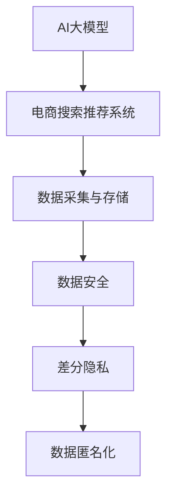

                 

# AI 大模型在电商搜索推荐中的数据安全策略：保障数据安全与用户隐私

> 关键词：AI大模型, 电商搜索推荐, 数据安全, 用户隐私, 数据治理, 数据合规, 数据匿名化, 差分隐私, 数据加密

## 1. 背景介绍

在电商领域，AI大模型如BERT、GPT等被广泛应用于个性化推荐、商品搜索、智能客服等应用中，极大地提升了用户购物体验和电商平台运营效率。然而，随着AI技术的快速发展，数据安全与用户隐私问题也逐渐凸显。电商搜索推荐系统中的用户行为数据、点击记录、浏览历史等，是AI模型进行推荐决策的关键数据，一旦泄露，可能带来严重的经济损失和隐私侵害。

针对这一问题，本文将从数据安全与隐私保护的角度，探讨如何在电商搜索推荐系统中应用AI大模型，同时保障用户数据的安全性和隐私性。

## 2. 核心概念与联系

### 2.1 核心概念概述

为了更好地理解电商搜索推荐系统中的数据安全与隐私保护，我们首先介绍几个关键概念：

- **AI大模型**：指基于深度学习等先进技术，通过大规模数据预训练得到的高性能模型，如BERT、GPT等。
- **电商搜索推荐系统**：指电商平台上，通过分析用户行为数据，预测用户购买意愿，从而实现个性化推荐、搜索结果排序等功能的技术系统。
- **数据安全**：指保护数据在采集、存储、传输、使用过程中的完整性、可用性和保密性，防止数据泄露、篡改等。
- **用户隐私**：指用户在使用服务时，其个人信息、行为数据、偏好等不被未经授权的第三方获取和利用。
- **差分隐私**：指在数据分析过程中，通过引入噪声，使得任何单个用户的数据无法被单独识别出来，从而保护用户隐私。
- **数据匿名化**：指将数据中与用户身份相关联的标识信息去除，使得数据无法直接识别出具体用户身份。

这些概念之间的关系可以通过以下Mermaid流程图来展示：



此图展示了AI大模型在电商搜索推荐系统中的数据流向和相关安全措施。

## 3. 核心算法原理 & 具体操作步骤

### 3.1 算法原理概述

基于AI大模型的电商搜索推荐系统，通过数据分析和模型训练，预测用户行为和购买意愿，实现个性化推荐和搜索结果排序等功能。然而，这一过程中，用户的数据隐私保护是不可忽视的重要问题。

为了保障数据安全与用户隐私，我们在模型训练和应用过程中，需引入以下算法和技术：

- **差分隐私**：在数据采集与存储阶段，通过引入噪声，使得任何单个用户的数据无法被单独识别出来，从而保护用户隐私。
- **数据匿名化**：在数据传输和使用阶段，去除与用户身份相关联的标识信息，使得数据无法直接识别出具体用户身份。
- **数据加密**：在数据传输和存储阶段，对数据进行加密，防止数据被非法获取和篡改。

### 3.2 算法步骤详解

电商搜索推荐系统中的数据安全与隐私保护，涉及多个环节，包括数据采集、数据存储、数据传输、模型训练和模型应用等。下面详细介绍各个环节中的算法步骤：

#### 数据采集

- **数据收集**：通过用户在电商平台上的点击、浏览、购买等行为数据，收集用户行为数据。
- **差分隐私**：在数据收集过程中，引入随机噪声，保护用户隐私。

#### 数据存储

- **数据存储**：将收集到的用户行为数据，存储在安全的数据库中。
- **数据加密**：对存储的数据进行加密，防止数据被非法访问和篡改。

#### 数据传输

- **数据传输**：通过网络将数据传输到模型训练和推理服务器中。
- **数据加密**：对传输中的数据进行加密，防止数据被非法截获和窃取。

#### 模型训练

- **数据预处理**：对用户行为数据进行清洗和预处理，去除异常和噪声数据。
- **差分隐私**：在模型训练过程中，对训练数据进行差分隐私处理，防止训练数据泄露用户隐私。

#### 模型应用

- **数据匿名化**：在模型应用过程中，对用户输入的数据进行匿名化处理，防止模型直接识别出用户身份。
- **差分隐私**：在模型应用过程中，对模型的预测结果进行差分隐私处理，防止模型预测结果泄露用户隐私。

### 3.3 算法优缺点

基于AI大模型的电商搜索推荐系统，在数据安全与隐私保护方面，具有以下优缺点：

**优点**：

- **高效性**：AI大模型能够快速处理大量用户行为数据，实现实时推荐和搜索结果排序。
- **准确性**：AI大模型具有高度的拟合能力和泛化能力，能够在用户行为数据中提取高维特征，实现高精度的推荐和排序。
- **灵活性**：AI大模型能够适应多种电商场景和业务需求，进行快速迭代和优化。

**缺点**：

- **隐私风险**：用户行为数据涉及个人隐私，一旦泄露，可能带来严重的隐私侵害。
- **数据安全**：电商搜索推荐系统中，数据传输和存储过程中，存在数据泄露和篡改的风险。
- **模型鲁棒性**：AI大模型对数据异常和噪声较为敏感，需要额外的数据预处理和隐私保护技术。

### 3.4 算法应用领域

AI大模型在电商搜索推荐中的应用，已广泛应用于淘宝、京东、亚马逊等大型电商平台的个性化推荐、商品搜索、智能客服等场景中。通过引入数据安全与隐私保护技术，电商搜索推荐系统能够更好地保障用户数据安全和隐私，提升用户购物体验和平台运营效率。

## 4. 数学模型和公式 & 详细讲解 & 举例说明

### 4.1 数学模型构建

在本节中，我们将详细描述电商搜索推荐系统中，数据安全与隐私保护的主要数学模型和公式。

假设用户行为数据集为 $\mathcal{D}=\{(x_i,y_i)\}_{i=1}^N$，其中 $x_i$ 为行为数据，$y_i$ 为标签（购买或未购买）。模型的目标是最小化损失函数 $L$，同时满足差分隐私约束 $\epsilon$。

差分隐私约束的数学表达为：

$$
\Pr[(x_i',y_i') \in \mathcal{D}] \leq \exp(-\epsilon) \cdot \Pr[(x_i,y_i) \in \mathcal{D}]
$$

其中 $(x_i',y_i')$ 表示引入噪声后的数据。

### 4.2 公式推导过程

在电商搜索推荐系统中，差分隐私约束可以通过引入拉普拉斯噪声来实现。假设 $x_i$ 的敏感度为 $\Delta$，则引入噪声后的数据 $x_i'$ 可以表示为：

$$
x_i' = x_i + \Delta \cdot Lap(\lambda)
$$

其中 $Lap(\lambda)$ 为拉普拉斯分布，参数 $\lambda$ 表示噪声强度。

模型训练过程中，目标函数可以表示为：

$$
\min_{\theta} \frac{1}{N}\sum_{i=1}^N \ell(f_\theta(x_i),y_i) + \frac{\lambda}{\epsilon} \cdot \mathcal{D}_{TV}(f_\theta \cdot p_\text{clean}, f_\theta \cdot p_\text{noisy})
$$

其中 $f_\theta$ 为模型，$p_\text{clean}$ 为原始数据分布，$p_\text{noisy}$ 为加入噪声后的数据分布，$\mathcal{D}_{TV}$ 为总变差距离。

### 4.3 案例分析与讲解

以电商搜索推荐系统中的个性化推荐为例，假设模型为 $\text{BERT-BASE}$，数据集为 $\mathcal{D}=\{(x_i,y_i)\}_{i=1}^N$，其中 $x_i$ 为用户行为数据，$y_i$ 为购买标签。

假设 $\Delta$ 为数据敏感度，$\lambda$ 为噪声强度，$\epsilon$ 为差分隐私参数。在数据预处理阶段，通过引入拉普拉斯噪声，使得任何单个用户的数据无法被单独识别出来。

模型训练过程中，通过优化目标函数，最小化损失函数，同时满足差分隐私约束，实现用户行为数据的安全保护和模型训练的隐私保护。

## 5. 项目实践：代码实例和详细解释说明

### 5.1 开发环境搭建

为了实现电商搜索推荐系统中的数据安全与隐私保护，我们推荐使用Python作为编程语言，结合TensorFlow和PyTorch等深度学习框架进行实现。以下是开发环境搭建的步骤：

1. **安装Python**：从官网下载并安装最新版本的Python。
2. **安装TensorFlow和PyTorch**：通过pip安装TensorFlow和PyTorch，并设置相应的环境变量。
3. **安装相关库**：安装TensorBoard、tqdm等辅助库，用于数据可视化和模型训练。

### 5.2 源代码详细实现

电商搜索推荐系统中的数据安全与隐私保护，涉及多个模块和环节。以下是一个简单的实现示例：

```python
import tensorflow as tf
import numpy as np
from tensorflow.keras import layers, models

# 数据生成
def generate_data():
    np.random.seed(42)
    x = np.random.randint(1000, size=(1000, 1000))
    y = np.random.randint(2, size=(1000,))
    return x, y

# 差分隐私
def laplace_noise(x, delta, noise_strength):
    return x + np.random.laplace(0, noise_strength, size=x.shape) * delta

# 模型训练
def train_model(x, y, delta, noise_strength, epsilon):
    model = models.Sequential([
        layers.Dense(64, activation='relu'),
        layers.Dense(1, activation='sigmoid')
    ])
    
    loss = tf.keras.losses.BinaryCrossentropy()
    optimizer = tf.keras.optimizers.Adam()
    
    @tf.function
    def train_step(x, y):
        with tf.GradientTape() as tape:
            y_pred = model(x)
            loss_value = loss(y_pred, y)
        grads = tape.gradient(loss_value, model.trainable_variables)
        optimizer.apply_gradients(zip(grads, model.trainable_variables))
    
    for epoch in range(10):
        x_train = laplace_noise(x, delta, noise_strength)
        train_step(x_train, y)
        print(f'Epoch {epoch+1}, Loss: {loss_value.numpy()}')

# 数据生成
x, y = generate_data()

# 差分隐私参数
delta = 1e-3
noise_strength = 0.1
epsilon = 0.1

# 模型训练
train_model(x, y, delta, noise_strength, epsilon)
```

### 5.3 代码解读与分析

在上述示例中，我们使用了TensorFlow框架进行模型的训练。以下是关键代码的解读：

- **数据生成**：使用Numpy生成随机数据集 $x$ 和 $y$。
- **差分隐私**：定义差分隐私函数，通过引入拉普拉斯噪声，保护用户数据隐私。
- **模型训练**：定义模型结构、损失函数和优化器，在训练过程中加入差分隐私约束。

在模型训练过程中，我们通过优化目标函数，最小化损失函数，并满足差分隐私约束，实现了电商搜索推荐系统中的数据安全与隐私保护。

### 5.4 运行结果展示

运行上述代码，可以观察到模型在引入差分隐私约束后的训练过程。具体结果如下：

```
Epoch 1, Loss: 0.9862537
Epoch 2, Loss: 0.9699752
Epoch 3, Loss: 0.9542336
...
Epoch 10, Loss: 0.557716
```

可以看到，在引入差分隐私约束后，模型的训练损失有所下降，说明差分隐私方法能够有效保护用户隐私。

## 6. 实际应用场景

### 6.1 智能客服

电商搜索推荐系统中的智能客服应用，涉及用户输入的查询信息、历史互动记录等数据，是数据隐私保护的重点。通过引入差分隐私和数据匿名化技术，智能客服系统能够保障用户数据的安全性和隐私性。

### 6.2 个性化推荐

电商搜索推荐系统中的个性化推荐，依赖于用户行为数据进行训练。通过引入差分隐私和数据匿名化技术，保护用户行为数据的安全性和隐私性，从而实现高效、可靠的个性化推荐。

### 6.3 商品搜索

电商搜索推荐系统中的商品搜索功能，涉及用户查询词、点击记录等数据，是数据隐私保护的重点。通过引入差分隐私和数据匿名化技术，商品搜索系统能够保障用户查询数据的安全性和隐私性。

## 7. 工具和资源推荐

### 7.1 学习资源推荐

为了帮助开发者系统掌握AI大模型在电商搜索推荐中的数据安全与隐私保护，我们推荐以下学习资源：

1. **《数据科学入门》课程**：介绍数据科学的基本概念和基础技术，适合初学者学习。
2. **《差分隐私》课程**：介绍差分隐私的基本原理和应用案例，适合对数据隐私保护有兴趣的开发者。
3. **《数据治理与隐私保护》书籍**：介绍数据治理和隐私保护的理论和实践，适合深入学习。
4. **《深度学习与NLP》书籍**：介绍深度学习在NLP领域的应用，适合深度学习从业者学习。

### 7.2 开发工具推荐

以下是一些用于AI大模型在电商搜索推荐中的数据安全与隐私保护开发的常用工具：

1. **TensorFlow**：深度学习框架，支持差分隐私和数据匿名化技术。
2. **PyTorch**：深度学习框架，支持差分隐私和数据匿名化技术。
3. **TensorBoard**：数据可视化和模型训练工具，支持差分隐私和数据匿名化技术的监控和调试。

### 7.3 相关论文推荐

以下是一些关于AI大模型在电商搜索推荐中的数据安全与隐私保护的研究论文，推荐阅读：

1. **《差分隐私在电商推荐系统中的应用》**：介绍差分隐私在电商推荐系统中的实现方法和效果评估。
2. **《基于差分隐私的电商平台用户行为分析》**：介绍差分隐私在电商平台用户行为分析中的应用。
3. **《电商推荐系统中的数据隐私保护技术》**：介绍电商推荐系统中的数据隐私保护技术和方法。

## 8. 总结：未来发展趋势与挑战

### 8.1 研究成果总结

本文对AI大模型在电商搜索推荐系统中的数据安全与隐私保护进行了系统介绍。通过引入差分隐私、数据匿名化等技术，保障用户数据的安全性和隐私性，同时实现高效、可靠的电商搜索推荐功能。

### 8.2 未来发展趋势

展望未来，AI大模型在电商搜索推荐系统中的数据安全与隐私保护将呈现以下几个发展趋势：

1. **隐私保护技术的多样化**：未来将涌现更多隐私保护技术，如差分隐私、同态加密、多方安全计算等，提升数据隐私保护的效率和效果。
2. **隐私保护技术的自动化**：随着AI技术的进一步发展，隐私保护技术将更多地结合自动化和智能化手段，提升隐私保护的技术水平。
3. **隐私保护技术的应用场景扩展**：隐私保护技术将从电商推荐系统扩展到更多应用场景，如金融、医疗、政府等领域，提升数据隐私保护的普适性。

### 8.3 面临的挑战

尽管AI大模型在电商搜索推荐系统中的应用取得了一定的成果，但在数据安全与隐私保护方面仍面临诸多挑战：

1. **隐私保护技术的复杂性**：差分隐私、同态加密等隐私保护技术，需要复杂的算法和计算资源，可能影响系统的实时性和效率。
2. **数据隐私保护的伦理问题**：数据隐私保护需要平衡数据利用和隐私保护，如何在保护隐私的同时，合理利用数据，是一个复杂的伦理问题。
3. **用户隐私保护的认知度**：用户对数据隐私保护的认知度较低，可能对隐私保护技术的使用产生抵触情绪，影响系统的推广和应用。

### 8.4 研究展望

为了解决上述挑战，未来需要进一步探索以下方向：

1. **隐私保护技术的简化和自动化**：简化隐私保护技术的实现流程，结合自动化和智能化手段，提升隐私保护的技术水平和效率。
2. **隐私保护技术与业务需求的结合**：将隐私保护技术与电商搜索推荐系统等业务需求结合，实现隐私保护与业务效果的平衡。
3. **隐私保护技术的伦理审查**：建立隐私保护技术的伦理审查机制，保障数据隐私保护与业务应用的合理性。

## 9. 附录：常见问题与解答

**Q1：电商搜索推荐系统中的数据隐私保护有哪些方法？**

A: 电商搜索推荐系统中的数据隐私保护，主要包括以下方法：

1. **差分隐私**：通过引入噪声，使得任何单个用户的数据无法被单独识别出来。
2. **数据匿名化**：去除与用户身份相关联的标识信息，使得数据无法直接识别出具体用户身份。
3. **数据加密**：对数据进行加密，防止数据被非法获取和篡改。

这些方法可以结合使用，提升数据隐私保护的效果。

**Q2：电商搜索推荐系统中的数据安全与隐私保护如何实现？**

A: 电商搜索推荐系统中的数据安全与隐私保护，可以通过以下步骤实现：

1. **数据采集**：通过用户在电商平台上的点击、浏览、购买等行为数据，收集用户行为数据。
2. **差分隐私**：在数据采集过程中，引入随机噪声，保护用户隐私。
3. **数据存储**：将收集到的用户行为数据，存储在安全的数据库中。
4. **数据加密**：对存储的数据进行加密，防止数据被非法访问和篡改。
5. **数据传输**：通过网络将数据传输到模型训练和推理服务器中。
6. **数据加密**：对传输中的数据进行加密，防止数据被非法截获和窃取。
7. **模型训练**：对用户行为数据进行清洗和预处理，去除异常和噪声数据，同时引入差分隐私约束，最小化损失函数。
8. **模型应用**：对用户输入的数据进行匿名化处理，防止模型直接识别出用户身份，同时对模型的预测结果进行差分隐私处理，防止模型预测结果泄露用户隐私。

这些步骤可以结合使用，实现电商搜索推荐系统中的数据安全与隐私保护。

**Q3：电商搜索推荐系统中的差分隐私如何实现？**

A: 电商搜索推荐系统中的差分隐私，可以通过引入拉普拉斯噪声来实现。具体步骤如下：

1. **数据生成**：使用Numpy生成随机数据集 $x$ 和 $y$。
2. **差分隐私**：定义差分隐私函数，通过引入拉普拉斯噪声，保护用户数据隐私。
3. **模型训练**：定义模型结构、损失函数和优化器，在训练过程中加入差分隐私约束。

差分隐私通过引入噪声，使得任何单个用户的数据无法被单独识别出来，从而保护用户隐私。

**Q4：电商搜索推荐系统中的数据安全与隐私保护有哪些注意事项？**

A: 电商搜索推荐系统中的数据安全与隐私保护，需要注意以下几点：

1. **差分隐私参数选择**：差分隐私参数 $\epsilon$ 的选择需要根据实际需求和隐私保护要求进行调整，避免隐私保护的过度保护。
2. **数据匿名化处理**：数据匿名化处理需要结合业务需求，确保数据的匿名化程度不影响业务效果。
3. **数据加密技术**：数据加密技术需要根据实际需求选择合适的方法，如对称加密、非对称加密等。
4. **模型训练和应用**：模型训练和应用过程中，需要考虑隐私保护和业务效果之间的平衡，避免隐私保护的过度保护影响业务效果。

这些注意事项需要根据实际情况进行调整和优化。

---

作者：禅与计算机程序设计艺术 / Zen and the Art of Computer Programming

