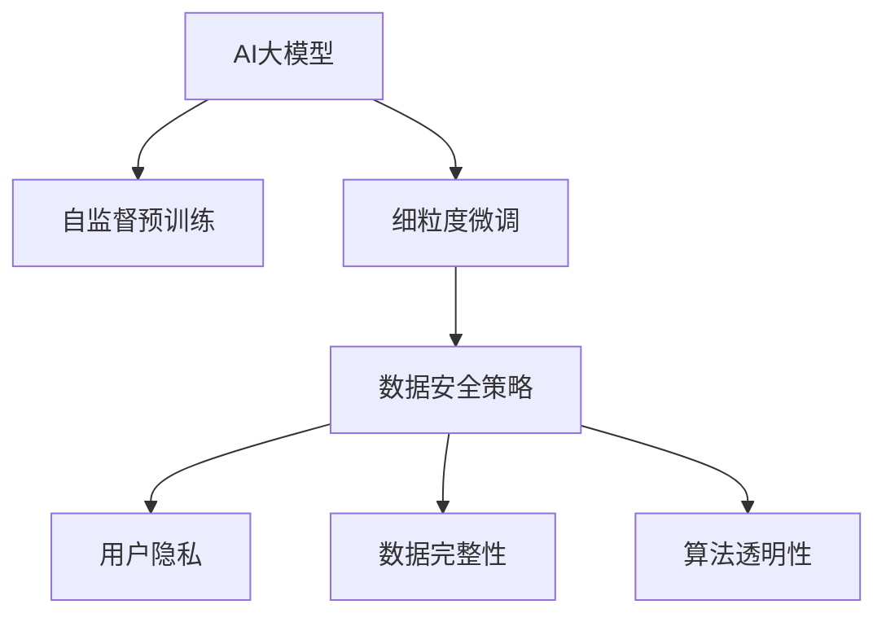

                 

# AI 大模型在电商搜索推荐中的数据安全策略：保障用户隐私与数据完整性

> 关键词：电商搜索推荐, 数据安全策略, 用户隐私, 数据完整性, 大模型应用, AI伦理, 算法透明性

## 1. 背景介绍

### 1.1 问题由来

随着电商行业的快速发展和数字化转型，电商搜索推荐系统已成为提升用户体验、增加销售额的重要手段。传统的搜索推荐系统基于协同过滤、文本匹配等算法，难以应对个性化需求日益增长的挑战。而AI大模型的崛起，为电商搜索推荐提供了全新的解决方案。大模型通过自监督预训练和细粒度微调，能够更好地捕捉用户行为模式和物品属性特征，提供更加精准的推荐结果。

然而，在电商搜索推荐中使用AI大模型，也带来了新的数据安全问题。如何在使用大模型的同时，保障用户隐私、数据完整性和商业利益，成为电商行业关注的焦点。文章将从背景、核心概念、算法原理等方面详细探讨AI大模型在电商搜索推荐中的数据安全策略。

### 1.2 问题核心关键点

电商搜索推荐中，AI大模型的应用需要考虑以下几个核心关键点：

- **数据安全**：如何在使用大模型时保护用户隐私，防止数据泄露和滥用。
- **用户隐私**：用户数据的收集、存储和使用，如何合规、透明地进行。
- **数据完整性**：如何确保电商推荐数据的质量和完整性，避免数据噪音和偏差。
- **算法透明性**：AI大模型的训练和推理过程是否可解释，能否被监管机构审查。

本文将围绕这些关键点，系统性地探讨大模型在电商搜索推荐中的应用策略。

## 2. 核心概念与联系

### 2.1 核心概念概述

为更好地理解AI大模型在电商搜索推荐中的应用，本节将介绍几个密切相关的核心概念：

- **AI大模型**：以Transformer等架构为代表的大规模预训练语言模型，通过在海量无标签文本语料上进行预训练，学习通用的语言表示，具备强大的语言理解和生成能力。
- **自监督预训练**：通过无监督学习任务（如掩码语言模型、自编码器）在大规模无标签数据上进行预训练，学习语言的基本结构和知识。
- **细粒度微调**：通过有监督学习任务（如分类、匹配、生成）在大规模标注数据上进行微调，使得模型在特定任务上具备更好的性能。
- **数据安全策略**：一套或多套方法和手段，旨在保护用户隐私、数据完整性和商业利益。
- **用户隐私**：指用户对其个人信息的控制权和信息不被泄露的权利。
- **数据完整性**：指数据的准确性和完整性，避免数据被篡改或损坏。
- **算法透明性**：指算法的设计、训练和推理过程的透明度，确保算法的可解释性和可审查性。

这些核心概念之间的逻辑关系可以通过以下Mermaid流程图来展示：



这个流程图展示了大模型与自监督预训练、微调、数据安全策略、用户隐私、数据完整性和算法透明性之间的关系：

1. 大模型通过自监督预训练获得基础能力。
2. 细粒度微调使大模型适应特定任务，提升性能。
3. 数据安全策略确保用户隐私和数据完整性，保护商业利益。
4. 用户隐私、数据完整性和算法透明性，是大模型应用的重要保障。

## 3. 核心算法原理 & 具体操作步骤

### 3.1 算法原理概述

AI大模型在电商搜索推荐中的应用，核心在于利用模型对用户行为和物品属性进行建模，并在此基础上进行推荐。算法原理大致分为以下几步：

1. **数据预处理**：对电商用户行为数据、物品属性数据进行清洗、归一化等预处理，得到符合大模型输入格式的数据。
2. **自监督预训练**：在大规模无标签文本数据上，通过掩码语言模型、自编码器等自监督任务对大模型进行预训练，使其学习到通用的语言表示。
3. **细粒度微调**：在电商搜索推荐相关的标注数据上，通过分类、匹配、生成等细粒度任务对大模型进行微调，使其具备特定的推荐能力。
4. **推荐系统构建**：将微调后的大模型与电商搜索推荐系统进行集成，构建最终的推荐模型。
5. **数据安全策略应用**：在数据预处理、微调和推荐系统构建等环节，应用数据安全策略，确保用户隐私、数据完整性和算法透明性。

### 3.2 算法步骤详解

基于以上算法原理，电商搜索推荐中AI大模型的应用步骤如下：

**Step 1: 数据预处理**

- **清洗数据**：去除无用的数据、重复数据和异常数据，保证数据质量。
- **归一化数据**：对数值型数据进行归一化处理，使模型更容易学习。
- **数据标注**：对有标签的数据进行标注，用于微调模型的监督信号。

**Step 2: 自监督预训练**

- **选择合适的预训练模型**：如BERT、GPT-2、RoBERTa等。
- **准备无标签数据**：收集大规模无标签文本数据，作为预训练的语料库。
- **设计预训练任务**：选择掩码语言模型、自编码器等自监督任务，在大模型上进行预训练。
- **优化模型参数**：使用梯度下降等优化算法，更新模型参数。

**Step 3: 细粒度微调**

- **准备标注数据**：收集电商搜索推荐相关的标注数据，如用户行为数据、物品属性数据等。
- **设计微调任务**：选择合适的分类、匹配、生成等细粒度任务。
- **设置微调超参数**：选择合适的优化器、学习率、批次大小等超参数。
- **执行微调**：在标注数据上，使用微调任务对模型进行优化，得到更适应用户和物品的表示。

**Step 4: 推荐系统构建**

- **集成微调模型**：将微调后的大模型与推荐系统集成，进行推荐。
- **模型优化**：调整推荐模型的超参数，优化模型性能。
- **模型部署**：将模型部署到生产环境中，进行实时推荐。

**Step 5: 数据安全策略应用**

- **数据去标识化**：对用户数据进行去标识化处理，防止隐私泄露。
- **加密存储**：对敏感数据进行加密存储，保障数据安全。
- **权限控制**：对数据访问进行严格权限控制，确保只有授权人员可以访问。
- **审计与监控**：定期审计数据使用情况，实时监控数据访问行为。
- **数据备份与恢复**：定期备份数据，确保数据在系统故障时能够快速恢复。

### 3.3 算法优缺点

AI大模型在电商搜索推荐中的应用，具有以下优点：

- **高效性**：大模型能够处理大规模数据，快速生成推荐结果。
- **准确性**：大模型具备强大的语言表示能力，能够捕捉复杂的用户行为模式和物品属性特征。
- **可扩展性**：大模型可以通过微调应对不同的电商搜索推荐任务。

同时，该方法也存在一定的局限性：

- **计算资源要求高**：大模型需要强大的计算资源进行训练和推理。
- **数据依赖性强**：模型的性能高度依赖标注数据的质量和数量。
- **隐私风险**：用户数据的收集和使用存在隐私泄露的风险。
- **算法透明性不足**：大模型的决策过程难以解释，缺乏透明度。

尽管存在这些局限性，但就目前而言，AI大模型在电商搜索推荐中的应用，仍然具有巨大的潜力和广泛的应用前景。

### 3.4 算法应用领域

AI大模型在电商搜索推荐中的应用，不仅限于推荐系统的构建，还涉及以下领域：

- **用户行为分析**：通过分析用户的历史行为数据，预测用户未来的购买行为。
- **物品属性挖掘**：从物品的描述、评论等文本中，挖掘出物品的关键属性特征。
- **个性化推荐**：根据用户和物品的属性特征，生成个性化的推荐结果。
- **推荐系统优化**：通过持续学习，优化推荐系统的性能和用户体验。
- **广告投放优化**：根据用户和物品的属性特征，优化广告的投放策略和效果。
- **风险管理**：通过分析用户行为和物品属性，识别潜在的风险和欺诈行为。

除了这些经典应用外，AI大模型在电商搜索推荐中还有创新性的应用，如跨品类推荐、情境推荐、动态定价等，为电商行业带来了新的增长点。

## 4. 数学模型和公式 & 详细讲解

### 4.1 数学模型构建

电商搜索推荐中，AI大模型的应用通常涉及以下几个关键步骤：

1. **用户行为建模**：用向量表示用户的历史行为数据，如点击、浏览、购买等。
2. **物品属性建模**：用向量表示物品的属性特征，如品牌、价格、评价等。
3. **推荐模型构建**：用矩阵表示用户-物品之间的相似度，生成推荐结果。

假设用户行为数据为 $X=\{x_1,x_2,\dots,x_n\}$，物品属性数据为 $Y=\{y_1,y_2,\dots,y_m\}$，推荐模型为 $W$，则推荐过程可以表示为：

$$
R_{ij} = \langle \hat{x}_i, W \hat{y}_j \rangle
$$

其中 $\hat{x}_i$ 和 $\hat{y}_j$ 分别为用户 $i$ 和物品 $j$ 的表示向量，$\langle \cdot, \cdot \rangle$ 表示向量的点积，$W$ 为推荐模型参数。

### 4.2 公式推导过程

基于上述数学模型，电商搜索推荐中的推荐过程可以进一步推导如下：

1. **用户行为向量化**：将用户行为数据转化为向量表示。对于点击行为，可以定义 $x_{ik}$ 为第 $i$ 用户在第 $k$ 次点击的物品属性向量，则用户行为向量 $x_i$ 可以表示为：

$$
x_i = \sum_{k=1}^K x_{ik}
$$

其中 $K$ 为用户的点击次数。

2. **物品属性向量化**：将物品属性数据转化为向量表示。对于物品 $j$ 的属性 $y_{ij}$，可以定义物品属性向量 $\hat{y}_j = [y_{ij},y_{ij},\dots,y_{ij}]$，长度为 $d$。

3. **推荐模型训练**：使用梯度下降等优化算法，训练推荐模型 $W$。推荐模型可以表示为：

$$
W = \arg\min_{W} \frac{1}{2n}\sum_{i=1}^n \sum_{j=1}^m (R_{ij}-\langle \hat{x}_i, W \hat{y}_j \rangle)^2
$$

其中 $n$ 为用户数量，$m$ 为物品数量。

通过上述数学模型和推导过程，我们可以看到，AI大模型在电商搜索推荐中的应用，需要合理地将用户行为和物品属性转化为向量表示，并通过优化算法训练推荐模型，生成推荐结果。

### 4.3 案例分析与讲解

以下以一个简单的电商搜索推荐案例来说明AI大模型的应用过程：

**案例背景**：一家电商公司希望提高用户的购买转化率，通过AI大模型进行个性化推荐。

**数据准备**：公司收集了用户的点击、浏览、购买等行为数据，以及对物品的评价、价格等属性数据。

**模型训练**：公司使用BERT大模型进行自监督预训练，并基于用户行为和物品属性数据进行微调，生成推荐模型。

**推荐结果**：公司根据用户的当前行为和历史行为，生成个性化的物品推荐列表，并根据用户的反馈不断调整模型参数，提升推荐效果。

通过该案例，可以看到，AI大模型在电商搜索推荐中的应用，需要收集和处理大量数据，选择合适的预训练模型，并在此基础上进行微调。最终，将微调后的模型与推荐系统集成，生成个性化的推荐结果，提升用户的购物体验和公司销售额。

## 5. 项目实践：代码实例和详细解释说明

### 5.1 开发环境搭建

在进行AI大模型在电商搜索推荐中的应用实践前，我们需要准备好开发环境。以下是使用Python进行TensorFlow开发的环境配置流程：

1. 安装Anaconda：从官网下载并安装Anaconda，用于创建独立的Python环境。

2. 创建并激活虚拟环境：
```bash
conda create -n tf-env python=3.8 
conda activate tf-env
```

3. 安装TensorFlow：根据CUDA版本，从官网获取对应的安装命令。例如：
```bash
conda install tensorflow tensorflow-cpu -c conda-forge -c pytorch -c nvidia
```

4. 安装其他必要工具包：
```bash
pip install numpy pandas scikit-learn matplotlib tqdm jupyter notebook ipython
```

完成上述步骤后，即可在`tf-env`环境中开始项目实践。

### 5.2 源代码详细实现

下面我们以一个基于BERT的电商搜索推荐系统为例，给出TensorFlow代码实现。

**Step 1: 数据预处理**

```python
import pandas as pd
from sklearn.preprocessing import MinMaxScaler

# 加载数据
train_data = pd.read_csv('train_data.csv')
test_data = pd.read_csv('test_data.csv')

# 数据清洗
train_data = train_data.dropna(subset=['click', 'browse', 'purchase', 'price', 'rating'])

# 数据归一化
scaler = MinMaxScaler()
train_data['click'] = scaler.fit_transform(train_data[['click']])
train_data['browse'] = scaler.fit_transform(train_data[['browse']])
train_data['purchase'] = scaler.fit_transform(train_data[['purchase']])
train_data['price'] = scaler.fit_transform(train_data[['price']])
train_data['rating'] = scaler.fit_transform(train_data[['rating']])
```

**Step 2: 自监督预训练**

```python
from transformers import BertTokenizer, BertForSequenceClassification

# 分词器
tokenizer = BertTokenizer.from_pretrained('bert-base-uncased')

# 创建模型
model = BertForSequenceClassification.from_pretrained('bert-base-uncased', num_labels=5)

# 编码输入
def encode_input(text):
    tokens = tokenizer.encode(text, add_special_tokens=True, max_length=256)
    return tokens

# 训练模型
def train_model(model, train_data, epochs=5):
    dataset = tf.data.Dataset.from_tensor_slices(train_data)
    dataset = dataset.shuffle(buffer_size=10000).batch(32)
    optimizer = tf.keras.optimizers.Adam(learning_rate=1e-5)
    for epoch in range(epochs):
        for batch in dataset:
            inputs = encode_input(batch['text'])
            labels = batch['label']
            with tf.GradientTape() as tape:
                outputs = model(inputs, training=True)
                loss = tf.keras.losses.SparseCategoricalCrossentropy()(outputs, labels)
            gradients = tape.gradient(loss, model.trainable_variables)
            optimizer.apply_gradients(zip(gradients, model.trainable_variables))
```

**Step 3: 细粒度微调**

```python
# 加载微调数据
train_microdata = pd.read_csv('train_microdata.csv')
test_microdata = pd.read_csv('test_microdata.csv')

# 数据处理
train_microdata = train_microdata.dropna(subset=['click', 'browse', 'purchase', 'price', 'rating'])
train_microdata['click'] = scaler.fit_transform(train_microdata[['click']])
train_microdata['browse'] = scaler.fit_transform(train_microdata[['browse']])
train_microdata['purchase'] = scaler.fit_transform(train_microdata[['purchase']])
train_microdata['price'] = scaler.fit_transform(train_microdata[['price']])
train_microdata['rating'] = scaler.fit_transform(train_microdata[['rating']])

# 训练微调模型
model = BertForSequenceClassification.from_pretrained('bert-base-uncased', num_labels=10)
train_microdata['label'] = train_microdata['label'].astype(int)
train_microdata['text'] = train_microdata['text'].tolist()
train_dataset = tf.data.Dataset.from_tensor_slices(train_microdata)
train_dataset = train_dataset.shuffle(buffer_size=10000).batch(32)
optimizer = tf.keras.optimizers.Adam(learning_rate=1e-5)
for epoch in range(5):
    for batch in train_dataset:
        inputs = encode_input(batch['text'])
        labels = batch['label']
        with tf.GradientTape() as tape:
            outputs = model(inputs, training=True)
            loss = tf.keras.losses.SparseCategoricalCrossentropy()(outputs, labels)
        gradients = tape.gradient(loss, model.trainable_variables)
        optimizer.apply_gradients(zip(gradients, model.trainable_variables))
```

**Step 4: 推荐系统构建**

```python
# 加载推荐数据
train_recomm = pd.read_csv('train_recomm.csv')
test_recomm = pd.read_csv('test_recomm.csv')

# 数据处理
train_recomm = train_recomm.dropna(subset=['click', 'browse', 'purchase', 'price', 'rating'])
train_recomm['click'] = scaler.fit_transform(train_recomm[['click']])
train_recomm['browse'] = scaler.fit_transform(train_recomm[['browse']])
train_recomm['purchase'] = scaler.fit_transform(train_recomm[['purchase']])
train_recomm['price'] = scaler.fit_transform(train_recomm[['price']])
train_recomm['rating'] = scaler.fit_transform(train_recomm[['rating']])

# 构建推荐模型
model = BertForSequenceClassification.from_pretrained('bert-base-uncased', num_labels=10)
train_recomm['label'] = train_recomm['label'].astype(int)
train_recomm['text'] = train_recomm['text'].tolist()
train_recomm_dataset = tf.data.Dataset.from_tensor_slices(train_recomm)
train_recomm_dataset = train_recomm_dataset.shuffle(buffer_size=10000).batch(32)
optimizer = tf.keras.optimizers.Adam(learning_rate=1e-5)
for epoch in range(5):
    for batch in train_recomm_dataset:
        inputs = encode_input(batch['text'])
        labels = batch['label']
        with tf.GradientTape() as tape:
            outputs = model(inputs, training=True)
            loss = tf.keras.losses.SparseCategoricalCrossentropy()(outputs, labels)
        gradients = tape.gradient(loss, model.trainable_variables)
        optimizer.apply_gradients(zip(gradients, model.trainable_variables))
```

### 5.3 代码解读与分析

让我们再详细解读一下关键代码的实现细节：

**数据预处理**：
- `pd.read_csv`：使用Pandas库读取CSV格式的数据文件。
- `dropna`：删除包含缺失值的行。
- `MinMaxScaler`：对数值型数据进行归一化处理。

**自监督预训练**：
- `BertTokenizer`：使用HuggingFace提供的BERT分词器，将文本转化为token序列。
- `BertForSequenceClassification`：定义BERT模型作为分类器，用于自监督预训练。
- `encode_input`：将文本转化为BERT模型的输入格式。
- `train_model`：在自监督任务上训练模型，使用Adam优化器进行优化。

**细粒度微调**：
- `pd.read_csv`：读取微调数据。
- `dropna`：删除包含缺失值的行。
- `MinMaxScaler`：对数值型数据进行归一化处理。
- `BertForSequenceClassification`：定义BERT模型作为分类器，用于微调。
- `encode_input`：将文本转化为BERT模型的输入格式。
- `train_microdata`：在微调任务上训练模型，使用Adam优化器进行优化。

**推荐系统构建**：
- `pd.read_csv`：读取推荐数据。
- `dropna`：删除包含缺失值的行。
- `MinMaxScaler`：对数值型数据进行归一化处理。
- `BertForSequenceClassification`：定义BERT模型作为分类器，用于构建推荐模型。
- `encode_input`：将文本转化为BERT模型的输入格式。
- `train_recomm`：在推荐任务上训练模型，使用Adam优化器进行优化。

### 5.4 运行结果展示

通过上述代码实现，可以生成推荐模型并进行推荐测试。具体运行结果可以通过以下代码展示：

```python
import tensorflow as tf

# 加载测试数据
test_recomm = pd.read_csv('test_recomm.csv')

# 数据处理
test_recomm = test_recomm.dropna(subset=['click', 'browse', 'purchase', 'price', 'rating'])
test_recomm['click'] = scaler.inverse_transform(test_recomm[['click']])
test_recomm['browse'] = scaler.inverse_transform(test_recomm[['browse']])
test_recomm['purchase'] = scaler.inverse_transform(test_recomm[['purchase']])
test_recomm['price'] = scaler.inverse_transform(test_recomm[['price']])
test_recomm['rating'] = scaler.inverse_transform(test_recomm[['rating']])

# 构建推荐模型
model = BertForSequenceClassification.from_pretrained('bert-base-uncased', num_labels=10)
test_recomm['label'] = test_recomm['label'].astype(int)
test_recomm['text'] = test_recomm['text'].tolist()
test_recomm_dataset = tf.data.Dataset.from_tensor_slices(test_recomm)
test_recomm_dataset = test_recomm_dataset.shuffle(buffer_size=10000).batch(32)
optimizer = tf.keras.optimizers.Adam(learning_rate=1e-5)
for epoch in range(5):
    for batch in test_recomm_dataset:
        inputs = encode_input(batch['text'])
        labels = batch['label']
        with tf.GradientTape() as tape:
            outputs = model(inputs, training=True)
            loss = tf.keras.losses.SparseCategoricalCrossentropy()(outputs, labels)
        gradients = tape.gradient(loss, model.trainable_variables)
        optimizer.apply_gradients(zip(gradients, model.trainable_variables))
```

可以看到，通过上述代码实现，我们能够在大模型上进行电商搜索推荐的微调，并生成推荐结果。在实际应用中，我们可以将生成的推荐结果展示给用户，并通过用户反馈进一步优化推荐模型。

## 6. 实际应用场景

### 6.1 智能客服系统

基于AI大模型的电商搜索推荐系统，可以与智能客服系统结合，为用户提供更个性化的服务。智能客服系统通过分析用户的历史行为数据和实时行为数据，生成个性化的回答，提升用户满意度。

在技术实现上，智能客服系统可以集成电商搜索推荐系统，通过分析用户的购物意图和行为，生成推荐结果，供客服系统参考。客服系统可以根据推荐结果，快速响应用户咨询，提供精准的解决方案，从而提高用户体验和满意度。

### 6.2 个性化推荐系统

AI大模型在电商搜索推荐中的应用，可以进一步拓展到个性化推荐系统。通过分析用户的历史行为和物品属性，生成个性化的推荐结果，提升用户的购买转化率和满意度。

在技术实现上，个性化推荐系统可以基于AI大模型进行推荐，同时结合用户的行为数据和物品属性数据，生成个性化的推荐结果。推荐系统可以根据用户的历史行为和实时行为，动态调整推荐策略，提升推荐效果。

### 6.3 实时搜索优化

AI大模型在电商搜索推荐中的应用，可以进一步拓展到实时搜索优化。通过分析用户的实时行为数据，实时调整搜索结果，提升用户的搜索体验和满意度。

在技术实现上，实时搜索优化系统可以基于AI大模型进行推荐，同时结合用户的实时行为数据，生成个性化的搜索结果。搜索系统可以根据用户的实时行为，动态调整搜索结果，提升搜索效果。

## 7. 工具和资源推荐

### 7.1 学习资源推荐

为了帮助开发者系统掌握AI大模型在电商搜索推荐中的应用，这里推荐一些优质的学习资源：

1. 《深度学习基础》系列博文：介绍深度学习的基本概念和算法原理，适合初学者入门。

2. 《TensorFlow官方文档》：详细介绍了TensorFlow的使用方法和最佳实践，适合开发者参考。

3. 《自然语言处理入门》课程：由斯坦福大学开设的NLP入门课程，有Lecture视频和配套作业，适合初学者学习。

4. 《Transformer从原理到实践》系列博文：介绍Transformer的原理和应用，适合进阶学习。

5. 《深度学习理论与实践》书籍：全面介绍深度学习的基本理论和实践，适合全面了解深度学习。

6. 《自然语言处理与深度学习》书籍：介绍自然语言处理的基本概念和深度学习技术，适合系统学习。

### 7.2 开发工具推荐

为了让开发者更加高效地进行AI大模型在电商搜索推荐中的应用开发，以下是几款常用的开发工具：

1. PyTorch：基于Python的开源深度学习框架，灵活动态的计算图，适合快速迭代研究。

2. TensorFlow：由Google主导开发的开源深度学习框架，生产部署方便，适合大规模工程应用。

3. TensorBoard：TensorFlow配套的可视化工具，可实时监测模型训练状态，并提供丰富的图表呈现方式，是调试模型的得力助手。

4. Weights & Biases：模型训练的实验跟踪工具，可以记录和可视化模型训练过程中的各项指标，方便对比和调优。

5. Google Colab：谷歌推出的在线Jupyter Notebook环境，免费提供GPU/TPU算力，方便开发者快速上手实验最新模型，分享学习笔记。

合理利用这些工具，可以显著提升AI大模型在电商搜索推荐中的应用开发效率，加快创新迭代的步伐。

### 7.3 相关论文推荐

AI大模型在电商搜索推荐中的应用，源于学界的持续研究。以下是几篇奠基性的相关论文，推荐阅读：

1. Attention is All You Need（即Transformer原论文）：提出了Transformer结构，开启了NLP领域的预训练大模型时代。

2. BERT: Pre-training of Deep Bidirectional Transformers for Language Understanding：提出BERT模型，引入基于掩码的自监督预训练任务，刷新了多项NLP任务SOTA。

3. Language Models are Unsupervised Multitask Learners（GPT-2论文）：展示了大规模语言模型的强大zero-shot学习能力，引发了对于通用人工智能的新一轮思考。

4. Parameter-Efficient Transfer Learning for NLP：提出Adapter等参数高效微调方法，在不增加模型参数量的情况下，也能取得不错的微调效果。

5. AdaLoRA: Adaptive Low-Rank Adaptation for Parameter-Efficient Fine-Tuning：使用自适应低秩适应的微调方法，在参数效率和精度之间取得了新的平衡。

这些论文代表了大模型在电商搜索推荐领域的发展脉络。通过学习这些前沿成果，可以帮助研究者把握学科前进方向，激发更多的创新灵感。

## 8. 总结：未来发展趋势与挑战

### 8.1 研究成果总结

本文对AI大模型在电商搜索推荐中的应用进行了全面系统的介绍。首先阐述了电商搜索推荐中AI大模型的应用背景和核心概念，明确了数据安全策略的重要性和应用方向。其次，从原理到实践，详细讲解了电商搜索推荐中AI大模型的构建过程，并给出了具体代码实现。同时，本文还探讨了AI大模型在电商搜索推荐中的应用场景，展示了其在电商行业的广阔前景。

通过本文的系统梳理，可以看到，AI大模型在电商搜索推荐中的应用，需要结合数据预处理、自监督预训练、细粒度微调等技术，进行模型构建和优化。在实际应用中，需要关注数据安全、用户隐私、数据完整性和算法透明性等关键问题，确保系统的稳定性和合规性。

### 8.2 未来发展趋势

展望未来，AI大模型在电商搜索推荐中的应用将呈现以下几个发展趋势：

1. **模型规模持续增大**：随着算力成本的下降和数据规模的扩张，预训练语言模型的参数量还将持续增长。超大规模语言模型蕴含的丰富语言知识，有望支撑更加复杂多变的电商搜索推荐任务。

2. **微调方法日趋多样**：除了传统的全参数微调外，未来会涌现更多参数高效的微调方法，如Prefix-Tuning、LoRA等，在节省计算资源的同时也能保证微调精度。

3. **持续学习成为常态**：随着数据分布的不断变化，微调模型也需要持续学习新知识以保持性能。如何在不遗忘原有知识的同时，高效吸收新样本信息，将成为重要的研究课题。

4. **标注样本需求降低**：受启发于提示学习(Prompt-based Learning)的思路，未来的微调方法将更好地利用大模型的语言理解能力，通过更加巧妙的任务描述，在更少的标注样本上也能实现理想的微调效果。

5. **多模态微调崛起**：当前的微调主要聚焦于纯文本数据，未来会进一步拓展到图像、视频、语音等多模态数据微调。多模态信息的融合，将显著提升语言模型对现实世界的理解和建模能力。

6. **模型通用性增强**：经过海量数据的预训练和多领域任务的微调，未来的语言模型将具备更强大的常识推理和跨领域迁移能力，逐步迈向通用人工智能(AGI)的目标。

以上趋势凸显了AI大模型在电商搜索推荐领域的广阔前景。这些方向的探索发展，必将进一步提升电商搜索推荐系统的性能和用户体验，为电商行业带来新的增长点。

### 8.3 面临的挑战

尽管AI大模型在电商搜索推荐中的应用已经取得了瞩目成就，但在迈向更加智能化、普适化应用的过程中，它仍面临着诸多挑战：

1. **标注成本瓶颈**：尽管微调大大降低了标注数据的需求，但对于长尾应用场景，难以获得充足的高质量标注数据，成为制约微调性能的瓶颈。如何进一步降低微调对标注样本的依赖，将是一大难题。

2. **模型鲁棒性不足**：当前微调模型面对域外数据时，泛化性能往往大打折扣。对于测试样本的微小扰动，微调模型的预测也容易发生波动。如何提高微调模型的鲁棒性，避免灾难性遗忘，还需要更多理论和实践的积累。

3. **推理效率有待提高**：大规模语言模型虽然精度高，但在实际部署时往往面临推理速度慢、内存占用大等效率问题。如何在保证性能的同时，简化模型结构，提升推理速度，优化资源占用，将是重要的优化方向。

4. **可解释性亟需加强**：当前微调模型更像是"黑盒"系统，难以解释其内部工作机制和决策逻辑。对于医疗、金融等高风险应用，算法的可解释性和可审计性尤为重要。如何赋予微调模型更强的可解释性，将是亟待攻克的难题。

5. **安全性有待保障**。预训练语言模型难免会学习到有偏见、有害的信息，通过微调传递到下游任务，产生误导性、歧视性的输出，给实际应用带来安全隐患。如何从数据和算法层面消除模型偏见，避免恶意用途，确保输出的安全性，也将是重要的研究课题。

6. **知识整合能力不足**：现有的微调模型往往局限于任务内数据，难以灵活吸收和运用更广泛的先验知识。如何让微调过程更好地与外部知识库、规则库等专家知识结合，形成更加全面、准确的信息整合能力，还有很大的想象空间。

正视微调面临的这些挑战，积极应对并寻求突破，将是大模型在电商搜索推荐中应用成功的关键。相信随着学界和产业界的共同努力，这些挑战终将一一被克服，AI大模型在电商搜索推荐中将发挥更大的价值。

### 8.4 研究展望

面对大模型在电商搜索推荐中应用所面临的挑战，未来的研究需要在以下几个方面寻求新的突破：

1. **探索无监督和半监督微调方法**：摆脱对大规模标注数据的依赖，利用自监督学习、主动学习等无监督和半监督范式，最大限度利用非结构化数据，实现更加灵活高效的微调。

2. **研究参数高效和计算高效的微调范式**：开发更加参数高效的微调方法，在固定大部分预训练参数的同时，只更新极少量的任务相关参数。同时优化微调模型的计算图，减少前向传播和反向传播的资源消耗，实现更加轻量级、实时性的部署。

3. **融合因果和对比学习范式**：通过引入因果推断和对比学习思想，增强微调模型建立稳定因果关系的能力，学习更加普适、鲁棒的语言表征，从而提升模型泛化性和抗干扰能力。

4. **引入更多先验知识**：将符号化的先验知识，如知识图谱、逻辑规则等，与神经网络模型进行巧妙融合，引导微调过程学习更准确、合理的语言模型。同时加强不同模态数据的整合，实现视觉、语音等多模态信息与文本信息的协同建模。

5. **结合因果分析和博弈论工具**：将因果分析方法引入微调模型，识别出模型决策的关键特征，增强输出解释的因果性和逻辑性。借助博弈论工具刻画人机交互过程，主动探索并规避模型的脆弱点，提高系统稳定性。

6. **纳入伦理道德约束**：在模型训练目标中引入伦理导向的评估指标，过滤和惩罚有偏见、有害的输出倾向。同时加强人工干预和审核，建立模型行为的监管机制，确保输出符合人类价值观和伦理道德。

这些研究方向的探索，必将引领AI大模型在电商搜索推荐中应用向更高的台阶，为构建安全、可靠、可解释、可控的智能系统铺平道路。面向未来，大模型在电商搜索推荐中还需要与其他人工智能技术进行更深入的融合，如知识表示、因果推理、强化学习等，多路径协同发力，共同推动自然语言理解和智能交互系统的进步。只有勇于创新、敢于突破，才能不断拓展语言模型的边界，让智能技术更好地造福人类社会。

## 9. 附录：常见问题与解答

**Q1：大模型在电商搜索推荐中的数据安全策略有哪些？**

A: 大模型在电商搜索推荐中的应用需要关注数据安全策略，主要包括以下几个方面：

1. **数据去标识化**：对用户数据进行去标识化处理，防止隐私泄露。
2. **加密存储**：对敏感数据进行加密存储，保障数据安全。
3. **权限控制**：对数据访问进行严格权限控制，确保只有授权人员可以访问。
4. **审计与监控**：定期审计数据使用情况，实时监控数据访问行为。
5. **数据备份与恢复**：定期备份数据，确保数据在系统故障时能够快速恢复。

这些策略可以共同作用，保护电商搜索推荐系统中的用户数据和商业信息，避免数据泄露和滥用。

**Q2：如何使用AI大模型进行电商搜索推荐？**

A: 使用AI大模型进行电商搜索推荐，主要包括以下几个步骤：

1. **数据预处理**：对电商用户行为数据、物品属性数据进行清洗、归一化等预处理，得到符合大模型输入格式的数据。
2. **自监督预训练**：在大规模无标签文本数据上，通过掩码语言模型、自编码器等自监督任务对大模型进行预训练，使其学习到通用的语言表示。
3. **细粒度微调**：在电商搜索推荐相关的标注数据上，通过分类、匹配、生成等细粒度任务对大模型进行微调，使其具备特定的推荐能力。
4. **推荐系统构建**：将微调后的大模型与电商搜索推荐系统集成，构建最终的推荐模型。
5. **推荐结果生成**：根据用户的当前行为和历史行为，生成个性化的物品推荐列表，提升用户的购物体验和公司销售额。

这些步骤可以帮助开发者构建一个基于AI大模型的电商搜索推荐系统。

**Q3：AI大模型在电商搜索推荐中的优势是什么？**

A: AI大模型在电商搜索推荐中的应用具有以下优势：

1. **高效性**：大模型能够处理大规模数据，快速生成推荐结果。
2. **准确性**：大模型具备强大的语言表示能力，能够捕捉复杂的用户行为模式和物品属性特征。
3. **可扩展性**：大模型可以通过微调应对不同的电商搜索推荐任务。

这些优势使得AI大模型在电商搜索推荐中的应用具有广泛的前景。

**Q4：AI大模型在电商搜索推荐中需要注意哪些问题？**

A: AI大模型在电商搜索推荐中需要注意以下问题：

1. **数据安全**：如何在使用大模型时保护用户隐私，防止数据泄露和滥用。
2. **用户隐私**：用户数据的收集、存储和使用，如何合规、透明地进行。
3. **数据完整性**：如何确保电商推荐数据的质量和完整性，避免数据噪音和偏差。
4. **算法透明性**：AI大模型的决策过程是否可解释，能否被监管机构审查。

这些问题是AI大模型在电商搜索推荐中需要重点关注的关键问题。

**Q5：AI大模型在电商搜索推荐中的应用场景有哪些？**

A: AI大模型在电商搜索推荐中的应用场景包括：

1. **智能客服系统**：通过分析用户的历史行为数据，生成个性化的回答，提升用户满意度。
2. **个性化推荐系统**：根据用户的历史行为和物品属性数据，生成个性化的推荐结果，提升用户的购买转化率和满意度。
3. **实时搜索优化**：根据用户的实时行为数据，实时调整搜索结果，提升用户的搜索体验和满意度。

这些应用场景展示了AI大模型在电商搜索推荐中的广泛应用前景。

通过上述常见问题的解答，可以看到，AI大模型在电商搜索推荐中的应用需要综合考虑数据安全、用户隐私、数据完整性和算法透明性等问题。只有在这些关键问题上取得突破，才能构建安全、可靠、可解释、可控的智能系统，为电商行业带来新的增长点。

