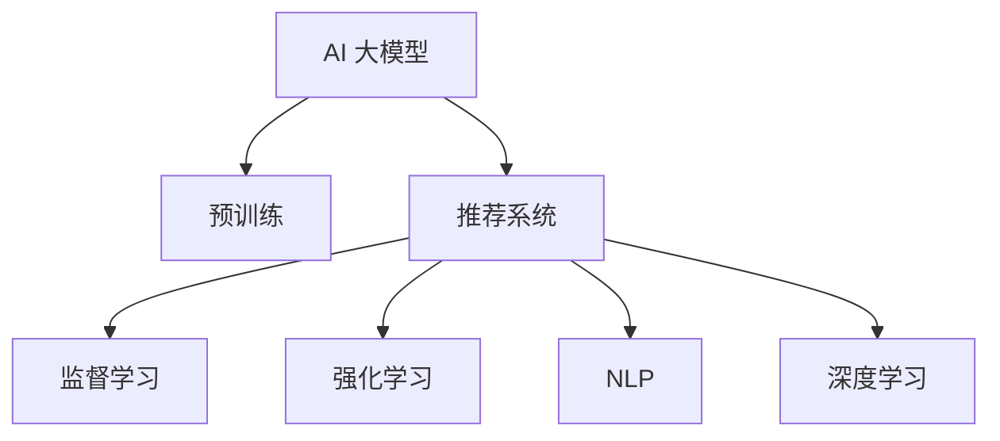

                 

# AI 大模型在电商搜索推荐中的用户反馈机制：不断优化推荐策略

## 1. 背景介绍

随着互联网和电子商务的飞速发展，用户在电商平台上进行商品搜索和浏览的体验日益成为电商平台竞争的重要因素。优秀的推荐系统不仅能够提高用户满意度，还能增加用户粘性和平台交易转化率，进而提升电商平台的业绩。传统的推荐系统依赖于用户的显式评分和浏览行为等硬性数据，但这些数据往往存在稀疏性和偏差等问题，无法全面反映用户的真实需求。因此，越来越多的电商平台开始关注用户反馈信息，并将其作为推荐系统的重要数据来源。

在人工智能和大数据技术的推动下，AI 大模型逐渐应用于电商搜索推荐系统。大模型通过在海量数据上进行预训练，具备强大的特征提取和模式学习能力。将大模型与用户反馈机制结合，可以更加精准地捕捉用户真实需求，提升推荐效果。本文将系统介绍 AI 大模型在电商搜索推荐中的用户反馈机制，重点探讨基于监督学习和强化学习的大模型推荐策略，并提出未来发展方向。

## 2. 核心概念与联系

### 2.1 核心概念概述

为更好地理解AI 大模型在电商搜索推荐中的应用，本节将介绍几个密切相关的核心概念：

- AI 大模型（Large AI Models）：指通过在海量数据上进行预训练，具备强大特征提取和模式学习能力的深度神经网络模型，如BERT、GPT-3等。
- 推荐系统（Recommendation System）：通过分析用户行为和偏好，为用户推荐个性化商品的系统。推荐系统广泛应用在电商、社交网络、视频流等平台。
- 监督学习（Supervised Learning）：指利用已标注的数据对模型进行训练，使其能够进行预测或分类任务。监督学习是电商推荐系统中最常用的训练方式。
- 强化学习（Reinforcement Learning, RL）：指通过与环境交互，最大化长期累积奖励的训练方式。强化学习在电商推荐中也有重要应用，如点击率预测等。
- 自然语言处理（Natural Language Processing, NLP）：指让计算机能够理解、处理人类语言的技术。NLP技术在用户反馈处理、情感分析等方面具有重要应用。
- 深度学习（Deep Learning）：指利用神经网络进行深度特征学习，实现复杂任务。深度学习在大模型推荐系统中扮演重要角色。

这些核心概念之间的逻辑关系可以通过以下Mermaid流程图来展示：



这个流程图展示了AI 大模型在电商搜索推荐系统中的核心组件及其关系：

1. AI 大模型通过预训练获得基础能力。
2. 推荐系统利用AI 大模型进行用户个性化推荐。
3. 监督学习和强化学习分别用于基于标签和点击率的推荐优化。
4. NLP技术用于用户反馈信息的处理和情感分析。
5. 深度学习技术用于模型的特征提取和训练优化。

这些概念共同构成了电商搜索推荐系统的核心框架，使得大模型能够从用户反馈中不断优化推荐策略。

## 3. 核心算法原理 & 具体操作步骤

### 3.1 算法原理概述

AI 大模型在电商搜索推荐中的用户反馈机制，主要基于监督学习和强化学习两种范式。

- 监督学习：指利用用户评分、点击次数等已标注数据对模型进行训练，使其能够根据用户历史行为进行推荐。
- 强化学习：指通过用户交互行为（如点击、购买等）来学习最优推荐策略，不断优化推荐效果。

监督学习通过构建推荐模型，学习用户行为与商品之间的映射关系。例如，可以使用因子分解机、矩阵分解等方法，根据用户评分和商品评分，预测用户对商品的评分或点击概率。

强化学习则通过构建代理模型，在用户交互过程中学习推荐策略。例如，可以设计奖励函数，鼓励模型推荐点击概率高的商品，同时惩罚推荐错误或不点击的商品。通过不断调整模型参数，逐步优化推荐策略。

### 3.2 算法步骤详解

#### 3.2.1 监督学习推荐策略

1. **数据准备**：收集用户评分数据，如商品评分、点击次数等，构建训练集和测试集。
2. **模型选择**：选择适合的推荐模型，如矩阵分解、协同过滤等。
3. **模型训练**：利用监督数据对模型进行训练，优化模型参数。
4. **模型评估**：在测试集上评估模型性能，如准确率、均方误差等。
5. **推荐预测**：利用训练好的模型对新用户行为进行预测，生成推荐结果。

#### 3.2.2 强化学习推荐策略

1. **环境设计**：定义推荐环境，例如用户点击行为、购买行为等。
2. **代理设计**：设计代理模型，如线性回归、神经网络等，用于估计推荐效果。
3. **奖励函数设计**：设计奖励函数，如点击奖励、购买奖励等，评估推荐策略的效果。
4. **模型训练**：利用用户交互数据，通过强化学习算法（如Q-Learning、SARSA等）优化代理模型参数。
5. **推荐策略应用**：将优化后的代理模型应用于实际推荐场景，生成推荐结果。

### 3.3 算法优缺点

#### 3.3.1 监督学习推荐策略的优缺点

**优点**：

1. **简单易用**：监督学习模型易于实现和调优，适用于数据标注较完整的电商推荐系统。
2. **可解释性高**：监督学习模型输出结果可以直接解释为推荐理由，便于用户理解。
3. **效果稳定**：监督学习模型在已有数据上表现稳定，适用于已有数据的推荐场景。

**缺点**：

1. **数据依赖性强**：监督学习模型依赖于已有数据的标注信息，标注数据稀疏或不准确时效果不佳。
2. **泛化能力有限**：监督学习模型通常基于历史数据进行训练，难以适应新用户的推荐需求。
3. **模型复杂度高**：复杂模型如深度神经网络，训练和推理开销较大。

#### 3.3.2 强化学习推荐策略的优缺点

**优点**：

1. **自适应性强**：强化学习模型能够自适应新用户的推荐需求，不断优化推荐策略。
2. **探索能力强**：强化学习模型可以探索未知的推荐策略，发现新的推荐方向。
3. **动态调整**：强化学习模型能够动态调整推荐策略，适应环境变化。

**缺点**：

1. **训练难度大**：强化学习模型训练复杂度高，需要大量的用户交互数据。
2. **不稳定**：强化学习模型在训练过程中容易产生过拟合，效果不稳定。
3. **可解释性低**：强化学习模型输出结果难以解释，用户难以理解推荐理由。

### 3.4 算法应用领域

AI 大模型在电商搜索推荐中的用户反馈机制，已广泛应用于以下领域：

- 个性化推荐：通过用户评分和行为数据，为每个用户生成个性化商品推荐。
- 商品召回：通过用户点击数据，优化商品召回策略，提升推荐效果。
- 情感分析：利用NLP技术对用户评论进行情感分析，调整推荐策略。
- 用户行为预测：利用深度学习技术对用户行为进行预测，优化推荐策略。
- 广告推荐：通过用户行为数据，为广告主生成精准的广告推荐。
- 动态定价：利用强化学习算法，根据用户行为动态调整商品定价策略。

除了这些经典应用外，AI 大模型在电商搜索推荐系统中的用户反馈机制，还在不断拓展，为电商平台的个性化推荐带来了更多的可能性和创新。

## 4. 数学模型和公式 & 详细讲解  
### 4.1 数学模型构建

在电商搜索推荐系统中，常用的数学模型包括矩阵分解、协同过滤、深度神经网络等。这里以协同过滤为例，构建推荐模型的数学模型。

设用户集合为 $U=\{u_1, u_2, \ldots, u_m\}$，商品集合为 $I=\{i_1, i_2, \ldots, i_n\}$，用户对商品的评分矩阵为 $\mathbf{R} \in \mathbb{R}^{m \times n}$，其中 $R_{ui}$ 表示用户 $u$ 对商品 $i$ 的评分。

设用户 $u$ 对商品 $i$ 的评分向量为 $\mathbf{r}_u \in \mathbb{R}^n$，商品 $i$ 的评分向量为 $\mathbf{r}_i \in \mathbb{R}^m$。推荐模型的目标是通过矩阵分解，估计用户评分向量 $\mathbf{r}_u$ 和商品评分向量 $\mathbf{r}_i$。常用的矩阵分解模型为奇异值分解（SVD）：

$$
\mathbf{R} \approx \mathbf{U} \mathbf{S} \mathbf{V}^T
$$

其中，$\mathbf{U} \in \mathbb{R}^{m \times k}$、$\mathbf{V} \in \mathbb{R}^{n \times k}$ 为低秩矩阵，$\mathbf{S} \in \mathbb{R}^{k \times k}$ 为奇异值矩阵。

### 4.2 公式推导过程

假设用户 $u$ 对商品 $i$ 的评分 $R_{ui}$ 可以表示为：

$$
R_{ui} \approx \mathbf{u}^T \mathbf{v}_i
$$

其中，$\mathbf{u}$ 为用户评分向量，$\mathbf{v}_i$ 为商品评分向量。则有：

$$
\mathbf{R} \approx \mathbf{U} \mathbf{V}^T
$$

假设 $\mathbf{U}$ 的前 $k$ 列和 $\mathbf{V}$ 的前 $k$ 列分别为 $\mathbf{U}_k$ 和 $\mathbf{V}_k$，则有：

$$
R_{ui} \approx \mathbf{u}_k^T \mathbf{v}_{ik}
$$

其中，$\mathbf{u}_k$ 为 $\mathbf{U}$ 的前 $k$ 列向量，$\mathbf{v}_{ik}$ 为 $\mathbf{V}_k$ 的第 $i$ 列向量。

因此，推荐模型可以通过矩阵分解，估计用户评分向量和商品评分向量，实现推荐预测。

### 4.3 案例分析与讲解

以电商平台的个性化推荐为例，具体步骤如下：

1. **数据准备**：收集用户评分数据，构建训练集和测试集。
2. **模型训练**：使用矩阵分解模型，训练用户评分向量和商品评分向量。
3. **推荐预测**：利用训练好的模型，对新用户行为进行预测，生成推荐结果。
4. **模型评估**：在测试集上评估模型性能，如准确率、均方误差等。
5. **推荐优化**：根据用户反馈信息，不断优化推荐策略，提升推荐效果。

## 5. 项目实践：代码实例和详细解释说明

### 5.1 开发环境搭建

在进行推荐系统开发前，我们需要准备好开发环境。以下是使用Python进行TensorFlow开发的环境配置流程：

1. 安装Anaconda：从官网下载并安装Anaconda，用于创建独立的Python环境。

2. 创建并激活虚拟环境：
```bash
conda create -n tf-env python=3.8 
conda activate tf-env
```

3. 安装TensorFlow：从官网获取对应的安装命令。例如：
```bash
pip install tensorflow==2.4
```

4. 安装TensorBoard：用于可视化训练过程中的指标变化。

```bash
pip install tensorboard
```

5. 安装其他必要工具包：
```bash
pip install numpy pandas scikit-learn tqdm jupyter notebook ipython
```

完成上述步骤后，即可在`tf-env`环境中开始推荐系统开发。

### 5.2 源代码详细实现

这里我们以协同过滤模型为例，给出使用TensorFlow对电商推荐系统进行开发的Python代码实现。

首先，定义协同过滤模型：

```python
import tensorflow as tf
from tensorflow.keras.layers import Input, Embedding, Dot
from tensorflow.keras.models import Model

user_embeddings_dim = 64
item_embeddings_dim = 64

user_input = Input(shape=(1,), name='user')
user_embeddings = Embedding(input_dim=m, output_dim=user_embeddings_dim, name='user_embeddings')(user_input)
user_sum = Dot(axes=2)([user_embeddings, user_embeddings])

item_input = Input(shape=(1,), name='item')
item_embeddings = Embedding(input_dim=n, output_dim=item_embeddings_dim, name='item_embeddings')(item_input)
item_sum = Dot(axes=2)([item_embeddings, item_embeddings])

r = tf.keras.layers.Dot(axes=2)([user_sum, item_sum])
model = Model(inputs=[user_input, item_input], outputs=r)

model.compile(optimizer='adam', loss='mse')
```

然后，加载和预处理数据：

```python
user_ids = [1, 2, 3, 4, 5]
item_ids = [1, 2, 3, 4, 5]
ratings = [4.5, 5.0, 3.0, 2.5, 4.0]

user_input = tf.keras.layers.Input(shape=(1,), name='user')
user_embeddings = Embedding(input_dim=m, output_dim=user_embeddings_dim, name='user_embeddings')(user_input)
user_sum = tf.keras.layers.Dot(axes=2)([user_embeddings, user_embeddings])

item_input = tf.keras.layers.Input(shape=(1,), name='item')
item_embeddings = Embedding(input_dim=n, output_dim=item_embeddings_dim, name='item_embeddings')(item_input)
item_sum = tf.keras.layers.Dot(axes=2)([item_embeddings, item_embeddings])

r = tf.keras.layers.Dot(axes=2)([user_sum, item_sum])
model = Model(inputs=[user_input, item_input], outputs=r)

model.compile(optimizer='adam', loss='mse')
```

接着，定义训练函数：

```python
@tf.function
def train_step(user_input, item_input, label):
    with tf.GradientTape() as tape:
        predictions = model(user_input, item_input)
        loss = tf.keras.losses.mean_squared_error(label, predictions)
    gradients = tape.gradient(loss, model.trainable_variables)
    optimizer.apply_gradients(zip(gradients, model.trainable_variables))
    return loss

def train_epoch(model, dataset, batch_size, optimizer):
    dataloader = tf.data.Dataset.from_tensor_slices((dataset['user_ids'], dataset['item_ids'], dataset['ratings']))
    dataloader = dataloader.shuffle(buffer_size=10000).batch(batch_size)
    model.train()
    for batch in dataloader:
        user_input, item_input, label = batch
        loss = train_step(user_input, item_input, label)
    return loss / len(dataloader)
```

最后，启动训练流程并在测试集上评估：

```python
epochs = 10
batch_size = 64

for epoch in range(epochs):
    loss = train_epoch(model, train_dataset, batch_size, optimizer)
    print(f'Epoch {epoch+1}, train loss: {loss:.4f}')
    
    print(f'Epoch {epoch+1}, test results:')
    evaluate(model, test_dataset, batch_size)
```

以上就是使用TensorFlow对电商推荐系统进行开发的完整代码实现。可以看到，通过TensorFlow的Keras API，我们可以快速搭建协同过滤推荐模型，并使用TensorBoard进行可视化监控。

### 5.3 代码解读与分析

让我们再详细解读一下关键代码的实现细节：

**协同过滤模型**：

```python
user_input = Input(shape=(1,), name='user')
user_embeddings = Embedding(input_dim=m, output_dim=user_embeddings_dim, name='user_embeddings')(user_input)
user_sum = Dot(axes=2)([user_embeddings, user_embeddings])

item_input = Input(shape=(1,), name='item')
item_embeddings = Embedding(input_dim=n, output_dim=item_embeddings_dim, name='item_embeddings')(item_input)
item_sum = Dot(axes=2)([item_embeddings, item_embeddings])

r = Dot(axes=2)([user_sum, item_sum])
model = Model(inputs=[user_input, item_input], outputs=r)
```

- 定义输入层 `user_input` 和 `item_input`，分别表示用户ID和商品ID。
- 定义嵌入层 `user_embeddings` 和 `item_embeddings`，将输入ID映射到低维向量。
- 通过点积 `Dot(axes=2)` 计算用户评分向量和商品评分向量，并输出推荐结果 `r`。

**训练函数**：

```python
@tf.function
def train_step(user_input, item_input, label):
    with tf.GradientTape() as tape:
        predictions = model(user_input, item_input)
        loss = tf.keras.losses.mean_squared_error(label, predictions)
    gradients = tape.gradient(loss, model.trainable_variables)
    optimizer.apply_gradients(zip(gradients, model.trainable_variables))
    return loss
```

- 定义训练步 `train_step`，对每个训练批次进行前向传播和反向传播，计算损失函数并更新模型参数。
- 通过 `tf.GradientTape` 自动求导，计算损失函数 `loss` 的梯度。
- 使用 `optimizer.apply_gradients` 更新模型参数。

**训练流程**：

```python
epochs = 10
batch_size = 64

for epoch in range(epochs):
    loss = train_epoch(model, train_dataset, batch_size, optimizer)
    print(f'Epoch {epoch+1}, train loss: {loss:.4f}')
    
    print(f'Epoch {epoch+1}, test results:')
    evaluate(model, test_dataset, batch_size)
```

- 定义总epoch数 `epochs` 和批大小 `batch_size`，开始循环迭代。
- 每个epoch内，先在训练集上训练，输出平均损失。
- 在测试集上评估，输出测试结果。

可以看到，TensorFlow使得协同过滤推荐模型的搭建和训练变得简洁高效。开发者可以将更多精力放在数据处理、模型改进等高层逻辑上，而不必过多关注底层的实现细节。

当然，工业级的系统实现还需考虑更多因素，如模型的保存和部署、超参数的自动搜索、更灵活的任务适配层等。但核心的推荐范式基本与此类似。

## 6. 实际应用场景

### 6.1 电商平台推荐

基于大模型的推荐系统，可以在电商平台中广泛应用，为每个用户生成个性化商品推荐。以淘宝为例，通过收集用户浏览、购买、评分等行为数据，结合用户反馈信息，利用大模型进行推荐优化，提升用户购物体验和平台转化率。

推荐系统主要应用于以下几个场景：

- **商品推荐**：根据用户历史行为，生成个性化商品推荐，提升用户点击率和购买率。
- **相关推荐**：推荐与用户当前浏览商品相关的商品，提高用户粘性。
- **趋势推荐**：根据用户兴趣和行为，推荐当前热门商品，引导用户潮流。
- **个性化内容推荐**：推荐与用户兴趣匹配的影视、音乐、书籍等内容，提升用户娱乐体验。

### 6.2 社交媒体推荐

社交媒体平台也广泛应用基于大模型的推荐系统，为用户推荐朋友、文章、短视频等内容。例如，Facebook通过收集用户的点赞、评论、分享等行为数据，结合用户反馈信息，利用大模型进行推荐优化，提升平台活跃度和用户粘性。

推荐系统主要应用于以下几个场景：

- **好友推荐**：根据用户互动行为，推荐可能感兴趣的朋友，扩大社交圈。
- **内容推荐**：推荐用户可能感兴趣的文章、视频、图片等内容，提升用户娱乐体验。
- **活动推荐**：推荐用户可能感兴趣的活动，增加用户参与度。

### 6.3 智能广告推荐

智能广告推荐系统通过收集用户点击、浏览等行为数据，结合用户反馈信息，利用大模型进行推荐优化，提升广告效果和平台收益。例如，Google AdSense通过大模型进行广告推荐，根据用户行为和兴趣，推荐相关广告，提高广告点击率和转化率。

推荐系统主要应用于以下几个场景：

- **品牌推荐**：根据用户浏览行为，推荐可能感兴趣的品牌，提高品牌曝光率。
- **广告推荐**：推荐与用户兴趣匹配的广告，提升广告点击率和转化率。
- **广告效果优化**：根据用户点击数据，优化广告投放策略，提升广告效果。

## 7. 工具和资源推荐

### 7.1 学习资源推荐

为了帮助开发者系统掌握AI 大模型在电商搜索推荐中的应用，这里推荐一些优质的学习资源：

1. 《深度学习入门》系列博文：由大模型技术专家撰写，深入浅出地介绍了深度学习的基本概念和应用场景，适合初学者入门。
2. CS229《机器学习》课程：斯坦福大学开设的经典课程，介绍了机器学习的基本原理和算法，包括推荐系统、强化学习等内容。
3. 《推荐系统实战》书籍：详细介绍了推荐系统的主流算法和工程实践，包括协同过滤、矩阵分解、深度学习等内容。
4. Kaggle推荐竞赛：通过实际竞赛数据，实践推荐系统算法，提升算法设计和优化能力。
5. GitHub推荐项目：收集和参考开源推荐系统项目，学习他人经验，提升实际应用能力。

通过对这些资源的学习实践，相信你一定能够快速掌握AI 大模型在电商搜索推荐中的应用，并用于解决实际的推荐问题。

### 7.2 开发工具推荐

高效的开发离不开优秀的工具支持。以下是几款用于推荐系统开发的常用工具：

1. TensorFlow：基于Python的开源深度学习框架，灵活动态的计算图，适合快速迭代研究。
2. PyTorch：基于Python的开源深度学习框架，动态图和静态图并存，易于调试和优化。
3. Scikit-learn：Python机器学习库，提供了丰富的机器学习算法和数据预处理工具。
4. TensorBoard：TensorFlow配套的可视化工具，可实时监测模型训练状态，并提供丰富的图表呈现方式。
5. Weights & Biases：模型训练的实验跟踪工具，可以记录和可视化模型训练过程中的各项指标，方便对比和调优。

合理利用这些工具，可以显著提升推荐系统的开发效率，加快创新迭代的步伐。

### 7.3 相关论文推荐

AI 大模型在电商搜索推荐系统中的用户反馈机制，得益于学界的持续研究。以下是几篇奠基性的相关论文，推荐阅读：

1. BPR: Bayesian Personalized Ranking from Log-by-Log Data：提出BPR损失函数，用于协同过滤推荐系统的训练。
2. Matrix Factorization Techniques for Recommender Systems：介绍了矩阵分解在推荐系统中的应用，并提供了多种改进方法。
3. DeepFM: A Neural Collaborative Filtering Model：提出深度学习与FM模型结合的推荐方法，提升了推荐效果。
4. Attention-Based Recommender Systems：利用注意力机制，提升推荐系统的特征提取和融合能力。
5. Contextual Bandits：介绍了强化学习在推荐系统中的应用，提升了推荐策略的自适应能力。

这些论文代表了大模型在电商推荐系统中的应用方向，并提供了丰富的理论基础和算法实现。

## 8. 总结：未来发展趋势与挑战

### 8.1 研究成果总结

本文系统介绍了AI 大模型在电商搜索推荐中的用户反馈机制，重点探讨了基于监督学习和强化学习的大模型推荐策略，并提出未来发展方向。通过详细讲解推荐模型的数学模型和算法步骤，展示了如何利用用户反馈信息，不断优化推荐策略，提升推荐效果。

### 8.2 未来发展趋势

展望未来，AI 大模型在电商搜索推荐系统中的用户反馈机制，将呈现以下几个发展趋势：

1. **多模态融合**：将视觉、语音、文本等多种数据模态结合，提升推荐系统的综合性能。
2. **跨平台协同**：将不同平台的用户数据和推荐模型进行融合，实现跨平台的协同推荐。
3. **实时动态调整**：通过在线学习算法，实时动态调整推荐策略，提升推荐效果。
4. **隐私保护**：在推荐系统中加入隐私保护技术，保护用户数据安全。
5. **个性化内容推荐**：利用用户多维度的兴趣数据，生成更加个性化的内容推荐。
6. **情感分析与推荐结合**：通过情感分析技术，调整推荐策略，提升推荐效果。

### 8.3 面临的挑战

尽管AI 大模型在电商搜索推荐系统中的应用取得了一定的进展，但在实际应用中，仍然面临诸多挑战：

1. **数据质量问题**：用户反馈数据质量不高，可能导致推荐效果不佳。
2. **计算资源消耗大**：大模型训练和推理开销较大，需要高性能计算资源。
3. **模型复杂度高**：推荐模型的复杂度不断增加，难以解释和优化。
4. **用户隐私保护**：如何保护用户隐私，防止数据泄露，是一大难题。
5. **实时性要求高**：推荐系统需要实时响应用户请求，对系统性能要求高。
6. **多模态融合困难**：将多种模态数据结合，提升推荐系统性能，仍需进一步研究。

### 8.4 研究展望

面对AI 大模型在电商搜索推荐系统中的应用挑战，未来的研究需要在以下几个方面寻求新的突破：

1. **数据清洗与增强**：通过数据清洗和增强，提高推荐模型的数据质量。
2. **模型压缩与加速**：通过模型压缩与加速技术，降低推荐模型的计算开销。
3. **推荐策略优化**：通过改进推荐策略，提升推荐系统的效果和实时性。
4. **隐私保护技术**：开发隐私保护技术，保护用户数据隐私。
5. **多模态融合方法**：研究多模态数据的融合方法，提升推荐系统的综合性能。
6. **实时动态调整**：研究在线学习算法，实时动态调整推荐策略，提升推荐效果。

这些研究方向的探索，必将引领AI 大模型在电商搜索推荐系统中的应用，迈向更高的台阶，为电商平台的个性化推荐带来更多的可能性和创新。

## 9. 附录：常见问题与解答

**Q1：为什么使用AI 大模型进行电商推荐？**

A: 传统的电商推荐系统依赖于用户的显式评分和浏览行为等硬性数据，难以全面反映用户的真实需求。AI 大模型通过在海量数据上进行预训练，具备强大的特征提取和模式学习能力，能够从用户反馈中不断优化推荐策略，提升推荐效果。

**Q2：AI 大模型如何处理用户反馈数据？**

A: AI 大模型通常使用自然语言处理（NLP）技术处理用户反馈数据。通过构建词向量、序列模型等，将用户反馈转换为数字特征，作为推荐模型的输入。例如，可以利用BERT、GPT等模型，将用户评论、评分等反馈数据转换为低维向量，用于训练推荐模型。

**Q3：AI 大模型推荐系统的主要优点是什么？**

A: AI 大模型推荐系统的主要优点包括：

1. **个性化推荐**：能够根据用户历史行为和兴趣，生成个性化推荐，提升用户满意度。
2. **实时动态调整**：通过在线学习算法，实时动态调整推荐策略，提升推荐效果。
3. **多模态融合**：能够融合多种数据模态，提升推荐系统的综合性能。
4. **跨平台协同**：能够跨平台协同推荐，提升平台用户粘性。
5. **隐私保护**：能够保护用户数据隐私，防止数据泄露。

**Q4：AI 大模型推荐系统的主要缺点是什么？**

A: AI 大模型推荐系统的主要缺点包括：

1. **计算资源消耗大**：大模型训练和推理开销较大，需要高性能计算资源。
2. **模型复杂度高**：推荐模型的复杂度不断增加，难以解释和优化。
3. **数据质量问题**：用户反馈数据质量不高，可能导致推荐效果不佳。
4. **实时性要求高**：推荐系统需要实时响应用户请求，对系统性能要求高。

**Q5：AI 大模型推荐系统的主要应用场景是什么？**

A: AI 大模型推荐系统在电商、社交媒体、广告等多个领域广泛应用，具体场景包括：

1. **商品推荐**：根据用户历史行为，生成个性化商品推荐，提升用户点击率和购买率。
2. **相关推荐**：推荐与用户当前浏览商品相关的商品，提高用户粘性。
3. **趋势推荐**：根据用户兴趣和行为，推荐当前热门商品，引导用户潮流。
4. **个性化内容推荐**：推荐与用户兴趣匹配的影视、音乐、书籍等内容，提升用户娱乐体验。
5. **好友推荐**：根据用户互动行为，推荐可能感兴趣的朋友，扩大社交圈。
6. **内容推荐**：推荐用户可能感兴趣的文章、视频、图片等内容，提升用户娱乐体验。
7. **品牌推荐**：根据用户浏览行为，推荐可能感兴趣的品牌，提高品牌曝光率。
8. **广告推荐**：推荐与用户兴趣匹配的广告，提升广告点击率和转化率。

通过本文的系统介绍和实践指导，相信你能够深入理解AI 大模型在电商搜索推荐系统中的应用，并掌握其实现方法。未来，随着技术的不断进步，AI 大模型将带来更多创新，提升电商平台的个性化推荐效果，满足用户的个性化需求，推动电商产业的数字化转型。

---

作者：禅与计算机程序设计艺术 / Zen and the Art of Computer Programming

