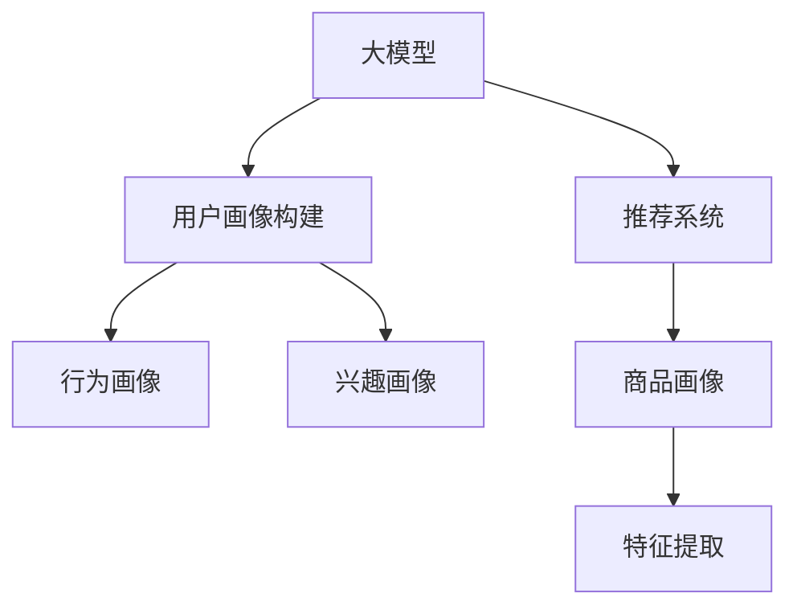

                 

## 1. 背景介绍

### 1.1 电商搜索推荐系统概述

电商搜索推荐系统是现代电子商务的核心技术之一，通过精准匹配用户需求与商品，提升用户体验，提高交易转化率。传统的推荐系统多依赖于用户行为数据，如浏览记录、购买记录等，来预测用户可能感兴趣的商品。然而，这些数据往往存在稀疏性和异构性，难以充分捕捉用户复杂多样的需求。

近年来，随着AI大模型的发展，电商推荐系统开始引入大模型进行用户画像构建，通过综合利用文本、图像、行为等数据，提供更加全面准确的推荐服务。本文将深入探讨利用大模型构建电商用户画像的方法，并阐述其在搜索推荐中的具体应用。

### 1.2 用户画像构建的重要性

用户画像(User Profile)是电商推荐系统的核心组成部分，用于刻画用户的基本特征和行为偏好，从而生成个性化的推荐结果。传统的用户画像构建依赖于人工标注，工作量大且难以捕捉用户行为的动态变化。大模型的出现，使得用户画像的构建可以基于海量数据进行，既高效又准确。

构建用户画像的关键在于：
1. 获取全面丰富的用户数据。
2. 利用大模型的语言理解能力，自动提取用户兴趣、情感等信息。
3. 根据用户画像动态调整推荐策略，实现精准推荐。

## 2. 核心概念与联系

### 2.1 核心概念概述

为更好地理解基于大模型的电商用户画像构建，本节将介绍几个密切相关的核心概念：

- **大模型(Large Model)**：指具有大规模参数量的深度学习模型，如BERT、GPT、DALL-E等。这些模型通过在海量数据上进行预训练，获得了强大的文本生成、分类、情感分析等能力。

- **用户画像(User Profile)**：用于描述用户基本特征和行为偏好的数据结构，包括用户的性别、年龄、兴趣、行为等。用户画像通过大模型自动提取，可以实时更新，动态反映用户需求。

- **推荐系统(Recommendation System)**：根据用户画像和商品特征，为用户推荐可能感兴趣的商品的系统。推荐系统可以分为基于内容的推荐、协同过滤、基于混合的推荐等。

- **AI大模型(AI Large Model)**：通过大规模数据预训练获得基础能力的大规模深度学习模型。在电商推荐系统中，大模型主要用于用户画像构建和商品特征提取。

- **Transformer**：一种基于自注意力机制的深度学习模型，在自然语言处理、图像识别等任务上表现优异。在电商推荐系统中，常用于构建用户画像和商品特征。

- **自然语言处理(NLP)**：处理和分析人类语言的技术，涉及文本分类、情感分析、命名实体识别等任务。在电商推荐系统中，常用于用户评论分析、商品描述分析等。

- **深度学习(Deep Learning)**：利用神经网络模型对大规模数据进行学习，提取复杂特征的技术。在电商推荐系统中，常用于用户画像构建和商品特征提取。

这些核心概念之间的逻辑关系可以通过以下Mermaid流程图来展示：



这个流程图展示了大模型在电商推荐系统中的核心作用：

1. 大模型通过预训练获得基础能力。
2. 用户画像和商品画像通过大模型自动构建，捕捉用户行为和商品特征。
3. 推荐系统基于用户画像和商品画像，生成个性化推荐。

## 3. 核心算法原理 & 具体操作步骤

### 3.1 算法原理概述

基于大模型的电商用户画像构建，本质上是一个通过自监督学习任务训练模型，从而获取用户画像和商品画像的过程。其核心思想是：将大模型视作一种强大的"特征提取器"，通过与用户行为数据、商品数据等进行交互，自动学习用户画像和商品特征。

形式化地，假设用户画像和商品画像的构建数据集为 $D=\{(x_i,y_i)\}_{i=1}^N$，其中 $x_i$ 为用户行为数据、商品描述等，$y_i$ 为用户画像或商品画像，$y_i \in \{0,1\}^{D_{out}}$。构建的目标是找到最优的模型参数 $\theta$，使得：

$$
\theta^* = \mathop{\arg\min}_{\theta} \mathcal{L}(M_{\theta},D)
$$

其中 $\mathcal{L}$ 为针对用户画像构建任务设计的损失函数，用于衡量模型输出与真实标签之间的差异。常见的损失函数包括交叉熵损失、均方误差损失等。

通过梯度下降等优化算法，构建过程不断更新模型参数 $\theta$，最小化损失函数 $\mathcal{L}$，使得模型输出逼近真实标签。由于 $\theta$ 已经通过预训练获得了较好的初始化，因此即便在用户行为数据、商品数据等小规模数据集 $D$ 上进行构建，也能较快收敛到理想的模型参数 $\theta^*$。

### 3.2 算法步骤详解

基于大模型的电商用户画像构建一般包括以下几个关键步骤：

**Step 1: 准备用户行为数据**

- 收集用户历史浏览、购买、评价等行为数据，包括商品ID、浏览时长、评价内容等。
- 将行为数据进行预处理，如去除噪声、归一化等。

**Step 2: 构建用户画像和商品画像**

- 使用大模型对用户行为数据进行处理，自动提取用户兴趣、行为偏好等信息，构建用户画像。
- 对商品描述、商品标签等文本数据进行预处理和特征提取，构建商品画像。

**Step 3: 训练用户画像模型**

- 将用户画像和商品画像作为标注数据，使用大模型进行监督学习。
- 选择适当的损失函数和优化器，设置合适的学习率。
- 设定正则化技术，如L2正则、Dropout等，防止过拟合。

**Step 4: 融合用户画像与商品画像**

- 根据用户画像和商品画像的相似度，计算商品与用户的匹配度。
- 使用余弦相似度、TF-IDF等方法，对用户画像和商品画像进行相似度计算。

**Step 5: 生成推荐结果**

- 将匹配度高的商品作为推荐结果，返回给用户。
- 动态更新用户画像，实现个性化推荐。

以上是基于大模型的电商用户画像构建的一般流程。在实际应用中，还需要针对具体任务和数据特点，对构建过程的各个环节进行优化设计，如改进用户画像和商品画像的相似度计算方法，引入更多正则化技术，搜索最优的超参数组合等，以进一步提升模型性能。

### 3.3 算法优缺点

基于大模型的电商用户画像构建方法具有以下优点：

1. 数据处理高效。大模型的自监督学习任务可以自动处理大规模数据，无需人工标注，节省大量时间和人力。
2. 模型鲁棒性强。通过多源数据融合，构建的用户画像和商品画像更具鲁棒性，减少单源数据噪声的干扰。
3. 个性化推荐精准。根据动态更新的用户画像，实时调整推荐策略，实现更加个性化的推荐。
4. 适应性强。大模型具有强大的泛化能力，能够适应各种电商推荐场景，灵活应用到不同领域的推荐系统。

同时，该方法也存在一定的局限性：

1. 模型复杂度高。构建用户画像和商品画像需要大量数据和计算资源，对硬件要求较高。
2. 数据隐私问题。大模型需要大量用户数据，可能涉及用户隐私问题，需要合规处理。
3. 模型解释性差。大模型通常被视为"黑盒"系统，难以解释其决策逻辑。
4. 模型偏见。大模型可能学习到数据中的偏见，导致推荐结果存在歧视性。

尽管存在这些局限性，但就目前而言，基于大模型的电商用户画像构建方法仍然是大数据时代的必然趋势。未来相关研究的重点在于如何进一步降低计算资源需求，提高模型解释性和公平性，同时兼顾隐私保护。

### 3.4 算法应用领域

基于大模型的电商用户画像构建技术，已经在多个电商推荐场景中得到了广泛应用，例如：

- 个性化推荐：通过分析用户历史行为，自动生成个性化商品推荐。
- 跨域推荐：将用户画像应用于不同电商平台，实现跨平台推荐。
- 商品相似度计算：利用用户画像和商品画像，计算商品之间的相似度，优化商品推荐。
- 用户行为分析：对用户行为数据进行情感分析、意图识别等，提升推荐系统理解用户的能力。
- 数据增强：利用用户画像和商品画像，生成更多高质量训练样本，提升推荐系统效果。

除了上述这些经典应用外，大模型在电商推荐系统的其他领域，如广告投放、活动推荐、库存管理等，也展现出了巨大的潜力。随着预训练模型和构建方法的不断进步，相信电商推荐系统将迎来更加智能化、精准化的新阶段。

## 4. 数学模型和公式 & 详细讲解 & 举例说明

### 4.1 数学模型构建

本节将使用数学语言对基于大模型的电商用户画像构建过程进行更加严格的刻画。

记用户画像构建任务的数据集为 $D=\{(x_i,y_i)\}_{i=1}^N$，其中 $x_i$ 为用户行为数据、商品描述等，$y_i$ 为用户画像，$y_i \in \{0,1\}^{D_{out}}$。设大模型的参数为 $\theta$，用户画像模型的预测输出为 $\hat{y}_i$，则构建的目标是找到最优参数 $\theta^*$，使得：

$$
\theta^* = \mathop{\arg\min}_{\theta} \mathcal{L}(\hat{y}_i,y_i)
$$

其中 $\mathcal{L}$ 为损失函数，通常采用交叉熵损失函数。假设 $y_i$ 的第 $j$ 个维度为 $1$，则交叉熵损失函数为：

$$
\mathcal{L}(\hat{y}_i,y_i) = -\sum_{j=1}^{D_{out}}y_{ij}\log \hat{y}_{ij}
$$

### 4.2 公式推导过程

以下我们以用户画像构建中的二分类任务为例，推导交叉熵损失函数及其梯度的计算公式。

假设模型 $M_{\theta}$ 在输入 $x_i$ 上的输出为 $\hat{y}_i=M_{\theta}(x_i) \in [0,1]$，表示用户属于正类的概率。真实标签 $y_i \in \{0,1\}$。则二分类交叉熵损失函数定义为：

$$
\mathcal{L}(\hat{y}_i,y_i) = -[y_i\log \hat{y}_i + (1-y_i)\log (1-\hat{y}_i)]
$$

将其代入构建目标，得：

$$
\theta^* = \mathop{\arg\min}_{\theta} \sum_{i=1}^N \mathcal{L}(\hat{y}_i,y_i)
$$

根据链式法则，损失函数对参数 $\theta_k$ 的梯度为：

$$
\frac{\partial \mathcal{L}(\hat{y}_i,y_i)}{\partial \theta_k} = -(\frac{y_i}{\hat{y}_i}-\frac{1-y_i}{1-\hat{y}_i}) \frac{\partial \hat{y}_i}{\partial \theta_k}
$$

其中 $\frac{\partial \hat{y}_i}{\partial \theta_k}$ 可进一步递归展开，利用自动微分技术完成计算。

在得到损失函数的梯度后，即可带入参数更新公式，完成模型的迭代优化。重复上述过程直至收敛，最终得到适应电商推荐任务的最优模型参数 $\theta^*$。

## 5. 项目实践：代码实例和详细解释说明

### 5.1 开发环境搭建

在进行电商用户画像构建实践前，我们需要准备好开发环境。以下是使用Python进行PyTorch开发的环境配置流程：

1. 安装Anaconda：从官网下载并安装Anaconda，用于创建独立的Python环境。

2. 创建并激活虚拟环境：
```bash
conda create -n pytorch-env python=3.8 
conda activate pytorch-env
```

3. 安装PyTorch：根据CUDA版本，从官网获取对应的安装命令。例如：
```bash
conda install pytorch torchvision torchaudio cudatoolkit=11.1 -c pytorch -c conda-forge
```

4. 安装各类工具包：
```bash
pip install numpy pandas scikit-learn matplotlib tqdm jupyter notebook ipython
```

完成上述步骤后，即可在`pytorch-env`环境中开始用户画像构建实践。

### 5.2 源代码详细实现

这里以用户画像构建的文本分类任务为例，给出使用Transformers库对BERT模型进行用户画像构建的PyTorch代码实现。

首先，定义用户画像数据处理函数：

```python
from transformers import BertTokenizer
from torch.utils.data import Dataset
import torch

class UserProfilDataset(Dataset):
    def __init__(self, texts, labels, tokenizer, max_len=128):
        self.texts = texts
        self.labels = labels
        self.tokenizer = tokenizer
        self.max_len = max_len
        
    def __len__(self):
        return len(self.texts)
    
    def __getitem__(self, item):
        text = self.texts[item]
        label = self.labels[item]
        
        encoding = self.tokenizer(text, return_tensors='pt', max_length=self.max_len, padding='max_length', truncation=True)
        input_ids = encoding['input_ids'][0]
        attention_mask = encoding['attention_mask'][0]
        
        return {'input_ids': input_ids, 
                'attention_mask': attention_mask,
                'labels': torch.tensor(label, dtype=torch.long)}
```

然后，定义模型和优化器：

```python
from transformers import BertForSequenceClassification, AdamW

model = BertForSequenceClassification.from_pretrained('bert-base-cased', num_labels=2)

optimizer = AdamW(model.parameters(), lr=2e-5)
```

接着，定义训练和评估函数：

```python
from torch.utils.data import DataLoader
from tqdm import tqdm
from sklearn.metrics import classification_report

device = torch.device('cuda') if torch.cuda.is_available() else torch.device('cpu')
model.to(device)

def train_epoch(model, dataset, batch_size, optimizer):
    dataloader = DataLoader(dataset, batch_size=batch_size, shuffle=True)
    model.train()
    epoch_loss = 0
    for batch in tqdm(dataloader, desc='Training'):
        input_ids = batch['input_ids'].to(device)
        attention_mask = batch['attention_mask'].to(device)
        labels = batch['labels'].to(device)
        model.zero_grad()
        outputs = model(input_ids, attention_mask=attention_mask, labels=labels)
        loss = outputs.loss
        epoch_loss += loss.item()
        loss.backward()
        optimizer.step()
    return epoch_loss / len(dataloader)

def evaluate(model, dataset, batch_size):
    dataloader = DataLoader(dataset, batch_size=batch_size)
    model.eval()
    preds, labels = [], []
    with torch.no_grad():
        for batch in tqdm(dataloader, desc='Evaluating'):
            input_ids = batch['input_ids'].to(device)
            attention_mask = batch['attention_mask'].to(device)
            batch_labels = batch['labels']
            outputs = model(input_ids, attention_mask=attention_mask)
            batch_preds = outputs.logits.argmax(dim=2).to('cpu').tolist()
            batch_labels = batch_labels.to('cpu').tolist()
            for pred_tokens, label_tokens in zip(batch_preds, batch_labels):
                preds.append(pred_tokens)
                labels.append(label_tokens)
                
    print(classification_report(labels, preds))
```

最后，启动训练流程并在测试集上评估：

```python
epochs = 5
batch_size = 16

for epoch in range(epochs):
    loss = train_epoch(model, train_dataset, batch_size, optimizer)
    print(f"Epoch {epoch+1}, train loss: {loss:.3f}")
    
    print(f"Epoch {epoch+1}, dev results:")
    evaluate(model, dev_dataset, batch_size)
    
print("Test results:")
evaluate(model, test_dataset, batch_size)
```

以上就是使用PyTorch对BERT进行用户画像构建的完整代码实现。可以看到，得益于Transformers库的强大封装，我们可以用相对简洁的代码完成BERT模型的加载和用户画像构建。

### 5.3 代码解读与分析

让我们再详细解读一下关键代码的实现细节：

**UserProfilDataset类**：
- `__init__`方法：初始化文本、标签、分词器等关键组件。
- `__len__`方法：返回数据集的样本数量。
- `__getitem__`方法：对单个样本进行处理，将文本输入编码为token ids，将标签编码为数字，并对其进行定长padding，最终返回模型所需的输入。

**tag2id和id2tag字典**：
- 定义了标签与id的映射关系，用于将token-wise的预测结果解码回真实的标签。

**训练和评估函数**：
- 使用PyTorch的DataLoader对数据集进行批次化加载，供模型训练和推理使用。
- 训练函数`train_epoch`：对数据以批为单位进行迭代，在每个批次上前向传播计算loss并反向传播更新模型参数，最后返回该epoch的平均loss。
- 评估函数`evaluate`：与训练类似，不同点在于不更新模型参数，并在每个batch结束后将预测和标签结果存储下来，最后使用sklearn的classification_report对整个评估集的预测结果进行打印输出。

**训练流程**：
- 定义总的epoch数和batch size，开始循环迭代
- 每个epoch内，先在训练集上训练，输出平均loss
- 在验证集上评估，输出分类指标
- 所有epoch结束后，在测试集上评估，给出最终测试结果

可以看到，PyTorch配合Transformers库使得BERT用户画像构建的代码实现变得简洁高效。开发者可以将更多精力放在数据处理、模型改进等高层逻辑上，而不必过多关注底层的实现细节。

当然，工业级的系统实现还需考虑更多因素，如模型的保存和部署、超参数的自动搜索、更灵活的任务适配层等。但核心的用户画像构建范式基本与此类似。

## 6. 实际应用场景

### 6.1 用户行为分析

基于大模型的电商用户画像构建，可以实现对用户行为的高效分析。通过分析用户浏览、购买、评价等行为数据，大模型能够自动提取用户的兴趣、情感、意图等信息，从而为推荐系统提供更精准的用户画像。

例如，可以对用户浏览的商品进行情感分析，判断用户是满意还是不满意。对用户的评价进行情感分析，获取用户的情感倾向。对用户的点击、购买行为进行分析，提取用户的兴趣点。

### 6.2 个性化推荐

用户画像构建的核心应用之一是个性化推荐。通过分析用户画像，推荐系统可以生成个性化的商品推荐结果。根据用户画像和商品画像的相似度，计算商品与用户的匹配度，生成推荐结果。

例如，根据用户画像中的兴趣标签，匹配相似的商品。根据用户的浏览历史，生成商品相似度列表。根据用户画像和商品画像的相似度，生成推荐商品列表。

### 6.3 活动推荐

电商平台的各类促销活动需要精准推荐给用户，以提升活动效果。通过用户画像构建，可以分析用户的行为特征，预测其对不同活动的兴趣。例如，分析用户对降价活动的响应情况，推荐用户感兴趣的促销活动。

例如，根据用户的浏览历史，生成活动推荐列表。根据用户画像中的行为特征，生成活动推荐结果。根据用户的购买记录，生成个性化活动推荐。

### 6.4 未来应用展望

随着大模型和构建方法的不断进步，基于用户画像构建的推荐系统将呈现以下几个发展趋势：

1. 多模态融合。利用文本、图像、视频等多模态数据，全面刻画用户画像。例如，利用用户上传的图像数据，分析用户兴趣和行为。

2. 动态更新。实时更新用户画像，动态调整推荐策略。例如，根据用户的新行为数据，动态调整推荐商品列表。

3. 隐私保护。在用户画像构建中，注重数据隐私保护，采用差分隐私、联邦学习等技术。例如，在构建用户画像时，采用差分隐私算法，保护用户隐私。

4. 跨平台协同。将用户画像应用于不同平台，实现跨平台推荐。例如，将用户在不同平台的浏览记录进行融合，生成跨平台的推荐结果。

5. 模型解释性。提高模型的可解释性，方便开发者理解和调试。例如，使用可解释性模型，输出推荐结果的解释。

6. 自适应学习。利用模型自适应能力，优化推荐效果。例如，根据用户行为变化，动态调整模型参数。

以上趋势凸显了电商推荐系统的智能化、个性化、隐私保护等方向的发展。这些方向的探索，必将进一步提升用户画像构建和推荐系统的性能，为用户提供更加精准和满意的推荐服务。

## 7. 工具和资源推荐

### 7.1 学习资源推荐

为了帮助开发者系统掌握大模型构建电商用户画像的方法，这里推荐一些优质的学习资源：

1. 《Transformers》书籍：HuggingFace开发的NLP工具库的官方文档，详细介绍了大模型的构建方法。

2. 《深度学习入门》课程：由DeepLearning.AI开设的入门级深度学习课程，涵盖深度学习基础知识和常用模型。

3. 《自然语言处理综述》论文：一篇介绍NLP领域的综述论文，涵盖各种NLP任务和模型。

4. 《E-commerce Recommendation Systems》书籍：一本介绍电商推荐系统的书籍，包含多种推荐算法和实际应用案例。

5. 《AI大模型在电商搜索推荐中的用户画像构建》博文：本文的姊妹篇，介绍了用户画像构建的实际案例和相关技术。

通过对这些资源的学习实践，相信你一定能够快速掌握大模型构建电商用户画像的精髓，并用于解决实际的推荐问题。

### 7.2 开发工具推荐

高效的开发离不开优秀的工具支持。以下是几款用于大模型构建用户画像开发的常用工具：

1. PyTorch：基于Python的开源深度学习框架，灵活动态的计算图，适合快速迭代研究。

2. TensorFlow：由Google主导开发的开源深度学习框架，生产部署方便，适合大规模工程应用。

3. Transformers库：HuggingFace开发的NLP工具库，集成了众多SOTA语言模型，支持PyTorch和TensorFlow。

4. Weights & Biases：模型训练的实验跟踪工具，可以记录和可视化模型训练过程中的各项指标，方便对比和调优。

5. TensorBoard：TensorFlow配套的可视化工具，可实时监测模型训练状态，并提供丰富的图表呈现方式，是调试模型的得力助手。

6. Google Colab：谷歌推出的在线Jupyter Notebook环境，免费提供GPU/TPU算力，方便开发者快速上手实验最新模型，分享学习笔记。

合理利用这些工具，可以显著提升大模型构建电商用户画像的开发效率，加快创新迭代的步伐。

### 7.3 相关论文推荐

大模型构建电商用户画像的研究始于学界的持续研究。以下是几篇奠基性的相关论文，推荐阅读：

1. Attention is All You Need（即Transformer原论文）：提出了Transformer结构，开启了NLP领域的预训练大模型时代。

2. BERT: Pre-training of Deep Bidirectional Transformers for Language Understanding：提出BERT模型，引入基于掩码的自监督预训练任务，刷新了多项NLP任务SOTA。

3. Deep Learning for E-commerce Recommendation：介绍了深度学习在电商推荐系统中的应用，涵盖多种深度学习模型。

4. Generating Personalized Recommendations with Multi-Aspect Sentiment Analysis：利用情感分析构建用户画像，生成个性化推荐。

5. Collaborative Filtering for Multi-Aspect Recommendation：介绍协同过滤在多方面推荐中的应用。

这些论文代表了大模型构建电商用户画像的发展脉络。通过学习这些前沿成果，可以帮助研究者把握学科前进方向，激发更多的创新灵感。

## 8. 总结：未来发展趋势与挑战

### 8.1 总结

本文对基于大模型的电商用户画像构建方法进行了全面系统的介绍。首先阐述了大模型构建用户画像的重要性，明确了用户画像在电商推荐系统中的核心作用。其次，从原理到实践，详细讲解了大模型构建用户画像的数学原理和关键步骤，给出了完整的代码实例和详细解释说明。同时，本文还广泛探讨了用户画像构建在电商推荐系统的多个应用场景，展示了其巨大的应用潜力。

通过本文的系统梳理，可以看到，基于大模型的电商用户画像构建技术正在成为电商推荐系统的核心能力，极大地提升了推荐系统的性能和用户体验。未来，伴随大模型和构建方法的不断进步，电商推荐系统必将迎来更加智能化、精准化的新阶段。

### 8.2 未来发展趋势

展望未来，电商用户画像构建技术将呈现以下几个发展趋势：

1. 模型规模持续增大。随着算力成本的下降和数据规模的扩张，预训练语言模型的参数量还将持续增长。超大规模语言模型蕴含的丰富语言知识，有望支撑更加复杂多变的用户画像构建。

2. 多模态融合。利用文本、图像、视频等多模态数据，全面刻画用户画像。例如，利用用户上传的图像数据，分析用户兴趣和行为。

3. 动态更新。实时更新用户画像，动态调整推荐策略。例如，根据用户的新行为数据，动态调整推荐商品列表。

4. 隐私保护。在用户画像构建中，注重数据隐私保护，采用差分隐私、联邦学习等技术。例如，在构建用户画像时，采用差分隐私算法，保护用户隐私。

5. 跨平台协同。将用户画像应用于不同平台，实现跨平台推荐。例如，将用户在不同平台的浏览记录进行融合，生成跨平台的推荐结果。

6. 模型解释性。提高模型的可解释性，方便开发者理解和调试。例如，使用可解释性模型，输出推荐结果的解释。

7. 自适应学习。利用模型自适应能力，优化推荐效果。例如，根据用户行为变化，动态调整模型参数。

这些趋势凸显了电商推荐系统的智能化、个性化、隐私保护等方向的发展。这些方向的探索，必将进一步提升用户画像构建和推荐系统的性能，为用户提供更加精准和满意的推荐服务。

### 8.3 面临的挑战

尽管大模型构建电商用户画像技术已经取得了显著成果，但在迈向更加智能化、普适化应用的过程中，它仍面临诸多挑战：

1. 模型复杂度高。构建用户画像和商品画像需要大量数据和计算资源，对硬件要求较高。

2. 数据隐私问题。大模型需要大量用户数据，可能涉及用户隐私问题，需要合规处理。

3. 模型解释性差。大模型通常被视为"黑盒"系统，难以解释其决策逻辑。

4. 模型偏见。大模型可能学习到数据中的偏见，导致推荐结果存在歧视性。

尽管存在这些挑战，但大模型构建电商用户画像的方法仍然是大数据时代的必然趋势。未来相关研究的重点在于如何进一步降低计算资源需求，提高模型解释性和公平性，同时兼顾隐私保护。

### 8.4 研究展望

面对大模型构建电商用户画像所面临的种种挑战，未来的研究需要在以下几个方面寻求新的突破：

1. 探索无监督和半监督用户画像构建方法。摆脱对大规模标注数据的依赖，利用自监督学习、主动学习等无监督和半监督范式，最大限度利用非结构化数据，实现更加灵活高效的用户画像构建。

2. 研究参数高效和计算高效的构建范式。开发更加参数高效的构建方法，在固定大部分预训练参数的同时，只更新极少量的用户画像参数。同时优化构建模型的计算图，减少前向传播和反向传播的资源消耗，实现更加轻量级、实时性的部署。

3. 融合因果和对比学习范式。通过引入因果推断和对比学习思想，增强用户画像构建建立稳定因果关系的能力，学习更加普适、鲁棒的用户画像。

4. 引入更多先验知识。将符号化的先验知识，如知识图谱、逻辑规则等，与神经网络模型进行巧妙融合，引导构建过程学习更准确、合理的用户画像。同时加强不同模态数据的整合，实现视觉、语音等多模态信息与文本信息的协同建模。

5. 结合因果分析和博弈论工具。将因果分析方法引入用户画像构建，识别出模型决策的关键特征，增强输出解释的因果性和逻辑性。借助博弈论工具刻画人机交互过程，主动探索并规避模型的脆弱点，提高系统稳定性。

6. 纳入伦理道德约束。在模型训练目标中引入伦理导向的评估指标，过滤和惩罚有偏见、有害的输出倾向。同时加强人工干预和审核，建立模型行为的监管机制，确保输出符合人类价值观和伦理道德。

这些研究方向的探索，必将引领大模型构建电商用户画像技术迈向更高的台阶，为电商推荐系统提供更加精准、个性化的服务。面向未来，大模型构建用户画像技术还需要与其他人工智能技术进行更深入的融合，如知识表示、因果推理、强化学习等，多路径协同发力，共同推动电商推荐系统的进步。只有勇于创新、敢于突破，才能不断拓展用户画像构建的边界，让智能技术更好地造福电商行业。

## 9. 附录：常见问题与解答

**Q1：大模型在电商搜索推荐中的用户画像构建是否适用于所有电商平台？**

A: 大模型构建用户画像的方法可以应用于各种电商平台，包括线上和线下，B2B和B2C等。但不同平台的推荐需求、数据规模和用户画像的应用场景可能存在差异，需要根据具体情况进行调整。

**Q2：大模型构建用户画像需要多少标注数据？**

A: 构建用户画像的过程可以基于无监督学习，不需要大规模标注数据。但在推荐系统调优阶段，需要进行一定量的标注数据，以训练和优化模型。标注数据的质量和数量会影响构建效果，因此需要尽可能多地收集用户行为数据。

**Q3：构建用户画像时，如何处理数据稀疏性和异构性？**

A: 数据稀疏性和异构性是大模型构建用户画像面临的主要挑战。可以通过以下方法进行处理：
1. 数据预处理：去除噪声、归一化、处理缺失值等。
2. 特征工程：设计合适的特征，提升数据质量。
3. 数据增强：利用数据增强技术，扩充数据集。
4. 多源数据融合：利用多种数据源，提升数据多样性。

**Q4：如何评估用户画像构建的效果？**

A: 用户画像构建的效果可以通过以下指标进行评估：
1. 准确率：评估用户画像预测的正确性。
2. 召回率：评估用户画像覆盖的全面性。
3. 相关性：评估用户画像与实际行为的匹配度。
4. 解释性：评估用户画像的可解释性，方便开发者理解和调试。

**Q5：构建用户画像时，如何平衡模型复杂度和效果？**

A: 平衡模型复杂度和效果需要从以下几个方面考虑：
1. 选择合适的模型架构：复杂模型可能提高准确率，但会增加计算资源消耗。
2. 减少过拟合：通过正则化、dropout等技术，防止模型过拟合。
3. 优化训练过程：使用更好的优化器、更合适的学习率，提升训练效率。
4. 动态调整：根据数据和需求的变化，动态调整模型参数。

通过以上方法，可以在保证模型效果的同时，降低模型复杂度，提高用户画像构建的效率。

总之，基于大模型的电商用户画像构建技术，为电商推荐系统带来了革命性的变化。通过高效的用户画像构建，可以更好地理解用户需求和行为，提供更加精准的推荐服务。随着大模型和构建方法的不断进步，电商推荐系统必将迎来更加智能化、个性化、跨平台的新阶段。

