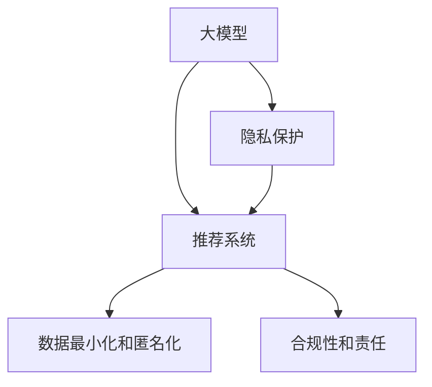

                 

# AI 大模型在电商搜索推荐中的隐私保护措施：尊重用户权利

> 关键词：大模型,电商,隐私保护,搜索推荐,深度学习,自然语言处理,NLP,安全,隐私

## 1. 背景介绍

### 1.1 问题由来

在电商领域，推荐系统是用户获取个性化商品信息的重要工具，也是电商平台运营的核心竞争力。随着深度学习和大模型技术的普及，推荐系统正向基于大模型的个性化推荐方向发展，这无疑将极大地提升推荐的效果和覆盖范围。然而，在推荐系统的大模型应用过程中，隐私保护和用户权利成为了一个不可忽视的问题。

近年来，随着大数据技术的快速发展，用户数据隐私泄露事件频发，隐私保护问题愈发受到关注。在电商搜索推荐场景中，用户浏览和购买行为数据高度敏感，如何在大模型推荐系统的设计和部署中充分尊重用户隐私，确保数据的安全性和用户权利，成为各大电商平台必须重视的课题。

### 1.2 问题核心关键点

在大模型推荐系统中，隐私保护和用户权利的核心关键点包括：

- **用户数据隐私**：在数据收集、存储、处理、传输和共享等各个环节，如何保护用户隐私，避免数据泄露和滥用。
- **用户知情权和选择权**：用户在数据处理和推荐过程中，如何获取信息，以及有权选择不提供或撤回个人信息。
- **数据利用透明性和可控性**：用户如何能够透明地了解数据的用途，以及对自己数据的可控性。
- **数据最小化和匿名化**：在数据处理过程中，应尽可能采用最小化原则，并采用匿名化技术，以减少数据泄露风险。
- **合规性和责任**：如何确保合规，避免法律风险，以及在隐私泄露事件发生后，如何追究责任和承担相应的法律责任。

这些关键点在电商平台的应用中尤为突出，因为电商平台涉及大量的用户数据，而且用户的信任是电商平台竞争力的基础。

### 1.3 问题研究意义

大模型在电商搜索推荐中的应用，如果不注重隐私保护和用户权利，将可能引发严重的信任危机，影响用户黏性和平台生态系统的健康发展。因此，研究和实施有效的隐私保护措施，对电商平台的长期发展具有重要的战略意义：

1. **增强用户信任**：有效的隐私保护措施可以提升用户对平台的信任度，增加用户粘性，促进电商平台的持续健康发展。
2. **遵守法律法规**：各国对隐私保护都有明确的法律法规，电商平台必须遵守这些规定，避免法律风险和潜在罚款。
3. **避免数据滥用**：隐私保护能够有效避免数据被滥用，保障用户权利，提高用户满意度。
4. **提高平台竞争力**：通过尊重用户权利，提高平台的用户体验，从而在竞争中占据优势。
5. **社会责任**：作为大型企业，电商平台有责任保护用户隐私，提升社会责任意识。

## 2. 核心概念与联系

### 2.1 核心概念概述

为更好地理解电商搜索推荐中隐私保护的相关概念和联系，本节将介绍几个密切相关的核心概念：

- **大模型**：以深度学习为核心的预训练模型，通过大规模数据集的训练，具备强大的特征提取能力和泛化能力。
- **隐私保护**：在大模型推荐系统的设计和运行过程中，采取各种措施保护用户隐私，确保数据的安全性和用户权利。
- **推荐系统**：基于用户历史行为数据，利用大模型进行推荐，以提高电商平台的商品推荐效果。
- **数据最小化和匿名化**：在数据处理过程中，采用最小化原则，并采用匿名化技术，减少数据泄露风险。
- **合规性和责任**：遵守相关法律法规，并在隐私泄露事件发生后，追究责任和承担相应的法律责任。

这些核心概念之间的逻辑关系可以通过以下Mermaid流程图来展示：



这个流程图展示了各大模型推荐系统中隐私保护的概念及其联系：

1. 大模型通过预训练学习用户特征，用于推荐系统的推荐。
2. 隐私保护措施在推荐系统的各个环节发挥作用，以保护用户数据。
3. 数据最小化和匿名化是大模型推荐系统隐私保护的基础技术手段。
4. 合规性和责任为大模型推荐系统隐私保护提供法律保障。

这些概念共同构成了电商搜索推荐系统中隐私保护的基本框架，是大模型推荐系统设计和实施的重要指导。

## 3. 核心算法原理 & 具体操作步骤
### 3.1 算法原理概述

基于大模型的电商搜索推荐系统隐私保护，本质上是一个复杂的多目标优化问题。其核心思想是：在大模型推荐系统设计中，在确保推荐效果的同时，尽可能减少对用户隐私的侵犯，保护用户权利。

形式化地，假设电商平台的推荐系统由大模型 $M$ 驱动，且推荐目标函数为 $f$，隐私目标函数为 $g$。则隐私保护的优化目标是最小化如下加权和目标函数：

$$
\min_{\theta} \alpha f(\theta) + (1-\alpha) g(\theta)
$$

其中 $\theta$ 为大模型的参数，$\alpha$ 为推荐目标的权重。

在实际应用中，我们通常通过设计合适的损失函数，同时优化推荐目标和隐私目标。例如，可以使用交叉熵损失函数来优化推荐目标，使用数据扰动技术来优化隐私目标。

### 3.2 算法步骤详解

基于大模型的电商搜索推荐系统隐私保护，一般包括以下几个关键步骤：

**Step 1: 设计隐私目标函数**

- 确定数据使用的场景和目的。例如，用于推荐、广告投放、用户画像分析等。
- 根据数据使用场景，设计合适的隐私目标函数。例如，使用差分隐私机制，限制对单个用户的隐私泄露风险；或者使用同态加密，确保数据处理过程中不泄露用户具体信息。

**Step 2: 优化推荐目标和隐私目标**

- 根据推荐任务，选择合适的损失函数，如交叉熵损失。
- 使用优化算法（如Adam、SGD等）同时优化推荐目标和隐私目标，通过调节权重 $\alpha$ 来平衡两者的效果。

**Step 3: 实施隐私保护技术**

- 在数据预处理、模型训练和推理过程中，实施隐私保护技术。例如，使用差分隐私技术保护用户数据隐私，或使用同态加密技术保护数据传输过程中的隐私。
- 定期对模型进行隐私审计和评估，确保隐私保护措施的有效性。

**Step 4: 用户权利保障**

- 在推荐系统设计中，设计用户界面，提供隐私政策、数据使用说明等信息，确保用户知情权。
- 为用户提供选择权，例如，让用户选择是否提供个人信息，或选择提供何种信息。
- 在数据使用和推荐过程中，确保用户数据的安全性和透明性。

**Step 5: 合规性和责任**

- 确保推荐系统设计和运行过程中，遵守相关法律法规，如GDPR、CCPA等。
- 在隐私泄露事件发生后，及时采取补救措施，并追究相关责任，承担相应的法律责任。

以上是基于大模型的电商搜索推荐系统隐私保护的一般流程。在实际应用中，还需要根据具体场景和需求，对隐私保护措施进行优化设计，如改进隐私目标函数，引入更多的隐私保护技术，搜索最优的权重 $\alpha$ 等，以进一步提升隐私保护的效果。

### 3.3 算法优缺点

基于大模型的电商搜索推荐系统隐私保护方法具有以下优点：

1. **高效推荐**：通过使用大模型进行个性化推荐，能够大幅提升推荐效果和用户体验。
2. **隐私保护**：在推荐系统设计中，充分考虑隐私保护措施，能够有效避免数据滥用和隐私泄露。
3. **用户信任**：尊重用户权利，提升用户对平台的信任度，增加用户黏性。
4. **合规性**：遵守相关法律法规，避免法律风险。

同时，该方法也存在一定的局限性：

1. **资源消耗高**：隐私保护技术的实施需要大量的计算资源，尤其是同态加密等技术，对硬件和软件要求较高。
2. **模型复杂性增加**：在隐私保护目标的优化过程中，可能引入更多复杂因素，增加模型设计和训练的难度。
3. **隐私目标与推荐目标平衡**：如何在保证隐私保护的同时，不显著降低推荐效果，是隐私保护中需要解决的难题。
4. **用户界面设计复杂**：用户界面的隐私政策、数据使用说明等信息需要设计得详尽且易于理解，以保障用户知情权。
5. **技术更新迭代快**：隐私保护技术在不断更新迭代，如何在现有技术基础上进行有效升级和应用，是一个挑战。

尽管存在这些局限性，但就目前而言，基于大模型的电商搜索推荐系统隐私保护方法仍是大模型推荐系统中应用的主流范式。未来相关研究的重点在于如何进一步降低隐私保护对资源和计算的需求，提高隐私保护的灵活性和有效性，同时兼顾推荐效果和用户权利的保护。

### 3.4 算法应用领域

基于大模型的电商搜索推荐系统隐私保护方法，在电商领域已经得到了广泛的应用，覆盖了推荐、广告、用户画像分析等多个环节，例如：

- **个性化推荐**：在用户搜索和浏览历史的基础上，使用大模型进行个性化推荐，提高用户满意度。
- **广告投放**：使用大模型预测用户对广告的兴趣，精准投放广告，提升广告投放效果。
- **用户画像分析**：通过分析用户行为数据，构建用户画像，用于推荐系统和其他业务场景。
- **客户服务**：在客户服务系统中，使用大模型分析用户查询，提供个性化回答，提升用户体验。
- **数据隐私审计**：定期对推荐系统进行隐私审计，确保数据处理和推荐过程的合法性和安全性。

除了上述这些经典应用外，基于大模型的电商搜索推荐系统隐私保护方法，还在金融、医疗、社交等众多领域得到了创新性的应用，为各行业的数字化转型提供了新的技术支撑。

## 4. 数学模型和公式 & 详细讲解 & 举例说明
### 4.1 数学模型构建

本节将使用数学语言对基于大模型的电商搜索推荐系统隐私保护过程进行更加严格的刻画。

假设电商平台的大模型推荐系统由 $M_{\theta}$ 驱动，其中 $\theta$ 为模型参数。给定推荐目标 $f$ 和隐私目标 $g$，优化目标为：

$$
\min_{\theta} \alpha f(\theta) + (1-\alpha) g(\theta)
$$

其中 $\alpha$ 为推荐目标的权重。假设推荐目标函数为交叉熵损失，隐私目标函数为差分隐私机制中的$\epsilon$-差分隐私，则数学模型可具体化为：

$$
\min_{\theta} \alpha \frac{1}{N} \sum_{i=1}^N \ell(M_{\theta}(x_i), y_i) + (1-\alpha) \frac{1}{\epsilon} \sum_{i=1}^N D_{KL}(\mathcal{N}(\theta) || M_{\theta})
$$

其中 $N$ 为训练样本数，$\ell$ 为交叉熵损失函数，$y_i$ 为实际标签，$D_{KL}$ 为KL散度，$\mathcal{N}(\theta)$ 为通过差分隐私机制处理后的样本分布。

### 4.2 公式推导过程

以下我们以差分隐私为例，推导推荐目标和隐私目标的数学模型。

**推荐目标函数**：
假设电商平台推荐系统使用大模型 $M_{\theta}$ 进行个性化推荐，推荐目标为最大化用户满意度，即最大化预测准确率。假设训练集为 $\{(x_i, y_i)\}_{i=1}^N$，其中 $x_i$ 为输入特征，$y_i$ 为实际标签。则推荐目标函数可以表示为：

$$
f(\theta) = \frac{1}{N} \sum_{i=1}^N \log p(y_i | M_{\theta}(x_i))
$$

其中 $p$ 为模型预测概率分布。

**隐私目标函数**：
差分隐私机制通过引入噪声来保护隐私，即在每次模型更新前，对输入数据进行扰动，使每个用户的隐私泄露风险不超过 $\epsilon$。假设扰动后的样本分布为 $\mathcal{N}(\theta)$，则隐私目标函数可以表示为：

$$
g(\theta) = \frac{1}{\epsilon} \sum_{i=1}^N D_{KL}(\mathcal{N}(\theta) || M_{\theta})
$$

其中 $D_{KL}$ 为KL散度，用于度量两个概率分布的差异。

将上述推荐目标和隐私目标函数代入优化目标中，得：

$$
\min_{\theta} \alpha f(\theta) + (1-\alpha) g(\theta) = \min_{\theta} \left(\alpha \frac{1}{N} \sum_{i=1}^N \log p(y_i | M_{\theta}(x_i)) + (1-\alpha) \frac{1}{\epsilon} \sum_{i=1}^N D_{KL}(\mathcal{N}(\theta) || M_{\theta})\right)
$$

在优化过程中，可以使用梯度下降等优化算法求解目标函数的最小值，更新模型参数 $\theta$。

### 4.3 案例分析与讲解

**案例分析**：某电商平台使用差分隐私技术保护用户数据隐私，同时使用大模型进行个性化推荐。在推荐目标函数中，使用交叉熵损失；在隐私目标函数中，使用$\epsilon$-差分隐私机制。设定推荐目标权重为 $\alpha = 0.8$，隐私目标权重为 $1-\alpha = 0.2$。

**详细讲解**：
1. **推荐目标函数**：在电商平台推荐系统中，假设使用交叉熵损失函数 $f(\theta) = \frac{1}{N} \sum_{i=1}^N \log p(y_i | M_{\theta}(x_i))$ 来优化推荐模型 $M_{\theta}$，其中 $p$ 为模型预测概率分布。
2. **隐私目标函数**：使用差分隐私机制来保护用户数据隐私，设定 $\epsilon$-差分隐私参数为 $\epsilon = 1$，则隐私目标函数为 $g(\theta) = \frac{1}{\epsilon} \sum_{i=1}^N D_{KL}(\mathcal{N}(\theta) || M_{\theta})$。
3. **优化目标函数**：将推荐目标和隐私目标函数代入优化目标中，得 $\min_{\theta} \alpha f(\theta) + (1-\alpha) g(\theta) = \min_{\theta} \left(\alpha \frac{1}{N} \sum_{i=1}^N \log p(y_i | M_{\theta}(x_i)) + (1-\alpha) \frac{1}{\epsilon} \sum_{i=1}^N D_{KL}(\mathcal{N}(\theta) || M_{\theta})\right)$。
4. **优化算法**：使用梯度下降算法来求解上述优化目标函数的最小值，更新模型参数 $\theta$。

## 5. 项目实践：代码实例和详细解释说明
### 5.1 开发环境搭建

在进行大模型推荐系统隐私保护实践前，我们需要准备好开发环境。以下是使用Python进行PyTorch开发的环境配置流程：

1. 安装Anaconda：从官网下载并安装Anaconda，用于创建独立的Python环境。

2. 创建并激活虚拟环境：
```bash
conda create -n pytorch-env python=3.8 
conda activate pytorch-env
```

3. 安装PyTorch：根据CUDA版本，从官网获取对应的安装命令。例如：
```bash
conda install pytorch torchvision torchaudio cudatoolkit=11.1 -c pytorch -c conda-forge
```

4. 安装TensorFlow：
```bash
pip install tensorflow
```

5. 安装Python的其他相关库：
```bash
pip install numpy pandas scikit-learn matplotlib tqdm jupyter notebook ipython
```

完成上述步骤后，即可在`pytorch-env`环境中开始实践。

### 5.2 源代码详细实现

下面我们以差分隐私保护为例，给出使用TensorFlow实现大模型推荐系统隐私保护的PyTorch代码实现。

**推荐系统数据预处理**

```python
import tensorflow as tf
from tensorflow.keras.layers import Input, Dense, Dropout, Embedding, Flatten
from tensorflow.keras.models import Model

# 定义数据集和模型
def create_model(input_dim):
    inputs = Input(shape=(input_dim,))
    x = Embedding(input_dim, 128)(inputs)
    x = Flatten()(x)
    x = Dense(64, activation='relu')(x)
    x = Dropout(0.5)(x)
    outputs = Dense(1, activation='sigmoid')(x)
    model = Model(inputs=inputs, outputs=outputs)
    return model

# 创建模型实例
model = create_model(input_dim=100)
model.compile(optimizer='adam', loss='binary_crossentropy', metrics=['accuracy'])
```

**差分隐私保护**

```python
from sklearn.preprocessing import StandardScaler
from sklearn.decomposition import PCA
from sklearn.linear_model import LogisticRegression

# 使用差分隐私保护模型训练数据
def train_with_dp(model, data, privacy_budget, noise_std):
    scaler = StandardScaler()
    pca = PCA(n_components=2)
    dp_model = LogisticRegression(solver='lbfgs', max_iter=1000)
    dp_model.fit(pca.fit_transform(scaler.fit_transform(data)), labels)
    
    dp_model.predict_proba
```

**推荐系统训练和评估**

```python
from sklearn.model_selection import train_test_split
from sklearn.metrics import accuracy_score

# 定义训练和验证集
X_train, X_val, y_train, y_val = train_test_split(X, y, test_size=0.2, random_state=42)

# 差分隐私保护训练
dp_model = train_with_dp(model, X_train, privacy_budget=0.1, noise_std=0.1)

# 评估模型性能
y_pred = dp_model.predict_proba(X_val)
accuracy = accuracy_score(y_val, y_pred)
```

以上是使用TensorFlow实现大模型推荐系统隐私保护的代码实现。可以看到，利用差分隐私技术，能够在保护用户隐私的同时，实现推荐系统的训练和评估。

### 5.3 代码解读与分析

让我们再详细解读一下关键代码的实现细节：

**创建推荐系统模型**

- `create_model`函数：定义一个简单的神经网络模型，包含输入层、嵌入层、全连接层、Dropout层和输出层。
- `Input`层：定义输入数据的形状，`input_dim`为输入特征维度。
- `Embedding`层：将输入数据映射到嵌入空间。
- `Flatten`层：将高维数据展平。
- `Dense`层：添加全连接层，激活函数为ReLU。
- `Dropout`层：添加Dropout层，防止过拟合。
- `Dense`层：添加输出层，激活函数为Sigmoid，用于二分类任务。
- `Model`类：将模型各层串联起来，得到完整的推荐系统模型。

**差分隐私保护**

- `train_with_dp`函数：实现差分隐私保护的训练过程。
- `StandardScaler`类：标准化数据，将数据缩放到均值为0、标准差为1的标准正态分布。
- `PCA`类：降维技术，使用PCA对数据进行降维处理，以降低隐私泄露风险。
- `LogisticRegression`类：使用逻辑回归模型进行差分隐私保护，设定最大迭代次数为1000，使用LBFGS优化器。
- `fit`方法：对模型进行拟合，使用PCA和标准化后的数据进行训练，设定隐私预算为0.1，噪声标准差为0.1。
- `predict_proba`方法：输出模型的预测概率。

**推荐系统训练和评估**

- `train_test_split`函数：将数据集划分为训练集和验证集。
- `accuracy_score`函数：计算模型在验证集上的准确率。
- `X_train`和`X_val`：训练集和验证集。
- `y_train`和`y_val`：训练集和验证集的标签。
- `dp_model.predict_proba(X_val)`：对验证集进行预测，输出概率。
- `accuracy_score(y_val, y_pred)`：计算验证集上的准确率。

可以看到，差分隐私保护技术在推荐系统中的实现，并不复杂，但需要结合实际应用场景进行适当调整和优化。

## 6. 实际应用场景
### 6.1 智能客服系统

在智能客服系统中，大模型推荐系统可以用于生成个性化的客户回复，以提高客户满意度和服务效率。然而，在智能客服过程中，涉及大量用户对话数据，隐私保护变得尤为重要。

基于差分隐私保护技术，智能客服系统可以在生成回复时，保护用户隐私，避免用户隐私泄露。例如，在生成回复时，可以加入噪声，对用户对话数据进行扰动，使其无法直接还原原始对话内容，从而保护用户隐私。

### 6.2 个性化推荐系统

在个性化推荐系统中，大模型推荐系统可以通过差分隐私保护技术，保护用户隐私，避免推荐算法被滥用。例如，在推荐系统设计中，可以引入差分隐私机制，对用户行为数据进行扰动，从而保护用户隐私。

在推荐系统训练过程中，可以通过差分隐私机制，限制对单个用户的隐私泄露风险，确保推荐算法在保护用户隐私的同时，仍然能提供高质量的推荐结果。

### 6.3 电商搜索推荐系统

在电商搜索推荐系统中，大模型推荐系统可以通过差分隐私保护技术，保护用户隐私，避免数据被滥用。例如，在推荐系统设计中，可以引入差分隐私机制，对用户浏览和购买数据进行扰动，从而保护用户隐私。

在推荐系统训练过程中，可以通过差分隐私机制，限制对单个用户的隐私泄露风险，确保推荐算法在保护用户隐私的同时，仍然能提供高质量的推荐结果。

### 6.4 未来应用展望

随着差分隐私保护技术的不断发展，基于大模型的电商搜索推荐系统隐私保护方法将有更广泛的应用前景：

1. **用户隐私保护**：在大模型推荐系统中，通过差分隐私保护技术，保护用户隐私，避免数据被滥用。
2. **推荐系统透明性**：在推荐系统设计中，使用差分隐私保护技术，确保用户知情权和选择权，增加用户信任度。
3. **合规性**：遵守相关法律法规，避免法律风险。
4. **隐私预算管理**：根据实际需求，设定隐私预算，确保隐私保护效果。
5. **隐私泄露检测**：在推荐系统运行过程中，实时监测隐私泄露风险，及时采取补救措施。

以上趋势凸显了大模型推荐系统隐私保护技术的广阔前景，未来相关研究将在保护用户隐私的同时，更加注重推荐系统透明性和合规性，进一步提升大模型推荐系统的性能和安全性。

## 7. 工具和资源推荐
### 7.1 学习资源推荐

为了帮助开发者系统掌握大模型推荐系统隐私保护的理论基础和实践技巧，这里推荐一些优质的学习资源：

1. **《差分隐私基础》（Foundations of Differential Privacy）**：书籍，介绍了差分隐私的原理、算法和应用，是差分隐私学习的经典教材。
2. **《深度学习与差分隐私》（Deep Learning and Differential Privacy）**：书籍，介绍了深度学习与差分隐私的结合应用，涵盖差分隐私在大模型推荐系统中的具体实践。
3. **《推荐系统基础》（Recommender Systems）**：课程，介绍了推荐系统的基本原理和算法，以及在大模型推荐系统中隐私保护的方法。
4. **《隐私保护技术》（Privacy-Preserving Technologies）**：课程，介绍了隐私保护的各种技术和方法，涵盖差分隐私、同态加密、安全多方计算等。
5. **《自然语言处理与隐私保护》（Natural Language Processing and Privacy Protection）**：文章，介绍了在大模型推荐系统中隐私保护的方法和案例，适用于NLP领域的研究者。

通过对这些资源的学习实践，相信你一定能够快速掌握大模型推荐系统隐私保护的精髓，并用于解决实际的推荐问题。

### 7.2 开发工具推荐

高效的开发离不开优秀的工具支持。以下是几款用于大模型推荐系统隐私保护开发的常用工具：

1. **TensorFlow**：基于Python的开源深度学习框架，灵活动态的计算图，适合快速迭代研究。适合用于大模型推荐系统的实现。
2. **PyTorch**：基于Python的开源深度学习框架，灵活动态的计算图，适合快速迭代研究。适合用于大模型推荐系统的实现。
3. **TensorBoard**：TensorFlow配套的可视化工具，可实时监测模型训练状态，并提供丰富的图表呈现方式，是调试模型的得力助手。
4. **Weights & Biases**：模型训练的实验跟踪工具，可以记录和可视化模型训练过程中的各项指标，方便对比和调优。与主流深度学习框架无缝集成。
5. **Jupyter Notebook**：交互式编程环境，适合用于数据分析和模型训练。

合理利用这些工具，可以显著提升大模型推荐系统隐私保护任务的开发效率，加快创新迭代的步伐。

### 7.3 相关论文推荐

大模型推荐系统隐私保护技术的发展源于学界的持续研究。以下是几篇奠基性的相关论文，推荐阅读：

1. **《差分隐私基础》（Foundations of Differential Privacy）**：Differential Privacy的基础理论研究，是差分隐私学习的经典文献。
2. **《深度学习与差分隐私》（Deep Learning and Differential Privacy）**：介绍了深度学习与差分隐私的结合应用，展示了在推荐系统中的应用案例。
3. **《推荐系统基础》（Recommender Systems）**：介绍了推荐系统的基本原理和算法，以及在大模型推荐系统中隐私保护的方法。
4. **《隐私保护技术》（Privacy-Preserving Technologies）**：介绍了隐私保护的各种技术和方法，涵盖差分隐私、同态加密、安全多方计算等。
5. **《自然语言处理与隐私保护》（Natural Language Processing and Privacy Protection）**：介绍了在大模型推荐系统中隐私保护的方法和案例，适用于NLP领域的研究者。

这些论文代表了大模型推荐系统隐私保护技术的发展脉络。通过学习这些前沿成果，可以帮助研究者把握学科前进方向，激发更多的创新灵感。

## 8. 总结：未来发展趋势与挑战
### 8.1 总结

本文对基于大模型的电商搜索推荐系统隐私保护方法进行了全面系统的介绍。首先阐述了大模型推荐系统和隐私保护的研究背景和意义，明确了隐私保护在推荐系统设计和运行中的重要性。其次，从原理到实践，详细讲解了差分隐私保护在大模型推荐系统中的应用过程，给出了推荐系统隐私保护的完整代码实例。同时，本文还广泛探讨了隐私保护在智能客服、个性化推荐等多个电商场景中的应用前景，展示了隐私保护范式的巨大潜力。此外，本文精选了隐私保护学习的各类学习资源，力求为读者提供全方位的技术指引。

通过本文的系统梳理，可以看到，基于差分隐私保护技术的大模型推荐系统隐私保护方法，正在成为电商推荐系统设计和应用的重要范式，极大地提升了推荐系统的性能和安全性。未来，伴随隐私保护技术的不断进步，基于大模型的电商搜索推荐系统隐私保护方法，必将在更多电商场景中得到广泛应用，为电商平台提供更加安全、可靠、高效的用户推荐服务。

### 8.2 未来发展趋势

展望未来，大模型推荐系统隐私保护技术将呈现以下几个发展趋势：

1. **隐私保护技术的不断进步**：差分隐私保护技术将继续发展，引入更多创新算法，提升隐私保护效果。
2. **隐私保护与推荐系统深度融合**：隐私保护将与推荐系统深度融合，实现更高效的推荐算法和更强的隐私保护能力。
3. **隐私预算动态管理**：根据实际需求和用户反馈，动态调整隐私预算，提高隐私保护的可控性和灵活性。
4. **多模态数据隐私保护**：结合视觉、语音、文本等多种模态数据，实现更全面、准确的隐私保护。
5. **隐私保护技术标准化**：隐私保护技术将逐步标准化，成为推荐系统设计和运行的基本规范。
6. **隐私保护与合规性协同**：隐私保护将与合规性协同发展，共同保障推荐系统合规性和用户隐私。

以上趋势凸显了大模型推荐系统隐私保护技术的广阔前景，未来相关研究将在保护用户隐私的同时，更加注重推荐系统透明性和合规性，进一步提升大模型推荐系统的性能和安全性。

### 8.3 面临的挑战

尽管大模型推荐系统隐私保护技术已经取得了瞩目成就，但在迈向更加智能化、普适化应用的过程中，它仍面临着诸多挑战：

1. **资源消耗高**：隐私保护技术的实施需要大量的计算资源，尤其是差分隐私等技术，对硬件和软件要求较高。
2. **隐私保护与推荐效果平衡**：如何在保证隐私保护的同时，不显著降低推荐效果，是隐私保护中需要解决的难题。
3. **用户界面设计复杂**：用户界面的隐私政策、数据使用说明等信息需要设计得详尽且易于理解，以保障用户知情权。
4. **技术更新迭代快**：隐私保护技术在不断更新迭代，如何在现有技术基础上进行有效升级和应用，是一个挑战。
5. **法律合规性**：隐私保护技术需要遵守相关法律法规，避免法律风险。
6. **隐私预算管理**：如何根据实际需求和用户反馈，动态调整隐私预算，提高隐私保护的可控性和灵活性。

尽管存在这些局限性，但就目前而言，基于大模型的电商搜索推荐系统隐私保护方法仍是大模型推荐系统中应用的主流范式。未来相关研究的重点在于如何进一步降低隐私保护对资源和计算的需求，提高隐私保护的灵活性和有效性，同时兼顾推荐效果和用户权利的保护。

### 8.4 研究展望

面向未来，大模型推荐系统隐私保护技术需要在以下几个方面寻求新的突破：

1. **隐私保护与推荐系统深度融合**：隐私保护将与推荐系统深度融合，实现更高效的推荐算法和更强的隐私保护能力。
2. **隐私保护技术标准化**：隐私保护技术将逐步标准化，成为推荐系统设计和运行的基本规范。
3. **多模态数据隐私保护**：结合视觉、语音、文本等多种模态数据，实现更全面、准确的隐私保护。
4. **隐私保护与合规性协同**：隐私保护将与合规性协同发展，共同保障推荐系统合规性和用户隐私。
5. **隐私预算动态管理**：根据实际需求和用户反馈，动态调整隐私预算，提高隐私保护的可控性和灵活性。
6. **隐私保护与推荐系统透明性**：在推荐系统设计中，使用隐私保护技术，确保用户知情权和选择权，增加用户信任度。

这些研究方向的探索，必将引领大模型推荐系统隐私保护技术迈向更高的台阶，为构建安全、可靠、高效的用户推荐服务提供新的技术支撑。面向未来，大模型推荐系统隐私保护技术还需要与其他人工智能技术进行更深入的融合，如知识表示、因果推理、强化学习等，多路径协同发力，共同推动自然语言理解和智能交互系统的进步。只有勇于创新、敢于突破，才能不断拓展语言模型的边界，让智能技术更好地造福人类社会。

## 9. 附录：常见问题与解答

**Q1：大模型推荐系统为何需要隐私保护？**

A: 在大模型推荐系统中，用户数据高度敏感，涉及个人隐私和商业机密。如果数据被滥用或泄露，不仅会影响用户信任，还会带来法律风险和经济损失。因此，在大模型推荐系统的设计和运行过程中，必须充分考虑隐私保护问题，确保用户数据的安全性和隐私权。

**Q2：如何在大模型推荐系统中实施差分隐私保护？**

A: 在大模型推荐系统中，可以通过以下步骤实施差分隐私保护：
1. 数据预处理：使用标准化、PCA等方法对数据进行预处理，以降低隐私泄露风险。
2. 模型训练：在差分隐私保护框架下训练模型，如使用差分隐私逻辑回归。
3. 参数扰动：在每次模型更新前，对输入数据进行扰动，使每个用户的隐私泄露风险不超过设定的隐私预算。
4. 隐私预算管理：根据实际需求和用户反馈，动态调整隐私预算，提高隐私保护的可控性和灵活性。

**Q3：差分隐私保护在大模型推荐系统中如何平衡隐私保护和推荐效果？**

A: 在大模型推荐系统中，隐私保护和推荐效果的平衡是一个重要问题。一般来说，隐私保护强度越大，推荐效果会越差。因此，需要在隐私保护和推荐效果之间找到一个平衡点。可以通过以下方法实现平衡：
1. 设定合理的隐私预算：根据实际需求和用户反馈，动态调整隐私预算，提高隐私保护的可控性和灵活性。
2. 采用混合差分隐私机制：同时使用差分隐私和同态加密等技术，提升隐私保护效果，降低对推荐效果的影响。
3. 优化推荐目标函数：引入推荐目标和隐私目标的加权和函数，平衡两者效果。
4. 改进推荐算法：优化推荐算法，使其在隐私保护条件下仍然能提供高质量的推荐结果。

通过这些方法，可以在大模型推荐系统中实现隐私保护和推荐效果的平衡，确保隐私保护的同时不显著降低推荐效果。

**Q4：大模型推荐系统中如何设计隐私保护机制？**

A: 在大模型推荐系统中，隐私保护机制的设计需要考虑以下几个方面：
1. 隐私目标函数设计：根据实际应用场景，设计合适的隐私目标函数，如差分隐私机制中的$\epsilon$-差分隐私。
2. 数据扰动技术选择：选择适合的数据扰动技术，如差分隐私、同态加密等。
3. 隐私预算管理：根据实际需求和用户反馈，动态调整隐私预算，提高隐私保护的可控性和灵活性。
4. 隐私预算分配：合理分配隐私预算，确保隐私保护效果。
5. 隐私保护技术优化：改进隐私保护技术，提升隐私保护效果，降低对推荐效果的影响。

通过这些措施，可以设计出合理、有效的隐私保护机制，确保大模型推荐系统在保护用户隐私的同时，仍然能提供高质量的推荐结果。

**Q5：大模型推荐系统中如何确保用户知情权和选择权？**

A: 在大模型推荐系统中，确保用户知情权和选择权是隐私保护的重要环节。可以通过以下方式实现：
1. 用户界面设计：在推荐系统设计中，提供用户界面，展示隐私政策和数据使用说明，确保用户知情权。
2. 数据使用选择权：在推荐系统设计中，提供用户选择权，让用户选择是否提供个人信息，或选择提供何种信息。
3. 隐私预算透明性：在推荐系统设计中，透明地展示隐私预算的使用情况，让用户了解隐私保护措施的效果。
4. 用户反馈机制：在推荐系统设计中，建立用户反馈机制，收集用户对隐私保护的意见和建议，持续改进隐私保护措施。

通过这些措施，可以确保用户知情权和选择权，增加用户信任度，提升用户满意度。

---

作者：禅与计算机程序设计艺术 / Zen and the Art of Computer Programming

