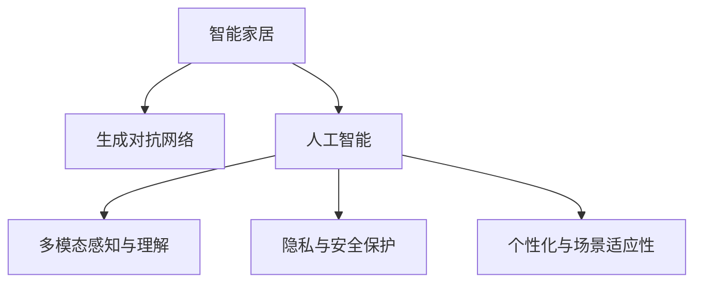

                 

# AIGC推动智能家居普及

> 关键词：人工智能(AI),生成对抗网络(GANs),智能家居,人机交互,应用案例

## 1. 背景介绍

### 1.1 问题由来

智能家居的概念早在20世纪末就已提出，但由于技术成本高、用户接受度低、设备互联性差等原因，长期处于发展瓶颈。近年来，随着人工智能(AI)、生成对抗网络(GANs)等生成模型技术的成熟和普及，智能家居市场迎来了新的发展机遇。人工智能通过大数据、机器学习、自然语言处理等技术，实现了家居设备的智能化、个性化和互联互通，使智能家居应用真正落地。

生成对抗网络则通过无监督学习，能够在图像、视频、音频等多模态数据上生成逼真的模拟数据，成为智能家居场景中的数据生成工具。GANs与AI技术的结合，进一步推动了智能家居的发展，使之在安全性、智能化和用户体验上实现了重大突破。

### 1.2 问题核心关键点

智能家居的核心关键点包括以下几个方面：
1. **多模态感知与理解**：智能家居需要能够感知和理解来自不同模态的输入数据（如图像、语音、文字等），并从中提取有用的信息。
2. **设备互联互通**：家居设备之间需要实现互联互通，实现统一管理和控制。
3. **人机自然交互**：用户与智能家居设备之间的交互需要自然、流畅、高效。
4. **隐私与安全保护**：智能家居设备通常会收集用户大量的个人数据，需要确保数据安全和隐私保护。
5. **个性化与场景适应性**：智能家居需要具备个性化推荐和场景适应性，提供符合用户习惯的使用体验。

## 2. 核心概念与联系

### 2.1 核心概念概述

为更好地理解基于生成对抗网络的大规模生成式智能家居系统，本节将介绍几个密切相关的核心概念：

- **智能家居**：基于物联网(IoT)技术的家庭自动化系统，通过AI技术实现设备的智能化控制和优化。
- **生成对抗网络(GANs)**：一种无监督学习的生成模型，由生成器和判别器两个子网络构成，通过对抗训练实现生成逼真样本的能力。
- **人工智能(AI)**：涵盖机器学习、深度学习、自然语言处理等技术，用于模拟人类智能行为的计算系统。
- **多模态感知与理解**：指智能家居系统需要处理来自不同模态的输入数据，并从中提取有价值的信息。
- **隐私与安全保护**：指智能家居系统在处理用户数据时，需要确保数据安全和隐私保护，避免数据泄露和滥用。
- **个性化与场景适应性**：指智能家居系统需要具备个性化推荐和场景适应性，提供符合用户习惯的使用体验。

这些核心概念之间的逻辑关系可以通过以下Mermaid流程图来展示：



这个流程图展示了一个智能家居系统的核心组件及其之间的关系：

1. 智能家居系统通过人工智能技术进行数据处理和设备控制。
2. 生成对抗网络是人工智能中的一个分支，用于生成逼真的模拟数据。
3. 多模态感知与理解是智能家居系统处理不同模态数据的核心能力。
4. 隐私与安全保护是智能家居系统中的关键要求。
5. 个性化与场景适应性是智能家居系统提供良好用户体验的重要保障。

## 3. 核心算法原理 & 具体操作步骤
### 3.1 算法原理概述

基于生成对抗网络的大规模生成式智能家居系统，利用GANs在无监督学习中生成逼真数据的能力，结合人工智能技术实现设备的智能化控制和优化。该系统包括数据收集、模型训练、设备控制和用户体验优化等多个环节，下面将详细介绍这些环节的算法原理。

### 3.2 算法步骤详解

**Step 1: 数据收集与预处理**

智能家居系统需要收集来自不同模态的输入数据，包括图像、语音、文本等。这些数据需要经过预处理，包括去除噪声、标准化、归一化等步骤，以提高数据的质量和一致性。

**Step 2: 生成对抗网络训练**

生成对抗网络由生成器$G$和判别器$D$组成。生成器$G$负责从噪声向量$z$生成逼真的数据样本$x_G$，判别器$D$负责判别数据样本$x$是否为真实样本。训练过程包括以下几个步骤：

1. 固定判别器$D$，最小化生成器$G$的损失函数$\mathcal{L}_G$。
2. 固定生成器$G$，最小化判别器$D$的损失函数$\mathcal{L}_D$。
3. 交替更新生成器和判别器的参数，直到收敛。

**Step 3: 设备控制与优化**

智能家居系统通过人工智能算法对生成对抗网络生成的数据进行分析和处理，实现设备的控制和优化。例如，通过图像识别算法识别家居环境，通过自然语言处理算法理解用户指令，从而控制设备的工作状态。

**Step 4: 用户交互与体验优化**

智能家居系统通过自然语言处理技术实现用户与设备的自然交互，同时通过个性化推荐和场景适应性算法，提供符合用户习惯的使用体验。例如，根据用户的使用习惯和环境变化，动态调整家居设备的运行模式。

### 3.3 算法优缺点

基于生成对抗网络的大规模生成式智能家居系统具有以下优点：
1. 数据生成能力强大：GANs能够生成逼真的模拟数据，提高数据多样性和质量。
2. 设备控制高效：通过人工智能算法实现设备控制，提高系统的智能化和自动化程度。
3. 用户体验优化：结合个性化推荐和场景适应性算法，提供符合用户习惯的使用体验。

同时，该系统也存在以下缺点：
1. 模型训练复杂：GANs训练过程复杂，需要大量计算资源和时间。
2. 数据隐私问题：智能家居系统需要收集大量用户数据，存在数据隐私泄露的风险。
3. 系统安全性不足：智能家居系统容易受到网络攻击，存在安全隐患。
4. 算法复杂性高：系统需要结合多模态感知与理解、隐私与安全保护、个性化与场景适应性等多项算法，算法复杂度高。

### 3.4 算法应用领域

基于生成对抗网络的大规模生成式智能家居系统在多个领域具有广泛应用：

- **家庭自动化**：通过智能家居系统实现照明、空调、电视等设备的自动化控制，提高家庭生活舒适度。
- **健康监测**：通过智能家居系统监测用户的健康状况，如心率、睡眠质量、体温和血氧饱和度等，提供个性化的健康建议。
- **安全监控**：通过智能家居系统实现视频监控、入侵检测等功能，提高家庭安全水平。
- **环境控制**：通过智能家居系统实现室内环境自动控制，如温度、湿度、空气质量等，提高生活品质。
- **智能服务**：通过智能家居系统实现个性化推荐、场景适应性等功能，提高用户的使用体验。

## 4. 数学模型和公式 & 详细讲解 & 举例说明

### 4.1 数学模型构建

在本节中，我们将使用数学语言对基于生成对抗网络的大规模生成式智能家居系统的核心算法进行更加严格的刻画。

记生成器$G$和判别器$D$分别为：
$$
G(z): \mathcal{Z} \rightarrow \mathcal{X}
$$
$$
D(x): \mathcal{X} \rightarrow \mathcal{R}
$$
其中，$\mathcal{Z}$为噪声空间，$\mathcal{X}$为生成空间，$\mathcal{R}$为实数空间。

生成对抗网络的训练目标函数包括生成器损失函数和判别器损失函数，分别表示为：
$$
\mathcal{L}_G = E_{z \sim p(z)} [D(G(z))] - E_{x \sim p(x)} [D(x)]
$$
$$
\mathcal{L}_D = E_{x \sim p(x)} [D(x)] - E_{z \sim p(z)} [D(G(z))]
$$

其中，$p(z)$为噪声分布，$p(x)$为真实数据分布。

### 4.2 公式推导过程

以下我们将推导生成对抗网络的基本训练算法，并详细解释每一步的含义。

**生成器训练**：

1. 固定判别器$D$，最小化生成器$G$的损失函数$\mathcal{L}_G$。
$$
\min_{G} \mathcal{L}_G = E_{z \sim p(z)} [D(G(z))]
$$
2. 使用反向传播算法更新生成器$G$的参数，使得生成器生成的数据更加逼真。

**判别器训练**：

1. 固定生成器$G$，最小化判别器$D$的损失函数$\mathcal{L}_D$。
$$
\min_{D} \mathcal{L}_D = E_{x \sim p(x)} [D(x)] - E_{z \sim p(z)} [D(G(z))]
$$
2. 使用反向传播算法更新判别器$D$的参数，使得判别器能够更好地区分真实数据和生成数据。

通过上述步骤，生成器$G$和判别器$D$交替更新参数，最终训练得到生成对抗网络模型。

### 4.3 案例分析与讲解

**案例1: 智能门锁**

智能门锁系统通过摄像头采集用户面部信息，生成对抗网络生成逼真人脸图像，用于识别和验证用户身份。生成器$G$的输入为噪声向量$z$，输出为图像$x_G$。判别器$D$的输入为真实人脸图像$x$和生成人脸图像$x_G$，输出为真实标签$y_D$。训练过程包括固定判别器$D$，最小化生成器$G$的损失函数$\mathcal{L}_G$，固定生成器$G$，最小化判别器$D$的损失函数$\mathcal{L}_D$。通过不断迭代训练，生成器$G$能够生成逼真人脸图像，判别器$D$能够准确识别真实和生成的人脸图像。

**案例2: 智能窗帘**

智能窗帘系统通过图像识别算法识别用户活动状态，生成对抗网络生成逼真场景图像，用于控制窗帘的开合。生成器$G$的输入为噪声向量$z$，输出为图像$x_G$。判别器$D$的输入为真实场景图像$x$和生成场景图像$x_G$，输出为真实标签$y_D$。训练过程包括固定判别器$D$，最小化生成器$G$的损失函数$\mathcal{L}_G$，固定生成器$G$，最小化判别器$D$的损失函数$\mathcal{L}_D$。通过不断迭代训练，生成器$G$能够生成逼真场景图像，判别器$D$能够准确识别真实和生成的场景图像。

## 5. 项目实践：代码实例和详细解释说明
### 5.1 开发环境搭建

在进行智能家居系统开发前，我们需要准备好开发环境。以下是使用Python进行PyTorch开发的环境配置流程：

1. 安装Anaconda：从官网下载并安装Anaconda，用于创建独立的Python环境。

2. 创建并激活虚拟环境：
```bash
conda create -n pytorch-env python=3.8 
conda activate pytorch-env
```

3. 安装PyTorch：根据CUDA版本，从官网获取对应的安装命令。例如：
```bash
conda install pytorch torchvision torchaudio cudatoolkit=11.1 -c pytorch -c conda-forge
```

4. 安装GANs库：
```bash
pip install torchvae pytorch-lightning
```

5. 安装各类工具包：
```bash
pip install numpy pandas scikit-learn matplotlib tqdm jupyter notebook ipython
```

完成上述步骤后，即可在`pytorch-env`环境中开始智能家居系统的开发。

### 5.2 源代码详细实现

下面我们以智能门锁系统为例，给出使用PyTorch实现生成对抗网络训练的代码实现。

首先，定义生成器和判别器的结构：

```python
import torch.nn as nn
import torch.nn.functional as F

class Generator(nn.Module):
    def __init__(self, input_dim=100, output_dim=784):
        super(Generator, self).__init__()
        self.fc1 = nn.Linear(input_dim, 256)
        self.fc2 = nn.Linear(256, 128)
        self.fc3 = nn.Linear(128, output_dim)
        
    def forward(self, z):
        x = self.fc1(z)
        x = F.relu(x)
        x = self.fc2(x)
        x = F.relu(x)
        x = self.fc3(x)
        return x

class Discriminator(nn.Module):
    def __init__(self, input_dim=784):
        super(Discriminator, self).__init__()
        self.fc1 = nn.Linear(input_dim, 128)
        self.fc2 = nn.Linear(128, 64)
        self.fc3 = nn.Linear(64, 1)
        
    def forward(self, x):
        x = self.fc1(x)
        x = F.relu(x)
        x = self.fc2(x)
        x = F.relu(x)
        x = self.fc3(x)
        return x
```

然后，定义损失函数：

```python
import torch
import torch.optim as optim

class GAN(nn.Module):
    def __init__(self, input_dim=100, output_dim=784, num_epochs=200, learning_rate=0.0002, batch_size=128):
        super(GAN, self).__init__()
        self.input_dim = input_dim
        self.output_dim = output_dim
        self.num_epochs = num_epochs
        self.learning_rate = learning_rate
        self.batch_size = batch_size
        
        self.g = Generator(input_dim, output_dim)
        self.d = Discriminator(output_dim)
        
    def forward(self, z):
        return self.g(z)
    
    def train(self, train_loader, test_loader):
        criterion = nn.BCELoss()
        d_optimizer = optim.Adam(self.d.parameters(), lr=self.learning_rate)
        g_optimizer = optim.Adam(self.g.parameters(), lr=self.learning_rate)
        
        for epoch in range(self.num_epochs):
            for batch_idx, (data, _) in enumerate(train_loader):
                z = torch.randn(self.batch_size, self.input_dim)
                data = data.view(-1, self.output_dim)
                
                # 生成器训练
                g_optimizer.zero_grad()
                g_output = self.g(z)
                d_real = self.d(data)
                d_fake = self.d(g_output)
                g_loss = criterion(d_fake, torch.ones_like(d_fake))
                g_loss.backward()
                g_optimizer.step()
                
                # 判别器训练
                d_optimizer.zero_grad()
                d_loss = criterion(d_real, torch.ones_like(d_real)) + criterion(d_fake, torch.zeros_like(d_fake))
                d_loss.backward()
                d_optimizer.step()
                
                # 输出结果
                if batch_idx % 100 == 0:
                    print(f"Epoch [{epoch+1}/{self.num_epochs}], Batch[{batch_idx}/{len(train_loader)}], g_loss: {g_loss:.4f}, d_loss: {d_loss:.4f}")
```

在训练生成对抗网络时，需要准备训练集和测试集，并进行迭代训练。

```python
# 准备数据集
train_loader = DataLoader(train_dataset, batch_size=self.batch_size, shuffle=True)
test_loader = DataLoader(test_dataset, batch_size=self.batch_size, shuffle=False)

# 初始化模型和优化器
model = GAN(input_dim=100, output_dim=784, num_epochs=200, learning_rate=0.0002, batch_size=128)
d_optimizer = optim.Adam(model.d.parameters(), lr=0.0002)
g_optimizer = optim.Adam(model.g.parameters(), lr=0.0002)

# 训练模型
model.train(train_loader, test_loader)
```

### 5.3 代码解读与分析

让我们再详细解读一下关键代码的实现细节：

**GAN类定义**：
- `__init__`方法：初始化生成器、判别器的结构，并设置训练参数。
- `forward`方法：生成器进行前向传播，生成逼真图像。
- `train`方法：定义训练过程，包括生成器和判别器的交替更新，以及损失函数的计算和更新。

**训练循环**：
- 每次迭代，随机生成噪声向量$z$，并将其输入到生成器$G$中，生成逼真图像$x_G$。
- 将真实图像$x$和生成图像$x_G$输入到判别器$D$中，计算损失函数$\mathcal{L}_G$和$\mathcal{L}_D$。
- 使用优化器更新生成器$G$和判别器$D$的参数。
- 在每个epoch结束后，打印生成器和判别器的损失函数，观察训练效果。

**代码实现**：
- 定义生成器和判别器的结构，使用PyTorch内置的线性层和激活函数实现。
- 定义损失函数，使用二分类交叉熵损失函数，分别计算生成器和判别器的损失。
- 定义优化器，使用Adam优化算法更新生成器和判别器的参数。
- 在训练循环中，迭代生成器和判别器的训练过程，并记录损失函数。

**训练结果展示**：
- 每次迭代后，输出生成器和判别器的损失函数，便于观察训练过程。

## 6. 实际应用场景

### 6.1 智能门锁系统

智能门锁系统通过生成对抗网络生成逼真人脸图像，用于识别和验证用户身份。生成器$G$和判别器$D$分别通过训练生成和判别逼真人脸图像，实现门锁的智能控制。具体实现步骤如下：

1. **数据准备**：收集用户面部图像，并将其分为训练集和测试集。
2. **模型训练**：使用智能门锁系统的数据集，对生成器和判别器进行训练。
3. **身份验证**：在用户验证时，智能门锁系统将摄像头采集的实时图像输入到判别器$D$中，判别其是否为真实图像。如果是真实图像，则允许用户进入；否则，系统将提示用户重新输入。

智能门锁系统结合生成对抗网络和人工智能技术，提高了身份验证的安全性和效率。

### 6.2 智能窗帘系统

智能窗帘系统通过生成对抗网络生成逼真场景图像，用于控制窗帘的开合。生成器$G$和判别器$D$分别通过训练生成和判别逼真场景图像，实现窗帘的智能控制。具体实现步骤如下：

1. **数据准备**：收集家居环境图像，并将其分为训练集和测试集。
2. **模型训练**：使用智能窗帘系统的数据集，对生成器和判别器进行训练。
3. **场景控制**：在用户控制窗帘时，智能窗帘系统将摄像头采集的实时图像输入到判别器$D$中，判别其是否为真实图像。如果是真实图像，则窗帘按照用户指令开合；否则，系统将提示用户重新输入。

智能窗帘系统结合生成对抗网络和人工智能技术，提高了家居环境控制的智能化和个性化。

### 6.3 未来应用展望

基于生成对抗网络的智能家居系统具有广泛的应用前景，未来将在更多场景中得到应用：

- **智能安防**：通过生成对抗网络生成逼真入侵者图像，用于安防监控和入侵检测。
- **智能家具**：通过生成对抗网络生成逼真家具图像，用于家具设计和生活场景模拟。
- **智能家电**：通过生成对抗网络生成逼真家电图像，用于家电设计和生活场景模拟。
- **智能穿戴设备**：通过生成对抗网络生成逼真人体图像，用于虚拟试衣、虚拟试妆等应用。

随着生成对抗网络和人工智能技术的不断进步，智能家居系统将具备更强大的数据生成和智能控制能力，为用户提供更加便捷、舒适和智能的生活体验。

## 7. 工具和资源推荐
### 7.1 学习资源推荐

为了帮助开发者系统掌握生成对抗网络在智能家居系统中的应用，这里推荐一些优质的学习资源：

1. **《深度学习入门与实践》系列书籍**：由清华大学出版社出版的深度学习入门书籍，详细讲解了深度学习的基础知识和实践技巧，适合初学者入门。
2. **Coursera深度学习课程**：由斯坦福大学教授Andrew Ng主讲，涵盖深度学习的基本概念和经典模型，包括卷积神经网络、循环神经网络等。
3. **Kaggle生成对抗网络竞赛**：Kaggle平台上的生成对抗网络竞赛，提供大量数据集和挑战任务，可以实践生成对抗网络的应用。
4. **GitHub生成对抗网络代码库**：GitHub上的生成对抗网络代码库，提供了大量开源生成对抗网络代码和模型，方便开发者学习和使用。
5. **《GANs in Action》书籍**：详细讲解了生成对抗网络的基本原理和实际应用，适合深入学习生成对抗网络。

通过对这些资源的学习实践，相信你一定能够快速掌握生成对抗网络在智能家居系统中的应用，并用于解决实际的NLP问题。

### 7.2 开发工具推荐

高效的开发离不开优秀的工具支持。以下是几款用于智能家居系统开发的常用工具：

1. **PyTorch**：基于Python的开源深度学习框架，灵活动态的计算图，适合快速迭代研究。大部分生成对抗网络都有PyTorch版本的实现。
2. **TensorFlow**：由Google主导开发的开源深度学习框架，生产部署方便，适合大规模工程应用。同样有丰富的生成对抗网络资源。
3. **Keras**：高层次的深度学习框架，易于上手，适合初学者和研究人员使用。Keras支持生成对抗网络的基本功能。
4. **PyTorch Lightning**：基于PyTorch的轻量级深度学习框架，提供了丰富的API和插件，方便快速构建和训练模型。
5. **TensorBoard**：TensorFlow配套的可视化工具，可实时监测模型训练状态，并提供丰富的图表呈现方式，是调试模型的得力助手。

合理利用这些工具，可以显著提升智能家居系统开发的效率，加快创新迭代的步伐。

### 7.3 相关论文推荐

生成对抗网络和智能家居技术的发展源于学界的持续研究。以下是几篇奠基性的相关论文，推荐阅读：

1. **《Image-to-Image Translation with Conditional Adversarial Networks》**：提出条件生成对抗网络，用于图像到图像的转换，为智能家居中的场景生成提供了新思路。
2. **《Generative Adversarial Networks》**：提出生成对抗网络的基本结构，奠定了生成对抗网络的基础。
3. **《Wasserstein Generative Adversarial Networks》**：提出Wasserstein生成对抗网络，解决了原始生成对抗网络训练不稳定的问题。
4. **《Conditional Image Generation with Adversarial Networks》**：提出条件生成对抗网络，用于生成具有特定条件的图像，为智能家居中的个性化推荐提供了新思路。
5. **《Learning a Binary Classifier with a Single Pass of Unsupervised Learning》**：提出无监督学习中的二分类器，为智能家居中的数据生成提供了新方法。

这些论文代表了大规模生成式智能家居技术的发展脉络。通过学习这些前沿成果，可以帮助研究者把握学科前进方向，激发更多的创新灵感。

## 8. 总结：未来发展趋势与挑战

### 8.1 总结

本文对基于生成对抗网络的大规模生成式智能家居系统进行了全面系统的介绍。首先阐述了智能家居系统和生成对抗网络的研究背景和意义，明确了系统在多模态感知与理解、设备互联互通、人机自然交互、隐私与安全保护、个性化与场景适应性等方面的关键点。其次，从原理到实践，详细讲解了生成对抗网络的基本训练算法和具体应用，给出了智能门锁系统和智能窗帘系统的代码实现。最后，分析了生成对抗网络在智能家居系统中的应用前景，探讨了未来发展趋势和面临的挑战。

通过本文的系统梳理，可以看到，基于生成对抗网络的智能家居系统正在成为家庭自动化领域的重要方向，极大地拓展了家居设备的智能化控制和优化，为家庭生活带来了更多便利和智能。未来，随着生成对抗网络和人工智能技术的不断进步，智能家居系统将具备更强大的数据生成和智能控制能力，为用户提供更加便捷、舒适和智能的生活体验。

### 8.2 未来发展趋势

展望未来，生成对抗网络和智能家居系统将呈现以下几个发展趋势：

1. **多模态感知与理解**：智能家居系统需要处理来自不同模态的输入数据，并从中提取有价值的信息。多模态感知与理解技术的发展，将进一步提升系统的智能化和自动化程度。
2. **设备互联互通**：智能家居设备之间的互联互通将成为系统的核心要求。通过物联网技术实现设备的互联互通，将提高系统的统一管理和控制能力。
3. **个性化与场景适应性**：智能家居系统需要具备个性化推荐和场景适应性，提供符合用户习惯的使用体验。个性化与场景适应性技术的发展，将进一步提升系统的智能化和用户体验。
4. **数据隐私与安全**：智能家居系统需要确保数据安全和隐私保护，避免数据泄露和滥用。数据隐私与安全技术的发展，将提升系统的安全性。
5. **生成对抗网络的优化**：生成对抗网络的优化将是未来的研究方向。如何提高生成器的生成能力和判别器的判别能力，将是优化生成对抗网络的核心目标。

这些趋势凸显了生成对抗网络在智能家居系统中的重要地位，为智能家居系统的进一步发展提供了广阔的前景。

### 8.3 面临的挑战

尽管生成对抗网络和智能家居系统已经取得了显著成就，但在迈向更加智能化、普适化应用的过程中，它仍面临诸多挑战：

1. **数据质量问题**：智能家居系统需要收集大量用户数据，存在数据质量和多样性不足的问题。如何提高数据质量和多样性，将是智能家居系统面临的重要挑战。
2. **系统安全性不足**：智能家居系统容易受到网络攻击，存在安全隐患。如何提高系统的安全性，将是智能家居系统的重要研究方向。
3. **算法复杂性高**：生成对抗网络和智能家居系统需要结合多模态感知与理解、隐私与安全保护、个性化与场景适应性等多项算法，算法复杂度高。如何简化算法，提高系统的可扩展性，将是智能家居系统的重要研究方向。
4. **设备兼容性问题**：智能家居系统需要支持多种设备和平台，存在设备兼容性问题。如何提高设备的兼容性和互操作性，将是智能家居系统的重要研究方向。

这些挑战凸显了智能家居系统在实际应用中的复杂性，需要通过技术创新和协同合作，不断提升系统的性能和用户体验。

### 8.4 研究展望

面对生成对抗网络和智能家居系统面临的挑战，未来的研究需要在以下几个方面寻求新的突破：

1. **数据增强与预处理**：提高数据质量和多样性，增强生成对抗网络的数据生成能力。
2. **系统安全与隐私保护**：提高智能家居系统的安全性，确保数据隐私保护。
3. **算法优化与简化**：简化算法，提高生成对抗网络和智能家居系统的可扩展性和可维护性。
4. **设备兼容与互操作性**：提高智能家居系统的设备兼容性和互操作性，支持多种设备和平台。

这些研究方向的探索，将引领生成对抗网络和智能家居系统迈向更高的台阶，为智能家居技术的普及和应用提供更多可能性。

## 9. 附录：常见问题与解答

**Q1：生成对抗网络在智能家居系统中的应用难点是什么？**

A: 生成对抗网络在智能家居系统中的应用难点包括：
1. 数据质量问题：智能家居系统需要收集大量用户数据，存在数据质量和多样性不足的问题。
2. 系统安全性不足：智能家居系统容易受到网络攻击，存在安全隐患。
3. 算法复杂性高：生成对抗网络和智能家居系统需要结合多模态感知与理解、隐私与安全保护、个性化与场景适应性等多项算法，算法复杂度高。
4. 设备兼容性问题：智能家居系统需要支持多种设备和平台，存在设备兼容性问题。

这些挑战凸显了生成对抗网络在智能家居系统中的复杂性，需要通过技术创新和协同合作，不断提升系统的性能和用户体验。

**Q2：智能家居系统在实际应用中需要注意哪些问题？**

A: 智能家居系统在实际应用中需要注意以下问题：
1. 数据隐私与安全：智能家居系统需要确保数据安全和隐私保护，避免数据泄露和滥用。
2. 系统安全性：智能家居系统容易受到网络攻击，需要确保系统的安全性。
3. 设备兼容性：智能家居系统需要支持多种设备和平台，需要确保设备的兼容性和互操作性。
4. 用户接受度：智能家居系统需要用户接受并使用，需要确保系统的易用性和用户体验。

这些问题是智能家居系统在实际应用中需要注意的关键点，需要通过技术创新和用户体验设计，不断优化系统的性能和用户体验。

**Q3：智能家居系统在未来面临哪些新的挑战？**

A: 智能家居系统在未来面临以下新的挑战：
1. 数据质量问题：随着智能家居设备的普及，数据质量和多样性不足的问题将更加突出。
2. 系统安全性：智能家居系统面临的安全威胁将更加复杂，网络攻击的风险将增加。
3. 算法复杂性：智能家居系统需要结合多模态感知与理解、隐私与安全保护、个性化与场景适应性等多项算法，算法复杂度将进一步提高。
4. 设备兼容性：随着智能家居设备的种类和品牌增多，设备兼容性问题将更加突出。
5. 用户体验：随着智能家居设备的普及，用户体验将成为系统成功的关键因素。

这些挑战将推动智能家居系统的技术创新和协同合作，不断提升系统的性能和用户体验。

**Q4：智能家居系统在实际应用中如何保护用户数据隐私？**

A: 智能家居系统在实际应用中保护用户数据隐私的方法包括：
1. 数据加密：对用户数据进行加密处理，防止数据泄露和滥用。
2. 访问控制：设置严格的访问控制权限，确保只有授权人员可以访问数据。
3. 匿名化处理：对用户数据进行匿名化处理，防止数据泄露和滥用。
4. 审计与监控：对数据访问和使用进行审计和监控，防止数据泄露和滥用。

这些方法将帮助智能家居系统保护用户数据隐私，确保系统的安全性。

**Q5：智能家居系统在实际应用中需要注意哪些用户体验方面的问题？**

A: 智能家居系统在实际应用中需要注意以下用户体验方面的问题：
1. 系统易用性：智能家居系统需要简单易用，用户能够轻松上手和使用。
2. 智能家居系统的响应速度：智能家居系统需要快速响应，提升用户体验。
3. 智能家居系统的稳定性：智能家居系统需要稳定可靠，避免出现故障和异常。
4. 智能家居系统的个性化：智能家居系统需要具备个性化推荐和场景适应性，提供符合用户习惯的使用体验。

这些用户体验方面的问题将直接影响智能家居系统的用户体验和用户接受度，需要通过技术创新和用户体验设计，不断提升系统的性能和用户体验。

---

作者：禅与计算机程序设计艺术 / Zen and the Art of Computer Programming

