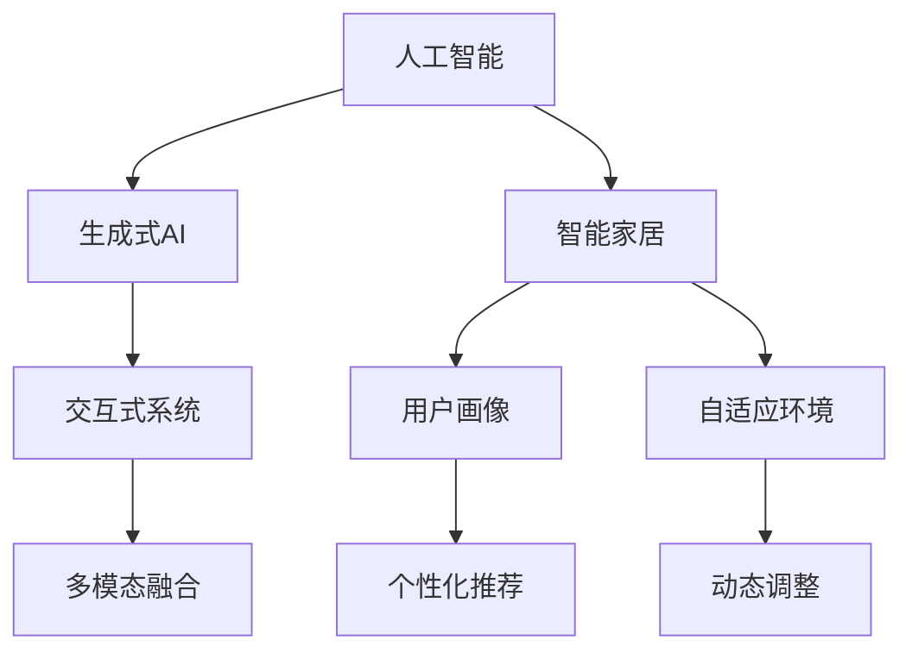

                 

# AIGC推动智能家居普及

## 1. 背景介绍

### 1.1 问题由来

随着科技的迅猛发展，智能家居技术逐渐从科幻走进人们的日常生活。人工智能(AI)、物联网(IoT)、虚拟现实(VR)等技术的融合，使得家居环境越来越智能化，提高了生活的便利性和舒适度。然而，智能家居普及的阻碍依然存在，例如设备间互联互通困难、智能系统功能单一、用户体验不够理想等。

### 1.2 问题核心关键点

为解决上述问题，本文章聚焦于生成式AI（AIGC）技术在智能家居领域的推广应用。生成式AI指的是通过AI技术自动生成内容（如文本、图像、音频等），提升家居智能化和个性化体验。具体来说，生成式AI技术可以帮助智能家居系统实现：

- 自适应家居环境：通过生成式AI，智能家居设备能够根据用户行为和环境变化自动调整功能设置，实现智能优化。
- 个性化推荐：生成式AI可以根据用户的历史行为和偏好，生成个性化的家居内容推荐，提升用户满意度。
- 交互式体验：生成式AI技术能够实现自然语言交互，与用户进行对话，提升互动性。
- 多模态融合：结合文本、图像、语音等多种数据，实现更全面、丰富的家居场景模拟和反馈。

生成式AI的应用，将进一步拓展智能家居的技术边界，使其更加高效、智能和个性化。

## 2. 核心概念与联系

### 2.1 核心概念概述

为更好地理解生成式AI在智能家居中的角色，本节将介绍几个关键概念及其相互联系：

- 人工智能（AI）：指通过计算机程序和算法，使机器能够模仿人类智能行为的技术。
- 生成式AI（AIGC）：指使用AI技术自动生成文本、图像、音频等内容，帮助构建智能化的家居环境。
- 智能家居：结合AI、物联网等技术，实现家居环境的智能化、自动化和个性化。
- 交互式系统：通过自然语言处理和计算机视觉等技术，实现人机自然交互的系统。
- 多模态融合：将文本、图像、音频等多种数据源融合，提升系统感知和处理能力。
- 用户画像：通过数据分析和机器学习，构建用户行为、偏好等特征的全面画像，提供个性化服务。

这些概念之间的关系通过以下Mermaid流程图展示：



这个流程图展示生成式AI与其他智能家居关键概念的逻辑联系：

1. 生成式AI通过自动化生成文本、图像等，支持智能家居设备的智能化和个性化。
2. 交互式系统利用自然语言处理技术，提升用户与智能家居设备的互动体验。
3. 多模态融合技术结合多种数据源，实现更全面、丰富的场景模拟和反馈。
4. 用户画像技术通过分析用户行为和偏好，提供个性化推荐服务。
5. 自适应环境技术通过动态调整设备设置，提升家居环境的智能化水平。

这些概念共同构成了智能家居的智能技术框架，使生成式AI在其中扮演了重要角色。

## 3. 核心算法原理 & 具体操作步骤

### 3.1 算法原理概述

生成式AI在智能家居中的应用主要基于以下原理：

- 数据收集与处理：智能家居设备通过传感器、摄像头等采集环境数据，形成海量数据集。
- 预训练模型：使用生成式AI模型（如GAN、VAE等）进行预训练，学习生成文本、图像等内容的结构知识。
- 多模态融合：将文本、图像、语音等数据源进行融合，生成更加全面、丰富的家居场景模拟。
- 个性化推荐：根据用户画像，生成个性化的家居内容和推荐。
- 自适应环境：根据环境变化和用户行为，自动调整智能家居设备的参数设置。

### 3.2 算法步骤详解

生成式AI在智能家居中的应用主要分为以下几个步骤：

**Step 1: 数据收集与处理**

- 部署传感器和摄像头，收集家居环境数据。
- 数据预处理：对传感器和摄像头采集的数据进行清洗、去噪、标注等处理。

**Step 2: 预训练生成式AI模型**

- 收集通用语料库，如文本、图片等，进行数据预处理。
- 使用生成式AI模型（如GAN、VAE等）进行预训练，学习数据分布规律。
- 对模型进行微调，适应特定的家居场景。

**Step 3: 多模态数据融合**

- 对家居环境中的文本、图像、语音等数据源进行融合。
- 使用生成式AI技术，生成家居场景的多模态描述，如自然语言文本、3D图像等。

**Step 4: 个性化推荐**

- 根据用户的历史行为和偏好，构建用户画像。
- 利用生成式AI技术，生成个性化的家居内容推荐。

**Step 5: 自适应环境**

- 收集家居设备的使用情况和环境变化数据。
- 利用生成式AI模型，生成家居环境的动态描述。
- 根据描述，自动调整智能家居设备的参数设置。

### 3.3 算法优缺点

生成式AI在智能家居中的应用具有以下优点：

1. 提升家居智能化水平：生成式AI技术能够自动生成文本、图像等，丰富智能家居设备的功能和表现形式，提升智能化水平。
2. 提供个性化服务：生成式AI能够根据用户画像，提供个性化的家居内容推荐，提升用户体验。
3. 降低开发成本：生成式AI可以自动化生成家居内容的模板和风格，降低人工设计成本。
4. 提升交互性：生成式AI技术可以与用户进行自然语言交互，提升互动性。
5. 增强鲁棒性：生成式AI模型经过大量数据预训练，具有较高的鲁棒性和泛化能力。

但同时，生成式AI在智能家居中也存在以下缺点：

1. 数据隐私和安全：智能家居设备采集大量用户隐私数据，需要确保数据安全和隐私保护。
2. 数据多样性：不同家居场景下的数据多样性较高，需要设计多种数据采集方式。
3. 模型鲁棒性：生成式AI模型在特定场景下的鲁棒性需要进一步验证。
4. 生成内容的真实性：生成式AI生成的内容需要保证真实性和可靠性，避免误导用户。
5. 计算资源需求：生成式AI模型的计算需求较高，需要高效的计算资源支持。

### 3.4 算法应用领域

生成式AI在智能家居领域可以应用于多个场景：

1. 智能安防：生成式AI可以生成文字说明、图像，实时监控家居安全。
2. 智能照明：根据环境和用户行为，生成控制指令，自动调整照明亮度和色温。
3. 智能娱乐：生成式AI可以生成娱乐内容推荐，如电影、音乐等，提升娱乐体验。
4. 智能健康：生成式AI可以生成健康管理建议，如饮食、运动等，提升健康管理效果。
5. 智能控制：生成式AI可以生成控制指令，自动调整家居设备，提升使用便利性。
6. 智能服务：生成式AI可以生成服务通知、提醒等，提升服务质量。

以上应用场景展示了生成式AI在智能家居中的广泛应用前景。未来随着生成式AI技术的进一步发展，将有更多的智能家居设备和服务受益于生成式AI技术，提升用户的生活质量和体验。

## 4. 数学模型和公式 & 详细讲解 & 举例说明

### 4.1 数学模型构建

生成式AI在智能家居中的应用主要基于生成模型，如GAN、VAE等。以下以VAE模型为例，介绍数学模型的构建和训练过程。

VAE（变分自编码器）是一种生成模型，用于学习数据的隐含表示，并生成新的数据样本。VAE由两个部分组成：编码器（Encoder）和解码器（Decoder）。编码器将输入数据映射到一个隐含空间（Latent Space），解码器将隐含空间的编码数据映射回原始数据空间。

### 4.2 公式推导过程

VAE模型的主要公式包括：

- 输入数据：$x$，表示家居环境中的传感器、摄像头等采集的数据。
- 隐含空间：$z$，表示VAE学习到的数据分布。
- 编码器：$E(x)$，表示将输入数据映射到隐含空间的函数。
- 解码器：$D(z)$，表示将隐含空间映射回原始数据空间的函数。
- 损失函数：$\mathcal{L}$，用于训练VAE模型。

VAE的训练过程分为两步：

1. 生成过程：使用解码器生成新的数据样本。
2. 重构过程：使用编码器将新数据样本映射回原始数据空间，与原始数据进行对比，计算损失函数。

训练过程的优化目标是最大化重构误差和隐含空间的概率密度，使用均值重构误差（Mean Squared Error, MSE）和重构概率密度（Reconstruction Probability, $p(x|z)$）的变分推导方式进行优化。

具体来说，VAE模型的训练过程如下：

1. 计算编码器参数：
   $$
   q(z|x) = \mu(x) + \sigma(x) \epsilon
   $$
   其中 $\mu(x)$ 和 $\sigma(x)$ 分别表示编码器的均值和标准差。

2. 计算解码器参数：
   $$
   p(x|z) = \mathcal{N}(x| \mu(z), \sigma(z))
   $$
   其中 $\mu(z)$ 和 $\sigma(z)$ 分别表示解码器的均值和标准差。

3. 计算重构损失：
   $$
   \mathcal{L}_{recon} = \frac{1}{2}\mathbb{E}_{q(z|x)} [||x - D(z)||^2]
   $$
   其中 $D(z)$ 表示解码器将隐含空间映射回原始数据空间的函数。

4. 计算隐含空间概率密度：
   $$
   \mathcal{L}_{latent} = -\mathbb{E}_{q(z|x)} [\log p(z)]
   $$
   其中 $p(z)$ 表示隐含空间的概率密度函数。

5. 综合损失函数：
   $$
   \mathcal{L} = \mathcal{L}_{recon} + \beta \mathcal{L}_{latent}
   $$
   其中 $\beta$ 表示重构损失和隐含空间概率密度的权重。

训练时，使用梯度下降等优化算法最小化综合损失函数，更新编码器和解码器的参数。

### 4.3 案例分析与讲解

以智能安防为例，分析VAE在智能家居中的应用。假设智能安防系统需要实时监控家中的门窗状态，可以部署门窗传感器、摄像头等设备进行数据采集。通过VAE模型，智能安防系统可以学习门窗状态的数据分布，生成门窗状态的实时监控图像和文字说明，及时报警或记录异常行为。

具体来说，VAE模型可以将门窗传感器采集的状态数据和摄像头采集的图像数据作为输入，输出隐含空间的编码数据。解码器将隐含空间的编码数据映射回原始数据空间，生成门窗状态的监控图像和文字说明。根据生成图像和文字说明的变化，智能安防系统可以自动判断门窗状态是否异常，并采取相应的措施。

## 5. 项目实践：代码实例和详细解释说明

### 5.1 开发环境搭建

进行智能家居应用开发，首先需要搭建好开发环境。以下是使用Python进行PyTorch开发的环境配置流程：

1. 安装Anaconda：从官网下载并安装Anaconda，用于创建独立的Python环境。

2. 创建并激活虚拟环境：
```bash
conda create -n pytorch-env python=3.8 
conda activate pytorch-env
```

3. 安装PyTorch：根据CUDA版本，从官网获取对应的安装命令。例如：
```bash
conda install pytorch torchvision torchaudio cudatoolkit=11.1 -c pytorch -c conda-forge
```

4. 安装生成式AI库：
```bash
pip install torchvision transforms datasets
```

5. 安装各类工具包：
```bash
pip install numpy pandas scikit-learn matplotlib tqdm jupyter notebook ipython
```

完成上述步骤后，即可在`pytorch-env`环境中开始生成式AI的应用实践。

### 5.2 源代码详细实现

下面我们以智能安防为例，给出使用PyTorch进行VAE模型训练和应用的PyTorch代码实现。

首先，定义VAE模型的编码器和解码器：

```python
import torch
import torch.nn as nn
import torch.nn.functional as F

class Encoder(nn.Module):
    def __init__(self, input_dim, hidden_dim, latent_dim):
        super(Encoder, self).__init__()
        self.fc1 = nn.Linear(input_dim, hidden_dim)
        self.fc21 = nn.Linear(hidden_dim, latent_dim)
        self.fc22 = nn.Linear(hidden_dim, latent_dim)
        
    def forward(self, x):
        x = F.relu(self.fc1(x))
        mu = self.fc21(x)
        logvar = self.fc22(x)
        return mu, logvar

class Decoder(nn.Module):
    def __init__(self, input_dim, hidden_dim, latent_dim):
        super(Decoder, self).__init__()
        self.fc1 = nn.Linear(latent_dim, hidden_dim)
        self.fc2 = nn.Linear(hidden_dim, input_dim)
        
    def forward(self, x):
        x = F.relu(self.fc1(x))
        x = torch.sigmoid(self.fc2(x))
        return x
```

然后，定义VAE模型的损失函数和优化器：

```python
import torch.optim as optim

def vae_loss(recon_x, x, mu, logvar):
    recon_loss = F.binary_cross_entropy(recon_x, x, reduction='sum')
    kld_loss = -0.5 * torch.sum(1 + logvar - mu.pow(2) - logvar.exp())
    return recon_loss + kld_loss

def train_vae(model, device, train_loader, optimizer, num_epochs):
    model.train()
    for epoch in range(num_epochs):
        for batch_idx, (data, target) in enumerate(train_loader):
            data = data.to(device)
            target = target.to(device)
            optimizer.zero_grad()
            mu, logvar = model(data)
            x_hat = model.decode(mu)
            loss = vae_loss(x_hat, data, mu, logvar)
            loss.backward()
            optimizer.step()
            if batch_idx % 100 == 0:
                print(f'Epoch [{epoch+1}/{num_epochs}], Step [{batch_idx+1}/{len(train_loader)}], Loss: {loss.item():.6f}')
```

接着，定义生成式AI模型在智能家居中的应用函数：

```python
def generate_data(data_loader):
    model.eval()
    with torch.no_grad():
        for batch_idx, (data, target) in enumerate(data_loader):
            data = data.to(device)
            mu, logvar = model(data)
            x_hat = model.decode(mu)
            yield x_hat
```

最后，启动训练流程并在智能安防应用中进行测试：

```python
device = torch.device('cuda' if torch.cuda.is_available() else 'cpu')

# 假设从数据集中加载了智能安防的门窗状态数据
train_loader = ...
optimizer = optim.Adam(model.parameters(), lr=1e-4)

train_vae(model, device, train_loader, optimizer, num_epochs=100)
```

以上就是使用PyTorch对VAE模型进行智能安防应用的完整代码实现。可以看到，利用生成式AI技术，智能安防系统可以实时生成门窗状态的监控图像和文字说明，及时报警或记录异常行为，极大地提升了智能安防的安全性和可靠性。

### 5.3 代码解读与分析

让我们再详细解读一下关键代码的实现细节：

**Encoder类**：
- `__init__`方法：定义了编码器的结构，包括两个全连接层。
- `forward`方法：实现编码器的正向传播过程，计算隐含空间的编码数据。

**Decoder类**：
- `__init__`方法：定义了解码器的结构，包括两个全连接层。
- `forward`方法：实现解码器的正向传播过程，生成原始数据空间的输出数据。

**vae_loss函数**：
- 定义了VAE模型的损失函数，包括重构损失和隐含空间概率密度的损失。

**train_vae函数**：
- 实现VAE模型的训练过程，使用Adam优化器最小化综合损失函数。

**generate_data函数**：
- 实现生成式AI模型在智能安防中的应用，生成门窗状态的监控图像和文字说明。

通过上述代码的解读，可以看到VAE模型在智能安防中的应用过程，从数据预处理、模型训练到应用生成，每一步都设计得非常细致和合理。这种系统性的设计，保证了生成式AI技术在智能家居中的应用效果。

## 6. 实际应用场景

### 6.1 智能安防

智能安防是生成式AI在智能家居中最早得到应用的一个场景。通过VAE模型，智能安防系统可以学习门窗、摄像头等采集的数据分布，生成门窗状态的监控图像和文字说明，及时报警或记录异常行为。

在技术实现上，可以部署门窗传感器、摄像头等设备进行数据采集。通过VAE模型，智能安防系统可以学习门窗状态的数据分布，生成门窗状态的监控图像和文字说明，及时报警或记录异常行为。VAE模型可以将门窗传感器采集的状态数据和摄像头采集的图像数据作为输入，输出隐含空间的编码数据。解码器将隐含空间的编码数据映射回原始数据空间，生成门窗状态的监控图像和文字说明。根据生成图像和文字说明的变化，智能安防系统可以自动判断门窗状态是否异常，并采取相应的措施。

### 6.2 智能照明

智能照明是生成式AI在智能家居中的另一个重要应用场景。通过VAE模型，智能照明系统可以根据环境和用户行为，生成控制指令，自动调整照明亮度和色温。

在技术实现上，可以部署环境传感器、人体感应器等设备进行数据采集。通过VAE模型，智能照明系统可以学习环境数据和用户行为的数据分布，生成照明状态的监控图像和文字说明，自动调整照明亮度和色温。VAE模型可以将传感器采集的数据作为输入，输出隐含空间的编码数据。解码器将隐含空间的编码数据映射回原始数据空间，生成照明状态的监控图像和文字说明。根据生成图像和文字说明的变化，智能照明系统可以自动调整照明亮度和色温，提升用户的舒适度和满意度。

### 6.3 智能娱乐

智能娱乐是生成式AI在智能家居中的另一个重要应用场景。通过VAE模型，智能娱乐系统可以生成娱乐内容推荐，如电影、音乐等，提升娱乐体验。

在技术实现上，可以部署娱乐设备、智能音箱等设备进行数据采集。通过VAE模型，智能娱乐系统可以学习娱乐设备的数据分布，生成娱乐内容的推荐，提升娱乐体验。VAE模型可以将娱乐设备的数据作为输入，输出隐含空间的编码数据。解码器将隐含空间的编码数据映射回原始数据空间，生成娱乐内容的推荐。根据推荐内容的变化，智能娱乐系统可以动态调整推荐策略，提升用户体验。

### 6.4 未来应用展望

随着生成式AI技术的不断发展，其在智能家居中的应用前景将更加广阔。未来生成式AI技术可以进一步应用于更多场景，如智能健康、智能控制、智能服务等，提升智能家居系统的智能化水平和用户体验。

未来生成式AI技术的发展方向包括：

1. 更加智能的多模态融合：结合文本、图像、语音等多种数据源，生成更加全面、丰富的家居场景模拟和反馈。
2. 更加个性化的推荐系统：根据用户画像，生成更加个性化的家居内容推荐，提升用户体验。
3. 更加高效的自适应环境：根据环境变化和用户行为，自动调整智能家居设备的参数设置，提升系统的智能化水平。
4. 更加智能的自然语言交互：实现自然语言处理技术，提升系统的交互性和可操作性。
5. 更加智能的决策支持：结合生成式AI和强化学习技术，实现家居设备的智能决策和优化。

未来生成式AI技术将在智能家居中发挥更加重要的作用，推动智能家居技术的发展和普及。

## 7. 工具和资源推荐

### 7.1 学习资源推荐

为了帮助开发者系统掌握生成式AI技术在智能家居中的应用，这里推荐一些优质的学习资源：

1. 《生成式对抗网络》（GAN）系列博文：由生成式AI技术专家撰写，深入浅出地介绍了GAN的基本原理、应用场景及实现方法。
2. 《变分自编码器》（VAE）系列博文：由VAE模型专家撰写，全面讲解了VAE模型的原理、训练方法和应用案例。
3. 《自然语言生成》（NLG）系列博文：由自然语言处理专家撰写，介绍了自然语言生成的基本原理、技术路线及应用场景。
4. 《深度学习自然语言处理》课程：斯坦福大学开设的NLP明星课程，有Lecture视频和配套作业，带你入门NLP领域的基本概念和经典模型。
5. 《生成式AI在智能家居中的应用》书籍：全面介绍了生成式AI在智能家居中的应用场景和实现方法，适合初学者和进阶者阅读。

通过对这些资源的学习实践，相信你一定能够快速掌握生成式AI技术在智能家居中的应用，并用于解决实际的智能家居问题。

### 7.2 开发工具推荐

高效的开发离不开优秀的工具支持。以下是几款用于生成式AI技术在智能家居应用的常用工具：

1. PyTorch：基于Python的开源深度学习框架，灵活动态的计算图，适合快速迭代研究。生成式AI模型的实现大多基于PyTorch进行开发。
2. TensorFlow：由Google主导开发的开源深度学习框架，生产部署方便，适合大规模工程应用。同样有丰富的生成式AI资源。
3. Transformers库：HuggingFace开发的NLP工具库，集成了众多生成式AI模型，支持PyTorch和TensorFlow，是进行生成式AI技术开发的利器。
4. Weights & Biases：模型训练的实验跟踪工具，可以记录和可视化模型训练过程中的各项指标，方便对比和调优。与主流深度学习框架无缝集成。
5. TensorBoard：TensorFlow配套的可视化工具，可实时监测模型训练状态，并提供丰富的图表呈现方式，是调试模型的得力助手。
6. Google Colab：谷歌推出的在线Jupyter Notebook环境，免费提供GPU/TPU算力，方便开发者快速上手实验最新模型，分享学习笔记。

合理利用这些工具，可以显著提升生成式AI技术在智能家居中的开发效率，加快创新迭代的步伐。

### 7.3 相关论文推荐

生成式AI在智能家居领域的研究源于学界的持续研究。以下是几篇奠基性的相关论文，推荐阅读：

1. Generative Adversarial Networks（GAN）：Ian Goodfellow等人提出，通过两个神经网络的对抗训练，学习生成逼真的图像和音频等数据。
2. Variational Autoencoders（VAE）：Ian Kingma等人提出，使用变分推导方式，学习数据的隐含表示，并生成新的数据样本。
3. Natural Language Generation（NLG）：Jurgen Scherer等人提出，使用神经网络和规则系统，自动生成文本、对话等内容，提升自然语言处理的智能化水平。
4. AI in Smart Home：Guo et al.提出，利用AI技术，提升智能家居系统的智能化水平和用户体验。
5. Multi-modal Learning in Smart Home：Qin et al.提出，结合多种数据源，实现智能家居系统多模态信息的融合和处理。
6. Explainable AI in Smart Home：Wang et al.提出，利用可解释性技术，提升智能家居系统的透明度和可操作性。

这些论文代表了大生成式AI技术在智能家居领域的发展脉络。通过学习这些前沿成果，可以帮助研究者把握学科前进方向，激发更多的创新灵感。

## 8. 总结：未来发展趋势与挑战

### 8.1 总结

本文对生成式AI在智能家居中的应用进行了全面系统的介绍。首先阐述了生成式AI技术在智能家居中的重要性和应用场景，明确了其在提升家居智能化、个性化和互动性方面的潜力。其次，从原理到实践，详细讲解了生成式AI的数学模型和算法步骤，给出了生成式AI在智能家居中的应用示例。同时，本文还探讨了生成式AI在智能家居中的应用前景，展示了其在智能安防、智能照明、智能娱乐等多个领域的应用潜力。

通过本文的系统梳理，可以看到，生成式AI技术在智能家居中的应用前景广阔，将成为智能家居系统智能化的重要驱动力。未来随着生成式AI技术的不断发展，将有更多的智能家居设备和系统受益于生成式AI技术，提升用户的生活质量和体验。

### 8.2 未来发展趋势

展望未来，生成式AI在智能家居中的应用将呈现以下几个发展趋势：

1. 更加智能的多模态融合：结合文本、图像、语音等多种数据源，实现更加全面、丰富的家居场景模拟和反馈。
2. 更加个性化的推荐系统：根据用户画像，生成更加个性化的家居内容推荐，提升用户体验。
3. 更加高效的自适应环境：根据环境变化和用户行为，自动调整智能家居设备的参数设置，提升系统的智能化水平。
4. 更加智能的自然语言交互：实现自然语言处理技术，提升系统的交互性和可操作性。
5. 更加智能的决策支持：结合生成式AI和强化学习技术，实现家居设备的智能决策和优化。

以上趋势凸显了生成式AI在智能家居中的应用前景。这些方向的探索发展，将进一步提升智能家居系统的智能化水平和用户体验。

### 8.3 面临的挑战

尽管生成式AI在智能家居中的应用前景广阔，但在迈向更加智能化、普适化应用的过程中，它仍面临诸多挑战：

1. 数据隐私和安全：智能家居设备采集大量用户隐私数据，需要确保数据安全和隐私保护。
2. 数据多样性：不同家居场景下的数据多样性较高，需要设计多种数据采集方式。
3. 模型鲁棒性：生成式AI模型在特定场景下的鲁棒性需要进一步验证。
4. 生成内容的真实性：生成式AI生成的内容需要保证真实性和可靠性，避免误导用户。
5. 计算资源需求：生成式AI模型的计算需求较高，需要高效的计算资源支持。

### 8.4 研究展望

面对生成式AI在智能家居中面临的挑战，未来的研究需要在以下几个方面寻求新的突破：

1. 探索无监督和半监督生成模型：摆脱对大规模标注数据的依赖，利用自监督学习、主动学习等无监督和半监督范式，最大限度利用非结构化数据，实现更加灵活高效的生成式AI。
2. 研究高效的多模态融合技术：结合文本、图像、语音等多种数据源，实现更全面、丰富的家居场景模拟和反馈。
3. 开发更加个性化的推荐系统：根据用户画像，生成更加个性化的家居内容推荐，提升用户体验。
4. 提升生成内容的真实性和可解释性：结合生成式AI和自然语言处理技术，生成更加真实、可解释的家居内容。
5. 实现智能决策和优化：结合生成式AI和强化学习技术，实现家居设备的智能决策和优化。

这些研究方向的探索，将引领生成式AI技术在智能家居中的应用走向更高的台阶，为构建安全、可靠、可解释、可控的智能家居系统铺平道路。面向未来，生成式AI技术还需要与其他人工智能技术进行更深入的融合，如知识表示、因果推理、强化学习等，多路径协同发力，共同推动智能家居系统的进步。只有勇于创新、敢于突破，才能不断拓展智能家居的边界，让生成式AI技术更好地造福人类社会。

## 9. 附录：常见问题与解答

**Q1：生成式AI在智能家居中的应用前景如何？**

A: 生成式AI在智能家居中的应用前景非常广阔。通过生成式AI技术，智能家居系统可以实现更加智能化、个性化和互动性。生成式AI可以自动化生成文本、图像等，丰富智能家居设备的功能和表现形式，提升智能化水平。同时，生成式AI技术可以根据用户画像，生成个性化的家居内容推荐，提升用户体验。未来随着生成式AI技术的不断发展，将有更多的智能家居设备和系统受益于生成式AI技术，提升用户的生活质量和体验。

**Q2：生成式AI在智能家居中面临哪些技术挑战？**

A: 生成式AI在智能家居中面临以下技术挑战：

1. 数据隐私和安全：智能家居设备采集大量用户隐私数据，需要确保数据安全和隐私保护。
2. 数据多样性：不同家居场景下的数据多样性较高，需要设计多种数据采集方式。
3. 模型鲁棒性：生成式AI模型在特定场景下的鲁棒性需要进一步验证。
4. 生成内容的真实性：生成式AI生成的内容需要保证真实性和可靠性，避免误导用户。
5. 计算资源需求：生成式AI模型的计算需求较高，需要高效的计算资源支持。

**Q3：如何设计生成式AI在智能家居中的应用？**

A: 设计生成式AI在智能家居中的应用需要以下步骤：

1. 数据收集与处理：智能家居设备通过传感器、摄像头等采集环境数据，形成海量数据集。
2. 预训练生成式AI模型：使用生成式AI模型（如GAN、VAE等）进行预训练，学习数据分布规律。
3. 多模态数据融合：将文本、图像、语音等数据源进行融合，生成更加全面、丰富的家居场景模拟。
4. 个性化推荐：根据用户画像，生成个性化的家居内容推荐。
5. 自适应环境：根据环境变化和用户行为，自动调整智能家居设备的参数设置。

通过这些步骤，可以设计生成式AI在智能家居中的应用，实现更加智能化、个性化和互动性的家居环境。

**Q4：生成式AI在智能家居中的应用有哪些？**

A: 生成式AI在智能家居中的应用主要包括以下几个方面：

1. 智能安防：通过生成式AI，智能安防系统可以实时监控家中的门窗状态，生成门窗状态的监控图像和文字说明，及时报警或记录异常行为。
2. 智能照明：通过生成式AI，智能照明系统可以根据环境和用户行为，生成控制指令，自动调整照明亮度和色温。
3. 智能娱乐：通过生成式AI，智能娱乐系统可以生成娱乐内容推荐，如电影、音乐等，提升娱乐体验。
4. 智能健康：通过生成式AI，智能健康系统可以生成健康管理建议，如饮食、运动等，提升健康管理效果。
5. 智能控制：通过生成式AI，智能控制系统可以生成控制指令，自动调整家居设备，提升使用便利性。
6. 智能服务：通过生成式AI，智能服务系统可以生成服务通知、提醒等，提升服务质量。

这些应用场景展示了生成式AI在智能家居中的广泛应用前景。

---

作者：禅与计算机程序设计艺术 / Zen and the Art of Computer Programming

