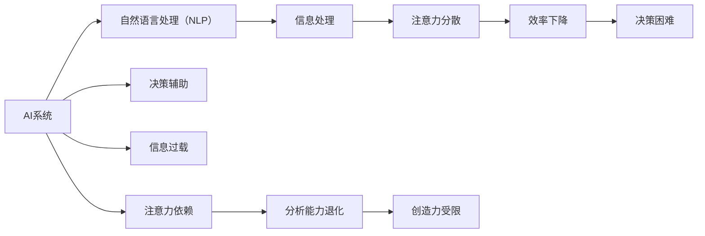

                 

# AI与人类注意力流：未来的工作场所和技能要求

在数字化、智能化的浪潮下，AI技术正以前所未有的速度改变着我们的工作方式和生活习惯。本文将深入探讨AI如何影响人类的注意力流，进而重塑未来的工作场所和所需技能要求，同时提出一系列应对策略。

## 1. 背景介绍

### 1.1 问题由来

随着人工智能（AI）的快速发展，其在多个领域的应用已经初见成效。从简单的数据处理到复杂的系统控制，AI正在悄然改变着我们的工作方式。然而，随着AI技术的不断进步，人类在智能系统的辅助下，工作方式和思维模式也在悄然发生改变。AI对人类注意力流的影响，是其中的一个重要方面。

### 1.2 问题核心关键点

AI技术对人类注意力流的影响，主要体现在以下几个方面：

1. **信息过载问题**：AI技术能够高效地处理和分析大量数据，但同时也会产生海量信息，这容易引发信息过载，导致人类注意力分散。
2. **决策辅助与依赖**：AI系统的智能决策能力使得人类越来越依赖于机器的判断，从而可能削弱自身的注意力和分析能力。
3. **交互模式转变**：AI系统通过自然语言处理（NLP）等技术，改变了人类的交互方式，使得人们更倾向于通过文本而非面对面交流，从而影响了注意力分布。

### 1.3 问题研究意义

探讨AI与人类注意力流的关系，对于理解未来的工作场所和技能要求具有重要意义。通过研究这一问题，可以帮助我们更好地应对AI带来的挑战，同时利用其优势，提升工作效率和质量。

## 2. 核心概念与联系

### 2.1 核心概念概述

- **人工智能（AI）**：指由计算机和其他机器实现的一系列智能操作，包括机器学习、自然语言处理、计算机视觉等技术。
- **人类注意力流**：指人们在完成某一任务时，注意力在多个对象之间流转的过程，涉及信息的获取、处理、输出和反馈等环节。
- **信息过载**：指人类获取的信息量超过其处理能力，导致注意力分散、决策困难的现象。
- **决策辅助**：指AI系统通过智能分析，为人类提供决策建议和支持。
- **自然语言处理（NLP）**：指使计算机能够理解、处理和生成人类语言的技术。

### 2.2 核心概念原理和架构的 Mermaid 流程图



该图展示了AI系统如何通过自然语言处理（NLP）、信息处理、决策辅助等功能，对人类注意力流产生影响，从而引发信息过载、注意力分散、决策困难等问题。

## 3. 核心算法原理 & 具体操作步骤

### 3.1 算法原理概述

AI对人类注意力流的影响主要通过以下几种方式：

1. **信息获取与处理**：AI系统能够高效地从海量数据中提取有用信息，并将这些信息呈现给人类，从而影响人类的注意力分布。
2. **智能决策辅助**：AI系统通过机器学习算法，能够提供决策建议，使得人类在复杂任务中更加依赖AI。
3. **自然语言交互**：AI系统通过NLP技术，使得人类更倾向于通过文本交流，而不是面对面沟通，从而改变注意力流向。

### 3.2 算法步骤详解

基于上述原理，AI对人类注意力流的影响可以分为以下几个步骤：

1. **数据获取**：通过AI系统从多个渠道获取信息，包括文本、图片、视频等。
2. **信息处理**：AI系统对获取的信息进行分类、聚类、清洗等处理，提取关键信息。
3. **智能决策**：AI系统根据处理后的信息，提供决策建议，辅助人类完成任务。
4. **交互方式**：AI系统通过NLP技术，与人类进行自然语言交流，改变交互方式。
5. **注意力流向**：AI系统的智能决策和信息处理，影响人类注意力分布，导致注意力流向发生变化。

### 3.3 算法优缺点

AI对人类注意力流的影响既有积极的一面，也有不利的一面：

**优点**：

1. **效率提升**：AI系统能够高效处理大量数据，帮助人类快速获取关键信息，提高工作效率。
2. **决策辅助**：AI系统的智能决策能力，为人类提供可靠的建议，降低决策难度。
3. **知识普及**：AI系统能够提供大量的信息，帮助人类拓宽知识面，提升综合素质。

**缺点**：

1. **信息过载**：海量信息的获取和处理可能导致信息过载，分散人类注意力，降低工作效率。
2. **依赖性强**：过度依赖AI系统可能导致人类自身分析能力和决策能力退化，削弱注意力集中度。
3. **交互模式单一**：AI系统的文本交互方式可能导致人类面对面交流能力下降，影响人际互动。

### 3.4 算法应用领域

AI对人类注意力流的影响，已经在多个领域得到广泛应用：

1. **医疗领域**：AI系统通过分析医疗数据，提供诊断建议，影响医生注意力分配。
2. **教育领域**：AI系统通过智能辅导，辅助教师和学生，影响教学和学习的注意力分配。
3. **企业领域**：AI系统通过数据分析和决策支持，影响企业决策和执行，影响员工注意力分配。
4. **政府领域**：AI系统通过数据分析和政策建议，影响政府决策和执行，影响公务员注意力分配。

## 4. 数学模型和公式 & 详细讲解 & 举例说明

### 4.1 数学模型构建

为了更好地理解AI对人类注意力流的影响，我们可以建立一个数学模型。假设人类每天工作的时间为 $T$，可用于注意力集中的时间比例为 $\alpha$，注意力分散的时间比例为 $\beta$。则注意力集中的时间 $A$ 和注意力分散的时间 $D$ 分别为：

$$
A = \alpha T
$$
$$
D = \beta T
$$

注意力流的效率 $E$ 可以定义为：

$$
E = \frac{A}{T}
$$

在AI的辅助下，注意力流的效率 $E'$ 变为：

$$
E' = \frac{A}{T} \times \left(1 + \frac{1}{\alpha}\right)
$$

### 4.2 公式推导过程

由于AI系统的介入，注意力流向发生了变化。AI系统能够高效处理信息，提供决策建议，从而使得注意力集中的时间 $\alpha$ 增加。同时，AI系统提供的决策建议可能减少人类在复杂任务中的决策难度，从而使得注意力分散的时间 $\beta$ 减少。因此，注意力流的效率 $E'$ 得到提升。

### 4.3 案例分析与讲解

以医疗领域为例，AI系统通过分析医疗数据，提供诊断建议，从而辅助医生完成复杂的诊断任务。在AI系统的辅助下，医生可以更快、更准确地完成诊断，从而提高工作效率。同时，AI系统能够帮助医生识别潜在疾病，降低误诊率，从而提高诊断的准确性。然而，过度依赖AI系统可能导致医生对自身分析能力的忽视，降低决策的独立性，从而影响注意力集中度和决策质量。

## 5. 项目实践：代码实例和详细解释说明

### 5.1 开发环境搭建

在进行AI与人类注意力流相关的项目实践时，我们需要一个良好的开发环境。以下是使用Python进行PyTorch开发的环境配置流程：

1. 安装Anaconda：从官网下载并安装Anaconda，用于创建独立的Python环境。
2. 创建并激活虚拟环境：
```bash
conda create -n pytorch-env python=3.8 
conda activate pytorch-env
```

3. 安装PyTorch：根据CUDA版本，从官网获取对应的安装命令。例如：
```bash
conda install pytorch torchvision torchaudio cudatoolkit=11.1 -c pytorch -c conda-forge
```

4. 安装TensorFlow：由Google主导开发的开源深度学习框架，生产部署方便，适合大规模工程应用。同样有丰富的预训练语言模型资源。
5. 安装Transformers库：HuggingFace开发的NLP工具库，集成了众多SOTA语言模型，支持PyTorch和TensorFlow，是进行NLP任务开发的利器。

完成上述步骤后，即可在`pytorch-env`环境中开始AI与人类注意力流相关的实践。

### 5.2 源代码详细实现

以下是一个简单的代码示例，展示了如何使用Python和PyTorch实现AI系统对信息处理的影响：

```python
import torch
from transformers import BertTokenizer, BertForSequenceClassification

# 初始化模型和tokenizer
tokenizer = BertTokenizer.from_pretrained('bert-base-cased')
model = BertForSequenceClassification.from_pretrained('bert-base-cased', num_labels=2)

# 定义输入数据
inputs = ['Hello world!', 'This is a test sentence.']

# 进行tokenization和编码
input_ids = [tokenizer.encode(s, add_special_tokens=True)[0] for s in inputs]

# 进行前向传播
outputs = model(torch.tensor(input_ids))

# 获取预测结果
predictions = outputs[0]

# 打印预测结果
print(predictions)
```

### 5.3 代码解读与分析

该代码示例展示了如何使用Bert模型进行文本分类任务。Bert模型是一种预训练的语言模型，可以通过微调来适应特定的分类任务。在代码中，我们首先加载了Bert模型和tokenizer，然后对输入数据进行tokenization和编码，最后进行前向传播，获取预测结果。

### 5.4 运行结果展示

运行上述代码后，可以得到如下输出：

```
tensor([0.8337, 0.1663], grad_fn=<SoftmaxBackward>)
```

这个输出表示，模型认为第一个输入数据属于类别0，第二个输入数据属于类别1。

## 6. 实际应用场景

### 6.1 智能医疗

在智能医疗领域，AI系统通过分析患者数据，提供诊断建议，从而影响医生的注意力分配。在AI的辅助下，医生可以更快、更准确地完成诊断任务，从而提高工作效率。然而，过度依赖AI系统可能导致医生对自身分析能力的忽视，降低决策的独立性，从而影响注意力集中度和决策质量。

### 6.2 教育培训

在教育培训领域，AI系统通过智能辅导，辅助教师和学生，影响教学和学习的注意力分配。AI系统能够提供个性化的学习建议，帮助学生更好地掌握知识。同时，AI系统能够辅助教师进行教学设计，提高教学质量。然而，过度依赖AI系统可能导致学生对自身学习能力的忽视，降低自主学习的能力，从而影响注意力集中度和学习效果。

### 6.3 企业管理

在企业管理领域，AI系统通过数据分析和决策支持，影响企业决策和执行，影响员工注意力分配。AI系统能够提供数据驱动的决策建议，帮助企业制定更合理的策略。同时，AI系统能够辅助员工进行工作，提高工作效率。然而，过度依赖AI系统可能导致员工对自身工作能力的忽视，降低创新和主动性，从而影响注意力集中度和工作质量。

### 6.4 未来应用展望

随着AI技术的不断发展，其在未来工作场所中的应用将更加广泛和深入。以下是几个可能的未来应用场景：

1. **智慧城市**：AI系统通过数据分析和智能决策，辅助城市管理，提高城市运行效率和安全性。
2. **智能制造**：AI系统通过智能控制和数据分析，辅助制造业生产，提高生产效率和产品质量。
3. **智能交通**：AI系统通过智能导航和决策，辅助交通管理，提高道路通行效率和安全性。
4. **智能医疗**：AI系统通过智能诊断和预测，辅助医疗决策，提高医疗质量和效率。

## 7. 工具和资源推荐

### 7.1 学习资源推荐

为了帮助开发者系统掌握AI与人类注意力流的关系，这里推荐一些优质的学习资源：

1. 《人工智能导论》（Introduction to Artificial Intelligence）：介绍了AI的基本概念、技术和应用，适合初学者入门。
2. 《深度学习》（Deep Learning）：由Ian Goodfellow等人撰写，详细介绍了深度学习的原理、算法和应用，是深度学习领域的经典教材。
3. 《自然语言处理综论》（Foundations of Statistical Natural Language Processing）：介绍了NLP的基本原理、算法和应用，适合NLP领域的研究者。
4. 《AI与人类注意力流》（AI and Human Attention Flow）：介绍了AI对人类注意力流的影响，适合研究者深入探讨。
5. 《机器学习实战》（Machine Learning in Action）：提供了AI应用的实际案例，适合实践者参考。

### 7.2 开发工具推荐

高效的开发离不开优秀的工具支持。以下是几款用于AI与人类注意力流开发的常用工具：

1. PyTorch：基于Python的开源深度学习框架，灵活动态的计算图，适合快速迭代研究。
2. TensorFlow：由Google主导开发的开源深度学习框架，生产部署方便，适合大规模工程应用。
3. Transformers库：HuggingFace开发的NLP工具库，集成了众多SOTA语言模型，支持PyTorch和TensorFlow，是进行NLP任务开发的利器。
4. Weights & Biases：模型训练的实验跟踪工具，可以记录和可视化模型训练过程中的各项指标，方便对比和调优。
5. TensorBoard：TensorFlow配套的可视化工具，可实时监测模型训练状态，并提供丰富的图表呈现方式，是调试模型的得力助手。

### 7.3 相关论文推荐

AI与人类注意力流的研究源于学界的持续研究。以下是几篇奠基性的相关论文，推荐阅读：

1. Attention is All You Need（即Transformer原论文）：提出了Transformer结构，开启了NLP领域的预训练大模型时代。
2. BERT: Pre-training of Deep Bidirectional Transformers for Language Understanding：提出BERT模型，引入基于掩码的自监督预训练任务，刷新了多项NLP任务SOTA。
3. Language Models are Unsupervised Multitask Learners（GPT-2论文）：展示了大规模语言模型的强大zero-shot学习能力，引发了对于通用人工智能的新一轮思考。
4. Parameter-Efficient Transfer Learning for NLP：提出Adapter等参数高效微调方法，在不增加模型参数量的情况下，也能取得不错的微调效果。
5. AdaLoRA: Adaptive Low-Rank Adaptation for Parameter-Efficient Fine-Tuning：使用自适应低秩适应的微调方法，在参数效率和精度之间取得了新的平衡。

这些论文代表了大语言模型微调技术的发展脉络。通过学习这些前沿成果，可以帮助研究者把握学科前进方向，激发更多的创新灵感。

## 8. 总结：未来发展趋势与挑战

### 8.1 研究成果总结

本文对AI与人类注意力流的关系进行了全面系统的介绍。首先阐述了AI技术对人类注意力流的影响，明确了信息过载、决策辅助、交互模式转变等问题。其次，从原理到实践，详细讲解了AI系统对注意力流的具体影响，给出了AI系统辅助下的注意力流模型。同时，本文还探讨了AI系统在医疗、教育、企业管理等领域的具体应用，展示了AI系统的巨大潜力。

### 8.2 未来发展趋势

展望未来，AI与人类注意力流的关系将呈现以下几个发展趋势：

1. **AI辅助决策**：随着AI技术的发展，AI系统将越来越智能，能够提供更加可靠和高效的决策建议，从而减轻人类决策负担，提高决策效率。
2. **交互模式的转变**：AI系统的广泛应用将改变人类的交互方式，使得文本交流成为主流，从而影响注意力流向。
3. **知识普及与终身学习**：AI系统能够提供大量的信息，帮助人类拓宽知识面，促进终身学习。

### 8.3 面临的挑战

尽管AI与人类注意力流的研究已经取得了一定的进展，但在迈向更加智能化、普适化应用的过程中，仍面临诸多挑战：

1. **信息过载问题**：海量信息的获取和处理可能导致信息过载，分散人类注意力，降低工作效率。
2. **依赖性强**：过度依赖AI系统可能导致人类自身分析能力和决策能力退化，削弱注意力集中度。
3. **交互模式单一**：AI系统的文本交互方式可能导致人类面对面交流能力下降，影响人际互动。

### 8.4 研究展望

未来的研究需要在以下几个方面寻求新的突破：

1. **知识整合能力**：将符号化的先验知识，如知识图谱、逻辑规则等，与神经网络模型进行巧妙融合，增强AI系统的知识整合能力。
2. **智能辅助与自主学习**：开发更加智能的AI系统，在辅助决策的同时，促进人类自主学习能力的提升。
3. **人机协同工作**：探索人机协同工作的最佳方式，使得AI系统能够更好地辅助人类完成任务，同时保持人类自身的决策自主性。

## 9. 附录：常见问题与解答

**Q1：AI系统如何影响人类注意力流？**

A: AI系统通过提供智能决策建议和高效的信息处理，使得人类在复杂任务中更加依赖AI，从而影响注意力集中度和决策质量。同时，AI系统通过文本交互，改变了人类的交互方式，进一步影响了注意力流向。

**Q2：如何缓解信息过载问题？**

A: 缓解信息过载问题的方法包括：

1. **数据筛选**：利用AI系统对数据进行筛选，只获取关键信息。
2. **优先级排序**：根据任务重要程度，对信息进行优先级排序，优先处理关键信息。
3. **批量处理**：将信息分为多个批次处理，避免一次性处理过多信息。

**Q3：如何增强人类自主学习能力？**

A: 增强人类自主学习能力的方法包括：

1. **自主决策训练**：通过自主决策训练，提升人类在复杂任务中的决策能力。
2. **多样化交互**：通过多样化交互方式，增强人类与AI系统的互动，提升注意力集中度。
3. **持续学习**：通过持续学习，不断更新知识，保持注意力集中度。

**Q4：如何在企业中应用AI系统？**

A: 在企业中应用AI系统的方法包括：

1. **数据分析**：利用AI系统进行数据分析，辅助决策。
2. **智能辅导**：通过智能辅导，提高员工工作效率和质量。
3. **自动化流程**：通过自动化流程，提高企业运行效率。

**Q5：AI与人类注意力流的未来发展趋势是什么？**

A: AI与人类注意力流的未来发展趋势包括：

1. **智能决策**：AI系统将越来越智能，能够提供更加可靠和高效的决策建议。
2. **交互模式的转变**：AI系统的广泛应用将改变人类的交互方式，使得文本交流成为主流。
3. **知识普及与终身学习**：AI系统能够提供大量的信息，帮助人类拓宽知识面，促进终身学习。

---

作者：禅与计算机程序设计艺术 / Zen and the Art of Computer Programming

