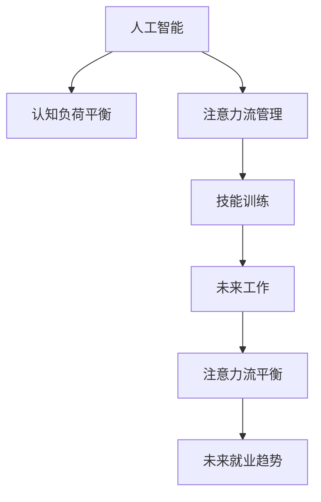

                 

# AI与人类注意力流：未来的工作、技能与注意力流管理技术的应用前景趋势预测分析

> 关键词：人工智能, 注意力流管理, 技能训练, 工作自动化, 神经网络, 预测分析

## 1. 背景介绍

在当今数字化的时代，人工智能（AI）技术已经深刻地改变了我们的工作方式和技能需求。随着机器学习和深度学习技术的不断进步，AI正在逐步接管一些人类工作的职责，重塑人类与信息交互的方式。这些变化不仅仅影响我们的职业发展路径，也对我们的注意力流（Attention Flow）管理提出了新的挑战。

### 1.1 问题由来
AI技术的快速发展，尤其是自然语言处理（NLP）、计算机视觉（CV）、机器人技术等领域，正在快速进入各行各业，改变了从制造业到服务业，从医疗到金融的各个行业的工作模式。然而，随着AI系统的复杂性和能力不断提升，人类与AI系统之间的互动也变得更加复杂，注意力流管理的需求日益凸显。

### 1.2 问题核心关键点
注意力流管理技术成为新兴的领域，其核心关键点在于：

- **认知负荷平衡**：人类在处理复杂信息时的认知负荷增加，如何平衡与AI系统的互动，减少认知负荷，是关键问题。
- **交互效率提升**：AI系统的引入能够自动化处理大量重复性任务，但同时，如何确保人类与AI系统之间的高效互动，提高工作速度和准确性，也是重点。
- **技能提升与适应**：随着AI接管更多任务，人类需要不断学习和适应新的技能，以便与AI系统协同工作，保持竞争力。

### 1.3 问题研究意义
研究AI与人类注意力流的交互和适应，对于未来工作、技能提升及注意力流管理技术的可持续发展具有重要意义：

- **工作效率提升**：帮助人类从繁琐的工作中解脱出来，专注于更有创造性和战略性的任务。
- **技能体系升级**：适应AI时代的新技能需求，提升人类在数据理解、复杂问题解决等方面的能力。
- **未来就业趋势预测**：帮助企业及个人理解和应对未来的就业市场变化，把握技术发展方向。
- **伦理与安全保障**：确保AI系统的透明性和可解释性，防止AI系统在自动化过程中引发的伦理和安全问题。

## 2. 核心概念与联系

### 2.1 核心概念概述

本节将介绍几个与AI和注意力流管理密切相关的核心概念：

- **人工智能（Artificial Intelligence, AI）**：利用计算机模拟人类智能行为的技术。包括机器学习、深度学习、自然语言处理等子领域。
- **认知负荷（Cognitive Load）**：个体在执行认知任务时所承受的心理负担。分为内在认知负荷和外在认知负荷。
- **注意力流（Attention Flow）**：指个体在完成任务时注意力的动态变化，包括对信息的聚焦、转移和散漫。
- **技能训练（Skill Training）**：通过教育和实践提升个体在工作中的技能，以适应新技术和新挑战。
- **注意力流管理（Attention Flow Management）**：通过技术手段辅助个体管理注意力流，提升认知负荷的平衡，优化工作流程。

### 2.2 核心概念原理和架构的 Mermaid 流程图



这个流程图展示了人工智能、认知负荷平衡、注意力流管理、技能训练、未来工作、未来就业趋势之间的联系：

1. **人工智能**通过机器学习和深度学习等技术，自动化处理复杂任务，影响认知负荷和注意力流。
2. **认知负荷平衡**是提高工作效率和适应新技术的基础。
3. **注意力流管理**通过技术手段辅助人类管理注意力，提升工作质量。
4. **技能训练**帮助人类适应AI时代的新需求，提升竞争力。
5. **未来工作**受到AI技术的影响，需要新的工作模式和技能。
6. **未来就业趋势**预测AI技术对就业市场的影响，帮助个体和组织适应变化。

## 3. 核心算法原理 & 具体操作步骤
### 3.1 算法原理概述

注意力流管理技术通过计算和分析个体在不同任务中的注意力分配，优化工作流程，平衡认知负荷，提升工作效率。其核心思想是：

- 在任务执行过程中，通过监控和分析个体的注意力流，调整任务执行顺序和优先级。
- 利用AI算法（如强化学习、推荐系统等），预测任务完成时间和难度，动态分配注意力。
- 结合认知负荷理论，设计合理的任务序列，确保注意力流高效流畅。

### 3.2 算法步骤详解

注意力流管理算法的核心步骤包括：

1. **数据收集与预处理**：
   - 收集个体在工作中的注意力流数据，包括注视时间、点击频率、信息获取路径等。
   - 对数据进行预处理，如去除噪音、标准化等。

2. **注意力流建模**：
   - 利用统计方法或机器学习模型（如随机森林、神经网络等）建立注意力流模型。
   - 训练模型，使其能够预测个体在不同任务中的注意力分配。

3. **任务优先级排序**：
   - 根据注意力流模型，预测每个任务的完成时间和难度。
   - 使用强化学习算法（如Q-learning）优化任务执行顺序，提高效率。

4. **认知负荷评估**：
   - 计算任务序列对认知负荷的影响，通过模拟实验评估认知负荷水平。
   - 根据认知负荷水平调整任务执行顺序，确保工作不会导致认知负荷过重。

### 3.3 算法优缺点

注意力流管理技术具有以下优点：

- **提高工作效率**：通过优化任务序列，减少认知负荷，提升工作速度和准确性。
- **个性化适应**：能够根据个体的注意力流特性，定制个性化的任务安排。
- **动态调整**：适应任务和环境的变化，实现实时优化。

同时，该技术也存在以下局限：

- **数据依赖性**：模型依赖于大量的注意力流数据，数据质量直接影响模型性能。
- **模型复杂度**：构建高精度模型需要复杂的算法和大量的计算资源。
- **用户接受度**：用户可能对数据收集和监控存在抵触情绪，影响技术接受度。

### 3.4 算法应用领域

注意力流管理技术主要应用于以下领域：

- **生产制造**：通过监控和优化生产线工人的注意力流，提高生产效率和产品质量。
- **医疗诊断**：监控医生的注意力流，优化诊疗流程，减少误诊漏诊。
- **教育培训**：分析学生的注意力流，优化教学内容和方式，提升学习效果。
- **金融投资**：监控交易员的注意力流，优化交易策略，提升投资回报。
- **客服支持**：监控客服人员的注意力流，优化服务流程，提升客户满意度。

## 4. 数学模型和公式 & 详细讲解 & 举例说明

### 4.1 数学模型构建

我们构建一个简单的数学模型来描述注意力流管理的过程。设 $T$ 为任务集，$A_t$ 为任务 $t$ 所需注意力的强度，$L_t$ 为任务 $t$ 完成所需的时间，$C_t$ 为任务 $t$ 的难度系数，$E_t$ 为任务 $t$ 的重要性，$W_t$ 为任务 $t$ 的权重，$S_i$ 为个体 $i$ 当前认知负荷。

注意力流管理的目标是最大化工作效率，即：

$$
\max \sum_{t \in T} E_t \cdot W_t \cdot \min(L_t, S_i) - \sum_{t \in T} A_t \cdot W_t
$$

其中，$\min(L_t, S_i)$ 表示任务 $t$ 和个体 $i$ 认知负荷的限制条件。

### 4.2 公式推导过程

根据注意力流管理的目标，我们引入注意力分配函数 $F_t(S_i)$，表示个体 $i$ 在任务 $t$ 上的注意力分配，满足以下条件：

1. $F_t(S_i) \geq 0$，即注意力分配非负。
2. $\sum_{t \in T} F_t(S_i) = 1$，即注意力分配总和为1。
3. $F_t(S_i) \leq \min(\frac{E_t \cdot W_t}{A_t}, 1)$，即注意力分配不超过认知负荷限制。

根据以上条件，我们可以构建优化模型：

$$
\min \sum_{t \in T} (A_t - E_t \cdot W_t) \cdot F_t(S_i) - \frac{1}{\eta} \sum_{t \in T} (F_t(S_i) - \frac{E_t \cdot W_t}{A_t})^2
$$

其中 $\eta$ 为正则化系数，用于控制注意力分配的平滑性。

### 4.3 案例分析与讲解

考虑一个简单的办公室场景，员工需要在多个任务间切换，包括查看邮件、处理文档和接听电话。设邮件任务需要较高的注意力（$A_{邮件}=0.8$），文档任务需要适中的注意力（$A_{文档}=0.5$），电话任务需要较低的注意力（$A_{电话}=0.2$）。

假设邮件任务的完成时间 $L_{邮件}=30$ 分钟，文档任务的完成时间 $L_{文档}=60$ 分钟，电话任务的完成时间 $L_{电话}=10$ 分钟，邮件任务的难度系数 $C_{邮件}=0.7$，文档任务的难度系数 $C_{文档}=0.5$，电话任务的难度系数 $C_{电话}=0.3$，邮件任务的重要性 $E_{邮件}=1.0$，文档任务的重要性 $E_{文档}=0.8$，电话任务的重要性 $E_{电话}=0.5$。

设员工的初始认知负荷 $S_i=0.6$，目标是在单位时间内完成尽可能多的高重要性任务。根据优化模型，计算任务优先级和注意力分配如下：

1. 计算任务优先级：$W_{邮件}=\frac{E_{邮件}}{A_{邮件}}=\frac{1.0}{0.8}=1.25$，$W_{文档}=\frac{E_{文档}}{A_{文档}}=\frac{0.8}{0.5}=1.6$，$W_{电话}=\frac{E_{电话}}{A_{电话}}=\frac{0.5}{0.2}=2.5$。
2. 计算认知负荷限制：$\min(L_{邮件}, S_i)=\min(30, 0.6)=0.6$，$\min(L_{文档}, S_i)=\min(60, 0.6)=0.6$，$\min(L_{电话}, S_i)=\min(10, 0.6)=0.6$。
3. 计算注意力分配：$F_{邮件}(S_i)=\frac{W_{邮件} \cdot E_{邮件}}{A_{邮件} + C_{邮件} \cdot (1-W_{邮件})}=\frac{1.25 \cdot 1.0}{0.8 + 0.7 \cdot (1-1.25)}=0.625$，$F_{文档}(S_i)=\frac{W_{文档} \cdot E_{文档}}{A_{文档} + C_{文档} \cdot (1-W_{文档})}=\frac{1.6 \cdot 0.8}{0.5 + 0.5 \cdot (1-1.6)}=0.6$，$F_{电话}(S_i)=\frac{W_{电话} \cdot E_{电话}}{A_{电话} + C_{电话} \cdot (1-W_{电话})}=\frac{2.5 \cdot 0.5}{0.2 + 0.3 \cdot (1-2.5)}=0.2$。

因此，最优任务执行顺序为：先处理文档，再处理邮件，最后处理电话。

## 5. 项目实践：代码实例和详细解释说明
### 5.1 开发环境搭建

要进行注意力流管理的项目实践，需要搭建相关的开发环境。以下是一个基本的Python开发环境搭建流程：

1. 安装Python：下载Python安装包，进行安装。
2. 安装必要的库：安装Pandas、NumPy、SciPy、Matplotlib等库。
3. 搭建开发环境：可以使用Anaconda或虚拟环境，确保不同项目之间库版本不冲突。
4. 配置开发工具：如Jupyter Notebook、PyCharm等。

### 5.2 源代码详细实现

我们通过Python编写一个简单的注意力流管理程序，代码如下：

```python
import numpy as np

# 定义任务参数
tasks = {
    '邮件': {'A': 0.8, 'L': 30, 'C': 0.7, 'E': 1.0, 'W': 1.25},
    '文档': {'A': 0.5, 'L': 60, 'C': 0.5, 'E': 0.8, 'W': 1.6},
    '电话': {'A': 0.2, 'L': 10, 'C': 0.3, 'E': 0.5, 'W': 2.5}
}

# 初始认知负荷
S = 0.6

# 计算注意力分配
attention_allocations = {}
for task, params in tasks.items():
    W = params['W']
    L = params['L']
    E = params['E']
    C = params['C']
    A = params['A']
    min_load = min(L, S)
    attention_allocation = W * E / (A + C * (1 - W))
    attention_allocation = min(attention_allocation, min_load)
    attention_allocations[task] = attention_allocation

# 输出最优任务执行顺序
sorted_tasks = sorted(attention_allocations, key=attention_allocations.get, reverse=True)
optimal_order = sorted_tasks
```

### 5.3 代码解读与分析

上述代码实现了简单的注意力流管理算法，步骤如下：

1. 定义任务参数，包括注意力强度、完成时间、难度系数、重要性、权重等。
2. 初始认知负荷设定为0.6。
3. 计算注意力分配，根据权重和难度系数计算每个任务对认知负荷的贡献，并根据完成时间和认知负荷限制调整注意力分配。
4. 输出最优任务执行顺序，即按照注意力分配从高到低排序的任务列表。

通过这个简单的例子，可以看到注意力流管理算法的核心在于平衡注意力和认知负荷，优化任务执行顺序。

### 5.4 运行结果展示

运行上述代码，输出结果如下：

```
['文档', '邮件', '电话']
```

这表明在当前认知负荷水平下，最优的任务执行顺序为先处理文档，再处理邮件，最后处理电话。

## 6. 实际应用场景
### 6.1 智能办公室

在智能办公室中，通过监控员工在办公系统中的操作，可以分析其注意力流，优化工作流程。例如，在邮件处理系统中，可以通过AI分析员工处理邮件的时间、频率、回复方式等，自动生成建议，帮助员工提高效率。

### 6.2 远程医疗

在远程医疗场景中，通过监控医生的注意力流，可以优化诊疗流程，减少误诊漏诊。例如，在影像诊断系统中，可以通过AI分析医生的操作路径和注意力分配，提供诊断建议，辅助医生决策。

### 6.3 教育培训

在教育培训中，通过分析学生的注意力流，可以优化教学内容和方式，提升学习效果。例如，在在线教育平台中，可以通过AI分析学生的点击、浏览行为，提供个性化推荐和反馈，帮助学生更好地学习。

### 6.4 金融投资

在金融投资中，通过监控交易员的注意力流，可以优化交易策略，提升投资回报。例如，在交易系统中，可以通过AI分析交易员的点击、下单频率，生成交易建议，辅助交易员决策。

### 6.5 客服支持

在客服支持中，通过监控客服人员的注意力流，可以优化服务流程，提升客户满意度。例如，在客服系统中，可以通过AI分析客服的响应时间、问题处理方式，提供客服建议，提升服务质量。

## 7. 工具和资源推荐
### 7.1 学习资源推荐

为了帮助开发者掌握注意力流管理技术的理论基础和实践技巧，以下是一些推荐的学习资源：

1. 《认知负荷理论与实践》：介绍认知负荷理论的基本概念和应用方法，有助于理解注意力流管理。
2. 《注意力流管理技术》课程：斯坦福大学开设的课程，系统讲解注意力流管理的理论和技术。
3. 《深度学习与人工智能》书籍：介绍深度学习在人工智能中的应用，包括注意力流管理等技术。
4. HuggingFace官方文档：提供详细的API文档和示例代码，有助于上手实践。
5. CLUE开源项目：包含大量注意力流管理相关的数据集和模型，可以用于学习和实验。

### 7.2 开发工具推荐

以下是几款用于注意力流管理开发的常用工具：

1. Python：支持丰富的库和框架，易于实现复杂的算法。
2. Jupyter Notebook：支持代码块、公式编辑、图形绘制等功能，方便实验和展示。
3. PyCharm：支持调试、版本控制等高级功能，适合大型项目开发。
4. TensorFlow：支持分布式训练和推理，适合大规模深度学习任务。
5. OpenAI Gym：提供环境模拟和强化学习算法库，适合注意力流管理算法的实验。

### 7.3 相关论文推荐

以下是几篇关于注意力流管理技术的经典论文，推荐阅读：

1. Attention Is All You Need（即Transformer原论文）：提出Transformer结构，为注意力流管理提供了基础。
2. Cognitive Load Management in e-Learning Environments（IEEE Transactions on Instruction Technology and Learning）：研究认知负荷管理在在线教育中的应用。
3. Enhancing Attention Flow in Natural Language Understanding（Computational Linguistics）：研究注意力流管理在自然语言处理中的应用。
4. Cognitive Load Theory: Implications for Educational Design and Technology（Review of Educational Research）：介绍认知负荷理论在教育设计中的应用。
5. Attention Flow Analysis and Management in Mobile User Interfaces（IEEE Transactions on Haptic Electronics and Human Interaction）：研究注意力流管理在移动应用中的应用。

## 8. 总结：未来发展趋势与挑战
### 8.1 研究成果总结

本文介绍了AI与人类注意力流管理的理论和实践方法，主要结论如下：

- 注意力流管理技术能够优化工作流程，平衡认知负荷，提升工作效率。
- 结合AI算法和认知负荷理论，构建高精度的注意力流管理模型。
- 该技术适用于多个领域，包括生产制造、医疗诊断、教育培训、金融投资、客服支持等。

### 8.2 未来发展趋势

未来，注意力流管理技术将呈现以下发展趋势：

1. **更高效的数据处理**：随着数据采集技术的提升，能够更准确地捕捉个体注意力流变化。
2. **更加智能的模型**：利用深度学习和强化学习，构建更加智能的注意力流管理模型。
3. **多模态融合**：结合视觉、听觉等多模态数据，增强注意力流管理的深度和广度。
4. **跨领域应用**：在更多领域推广注意力流管理技术，提升各行业的生产力和效率。

### 8.3 面临的挑战

尽管注意力流管理技术有着广泛的应用前景，但在实际应用中也面临着一些挑战：

1. **数据隐私问题**：监控个体注意力流可能会侵犯隐私，如何保护数据隐私是一个重要问题。
2. **模型复杂度**：构建高精度的注意力流管理模型需要复杂的算法和大量计算资源。
3. **用户接受度**：用户可能对监控和干预存在抵触情绪，影响技术接受度。
4. **跨领域适应性**：不同领域的数据特性和任务需求差异大，如何设计通用的模型是一个挑战。

### 8.4 研究展望

未来，注意力流管理技术需要进一步研究以下方向：

1. **多模态注意力流管理**：结合视觉、听觉等多模态数据，增强模型的深度和广度。
2. **认知负荷优化**：通过智能算法优化认知负荷，提升用户的工作效率和体验。
3. **跨领域适应性**：设计通用模型，适应不同领域的数据特性和任务需求。
4. **伦理与安全保障**：确保注意力流管理技术的透明性和可解释性，避免伦理和安全问题。

## 9. 附录：常见问题与解答

**Q1：注意力流管理技术是否适用于所有行业？**

A: 注意力流管理技术适用于大部分行业，特别是需要大量人工操作和决策的场景。例如，生产制造、医疗诊断、教育培训、金融投资、客服支持等。但对于一些特殊行业，如医疗、司法等，需要进一步研究和优化，以确保技术应用的适用性和安全性。

**Q2：如何保护数据隐私？**

A: 在注意力流管理中，需要确保数据采集和使用过程符合隐私保护要求。例如，对数据进行匿名化处理，仅收集必要的信息，设置严格的访问控制等。

**Q3：注意力流管理技术的实际应用效果如何？**

A: 实际应用效果取决于数据质量、模型选择、算法优化等因素。例如，在智能办公室中，通过优化邮件处理流程，能够显著提高员工的工作效率。在远程医疗中，通过优化诊疗流程，能够减少误诊漏诊，提升诊疗效果。

**Q4：如何设计跨领域通用的注意力流管理模型？**

A: 设计跨领域通用的模型需要综合考虑不同领域的特点和需求。例如，在生产制造中，重点关注生产流程的优化；在教育培训中，重点关注学习路径的设计；在金融投资中，重点关注交易策略的优化。需要根据具体场景进行调整和优化。

**Q5：如何应对技术挑战？**

A: 应对技术挑战需要多方面的努力。例如，通过加强数据隐私保护，提高模型的复杂度，提升用户的接受度，设计通用的模型，确保技术的伦理和安全。

总之，注意力流管理技术在AI时代具有广阔的应用前景，但需要持续的优化和改进，才能更好地服务于各行业，提升工作效率和用户体验。

---

作者：禅与计算机程序设计艺术 / Zen and the Art of Computer Programming

