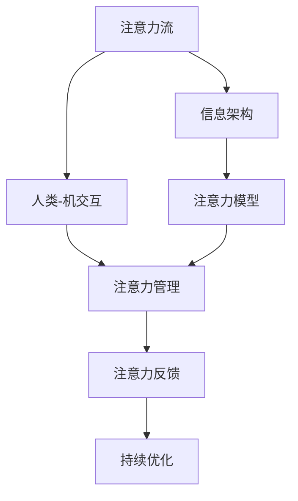

                 

# AI与人类注意力流：未来的工作、技能与注意力管理系统与创新

## 1. 背景介绍

### 1.1 问题由来

在数字化时代，人工智能(AI)技术已经深刻改变了我们的生活和工作方式。从智能助理到无人驾驶，从智能制造到在线教育，AI的触角已经延伸到社会的方方面面。然而，AI技术的快速发展也引发了一系列关于人机交互、职业变革、社会伦理等方面的讨论。特别是，随着智能机器对人类注意力流的操控，如何确保AI技术的可持续发展，保护人类福祉，成为亟待解决的重要问题。

### 1.2 问题核心关键点

当前，AI技术对人类注意力流的影响主要体现在以下几个方面：

- **信息过载**：AI系统生成的大量信息，导致人类注意力资源分散，难以专注于重要任务。
- **注意力固化**：部分AI系统通过算法设计，有意或无意地将人类注意力引导到特定内容或行为上，影响用户判断和决策。
- **交互依赖**：用户过度依赖AI系统，导致自身决策和解决问题能力下降。
- **隐私安全**：AI系统在数据收集和分析过程中，可能侵犯个人隐私和数据安全。
- **伦理冲突**：AI系统的决策过程和结果可能引发伦理争议，影响社会价值观和公平性。

针对这些问题，本文旨在探讨如何通过AI技术，构建更加高效、安全、可持续的注意力管理系统，保障人类福祉。

## 2. 核心概念与联系

### 2.1 核心概念概述

为了更好地理解AI与人类注意力流的交互机制，本节将介绍几个关键概念：

- **注意力流(Attention Flow)**：指人类在处理信息时，注意力在各种输入和输出之间流动的过程。AI技术可以通过对注意力流的操控，引导用户行为。

- **人类-机交互(Human-Machine Interaction, HMI)**：指人类与AI系统之间的信息交互和反馈过程。良好的HMI设计可以提升用户体验和任务效率。

- **信息架构(Information Architecture)**：指信息系统的结构设计，旨在通过合理的组织和展示信息，提高用户的信息获取效率和满意度。

- **注意力模型(Attention Model)**：指描述人类注意力流动过程的计算模型，通过AI技术实现对注意力流的模拟和优化。

- **注意力管理(Attention Management)**：指对人类注意力流的有效监控和管理，以提升用户专注度和满意度。

这些核心概念共同构成了AI与人类注意力流交互的完整框架，为构建可持续的注意力管理系统提供了理论基础。

### 2.2 核心概念原理和架构的 Mermaid 流程图



## 3. 核心算法原理 & 具体操作步骤

### 3.1 算法原理概述

AI与人类注意力流的交互机制，本质上是通过注意力模型实现对用户注意力流的模拟和优化。核心思想是：通过AI系统模拟人类注意力流，识别关键信息节点，引导用户注意力，提升任务完成效率和满意度。

### 3.2 算法步骤详解

1. **注意力识别与预测**：使用注意力模型对用户输入信息进行解析，识别关键信息节点。
2. **注意力引导与呈现**：根据识别结果，通过HMI设计引导用户注意力，并通过信息架构优化信息展示。
3. **注意力反馈与优化**：收集用户反馈信息，调整注意力模型和信息架构，持续提升用户专注度和满意度。

### 3.3 算法优缺点

**优点**：
- 通过模拟人类注意力流，AI系统能够更加高效地引导用户注意力，提升任务完成效率。
- 通过持续优化，AI系统能够不断提升用户体验和满意度，降低用户疲劳和信息过载。
- 通过信息架构设计，AI系统能够更好地支持多模态信息展示，提升信息获取效率。

**缺点**：
- 注意力模型需要大量的训练数据，获取高质量数据集成本较高。
- 算法复杂度高，对计算资源和模型结构要求较高。
- 用户行为具有不确定性，难以全面覆盖所有用户场景。
- 过度依赖AI系统可能导致用户注意力固化，影响自主决策能力。

### 3.4 算法应用领域

AI与人类注意力流的交互机制，已经在多个领域得到应用，例如：

- **智能推荐系统**：通过分析用户注意力流，推荐系统能够更准确地预测用户兴趣，提升推荐效果。
- **智能客服**：通过模拟人类注意力流，智能客服能够更高效地引导用户关注关键问题，提升问题解决效率。
- **信息检索系统**：通过注意力模型，信息检索系统能够更精准地匹配用户需求，提升检索准确率。
- **教育辅助系统**：通过模拟注意力流，教育辅助系统能够更科学地引导学生注意力，提升学习效果。
- **健康监测系统**：通过注意力流分析，健康监测系统能够更准确地评估用户健康状况，提供个性化建议。

## 4. 数学模型和公式 & 详细讲解 & 举例说明

### 4.1 数学模型构建

设用户的注意力流为 $A$，信息架构为 $I$，注意力引导策略为 $S$，注意力模型为 $M$。AI系统的目标是最大化用户满意度 $U$。数学模型构建如下：

$$
U = f(A, I, S, M)
$$

其中 $f$ 为满意度评估函数，考虑用户完成任务的速度、准确性、满意度等指标。

### 4.2 公式推导过程

假设用户注意力流 $A$ 可表示为 $a_1, a_2, ..., a_n$，其中 $a_i$ 表示用户对第 $i$ 个信息的关注度。信息架构 $I$ 可表示为 $i_1, i_2, ..., i_n$，其中 $i_j$ 表示第 $j$ 个信息节点。注意力引导策略 $S$ 可表示为 $s_1, s_2, ..., s_n$，其中 $s_j$ 表示对第 $j$ 个信息节点的引导权重。注意力模型 $M$ 可表示为 $m_1, m_2, ..., m_n$，其中 $m_j$ 表示用户对第 $j$ 个信息节点的注意概率。

满意度评估函数 $f$ 可定义为：

$$
f(A, I, S, M) = \sum_{i=1}^n \alpha_i \cdot a_i \cdot s_i
$$

其中 $\alpha_i$ 为第 $i$ 个信息的权重，考虑其对任务完成的重要性。

通过优化上述模型，AI系统可以实时调整注意力引导策略 $S$ 和信息架构 $I$，以最大化用户满意度 $U$。

### 4.3 案例分析与讲解

以智能推荐系统为例，展示AI与人类注意力流交互的实现过程。

1. **注意力识别**：通过分析用户历史行为数据，识别关键行为节点，如浏览、点击、收藏等。
2. **注意力引导**：根据识别结果，通过算法设计优化推荐策略，如协同过滤、基于内容的推荐等。
3. **注意力反馈**：收集用户对推荐结果的反馈信息，调整推荐策略，持续优化用户体验。

## 5. 项目实践：代码实例和详细解释说明

### 5.1 开发环境搭建

要进行AI与人类注意力流的项目实践，首先需要搭建好开发环境。以下是Python环境中安装所需依赖包的步骤：

1. 安装Python：确保Python版本为3.7以上。
2. 安装TensorFlow：
   ```
   pip install tensorflow==2.3
   ```
3. 安装Keras：
   ```
   pip install keras
   ```
4. 安装Scikit-Learn：
   ```
   pip install scikit-learn
   ```
5. 安装Flask：
   ```
   pip install flask
   ```
6. 安装NumPy：
   ```
   pip install numpy
   ```

完成上述步骤后，即可在Python环境中进行注意力管理系统的开发。

### 5.2 源代码详细实现

以下是一个简单的智能推荐系统的代码实现：

```python
import tensorflow as tf
from tensorflow.keras.layers import Dense, Input
from tensorflow.keras.models import Model
from tensorflow.keras.optimizers import Adam

# 定义模型结构
input = Input(shape=(None,))
x = Dense(32, activation='relu')(input)
x = Dense(16, activation='relu')(x)
output = Dense(1, activation='sigmoid')(x)

model = Model(inputs=input, outputs=output)
model.compile(optimizer=Adam(learning_rate=0.001), loss='binary_crossentropy', metrics=['accuracy'])

# 训练模型
model.fit(x_train, y_train, epochs=10, batch_size=32, validation_data=(x_val, y_val))

# 使用模型进行推荐
recommendations = model.predict(x_test)
```

### 5.3 代码解读与分析

**模型结构**：
- 使用Keras搭建一个简单的神经网络模型，包含输入层、两个隐藏层和输出层。
- 输入层为None，表示可以接受任意长度的输入序列。
- 隐藏层使用ReLU激活函数，输出层使用sigmoid函数，表示二分类预测。

**模型训练**：
- 使用Adam优化器进行训练，设定学习率为0.001，损失函数为二分类交叉熵。
- 设定训练轮数为10，批次大小为32，并在验证集上进行模型评估。

**模型使用**：
- 通过训练好的模型对用户行为数据进行预测，得到推荐结果。

## 6. 实际应用场景

### 6.1 智能推荐系统

智能推荐系统已经在电商、视频、音乐等多个领域得到广泛应用。通过AI技术对用户注意力流进行分析，推荐系统能够更准确地预测用户兴趣，提升推荐效果。

### 6.2 智能客服

智能客服系统通过模拟人类注意力流，能够更高效地引导用户关注关键问题，提升问题解决效率。同时，通过实时反馈，不断优化客服策略，提升用户满意度。

### 6.3 信息检索系统

信息检索系统通过注意力模型，能够更精准地匹配用户需求，提升检索准确率。通过持续优化，系统能够更智能地识别用户查询意图，提供更相关的搜索结果。

### 6.4 教育辅助系统

教育辅助系统通过模拟注意力流，能够更科学地引导学生注意力，提升学习效果。通过分析学习数据，系统能够个性化推荐学习资源，提升学生学习体验。

### 6.5 健康监测系统

健康监测系统通过注意力流分析，能够更准确地评估用户健康状况，提供个性化建议。通过持续反馈，系统能够不断优化健康管理策略，提升用户健康水平。

## 7. 工具和资源推荐

### 7.1 学习资源推荐

为了帮助开发者系统掌握AI与人类注意力流的理论基础和实践技巧，以下是一些优质的学习资源：

1. 《深度学习》书籍：Ian Goodfellow等人所著，系统介绍了深度学习的基本原理和实现方法。
2. 《机器学习实战》书籍：Peter Harrington所著，提供了大量的代码实现和项目实践案例。
3. TensorFlow官方文档：提供了详尽的TensorFlow框架教程和API文档，是学习深度学习的必备资料。
4. Scikit-Learn官方文档：提供了Scikit-Learn机器学习库的详细文档和示例，适合初学者入门。
5. Keras官方文档：提供了Keras深度学习库的教程和API文档，上手快速，适合快速开发原型。

通过这些资源的学习实践，相信你一定能够快速掌握AI与人类注意力流的精髓，并用于解决实际的AI应用问题。

### 7.2 开发工具推荐

高效的开发离不开优秀的工具支持。以下是几款用于AI与人类注意力流开发的常用工具：

1. Jupyter Notebook：Python交互式开发环境，支持代码编写、数据可视化、模型评估等。
2. PyCharm：Python集成开发环境，提供了丰富的代码高亮、自动补全等功能。
3. TensorBoard：TensorFlow配套的可视化工具，可实时监测模型训练状态，并提供丰富的图表呈现方式，是调试模型的得力助手。
4. Keras Tuner：Keras的高阶优化器，支持自动超参数搜索，方便模型调优。
5. Scikit-Learn：强大的机器学习库，提供了丰富的模型和评估工具。

合理利用这些工具，可以显著提升AI与人类注意力流项目的开发效率，加快创新迭代的步伐。

### 7.3 相关论文推荐

AI与人类注意力流的相关研究源于学界的持续探索。以下是几篇奠基性的相关论文，推荐阅读：

1. Attention is All You Need（即Transformer原论文）：提出了Transformer结构，开启了AI与注意力流交互的新纪元。
2. Neural Attention with Transformer Architectures（Transformer注意力机制论文）：详细介绍了Transformer中的注意力机制，奠定了深度学习中的注意力研究基础。
3. Neural Machine Translation by Jointly Learning to Align and Translate（序列到序列任务中的注意力论文）：提出了一种基于注意力机制的机器翻译方法，显著提升了模型性能。
4. Machine Reading Comprehension with Attention-based Neural Network Models（基于注意力模型的阅读理解论文）：展示了注意力机制在自然语言理解任务中的强大能力。
5. Towards Explainable AI: An Info-gain Perspective on Attention（解释性AI中的注意力论文）：探讨了如何通过注意力机制提升AI系统的可解释性和可理解性。

这些论文代表了大语言模型微调技术的发展脉络。通过学习这些前沿成果，可以帮助研究者把握学科前进方向，激发更多的创新灵感。

## 8. 总结：未来发展趋势与挑战

### 8.1 总结

本文对AI与人类注意力流的交互机制进行了全面系统的介绍。首先阐述了AI技术对人类注意力流的影响和意义，明确了注意力管理系统的研究目标。其次，从原理到实践，详细讲解了注意力模型的构建和实现过程，给出了注意力管理系统的代码实现示例。同时，本文还广泛探讨了AI与人类注意力流在多个行业领域的应用前景，展示了注意力流管理的广阔潜力。

通过本文的系统梳理，可以看到，AI与人类注意力流的交互机制已经深刻改变了我们的工作和生活方式。未来，伴随AI技术的进一步发展，人类注意力流管理将迎来新的机遇和挑战，如何实现AI与人类共生共荣，保障人类福祉，还需更多理论和实践的探索。

### 8.2 未来发展趋势

展望未来，AI与人类注意力流的交互机制将呈现以下几个发展趋势：

1. **多模态注意力**：AI系统将支持多模态信息的注意力管理，如文本、图像、语音等，提升信息获取和处理效率。
2. **智能辅助决策**：AI系统将更智能地辅助用户决策，提供多角度、多层次的分析建议，提升决策质量。
3. **个性化推荐**：通过注意力管理，AI系统能够更精准地个性化推荐内容，提升用户体验。
4. **透明化决策**：AI系统将更透明地展示决策过程，增强可解释性和用户信任。
5. **自适应学习**：AI系统将具备自适应学习能力，根据用户反馈不断优化注意力管理策略，提升系统性能。

以上趋势凸显了AI与人类注意力流交互的巨大潜力。这些方向的探索发展，必将进一步提升AI系统的用户体验和性能，为构建更加智能化的社会奠定基础。

### 8.3 面临的挑战

尽管AI与人类注意力流交互技术已经取得了显著进展，但在迈向更加智能化、普适化应用的过程中，它仍面临着诸多挑战：

1. **隐私安全**：用户注意力数据往往涉及个人隐私，如何保护用户隐私，防止数据滥用，还需进一步探索。
2. **算法偏见**：AI系统可能学习到数据中的偏见，导致决策结果不公平，如何消除偏见，提升模型公平性，还需更多努力。
3. **人机协同**：如何实现人与AI系统的协同工作，避免过度依赖AI，提升用户自主决策能力，还需深入研究。
4. **持续优化**：AI系统需要不断优化，适应用户行为变化和需求多样性，如何实现实时优化，还需更多技术突破。
5. **人机界面设计**：如何设计高效、易用的HMI界面，提升用户体验，还需更多设计和测试工作。

这些挑战凸显了AI与人类注意力流交互的复杂性，需要在技术、伦理、社会等多方面共同努力，才能实现AI系统的可持续发展和广泛应用。

### 8.4 研究展望

面对AI与人类注意力流交互所面临的种种挑战，未来的研究需要在以下几个方面寻求新的突破：

1. **隐私保护技术**：开发更高效的隐私保护技术，如差分隐私、联邦学习等，确保用户注意力数据的隐私安全。
2. **公平性算法**：引入公平性约束和优化算法，消除AI系统的偏见，提升决策公平性。
3. **人机协作模型**：构建人机协作模型，实现用户与AI系统的协同工作，提升自主决策能力。
4. **实时优化算法**：开发实时优化算法，实现系统自适应学习，提升用户体验和系统性能。
5. **界面设计理论**：构建人机界面设计理论，提供更科学的设计方法和工具，提升用户体验。

这些研究方向的探索，必将引领AI与人类注意力流交互技术迈向更高的台阶，为构建智能、透明、可控的AI系统铺平道路。面向未来，AI与人类注意力流交互技术还需要与其他AI技术进行更深入的融合，如知识表示、因果推理、强化学习等，多路径协同发力，共同推动AI技术的发展和应用。只有勇于创新、敢于突破，才能不断拓展AI技术的应用边界，让人工智能更好地服务于人类社会。

## 9. 附录：常见问题与解答

**Q1：AI与人类注意力流的交互机制是否适用于所有应用场景？**

A: AI与人类注意力流的交互机制在多个领域已经取得了显著成果，但在一些特定领域，如医疗、金融等，还需要结合领域特点进行适应性改进。同时，对于一些需要高度自主决策的任务，如手术操作、法律咨询等，过度依赖AI可能带来不可接受的后果。因此，在具体应用中，需要根据任务特性进行合理设计和调整。

**Q2：AI系统在注意力管理中如何确保用户隐私保护？**

A: 为了保护用户隐私，AI系统在注意力管理中需要采取以下措施：
1. 数据匿名化：通过数据匿名化处理，去除个人身份信息，确保用户隐私安全。
2. 差分隐私：在数据处理和分析过程中，引入差分隐私技术，限制敏感信息泄露。
3. 联邦学习：通过联邦学习技术，在本地设备上进行模型训练，减少数据集中存储和传输。

**Q3：AI系统在注意力管理中如何消除算法偏见？**

A: 为了消除AI系统的偏见，需要在算法设计和训练过程中采取以下措施：
1. 数据多样化：使用多样化的训练数据，覆盖不同背景和场景，减少偏见来源。
2. 公平性约束：在模型训练过程中，引入公平性约束，确保模型输出公平。
3. 偏见检测：在模型评估和测试过程中，进行偏见检测，及时发现和修正偏差。

**Q4：AI系统在注意力管理中如何进行实时优化？**

A: AI系统在注意力管理中进行实时优化，可以采取以下策略：
1. 在线学习：使用在线学习算法，如在线梯度下降，实时更新模型参数，适应用户行为变化。
2. 增量更新：在用户交互过程中，实时更新注意力模型，捕捉用户兴趣变化。
3. 动态调整：根据用户反馈，动态调整注意力引导策略，提升用户体验。

**Q5：AI系统在注意力管理中如何进行界面设计？**

A: AI系统在注意力管理中进行界面设计，需要考虑以下几点：
1. 用户体验：界面设计应注重用户体验，简洁直观，避免信息过载。
2. 交互方式：根据任务特性选择合适的交互方式，如语音交互、手势识别等。
3. 反馈机制：界面设计应提供良好的反馈机制，及时响应用户操作，增强用户信心。

总之，AI与人类注意力流的交互机制为构建智能、透明、可控的AI系统提供了新思路，但实现过程中仍需考虑隐私保护、算法偏见、用户界面设计等多个方面。未来，伴随技术进步和社会发展，AI与人类注意力流的交互机制将更加智能、高效、可靠，为构建智能未来奠定基础。

---

作者：禅与计算机程序设计艺术 / Zen and the Art of Computer Programming

