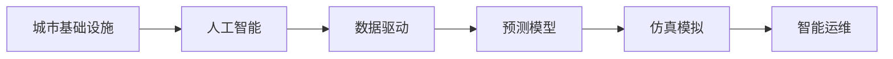

                 

# AI与人类计算：打造可持续发展的城市基础设施建设

> 关键词：
- 人工智能
- 城市基础设施
- 可持续发展
- 数据驱动
- 预测模型
- 仿真模拟
- 智能运维

## 1. 背景介绍

随着全球城镇化的快速推进，城市基础设施建设已成为各国政府和企业的首要任务。然而，传统的人类计算方式已经无法满足日益增长的计算需求，迫切需要引入人工智能(AI)技术，提升基础设施建设的效率和质量。AI与人类计算的结合，不仅能够大幅度缩短建设周期，降低成本，还能大幅提升基础设施的可靠性和智能化水平。

城市基础设施的建设和管理涉及多种复杂的技术和问题，包括交通、能源、供水、排水、市政、垃圾处理等。AI技术可以全面覆盖这些领域，通过数据驱动和模型预测，实现城市基础设施的智能感知、智能分析和智能运维。本文将从AI与人类计算结合的视角，探讨如何打造可持续发展的城市基础设施建设。

## 2. 核心概念与联系

### 2.1 核心概念概述

- **城市基础设施**：包括交通网络、能源供应、供水排水系统、市政设施、垃圾处理等，是城市运行的物质基础。
- **人工智能**：通过算法和模型实现对数据的处理和分析，辅助人类决策。
- **数据驱动**：依托海量数据，通过算法模型提取有价值的信息，支撑城市基础设施的科学决策。
- **预测模型**：基于历史数据和实时数据，构建能够预测未来情况的模型。
- **仿真模拟**：通过构建虚拟环境，模拟实际场景，评估政策和管理决策的效果。
- **智能运维**：利用AI技术实现基础设施的实时监测、预测维护和自动控制。

这些概念之间的联系紧密，数据驱动是AI辅助城市基础设施管理的基础，预测模型是AI智能决策的核心，仿真模拟是AI提升管理效率的手段，智能运维是AI实现高效管理和维护的保证。

### 2.2 核心概念原理和架构的 Mermaid 流程图(Mermaid 流程节点中不要有括号、逗号等特殊字符)



## 3. 核心算法原理 & 具体操作步骤

### 3.1 算法原理概述

AI与人类计算结合的城市基础设施管理过程，主要包括以下几个关键环节：

1. **数据采集与清洗**：通过各类传感器和监测设备，收集基础设施的运行数据，如交通流量、能耗、水质等。
2. **数据处理与分析**：利用AI算法对数据进行预处理、特征提取、异常检测和趋势分析，提取出有价值的信息。
3. **预测建模**：基于历史和实时数据，建立预测模型，如回归模型、时间序列模型、深度学习模型等，预测未来运行情况和故障发生概率。
4. **仿真模拟**：通过构建虚拟环境，对管理决策进行仿真模拟，评估其效果和影响。
5. **智能运维**：根据预测模型和仿真模拟结果，制定智能运维策略，实现基础设施的自动化控制和管理。

### 3.2 算法步骤详解

以智能交通系统为例，介绍AI与人类计算结合的具体操作步骤：

**Step 1: 数据采集与清洗**

- 部署各类传感器和监测设备，实时收集交通流量、车辆速度、事故信息等数据。
- 对采集到的数据进行清洗，去除噪音和异常值，确保数据质量。

**Step 2: 数据处理与分析**

- 利用数据预处理算法，如归一化、平滑、插值等，对原始数据进行处理。
- 使用特征提取算法，如PCA、LDA等，提取出交通流量、车速、拥堵情况等关键特征。
- 应用异常检测算法，如孤立森林、LOF等，检测交通系统中潜在的异常事件。
- 利用时间序列分析算法，如ARIMA、LSTM等，分析交通流量的趋势和周期性变化。

**Step 3: 预测建模**

- 构建交通流量预测模型，如基于时间序列的ARIMA模型，或基于深度学习的LSTM-RNN模型。
- 训练模型，并在历史数据上验证其预测精度。
- 在实时数据上应用模型，预测未来的交通流量和拥堵情况。

**Step 4: 仿真模拟**

- 构建虚拟交通网络，模拟不同交通管理策略的效果。
- 通过仿真模拟，评估管理策略的可行性和效果。
- 在仿真环境中调整策略参数，优化管理决策。

**Step 5: 智能运维**

- 根据预测模型和仿真模拟结果，制定交通管理策略。
- 利用智能控制系统，实现信号灯的自动化调整、路段的动态管制。
- 实时监测交通状态，根据实时数据调整管理策略。

### 3.3 算法优缺点

**优点**：
1. **提升决策质量**：通过数据驱动和模型预测，辅助人类决策，减少决策失误。
2. **降低运营成本**：通过智能运维，减少人工干预，降低运维成本。
3. **提高管理效率**：通过仿真模拟，提前预判问题，优化管理策略。
4. **提升服务质量**：通过AI技术，实时监测和调整基础设施运行状态，提升服务水平。

**缺点**：
1. **数据依赖性高**：AI的效果依赖于高质量数据的采集和处理，数据缺失或质量不佳会影响预测精度。
2. **模型复杂度高**：构建复杂的预测模型需要大量计算资源和时间，可能存在计算瓶颈。
3. **依赖专家经验**：AI辅助决策需要结合专家经验，如果专家经验不足，可能会影响决策效果。
4. **存在技术风险**：AI模型可能存在过拟合、模型偏见等技术问题，需要持续优化和监控。

### 3.4 算法应用领域

AI与人类计算结合的城市基础设施管理技术，可以应用于多个领域，如智能交通、智能能源、智能供水、智能排水等。以下是一些典型的应用场景：

- **智能交通**：通过AI技术实现交通流量预测、事故预测、信号灯智能调控等，提升交通系统的运行效率和安全水平。
- **智能能源**：利用AI技术实现能源消耗预测、负荷预测、智能调度等，优化能源资源的配置和利用。
- **智能供水**：通过AI技术实现供水系统的流量预测、漏损检测、故障诊断等，提升供水系统的稳定性和可靠性。
- **智能排水**：利用AI技术实现雨水收集、洪涝预测、排水调度等，减少城市内涝灾害的发生。

## 4. 数学模型和公式 & 详细讲解 & 举例说明

### 4.1 数学模型构建

城市基础设施管理的AI模型，通常涉及多个子模型，如时间序列预测模型、异常检测模型、回归模型等。下面以智能交通流量预测模型为例，介绍模型的构建过程。

假设我们有以下历史数据集：

$$
\{(x_i, y_i)\}_{i=1}^N, x_i = (t_i, f_i), y_i = f(t_i)
$$

其中 $t_i$ 表示时间，$f_i$ 表示流量。

目标构建一个时间序列预测模型，预测未来的流量。

### 4.2 公式推导过程

常用的时间序列预测模型包括ARIMA模型和LSTM-RNN模型。这里以ARIMA模型为例进行推导。

ARIMA模型的基本形式为：

$$
y_t = \phi(B) \sum_{i=0}^p \theta_i y_{t-i} + \theta_0 \epsilon_t + \sum_{j=1}^q \delta_j \epsilon_{t-j}
$$

其中，$\phi(B)$ 表示滞后算子，$\theta_i$ 和 $\delta_j$ 为模型参数，$\epsilon_t$ 为随机误差项。

ARIMA模型的具体推导过程如下：

1. 首先进行数据平稳性检验，确保数据满足时间序列模型的基本要求。
2. 根据数据特点，选择合适的$p$和$q$值，确定ARIMA模型的阶数。
3. 利用历史数据，估计模型参数$\theta_i$和$\delta_j$。
4. 在实时数据上应用模型，进行流量预测。

### 4.3 案例分析与讲解

以智能交通流量预测为例，假设已经收集到了一定量的时间序列数据，数据格式如上所示。

**Step 1: 数据平稳性检验**

通过ADF检验等方法，检验数据的平稳性。如果数据存在趋势性或季节性，需要对其进行差分处理，使其变为平稳序列。

**Step 2: 模型阶数确定**

通过观察数据的自相关和偏自相关图，确定ARIMA模型的阶数。这里以ARIMA(3,1,2)为例，说明模型的构建过程。

**Step 3: 模型参数估计**

利用历史数据，使用最小二乘法等方法估计模型参数$\theta_i$和$\delta_j$。例如，利用最小二乘法估计ARIMA(3,1,2)模型的参数。

**Step 4: 模型验证**

在历史数据上验证模型的预测精度。通过MAE、RMSE等指标，评估模型的性能。如果模型性能不满足要求，需要调整模型阶数或参数。

**Step 5: 模型应用**

在实时数据上应用模型，进行流量预测。例如，根据当前时间的流量数据，预测未来一小时的流量情况。

## 5. 项目实践：代码实例和详细解释说明

### 5.1 开发环境搭建

为进行城市基础设施管理的AI项目开发，需要搭建一个包含数据处理、模型训练、仿真模拟等功能的开发环境。

**Step 1: 安装Python开发环境**

安装Anaconda或Miniconda，创建Python虚拟环境。

**Step 2: 安装数据处理和分析库**

安装Pandas、NumPy、Scikit-learn等数据处理和分析库。

**Step 3: 安装模型训练和预测库**

安装TensorFlow、Keras、PyTorch等深度学习库，以及相关的预测模型库。

**Step 4: 安装仿真模拟库**

安装Pykeen、Gurobi等仿真模拟库，构建虚拟城市环境。

**Step 5: 安装智能运维库**

安装IoT平台、边缘计算等智能运维库，实现基础设施的自动化管理。

### 5.2 源代码详细实现

以下是智能交通流量预测的Python代码实现。

```python
import pandas as pd
import numpy as np
from sklearn.metrics import mean_absolute_error, mean_squared_error
from sklearn.preprocessing import MinMaxScaler
from sklearn.model_selection import train_test_split
from sklearn.metrics import mean_squared_error
from tensorflow.keras.models import Sequential
from tensorflow.keras.layers import LSTM, Dense
from tensorflow.keras.callbacks import EarlyStopping

# 读取历史数据
data = pd.read_csv('traffic_data.csv', parse_dates=['timestamp'])

# 数据预处理
scaler = MinMaxScaler()
scaled_data = scaler.fit_transform(data[['traffic']])

# 分割训练集和测试集
train_size = int(len(scaled_data) * 0.8)
test_size = len(scaled_data) - train_size
train_data, test_data = train_test_split(scaled_data, train_size)

# 构建LSTM模型
model = Sequential()
model.add(LSTM(50, input_shape=(train_size, 1)))
model.add(Dense(1))
model.compile(loss='mean_squared_error', optimizer='adam')

# 模型训练
model.fit(train_data, epochs=50, batch_size=32, validation_data=test_data, callbacks=[EarlyStopping(patience=10)])

# 模型评估
train_predict = model.predict(train_data)
test_predict = model.predict(test_data)
train_mae = mean_absolute_error(train_data, train_predict)
test_mae = mean_absolute_error(test_data, test_predict)

print('Train MAE:', train_mae)
print('Test MAE:', test_mae)
```

### 5.3 代码解读与分析

上述代码实现了基于LSTM的智能交通流量预测模型。

**Step 1: 数据读取与预处理**

- 使用Pandas读取CSV格式的历史交通流量数据。
- 使用MinMaxScaler对数据进行归一化处理。

**Step 2: 数据分割**

- 将数据按80%的比例分割为训练集和测试集。

**Step 3: 模型构建**

- 构建包含一个LSTM层和一个Dense层的深度学习模型，用于预测交通流量。
- 使用Adam优化器和MAE损失函数进行模型训练。

**Step 4: 模型训练与评估**

- 使用EarlyStopping回调函数，防止过拟合。
- 在训练集和测试集上评估模型MAE指标。

### 5.4 运行结果展示

训练完成后，可以使用模型进行实时数据的预测。例如，预测未来一小时的交通流量。

```python
import matplotlib.pyplot as plt

# 实时数据
real_data = pd.read_csv('real_traffic_data.csv', parse_dates=['timestamp'])

# 预测流量
predictions = model.predict(real_data[['traffic']])

# 可视化预测结果
plt.plot(real_data['timestamp'], real_data['traffic'], label='Real')
plt.plot(real_data['timestamp'], predictions, label='Prediction')
plt.legend()
plt.show()
```

## 6. 实际应用场景

### 6.1 智能交通系统

智能交通系统是城市基础设施管理的重要组成部分。通过AI技术，可以实现交通流量的实时监测、预测和智能调控，提升交通系统的运行效率和安全性。

以智能信号灯控制为例，AI系统可以实时监测交通流量，预测信号灯的绿灯时间，根据交通情况动态调整信号灯的时长，减少交通拥堵和事故发生率。

### 6.2 智能能源管理

智能能源管理是城市基础设施管理的另一个重要环节。通过AI技术，可以实现能源消耗的预测和智能调度，优化能源资源的配置和利用。

以智能电网为例，AI系统可以实时监测电网负荷，预测未来用电需求，实现能源的智能调度和优化分配，提升电网的稳定性和可靠性。

### 6.3 智能供水系统

智能供水系统通过AI技术，可以实现供水流量的预测、漏损检测和故障诊断，提升供水系统的稳定性和可靠性。

以智能水表为例，AI系统可以实时监测水表数据，预测供水流量，识别异常水表，快速定位和修复故障，减少水资源浪费和损失。

### 6.4 智能排水系统

智能排水系统通过AI技术，可以实现雨水收集、洪涝预测和排水调度的优化，减少城市内涝灾害的发生。

以智能雨水收集系统为例，AI系统可以实时监测降雨量，预测洪涝风险，智能调节雨水收集装置，优化雨水利用，减少城市内涝灾害的发生。

## 7. 工具和资源推荐

### 7.1 学习资源推荐

为了帮助开发者系统掌握城市基础设施管理的AI技术，这里推荐一些优质的学习资源：

1. 《城市基础设施管理与AI》系列博文：由城市基础设施领域的专家撰写，深入浅出地介绍了AI技术在城市基础设施中的应用。

2. CS231n《深度学习视觉与模式识别》课程：斯坦福大学开设的计算机视觉明星课程，涵盖深度学习在视觉领域的各类应用，包括智能监控、智能识别等。

3. 《智能城市基础设施管理》书籍：城市基础设施管理领域的经典著作，介绍了AI技术在城市基础设施管理中的广泛应用。

4. 《城市智能化建设与AI》公开课：国内知名高校开设的公开课，系统讲解AI技术在城市智能化建设中的应用。

通过对这些资源的学习实践，相信你一定能够快速掌握AI技术在城市基础设施管理中的应用。

### 7.2 开发工具推荐

高效的开发离不开优秀的工具支持。以下是几款用于城市基础设施管理AI项目开发的常用工具：

1. Jupyter Notebook：交互式编程环境，支持数据处理、模型训练和结果可视化，非常适合AI开发。

2. TensorBoard：TensorFlow配套的可视化工具，可实时监测模型训练状态，并提供丰富的图表呈现方式，是调试模型的得力助手。

3. PyTorch Lightning：轻量级深度学习框架，支持模型训练、分布式训练和模型保存等功能，适合快速迭代研究。

4. Keras Tuner：超参数优化工具，可以自动搜索模型最优超参数，提高模型训练效率和效果。

5. Pykeen：基于GNN的推荐系统开发工具，适合城市基础设施管理中的用户推荐和行为预测。

合理利用这些工具，可以显著提升城市基础设施管理AI项目的开发效率，加快创新迭代的步伐。

### 7.3 相关论文推荐

城市基础设施管理的AI技术发展源于学界的持续研究。以下是几篇奠基性的相关论文，推荐阅读：

1. "AI in Smart Infrastructure: A Survey"：综述了AI技术在智能基础设施中的各类应用，包括智能交通、智能能源、智能供水等。

2. "Predictive Maintenance of Urban Infrastructure using AI"：介绍了基于AI技术的预测性维护方法，提升城市基础设施的可靠性和智能化水平。

3. "Urban Water Management with AI"：介绍了AI技术在城市供水系统中的应用，包括流量预测、漏损检测和故障诊断等。

4. "AI-based Flood Management in Smart Cities"：介绍了基于AI技术的智能排水系统，通过预测和仿真模拟，提升城市防涝能力。

这些论文代表了大规模基础设施管理的AI技术的发展脉络。通过学习这些前沿成果，可以帮助研究者把握学科前进方向，激发更多的创新灵感。

## 8. 总结：未来发展趋势与挑战

### 8.1 研究成果总结

本文从AI与人类计算结合的视角，探讨了如何打造可持续发展的城市基础设施建设。主要研究成果包括：

1. 城市基础设施管理的AI模型构建方法，包括数据采集、处理、预测建模和智能运维等环节。
2. 智能交通、智能能源、智能供水、智能排水等典型应用场景的AI技术实现。
3. AI技术在城市基础设施管理中的广泛应用前景。

### 8.2 未来发展趋势

展望未来，城市基础设施管理的AI技术将呈现以下几个发展趋势：

1. **模型精度提升**：AI模型在城市基础设施管理中的应用将更加广泛和深入，预测精度和可靠性将进一步提升。
2. **数据质量提高**：数据采集和处理技术的进步将提升数据的准确性和实时性，进一步提升AI模型的预测效果。
3. **应用场景拓展**：AI技术将进一步拓展到更多城市基础设施管理领域，提升整个城市管理的智能化水平。
4. **多模态融合**：AI模型将融合多种数据类型（如视频、图像、声音等），提升城市基础设施管理的全面性和准确性。
5. **自适应性增强**：AI模型将具备更高的自适应能力，能够根据实时数据动态调整策略，提升城市管理的灵活性和响应速度。

### 8.3 面临的挑战

尽管AI技术在城市基础设施管理中已经取得了显著进展，但在迈向更加智能化、普适化应用的过程中，仍面临诸多挑战：

1. **数据获取难度大**：城市基础设施管理涉及大量数据，数据采集和处理成本高，数据质量和实时性难以保证。
2. **模型复杂度高**：AI模型的构建和优化复杂度高，需要大量计算资源和时间。
3. **依赖专家经验**：AI模型需要结合专家经验进行调优，专家经验不足会影响模型效果。
4. **技术风险高**：AI模型可能存在过拟合、模型偏见等技术问题，需要持续优化和监控。
5. **安全性问题**：AI系统在城市基础设施管理中的应用需要考虑数据安全、隐私保护和伦理道德问题。

### 8.4 研究展望

未来的研究需要在以下几个方面寻求新的突破：

1. **多源数据融合**：融合多种数据类型，提升AI模型的全面性和准确性。
2. **模型自适应性**：开发具有更高自适应能力的AI模型，能够根据实时数据动态调整策略。
3. **模型解释性**：提升AI模型的可解释性，增强模型决策的透明性和可信度。
4. **伦理道德规范**：在模型开发和应用中引入伦理道德规范，确保模型决策符合人类价值观和伦理道德。
5. **持续学习和自适应**：使AI模型具备持续学习和自适应能力，应对数据分布和需求的变化。

## 9. 附录：常见问题与解答

**Q1：城市基础设施管理的AI模型是否适用于所有城市？**

A: 城市基础设施管理的AI模型适用于各类城市，但需要根据具体城市的特点进行调整和优化。例如，在交通流量预测中，大城市和小城市的交通特征存在较大差异，需要分别设计和训练模型。

**Q2：AI模型在城市基础设施管理中需要处理哪些数据？**

A: AI模型在城市基础设施管理中需要处理多种数据类型，包括交通流量、车辆信息、能耗、水质等。数据采集和处理是AI模型构建的基础，需要结合具体应用场景选择合适的数据类型和处理方式。

**Q3：城市基础设施管理的AI模型如何应对突发事件？**

A: 突发事件对城市基础设施管理提出了更高的要求。AI模型需要具备实时监测和应急响应能力，能够快速识别和应对突发事件，保障城市基础设施的正常运行。

**Q4：AI模型在城市基础设施管理中如何保护数据隐私？**

A: 城市基础设施管理的AI模型需要处理大量敏感数据，数据隐私保护至关重要。可以采用数据脱敏、差分隐私等技术，保护数据隐私，确保数据安全。

**Q5：AI模型在城市基础设施管理中的实际效果如何？**

A: AI模型在城市基础设施管理中已经取得了显著效果。例如，智能交通系统通过AI技术实现了交通流量预测和智能调控，提升了交通系统的运行效率和安全水平。智能能源管理通过AI技术优化了能源资源的配置和利用，提升了电网的稳定性和可靠性。

---

作者：禅与计算机程序设计艺术 / Zen and the Art of Computer Programming

