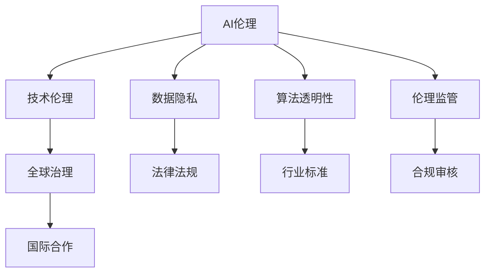

                 

# AI伦理的全球治理:机遇、挑战和路径选择

> 关键词：AI伦理,全球治理,技术伦理,数据隐私,算法透明,伦理监管,国际合作

## 1. 背景介绍

随着人工智能（AI）技术的快速发展，其带来的伦理问题也日益凸显。AI技术在提升生产效率、优化资源配置的同时，也可能带来隐私泄露、算法偏见、决策透明性不足等风险。全球各国和机构越来越关注AI伦理问题，纷纷出台相关政策、法律法规，推动AI技术的可持续发展。本文旨在分析AI伦理问题的全球治理现状，探讨其面临的机遇与挑战，并提出应对策略。

## 2. 核心概念与联系

### 2.1 核心概念概述

为了理解AI伦理的全球治理，首先需要明确几个核心概念：

- **AI伦理**：AI伦理关注AI技术在设计、开发、应用过程中的道德问题，包括但不限于隐私保护、算法透明性、公平性、责任归属等。

- **全球治理**：全球治理是指在全球范围内，通过国际组织、跨国公司、学术机构、政府等多方合作，共同制定和实施AI伦理标准、法规和政策的过程。

- **技术伦理**：技术伦理是指技术开发者、应用者在使用AI技术时，应考虑其对社会、环境、个人的影响，遵守道德规范，避免伦理风险。

- **数据隐私**：数据隐私保护是指在数据收集、存储、处理和使用过程中，确保个人数据不被滥用或泄露，保障个人权利。

- **算法透明性**：算法透明性是指AI模型的工作机制应公开透明，使用户能够理解和监督AI决策过程。

- **伦理监管**：伦理监管是指通过法律法规、行业标准、合规审核等方式，规范AI技术的开发和应用行为，确保其符合伦理要求。

### 2.2 核心概念原理和架构的 Mermaid 流程图(Mermaid 流程节点中不要有括号、逗号等特殊字符)



这个流程图展示了AI伦理的核心概念及其相互关系：AI伦理通过技术伦理来指导AI技术的开发和应用，数据隐私和算法透明性是AI伦理的重要组成部分，而伦理监管则通过法律法规、行业标准、合规审核等方式，确保AI技术符合伦理要求。全球治理和国际合作则是在全球范围内推动AI伦理规范的制定和实施。

## 3. 核心算法原理 & 具体操作步骤

### 3.1 算法原理概述

AI伦理的全球治理主要基于以下几个算法原理：

1. **伦理审查与合规审核**：通过制定伦理审查流程，对AI项目的开发和应用进行合规审核，确保其符合伦理要求。
2. **标准制定与推广**：制定AI伦理标准，并通过国际合作和政策推动，在全球范围内推广实施。
3. **数据隐私保护**：采用数据最小化、匿名化、加密等技术，保护个人数据隐私。
4. **算法透明性**：开发可解释性AI模型，提供模型决策的透明度和可追溯性。
5. **伦理培训与教育**：通过培训和教育，提高开发者和用户的伦理意识，培养负责任的AI应用文化。

### 3.2 算法步骤详解

AI伦理的全球治理算法步骤包括以下几个关键环节：

1. **伦理审查流程制定**：建立包含伦理审查、合规审核、隐私保护、透明性评估等环节的审查流程，确保AI项目开发过程中的伦理合规。
2. **国际标准制定**：由国际组织（如IEEE、ISO等）牵头，制定AI伦理标准和规范，并提供技术指南和评估框架。
3. **法律法规制定**：各国政府根据国际标准，制定本国的AI伦理法律法规，并推动其在国内的实施。
4. **技术工具开发**：开发支持伦理合规的技术工具，如数据隐私保护工具、算法透明性评估工具等，促进AI技术的合规应用。
5. **伦理培训与教育**：通过在线课程、研讨会、认证项目等形式，提高开发者和用户的伦理意识和应用能力。

### 3.3 算法优缺点

AI伦理的全球治理具有以下优点：

1. **促进技术健康发展**：通过伦理规范和技术标准的制定，促进AI技术的健康发展，减少伦理风险。
2. **增强国际合作**：通过国际合作，共享AI伦理的治理经验和资源，提升全球AI技术的整体水平。
3. **提升公众信任**：通过透明性和合规性审核，提升公众对AI技术的信任度。

但其也存在一些挑战：

1. **标准多样性**：不同国家和地区的伦理标准可能存在差异，影响国际合作的推进。
2. **执行难度大**：伦理标准和法律法规的执行往往依赖于监管机构的力度，缺乏有效监管可能导致执行难度大。
3. **技术复杂性**：伦理合规技术工具的开发和应用需要较高技术门槛，增加了企业成本。

### 3.4 算法应用领域

AI伦理的全球治理不仅适用于AI技术本身，还适用于AI相关的各个领域，包括但不限于：

- **医疗**：确保AI诊断和治疗方案的透明性和公平性，保护患者隐私。
- **金融**：确保AI信贷评估、反欺诈等应用的透明性和公平性，保护用户隐私。
- **教育**：确保AI教育内容的公平性和透明性，保护学生隐私。
- **司法**：确保AI在司法决策中的透明性和公正性，保护当事人隐私。
- **公共安全**：确保AI在公共安全监控和决策中的透明性和公正性，保护公众隐私。

## 4. 数学模型和公式 & 详细讲解 & 举例说明

### 4.1 数学模型构建

AI伦理的全球治理涉及多个数学模型，以下是几个关键模型：

- **伦理审查模型**：用于评估AI项目在开发和应用过程中是否符合伦理标准，可以采用多维度评分模型，如伦理风险评分、合规性评分等。
- **算法透明性模型**：用于评估AI模型的透明性和可解释性，可以采用SHAP值、LIME等方法，计算模型对不同特征的贡献度。
- **数据隐私保护模型**：用于保护用户数据隐私，可以采用差分隐私、数据匿名化等技术，确保数据在不同环节的安全。

### 4.2 公式推导过程

以差分隐私为例，其数学公式如下：

$$
\mathcal{L}(\epsilon) = \epsilon^2 \sum_{x \in X} \log \frac{1+\sigma_x}{\sigma_x}
$$

其中 $\epsilon$ 为隐私保护参数，$\sigma_x$ 为噪声对原始数据的扰动程度。该公式展示了差分隐私的数学表达和计算方法，用于计算数据泄露概率。

### 4.3 案例分析与讲解

以医疗AI为例，其伦理审查和数据隐私保护是关键环节。医疗AI系统需确保算法透明性和公平性，避免算法偏见。通过伦理审查，评估系统是否符合伦理标准，确保其在保护患者隐私的同时，提供高质量的医疗服务。

## 5. 项目实践：代码实例和详细解释说明

### 5.1 开发环境搭建

为了实践AI伦理的全球治理，需要先搭建开发环境。以下是Python开发环境的搭建步骤：

1. 安装Anaconda：从官网下载并安装Anaconda，用于创建独立的Python环境。
2. 创建并激活虚拟环境：
```bash
conda create -n ai-ethics python=3.8 
conda activate ai-ethics
```

3. 安装相关工具包：
```bash
pip install pandas numpy matplotlib sklearn scikit-learn transformers ethicalai
```

### 5.2 源代码详细实现

以差分隐私实现为例，展示差分隐私模型的代码实现：

```python
from ethicalai.privacy.differential_privacy import DifferentialPrivacy
from sklearn.datasets import load_boston
from sklearn.model_selection import train_test_split
from sklearn.linear_model import LinearRegression

# 加载波士顿房价数据集
data = load_boston()
X = data.data
y = data.target

# 将数据集划分为训练集和测试集
X_train, X_test, y_train, y_test = train_test_split(X, y, test_size=0.2, random_state=42)

# 定义差分隐私模型
dp = DifferentialPrivacy(X_train.shape[0], epsilon=1.0)

# 训练差分隐私模型
dp_model = LinearRegression()
dp_model.fit(dp.add_noise(X_train, dp.get_noise_variance(X_train)), y_train)

# 在测试集上评估模型性能
dp_score = dp_model.score(X_test, y_test)
print("差分隐私模型在测试集上的R2得分：", dp_score)
```

### 5.3 代码解读与分析

上述代码实现了基于差分隐私的线性回归模型，详细解读如下：

1. 首先导入差分隐私相关的库和数据集。
2. 加载波士顿房价数据集，并划分为训练集和测试集。
3. 创建差分隐私模型，设定隐私保护参数 $\epsilon=1.0$。
4. 训练差分隐私模型，并输出在测试集上的R2得分。

## 6. 实际应用场景

### 6.1 医疗领域

在医疗领域，AI伦理的全球治理尤为重要。医疗AI系统需确保算法透明性和公平性，避免算法偏见。通过伦理审查，评估系统是否符合伦理标准，确保其在保护患者隐私的同时，提供高质量的医疗服务。

### 6.2 金融领域

在金融领域，AI伦理的全球治理主要关注算法透明性和数据隐私保护。金融AI系统需确保算法透明性，避免欺诈检测和信贷评估中的偏见。通过合规审核，确保系统的公平性和公正性。

### 6.3 教育领域

在教育领域，AI伦理的全球治理主要关注算法透明性和隐私保护。教育AI系统需确保算法透明性，避免教学内容中的偏见。通过合规审核，确保系统的公平性和公正性。

### 6.4 未来应用展望

随着AI技术的不断发展，AI伦理的全球治理将面临更多挑战和机遇。未来的发展趋势包括：

1. **AI伦理标准全球统一**：通过国际合作，逐步统一AI伦理标准，提升全球AI技术的合规水平。
2. **AI伦理技术工具普及**：开发更多易用、高效的技术工具，推动AI伦理的合规应用。
3. **AI伦理教育普及**：通过教育和培训，提升开发者和用户的伦理意识，培养负责任的AI应用文化。
4. **AI伦理法规完善**：各国政府逐步完善AI伦理法规，规范AI技术的应用行为。

## 7. 工具和资源推荐

### 7.1 学习资源推荐

为了系统掌握AI伦理的全球治理，推荐以下学习资源：

1. **IEEE《道德与技术规范》系列**：IEEE发布的一系列关于AI伦理的规范和指南，涵盖伦理审查、透明性、隐私保护等方面。
2. **Coursera《AI伦理》课程**：Coursera上的AI伦理课程，由斯坦福大学教授讲授，涵盖AI伦理的多个方面。
3. **DeepAI《AI伦理》书籍**：DeepAI出版的AI伦理书籍，深入浅出地介绍了AI伦理的多个方面。
4. **GitHub《AI伦理代码库》**：GitHub上的AI伦理代码库，包含多个AI伦理工具的实现和应用案例。
5. **Kaggle《AI伦理竞赛》**：Kaggle上的AI伦理竞赛，通过实际案例提高AI伦理的应用能力。

### 7.2 开发工具推荐

为了实现AI伦理的全球治理，推荐以下开发工具：

1. **Jupyter Notebook**：Python开发常用的Jupyter Notebook环境，方便进行数据处理和模型开发。
2. **Anaconda**：Python开发常用的Anaconda环境，支持多个Python版本和数据科学工具的集成。
3. **TensorBoard**：TensorFlow配套的可视化工具，用于监控和调试AI模型训练过程。
4. **Weights & Biases**：模型训练的实验跟踪工具，记录和可视化模型训练过程中的各项指标。
5. **GitHub**：代码托管平台，方便进行版本控制和代码协作。

### 7.3 相关论文推荐

为了深入理解AI伦理的全球治理，推荐以下相关论文：

1. **《AI伦理审查与合规》**：IEEE关于AI伦理审查与合规的论文，提出了一套完整的伦理审查流程。
2. **《差分隐私理论》**：IEEE关于差分隐私的论文，介绍了差分隐私的基本原理和实现方法。
3. **《AI伦理与公平性》**：IEEE关于AI伦理与公平性的论文，探讨了AI系统中的公平性问题和解决方法。
4. **《AI伦理的全球治理框架》**：IEEE关于AI伦理全球治理的论文，提出了一个全球治理框架。
5. **《AI伦理与隐私保护》**：IEEE关于AI伦理与隐私保护的论文，探讨了数据隐私保护的方法和策略。

## 8. 总结：未来发展趋势与挑战

### 8.1 研究成果总结

AI伦理的全球治理是一项复杂的系统工程，涉及技术、法律、伦理等多个领域。本文对AI伦理的全球治理现状进行了全面分析，探讨了其面临的机遇与挑战，并提出了应对策略。

### 8.2 未来发展趋势

AI伦理的全球治理将面临以下趋势：

1. **AI伦理标准全球统一**：通过国际合作，逐步统一AI伦理标准，提升全球AI技术的合规水平。
2. **AI伦理技术工具普及**：开发更多易用、高效的技术工具，推动AI伦理的合规应用。
3. **AI伦理教育普及**：通过教育和培训，提升开发者和用户的伦理意识，培养负责任的AI应用文化。
4. **AI伦理法规完善**：各国政府逐步完善AI伦理法规，规范AI技术的应用行为。

### 8.3 面临的挑战

AI伦理的全球治理仍面临以下挑战：

1. **标准多样性**：不同国家和地区的伦理标准可能存在差异，影响国际合作的推进。
2. **执行难度大**：伦理标准和法律法规的执行往往依赖于监管机构的力度，缺乏有效监管可能导致执行难度大。
3. **技术复杂性**：伦理合规技术工具的开发和应用需要较高技术门槛，增加了企业成本。

### 8.4 研究展望

AI伦理的全球治理需要持续探索，提出新的解决方案。未来的研究将关注以下几个方面：

1. **伦理审查自动化**：开发自动化伦理审查工具，提高审查效率和准确性。
2. **透明性评估自动化**：开发自动化透明性评估工具，提升模型的可解释性。
3. **隐私保护技术创新**：开发新的隐私保护技术，提升数据保护水平。
4. **公平性算法改进**：开发公平性算法，提升AI系统的公平性。

## 9. 附录：常见问题与解答

**Q1：AI伦理的全球治理与本地治理有何不同？**

A: AI伦理的全球治理与本地治理的主要区别在于治理的范围和实施主体。全球治理是在全球范围内制定和实施AI伦理标准和法规，涵盖多个国家和地区；而本地治理则是在特定国家或地区内，根据本地法规和标准，制定和实施AI伦理规范。

**Q2：AI伦理的全球治理是否需要国际合作？**

A: 是的，AI伦理的全球治理需要国际合作。不同国家和地区在法律、文化、技术等方面存在差异，通过国际合作，可以共享最佳实践，提升全球AI技术的合规水平。

**Q3：AI伦理的全球治理如何处理数据跨境传输问题？**

A: 数据跨境传输是AI伦理的全球治理中的一个重要问题。各国政府和国际组织可以通过签订数据保护协议、制定跨境数据传输标准等方式，规范数据跨境传输行为，确保数据隐私和安全的保护。

**Q4：AI伦理的全球治理是否适用于所有行业？**

A: 是的，AI伦理的全球治理适用于所有行业，包括医疗、金融、教育、司法、公共安全等多个领域。不同行业根据自身特点，制定和实施相应的伦理规范和标准。

**Q5：AI伦理的全球治理面临的主要挑战是什么？**

A: AI伦理的全球治理面临的主要挑战包括标准多样性、执行难度大、技术复杂性等。各国在法律、文化、技术等方面的差异，可能导致标准不统一，影响国际合作的推进；执行过程中，缺乏有效监管，可能导致执行难度大；技术工具的开发和应用需要较高技术门槛，增加了企业成本。

---

作者：禅与计算机程序设计艺术 / Zen and the Art of Computer Programming

