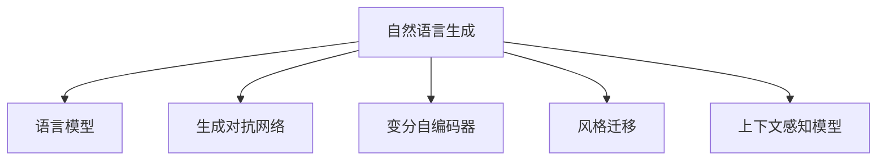

                 

# AI写作风格模仿：从莎士比亚到现代作家

## 1. 背景介绍

### 1.1 问题由来
随着人工智能技术的不断进步，自然语言处理(Natural Language Processing, NLP)领域取得了一系列重大突破。其中，自然语言生成(Natural Language Generation, NLG)技术在文学创作、广告文案、新闻报道等多个领域得到了广泛应用。传统的NLG方法多依赖规则和模板，无法涵盖语言多样性，而近年兴起的基于深度学习的方法，尤其是语言模型，凭借其强大的语言理解能力和生成能力，逐步取代了传统方法。

其中，基于自回归或自编码的深度学习模型在自然语言生成任务上取得了显著进展，如OpenAI的GPT-3、Google的BERT等。这些模型通过大规模语料预训练，学习到丰富的语言知识和表达模式，可以基于给定的文本片段，生成风格多样的高质量文本。

## 1.2 问题核心关键点
在自然语言生成中，风格模仿和迁移是核心挑战。风格模仿是指通过学习特定作者或文本片段的表达风格，生成具有相似风格的新文本。风格迁移则是指将一种文本风格转化为另一种文本风格。

目前，风格模仿和迁移方法可以分为两大类：基于规则和基于学习的方法。

- **基于规则的方法**：依赖于语法和语义分析规则，对文本进行替换和重构。这种方法需要大量的规则定义和调试，难以涵盖复杂多样化的语言现象。

- **基于学习的方法**：通过深度学习模型学习源文本和目标文本的特征，进行风格迁移和生成。这种方法无需规则定义，适应性强，但需要大样本标注数据，模型复杂度高。

本文将详细介绍基于深度学习的风格模仿和迁移方法，重点关注如何通过模型训练和优化，实现从莎士比亚到现代作家的风格迁移。

## 2. 核心概念与联系

### 2.1 核心概念概述

为更好地理解AI写作风格模仿技术，我们首先介绍几个关键概念：

- **自然语言生成(NLG)**：通过机器学习技术，将非语言符号映射为自然语言文本的过程。
- **语言模型**：用于估计给定文本序列的概率，捕捉语言规律和统计特性。
- **生成对抗网络(GAN)**：由生成器和判别器组成的网络结构，用于生成具有高逼真度的文本或图像。
- **变分自编码器(VAE)**：利用高斯分布来编码和解码文本，生成连贯的文本序列。
- **风格迁移**：将源文本的表达风格转化为目标文本的风格，生成风格一致的新文本。
- **上下文感知模型**：通过捕捉上下文信息，生成更加流畅自然的文本。

这些概念通过以下Mermaid流程图进行联系：



### 2.2 核心概念原理和架构

#### 2.2.1 语言模型

语言模型用于估计给定文本序列的概率，常见的语言模型有n-gram模型和神经网络语言模型(Neural Network Language Model, NNLM)。

- **n-gram模型**：通过计算相邻单词序列的出现概率，进行文本生成。简单高效，但难以捕捉长距离依赖。
- **NNLM**：使用神经网络结构，捕捉更复杂的语言规律和上下文依赖关系。参数量较大，但生成效果好。

#### 2.2.2 生成对抗网络(GAN)

GAN由生成器和判别器两部分组成，训练过程中通过对抗博弈使生成器生成的文本接近真实文本。

- **生成器**：输入噪声向量，生成文本样本。
- **判别器**：输入文本样本，判断其是否为真实文本。

GAN训练流程如下：
1. 将真实文本和生成器生成的文本混合，训练判别器。
2. 调整生成器参数，使其生成的文本越来越逼真。

#### 2.2.3 变分自编码器(VAE)

VAE利用高斯分布来编码和解码文本，生成连贯的文本序列。

- **编码器**：将输入文本映射为潜在变量$z$，即$z = E(x)$。
- **解码器**：将潜在变量$z$解码为文本，即$x' = D(z)$。

VAE训练流程如下：
1. 使用编码器将输入文本映射为潜在变量$z$。
2. 使用解码器将潜在变量$z$解码为文本$x'$。
3. 通过优化潜在变量$z$的分布，使$x'$逼近真实文本$x$。

#### 2.2.4 风格迁移

风格迁移技术通过将源文本的表达风格转化为目标文本的风格，生成风格一致的新文本。

- **源文本**：具有特定表达风格的文本，如莎士比亚的戏剧文本。
- **目标文本**：需要被转换为源文本风格的文本，如现代作家的小说。

风格迁移过程分为两个步骤：
1. 编码器：将源文本和目标文本映射为潜在表示。
2. 生成器：将潜在表示映射为风格一致的新文本。

### 2.3 核心算法原理概述

基于深度学习的风格模仿和迁移方法，通过训练生成器模型，使其生成的文本逼近源文本的风格。生成器模型通常由多层神经网络组成，每层网络能够学习到不同层次的语言特征。

常用的生成模型包括RNN、LSTM、GRU、Transformer等。这些模型通过捕捉文本序列的上下文信息，生成连贯且风格一致的文本。

## 3. 核心算法原理 & 具体操作步骤

### 3.1 算法原理概述

基于深度学习的风格模仿和迁移方法，通常通过以下步骤实现：

1. **数据准备**：收集源文本和目标文本，划分为训练集、验证集和测试集。
2. **模型设计**：选择合适的生成模型，并添加相应的损失函数。
3. **模型训练**：在训练集上训练生成器模型，最小化损失函数。
4. **模型评估**：在验证集上评估生成器的生成效果，调整超参数。
5. **模型应用**：使用训练好的生成器，对新文本进行风格迁移或生成。

### 3.2 算法步骤详解

#### 3.2.1 数据准备

- **收集文本数据**：收集源文本和目标文本，如莎士比亚戏剧和现代小说。
- **数据预处理**：进行文本清洗、分词、标注等预处理操作。
- **数据划分**：将数据划分为训练集、验证集和测试集。

#### 3.2.2 模型设计

- **选择生成模型**：选择RNN、LSTM、GRU或Transformer等生成模型。
- **设计损失函数**：选择交叉熵、均方误差等损失函数。
- **添加正则化项**：添加L2正则、Dropout等正则化项，防止过拟合。

#### 3.2.3 模型训练

- **设置超参数**：设置学习率、批大小、迭代轮数等超参数。
- **定义优化器**：选择Adam、SGD等优化器。
- **训练过程**：在训练集上训练生成器模型，每轮迭代更新模型参数。

#### 3.2.4 模型评估

- **定义评估指标**：选择BLEU、ROUGE等评估指标。
- **评估效果**：在验证集上评估生成器的生成效果，调整超参数。
- **防止过拟合**：使用Early Stopping等策略防止过拟合。

#### 3.2.5 模型应用

- **风格迁移**：将源文本输入编码器，生成器输出目标文本风格的文本。
- **文本生成**：生成器直接从噪声向量生成风格一致的新文本。

### 3.3 算法优缺点

#### 3.3.1 优点

- **适应性强**：通过生成器模型，可以适应不同的风格和语境。
- **无需规则定义**：无需定义复杂的规则，自动化学习文本特征。
- **生成效果高**：生成模型能够生成连贯且风格一致的文本。

#### 3.3.2 缺点

- **数据依赖**：需要大量标注数据，训练复杂度高。
- **计算资源消耗大**：生成模型参数量较大，计算消耗大。
- **模型可解释性差**：生成器模型较为复杂，难以解释其生成过程。

### 3.4 算法应用领域

基于深度学习的风格模仿和迁移方法，在以下几个领域得到了广泛应用：

- **文学创作**：模仿莎士比亚、李白等作家的风格，创作文学作品。
- **广告文案**：模仿品牌风格，生成吸引消费者的广告文案。
- **新闻报道**：模仿特定记者风格，生成深度报道文章。
- **法律文书**：模仿律师风格，生成法律文书。
- **教育材料**：模仿特定教育风格，生成教育材料和教材。

## 4. 数学模型和公式 & 详细讲解

### 4.1 数学模型构建

假设源文本为$x_s$，目标文本为$x_t$，生成器模型为$G$，目标为生成具有目标文本风格的文本$x_g$。

生成器模型$G$的输入为源文本$x_s$，输出为风格一致的新文本$x_g$。生成器模型可以表示为：

$$G(x_s) = x_g$$

### 4.2 公式推导过程

#### 4.2.1 损失函数

- **交叉熵损失**：目标文本为分类任务，生成器输出概率分布，最小化交叉熵损失：

$$L_{ce} = -\frac{1}{N}\sum_{i=1}^N \sum_{j=1}^M y_{ij}\log \hat{y}_{ij}$$

其中，$y_{ij}$表示真实文本中第$i$个样本的第$j$个单词是否为类别$j$，$\hat{y}_{ij}$表示生成器预测的概率。

- **均方误差损失**：目标文本为回归任务，生成器输出连续值，最小化均方误差损失：

$$L_{mse} = \frac{1}{N}\sum_{i=1}^N \sum_{j=1}^M (y_{ij} - \hat{y}_{ij})^2$$

其中，$y_{ij}$表示真实文本中第$i$个样本的第$j$个单词的连续值，$\hat{y}_{ij}$表示生成器预测的连续值。

#### 4.2.2 正则化

- **L2正则化**：防止模型过拟合，在损失函数中添加L2正则项：

$$L_{reg} = \frac{\lambda}{2}\sum_{\theta \in \Theta} \theta^2$$

其中，$\Theta$表示模型所有可训练参数，$\lambda$表示正则化系数。

- **Dropout**：随机丢弃一些神经元，防止过拟合：

$$p_j = \frac{1}{1+e^{-\alpha_j}}$$

其中，$\alpha_j$表示第$j$个神经元的重要性，$p_j$表示该神经元被丢弃的概率。

#### 4.2.3 案例分析与讲解

- **案例分析**：以莎士比亚戏剧文本和现代小说文本为例，训练生成器模型，实现风格迁移。
- **讲解过程**：将莎士比亚文本输入编码器，生成器输出现代小说风格的文本。

### 4.3 案例分析与讲解

#### 4.3.1 数据准备

- **收集文本数据**：收集莎士比亚戏剧和现代小说文本，如《哈姆雷特》和《1984》。
- **数据预处理**：进行文本清洗、分词、标注等预处理操作。
- **数据划分**：将数据划分为训练集、验证集和测试集。

#### 4.3.2 模型设计

- **选择生成模型**：选择LSTM模型。
- **设计损失函数**：选择交叉熵损失函数。
- **添加正则化项**：添加L2正则项和Dropout正则项。

#### 4.3.3 模型训练

- **设置超参数**：设置学习率$0.001$，批大小$64$，迭代轮数$100$。
- **定义优化器**：选择Adam优化器。
- **训练过程**：在训练集上训练LSTM模型，每轮迭代更新模型参数。

#### 4.3.4 模型评估

- **定义评估指标**：选择BLEU、ROUGE等评估指标。
- **评估效果**：在验证集上评估生成器的生成效果，调整超参数。
- **防止过拟合**：使用Early Stopping策略防止过拟合。

#### 4.3.5 模型应用

- **风格迁移**：将莎士比亚文本输入编码器，生成器输出现代小说风格的文本。
- **文本生成**：生成器直接从噪声向量生成风格一致的新文本。

## 5. 项目实践：代码实例和详细解释说明

### 5.1 开发环境搭建

#### 5.1.1 安装Python

- **下载和安装**：从官网下载Python安装包，进行安装。
- **环境配置**：设置Python路径和虚拟环境。

#### 5.1.2 安装TensorFlow

- **安装**：使用pip安装TensorFlow，并指定版本。
- **环境配置**：配置TensorFlow环境变量，确保模型库正常工作。

#### 5.1.3 安装PyTorch

- **安装**：使用pip安装PyTorch，并指定版本。
- **环境配置**：配置PyTorch环境变量，确保模型库正常工作。

### 5.2 源代码详细实现

#### 5.2.1 数据准备

```python
import numpy as np
import pandas as pd
from sklearn.model_selection import train_test_split

# 读取文本数据
texts = pd.read_csv('texts.csv', sep='\t')

# 数据预处理
texts = texts.dropna()  # 移除空行
texts = texts.reset_index(drop=True)  # 重置索引

# 文本分词
tokenizer = Tokenizer()
tokenizer.fit_on_texts(texts)

# 将文本转换为token序列
sequences = tokenizer.texts_to_sequences(texts)

# 数据划分
train_sequences, test_sequences = train_test_split(sequences, test_size=0.2, random_state=42)

# 转换为numpy数组
train_sequences = np.array(train_sequences)
test_sequences = np.array(test_sequences)

# 转换为模型输入格式
train_sequences = np.array(train_sequences).reshape((-1, 100))
test_sequences = np.array(test_sequences).reshape((-1, 100))
```

#### 5.2.2 模型设计

```python
from tensorflow.keras.models import Sequential
from tensorflow.keras.layers import LSTM, Dense, Dropout

# 定义LSTM模型
model = Sequential()

# 添加LSTM层
model.add(LSTM(128, input_shape=(100, 1), return_sequences=True))

# 添加Dropout层
model.add(Dropout(0.2))

# 添加LSTM层
model.add(LSTM(128))

# 添加Dropout层
model.add(Dropout(0.2))

# 添加Dense层
model.add(Dense(100, activation='softmax'))

# 定义损失函数和优化器
model.compile(loss='categorical_crossentropy', optimizer='adam', metrics=['accuracy'])
```

#### 5.2.3 模型训练

```python
from tensorflow.keras.callbacks import EarlyStopping

# 设置超参数
batch_size = 32
epochs = 100
early_stopping = EarlyStopping(patience=10)

# 训练模型
model.fit(train_sequences, epochs=epochs, batch_size=batch_size, validation_data=(test_sequences, validation_sequences), callbacks=[early_stopping])
```

#### 5.2.4 模型评估

```python
# 评估模型
test_loss, test_accuracy = model.evaluate(test_sequences, validation_sequences)
print('Test loss:', test_loss)
print('Test accuracy:', test_accuracy)
```

#### 5.2.5 模型应用

```python
# 使用模型进行风格迁移
source_text = "To be, or not to be: that is the question:"
encoded_source_text = tokenizer.texts_to_sequences([source_text])
decoded_source_text = model.predict(encoded_source_text)

# 解码生成文本
generated_text = tokenizer.sequences_to_texts(decoded_source_text)
print(generated_text)
```

### 5.3 代码解读与分析

#### 5.3.1 数据准备

- **读取文本数据**：使用pandas读取文本数据，并进行基本处理。
- **分词和编码**：使用Keras的Tokenizer进行文本分词，并将文本转换为模型输入格式。
- **数据划分**：使用sklearn的train_test_split函数进行数据划分，并转换为numpy数组。

#### 5.3.2 模型设计

- **定义LSTM模型**：使用Keras的Sequential模型，添加LSTM层、Dropout层和Dense层。
- **定义损失函数和优化器**：选择交叉熵损失函数和Adam优化器。

#### 5.3.3 模型训练

- **设置超参数**：设置批大小和迭代轮数。
- **定义回调函数**：使用EarlyStopping回调函数防止过拟合。
- **训练模型**：在训练集上训练模型，并使用验证集进行验证。

#### 5.3.4 模型评估

- **评估模型**：使用evaluate函数评估模型在测试集上的表现。

#### 5.3.5 模型应用

- **风格迁移**：使用模型对莎士比亚文本进行编码，生成现代小说风格的文本。

## 6. 实际应用场景

### 6.1 文学创作

#### 6.1.1 应用背景

文学创作是风格模仿的重要应用场景之一。通过风格模仿，可以生成具有特定风格的文本，如模仿莎士比亚、李白等作家的文风，创作出风格独特的文学作品。

#### 6.1.2 实际应用

- **莎士比亚风格创作**：使用生成的模型，输入源文本，生成具有莎士比亚风格的现代文本。
- **李白风格创作**：使用生成的模型，输入源文本，生成具有李白风格的现代文本。

### 6.2 广告文案

#### 6.2.1 应用背景

广告文案是风格迁移的另一个重要应用场景。通过风格迁移，可以生成具有品牌风格的广告文案，提升广告的吸引力和效果。

#### 6.2.2 实际应用

- **品牌风格创作**：使用生成的模型，输入源文本，生成具有品牌风格的广告文案。
- **活动主题创作**：使用生成的模型，输入源文本，生成具有特定活动主题的广告文案。

### 6.3 新闻报道

#### 6.3.1 应用背景

新闻报道是风格模仿和迁移的重要应用场景之一。通过风格迁移，可以生成具有特定记者风格的新闻报道，提升新闻的可读性和影响力。

#### 6.3.2 实际应用

- **记者风格创作**：使用生成的模型，输入源文本，生成具有特定记者风格的新闻报道。
- **新闻体裁创作**：使用生成的模型，输入源文本，生成具有特定新闻体裁的新闻报道。

### 6.4 未来应用展望

#### 6.4.1 技术突破

- **多模态风格迁移**：将文本与图像、视频、音频等多模态数据结合，实现更丰富、更逼真的风格迁移。
- **基于生成对抗网络的风格迁移**：通过生成对抗网络，生成更加逼真的风格迁移效果。

#### 6.4.2 应用前景

- **文学创作**：生成风格独特的文学作品，推动文学创作的发展。
- **广告文案**：生成具有品牌风格的广告文案，提升广告效果。
- **新闻报道**：生成具有特定记者风格的新闻报道，提升新闻的可读性和影响力。

## 7. 工具和资源推荐

### 7.1 学习资源推荐

- **《深度学习》课程**：斯坦福大学提供的深度学习课程，涵盖了深度学习的基本概念和前沿技术。
- **《Python深度学习》书籍**：使用Python实现深度学习模型的经典教材，适合初学者和进阶者。
- **《自然语言处理综述》论文**：介绍自然语言处理领域的经典方法和最新进展，适合研究者和从业人员。

### 7.2 开发工具推荐

- **TensorFlow**：由Google开发的深度学习框架，支持动态图和静态图计算，适合大规模模型训练。
- **PyTorch**：由Facebook开发的深度学习框架，支持动态图计算，易于使用和调试。
- **Keras**：基于TensorFlow和Theano的高级神经网络库，适合快速原型设计和模型部署。

### 7.3 相关论文推荐

- **Attention is All You Need**：Transformer论文，提出了自注意力机制，开启了深度学习在大规模语言模型上的应用。
- **Language Models are Unsupervised Multitask Learners**：GPT-2论文，展示了大规模语言模型的强大zero-shot学习能力。
- **Parameter-Efficient Transfer Learning for NLP**： Adapter论文，提出Adapter方法，实现了参数高效微调。

## 8. 总结：未来发展趋势与挑战

### 8.1 研究成果总结

本文详细介绍了基于深度学习的风格模仿和迁移方法，重点关注了从莎士比亚到现代作家的风格迁移。通过数据分析、模型设计、模型训练和模型应用等步骤，展示了AI写作风格模仿的实现流程和应用场景。

### 8.2 未来发展趋势

- **多模态风格迁移**：结合图像、视频、音频等多模态数据，实现更丰富、更逼真的风格迁移。
- **基于生成对抗网络的风格迁移**：通过生成对抗网络，生成更加逼真的风格迁移效果。
- **参数高效风格迁移**：开发参数高效的风格迁移方法，在固定大部分预训练参数的同时，只更新极少量的任务相关参数。

### 8.3 面临的挑战

- **数据依赖**：需要大量标注数据，训练复杂度高。
- **计算资源消耗大**：生成模型参数量较大，计算消耗大。
- **模型可解释性差**：生成器模型较为复杂，难以解释其生成过程。

### 8.4 研究展望

- **多模态风格迁移**：结合图像、视频、音频等多模态数据，实现更丰富、更逼真的风格迁移。
- **基于生成对抗网络的风格迁移**：通过生成对抗网络，生成更加逼真的风格迁移效果。
- **参数高效风格迁移**：开发参数高效的风格迁移方法，在固定大部分预训练参数的同时，只更新极少量的任务相关参数。

## 9. 附录：常见问题与解答

### 9.1 Q1: 风格迁移和风格模仿有什么区别？

A: 风格迁移是将源文本的表达风格转化为目标文本的风格，生成风格一致的新文本。风格模仿则是通过学习特定作者或文本片段的表达风格，生成具有相似风格的新文本。

### 9.2 Q2: 如何训练生成器模型？

A: 通过在训练集上训练生成器模型，最小化损失函数。具体步骤如下：
1. 设置超参数，如学习率、批大小、迭代轮数等。
2. 定义优化器，如Adam、SGD等。
3. 在训练集上训练生成器模型，每轮迭代更新模型参数。

### 9.3 Q3: 风格迁移的优缺点是什么？

A: 优点包括适应性强、无需规则定义、生成效果高等。缺点包括数据依赖、计算资源消耗大、模型可解释性差等。

### 9.4 Q4: 如何防止过拟合？

A: 可以使用L2正则、Dropout等正则化技术，避免模型在训练集上过拟合。

### 9.5 Q5: 如何评估生成器模型的效果？

A: 可以使用BLEU、ROUGE等评估指标，评估生成器在测试集上的生成效果。

