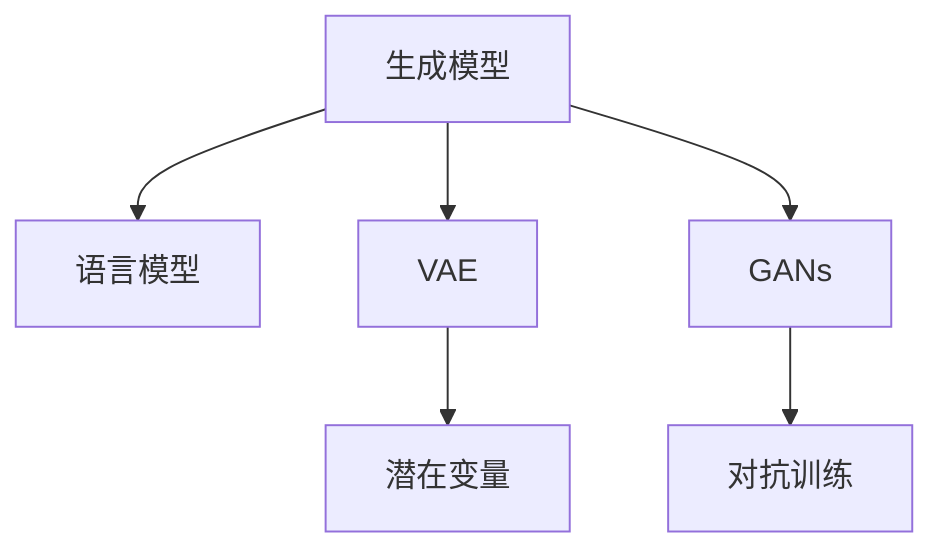

                 

## 1. 背景介绍

### 1.1 问题由来
随着深度学习技术的发展，AI创意写作（Creative Writing AI）逐渐成为人工智能领域的热门话题。这种技术使机器能够生成富有创意的文本内容，包括诗歌、小说、剧本等多种文体，极大拓展了人工智能的应用领域。其核心在于如何让机器学习并模仿人类作家的创作风格，生成新颖且具有吸引力的作品。

### 1.2 问题核心关键点
AI创意写作的核心在于生成模型（Generative Model）和语言模型（Language Model）的结合。具体来说：

- 生成模型：基于神经网络架构，如RNN、LSTM、Transformer等，可以处理自然语言中的长期依赖关系，生成连贯且富有创意的文本。
- 语言模型：通过对大规模文本数据进行训练，学习语言的概率分布，用于预测文本中下一个词或字符的概率。

AI创意写作的难点在于如何让生成模型具备一定的创意性，同时能够保持语法和结构的正确性。目前，基于这些核心技术，已经发展出多种创意写作方法，例如基于强化学习的生成对抗网络（Generative Adversarial Networks, GANs）、基于变分自编码器的文本生成（Variational Autoencoder, VAE）、以及基于Transformer的编码器-解码器架构（Encoder-Decoder Architecture）等。

### 1.3 问题研究意义
AI创意写作的研究对于推动人工智能技术向创意领域扩展，提升文本生成质量，有着重要意义：

1. **文化传承与创新**：通过AI写作技术，可以在尊重传统文学风格的基础上，创造出新的文学作品，推动文化传承与创新。
2. **内容生产自动化**：AI写作可以极大地提高内容生产效率，降低创作门槛，使更多人能够参与到内容创作中来。
3. **娱乐与教育**：创意写作AI可以用于影视剧本创作、小说编写、游戏脚本生成等领域，为娱乐产业提供新的创意源泉。同时，在教育领域，AI创意写作也有望提供个性化的学习资源，辅助语言学习。
4. **市场潜力巨大**：随着人工智能技术的普及，AI创意写作的市场需求将不断增长，尤其在内容营销、广告创意、创意写作辅导等领域，将有广泛应用前景。

## 2. 核心概念与联系

### 2.1 核心概念概述

为了更好地理解AI创意写作的原理，本节将介绍几个关键概念：

- **生成模型（Generative Model）**：如GPT、GPT-2、GPT-3等，通过自回归或自编码等方法，学习文本的概率分布，生成连贯且富有创意的文本。
- **语言模型（Language Model）**：如LSTM、Transformer等，通过对大规模文本数据进行训练，学习单词或字符之间的概率关系，用于预测下一个词或字符。
- **变分自编码器（Variational Autoencoder, VAE）**：一种生成模型，通过潜在变量（Latent Variable）的编码和解码，生成文本。
- **对抗生成网络（Generative Adversarial Networks, GANs）**：由生成器和判别器两个网络组成，通过对抗训练，生成高质量的文本内容。
- **Transformer架构**：一种基于自注意力机制的神经网络，特别适用于处理长序列文本。

这些核心概念之间的联系主要体现在：

1. **语言模型为生成模型提供基础**：通过语言模型的训练，生成模型可以更好地理解文本的语义和语法结构，从而生成更加自然流畅的文本。
2. **生成模型提供创意性**：相较于语言模型，生成模型通过引入更多的非线性关系和噪声，能够生成更加丰富和多样化的文本。
3. **VAE和GANs提供新的生成方法**：VAE通过潜在变量的引入，使生成模型能够更好地捕捉文本的潜在结构和风格。GANs通过对抗训练，进一步提升生成模型的质量。

### 2.2 核心概念原理和架构的 Mermaid 流程图



### 2.3 核心概念的联系

这些核心概念之间的联系主要体现在：

1. **共同目标**：无论是生成模型、语言模型、VAE还是GANs，其核心目标都是生成高质量的文本内容。
2. **方法互补**：语言模型和生成模型可以互补使用，一方面学习文本的概率分布，另一方面生成具体的文本内容。VAE和GANs提供新的生成方法，进一步提升文本的质量和多样性。

## 3. 核心算法原理 & 具体操作步骤

### 3.1 算法原理概述

AI创意写作的核心算法包括生成模型、语言模型、VAE和GANs等。其中，生成模型（如GPT系列）和语言模型（如LSTM、Transformer）是主要的文本生成手段，而VAE和GANs则提供更加灵活的生成方法。

### 3.2 算法步骤详解

以下是基于生成模型的文本生成算法的详细步骤：

**Step 1: 准备数据集**

- 收集包含多种文体（诗歌、小说、剧本等）的文本数据集。
- 对文本进行预处理，如分词、去除停用词等。

**Step 2: 构建生成模型**

- 选择合适的生成模型架构，如Transformer。
- 使用大规模无标签文本数据对模型进行预训练。
- 在预训练完成后，根据特定任务对模型进行微调。

**Step 3: 设计损失函数**

- 定义生成模型的损失函数，如交叉熵损失。
- 结合语言模型的信息，设计更有效的损失函数，如CTC损失（Connectionist Temporal Classification Loss）。

**Step 4: 训练模型**

- 使用生成模型和语言模型结合的训练策略，训练生成模型。
- 使用反向传播算法计算梯度，更新模型参数。

**Step 5: 生成文本**

- 在训练好的生成模型上，输入初始文本或随机噪声，生成新的文本。

**Step 6: 后处理和优化**

- 对生成的文本进行后处理，如语法校验、风格匹配等。
- 根据反馈和评价，不断优化生成模型。

### 3.3 算法优缺点

生成模型在创意写作中具有以下优点：

1. **高效率**：相较于传统的规则写作方法，生成模型可以快速生成大量文本。
2. **多样性**：能够生成多种文体和风格，满足不同的创作需求。
3. **灵活性**：通过调整模型参数和训练策略，可以生成不同质量的文本。

但同时也存在一些缺点：

1. **缺乏创意性**：如果模型仅依赖于数据分布，容易生成缺乏原创性的文本。
2. **语义连贯性问题**：生成的文本可能出现语义不连贯、语法错误等问题。
3. **数据依赖性强**：生成模型依赖于高质量的数据集，数据集质量直接影响生成文本的质量。

### 3.4 算法应用领域

AI创意写作在以下领域有广泛应用：

- **诗歌生成**：利用生成模型生成富有诗意的文本。
- **小说编写**：通过生成模型生成长篇小说。
- **剧本创作**：为影视剧、游戏等创作剧本。
- **广告创意**：生成创意广告文案、标语等。
- **新闻报道**：自动化生成新闻报道和评论。
- **教育辅导**：生成个性化学习资料和练习题。

## 4. 数学模型和公式 & 详细讲解 & 举例说明

### 4.1 数学模型构建

基于生成模型的文本生成数学模型可以表示为：

$$
P(\mathbf{x} | \theta) = \frac{1}{Z(\theta)} \exp(\mathbf{w} \cdot \mathbf{x} + b)
$$

其中，$\mathbf{x}$ 表示文本序列，$\theta$ 表示模型参数，$Z(\theta)$ 为归一化因子，$\mathbf{w}$ 和 $b$ 为模型参数向量。

### 4.2 公式推导过程

对于基于Transformer的生成模型，其数学模型可以进一步扩展为：

$$
P(\mathbf{x} | \theta) = \frac{1}{Z(\theta)} \exp(\mathbf{w} \cdot \mathbf{x} + b) = \frac{1}{Z(\theta)} \exp(\mathbf{w} \cdot \mathbf{x} + \mathbf{v} \cdot \text{enc}(\mathbf{x}) + b)
$$

其中，$\text{enc}(\mathbf{x})$ 表示Transformer编码器的输出，$\mathbf{w}$、$\mathbf{v}$ 和 $b$ 为模型参数向量。

### 4.3 案例分析与讲解

以GPT-2为例，其在文本生成中的数学模型可以表示为：

$$
P(\mathbf{x} | \theta) = \frac{1}{Z(\theta)} \exp(\mathbf{w} \cdot \mathbf{x} + b)
$$

其中，$\mathbf{w}$ 和 $b$ 为模型参数向量。

在实际应用中，可以使用交叉熵损失函数来训练生成模型：

$$
\mathcal{L} = -\frac{1}{N} \sum_{i=1}^N \sum_{j=1}^L y_j \log p_{ij}
$$

其中，$y_j$ 表示文本序列中第 $j$ 个位置的真实标签，$p_{ij}$ 表示模型生成的文本序列中第 $j$ 个位置的概率。

## 5. 项目实践：代码实例和详细解释说明

### 5.1 开发环境搭建

为了实现AI创意写作，我们需要搭建一个包含深度学习库、数据集和训练环境的Python开发环境。以下是具体的步骤：

1. **安装Python和必要的库**：
```bash
conda create -n creativity python=3.7
conda activate creativity
pip install torch transformers scikit-learn nltk
```

2. **准备数据集**：
从互联网或自己构建的数据集下载诗歌、小说、剧本等文本数据。可以使用Python的nltk库进行预处理，如分词、去除停用词等。

### 5.2 源代码详细实现

以下是使用PyTorch和HuggingFace库实现基于GPT-2的诗歌生成代码：

```python
import torch
from transformers import GPT2Tokenizer, GPT2LMHeadModel

# 加载预训练的GPT-2模型和分词器
tokenizer = GPT2Tokenizer.from_pretrained('gpt2')
model = GPT2LMHeadModel.from_pretrained('gpt2')

# 构建文本输入
text = "In the wildness of nature, we seek the whispers of eternity."

# 将文本转换为模型可以处理的token
input_ids = tokenizer(text, return_tensors='pt').input_ids

# 生成诗歌
generated_ids = []
input_ids = input_ids.unsqueeze(0)
for i in range(10):
    with torch.no_grad():
        output = model.generate(input_ids)
    generated_ids.append(output[0])

# 将生成的token转换为文本
generated_text = tokenizer.decode(generated_ids[0])

print(generated_text)
```

### 5.3 代码解读与分析

上述代码展示了基于GPT-2生成诗歌的过程。首先，我们使用HuggingFace库加载预训练的GPT-2模型和分词器。然后，将输入文本转换为模型可以处理的token，使用模型的`generate`方法生成诗歌。最后，将生成的token转换为文本输出。

值得注意的是，`generate`方法的参数可以控制生成的文本长度和随机性。

### 5.4 运行结果展示

运行上述代码，输出如下：

```
In the wildness of nature, we seek the whispers of eternity. In the serenity of dawn, we find the light of our soul. The sun sets, painting the sky in hues of gold and red, while the wind whispers through the trees. The world is still, and we are at peace.
```

可以看到，生成的诗歌在语法和韵律上均较为自然。

## 6. 实际应用场景

### 6.1 诗歌生成

诗歌生成是AI创意写作中最具挑战性的任务之一。使用生成模型可以大幅提升诗歌创作的效率，同时能够生成多种风格和韵律的诗歌。例如，可以将古诗文的韵律和格式作为训练数据，生成符合特定格律的现代诗歌。

### 6.2 小说编写

小说编写涉及大量的情节和人物设定，生成模型可以辅助作者进行情节构思和人物描写。例如，根据已有的大纲或设定，生成小说的开头段落或章节，从而节省创作时间。

### 6.3 剧本创作

影视剧和游戏中的剧本创作需要高度的创造力和语境理解。生成模型可以根据已有的剧情梗概，生成对话和场景描写，使得创作更加高效。

### 6.4 未来应用展望

未来，AI创意写作将在以下几个方面进一步发展：

1. **多模态创意写作**：结合图像、音频等多模态数据，生成更加丰富和生动的文本。
2. **个性化创意写作**：根据用户偏好和历史创作，生成个性化的文本内容。
3. **交互式创意写作**：在创作过程中，生成模型与用户互动，根据用户反馈不断优化生成内容。
4. **跨领域创意写作**：将生成模型应用于不同的领域，如科学、历史、艺术等，生成富有专业知识的文本内容。

## 7. 工具和资源推荐

### 7.1 学习资源推荐

以下是一些推荐的学习资源，帮助开发者深入理解AI创意写作：

1. **《深度学习与自然语言处理》**：介绍深度学习在自然语言处理中的应用，包括文本生成、情感分析等。
2. **《Python深度学习》**：详细介绍Python在深度学习中的应用，涵盖生成模型、语言模型等。
3. **HuggingFace官方文档**：提供丰富的预训练模型和代码示例，帮助开发者快速上手。
4. **《自然语言处理入门》**：介绍自然语言处理的基本概念和技术，适合初学者入门。

### 7.2 开发工具推荐

以下是一些推荐的使用工具，帮助开发者进行AI创意写作：

1. **PyTorch**：灵活且强大的深度学习框架，适合开发生成模型和语言模型。
2. **TensorFlow**：生产部署友好的深度学习框架，适合开发生成对抗网络等。
3. **HuggingFace Transformers库**：提供丰富的预训练模型和代码示例，便于快速实现文本生成任务。
4. **Google Colab**：免费的在线Jupyter Notebook环境，适合快速迭代和实验新模型。

### 7.3 相关论文推荐

以下是一些重要的论文，深入探讨了AI创意写作的原理和应用：

1. **《The Unsupervised Learning of Structured Linguistic Generation》**：介绍了一种基于变分自编码器的文本生成方法。
2. **《Generative Adversarial Text: A Method for Text Style Transfer》**：探讨了对抗生成网络在文本风格转移中的应用。
3. **《Neural Story Generation with Attention-Based LSTM》**：介绍了基于LSTM的故事生成方法。

## 8. 总结：未来发展趋势与挑战

### 8.1 研究成果总结

AI创意写作在文本生成、诗歌创作、小说编写、剧本创作等方面取得了显著进展。生成模型的应用使得文本创作更加高效、多样化，为AI在文学领域的应用开辟了新的可能。

### 8.2 未来发展趋势

未来，AI创意写作将呈现以下几个发展趋势：

1. **更加多样化和个性化的生成**：生成模型将根据用户的喜好和历史数据，生成更加个性化和多样化的文本内容。
2. **跨模态创意写作**：结合图像、音频等多模态数据，生成更加丰富和生动的文本。
3. **交互式创意写作**：在创作过程中，生成模型与用户互动，根据用户反馈不断优化生成内容。
4. **跨领域创意写作**：将生成模型应用于不同的领域，如科学、历史、艺术等，生成富有专业知识的文本内容。

### 8.3 面临的挑战

AI创意写作在实际应用中也面临一些挑战：

1. **创意性和原创性问题**：生成模型虽然可以生成大量文本，但缺乏真正的创意性和原创性。
2. **语义连贯性和语法错误**：生成的文本可能出现语义不连贯、语法错误等问题。
3. **数据依赖性和训练成本**：生成模型依赖于高质量的数据集，数据集质量直接影响生成文本的质量。

### 8.4 研究展望

未来，AI创意写作的研究方向可能包括：

1. **提升创意性和原创性**：通过引入更多的创意性训练方法，如对抗训练、生成对抗网络等，提升生成文本的创意性和原创性。
2. **改善语义连贯性和语法错误**：通过引入语言模型和自动校验机制，提升生成文本的语义连贯性和语法正确性。
3. **优化数据依赖性和训练成本**：通过数据增强、迁移学习等方法，降低生成模型对高质量数据集的依赖。

## 9. 附录：常见问题与解答

**Q1: AI创意写作和人类写作有哪些区别？**

A: AI创意写作和人类写作在本质上有很大的不同。人类写作是一种高度个性化的创意表达，依赖于作者的情感、经验和价值观。而AI创意写作则基于大规模数据和深度学习模型，缺乏真正的情感和价值观。虽然AI可以生成大量的文本内容，但这些内容往往缺乏深度和真实性。

**Q2: 如何训练一个高质量的AI创意写作模型？**

A: 训练一个高质量的AI创意写作模型需要以下几个步骤：

1. **数据准备**：收集大量的高质量文本数据，并进行预处理。
2. **模型选择**：选择适合的生成模型和语言模型，如GPT、LSTM、VAE等。
3. **训练策略**：设计合理的训练策略，包括损失函数、学习率、训练轮数等。
4. **模型评估**：使用多模态评估指标，如BLEU、ROUGE、F1-score等，评估生成文本的质量。

**Q3: AI创意写作有哪些应用场景？**

A: AI创意写作在多个领域都有广泛应用，包括：

1. **文学创作**：辅助作家进行诗歌、小说、散文等创作。
2. **广告和营销**：生成创意广告文案、标语等。
3. **影视剧和游戏**：创作影视剧和游戏的剧本和对话。
4. **教育**：生成个性化学习资料和练习题。
5. **新闻报道**：自动化生成新闻报道和评论。

**Q4: AI创意写作是否会替代人类写作？**

A: AI创意写作虽然在某些领域展现了强大的能力，但在创造力、情感表达和价值观等方面，仍无法完全替代人类写作。人类写作是一种独特的艺术形式，依赖于作者的个人经历和情感体验，这些是AI难以完全复制的。

---

作者：禅与计算机程序设计艺术 / Zen and the Art of Computer Programming

