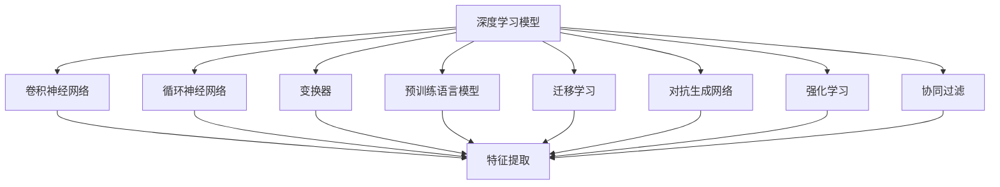

                 

# AI创意激发：突破人类思维局限

## 1. 背景介绍

### 1.1 问题由来

人类思维长期以来依赖于逻辑推理和直觉判断，这种思维模式在处理有序、结构化的数据时表现优异，但在面对复杂、非结构化数据时，便显得力不从心。面对海量数据的冲击，人类的认知能力和直觉判断力正面临严峻的考验。此时，人工智能(AI)技术，特别是深度学习和自然语言处理(NLP)技术，凭借其强大的数据处理能力，开始崭露头角，为人类思维的突破提供了新的可能。

深度学习技术，尤其是大模型和预训练语言模型，通过从海量的无标签数据中学习广泛的语义知识和常识，具备了强大的理解、生成和推理能力。然而，即便在具有强大知识储备的大模型基础上，AI仍面临着思维局限和创意瓶颈的问题。本文旨在探讨如何通过AI技术激发创意，突破人类思维的局限，提升人类创造力，推动科技和社会的发展。

### 1.2 问题核心关键点

AI创意激发的关键在于如何让机器学习和理解复杂的人类思维模式，并在特定场景下模拟和扩展人类的创造力。这一过程涉及到以下核心概念和技术：

- **深度学习模型**：包括卷积神经网络(CNN)、循环神经网络(RNN)、变换器(Transformer)等，用于从数据中提取和抽象特征。

- **预训练语言模型(PLM)**：如GPT、BERT等，通过大规模无标签数据进行预训练，学习语言规律和常识，具备泛化能力。

- **迁移学习**：将一个领域学到的知识，迁移应用到另一个相关领域，以提高泛化能力和效率。

- **对抗生成网络(GANs)**：生成对抗网络，用于生成逼真且具有创意的数据。

- **强化学习**：通过奖励机制，训练模型做出最优决策，模拟人类的认知和决策过程。

- **协同过滤**：通过分析用户行为数据，推荐个性化的内容或物品。

这些概念和技术相辅相成，共同构建了AI创意激发的技术基础。

## 2. 核心概念与联系

### 2.1 核心概念概述

为更好地理解AI创意激发，本节将介绍几个密切相关的核心概念：

- **深度学习模型**：包括卷积神经网络(CNN)、循环神经网络(RNN)、变换器(Transformer)等，用于从数据中提取和抽象特征。

- **预训练语言模型(PLM)**：如GPT、BERT等，通过大规模无标签数据进行预训练，学习语言规律和常识，具备泛化能力。

- **迁移学习**：将一个领域学到的知识，迁移应用到另一个相关领域，以提高泛化能力和效率。

- **对抗生成网络(GANs)**：生成对抗网络，用于生成逼真且具有创意的数据。

- **强化学习**：通过奖励机制，训练模型做出最优决策，模拟人类的认知和决策过程。

- **协同过滤**：通过分析用户行为数据，推荐个性化的内容或物品。

这些核心概念之间的逻辑关系可以通过以下Mermaid流程图来展示：



这个流程图展示了深度学习模型的核心概念及其之间的关系：

1. 深度学习模型包括CNN、RNN、Transformer等，用于提取特征。
2. 卷积神经网络、循环神经网络和变换器分别在图像、序列和时间序列数据上表现优异。
3. 预训练语言模型通过大规模无标签数据进行预训练，学习语言规律和常识。
4. 迁移学习、对抗生成网络和强化学习等技术，在不同场景中模拟和扩展人类的创造力。
5. 协同过滤通过分析用户行为数据，推荐个性化的内容或物品。

这些概念共同构成了AI创意激发的技术框架，使得AI能够模拟和扩展人类的创造力，突破思维的局限。

## 3. 核心算法原理 & 具体操作步骤

### 3.1 算法原理概述

AI创意激发的核心原理是通过深度学习模型和预训练语言模型，模拟和扩展人类的创造力，特别是在处理复杂、非结构化数据时，展示出强大的潜力。该过程通常包括以下几个关键步骤：

1. **数据预处理**：收集和处理各类数据，如文本、图像、音频等，转换为模型可用的格式。

2. **特征提取**：使用深度学习模型提取数据中的特征，包括卷积神经网络、循环神经网络和变换器等。

3. **预训练**：在大规模无标签数据上进行预训练，学习广泛的语言知识、常识和推理能力。

4. **迁移学习**：将预训练模型应用于特定任务或领域，利用迁移学习提高泛化能力和效率。

5. **生成和创造**：使用对抗生成网络、生成对抗网络和协同过滤等技术，生成创意性数据或推荐，突破思维局限。

6. **强化学习**：通过奖励机制训练模型，模拟人类的决策过程，提升创造力和创新能力。

### 3.2 算法步骤详解

以下是基于深度学习模型和预训练语言模型，进行AI创意激发的详细步骤：

**Step 1: 数据收集与预处理**

1. **数据收集**：收集各种形式的数据，如文本、图像、音频等，确保数据的多样性和丰富性。
2. **数据清洗**：去除数据中的噪声和异常值，确保数据的质量。
3. **数据转换**：将数据转换为模型可用的格式，如将图像转换为张量、文本转换为向量等。

**Step 2: 特征提取**

1. **卷积神经网络**：用于处理图像数据，提取图像特征。
2. **循环神经网络**：用于处理序列数据，提取时间序列特征。
3. **变换器**：用于处理文本数据，提取语义特征。

**Step 3: 预训练**

1. **预训练模型**：选择适合的任务或领域，使用大规模无标签数据进行预训练，学习广泛的语言知识和常识。
2. **模型微调**：根据特定任务或领域的需求，对预训练模型进行微调，提高泛化能力和效率。

**Step 4: 迁移学习**

1. **任务适配层**：根据特定任务或领域，设计合适的输出层和损失函数。
2. **模型训练**：使用标注数据对模型进行有监督训练，提高模型在特定任务上的表现。

**Step 5: 生成和创造**

1. **对抗生成网络**：用于生成逼真且具有创意的数据，如生成新的图像、文本等。
2. **生成对抗网络**：结合生成器和判别器，生成具有创意性的数据。
3. **协同过滤**：通过分析用户行为数据，推荐个性化的内容或物品，激发创意。

**Step 6: 强化学习**

1. **环境设计**：设计适合的任务环境，确保任务的多样性和复杂性。
2. **模型训练**：通过奖励机制训练模型，模拟人类的决策过程，提升创造力和创新能力。

### 3.3 算法优缺点

AI创意激发的优点包括：

1. **强大的数据处理能力**：深度学习模型和预训练语言模型能够处理复杂、非结构化数据，突破思维的局限。
2. **高泛化能力**：通过迁移学习，模型能够应用于多种任务和领域，提高泛化能力和效率。
3. **生成和创造能力**：对抗生成网络和生成对抗网络等技术，能够生成具有创意性的数据，激发新的想法。
4. **强化学习**：通过模拟人类的决策过程，提升创造力和创新能力。

然而，该方法也存在一些局限性：

1. **数据需求量大**：需要收集和处理大量的数据，确保数据的质量和多样性。
2. **计算资源要求高**：深度学习模型和预训练语言模型需要大量的计算资源，进行预训练和微调。
3. **结果可解释性不足**：模型通常缺乏可解释性，难以理解和解释其内部工作机制。
4. **伦理和安全问题**：生成对抗网络和协同过滤等技术，可能存在伦理和安全问题，如生成有害内容等。

尽管存在这些局限性，但AI创意激发的巨大潜力使其成为现代科技和社会发展的重要手段，未来的研究应致力于解决这些挑战，充分发挥其优势。

### 3.4 算法应用领域

AI创意激发的应用领域非常广泛，涉及多个领域和行业，包括：

- **创意内容生成**：用于生成新闻、文章、音乐、艺术等创意内容，提升内容质量和多样性。
- **个性化推荐**：通过分析用户行为数据，推荐个性化的内容或物品，提高用户体验。
- **智能设计**：用于辅助设计师进行创意设计，提升设计效率和创新能力。
- **医学创新**：通过模拟和扩展人类的创造力，推动医学研究和药物开发。
- **创意教育**：通过AI技术辅助教育，激发学生的创造力和创新能力。
- **自动创作**：用于自动创作代码、诗歌、故事等，提高创作效率和质量。

以上应用领域展示了AI创意激发在现代科技和社会发展中的重要作用，未来随着技术的不断进步，其在更多领域的应用前景将更加广阔。

## 4. 数学模型和公式 & 详细讲解  
### 4.1 数学模型构建

本节将使用数学语言对AI创意激发的过程进行更加严格的刻画。

假设输入数据为 $\mathbf{x}$，深度学习模型为 $M_{\theta}$，其中 $\theta$ 为模型参数。预训练模型为 $M_{\phi}$，其中 $\phi$ 为预训练得到的模型参数。迁移学习任务为 $T$，标注数据集为 $D=\{(x_i,y_i)\}_{i=1}^N, x_i \in \mathcal{X}, y_i \in \mathcal{Y}$。

定义模型 $M_{\theta}$ 在数据样本 $(x,y)$ 上的损失函数为 $\ell(M_{\theta}(x),y)$，则在数据集 $D$ 上的经验风险为：

$$
\mathcal{L}(\theta) = \frac{1}{N} \sum_{i=1}^N \ell(M_{\theta}(x_i),y_i)
$$

微调的优化目标是最小化经验风险，即找到最优参数：

$$
\theta^* = \mathop{\arg\min}_{\theta} \mathcal{L}(\theta)
$$

在实践中，我们通常使用基于梯度的优化算法（如SGD、Adam等）来近似求解上述最优化问题。设 $\eta$ 为学习率，$\lambda$ 为正则化系数，则参数的更新公式为：

$$
\theta \leftarrow \theta - \eta \nabla_{\theta}\mathcal{L}(\theta) - \eta\lambda\theta
$$

其中 $\nabla_{\theta}\mathcal{L}(\theta)$ 为损失函数对参数 $\theta$ 的梯度，可通过反向传播算法高效计算。

### 4.2 公式推导过程

以下我们以文本生成任务为例，推导对抗生成网络(Generative Adversarial Networks, GANs)的生成和判别函数的梯度计算公式。

假设生成器模型为 $G$，判别器模型为 $D$，样本数据为 $\mathbf{x}$，则生成器和判别器的损失函数分别定义为：

$$
L_G = E_{x \sim p_x} [\log(1-D(G(x))])
$$

$$
L_D = E_{x \sim p_x}[\log D(x)] + E_{x \sim p_z}[\log(1-D(G(z)))]
$$

其中 $p_x$ 为真实数据分布，$p_z$ 为噪声分布，$z \sim p_z$ 表示从噪声分布中采样得到噪声向量。

通过梯度下降算法优化生成器和判别器，生成器和判别器的梯度分别为：

$$
\nabla_{G}L_G = -E_{x \sim p_x} [\nabla_{\theta_G}D(G(x))]
$$

$$
\nabla_{D}L_D = E_{x \sim p_x}[\nabla_{\theta_D}D(x)] + E_{z \sim p_z}[\nabla_{\theta_D}D(G(z))]
$$

在得到生成器和判别器的梯度后，即可带入参数更新公式，完成模型的迭代优化。重复上述过程直至收敛，最终得到适应特定任务的生成器模型 $G$ 和判别器模型 $D$。

## 5. 项目实践：代码实例和详细解释说明
### 5.1 开发环境搭建

在进行AI创意激发实践前，我们需要准备好开发环境。以下是使用Python进行TensorFlow开发的环境配置流程：

1. 安装Anaconda：从官网下载并安装Anaconda，用于创建独立的Python环境。

2. 创建并激活虚拟环境：
```bash
conda create -n tf-env python=3.8 
conda activate tf-env
```

3. 安装TensorFlow：根据CUDA版本，从官网获取对应的安装命令。例如：
```bash
conda install tensorflow -c pytorch -c conda-forge
```

4. 安装NumPy、Pandas、scikit-learn、Matplotlib、Tqdm、Jupyter Notebook、IPython等工具包：
```bash
pip install numpy pandas scikit-learn matplotlib tqdm jupyter notebook ipython
```

完成上述步骤后，即可在`tf-env`环境中开始AI创意激发的实践。

### 5.2 源代码详细实现

下面以生成对抗网络(GANs)为例，给出使用TensorFlow进行GANs模型训练的Python代码实现。

首先，定义生成器和判别器模型：

```python
import tensorflow as tf

class Generator(tf.keras.Model):
    def __init__(self):
        super(Generator, self).__init__()
        self.dense1 = tf.keras.layers.Dense(256)
        self.dense2 = tf.keras.layers.Dense(512)
        self.dense3 = tf.keras.layers.Dense(1024)
        self.dense4 = tf.keras.layers.Dense(784, activation='tanh')

    def call(self, z):
        x = self.dense1(z)
        x = tf.nn.leaky_relu(x)
        x = self.dense2(x)
        x = tf.nn.leaky_relu(x)
        x = self.dense3(x)
        x = tf.nn.leaky_relu(x)
        x = self.dense4(x)
        return x

class Discriminator(tf.keras.Model):
    def __init__(self):
        super(Discriminator, self).__init__()
        self.dense1 = tf.keras.layers.Dense(1024)
        self.dense2 = tf.keras.layers.Dense(512)
        self.dense3 = tf.keras.layers.Dense(256)
        self.dense4 = tf.keras.layers.Dense(1, activation='sigmoid')

    def call(self, x):
        x = self.dense1(x)
        x = tf.nn.leaky_relu(x)
        x = self.dense2(x)
        x = tf.nn.leaky_relu(x)
        x = self.dense3(x)
        x = tf.nn.leaky_relu(x)
        x = self.dense4(x)
        return x
```

然后，定义损失函数和优化器：

```python
def generator_loss(real_output, fake_output):
    real_loss = tf.reduce_mean(tf.nn.sigmoid_cross_entropy_with_logits(labels=tf.ones_like(real_output), logits=real_output))
    fake_loss = tf.reduce_mean(tf.nn.sigmoid_cross_entropy_with_logits(labels=tf.zeros_like(fake_output), logits=fake_output))
    return real_loss + fake_loss

def discriminator_loss(real_output, fake_output):
    real_loss = tf.reduce_mean(tf.nn.sigmoid_cross_entropy_with_logits(labels=tf.ones_like(real_output), logits=real_output))
    fake_loss = tf.reduce_mean(tf.nn.sigmoid_cross_entropy_with_logits(labels=tf.zeros_like(fake_output), logits=fake_output))
    return real_loss - fake_loss

def train_step(x):
    with tf.GradientTape() as gen_tape, tf.GradientTape() as disc_tape:
        gen_output = generator(x)
        gen_loss = generator_loss(tf.ones_like(gen_output), gen_output)
        disc_real_output = discriminator(x)
        disc_fake_output = discriminator(gen_output)
        disc_loss = discriminator_loss(disc_real_output, disc_fake_output)
    gradients_of_generator = gen_tape.gradient(gen_loss, generator.trainable_variables)
    gradients_of_discriminator = disc_tape.gradient(disc_loss, discriminator.trainable_variables)
    optimizer.apply_gradients(zip(gradients_of_generator, generator.trainable_variables))
    optimizer.apply_gradients(zip(gradients_of_discriminator, discriminator.trainable_variables))
```

最后，启动训练流程：

```python
epochs = 100
batch_size = 128
generator = Generator()
discriminator = Discriminator()

# 定义优化器
optimizer = tf.keras.optimizers.Adam()

# 定义训练数据集
real_images = tf.keras.datasets.mnist.load_data()[0].reshape(-1, 784).astype('float32') / 255
fake_images = generator(tf.random.normal([batch_size, 100]))
for epoch in range(epochs):
    for batch in real_images:
        train_step(batch)
```

以上就是使用TensorFlow进行GANs模型训练的完整代码实现。可以看到，得益于TensorFlow的强大封装，我们可以用相对简洁的代码完成GANs模型的训练。

### 5.3 代码解读与分析

让我们再详细解读一下关键代码的实现细节：

**Generator和Discriminator类**：
- `__init__`方法：初始化模型结构，定义各层的激活函数和权重。
- `call`方法：定义模型的前向传播过程。

**train_step函数**：
- 使用tf.GradientTape记录生成器和判别器的损失和梯度。
- 通过apply_gradients更新模型参数。
- 将训练数据batch作为输入，迭代更新生成器和判别器。

**训练流程**：
- 定义总的epoch数和batch size，开始循环迭代。
- 每个epoch内，对每个batch的数据进行迭代训练。
- 更新生成器和判别器模型的参数。

可以看到，TensorFlow配合TF.keras等高级API，使得GANs模型的训练代码实现变得简洁高效。开发者可以将更多精力放在模型架构和超参数调优等高层逻辑上，而不必过多关注底层的实现细节。

当然，工业级的系统实现还需考虑更多因素，如模型的保存和部署、超参数的自动搜索、更灵活的任务适配层等。但核心的生成过程基本与此类似。

## 6. 实际应用场景
### 6.1 创意内容生成

生成对抗网络(GANs)可以用于创意内容生成，如生成新闻、文章、音乐、艺术等。在内容创作领域，GANs展示了强大的生成能力，能够生成逼真且具有创意性的内容，提升创作质量和效率。

在文本生成方面，可以收集大量文本数据，如新闻、小说、诗歌等，通过GANs训练生成新的文本内容。对于某些领域，如新闻报道，GANs可以生成符合特定风格和语调的文章，甚至能够生成不同主题的文章。这对于新闻媒体、出版业等具有重要意义，可以大大提升内容生产的效率和质量。

### 6.2 个性化推荐

GANs和协同过滤技术可以用于个性化推荐，通过分析用户行为数据，推荐个性化的内容或物品，提高用户体验。在电商、社交网络、视频平台等领域，个性化推荐已经成为提升用户粘性、增加收入的重要手段。

通过收集用户的浏览、点击、评论等行为数据，GANs可以生成符合用户兴趣的推荐列表。对于新用户或冷启动用户，GANs可以生成符合其兴趣的推荐内容，帮助用户更快地找到喜欢的物品。对于长期用户，GANs可以根据其行为变化调整推荐策略，保持推荐内容的新鲜感和多样性。

### 6.3 智能设计

GANs可以用于辅助设计师进行创意设计，提升设计效率和创新能力。在平面设计、服装设计、建筑设计等领域，设计师需要大量的创意灵感和设计资源。GANs可以生成具有创意性的设计方案，为设计师提供新的灵感和创意。

例如，在平面设计中，GANs可以生成符合特定风格和主题的海报、封面等设计作品。在服装设计中，GANs可以生成新的服装设计方案，帮助设计师快速完成设计任务。在建筑设计中，GANs可以生成新的建筑方案，为设计师提供灵感和参考。

### 6.4 医学创新

GANs可以用于医学创新，通过模拟和扩展人类的创造力，推动医学研究和药物开发。在医学影像分析、药物研发、疾病预测等领域，GANs展示了强大的应用潜力。

在医学影像分析中，GANs可以生成逼真的医学图像，辅助医生进行诊断和治疗。对于某些难以获取的医学图像，GANs可以生成高质量的图像，帮助医生快速诊断疾病。在药物研发中，GANs可以生成具有创新性的药物分子，加速药物的发现和测试。在疾病预测中，GANs可以生成具有创意性的预测模型，提高预测的准确性和效率。

### 6.5 创意教育

GANs可以用于创意教育，通过AI技术辅助教育，激发学生的创造力和创新能力。在K12教育、职业教育、高等教育等领域，GANs展示了巨大的应用潜力。

在K12教育中，GANs可以生成具有创意性的教育资源，如故事、习题、互动游戏等，提高学生的学习兴趣和参与度。在职业教育中，GANs可以生成符合职业需求的技能培训资料，帮助学生快速掌握技能。在高等教育中，GANs可以生成具有创意性的研究课题和论文，帮助学生进行创新研究。

### 6.6 自动创作

GANs可以用于自动创作，如自动创作代码、诗歌、故事等，提高创作效率和质量。在软件工程、文学创作、内容创作等领域，GANs展示了强大的应用潜力。

在软件工程中，GANs可以生成具有创意性的代码片段，辅助程序员进行代码编写。对于某些难度较高的编程任务，GANs可以生成高质量的代码片段，提高程序员的开发效率。在文学创作中，GANs可以生成符合特定风格和主题的诗歌、故事等文本，提高创作质量和效率。在内容创作中，GANs可以生成具有创意性的新闻、文章、视频等，提升创作效率和质量。

## 7. 工具和资源推荐
### 7.1 学习资源推荐

为了帮助开发者系统掌握AI创意激发的理论基础和实践技巧，这里推荐一些优质的学习资源：

1. 《深度学习》课程：斯坦福大学开设的深度学习明星课程，讲解深度学习的基础理论和实践技巧。

2. 《生成对抗网络：理论、算法与应用》书籍：深入浅出地讲解生成对抗网络的基本原理和应用案例。

3. 《自然语言处理入门》书籍：介绍自然语言处理的基本概念和前沿技术，包含大量实践案例。

4. 《深度学习与机器学习》课程：北京大学开设的深度学习与机器学习课程，涵盖深度学习的基础理论和实践技巧。

5. 《自然语言处理与深度学习》课程：清华大学开设的自然语言处理与深度学习课程，讲解自然语言处理的基本概念和前沿技术。

通过对这些资源的学习实践，相信你一定能够快速掌握AI创意激发的精髓，并用于解决实际的NLP问题。
###  7.2 开发工具推荐

高效的开发离不开优秀的工具支持。以下是几款用于AI创意激发开发的常用工具：

1. TensorFlow：由Google主导开发的开源深度学习框架，生产部署方便，适合大规模工程应用。

2. PyTorch：基于Python的开源深度学习框架，灵活动态的计算图，适合快速迭代研究。

3. TensorFlow Keras：TensorFlow的高层API，提供简单易用的接口，适合快速上手实验。

4. Keras：基于TensorFlow的高级API，提供简单易用的接口，适合快速上手实验。

5. Weights & Biases：模型训练的实验跟踪工具，可以记录和可视化模型训练过程中的各项指标，方便对比和调优。

6. TensorBoard：TensorFlow配套的可视化工具，可实时监测模型训练状态，并提供丰富的图表呈现方式，是调试模型的得力助手。

合理利用这些工具，可以显著提升AI创意激发的开发效率，加快创新迭代的步伐。

### 7.3 相关论文推荐

AI创意激发的研究源于学界的持续研究。以下是几篇奠基性的相关论文，推荐阅读：

1. Generative Adversarial Nets（GANs的原始论文）：提出了生成对抗网络的基本框架和训练方法。

2. Improving Generative Adversarial Networks: Maximizing Likelihood Using Variational Divergence（GANs改进论文）：提出了一种变分生成的方法，提高GANs生成质量。

3. StyleGAN: A Generative Adversarial Network for Synthetic Image Generation（StyleGAN论文）：提出了一种生成风格图像的GAN方法，展示了GANs在图像生成领域的强大能力。

4. Attention Is All You Need（Transformer原始论文）：提出了Transformer结构，开启了NLP领域的预训练大模型时代。

5. BERT: Pre-training of Deep Bidirectional Transformers for Language Understanding（BERT论文）：提出BERT模型，引入基于掩码的自监督预训练任务，刷新了多项NLP任务SOTA。

6. Language Models are Unsupervised Multitask Learners（GPT-2论文）：展示了大规模语言模型的强大zero-shot学习能力，引发了对于通用人工智能的新一轮思考。

这些论文代表了大语言模型创意激发的发展脉络。通过学习这些前沿成果，可以帮助研究者把握学科前进方向，激发更多的创新灵感。

## 8. 总结：未来发展趋势与挑战

### 8.1 总结

本文对AI创意激发的理论基础和实践技巧进行了全面系统的介绍。首先阐述了AI创意激发的研究背景和意义，明确了深度学习模型和预训练语言模型在模拟和扩展人类创造力方面的重要作用。其次，从原理到实践，详细讲解了GANs等技术的具体实现步骤，给出了代码实例和详细解释说明。同时，本文还广泛探讨了GANs在创意内容生成、个性化推荐、智能设计等多个领域的应用前景，展示了其巨大的应用潜力。

通过本文的系统梳理，可以看到，GANs等AI创意激发技术正在成为现代科技和社会发展的重要手段，极大地拓展了创意和创新能力的边界，推动了科技和社会进步。未来随着技术的不断进步，其在更多领域的应用前景将更加广阔。

### 8.2 未来发展趋势

展望未来，AI创意激发的技术将呈现以下几个发展趋势：

1. **生成能力不断增强**：随着生成对抗网络(GANs)等技术的发展，生成内容的质量和多样性将不断提升，逼真性和创意性将进一步增强。

2. **应用场景更加广泛**：GANs等技术将应用于更多领域，如创意内容生成、个性化推荐、智能设计、医学创新等，展示其强大的应用潜力。

3. **跨模态生成能力提升**：未来生成对抗网络将能够生成跨模态的内容，如结合图像和文本的创意内容，提升生成内容的综合性和创新性。

4. **交互式生成能力增强**：通过引入强化学习等技术，生成对抗网络将能够根据用户反馈动态调整生成策略，实现更加个性化的内容生成。

5. **智能协同创作**：通过多智能体系统，生成对抗网络将能够协同创作，提升创意和创新能力。

6. **创意内容分析与评价**：结合自然语言处理和计算机视觉技术，生成对抗网络将能够分析创意内容的质量和风格，进行自动评价和优化。

以上趋势凸显了AI创意激发技术的广阔前景。这些方向的探索发展，必将进一步提升AI创意激发技术的创新能力和应用价值，推动科技和社会进步。

### 8.3 面临的挑战

尽管AI创意激发技术已经取得了瞩目成就，但在迈向更加智能化、普适化应用的过程中，仍面临诸多挑战：

1. **数据需求量大**：需要收集和处理大量的数据，确保数据的质量和多样性。

2. **计算资源要求高**：深度学习模型和预训练语言模型需要大量的计算资源，进行预训练和微调。

3. **结果可解释性不足**：模型通常缺乏可解释性，难以理解和解释其内部工作机制。

4. **伦理和安全问题**：生成对抗网络可能存在伦理和安全问题，如生成有害内容等。

尽管存在这些挑战，但AI创意激发的巨大潜力使其成为现代科技和社会发展的重要手段，未来的研究需要在以下几个方面寻求新的突破：

1. **数据高效获取**：探索无监督和半监督学习等方法，降低对大规模标注数据的需求。

2. **计算资源优化**：开发更加参数高效的微调方法，如少样本学习、零样本学习等，减少计算资源消耗。

3. **结果可解释性增强**：开发更加可解释的生成模型，赋予其更强的可解释性，确保输出的透明性和可信度。

4. **伦理和安全保障**：引入伦理导向的评估指标，过滤和惩罚有害内容，确保输出的安全性。

5. **跨模态融合能力提升**：结合符号化的先验知识，增强生成模型的跨模态融合能力，生成更具创意性的内容。

6. **智能协同创作系统**：开发智能协同创作系统，提升创意和创新能力，推动跨领域协同创新。

这些研究方向的探索，必将引领AI创意激发技术迈向更高的台阶，为构建更加智能、普适的创意平台铺平道路。面向未来，AI创意激发技术还需要与其他人工智能技术进行更深入的融合，如知识表示、因果推理、强化学习等，多路径协同发力，共同推动创意和创新能力的进步。

## 9. 附录：常见问题与解答

**Q1：AI创意激发是否适用于所有创意领域？**

A: AI创意激发在大多数创意领域都能取得不错的效果，特别是对于数据量较大的领域。但对于一些特殊领域，如艺术创作、文学创作等，需要结合人类专家的判断和创意，才能保证创意的质量和多样性。

**Q2：AI创意激发需要多少计算资源？**

A: AI创意激发通常需要大量的计算资源，特别是在深度学习模型和预训练语言模型上进行预训练和微调时。GPU/TPU等高性能设备是必不可少的，但通过优化模型结构和算法，可以减少资源消耗。

**Q3：AI创意激发的结果可解释性如何？**

A: 目前AI创意激发的结果通常缺乏可解释性，难以理解和解释其内部工作机制。未来需要通过模型压缩、可视化技术等方法，提升生成模型的可解释性，确保输出的透明性和可信度。

**Q4：AI创意激发可能存在哪些伦理和安全问题？**

A: AI创意激发可能存在生成有害内容、侵犯版权等问题，需要引入伦理导向的评估指标，过滤和惩罚有害内容，确保输出的安全性。

**Q5：AI创意激发在实际应用中需要注意哪些问题？**

A: 在实际应用中，AI创意激发需要注意数据质量、模型参数、计算资源等诸多问题。同时，需要结合人类专家的判断和创意，才能保证创意的质量和多样性。

总之，AI创意激发技术正在成为现代科技和社会发展的重要手段，未来随着技术的不断进步，其在更多领域的应用前景将更加广阔。开发者需要综合考虑数据、模型、计算资源等因素，不断优化和改进模型，才能充分发挥AI创意激发的潜力，推动创意和创新能力的进步。

