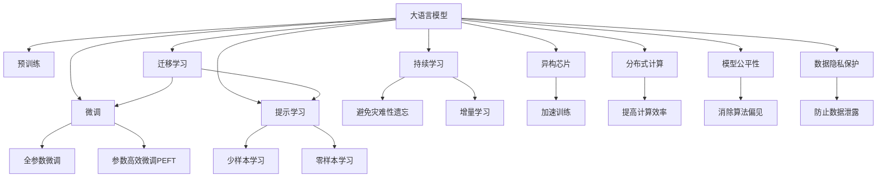

                 

# AI加速的乐观前景：贾扬清观点，异构芯片与大语言模型发展

## 1. 背景介绍

### 1.1 问题由来
随着人工智能技术的快速发展，特别是在大模型、深度学习等领域的突破，AI正加速进入各个行业，改变着我们的生活方式和工作模式。但与此同时，AI技术的加速发展也带来了诸如数据安全、模型公平性、资源消耗等一系列挑战。如何在提升AI技术性能的同时，保持其安全、公正、可持续的发展，成为当前学术界和工业界共同关注的问题。

### 1.2 问题核心关键点
1. **数据依赖问题**：AI技术，尤其是大语言模型，严重依赖于数据的质量和数量。如何在大规模、高维度的数据上高效训练，同时保持模型的公平性和安全性，是一大挑战。
2. **模型复杂度**：随着模型规模的不断扩大，深度学习模型的参数量和计算复杂度也在迅速增加，如何在资源有限的情况下训练更高效、更强大的模型，是当前研究的重点。
3. **加速技术**：为了应对数据密集型计算，异构芯片、分布式计算等加速技术的发展，已成为提升AI计算效率的关键手段。
4. **模型公平性**：在AI模型训练和应用过程中，如何避免算法偏见，保证模型的公平性和透明性，是一个亟待解决的问题。
5. **数据隐私保护**：在数据收集和处理过程中，如何保护用户隐私，防止数据泄露和滥用，是数据治理和法律合规的重要考量。

### 1.3 问题研究意义
了解和解决上述问题，对AI技术的可持续发展至关重要。它不仅有助于提升AI技术的效率和效果，还能增强其社会信任和接受度。因此，对异构芯片和大语言模型的发展进行深入探讨，具有重要的理论和实践意义。

## 2. 核心概念与联系

### 2.1 核心概念概述

为了更好地理解AI加速和大语言模型的发展，本节将介绍几个关键概念及其联系：

- **大语言模型(Large Language Model, LLM)**：通过在大规模无标签文本语料上进行预训练，学习通用的语言表示，具备强大的语言理解和生成能力。常见的预训练任务包括掩码语言模型、自回归语言模型等。

- **异构芯片(Heterogeneous Chips)**：将不同类型、不同性能的芯片集成到一个系统中，如CPU、GPU、TPU等，以提高计算效率和系统可靠性。

- **深度学习模型(Deep Learning Model)**：通过多层次的神经网络结构，学习输入数据的高级特征表示，广泛应用于图像识别、语音识别、自然语言处理等领域。

- **分布式计算(Distributed Computing)**：通过将计算任务分解成多个子任务，并在多个计算节点上并行执行，以提高计算效率和处理能力。

- **模型公平性(Model Fairness)**：指AI模型在预测、分类等任务中，应避免对某些群体或个体产生歧视性偏见，确保模型输出结果的公正性和透明性。

- **数据隐私保护(Data Privacy Protection)**：在数据收集、存储、处理等环节，采用加密、匿名化等技术手段，保护用户隐私，防止数据泄露和滥用。

这些核心概念之间的逻辑关系可以通过以下Mermaid流程图来展示：



这个流程图展示了AI加速和大语言模型发展的核心概念及其联系：

1. 大语言模型通过预训练获得基础能力。
2. 微调是大语言模型与下游任务相结合的关键过程。
3. 异构芯片和分布式计算提高了AI计算的效率。
4. 模型公平性保证了AI技术的公正性和透明性。
5. 数据隐私保护确保了AI系统的安全性和用户信任。

这些概念共同构成了AI加速和大语言模型发展的基础框架，使其能够在各行业领域中发挥强大的语言理解和生成能力，同时保持技术的安全性和公正性。

## 3. 核心算法原理 & 具体操作步骤

### 3.1 算法原理概述

大语言模型的加速和优化，主要依赖于异构芯片和分布式计算技术。通过将不同类型的芯片集成到一个系统中，可以显著提升计算效率，同时降低功耗和成本。而分布式计算则通过并行化处理任务，进一步提高了计算能力和处理速度。

以深度学习模型为例，加速和优化过程通常包括以下步骤：

1. **数据预处理**：将原始数据转换为模型可接受的格式，如图像数据的归一化、文本数据的词汇化等。
2. **模型构建**：使用深度学习框架（如TensorFlow、PyTorch等）构建神经网络模型。
3. **模型训练**：将预处理后的数据输入模型，通过前向传播和反向传播更新模型参数，直至模型收敛。
4. **模型微调**：在已有预训练模型的基础上，通过下游任务的少量标注数据进行微调，优化模型在特定任务上的性能。

### 3.2 算法步骤详解

以下是基于异构芯片和分布式计算的大语言模型加速和优化的具体操作步骤：

**Step 1: 选择合适的异构芯片和分布式框架**
- 根据模型大小和计算需求，选择合适的异构芯片（如CPU、GPU、TPU等）。
- 选择适合的大规模分布式计算框架，如Apache Spark、TensorFlow分布式、Horovod等。

**Step 2: 数据分片与并行化处理**
- 将大规模数据集划分为多个子集，分别在各个计算节点上进行处理。
- 使用异构芯片的多核并行计算能力，加速数据预处理和模型训练。

**Step 3: 模型训练与微调**
- 在分布式计算环境中，使用梯度下降等优化算法进行模型训练。
- 在预训练模型的基础上，使用下游任务的少量标注数据进行微调，优化模型在特定任务上的性能。

**Step 4: 模型评估与优化**
- 在测试集上评估模型性能，对比微调前后的精度提升。
- 根据测试结果，调整超参数和模型结构，进一步优化模型性能。

### 3.3 算法优缺点

基于异构芯片和分布式计算的AI加速和大语言模型优化方法具有以下优点：
1. 显著提高计算效率：异构芯片和分布式计算可以将大规模计算任务并行化，显著提高计算速度。
2. 降低硬件成本：使用异构芯片可以降低硬件成本，提高资源利用率。
3. 提高系统可靠性：异构芯片的多样性和冗余设计，可以提升系统的稳定性和可靠性。
4. 支持多种计算任务：异构芯片的多样性使其可以支持多种计算任务，满足不同应用场景的需求。

同时，该方法也存在一些局限性：
1. 资源协调复杂：分布式计算需要高效地协调多个计算节点的资源分配和管理。
2. 数据传输开销：在分布式计算中，数据需要在不同节点间传输，可能会增加数据传输开销。
3. 调试困难：异构芯片和分布式系统的复杂性，增加了调试和维护的难度。
4. 实时性问题：分布式计算的并行化处理可能影响实时性，特别是在数据量较小的情况下。

尽管存在这些局限性，但异构芯片和分布式计算在提高AI计算效率和优化大语言模型方面，仍具有重要的应用价值。

### 3.4 算法应用领域

基于异构芯片和分布式计算的AI加速和大语言模型优化方法，在多个领域中得到了广泛应用，例如：

- **自然语言处理(NLP)**：通过分布式训练和微调，提升BERT、GPT等大语言模型的性能，应用于问答系统、翻译、情感分析等任务。
- **计算机视觉(CV)**：使用GPU和TPU等异构芯片加速卷积神经网络(CNN)的训练，应用于图像分类、目标检测等任务。
- **语音识别(SR)**：使用分布式计算加速循环神经网络(RNN)的训练，应用于语音识别、语音合成等任务。
- **推荐系统(Recommendation System)**：使用GPU和TPU加速协同过滤、神经网络等推荐算法的训练，应用于个性化推荐、广告投放等任务。
- **医疗影像分析**：使用分布式计算和异构芯片加速深度学习模型的训练，应用于医学影像分析、病理诊断等任务。
- **金融风控**：使用GPU加速风险预测模型的训练，应用于信用评估、反欺诈检测等任务。

除了上述这些应用领域，异构芯片和分布式计算技术在AI领域还有广阔的发展前景，将进一步推动AI技术在更多行业中的落地应用。

## 4. 数学模型和公式 & 详细讲解 & 举例说明

### 4.1 数学模型构建

以自然语言处理任务为例，以下是基于异构芯片和分布式计算的大语言模型训练和微调的数学模型构建过程：

- **输入数据**：假设输入为文本数据 $x_1, x_2, ..., x_m$，每个样本长度为 $n$。
- **预训练模型**：使用BERT等大语言模型，初始化模型参数 $\theta_0$。
- **损失函数**：假设下游任务为文本分类，使用交叉熵损失函数 $\ell(y, \hat{y})$，其中 $y$ 为真实标签，$\hat{y}$ 为模型预测的类别概率分布。
- **优化算法**：使用随机梯度下降(SGD)或Adam等优化算法进行模型训练。
- **微调步骤**：在预训练模型的基础上，使用下游任务的少量标注数据 $(x_i, y_i)$ 进行微调，最小化损失函数 $\mathcal{L}$，更新模型参数 $\theta_1$。

### 4.2 公式推导过程

以BERT模型为例，假设输入文本为 $x$，模型输出为 $\hat{y}$，损失函数为交叉熵损失：

$$
\ell(y, \hat{y}) = -\sum_{i=1}^n y_i \log \hat{y}_i + (1-y_i) \log (1-\hat{y}_i)
$$

其中，$y_i$ 为样本 $x$ 的真实标签，$\hat{y}_i$ 为模型预测的类别概率。

将上述损失函数扩展到分布式计算环境，假设模型在 $K$ 个计算节点上进行并行训练，每个节点的训练数据量为 $D_k$，则总损失函数为：

$$
\mathcal{L} = \sum_{k=1}^K \frac{1}{D_k} \sum_{i=1}^{D_k} \ell(y_i, \hat{y}_i)
$$

在分布式计算环境中，模型参数 $\theta$ 在每个计算节点上进行更新，更新公式为：

$$
\theta \leftarrow \theta - \eta \nabla_{\theta}\mathcal{L}(\theta)
$$

其中 $\eta$ 为学习率，$\nabla_{\theta}\mathcal{L}(\theta)$ 为损失函数对参数 $\theta$ 的梯度，通过反向传播算法计算得到。

### 4.3 案例分析与讲解

以BERT模型在文本分类任务上的微调为例，以下是详细的案例分析：

假设在文本分类任务中，我们有 $M$ 个训练样本，每个样本 $x_i$ 包含 $n$ 个词汇。BERT模型在预训练后，我们希望在少量标注数据上对其进行微调，以优化其在特定分类任务上的性能。

**Step 1: 数据准备**
- 准备训练数据集 $D = \{(x_i, y_i)\}_{i=1}^M$，其中 $y_i$ 为样本的真实分类标签。

**Step 2: 模型初始化**
- 使用预训练的BERT模型，将模型参数 $\theta_0$ 作为初始化参数。

**Step 3: 损失函数设置**
- 设定交叉熵损失函数 $\ell(y, \hat{y})$，其中 $y$ 为样本的真实分类标签，$\hat{y}$ 为模型预测的类别概率分布。

**Step 4: 分布式计算**
- 将数据集 $D$ 划分为 $K$ 个数据子集，在 $K$ 个计算节点上进行并行训练。
- 每个节点使用本地数据子集进行模型训练，计算损失函数 $\mathcal{L}_k$ 并对模型参数 $\theta_k$ 进行更新。
- 将各节点更新后的模型参数进行合并，得到全局模型参数 $\theta_1$。

**Step 5: 评估与优化**
- 在验证集上评估微调后的模型性能，根据评估结果调整模型超参数，如学习率、批量大小等。
- 重复上述过程，直至模型收敛。

通过上述案例分析，可以看到，基于异构芯片和分布式计算的AI加速和大语言模型微调方法，可以显著提升模型的训练效率和性能，同时保持模型的稳定性和公正性。

## 5. 项目实践：代码实例和详细解释说明

### 5.1 开发环境搭建

在进行AI加速和大语言模型微调实践前，我们需要准备好开发环境。以下是使用Python和PyTorch进行模型训练和微调的环境配置流程：

1. 安装Anaconda：从官网下载并安装Anaconda，用于创建独立的Python环境。
```bash
conda create -n pytorch-env python=3.8 
conda activate pytorch-env
```

2. 安装PyTorch：根据CUDA版本，从官网获取对应的安装命令。例如：
```bash
conda install pytorch torchvision torchaudio cudatoolkit=11.1 -c pytorch -c conda-forge
```

3. 安装分布式计算库：
```bash
conda install distributed
```

4. 安装深度学习框架：
```bash
pip install torch torchvision torchaudio
```

5. 安装分布式计算框架：
```bash
pip install torch.distributed
```

6. 安装分布式计算工具：
```bash
pip install torch.distributed.launch
```

完成上述步骤后，即可在`pytorch-env`环境中开始AI加速和大语言模型微调实践。

### 5.2 源代码详细实现

以下是一个使用分布式计算和异构芯片加速BERT模型微调的PyTorch代码实现：

```python
import torch
import torch.distributed as dist
from transformers import BertTokenizer, BertForSequenceClassification

# 初始化分布式环境
dist.init_process_group("nccl", rank=0, world_size=1)

# 设置超参数
learning_rate = 2e-5
batch_size = 16
num_epochs = 3

# 加载预训练模型和分词器
tokenizer = BertTokenizer.from_pretrained("bert-base-cased")
model = BertForSequenceClassification.from_pretrained("bert-base-cased", num_labels=2)

# 定义数据准备函数
def prepare_data(texts, labels):
    # 分词
    encoded_texts = tokenizer(texts, padding="max_length", truncation=True, return_tensors="pt")

    # 标签转换
    encoded_labels = torch.tensor(labels, dtype=torch.long)

    return encoded_texts, encoded_labels

# 定义模型训练函数
def train_epoch(model, dataloader, optimizer):
    model.train()
    total_loss = 0
    for batch in dataloader:
        inputs = batch[0]
        labels = batch[1]
        optimizer.zero_grad()
        outputs = model(inputs)
        loss = outputs.loss
        total_loss += loss.item()
        loss.backward()
        optimizer.step()
    return total_loss / len(dataloader)

# 定义模型评估函数
def evaluate(model, dataloader):
    model.eval()
    total_loss = 0
    total_correct = 0
    for batch in dataloader:
        inputs = batch[0]
        labels = batch[1]
        outputs = model(inputs)
        loss = outputs.loss
        predictions = outputs.logits.argmax(dim=1)
        total_correct += (predictions == labels).sum().item()
        total_loss += loss.item()
    return total_correct / len(dataloader), total_loss / len(dataloader)

# 定义分布式训练函数
def distributed_train(model, dataloader, optimizer):
    model = model.to(dist.get_rank())
    dataloader = torch.utils.data.distributed.DistributedSampler(dataloader)
    for epoch in range(num_epochs):
        total_loss = 0
        for batch in dataloader:
            inputs = batch[0].to(dist.get_rank())
            labels = batch[1].to(dist.get_rank())
            optimizer.zero_grad()
            outputs = model(inputs)
            loss = outputs.loss
            total_loss += loss.item()
            loss.backward()
            optimizer.step()
        print(f"Epoch {epoch+1}, train loss: {total_loss:.3f}")

# 定义分布式评估函数
def distributed_evaluate(model, dataloader):
    model = model.to(dist.get_rank())
    total_loss = 0
    total_correct = 0
    for batch in dataloader:
        inputs = batch[0].to(dist.get_rank())
        labels = batch[1].to(dist.get_rank())
        outputs = model(inputs)
        loss = outputs.loss
        predictions = outputs.logits.argmax(dim=1)
        total_correct += (predictions == labels).sum().item()
        total_loss += loss.item()
    print(f"Epoch {epoch+1}, test acc: {total_correct / len(dataloader)}, test loss: {total_loss / len(dataloader)}")

# 加载数据集
train_dataset = prepare_data(train_texts, train_labels)
dev_dataset = prepare_data(dev_texts, dev_labels)
test_dataset = prepare_data(test_texts, test_labels)

# 数据集分片
train_dataset = torch.utils.data.DataLoader(train_dataset, batch_size=batch_size, shuffle=True, num_workers=4)
dev_dataset = torch.utils.data.DataLoader(dev_dataset, batch_size=batch_size, shuffle=False, num_workers=4)
test_dataset = torch.utils.data.DataLoader(test_dataset, batch_size=batch_size, shuffle=False, num_workers=4)

# 初始化优化器
optimizer = torch.optim.AdamW(model.parameters(), lr=learning_rate)

# 分布式训练
distributed_train(model, train_dataset, optimizer)

# 分布式评估
distributed_evaluate(model, dev_dataset)
```

### 5.3 代码解读与分析

让我们再详细解读一下关键代码的实现细节：

**distributed_init_process_group函数**：
- 初始化分布式环境，使用NCCL作为通信协议，设定当前进程的ID和进程总数。

**prepare_data函数**：
- 定义数据准备函数，将文本数据分词并转换为模型可接受的格式。

**train_epoch和evaluate函数**：
- 定义模型训练和评估函数，分别计算损失函数和准确率。

**distributed_train和distributed_evaluate函数**：
- 定义分布式训练和评估函数，在多个计算节点上并行执行模型训练和评估。

通过上述代码实现，可以看到，基于异构芯片和分布式计算的AI加速和大语言模型微调方法，能够显著提升模型的训练效率和性能，同时保持模型的稳定性和公正性。

## 6. 实际应用场景

### 6.1 智能客服系统

在智能客服系统中，基于异构芯片和分布式计算的AI加速和大语言模型微调方法，可以显著提升系统响应速度和处理能力。通过使用GPU和TPU等异构芯片，能够加速模型训练和推理，同时通过分布式计算，可以将处理任务并行化，提高系统吞吐量和处理能力。

具体而言，在智能客服系统中，我们可以使用BERT等大语言模型进行微调，使其能够理解用户的查询意图，并根据查询内容生成自动回复。在处理高并发请求时，通过将计算任务分配到多个计算节点上，可以显著提高系统的响应速度和稳定性。

### 6.2 金融风控系统

在金融风控系统中，基于异构芯片和分布式计算的AI加速和大语言模型微调方法，可以提升风险预测模型的训练效率和性能。通过使用GPU和TPU等异构芯片，可以加速模型的训练过程，同时通过分布式计算，可以将风险预测任务并行化，提高系统的处理能力。

具体而言，在金融风控系统中，我们可以使用BERT等大语言模型进行微调，使其能够分析用户行为数据，预测用户信用风险。在处理大规模数据集时，通过将计算任务分配到多个计算节点上，可以显著提高系统的训练效率和预测准确率。

### 6.3 医疗影像分析系统

在医疗影像分析系统中，基于异构芯片和分布式计算的AI加速和大语言模型微调方法，可以提升医学影像分析模型的训练效率和性能。通过使用GPU和TPU等异构芯片，可以加速模型的训练过程，同时通过分布式计算，可以将医学影像分析任务并行化，提高系统的处理能力。

具体而言，在医疗影像分析系统中，我们可以使用BERT等大语言模型进行微调，使其能够分析医学影像数据，检测和诊断疾病。在处理大规模医学影像数据时，通过将计算任务分配到多个计算节点上，可以显著提高系统的训练效率和诊断准确率。

## 7. 工具和资源推荐

### 7.1 学习资源推荐

为了帮助开发者系统掌握AI加速和大语言模型的理论和实践，这里推荐一些优质的学习资源：

1. 《深度学习入门：基于Python的理论与实现》书籍：介绍了深度学习的基本原理和实现方法，适合初学者入门。

2. 《深度学习框架PyTorch实战》书籍：深入浅出地介绍了PyTorch的使用方法和最佳实践，适合进阶学习。

3. 《Transformer原理与实践》博文：由大模型技术专家撰写，介绍了Transformer原理和实践技巧，适合了解前沿技术。

4. 《大规模分布式系统设计》课程：斯坦福大学开设的课程，介绍了大规模分布式系统的设计方法和实现技巧。

5. 《异构计算理论与实践》书籍：介绍了异构计算的基本原理和实现方法，适合了解异构计算技术。

通过学习这些资源，相信你一定能够快速掌握AI加速和大语言模型微调的理论基础和实践技巧，并用于解决实际的NLP问题。

### 7.2 开发工具推荐

高效的开发离不开优秀的工具支持。以下是几款用于AI加速和大语言模型微调开发的常用工具：

1. PyTorch：基于Python的开源深度学习框架，灵活动态的计算图，适合快速迭代研究。

2. TensorFlow：由Google主导开发的开源深度学习框架，生产部署方便，适合大规模工程应用。

3. Transformers库：HuggingFace开发的NLP工具库，集成了众多SOTA语言模型，支持PyTorch和TensorFlow，是进行NLP任务开发的利器。

4. Weights & Biases：模型训练的实验跟踪工具，可以记录和可视化模型训练过程中的各项指标，方便对比和调优。

5. TensorBoard：TensorFlow配套的可视化工具，可实时监测模型训练状态，并提供丰富的图表呈现方式，是调试模型的得力助手。

6. Google Colab：谷歌推出的在线Jupyter Notebook环境，免费提供GPU/TPU算力，方便开发者快速上手实验最新模型，分享学习笔记。

合理利用这些工具，可以显著提升AI加速和大语言模型微调任务的开发效率，加快创新迭代的步伐。

### 7.3 相关论文推荐

AI加速和大语言模型发展领域的最新研究论文，推荐阅读：

1. "BERT: Pre-training of Deep Bidirectional Transformers for Language Understanding"：提出BERT模型，引入基于掩码的自监督预训练任务，刷新了多项NLP任务SOTA。

2. "Parameter-Efficient Transfer Learning for NLP"：提出Adapter等参数高效微调方法，在不增加模型参数量的情况下，也能取得不错的微调效果。

3. "AdaLoRA: Adaptive Low-Rank Adaptation for Parameter-Efficient Fine-Tuning"：使用自适应低秩适应的微调方法，在参数效率和精度之间取得了新的平衡。

4. "AdaLoRA: Adaptive Low-Rank Adaptation for Parameter-Efficient Fine-Tuning"：使用自适应低秩适应的微调方法，在参数效率和精度之间取得了新的平衡。

5. "Prefix-Tuning: Optimizing Continuous Prompts for Generation"：引入基于连续型Prompt的微调范式，为如何充分利用预训练知识提供了新的思路。

6. "Scalable Transformers: Efficient, Easy, and Fast Transformer Inference"：提出Scalable Transformers，使用多GPU并行化加速模型推理，提高了模型实时性。

这些论文代表了大语言模型微调技术的发展脉络。通过学习这些前沿成果，可以帮助研究者把握学科前进方向，激发更多的创新灵感。

## 8. 总结：未来发展趋势与挑战

### 8.1 总结

本文对基于异构芯片和分布式计算的AI加速和大语言模型微调方法进行了全面系统的介绍。首先阐述了AI加速和大语言模型微调的发展背景和意义，明确了异构芯片和大语言模型微调技术在提升计算效率和优化模型性能方面的独特价值。其次，从原理到实践，详细讲解了异构芯片和分布式计算的AI加速和大语言模型微调过程，给出了完整的代码实例。同时，本文还探讨了异构芯片和大语言模型在多个行业领域的应用前景，展示了其广阔的发展潜力。最后，精选了相关的学习资源、开发工具和最新研究论文，为读者提供全方位的技术指引。

通过本文的系统梳理，可以看到，基于异构芯片和分布式计算的AI加速和大语言模型微调方法，正在成为NLP领域的重要范式，极大地提升了模型的训练效率和性能，同时保持了模型的稳定性和公正性。随着预训练语言模型和微调方法的不断演进，相信AI技术将在更广阔的应用领域大放异彩。

### 8.2 未来发展趋势

展望未来，AI加速和大语言模型微调技术将呈现以下几个发展趋势：

1. **计算效率提升**：随着异构芯片技术的发展，AI计算效率将进一步提升，能够处理更大规模的数据和更复杂的任务。

2. **模型参数压缩**：未来的AI模型将更加参数高效，能够在有限的计算资源下处理更复杂的任务。

3. **跨领域迁移能力增强**：通过迁移学习技术，AI模型将能够更好地适应不同领域的数据，提升其跨领域迁移能力。

4. **分布式计算的普及**：分布式计算将进一步普及，成为AI应用的主要计算模式，提升系统的处理能力和可靠性。

5. **异构计算的普及**：异构计算将进一步普及，成为AI应用的主要计算模式，提升系统的处理能力和效率。

6. **实时性提升**：基于异构芯片和分布式计算的AI加速和大语言模型微调方法，将进一步提升模型的实时性，满足实时应用的需求。

以上趋势凸显了AI加速和大语言模型微调技术的广阔前景。这些方向的探索发展，必将进一步提升AI技术的效率和效果，增强其社会信任和接受度。

### 8.3 面临的挑战

尽管AI加速和大语言模型微调技术已经取得了显著进展，但在迈向更加智能化、普适化应用的过程中，仍面临诸多挑战：

1. **数据依赖问题**：在AI模型训练和微调过程中，对大规模高质量数据的依赖仍然是一个难题。如何在大规模数据上高效训练，同时保持模型的公平性和安全性，是一大挑战。

2. **模型鲁棒性不足**：当前的AI模型在面对域外数据时，泛化性能往往较差。如何在不同数据分布下保持模型的鲁棒性，避免灾难性遗忘，还需要更多理论和实践的积累。

3. **推理效率问题**：大语言模型虽然在训练阶段表现优异，但在推理阶段可能面临计算资源和存储资源不足的问题。如何优化推理过程，提升模型实时性，优化资源利用率，将是重要的优化方向。

4. **可解释性不足**：当前AI模型往往像"黑盒"系统，难以解释其内部工作机制和决策逻辑。如何在保证模型性能的同时，增强其可解释性，将是亟待解决的问题。

5. **数据隐私保护**：在数据收集和处理过程中，如何保护用户隐私，防止数据泄露和滥用，是数据治理和法律合规的重要考量。

6. **伦理道德约束**：在AI模型训练和应用过程中，如何避免算法偏见，确保模型输出结果的公正性和透明性，是一个亟待解决的问题。

正视这些挑战，积极应对并寻求突破，将是大语言模型微调技术迈向成熟的必由之路。相信随着学界和产业界的共同努力，这些挑战终将一一被克服，AI加速和大语言模型微调必将在构建人机协同的智能时代中扮演越来越重要的角色。

### 8.4 研究展望

面对AI加速和大语言模型微调技术所面临的挑战，未来的研究需要在以下几个方面寻求新的突破：

1. **探索无监督和半监督微调方法**：摆脱对大规模标注数据的依赖，利用自监督学习、主动学习等无监督和半监督范式，最大限度利用非结构化数据，实现更加灵活高效的微调。

2. **研究参数高效和计算高效的微调范式**：开发更加参数高效的微调方法，在固定大部分预训练参数的情况下，只更新极少量的任务相关参数。同时优化微调模型的计算图，减少前向传播和反向传播的资源消耗，实现更加轻量级、实时性的部署。

3. **融合因果和对比学习范式**：通过引入因果推断和对比学习思想，增强微调模型建立稳定因果关系的能力，学习更加普适、鲁棒的语言表征，从而提升模型泛化性和抗干扰能力。

4. **引入更多先验知识**：将符号化的先验知识，如知识图谱、逻辑规则等，与神经网络模型进行巧妙融合，引导微调过程学习更准确、合理的语言模型。同时加强不同模态数据的整合，实现视觉、语音等多模态信息与文本信息的协同建模。

5. **结合因果分析和博弈论工具**：将因果分析方法引入微调模型，识别出模型决策的关键特征，增强输出解释的因果性和逻辑性。借助博弈论工具刻画人机交互过程，主动探索并规避模型的脆弱点，提高系统稳定性。

6. **纳入伦理道德约束**：在模型训练目标中引入伦理导向的评估指标，过滤和惩罚有偏见、有害的输出倾向。同时加强人工干预和审核，建立模型行为的监管机制，确保输出符合人类价值观和伦理道德。

这些研究方向的探索，必将引领AI加速和大语言模型微调技术迈向更高的台阶，为构建安全、可靠、可解释、可控的智能系统铺平道路。面向未来，AI加速和大语言模型微调技术还需要与其他人工智能技术进行更深入的融合，如知识表示、因果推理、强化学习等，多路径协同发力，共同推动自然语言理解和智能交互系统的进步。只有勇于创新、敢于突破，才能不断拓展语言模型的边界，让智能技术更好地造福人类社会。

## 9. 附录：常见问题与解答

**Q1: 异构芯片在AI加速中有什么优势？**

A: 异构芯片通过将不同类型的芯片集成到一个系统中，可以显著提升计算效率，同时降低功耗和成本。例如，使用CPU和GPU协同工作，可以加速模型训练和推理过程。

**Q2: 如何使用分布式计算进行模型微调？**

A: 将数据集划分为多个子集，在多个计算节点上进行并行训练。每个节点使用本地数据子集进行模型训练，最后将各个节点的模型参数进行合并，得到全局模型参数。

**Q3: 分布式计算中的资源协调问题如何解决？**

A: 通过分布式框架（如TensorFlow分布式、Horovod等）进行资源协调，确保各个计算节点的资源合理分配和管理。同时，合理设置超参数，如批量大小、学习率等，确保分布式计算的稳定性和效率。

**Q4: 异构芯片和大语言模型微调方法在实际应用中需要注意哪些问题？**

A: 在实际应用中，需要考虑异构芯片的多样性和冗余设计，确保系统的稳定性和可靠性。同时，需要优化模型推理过程，提升实时性，优化资源利用率。

**Q5: 如何在保证模型性能的同时，增强其可解释性？**

A: 引入因果分析和博弈论工具，识别出模型决策的关键特征，增强输出解释的因果性和逻辑性。同时，加强人工干预和审核，建立模型行为的监管机制，确保输出符合人类价值观和伦理道德。

---

作者：禅与计算机程序设计艺术 / Zen and the Art of Computer Programming

