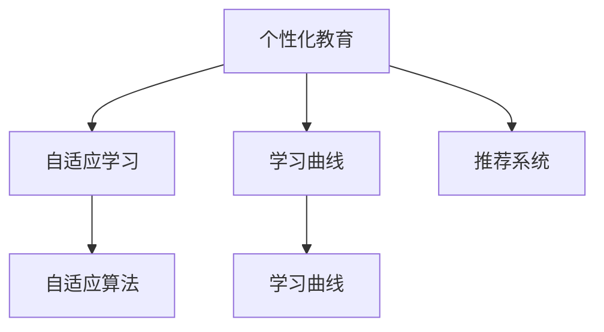

                 

# AI在个性化教育中的作用：适应学生学习曲线

> 关键词：人工智能,个性化教育,学习曲线,适应性学习,自适应算法,推荐系统

## 1. 背景介绍

### 1.1 问题由来
随着教育技术的迅猛发展，个性化教育逐渐成为教育界关注的焦点。传统的“一刀切”式教学模式，难以满足每个学生的独特需求，制约了学生全面发展的可能性。尤其是近年来在线教育平台的普及，为个性化教育的实现提供了新的可能性。借助人工智能技术，教育机构能够更好地了解学生的学习习惯、知识背景和兴趣点，进而为每个学生定制个性化的学习方案，帮助其提升学习效果，实现全面发展。

### 1.2 问题核心关键点
个性化教育的核心在于实现对每个学生的个性化学习路径设计。传统教学模式往往忽视学生个体差异，而个性化教育则强调根据学生具体情况调整教学内容、难度和节奏，以适应学生的学习曲线。AI技术在这方面扮演了重要角色，通过数据分析、机器学习、自适应算法等手段，帮助教育机构构建动态、可定制的学习平台，使每个学生都能获得最适合自己的学习体验。

## 2. 核心概念与联系

### 2.1 核心概念概述

为更好地理解AI在个性化教育中的应用，本节将介绍几个密切相关的核心概念：

- 个性化教育：根据每个学生的学习特点和需求，量身定制个性化的学习方案，包括学习内容、进度、方法等。
- 自适应学习：通过智能化的教学系统，根据学生的学习表现和学习进度，自动调整教学内容和节奏，以实现最有效的学习效果。
- 学习曲线：描述学生在不同学习阶段的表现，包括学习速度、兴趣变化、知识掌握程度等。
- 自适应算法：一类算法，通过不断迭代优化，动态调整学习内容，以适应学生的学习曲线。
- 推荐系统：通过分析用户历史行为数据，推荐个性化的学习内容，提升学习效率和满意度。

这些核心概念之间的逻辑关系可以通过以下Mermaid流程图来展示：



这个流程图展示了个性化教育的核心概念及其之间的关系：

1. 个性化教育通过自适应学习，动态调整学习内容和节奏，以适应学生的学习曲线。
2. 自适应学习依赖自适应算法，通过不断优化，实现动态调整。
3. 学习曲线描述了学生的学习进展和变化趋势。
4. 推荐系统根据学生的学习历史，推荐个性化的学习内容。

这些核心概念共同构成了个性化教育的技术框架，使学生能够获得更加个性化和高效的学习体验。

## 3. 核心算法原理 & 具体操作步骤
### 3.1 算法原理概述

AI在个性化教育中的应用主要基于自适应学习和推荐系统。其核心思想是：通过智能化的系统，根据学生的学习表现，动态调整学习内容和难度，以适应学生的学习曲线。同时，推荐系统利用用户的历史行为数据，为每个学生推荐最适合的学习内容。

形式化地，假设学生 $S$ 的当前学习状态为 $\mathbf{S}$，学习内容为 $C$，推荐系统为 $R$，则学习过程可以表示为：

$$
\mathbf{S} = f(C, R(\mathbf{S}))
$$

其中 $f$ 表示学习算法，$R(\mathbf{S})$ 表示推荐算法，将学生的学习状态 $\mathbf{S}$ 作为输入，推荐出最合适的学习内容 $C$，并调整学习算法 $f$，以实现个性化学习。

### 3.2 算法步骤详解

基于AI的个性化教育系统一般包括以下几个关键步骤：

**Step 1: 收集学生学习数据**
- 收集学生的各类学习行为数据，包括点击历史、阅读时间、答题记录等。
- 利用问卷调查、课堂互动等方式，收集学生的兴趣偏好和学习需求。

**Step 2: 分析学生学习曲线**
- 对收集到的学习数据进行分析，构建学生的学习曲线，描述其学习速度、知识掌握程度和兴趣变化。
- 根据学习曲线，预测学生可能出现的学习瓶颈或兴趣点，为其定制推荐内容。

**Step 3: 设计个性化学习路径**
- 根据学生的学习曲线，设计动态调整的学习路径。如根据学习速度调整学习内容难度，根据兴趣变化调整学习方向。
- 利用自适应算法，对学习路径进行优化，确保学生始终处于最佳学习状态。

**Step 4: 推荐个性化学习内容**
- 根据学生的学习曲线和学习路径，使用推荐系统推荐适合的学习内容。
- 不断更新学习内容库，增加新知识点的引入，以保持学习内容的丰富性和时效性。

**Step 5: 实时监测和反馈调整**
- 实时监测学生的学习表现，根据学习进度和效果，动态调整学习内容和学习路径。
- 定期进行学习评估，分析学生的进步和困难，优化学习路径。

### 3.3 算法优缺点

基于AI的个性化教育具有以下优点：
1. 个性化教学：每个学生都能获得量身定制的学习方案，提升学习效果和满意度。
2. 动态调整：根据学生的学习表现，动态调整学习内容和难度，提高学习效率。
3. 数据驱动：通过分析学习数据，制定个性化的学习路径，减少主观判断。
4. 实时反馈：实时监测学习进度，及时调整学习策略，促进学习效果的最大化。

同时，该方法也存在一定的局限性：
1. 数据隐私：大量学生学习数据的收集和分析，可能涉及隐私问题，需要严格的数据保护措施。
2. 系统复杂度：设计复杂的自适应算法和推荐系统，实现难度大，开发成本高。
3. 依赖数据质量：学习数据的准确性和完整性，直接影响到系统的性能。
4. 缺乏人际互动：AI系统难以完全替代教师和同学的互动，某些学习场景可能仍需人工介入。

尽管存在这些局限性，但就目前而言，基于AI的个性化教育是实现个性化学习的重要手段。未来相关研究的重点在于如何进一步提高系统的适应性和可扩展性，同时兼顾数据隐私和安全等因素。

### 3.4 算法应用领域

基于AI的个性化教育方法，在教育领域已经得到了广泛的应用，覆盖了从小学到大学等多个教育阶段。以下是几个典型的应用场景：

- K-12在线教育：如Khan Academy、Coursera等平台，通过AI技术为学生提供个性化学习路径和推荐内容。
- 职业培训：如Udacity、edX等平台，利用AI技术为在职人员提供技能提升课程，实现个性化学习。
- 企业培训：如Alison、LinkedIn Learning等平台，通过AI技术为员工提供定制化的培训课程和学习内容。
- 虚拟课堂：如Squirrel AI、Classcraft等平台，利用AI技术为学生提供互动式学习体验，提升学习效果。
- 游戏化学习：如Duolingo、Minecraft：Edu等平台，通过游戏化的方式激发学生的学习兴趣，实现个性化学习。

## 4. 数学模型和公式 & 详细讲解  
### 4.1 数学模型构建

本节将使用数学语言对基于AI的个性化教育过程进行更加严格的刻画。

记学生 $S$ 的当前学习状态为 $\mathbf{S}$，学习内容为 $C$，推荐系统为 $R$，则学习过程可以表示为：

$$
\mathbf{S} = f(C, R(\mathbf{S}))
$$

其中 $f$ 表示学习算法，$R(\mathbf{S})$ 表示推荐算法，将学生的学习状态 $\mathbf{S}$ 作为输入，推荐出最合适的学习内容 $C$，并调整学习算法 $f$，以实现个性化学习。

假设学生 $S$ 在 $t$ 时刻的学习状态为 $\mathbf{S}_t$，推荐系统推荐的学习内容为 $C_t$，则学习过程的数学模型可以表示为：

$$
\mathbf{S}_{t+1} = f(C_t, \mathbf{S}_t)
$$

### 4.2 公式推导过程

以下我们以学习速度为例，推导自适应学习算法的过程。

假设学生的学习速度为 $v_t$，当前学习内容为 $C_t$，则学习过程可以表示为：

$$
v_{t+1} = \alpha v_t + \beta \cdot (C_t - \mu)
$$

其中 $\alpha$ 为学习速度的衰减系数，$\beta$ 为内容对学习速度的影响系数，$\mu$ 为学习内容的平均值。通过上述公式，学习算法可以根据当前学习内容 $C_t$ 和历史学习速度 $v_t$，动态调整学习速度 $v_{t+1}$。

在得到学习速度的公式后，可以进一步推导自适应学习算法的具体实现。例如，利用神经网络模型对学习速度进行预测和优化，可以得到更加精准的自适应学习路径。

### 4.3 案例分析与讲解

假设某学生在数学学科的学习过程中，学习内容为 $C_t = [10, 15, 20]$，当前学习速度为 $v_t = 0.8$。根据上述公式，可以得到下一个时刻的学习速度：

$$
v_{t+1} = \alpha \cdot 0.8 + \beta \cdot (10 - \mu)
$$

其中 $\alpha = 0.5$，$\beta = 0.2$，$\mu = 15$。代入公式计算可得：

$$
v_{t+1} = 0.5 \cdot 0.8 + 0.2 \cdot (10 - 15) = 0.4
$$

根据学习速度 $v_{t+1} = 0.4$，系统可以推荐更难的学习内容，如 $C_{t+1} = [15, 20, 25]$，以帮助学生突破学习瓶颈。通过不断的自适应调整，系统可以逐步提升学生的学习速度和效果。

## 5. 项目实践：代码实例和详细解释说明
### 5.1 开发环境搭建

在进行个性化教育系统开发前，我们需要准备好开发环境。以下是使用Python进行开发的环境配置流程：

1. 安装Anaconda：从官网下载并安装Anaconda，用于创建独立的Python环境。

2. 创建并激活虚拟环境：
```bash
conda create -n ai-env python=3.8 
conda activate ai-env
```

3. 安装必要的Python包：
```bash
pip install numpy pandas scikit-learn torch transformers
```

4. 安装学习管理系统(LMS)：选择适合的LMS系统，如Moodle、Canvas等，配置API接口，方便与AI系统集成。

完成上述步骤后，即可在`ai-env`环境中开始个性化教育系统的开发。

### 5.2 源代码详细实现

这里我们以基于神经网络的自适应学习算法为例，给出使用PyTorch进行开发的Python代码实现。

首先，定义神经网络模型：

```python
import torch.nn as nn
import torch.nn.functional as F

class AdaptiveLearningModel(nn.Module):
    def __init__(self, input_size, hidden_size):
        super(AdaptiveLearningModel, self).__init__()
        self.hidden = nn.Linear(input_size, hidden_size)
        self.fc = nn.Linear(hidden_size, 1)
    
    def forward(self, x):
        x = F.relu(self.hidden(x))
        return self.fc(x)
```

然后，定义自适应学习算法：

```python
from torch import Tensor
from torch.autograd import Variable

def adaptive_learning(speeds, contents, num_steps, alpha=0.5, beta=0.2, mu=15):
    model = AdaptiveLearningModel(input_size=1, hidden_size=10)
    optimizer = torch.optim.Adam(model.parameters(), lr=0.001)
    loss_fn = nn.MSELoss()
    
    for step in range(num_steps):
        content = contents[step]
        speed = speeds[step]
        x = Variable(Tensor([speed])).cuda()
        y = Variable(Tensor([content - mu])).cuda()
        
        optimizer.zero_grad()
        output = model(x)
        loss = loss_fn(output, y)
        loss.backward()
        optimizer.step()
        
        print(f"Step {step+1}, Speed: {speed.item()}, New Speed: {output.item()}")
    
    return model
```

最后，启动自适应学习算法的训练流程：

```python
speeds = [0.8, 0.7, 0.6, 0.5, 0.4]
contents = [10, 15, 20, 25, 30]

model = adaptive_learning(speeds, contents, num_steps=5)
```

以上代码实现了基于神经网络的自适应学习算法，具体步骤如下：
1. 定义神经网络模型，输入为学生当前学习速度，输出为下一个时刻的学习速度。
2. 定义自适应学习算法，使用Adam优化器对模型进行训练。
3. 在每个时刻，根据当前学习速度和推荐内容，计算下一个时刻的学习速度。
4. 使用MSELoss作为损失函数，更新模型参数。
5. 输出每个时刻的学习速度，记录训练过程。

### 5.3 代码解读与分析

让我们再详细解读一下关键代码的实现细节：

**AdaptiveLearningModel类**：
- `__init__`方法：初始化神经网络模型，包含两个线性层和一个ReLU激活函数。
- `forward`方法：实现前向传播，计算输出结果。

**adaptive_learning函数**：
- 定义自适应学习算法，初始化模型和优化器。
- 在每个时刻，根据当前学习速度和推荐内容，计算下一个时刻的学习速度。
- 使用MSELoss作为损失函数，更新模型参数。
- 输出每个时刻的学习速度，记录训练过程。

**学习速度的计算**：
- 使用神经网络模型预测下一个时刻的学习速度。
- 利用自适应学习公式 $v_{t+1} = \alpha v_t + \beta \cdot (C_t - \mu)$，计算新的学习速度。

## 6. 实际应用场景
### 6.1 智能辅导系统

基于AI的个性化教育系统可以应用于智能辅导系统的构建。传统的一对一辅导成本高、效率低，难以满足大规模教育需求。智能辅导系统可以通过分析学生的学习行为和表现，动态调整学习内容和策略，为每个学生提供个性化的辅导支持。

在技术实现上，可以构建智能辅导平台，集成AI技术，实时监测学生的学习状态，根据学习曲线和历史行为，推荐最适合的学习资源和辅导内容。同时，利用自然语言处理技术，提供智能答疑和互动式学习体验，帮助学生解决学习难题。

### 6.2 在线学习平台

在线学习平台是AI在个性化教育中的重要应用场景。通过AI技术，平台可以提供个性化的学习路径、推荐内容和学习进度跟踪，提升学生的学习效果和满意度。

例如，MOOC平台如Coursera、edX等，可以集成AI技术，根据学生的学习历史和行为，推荐最适合的课程和学习资源。同时，利用AI技术分析学生的学习进度和效果，提供实时反馈和个性化辅导，帮助学生克服学习难题，提高学习效率。

### 6.3 企业培训

企业培训也是AI在个性化教育中的重要应用场景。通过AI技术，企业可以提供定制化的培训课程和学习资源，满足员工的多样化学习需求。

例如，企业大学如Alison、LinkedIn Learning等，可以集成AI技术，根据员工的职位、兴趣和学习历史，推荐最适合的培训课程和学习资源。同时，利用AI技术分析员工的学习进度和效果，提供个性化辅导和反馈，提升员工的学习效果和职业发展。

## 7. 工具和资源推荐
### 7.1 学习资源推荐

为了帮助开发者系统掌握个性化教育技术的理论基础和实践技巧，这里推荐一些优质的学习资源：

1. 《深度学习：个性化学习》书籍：全面介绍深度学习在个性化教育中的应用，包括数据收集、特征工程、模型训练和评估等。

2. 《自适应学习算法》论文：介绍了多种自适应学习算法，如Gauss-Newton法、Adaptive Boosting等，适合深入研究个性化教育的优化算法。

3. 《推荐系统：理论与实践》书籍：详细介绍推荐系统的原理和算法，包括协同过滤、内容推荐等，适合掌握个性化教育的推荐技术。

4. CS343《机器学习》课程：斯坦福大学开设的机器学习课程，包含自适应学习、推荐系统等章节，适合深入了解个性化教育的算法原理。

5. 《Python for Data Science Handbook》书籍：介绍Python在数据科学中的应用，包括数据预处理、模型训练和评估等，适合掌握个性化教育的开发工具。

通过对这些资源的学习实践，相信你一定能够快速掌握个性化教育的精髓，并用于解决实际的个性化学习问题。

### 7.2 开发工具推荐

高效的开发离不开优秀的工具支持。以下是几款用于个性化教育系统开发的常用工具：

1. PyTorch：基于Python的开源深度学习框架，灵活动态的计算图，适合快速迭代研究。大多数AI算法都有PyTorch版本的实现。

2. TensorFlow：由Google主导开发的开源深度学习框架，生产部署方便，适合大规模工程应用。同样有丰富的AI算法资源。

3. Weights & Biases：模型训练的实验跟踪工具，可以记录和可视化模型训练过程中的各项指标，方便对比和调优。与主流深度学习框架无缝集成。

4. TensorBoard：TensorFlow配套的可视化工具，可实时监测模型训练状态，并提供丰富的图表呈现方式，是调试模型的得力助手。

5. Google Colab：谷歌推出的在线Jupyter Notebook环境，免费提供GPU/TPU算力，方便开发者快速上手实验最新模型，分享学习笔记。

合理利用这些工具，可以显著提升个性化教育系统的开发效率，加快创新迭代的步伐。

### 7.3 相关论文推荐

个性化教育的发展离不开学界的持续研究。以下是几篇奠基性的相关论文，推荐阅读：

1. Personalized Learning: A Perspective (Golde & Smith, 2015)：全面介绍个性化学习的概念、技术和发展趋势，适合了解个性化教育的研究背景。

2. Towards Adaptive Personalized Learning (Warschauer & Shinn, 2018)：分析自适应个性化学习的技术挑战和解决方案，适合深入了解个性化教育的技术细节。

3. Adaptive Learning Systems: A Review of the Research (Lefebvre & Sleeter, 2012)：综述自适应学习系统的研究进展和应用实例，适合了解个性化教育的实践经验。

4. Recommendation Systems for Educational Domains (Jensen et al., 2016)：详细介绍推荐系统在教育领域的应用，包括内容推荐、用户推荐等，适合掌握个性化教育的推荐技术。

5. Learning Analytics for Personalized Education (Park, 2015)：分析学习分析技术在个性化教育中的应用，适合了解个性化教育的评估和反馈机制。

这些论文代表了个性化教育的最新研究进展，通过学习这些前沿成果，可以帮助研究者把握学科前进方向，激发更多的创新灵感。

## 8. 总结：未来发展趋势与挑战

### 8.1 总结

本文对基于AI的个性化教育方法进行了全面系统的介绍。首先阐述了个性化教育的核心思想和应用场景，明确了AI技术在个性化学习中的独特价值。其次，从原理到实践，详细讲解了自适应学习和推荐系统的数学原理和关键步骤，给出了个性化教育系统开发的完整代码实例。同时，本文还广泛探讨了个性化教育在教育、企业培训等领域的实际应用，展示了AI技术的巨大潜力。最后，本文精选了个性化教育的相关学习资源和开发工具，力求为开发者提供全方位的技术指引。

通过本文的系统梳理，可以看到，基于AI的个性化教育方法正在成为教育领域的重要手段，极大地提升了学生的学习效果和满意度。未来，伴随AI技术的不断进步，个性化教育必将在更广阔的领域得到应用，为学生提供更加个性化和高效的学习体验。

### 8.2 未来发展趋势

展望未来，个性化教育的发展趋势包括以下几个方面：

1. 数据驱动：个性化教育的成功依赖于大量的学习数据，未来的研究将更加注重数据的质量和多样性，以更好地理解学生的需求和行为。

2. 自适应算法：自适应算法是个性化教育的核心技术，未来的研究将更加注重算法的准确性和效率，以实现动态调整和个性化学习。

3. 智能辅导：智能辅导系统将取代传统的教师辅导，提供更加个性化的学习支持，提升学习效果。

4. 个性化推荐：推荐系统将成为个性化教育的重要组成部分，通过分析学生的学习历史和行为，推荐最适合的学习资源。

5. 实时反馈：实时反馈系统将帮助学生及时了解自己的学习进展和存在的问题，优化学习策略，提高学习效果。

6. 混合学习：线上和线下混合学习将成为未来的主流模式，通过结合AI技术和传统教学方法，提升学习效果。

这些趋势凸显了个性化教育的广阔前景。这些方向的探索发展，必将进一步提升个性化教育的性能和应用范围，为学生的全面发展提供更好的支持。

### 8.3 面临的挑战

尽管个性化教育取得了显著成效，但在迈向更加智能化、普适化应用的过程中，仍面临诸多挑战：

1. 数据隐私：大量学生学习数据的收集和分析，可能涉及隐私问题，需要严格的数据保护措施。

2. 系统复杂度：设计复杂的自适应算法和推荐系统，实现难度大，开发成本高。

3. 数据质量：学习数据的准确性和完整性，直接影响到系统的性能。

4. 人际互动：AI系统难以完全替代教师和同学的互动，某些学习场景可能仍需人工介入。

5. 技术门槛：开发个性化教育系统需要掌握多种AI技术，如深度学习、自然语言处理等，需要较高的技术门槛。

6. 技术落地：如何将AI技术成功落地到实际教育场景中，还需要克服诸多技术和管理上的挑战。

尽管存在这些挑战，但个性化教育的广阔前景仍值得我们继续探索和研究。相信随着技术的不断进步，个性化教育将为每个学生提供更加个性化和高效的学习体验，推动教育技术的持续发展。

### 8.4 研究展望

面对个性化教育所面临的种种挑战，未来的研究需要在以下几个方面寻求新的突破：

1. 探索无监督和半监督学习：摆脱对大规模标注数据的依赖，利用自监督学习、主动学习等方法，最大化利用非结构化数据。

2. 研究参数高效的个性化学习算法：开发更加参数高效的自适应算法，在固定大部分预训练参数的同时，只更新极少量的任务相关参数。

3. 引入更多先验知识：将符号化的先验知识，如知识图谱、逻辑规则等，与神经网络模型进行巧妙融合，提升个性化学习的精度和效率。

4. 结合因果分析和博弈论工具：将因果分析方法引入个性化学习，识别出学习过程中的关键特征，增强输出的因果性和逻辑性。

5. 纳入伦理道德约束：在个性化学习目标中引入伦理导向的评估指标，过滤和惩罚有害的输出倾向，确保学习的安全性。

6. 提高系统的可解释性：赋予个性化学习系统更强的可解释性，帮助教师和学生理解学习过程，提高学习的可信度和透明度。

这些研究方向的探索，必将引领个性化教育技术迈向更高的台阶，为学生提供更加智能和安全的个性化学习体验。面向未来，个性化教育还需要与其他教育技术进行更深入的融合，如AI辅助教学、学习分析等，多路径协同发力，共同推动教育技术的进步。只有勇于创新、敢于突破，才能不断拓展个性化教育的应用边界，让每个学生都能获得最适合自己的学习体验。

## 9. 附录：常见问题与解答

**Q1：如何设计个性化学习路径？**

A: 设计个性化学习路径需要综合考虑学生的学习特点、兴趣和知识背景。具体步骤包括：

1. 收集学生的学习行为数据，分析其学习速度和兴趣点。
2. 根据学生的学习表现，设计动态调整的学习路径。如根据学习速度调整学习内容难度，根据兴趣变化调整学习方向。
3. 利用自适应算法，对学习路径进行优化，确保学生始终处于最佳学习状态。

**Q2：如何衡量个性化学习的成效？**

A: 衡量个性化学习的成效可以从多个维度进行评估，包括：

1. 学习效果：通过学习内容的掌握情况、考试成绩等指标，评估学生对知识的掌握程度。
2. 学习兴趣：通过学习互动数据、反馈调查等指标，评估学生对学习的兴趣和满意度。
3. 学习速度：通过学习速度的变化趋势，评估个性化学习对学生学习效果的提升。

**Q3：个性化教育系统如何保证数据隐私？**

A: 个性化教育系统需要采取多种措施保护学生数据隐私，包括：

1. 数据匿名化：对学生数据进行去标识化处理，保护学生隐私。
2. 数据加密：对学生数据进行加密存储和传输，防止数据泄露。
3. 访问控制：对数据访问进行严格的权限控制，确保只有授权人员能够访问数据。
4. 合规性检查：遵守相关法律法规，确保数据处理符合隐私保护要求。

**Q4：个性化教育系统的开发难点是什么？**

A: 个性化教育系统的开发难点主要包括以下几个方面：

1. 数据收集：收集学生学习数据需要克服技术和管理上的挑战，确保数据的准确性和完整性。
2. 算法优化：设计高效的自适应算法和推荐系统，提高个性化学习的效率和效果。
3. 系统整合：将AI技术整合到学习管理系统中，实现无缝集成和交互。
4. 技术落地：将AI技术成功落地到实际教育场景中，需要克服技术和管理上的挑战。

**Q5：个性化教育系统的未来发展方向是什么？**

A: 个性化教育系统的未来发展方向包括以下几个方面：

1. 智能化：利用更先进的AI技术，如深度学习、强化学习等，实现更精准的个性化学习。
2. 普适化：将个性化教育技术推广到更多教育场景中，覆盖从小学到大学等多个教育阶段。
3. 开放性：开发更开放的平台和接口，支持更多的第三方应用和插件，增强系统的灵活性和可扩展性。
4. 全球化：将个性化教育技术推广到全球范围，支持多语言和多文化的学习需求。

以上是基于AI的个性化教育方法的系统介绍和实践指南，希望能为教育技术的发展和应用提供有价值的参考。面向未来，个性化教育将为每个学生提供更加个性化和高效的学习体验，推动教育技术的持续创新和发展。

---

作者：禅与计算机程序设计艺术 / Zen and the Art of Computer Programming

