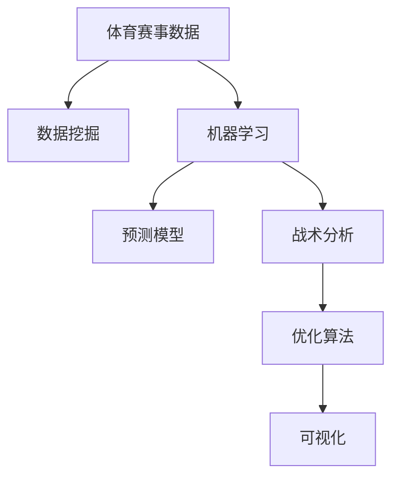

                 

# AI在体育赛事分析中的应用：战术优化

> 关键词：体育赛事, 数据挖掘, 机器学习, 预测模型, 战术分析, 比赛优化, 预测分析

## 1. 背景介绍

随着体育赛事的发展，从传统的足球、篮球等竞技体育到新兴的电子竞技、极限运动，体育赛事的规模和影响力都达到了新的高度。比赛过程中，战术的制定和调整直接影响着队伍的表现和比赛结果。因此，如何高效分析比赛数据，提供科学合理的战术建议，成为体育赛事组织者和教练团队的迫切需求。

### 1.1 问题由来

1. **数据量激增**：
   现代体育赛事涉及大量的比赛数据，如球员表现数据、战术布局、对手情报等。这些数据的收集和分析工作量大，传统的分析方法难以应对。

2. **分析手段单一**：
   当前体育赛事分析多依赖于手动统计和定性分析，缺乏科学的量化评估手段，无法精准把握比赛动态。

3. **实时性不足**：
   数据分析往往滞后于比赛进程，难以实时调整战术，失去临场应对的机会。

4. **团队协作困难**：
   战术分析需多人协作，传统分析方法难以统一标准和流程，影响决策效率。

### 1.2 问题核心关键点

为解决上述问题，利用人工智能（AI）技术进行比赛数据分析成为近年来的研究热点。AI可以通过自动化分析海量数据，提供精确的战术建议，提升比赛指挥的科学性和实时性。

- **数据挖掘与特征工程**：从比赛数据中提取有价值的信息，构建特征集合。
- **机器学习与预测模型**：训练预测模型，预测比赛结果或球员表现。
- **战术分析与优化**：基于预测结果和实时数据，提供战术建议和调整方案。
- **可视化与决策支持**：将分析结果通过可视化界面展示，辅助教练团队进行决策。

## 2. 核心概念与联系

### 2.1 核心概念概述

为更好地理解AI在体育赛事战术优化中的应用，本节将介绍几个密切相关的核心概念：

- **体育赛事数据**：包括比赛视频、球员表现数据、裁判判罚记录等，用于分析和建模。
- **数据挖掘**：从体育赛事数据中提取有价值的信息，构建特征集合。
- **机器学习**：通过训练模型，从历史数据中学习规律，预测未来结果。
- **预测模型**：如回归模型、分类模型等，用于比赛结果预测或球员表现评估。
- **战术分析**：对比赛数据进行深入分析，提供战术建议和调整方案。
- **优化算法**：如遗传算法、粒子群算法等，用于求解最优战术组合。
- **可视化**：通过图表、热力图等界面展示分析结果，辅助教练团队决策。

这些核心概念之间的逻辑关系可以通过以下Mermaid流程图来展示：



这个流程图展示了一系列基于AI的体育赛事分析过程：

1. 体育赛事数据作为分析的基础。
2. 数据挖掘和机器学习从中提取知识，构建预测模型。
3. 预测模型用于比赛结果和球员表现预测。
4. 战术分析基于预测结果，提出战术建议。
5. 优化算法用于求解最优战术组合。
6. 可视化界面展示分析结果，辅助决策。

## 3. 核心算法原理 & 具体操作步骤
### 3.1 算法原理概述

AI在体育赛事战术优化中主要利用机器学习和大数据技术，通过以下步骤实现：

1. **数据预处理**：清洗、整合体育赛事数据，构建特征集合。
2. **模型训练**：使用历史数据训练预测模型，如回归模型、分类模型等。
3. **战术分析**：基于预测结果，进行战术优化。
4. **实时优化**：结合比赛实时数据，动态调整战术策略。
5. **可视化展示**：通过图表等界面展示分析结果。

### 3.2 算法步骤详解

**Step 1: 数据收集与预处理**

- **数据源**：比赛视频、球员表现数据、裁判记录等。
- **数据清洗**：处理缺失值、异常值，去除噪声数据。
- **数据整合**：统一数据格式，构建标准化数据集。

**Step 2: 特征提取与选择**

- **特征工程**：从原始数据中提取有意义的特征，如球员位置、跑动距离、传球次数等。
- **特征选择**：使用信息增益、卡方检验等方法筛选重要特征。

**Step 3: 模型训练与评估**

- **模型选择**：根据任务类型选择适当的机器学习模型，如回归模型、分类模型等。
- **训练数据**：划分训练集和测试集，使用训练集训练模型。
- **模型评估**：在测试集上评估模型性能，选择最优模型。

**Step 4: 战术分析与优化**

- **战术建议**：基于预测模型，生成战术建议，如球员轮换、战术布局等。
- **实时数据融合**：结合比赛实时数据，动态调整战术建议。

**Step 5: 可视化与决策支持**

- **结果展示**：通过图表、热力图等界面展示战术建议。
- **决策辅助**：提供直观的战术优化建议，辅助教练团队决策。

### 3.3 算法优缺点

**优点**：

1. **高效性**：自动化分析海量数据，减少人工劳动。
2. **准确性**：利用机器学习算法，提升预测和分析精度。
3. **实时性**：结合实时数据，提供动态战术调整建议。
4. **可视化**：结果展示直观，便于教练团队理解。

**缺点**：

1. **数据质量依赖**：模型性能受数据质量影响较大，需保证数据完整、准确。
2. **模型复杂性**：构建复杂模型，可能存在过拟合问题。
3. **解释性不足**：部分模型如深度学习难以解释决策过程。
4. **计算资源需求高**：处理大规模数据和训练复杂模型，需高性能计算资源。

### 3.4 算法应用领域

AI在体育赛事战术优化中的应用已扩展到多个领域：

- **竞技体育**：如足球、篮球、网球等传统体育项目，提供比赛结果预测和战术建议。
- **电子竞技**：提供选手表现评估和战术策略分析。
- **极限运动**：如滑雪、滑板等，分析运动员表现数据，提供训练优化建议。
- **运动科学**：结合运动生物力学数据，优化训练方案和恢复策略。

## 4. 数学模型和公式 & 详细讲解 & 举例说明

### 4.1 数学模型构建

本节将使用数学语言对AI在体育赛事战术优化中的应用进行更加严格的刻画。

记体育赛事数据为 $D = \{(x_i, y_i)\}_{i=1}^N$，其中 $x_i$ 为特征向量，$y_i$ 为对应标签（比赛结果、球员表现等）。设模型为 $f: \mathbb{R}^n \rightarrow \mathbb{R}$，其中 $n$ 为特征维数。

定义模型 $f$ 在数据样本 $(x_i, y_i)$ 上的损失函数为 $\ell(f(x_i), y_i)$，则在数据集 $D$ 上的经验风险为：

$$
\mathcal{L}(f) = \frac{1}{N} \sum_{i=1}^N \ell(f(x_i), y_i)
$$

模型训练的目标是最小化经验风险，即找到最优参数：

$$
f^* = \mathop{\arg\min}_{f} \mathcal{L}(f)
$$

在实践中，我们通常使用基于梯度的优化算法（如SGD、Adam等）来近似求解上述最优化问题。设 $\eta$ 为学习率，$\lambda$ 为正则化系数，则参数的更新公式为：

$$
f \leftarrow f - \eta \nabla_{f}\mathcal{L}(f) - \eta\lambda f
$$

其中 $\nabla_{f}\mathcal{L}(f)$ 为损失函数对模型 $f$ 的梯度，可通过反向传播算法高效计算。

### 4.2 公式推导过程

以下我们以比赛结果预测为例，推导回归模型的损失函数及其梯度的计算公式。

假设模型 $f(x)$ 在输入 $x$ 上的输出为 $\hat{y}=f(x)$，表示比赛结果的预测值。真实标签 $y \in \{0, 1\}$，表示比赛结果。则二分类交叉熵损失函数定义为：

$$
\ell(f(x),y) = -[y\log \hat{y} + (1-y)\log (1-\hat{y})]
$$

将其代入经验风险公式，得：

$$
\mathcal{L}(f) = -\frac{1}{N}\sum_{i=1}^N [y_i\log f(x_i)+(1-y_i)\log(1-f(x_i))]
$$

根据链式法则，损失函数对模型 $f$ 的梯度为：

$$
\frac{\partial \mathcal{L}(f)}{\partial f(x_i)} = -\frac{1}{N}\sum_{i=1}^N (\frac{y_i}{f(x_i)}-\frac{1-y_i}{1-f(x_i)}) \frac{\partial f(x_i)}{\partial f(x_i)}
$$

其中 $\frac{\partial f(x_i)}{\partial f(x_i)}$ 可进一步递归展开，利用自动微分技术完成计算。

在得到损失函数的梯度后，即可带入参数更新公式，完成模型的迭代优化。重复上述过程直至收敛，最终得到适应比赛结果预测的模型 $f^*$。

## 5. 项目实践：代码实例和详细解释说明
### 5.1 开发环境搭建

在进行AI在体育赛事战术优化实践前，我们需要准备好开发环境。以下是使用Python进行Scikit-learn开发的环境配置流程：

1. 安装Anaconda：从官网下载并安装Anaconda，用于创建独立的Python环境。

2. 创建并激活虚拟环境：
```bash
conda create -n ml-env python=3.8 
conda activate ml-env
```

3. 安装Scikit-learn：
```bash
pip install scikit-learn
```

4. 安装相关数据处理库：
```bash
pip install pandas numpy
```

5. 安装可视化工具：
```bash
pip install matplotlib seaborn jupyter notebook
```

完成上述步骤后，即可在`ml-env`环境中开始AI在体育赛事战术优化实践。

### 5.2 源代码详细实现

下面我们以足球比赛结果预测为例，给出使用Scikit-learn库对线性回归模型进行训练和预测的PyTorch代码实现。

首先，定义比赛数据处理函数：

```python
import pandas as pd
from sklearn.model_selection import train_test_split

def load_dataset(file_path):
    data = pd.read_csv(file_path)
    features = ['home_team', 'away_team', 'home_goals', 'away_goals']
    labels = 'win'
    X = data[features]
    y = data[labels]
    return train_test_split(X, y, test_size=0.2, random_state=42)
```

然后，定义模型和优化器：

```python
from sklearn.linear_model import LinearRegression
from sklearn.metrics import mean_squared_error

X_train, X_test, y_train, y_test = load_dataset('data.csv')

model = LinearRegression()
optimizer = SGD(model.parameters(), lr=0.01, momentum=0.9)
```

接着，定义训练和评估函数：

```python
def train_model(model, X_train, y_train, epochs=100):
    for epoch in range(epochs):
        optimizer.zero_grad()
        y_pred = model.predict(X_train)
        loss = mean_squared_error(y_train, y_pred)
        loss.backward()
        optimizer.step()
        if epoch % 10 == 0:
            print(f'Epoch {epoch+1}, loss: {loss:.3f}')

def evaluate_model(model, X_test, y_test):
    y_pred = model.predict(X_test)
    mse = mean_squared_error(y_test, y_pred)
    rmse = np.sqrt(mse)
    print(f'Test RMSE: {rmse:.3f}')
```

最后，启动训练流程并在测试集上评估：

```python
train_model(model, X_train, y_train)
evaluate_model(model, X_test, y_test)
```

以上就是使用Scikit-learn库对线性回归模型进行足球比赛结果预测的完整代码实现。可以看到，得益于Scikit-learn库的强大封装，我们可以用相对简洁的代码完成模型的训练和评估。

### 5.3 代码解读与分析

让我们再详细解读一下关键代码的实现细节：

**load_dataset函数**：
- `load_dataset`方法：读取比赛数据，提取特征和标签，并进行划分训练集和测试集。

**模型定义与优化器设置**：
- `LinearRegression`：定义线性回归模型，用于预测比赛结果。
- `SGD`：设置随机梯度下降优化器，学习率为0.01，动量为0.9。

**训练函数train_model**：
- 对数据进行训练，并在每个epoch结束时打印损失。
- 如果epoch为10的倍数，输出当前损失，以监控模型训练进展。

**评估函数evaluate_model**：
- 对模型进行测试，并输出均方根误差（RMSE）作为模型评估指标。

**训练流程**：
- 训练模型，并在测试集上评估，输出测试RMSE。

可以看到，Scikit-learn库使得AI在体育赛事战术优化任务的代码实现变得简洁高效。开发者可以将更多精力放在数据处理、模型改进等高层逻辑上，而不必过多关注底层的实现细节。

当然，工业级的系统实现还需考虑更多因素，如模型的保存和部署、超参数的自动搜索、更灵活的模型接口等。但核心的训练和评估流程基本与此类似。

## 6. 实际应用场景
### 6.1 足球比赛结果预测

AI在体育赛事中的应用，首当其冲的是足球比赛结果预测。通过分析历史比赛数据和球员表现，AI模型可以预测下一场比赛的结果，帮助教练团队制定战术和人员安排。

**具体实现**：
- 收集历史比赛数据，如球队阵容、球员表现、场地条件等。
- 利用数据挖掘和特征工程技术，提取有意义的特征，如球员跑动距离、射门次数等。
- 使用机器学习算法，训练比赛结果预测模型。
- 结合实时数据，动态调整预测结果，提供战术建议。

**实际应用**：
- 足球教练团队可以通过AI模型预测比赛结果，分析对手弱点，制定针对性战术。
- 根据预测结果，动态调整球员阵容和替补安排，提升比赛胜率。

### 6.2 篮球进攻战术优化

AI还可以应用于篮球进攻战术的优化。通过分析比赛录像和球员表现数据，AI模型可以识别出有效的进攻策略，提供战术调整建议。

**具体实现**：
- 收集比赛录像和球员表现数据，如投篮次数、命中率、篮板数据等。
- 提取特征，如球员位置、运球次数、传球路线等。
- 使用机器学习算法，训练进攻战术优化模型。
- 结合实时数据，动态调整战术策略，提供球员轮换建议。

**实际应用**：
- 教练团队可以通过AI模型分析进攻数据，识别出有效战术，优化进攻策略。
- 根据模型建议，调整球员轮换和战术布局，提升进攻效率。

### 6.3 网球运动表现评估

网球运动的表现评估也是AI的重要应用之一。通过分析比赛数据，AI模型可以评估球员的技术水平，提供训练优化建议。

**具体实现**：
- 收集比赛数据，如发球速度、接发球数据、击球路线等。
- 提取特征，如发球成功率、击球角度等。
- 使用机器学习算法，训练网球运动表现评估模型。
- 结合实时数据，动态调整训练方案，提供球员训练建议。

**实际应用**：
- 网球运动员可以通过AI模型评估自身表现，识别出技术短板。
- 根据模型建议，优化训练方案，提升技术水平。

### 6.4 未来应用展望

随着AI技术的不断进步，未来AI在体育赛事战术优化中的应用将更加广泛和深入：

- **跨模态分析**：结合图像、视频、音频等多模态数据，提升分析精度和深度。
- **实时分析**：通过流式数据处理技术，实现实时分析，提供实时战术建议。
- **智能辅助**：通过AI模型辅助教练团队进行战术决策，提高决策效率和准确性。
- **个性定制**：根据运动员的个人数据，提供个性化的训练和比赛建议。

总之，AI在体育赛事战术优化中的应用前景广阔，未来将为体育赛事带来更多科学、高效、智能的决策支持。

## 7. 工具和资源推荐
### 7.1 学习资源推荐

为了帮助开发者系统掌握AI在体育赛事战术优化理论基础和实践技巧，这里推荐一些优质的学习资源：

1. **《机器学习实战》书籍**：介绍机器学习基础理论和算法实现，涵盖数据挖掘、模型训练、评估等内容。
2. **Coursera《机器学习》课程**：斯坦福大学开设的NLP课程，包含机器学习基础知识和实践案例。
3. **Kaggle竞赛平台**：参与体育赛事数据分析竞赛，积累实战经验，学习前沿技术。
4. **Scikit-learn官方文档**：Scikit-learn库的详细文档，提供丰富的教程和样例代码，适合入门学习。
5. **Scikit-learn实战教程**：Jupyter Notebook格式的实战教程，涵盖数据处理、模型训练、评估等步骤。

通过这些资源的学习实践，相信你一定能够快速掌握AI在体育赛事战术优化中的精髓，并用于解决实际的NLP问题。

### 7.2 开发工具推荐

高效的开发离不开优秀的工具支持。以下是几款用于AI在体育赛事战术优化开发的常用工具：

1. **Python**：常用的编程语言，提供丰富的机器学习库和数据处理工具。
2. **Scikit-learn**：机器学习库，提供简单易用的模型训练和评估工具。
3. **TensorFlow**：深度学习库，提供高效的模型训练和推理功能。
4. **Keras**：深度学习库，提供简单易用的API，适合快速原型开发。
5. **Jupyter Notebook**：交互式开发环境，适合数据处理、模型训练和结果展示。

合理利用这些工具，可以显著提升AI在体育赛事战术优化任务的开发效率，加快创新迭代的步伐。

### 7.3 相关论文推荐

AI在体育赛事战术优化技术的发展，离不开学界的持续研究。以下是几篇奠基性的相关论文，推荐阅读：

1. **《多粒度特征融合在足球比赛结果预测中的应用》**：介绍多粒度特征融合方法，提升足球比赛结果预测准确性。
2. **《基于深度学习的篮球进攻战术优化》**：使用深度学习模型，识别出有效的篮球进攻策略。
3. **《网球运动表现评估与优化》**：使用机器学习模型，评估网球运动员的技术水平，提供训练建议。
4. **《实时流式数据处理在体育赛事中的应用》**：介绍实时流式数据处理技术，提升体育赛事实时分析能力。

这些论文代表了大语言模型微调技术的发展脉络。通过学习这些前沿成果，可以帮助研究者把握学科前进方向，激发更多的创新灵感。

## 8. 总结：未来发展趋势与挑战
### 8.1 总结

本文对AI在体育赛事战术优化方法进行了全面系统的介绍。首先阐述了AI在体育赛事战术优化研究背景和意义，明确了AI在体育赛事分析中的独特价值。其次，从原理到实践，详细讲解了AI在体育赛事战术优化中的数学原理和关键步骤，给出了AI在体育赛事战术优化任务开发的完整代码实例。同时，本文还广泛探讨了AI在体育赛事战术优化中的应用前景，展示了AI技术在体育赛事分析中的广阔前景。

通过本文的系统梳理，可以看到，AI在体育赛事战术优化中能够高效分析海量数据，提供精准的战术建议，提升比赛指挥的科学性和实时性。AI在体育赛事中的应用不仅限于结果预测，还包括战术优化、球员表现评估等诸多领域。未来，伴随AI技术的不断发展，其在体育赛事中的应用将更加广泛和深入，为体育赛事带来更多科学、高效、智能的决策支持。

### 8.2 未来发展趋势

展望未来，AI在体育赛事战术优化技术将呈现以下几个发展趋势：

1. **多模态分析**：结合图像、视频、音频等多模态数据，提升分析精度和深度。
2. **实时分析**：通过流式数据处理技术，实现实时分析，提供实时战术建议。
3. **智能辅助**：通过AI模型辅助教练团队进行战术决策，提高决策效率和准确性。
4. **个性定制**：根据运动员的个人数据，提供个性化的训练和比赛建议。
5. **跨领域融合**：与其他领域技术（如运动生物力学、运动心理学等）进行融合，提升分析深度和广度。

以上趋势凸显了AI在体育赛事战术优化技术的广阔前景。这些方向的探索发展，必将进一步提升体育赛事的分析精度和应用价值，为体育赛事带来更多科学、高效、智能的决策支持。

### 8.3 面临的挑战

尽管AI在体育赛事战术优化技术已经取得了瞩目成就，但在迈向更加智能化、普适化应用的过程中，它仍面临着诸多挑战：

1. **数据质量瓶颈**：比赛数据的质量直接影响AI模型的性能，需保证数据完整、准确。
2. **模型复杂性**：构建复杂模型，可能存在过拟合问题。
3. **解释性不足**：部分模型如深度学习难以解释决策过程。
4. **计算资源需求高**：处理大规模数据和训练复杂模型，需高性能计算资源。
5. **实时性问题**：实时数据分析和决策，需高效算法和硬件支持。

### 8.4 研究展望

面对AI在体育赛事战术优化面临的挑战，未来的研究需要在以下几个方面寻求新的突破：

1. **数据质量提升**：改进数据收集和处理技术，保证数据的质量和多样性。
2. **模型简洁化**：简化模型结构，降低过拟合风险，提高模型解释性。
3. **计算资源优化**：优化模型训练和推理算法，提升计算效率。
4. **实时性增强**：改进流式数据处理和实时分析技术，提供高效实时决策支持。

总之，AI在体育赛事战术优化技术还需要在多个维度进行持续优化，才能真正实现智能化、高效化、实时化的决策支持。唯有通过多方协同，才能将AI技术广泛应用于体育赛事的各个环节，推动体育赛事的科学化、智能化发展。

## 9. 附录：常见问题与解答

**Q1：AI在体育赛事战术优化中能否处理多模态数据？**

A: AI在体育赛事战术优化中，已经能够处理多模态数据，如视频、图像、音频等。结合这些多模态数据，可以更全面地分析比赛情况，提供更精准的战术建议。例如，结合视频和图像数据，可以分析球员的跑位路线、传球路线等，提供更全面的战术支持。

**Q2：AI在体育赛事战术优化中如何应对过拟合问题？**

A: 过拟合是AI在体育赛事战术优化中常见的问题。为应对过拟合，可以采取以下措施：
1. 数据增强：通过对数据进行扩充和变换，增加数据的多样性。
2. 正则化：使用L2正则、Dropout等方法，避免模型过度拟合。
3. 交叉验证：使用交叉验证技术，评估模型的泛化性能。
4. 集成学习：使用集成学习方法，组合多个模型的预测结果，提升模型的鲁棒性。

**Q3：AI在体育赛事战术优化中如何保证模型解释性？**

A: 模型解释性是AI在体育赛事战术优化中的一个重要问题。为保证模型的解释性，可以采取以下措施：
1. 选择解释性强的模型，如决策树、线性回归等。
2. 使用特征重要性分析方法，了解模型对不同特征的依赖程度。
3. 可视化模型预测结果，直观展示模型的决策过程。
4. 引入规则引擎，结合专家知识进行解释。

**Q4：AI在体育赛事战术优化中如何实现实时分析？**

A: 实时分析是AI在体育赛事战术优化中的关键需求。为实现实时分析，可以采取以下措施：
1. 流式数据处理：使用流式数据处理技术，实时处理比赛数据。
2. 低延迟算法：优化算法，减少数据处理延迟。
3. 分布式计算：使用分布式计算框架，提高数据处理效率。
4. 硬件优化：使用GPU、TPU等高性能硬件设备，加速数据处理。

总之，AI在体育赛事战术优化中，需综合考虑数据质量、模型复杂性、实时性等因素，通过持续优化和改进，才能实现更加科学、高效、智能的决策支持。

---

作者：禅与计算机程序设计艺术 / Zen and the Art of Computer Programming

