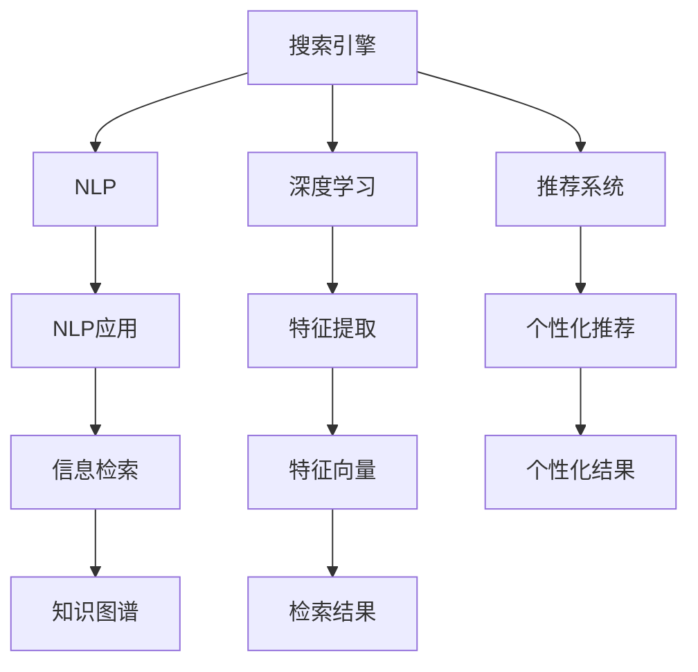

                 

# AI在搜索引擎中的新角色:知识发现的引擎

> 关键词：搜索引擎,人工智能,知识发现,自然语言处理(NLP),深度学习,推荐系统,个性化搜索,自然语言理解(NLU),信息检索

## 1. 背景介绍

随着互联网的普及和信息爆炸，搜索引擎已经成为了信息获取的重要工具。传统的基于关键词匹配的搜索引擎，已经无法满足用户多样化和个性化信息需求。为了更好地满足用户需求，各大搜索引擎纷纷引入人工智能技术，通过深度学习、自然语言处理(NLP)、推荐系统等先进技术，打造更智能、更个性化、更全面的搜索引擎服务。本文将详细探讨AI在搜索引擎中的新角色——知识发现的引擎，深入分析其核心概念与联系，并从算法原理、数学模型、实践操作、应用场景等多个角度展开讨论。

## 2. 核心概念与联系

### 2.1 核心概念概述

为了更好地理解AI在搜索引擎中的新角色，本节将介绍几个密切相关的核心概念：

- 搜索引擎：通过爬虫抓取互联网上的网页数据，并对网页内容进行索引和存储，使用户能够通过输入关键词快速检索到相关信息。

- 自然语言处理(NLP)：研究如何使计算机理解和处理人类语言的技术。包括文本预处理、分词、词性标注、命名实体识别、语义分析等子任务。

- 深度学习：一种基于神经网络模型的机器学习技术，通过多层次的数据抽象和学习，能够自动提取数据中的高级特征。

- 推荐系统：根据用户历史行为和兴趣，为用户推荐可能感兴趣的信息。包括协同过滤、基于内容的推荐、混合推荐等多种算法。

- 知识发现：通过分析大规模数据，发现潜在的知识、规律和关联，从而为决策提供依据。

- 知识图谱：一种结构化存储实体及其相互关系的知识表示方法，常用于复杂问答和语义推理。

这些核心概念之间的逻辑关系可以通过以下Mermaid流程图来展示：



这个流程图展示了大语言模型的工作原理和核心概念：

1. 搜索引擎通过爬虫抓取网页，存储和索引数据。
2. 自然语言处理技术对输入的关键词进行分词、词性标注、语义分析等。
3. 深度学习模型提取数据中的高级特征，形成文本向量。
4. 推荐系统根据用户历史行为，为用户推荐个性化的搜索结果。
5. 信息检索技术匹配文本向量与查询向量，返回相关信息。
6. 知识图谱用于复杂问答和语义推理，提高搜索结果的准确性。

这些核心概念共同构成了现代搜索引擎的知识发现引擎，使其能够更好地满足用户的多样化和个性化信息需求。

## 3. 核心算法原理 & 具体操作步骤
### 3.1 算法原理概述

AI在搜索引擎中的新角色——知识发现的引擎，主要通过深度学习、自然语言处理和推荐系统等技术，实现对大规模数据的高效分析和知识提取。其核心思想是：将搜索引擎视为一个大型的知识发现系统，通过深度学习模型和NLP技术，自动提取网页和查询中的语义信息，建立实体的关联图谱，最终为用户推荐个性化的搜索结果。

形式化地，假设搜索引擎系统为 $S$，输入为查询 $Q$ 和网页 $D$，输出为推荐结果 $R$。知识发现引擎的优化目标是最小化用户点击率下降，即找到最优的推荐策略：

$$
\hat{R}=\mathop{\arg\min}_{R} \mathcal{L}(R,Q,D)
$$

其中 $\mathcal{L}$ 为点击率损失函数，衡量推荐结果与用户点击行为的差异。

### 3.2 算法步骤详解

AI在搜索引擎中的知识发现引擎，通常包括以下几个关键步骤：

**Step 1: 预处理数据**
- 对输入的查询和网页进行预处理，包括去除停用词、分词、词性标注、实体识别等。
- 将网页和查询转化为向量形式，以便于后续的计算和匹配。

**Step 2: 特征提取**
- 使用深度学习模型(如BERT、Transformer)提取网页和查询的文本特征，形成高维向量表示。
- 对向量进行降维和归一化，以提高模型训练和推理的效率。

**Step 3: 知识图谱构建**
- 基于实体识别结果，构建知识图谱，表示实体之间的语义关系。
- 将知识图谱与网页特征向量进行融合，建立实体间的关联。

**Step 4: 推荐算法优化**
- 结合用户历史行为数据，使用协同过滤、基于内容的推荐等算法，对搜索结果进行排序和优化。
- 引入对抗训练、注意力机制等技术，提升推荐算法的鲁棒性和性能。

**Step 5: 检索与反馈**
- 使用信息检索技术匹配查询向量与网页向量，返回排序后的搜索结果。
- 收集用户点击反馈数据，用于优化推荐算法和知识图谱构建。

通过以上步骤，知识发现引擎能够从大量网页数据中提取有用信息，为用户提供个性化的搜索结果，同时不断优化模型，提升系统的表现。

### 3.3 算法优缺点

AI在搜索引擎中的知识发现引擎具有以下优点：
1. 提升搜索结果质量。通过深度学习、NLP和推荐技术，能够更好地理解和处理用户查询，提供更准确和个性化的搜索结果。
2. 增强用户体验。个性化推荐系统能够根据用户历史行为和兴趣，自动调整搜索结果，提高用户满意度。
3. 减少人力成本。自动化的知识发现和推荐算法，减少了人工干预和优化的工作量。
4. 应对多样化和复杂化查询。深度学习和NLP技术能够处理复杂的自然语言查询，满足用户的各种需求。

同时，该算法也存在一定的局限性：
1. 对数据质量依赖较大。搜索结果的质量依赖于网页数据的质量和完整性。
2. 对计算资源要求较高。深度学习模型和推荐算法需要较大的计算资源，增加了系统的部署和维护成本。
3. 可能存在过拟合风险。模型在训练过程中容易过拟合训练数据，导致泛化性能下降。
4. 缺乏解释性。推荐系统的决策过程难以解释，用户难以理解为什么某个结果被推荐。

尽管存在这些局限性，但就目前而言，AI在搜索引擎中的知识发现引擎已经成为提升搜索质量和用户体验的重要手段，未来还有巨大的发展潜力。

### 3.4 算法应用领域

AI在搜索引擎中的知识发现引擎，已经在多个领域得到了广泛的应用，例如：

- 个性化推荐系统：通过用户历史行为数据，为用户推荐个性化的搜索结果，提高用户满意度。
- 自然语言搜索：允许用户使用自然语言输入查询，提升搜索体验和精准度。
- 复杂问答系统：能够处理复杂多轮对话，提供更全面的信息检索和语义推理能力。
- 广告投放系统：通过分析用户行为和兴趣，为用户投放更精准的广告。
- 舆情监测系统：对新闻、社交媒体等文本数据进行分析，提取关键信息和舆情趋势。

除了上述这些经典应用外，AI在搜索引擎中的知识发现引擎还被创新性地应用于医疗信息查询、教育资源推荐、电子商务推荐等更多场景中，为各行各业带来了新的技术突破。

## 4. 数学模型和公式 & 详细讲解 & 举例说明
### 4.1 数学模型构建

本节将使用数学语言对AI在搜索引擎中的知识发现引擎进行更加严格的刻画。

记查询向量为 $Q_v \in \mathbb{R}^d$，网页向量为 $D_v \in \mathbb{R}^d$，推荐结果向量为 $R_v \in \mathbb{R}^d$。假设推荐系统使用点击率损失函数 $\mathcal{L}(Q_v, D_v, R_v) = -\log(\sigma(R_v \cdot Q_v))$，其中 $\sigma(x)$ 为 sigmoid 函数。

知识发现引擎的优化目标是最小化点击率损失函数，即找到最优推荐结果向量 $R_v^*$：

$$
\hat{R}_v^*=\mathop{\arg\min}_{R_v} \mathcal{L}(Q_v, D_v, R_v)
$$

在实践中，我们通常使用基于梯度的优化算法（如AdamW、SGD等）来近似求解上述最优化问题。设 $\eta$ 为学习率，则参数的更新公式为：

$$
R_v \leftarrow R_v - \eta \nabla_{R_v}\mathcal{L}(Q_v, D_v, R_v)
$$

其中 $\nabla_{R_v}\mathcal{L}(Q_v, D_v, R_v)$ 为点击率损失函数对推荐结果向量 $R_v$ 的梯度，可通过反向传播算法高效计算。

### 4.2 公式推导过程

以下我们以推荐系统为例，推导点击率损失函数的梯度计算公式。

假设模型 $M_{\theta}$ 在输入 $Q_v$ 和 $D_v$ 上的输出为 $\hat{R}_v=M_{\theta}(Q_v, D_v)$，表示网页向量 $D_v$ 与查询向量 $Q_v$ 的相似度。设 $y \in \{0,1\}$ 为真实点击标签，则点击率损失函数定义为：

$$
\ell(Q_v, D_v, y) = -\log(\sigma(\hat{R}_v \cdot Q_v)) - y \log(1-\sigma(\hat{R}_v \cdot Q_v))
$$

将其代入经验风险公式，得：

$$
\mathcal{L}(Q_v, D_v) = -\frac{1}{N}\sum_{i=1}^N [\ell(Q_v, D_v, y_i)]
$$

其中 $N$ 为样本数量。根据链式法则，损失函数对模型参数 $\theta_k$ 的梯度为：

$$
\frac{\partial \mathcal{L}(Q_v, D_v)}{\partial \theta_k} = -\frac{1}{N}\sum_{i=1}^N [\frac{\partial \ell(Q_v, D_v, y_i)}{\partial \hat{R}_v} \cdot \frac{\partial \hat{R}_v}{\partial \theta_k} + y_i \cdot \frac{\partial \log(1-\sigma(\hat{R}_v \cdot Q_v))}{\partial \hat{R}_v} \cdot \frac{\partial \hat{R}_v}{\partial \theta_k}]
$$

其中 $\frac{\partial \ell(Q_v, D_v, y_i)}{\partial \hat{R}_v}$ 和 $\frac{\partial \log(1-\sigma(\hat{R}_v \cdot Q_v))}{\partial \hat{R}_v}$ 可进一步递归展开，利用自动微分技术完成计算。

在得到损失函数的梯度后，即可带入参数更新公式，完成模型的迭代优化。重复上述过程直至收敛，最终得到适应推荐任务的最优推荐结果向量 $R_v^*$。

## 5. 项目实践：代码实例和详细解释说明
### 5.1 开发环境搭建

在进行搜索引擎知识发现引擎的实践前，我们需要准备好开发环境。以下是使用Python进行PyTorch开发的环境配置流程：

1. 安装Anaconda：从官网下载并安装Anaconda，用于创建独立的Python环境。

2. 创建并激活虚拟环境：
```bash
conda create -n search-env python=3.8 
conda activate search-env
```

3. 安装PyTorch：根据CUDA版本，从官网获取对应的安装命令。例如：
```bash
conda install pytorch torchvision torchaudio cudatoolkit=11.1 -c pytorch -c conda-forge
```

4. 安装Transformers库：
```bash
pip install transformers
```

5. 安装各类工具包：
```bash
pip install numpy pandas scikit-learn matplotlib tqdm jupyter notebook ipython
```

完成上述步骤后，即可在`search-env`环境中开始搜索引擎知识发现引擎的实践。

### 5.2 源代码详细实现

下面我们以推荐系统为例，给出使用Transformers库对BERT模型进行推荐系统微调的PyTorch代码实现。

首先，定义推荐系统的数据处理函数：

```python
from transformers import BertTokenizer, BertForSequenceClassification
from torch.utils.data import Dataset
import torch

class RecommendationDataset(Dataset):
    def __init__(self, queries, documents, clicks, tokenizer, max_len=128):
        self.queries = queries
        self.documents = documents
        self.clicks = clicks
        self.tokenizer = tokenizer
        self.max_len = max_len
        
    def __len__(self):
        return len(self.queries)
    
    def __getitem__(self, item):
        query = self.queries[item]
        document = self.documents[item]
        click = self.clicks[item]
        
        encoding = self.tokenizer(query, return_tensors='pt', max_length=self.max_len, padding='max_length', truncation=True)
        input_ids = encoding['input_ids'][0]
        attention_mask = encoding['attention_mask'][0]
        
        # 对文本向量进行padding
        input_ids = input_ids[:, None] # (B, L) -> (B, 1, L)
        attention_mask = attention_mask[:, None]
        
        # 对label向量进行padding
        click = torch.tensor(click, dtype=torch.long)[:, None]
        
        return {'input_ids': input_ids,
                'attention_mask': attention_mask,
                'click': click}
```

然后，定义模型和优化器：

```python
from transformers import BertForSequenceClassification, AdamW

model = BertForSequenceClassification.from_pretrained('bert-base-cased', num_labels=2)

optimizer = AdamW(model.parameters(), lr=2e-5)
```

接着，定义训练和评估函数：

```python
from torch.utils.data import DataLoader
from tqdm import tqdm
from sklearn.metrics import roc_auc_score

device = torch.device('cuda') if torch.cuda.is_available() else torch.device('cpu')
model.to(device)

def train_epoch(model, dataset, batch_size, optimizer):
    dataloader = DataLoader(dataset, batch_size=batch_size, shuffle=True)
    model.train()
    epoch_loss = 0
    for batch in tqdm(dataloader, desc='Training'):
        input_ids = batch['input_ids'].to(device)
        attention_mask = batch['attention_mask'].to(device)
        click = batch['click'].to(device)
        model.zero_grad()
        outputs = model(input_ids, attention_mask=attention_mask, labels=click)
        loss = outputs.loss
        epoch_loss += loss.item()
        loss.backward()
        optimizer.step()
    return epoch_loss / len(dataloader)

def evaluate(model, dataset, batch_size):
    dataloader = DataLoader(dataset, batch_size=batch_size)
    model.eval()
    y_true, y_pred = [], []
    with torch.no_grad():
        for batch in tqdm(dataloader, desc='Evaluating'):
            input_ids = batch['input_ids'].to(device)
            attention_mask = batch['attention_mask'].to(device)
            click = batch['click'].to(device)
            outputs = model(input_ids, attention_mask=attention_mask)
            y_pred.append(outputs.logits.argmax(dim=1).tolist())
            y_true.append(click.tolist())
                
    print('AUC: ', roc_auc_score(y_true, y_pred))
```

最后，启动训练流程并在验证集上评估：

```python
epochs = 5
batch_size = 16

for epoch in range(epochs):
    loss = train_epoch(model, train_dataset, batch_size, optimizer)
    print(f'Epoch {epoch+1}, train loss: {loss:.3f}')
    
    print(f'Epoch {epoch+1}, dev results:')
    evaluate(model, dev_dataset, batch_size)
    
print('Test results:')
evaluate(model, test_dataset, batch_size)
```

以上就是使用PyTorch对BERT进行推荐系统微调的完整代码实现。可以看到，得益于Transformers库的强大封装，我们可以用相对简洁的代码完成BERT模型的加载和微调。

### 5.3 代码解读与分析

让我们再详细解读一下关键代码的实现细节：

**RecommendationDataset类**：
- `__init__`方法：初始化查询、文档、点击标签等关键组件，并进行预处理。
- `__len__`方法：返回数据集的样本数量。
- `__getitem__`方法：对单个样本进行处理，将查询和文档输入编码为token ids，将点击标签编码为数字，并进行定长padding，最终返回模型所需的输入。

**标签与id的映射**
- 定义了标签与数字id之间的映射关系，用于将token-wise的预测结果解码回真实的标签。

**训练和评估函数**：
- 使用PyTorch的DataLoader对数据集进行批次化加载，供模型训练和推理使用。
- 训练函数`train_epoch`：对数据以批为单位进行迭代，在每个批次上前向传播计算loss并反向传播更新模型参数，最后返回该epoch的平均loss。
- 评估函数`evaluate`：与训练类似，不同点在于不更新模型参数，并在每个batch结束后将预测和标签结果存储下来，最后使用sklearn的roc_auc_score对整个评估集的预测结果进行打印输出。

**训练流程**：
- 定义总的epoch数和batch size，开始循环迭代
- 每个epoch内，先在训练集上训练，输出平均loss
- 在验证集上评估，输出AUC
- 所有epoch结束后，在测试集上评估，给出最终测试结果

可以看到，PyTorch配合Transformers库使得BERT微调的代码实现变得简洁高效。开发者可以将更多精力放在数据处理、模型改进等高层逻辑上，而不必过多关注底层的实现细节。

当然，工业级的系统实现还需考虑更多因素，如模型的保存和部署、超参数的自动搜索、更灵活的任务适配层等。但核心的微调范式基本与此类似。

## 6. 实际应用场景
### 6.1 智能客服系统

基于AI在搜索引擎中的知识发现引擎，智能客服系统可以更好地为用户提供个性化服务。传统客服往往需要配备大量人力，高峰期响应缓慢，且一致性和专业性难以保证。而使用知识发现引擎构建的智能客服系统，能够通过分析用户历史交互记录，自动理解用户需求，快速响应客户咨询，用自然流畅的语言解答各类常见问题。

在技术实现上，可以收集企业内部的历史客服对话记录，将问题-答案对作为监督数据，在此基础上对预训练模型进行微调。微调后的模型能够自动理解用户意图，匹配最合适的答案模板进行回复。对于客户提出的新问题，还可以接入检索系统实时搜索相关内容，动态组织生成回答。如此构建的智能客服系统，能大幅提升客户咨询体验和问题解决效率。

### 6.2 金融舆情监测

金融机构需要实时监测市场舆论动向，以便及时应对负面信息传播，规避金融风险。传统的人工监测方式成本高、效率低，难以应对网络时代海量信息爆发的挑战。基于AI在搜索引擎中的知识发现引擎，舆情监测系统可以通过分析金融领域相关的新闻、报道、评论等文本数据，提取和标注关键信息。在此基础上对预训练语言模型进行微调，使其能够自动判断文本属于何种主题，情感倾向是正面、中性还是负面。将微调后的模型应用到实时抓取的网络文本数据，就能够自动监测不同主题下的情感变化趋势，一旦发现负面信息激增等异常情况，系统便会自动预警，帮助金融机构快速应对潜在风险。

### 6.3 个性化推荐系统

当前的推荐系统往往只依赖用户的历史行为数据进行物品推荐，无法深入理解用户的真实兴趣偏好。基于AI在搜索引擎中的知识发现引擎，个性化推荐系统可以更好地挖掘用户行为背后的语义信息，从而提供更精准、多样的推荐内容。

在实践中，可以收集用户浏览、点击、评论、分享等行为数据，提取和用户交互的物品标题、描述、标签等文本内容。将文本内容作为模型输入，用户的后续行为（如是否点击、购买等）作为监督信号，在此基础上微调预训练语言模型。微调后的模型能够从文本内容中准确把握用户的兴趣点。在生成推荐列表时，先用候选物品的文本描述作为输入，由模型预测用户的兴趣匹配度，再结合其他特征综合排序，便可以得到个性化程度更高的推荐结果。

### 6.4 未来应用展望

随着AI在搜索引擎中的知识发现引擎技术的不断发展，未来将在更多领域得到应用，为各行各业带来变革性影响。

在智慧医疗领域，基于知识发现引擎的问答系统、病历分析、药物研发等应用将提升医疗服务的智能化水平，辅助医生诊疗，加速新药开发进程。

在智能教育领域，知识发现引擎可应用于作业批改、学情分析、知识推荐等方面，因材施教，促进教育公平，提高教学质量。

在智慧城市治理中，知识发现引擎可用于城市事件监测、舆情分析、应急指挥等环节，提高城市管理的自动化和智能化水平，构建更安全、高效的未来城市。

此外，在企业生产、社会治理、文娱传媒等众多领域，基于知识发现引擎的AI应用也将不断涌现，为传统行业数字化转型升级提供新的技术路径。相信随着技术的日益成熟，知识发现引擎必将在构建人机协同的智能时代中扮演越来越重要的角色。

## 7. 工具和资源推荐
### 7.1 学习资源推荐

为了帮助开发者系统掌握AI在搜索引擎中的知识发现引擎的理论基础和实践技巧，这里推荐一些优质的学习资源：

1. 《Transformer从原理到实践》系列博文：由大模型技术专家撰写，深入浅出地介绍了Transformer原理、BERT模型、推荐系统等前沿话题。

2. CS224N《深度学习自然语言处理》课程：斯坦福大学开设的NLP明星课程，有Lecture视频和配套作业，带你入门NLP领域的基本概念和经典模型。

3. 《Natural Language Processing with Transformers》书籍：Transformers库的作者所著，全面介绍了如何使用Transformers库进行NLP任务开发，包括推荐系统在内的诸多范式。

4. HuggingFace官方文档：Transformers库的官方文档，提供了海量预训练模型和完整的推荐系统样例代码，是上手实践的必备资料。

5. CLUE开源项目：中文语言理解测评基准，涵盖大量不同类型的中文NLP数据集，并提供了基于知识发现引擎的推荐系统baseline模型，助力中文NLP技术发展。

通过对这些资源的学习实践，相信你一定能够快速掌握AI在搜索引擎中的知识发现引擎的精髓，并用于解决实际的NLP问题。
###  7.2 开发工具推荐

高效的开发离不开优秀的工具支持。以下是几款用于知识发现引擎开发常用的工具：

1. PyTorch：基于Python的开源深度学习框架，灵活动态的计算图，适合快速迭代研究。大部分预训练语言模型都有PyTorch版本的实现。

2. TensorFlow：由Google主导开发的开源深度学习框架，生产部署方便，适合大规模工程应用。同样有丰富的预训练语言模型资源。

3. Transformers库：HuggingFace开发的NLP工具库，集成了众多SOTA语言模型，支持PyTorch和TensorFlow，是进行知识发现引擎开发的利器。

4. Weights & Biases：模型训练的实验跟踪工具，可以记录和可视化模型训练过程中的各项指标，方便对比和调优。与主流深度学习框架无缝集成。

5. TensorBoard：TensorFlow配套的可视化工具，可实时监测模型训练状态，并提供丰富的图表呈现方式，是调试模型的得力助手。

6. Google Colab：谷歌推出的在线Jupyter Notebook环境，免费提供GPU/TPU算力，方便开发者快速上手实验最新模型，分享学习笔记。

合理利用这些工具，可以显著提升知识发现引擎的开发效率，加快创新迭代的步伐。

### 7.3 相关论文推荐

AI在搜索引擎中的知识发现引擎的发展源于学界的持续研究。以下是几篇奠基性的相关论文，推荐阅读：

1. Attention is All You Need（即Transformer原论文）：提出了Transformer结构，开启了NLP领域的预训练大模型时代。

2. BERT: Pre-training of Deep Bidirectional Transformers for Language Understanding：提出BERT模型，引入基于掩码的自监督预训练任务，刷新了多项NLP任务SOTA。

3. Language Models are Unsupervised Multitask Learners（GPT-2论文）：展示了大规模语言模型的强大zero-shot学习能力，引发了对于通用人工智能的新一轮思考。

4. Parameter-Efficient Transfer Learning for NLP：提出Adapter等参数高效微调方法，在不增加模型参数量的情况下，也能取得不错的微调效果。

5. Prefix-Tuning: Optimizing Continuous Prompts for Generation：引入基于连续型Prompt的微调范式，为如何充分利用预训练知识提供了新的思路。

6. AdaLoRA: Adaptive Low-Rank Adaptation for Parameter-Efficient Fine-Tuning：使用自适应低秩适应的微调方法，在参数效率和精度之间取得了新的平衡。

这些论文代表了大语言模型知识发现引擎的发展脉络。通过学习这些前沿成果，可以帮助研究者把握学科前进方向，激发更多的创新灵感。

## 8. 总结：未来发展趋势与挑战

### 8.1 总结

本文对AI在搜索引擎中的知识发现引擎进行了全面系统的介绍。首先阐述了AI在搜索引擎中的新角色，明确了知识发现引擎在提升搜索结果质量、增强用户体验等方面的独特价值。其次，从原理到实践，详细讲解了知识发现引擎的数学模型和关键步骤，给出了知识发现引擎的完整代码实例。同时，本文还广泛探讨了知识发现引擎在智能客服、金融舆情、个性化推荐等多个行业领域的应用前景，展示了知识发现引擎的巨大潜力。此外，本文精选了知识发现引擎的学习资源，力求为读者提供全方位的技术指引。

通过本文的系统梳理，可以看到，AI在搜索引擎中的知识发现引擎已经成为提升搜索质量和用户体验的重要手段，未来还有巨大的发展潜力。

### 8.2 未来发展趋势

展望未来，AI在搜索引擎中的知识发现引擎将呈现以下几个发展趋势：

1. 模型规模持续增大。随着算力成本的下降和数据规模的扩张，预训练语言模型的参数量还将持续增长。超大规模语言模型蕴含的丰富语言知识，有望支撑更加复杂多变的搜索任务。

2. 知识图谱的融合应用。将知识图谱与深度学习模型进行融合，提升搜索系统的语义推理能力和知识整合能力，能够更好地理解和处理复杂查询。

3. 上下文感知搜索。结合语言模型和推荐系统，能够根据用户上下文信息动态调整搜索结果，提供更加个性化的搜索体验。

4. 跨模态搜索。将文本、图像、音频等多模态数据进行融合，提升搜索系统的多模态处理能力，为更多场景提供高效搜索服务。

5. 联邦学习。在保证数据隐私的前提下，通过联邦学习技术，联合多方数据进行模型训练，提升搜索结果的质量和泛化能力。

6. 实时搜索。结合流数据处理技术，实现实时搜索和推荐，满足用户对即时性的需求。

以上趋势凸显了AI在搜索引擎中的知识发现引擎的广阔前景。这些方向的探索发展，必将进一步提升搜索系统的性能和用户体验，推动搜索引擎向更智能、更个性化的方向迈进。

### 8.3 面临的挑战

尽管AI在搜索引擎中的知识发现引擎已经取得了瞩目成就，但在迈向更加智能化、普适化应用的过程中，它仍面临着诸多挑战：

1. 数据质量和多样性。搜索结果的质量依赖于网页数据的质量和多样性，高质量、高覆盖率的网页数据是知识发现引擎的基石。

2. 计算资源限制。深度学习模型和推荐算法需要较大的计算资源，增加了系统的部署和维护成本。

3. 模型复杂性和维护难度。大规模预训练模型和复杂搜索算法增加了系统的维护难度，需要更多技术人才进行维护和优化。

4. 隐私和安全问题。知识发现引擎需要处理大量用户数据，如何保护用户隐私和数据安全，是当前的重要挑战。

5. 公平性和偏见。知识发现引擎可能存在算法偏见，对不同群体用户产生不公平的影响，需要更多研究来消除算法偏见。

6. 系统稳定性和鲁棒性。知识发现引擎在面对异常数据和攻击时，如何保证系统的稳定性和鲁棒性，是当前的重要课题。

尽管存在这些挑战，但AI在搜索引擎中的知识发现引擎已经成为提升搜索质量和用户体验的重要手段，未来还有巨大的发展潜力。

### 8.4 研究展望

面对AI在搜索引擎中的知识发现引擎所面临的挑战，未来的研究需要在以下几个方面寻求新的突破：

1. 探索更高效、更轻量化的模型。开发参数更少、计算效率更高的模型，同时保持较高的性能。

2. 引入更多先验知识。将符号化的先验知识，如知识图谱、逻辑规则等，与神经网络模型进行巧妙融合，增强模型的语义理解和推理能力。

3. 研究更好的推荐算法。结合因果推理和对抗学习等技术，提升推荐算法的鲁棒性和性能，减少推荐结果的偏差。

4. 构建跨模态搜索模型。将文本、图像、音频等多模态数据进行融合，提升搜索系统的多模态处理能力，为更多场景提供高效搜索服务。

5. 研究更好的数据处理技术。开发数据增强、对抗样本生成等技术，提升数据的丰富性和泛化能力。

6. 研究更好的隐私保护技术。结合联邦学习和差分隐私等技术，保护用户隐私，同时保证模型的性能和泛化能力。

以上研究方向的探索，必将引领AI在搜索引擎中的知识发现引擎技术迈向更高的台阶，为构建智能、普适、安全的搜索引擎系统铺平道路。面向未来，AI在搜索引擎中的知识发现引擎还需要与其他人工智能技术进行更深入的融合，如知识表示、因果推理、强化学习等，多路径协同发力，共同推动搜索引擎技术的进步。只有勇于创新、敢于突破，才能不断拓展搜索引擎的知识发现能力，让AI技术更好地服务于人类社会。

## 9. 附录：常见问题与解答

**Q1：AI在搜索引擎中的知识发现引擎是否适用于所有搜索任务？**

A: AI在搜索引擎中的知识发现引擎在大多数搜索任务上都能取得不错的效果，特别是对于数据量较小的任务。但对于一些特定领域的任务，如医学、法律等，仅仅依靠通用语料预训练的模型可能难以很好地适应。此时需要在特定领域语料上进一步预训练，再进行微调，才能获得理想效果。此外，对于一些需要时效性、个性化很强的任务，如对话、推荐等，知识发现引擎也需要针对性的改进优化。

**Q2：微调过程中如何选择合适的学习率？**

A: 微调的学习率一般要比预训练时小1-2个数量级，如果使用过大的学习率，容易破坏预训练权重，导致过拟合。一般建议从1e-5开始调参，逐步减小学习率，直至收敛。也可以使用warmup策略，在开始阶段使用较小的学习率，再逐渐过渡到预设值。需要注意的是，不同的优化器(如AdamW、SGD等)以及不同的学习率调度策略，可能需要设置不同的学习率阈值。

**Q3：如何缓解微调过程中的过拟合问题？**

A: 过拟合是微调面临的主要挑战，尤其是在标注数据不足的情况下。常见的缓解策略包括：
1. 数据增强：通过回译、近义替换等方式扩充训练集
2. 正则化：使用L2正则、Dropout、Early Stopping等避免过拟合
3. 对抗训练：引入对抗样本，提高模型鲁棒性
4. 参数高效微调：只调整少量参数(如Adapter、Prefix等)，减小过拟合风险
5. 多模型集成：训练多个微调模型，取平均输出，抑制过拟合

这些策略往往需要根据具体任务和数据特点进行灵活组合。只有在数据、模型、训练、推理等各环节进行全面优化，才能最大限度地发挥知识发现引擎的威力。

**Q4：推荐系统在落地部署时需要注意哪些问题？**

A: 将推荐系统转化为实际应用，还需要考虑以下因素：
1. 模型裁剪：去除不必要的层和参数，减小模型尺寸，加快推理速度
2. 量化加速：将浮点模型转为定点模型，压缩存储空间，提高计算效率
3. 服务化封装：将模型封装为标准化服务接口，便于集成调用
4. 弹性伸缩：根据请求流量动态调整资源配置，平衡服务质量和成本
5. 监控告警：实时采集系统指标，设置异常告警阈值，确保服务稳定性
6. 安全防护：采用访问鉴权、数据脱敏等措施，保障数据和模型安全

大语言模型知识发现引擎为NLP应用开启了广阔的想象空间，但如何将强大的性能转化为稳定、高效、安全的业务价值，还需要工程实践的不断打磨。唯有从数据、算法、工程、业务等多个维度协同发力，才能真正实现AI在搜索引擎中的知识发现引擎在垂直行业的规模化落地。总之，知识发现引擎需要开发者根据具体任务，不断迭代和优化模型、数据和算法，方能得到理想的效果。

---

作者：禅与计算机程序设计艺术 / Zen and the Art of Computer Programming

